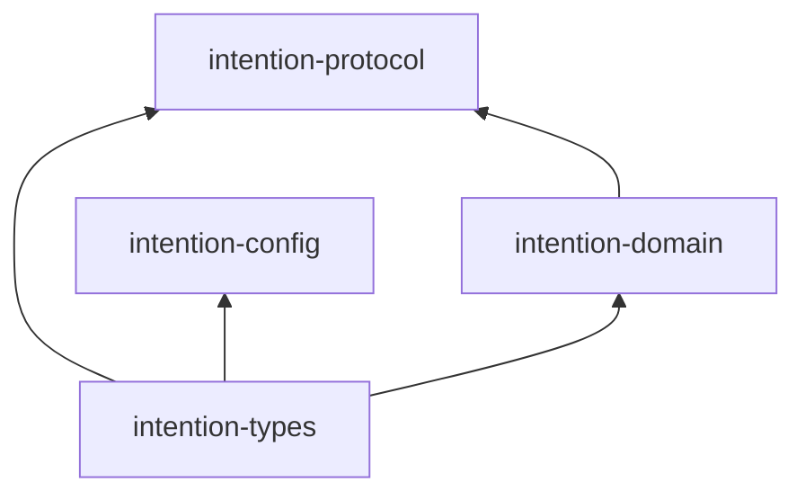

# Intention Relay

Intention Relay is a local-first, single-user Rust workspace for a daemon-owned
coding-agent system. The approved architecture, the quality foundation, and the
milestones M0 through M5 are closed, and the M5+ retrospective stack
(ADR 0037-0042: the provider control plane, the no-backward-compatibility
removal program, request-side tool advertisement, the opt-in live-provider
channel, the same-run reasoning round trip, and the project script library for
kernel cells) is merged. The
[implementation roadmap](docs/intention-relay/architecture/11-implementation-roadmap.md)
is the current delivery plan: milestones M6-M9 and the Mandate track M10-M12
remain to be executed, each behind its own approved activating specification.

The milestone sections below keep the milestone-era contract rationale (M1
workspace, M2 transport) and are historical where they describe planned work.

## M2 local daemon fixture

M2 activates `intention-transport`, `intention-client`, `intention-daemon`, and
the minimal `intention-tui` proof adapter. The daemon is reached through
cross-platform local IPC: Unix domain sockets on Unix and Windows named pipes
on Windows. Endpoint identifiers are logical safe names, derived below the
current user's platform runtime or application-configuration location; endpoint
filesystem paths never enter public DTOs or safe errors. On Unix, endpoint
parents are created with `0700` permissions and listener sockets with `0600`.
The mandatory CI matrix runs the per-phase gates on Linux and Windows
(`make ci-lint-arch` and `make ci-test` on both, plus the Linux-only
`ci-coverage-*`, `ci-selftest`, and `ci-deps` gates) and requires all nine
status checks; Windows executes the named-pipe transport fixture, while Unix
permission assertions remain platform-specific.

The private transport codec is bounded, length-prefixed UTF-8 JSON with a
maximum frame payload of 1 MiB. Each connection performs protocol hello, serves
one correlated request synchronously, returns one response, and closes. This
provides bounded per-connection work: a slow client can occupy only its own
serving thread and is subject to the underlying blocking I/O behavior; M2 does
not yet define subscription-buffer limits or a stronger slow-client policy.

`intention-client` first connects, then uses a cross-platform `fs4` advisory
startup lock to serialize a recheck, daemon-process launch when required, and
bounded readiness polling. Readiness requires compatible hello versions, the
required peer capabilities, a correlated health response at the negotiated
version, and `Ready`, not just a live process. M2 uses one request/response
connection at a time. Its stateful recovery handle reconnects through a fresh
connection using the latest accepted session sequence, then applies a
snapshot/tail or explicit resync; it does not claim a persistent live stream.
Idle shutdown, an explicit stop command, and daemon-upgrade coordination remain
deferred.

M2's composition facade is deliberately an in-memory, non-durable health and
session fixture. Durable sessions, event persistence, snapshots, queues, and
restart recovery are delivered by M3; model runs and provider execution are
delivered by M4. The
M2 protocol adds health/readiness, correlated request/response envelopes,
snapshot-and-tail or resync subscription recovery, and optional run-scoped
subscriptions. The TUI proof uses only the shared client in production and its
integration test reaches the same fixture daemon through that client.

## M1 workspace

The four active Tier-A crates establish public, DTO-first boundaries:

| Crate | M1 responsibility |
| --- | --- |
| `intention-types` | Validated IDs, schema versions, safe errors, time, pagination, and event envelopes. |
| `intention-domain` | Domain DTO/value validation, modes, lifecycle vocabulary, command/query shells, and domain events. |
| `intention-protocol` | Versioned local-protocol handshake, command/query wrappers, and compatibility checks. |
| `intention-config` | TOML parse, v0-to-v1 migration, validation, path selection, and redacted public configuration projection. |

At the M1 baseline every other planned v1 crate existed as a compile-only
skeleton. That made the approved crate map executable without introducing
premature implementations for later milestones; every crate in the map is
implemented today. `quality-harness` remains a non-production member that
continues to prove the quality pipeline.

The allowed active dependency graph is intentionally narrow:



## Configuration convention

`intention-config` accepts an explicit, validated absolute config-path override.
Without an override, it selects the platform-standard configuration directory
and appends `config.toml` (XDG-compatible on Linux). It never falls back to the
process working directory.

M1 configuration is TOML-only and schema-versioned. It supports a tested
v0-to-v1 migration fixture, returns typed safe errors for malformed or future
schemas, and exposes only redacted public projections. Open-text provider
credentials are deliberately kept in the private raw parsing layer. They are
not serialized in public DTOs, errors, snapshots, or diagnostics. The M1
provider contract accepts only `openrouter` and `generic-chat-completion-api`.

M1 also establishes the serializable credential-free `ConfigSnapshotDto`
foundation with a `ConfigRevisionId` and capture time. Configuration revision
persistence, daemon reload, and attaching an immutable snapshot to a run remain
deferred to M3-M4. The chosen direction is **new-run only** unless a later
typed and tested live transition is introduced.

## Quality workflow

Use the root Makefile for all quality work:

```text
make quick          # fast format, lint, and default test loop
make notices        # regenerate THIRD_PARTY_NOTICES.md intentionally
make notices-check  # verify notices match the locked dependency graph
make check          # all profiles, docs, and architecture checks
make verify         # check plus coverage, dependencies, and self-tests
make ci             # CI alias for verify
```

`make verify` is non-mutating. It requires pinned tools, a committed lockfile,
and no hidden dependency or tool installation.

## Documentation

- [`THIRD_PARTY_NOTICES.md`](THIRD_PARTY_NOTICES.md): generated license notices
  for registry dependencies in the committed Cargo lockfile.
- [`docs/intention-relay/`](docs/intention-relay/README.md): authoritative
  product baseline and target architecture.
- [`docs/intention-relay/architecture/`](docs/intention-relay/architecture/README.md):
  crate map, DTO policy, security/configuration policy, quality gates, TTD, and
  milestone roadmap.
- [`docs/intention-relay/reconciliation/`](docs/intention-relay/reconciliation/README.md):
  the post-M4 authority, compatibility, ownership, evidence, and
  delivery-boundary registers, including the review ledgers.
- [`docs/reference/`](docs/reference/README.md): preserved research material,
  not an implementation dependency.
