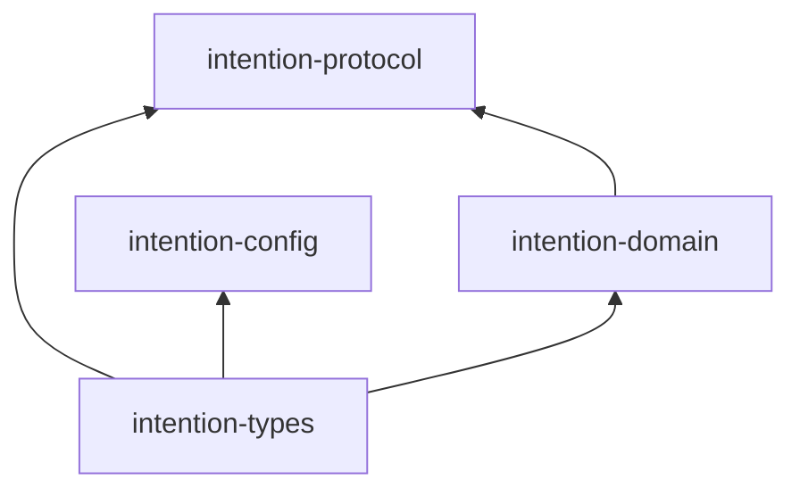

# Intention Relay

Intention Relay is a local-first, single-user Rust workspace for a daemon-owned
coding-agent system. The repository now contains the approved architecture,
M0 quality foundation, the **M1 contracts, configuration, and workspace
skeleton**, and the **M1+ quality policy hardening** that enforces workspace
graphs, executable test targets, public API signatures, and coverage-exception
semantics.

## M1 workspace

The four active Tier-A crates establish public, DTO-first boundaries:

| Crate | M1 responsibility |
| --- | --- |
| `intention-types` | Validated IDs, schema versions, safe errors, time, pagination, and event envelopes. |
| `intention-domain` | Domain DTO/value validation, modes, lifecycle vocabulary, command/query shells, and domain events. |
| `intention-protocol` | Versioned local-protocol handshake, command/query wrappers, and compatibility checks. |
| `intention-config` | TOML parse, v0-to-v1 migration, validation, path selection, and redacted public configuration projection. |

Every other planned v1 crate exists as a compile-only M1 skeleton. This makes
the approved crate map executable without introducing premature implementations
for later milestones. `quality-harness` remains a non-production member that
continues to prove the quality pipeline.

The allowed active dependency graph is intentionally narrow:



## Configuration convention

`intention-config` accepts an explicit, validated absolute config-path override.
Without an override, it selects the platform-standard configuration directory
and appends `config.toml` (XDG-compatible on Linux). It never falls back to the
process working directory.

M1 configuration is TOML-only and schema-versioned. It supports a tested
v0-to-v1 migration fixture, returns typed safe errors for malformed or future
schemas, and exposes only redacted public projections. Open-text provider
credentials are deliberately kept in the private raw parsing layer. They are
not serialized in public DTOs, errors, snapshots, or diagnostics. The M1
provider contract accepts only `openrouter` and `generic-chat-completion-api`.

M1 also establishes the serializable credential-free `ConfigSnapshotDto`
foundation with a `ConfigRevisionId` and capture time. Configuration revision
persistence, daemon reload, and attaching an immutable snapshot to a run remain
deferred to M3-M4. The chosen direction is **new-run only** unless a later
typed and tested live transition is introduced.

## Quality workflow

Use the root Makefile for all quality work:

```text
make quick   # fast format, lint, and default test loop
make check   # all profiles, docs, and architecture checks
make verify  # check plus coverage, dependencies, and self-tests
make ci      # CI alias for verify
```

`make verify` is non-mutating. It requires pinned tools, a committed lockfile,
and no hidden dependency or tool installation.

## Documentation

- [`docs/intention-relay/`](docs/intention-relay/README.md): authoritative
  product baseline and target architecture.
- [`docs/intention-relay/architecture/`](docs/intention-relay/architecture/README.md):
  crate map, DTO policy, security/configuration policy, quality gates, TTD, and
  milestone roadmap.
- [`docs/reference/`](docs/reference/README.md): preserved research material,
  not an implementation dependency.
