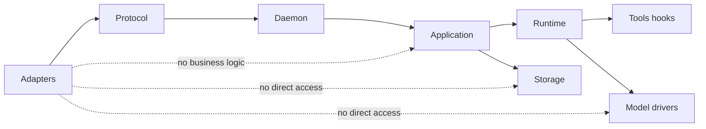

# Principles and Scope

## Status

**Decided architectural policy for v1.** This document defines the non-negotiable rules that all later architecture and implementation work must follow. Principles 1–11 govern v1, which is delivered through M5; principles 12–28 are the post-M5+ binding specification for the Mandate track and its ordinary-run extensions, and each is implemented only to the extent its owning milestone has landed.

## Scope

This document governs the application shape, ownership boundaries, v1 exclusions, and delivery mindset. Detailed contracts belong in [DTO and contract policy](02-dto-and-contract-policy.md); detailed crate ownership belongs in [Workspace and crate map](01-workspace-and-crate-map.md).

## Decided principles

### 1. Workspace, not a monolithic core

Intention Relay is a Rust workspace of small, logically grouped crates. The crate named `intention` is a composition root that creates factories and connects implementations. It is not a catch-all core crate.

### 2. DTO-first at every boundary

Every crate boundary, process boundary, persistence boundary, provider boundary, tool boundary, hook boundary, and adapter boundary exchanges explicit typed DTOs. Untyped maps, raw JSON, implementation records, SDK objects, and stringly typed identifiers are prohibited as contracts.

### 3. One daemon owns application runtime

A local single-user daemon is the only owner of active session actors, run actors, SQLite connections, model streams, tools, hooks, and event subscriptions. Adapters never own business runtime state.

### 4. Adapters share one contract

Tauri, TUI, and REPL use one typed local protocol through the shared `intention-client` crate. Tauri's Rust side is a minimal native bridge because a WebView cannot directly use the local typed socket protocol.

### 5. One active run per session

A session may have one active run only. Additional user turns are durably queued or explicitly rejected by policy, never silently merged into an active model context. The initial chosen v1 policy is a durable queue.

### 6. Local trusted workspace

A session has an obligatory `WorkspaceRoot`. All filesystem tools resolve paths against it, validate containment, and never fall back to process `pwd`. Process execution receives it as CWD. v1 is trusted local execution, not a sandbox.

### 7. Cross-cutting features use typed hooks

Workspace enforcement, VFR, Headroom/CCR, and plan-mode restrictions attach through an ordered, typed tool hook system. Base tools stay focused on their primitive work and do not hard-code extension behavior.

### 8. Automatic durable state

Sessions, turns, run transitions, artifacts, plans, todos, tool calls, and configuration revisions are automatically persisted. A successful state transition writes its current projection and immutable event in one transaction before publishing a live event.

### 9. Plan and Build are separate policies

Plan and Build share an agent loop but have distinct tool policies. Plan may read the workspace and mutates only its own physical plan artifact directory through filesystem tools. `execute` cannot be fully constrained and therefore has an explicit prompt policy, risk policy, and audit trail.

### 10. Test-driven delivery is architectural

A crate is not considered complete because it compiles or has unit tests. Each delivery slice begins with failing contract and outcome tests. Architecture rules must be encoded as executable checks where possible. See [Test-driven delivery and verification](10-test-driven-delivery-and-verification.md).

### 11. Reproducible quality gates are architectural

Before production functionality is accepted, the workspace must have a pinned toolchain, strict pragmatic linting, immediate tiered coverage requirements, feature-profile checks, documentation checks, architecture checks, and supply-chain verification. The root Makefile orchestrates these non-mutating gates. GitHub Actions runs the per-job aliases (`ci-lint-arch`, `ci-test`, `ci-coverage-default`, `ci-coverage-no-default`, `ci-coverage-all`, `ci-selftest`, `ci-deps`) as parallel matrix jobs in `.github/workflows/quality.yml`, and `make ci` is the local single-pass alias for the same full gate. See [Quality gates and Makefile](12-quality-gates-and-makefile.md).

## Scope boundaries

## Required v1 outcomes

The implementation must demonstrably provide:

1. Tauri and TUI/REPL can operate the same daemon-owned session without duplicating application logic.
2. A daemon restart marks an unfinished run as interrupted and exposes that result through the same contract.
3. A filesystem tool cannot escape its session `WorkspaceRoot` through relative paths, absolute paths, or process CWD fallback.
4. A Plan-mode agent can create and refine a physical plan, while normal write/edit tools cannot mutate the project outside that plan's directory.
5. VFR and Headroom can be enabled independently through hooks, preserve typed observability, and expose their supporting tools.
6. State visible to an adapter was committed before its corresponding live event was published.
7. Provider secrets cannot appear in transport events, persisted domain events, snapshots, diagnostics, or normal UI output.
8. `make verify` proves the applicable formatting, lint, feature, test, documentation, architecture, coverage, and supply-chain gates before an implementation slice is accepted.

## Explicit v1 non-goals

- Web interface, Telegram bot, remote API, HTTP/WebSocket transport, and cross-device access.
- Multiple users, accounts, roles, profiles, or remote authorization.
- Parallel runs in one session.
- Container/sandbox workspace isolation.
- Automatic continuation of interrupted model, tool, or shell processes after daemon restart.
- A general source editor, a proven LSP integration, or a Files panel.
- Direct user administration of MCP servers or direct manual sub-agent spawning.

## Implementation-required decisions

The following are required before their owning implementation slice begins.
The first table is settled by delivered work and names the current source of
truth; the second is still open and stays owned by the named slice.

### Settled by delivered work

| Topic | Settled decision and source |
| --- | --- |
| Queue execution | The repository atomically promotes the oldest eligible queued turn, tickets are never reused, removal and inspection stay explicit, and no automatic retry or resume exists ([architecture 04](04-sessions-runs-events-and-storage.md), "Queue"). |
| Risk policy | Build runs without a per-action confirmation barrier for configured active capabilities, while Plan keeps hard-denied project writes and an advisory-guided `execute` (decision [0017](../decisions/0017-build-autopilot-and-plan-focus-continuity.md)); the exact capability taxonomy and audit policy for `execute`, network, and destructive file actions remains listed as open in [architecture 05](05-tools-workspace-and-hooks.md). |
| AppData location | Production SQLite state lives in the platform AppData/state location with no process-CWD fallback (roadmap M3), and the migration half of the question is closed by the single-live-schema rule in [ADR 0038](../decisions/0038-no-backward-compatibility-and-legacy-removal.md). |
| Plan revision mechanics | Each edit rewrites the single full-file `plan.md` artifact, preserves controlled metadata, increments the frontmatter revision, and persists a matching typed plan revision ([architecture 07](07-plan-and-build-modes.md)); no patch-record family exists, and Plan mode itself is M7 scope. |
| Provider retries | Runtime owns at most one retry for a delayed or retryable provider failure before any durable fact, with a fixed 250 ms delay and `max_attempts` 1..=2 / `attempt_timeout_seconds` 1..=60 ([architecture 08](08-model-protocol-and-providers.md), [architecture 09](09-configuration-security-and-observability.md)). |

### Still open

| Topic | Decision required |
| --- | --- |
| Event retention | Retention, compaction, and replay thresholds for event logs and stream deltas. Closing it also needs one owner: [architecture 04](04-sessions-runs-events-and-storage.md) defers the policy, [architecture 09](09-configuration-security-and-observability.md) records it as its own open item, and the roadmap assigns closure to Milestone 9. |
| CCR backend | Initial memory/SQLite retention strategy, limits, and expiry behavior ([architecture 06](06-vfr-and-headroom.md), "Open decisions"). Milestone 8 owns the delivered backend. |

## Deferred decisions

- Remote adapter security and authentication.
- Multi-daemon or cloud synchronization.
- Plugin API for externally supplied tools.
- Ordinary-v1 background scheduled jobs. Future Mandate scheduler semantics are
  separately owned by architecture 16; recurring schedule syntax and worker
  topology remain deferred.
- Sandboxing, worktrees, or per-run filesystem isolation.

## Verification

Before implementation starts, the team must create the architectural test matrix described in [10-test-driven-delivery-and-verification.md](10-test-driven-delivery-and-verification.md) and the reproducible quality foundation described in [12-quality-gates-and-makefile.md](12-quality-gates-and-makefile.md). Every v1 principle above requires at least one executable test or a justified documented exception.

## Post-M4 foundation principles

The following principles (12–29) are the binding specification for the
post-M5+ Mandate track and the ordinary-run extensions that accompany it. They
govern future authoritative M4+ packages without changing closed M4 or current
ordinary-run behavior, and each is implemented only where a milestone has
landed: principle 27's provider-selection evidence is delivered by the M5+
Slice 2 control plane, while principles 12–26 and 28 are held by the Mandate
milestones (roadmap M10–M12) and their owning architecture documents 15–23.

### 12. Execution kinds are explicit

Future execution has a closed kind discriminator: `Ordinary`, `Mandate`, or
`VerifierMandate`. A record's kind, meaning version, and payload must agree
before dependent external work. New semantics are not inferred from model
names, current configuration, ancestry, prompts, Goals, Skills, or adapter
state.

### 13. Mandate authority is user-issued and bounded

A future Mandate is durable user-issued work authority. User commands own its
product lifecycle and revisions. The daemon owns only explicitly enumerated
operational facts such as durable trigger capture, admission, known terminal
disposition, and mandatory uncertainty pausing. A Goal, Skill, parent relation,
MCP source, provider response, bridge grant, kernel namespace, or activity
record cannot grant lifecycle, target-mutation, scheduling, or tool authority.

### 14. Continuation is fresh admission, never resumption

A future continuation may admit a new run from durable state. It never resumes,
reattaches, or repeats an old provider request, tool call, process, kernel task,
child work, MCP operation, bridge operation, or uncertain external effect.

### 15. Durable transitions and effects are separate

Future lifecycle/admission transitions atomically commit their projections,
events, snapshots, and idempotency evidence or commit nothing. External work
occurs after that transaction. Publication follows durable commit and an
independent scoped reread; publication failure cannot roll back committed state.

### 16. External uncertainty is explicit

A future external attempt distinguishes no-start, started, known terminal, and
unknown terminal facts. A known validation failure, provider failure, or
non-zero process exit is not automatically unknown. An `ExternalEffectUnknown`
pauses its owning Mandate and blocks automatic continuation until an authorized
future reconciliation records a fresh path or stop decision.

### 17. Compatibility is non-reinterpretation

M3/M4 and existing ordinary records remain readable under their recorded
semantics. They gain no synthetic Mandate, verifier, Skill, MCP, child, activity,
profile, policy, or execution-kind state. Current mutable configuration,
registry, provider/model naming, ancestry, and live resources cannot reconstruct
missing historical meaning.

### 18. Limits state their class

Future design distinguishes intrinsic bounds, capacity availability, and product
ceilings. Intrinsic bounds remain mandatory correctness or security constraints.
Capacity unavailability is typed and preserves its relevant pending work.
Product ceilings cannot be introduced as hidden future Mandate admission policy.
Existing numeric bounds retain their current behavior until a later owner
classifies their future applicability.

### 19. Mandate tool admission is direct but typed

For future Mandate execution, a descriptor frozen as active and model-visible
in immutable execution meaning admits directly after typed validation, mode,
hook, intrinsic-bound, idempotency, and live-readiness checks. Confirmation,
risk selectors, corridors, root-origin rules, quotas, and secondary tool
authority cannot veto it. This does not amend ordinary execution.

### 20. WorkspaceRoot is execution-kind-specific

Current ordinary containment remains authoritative. For future Mandate tool
work, WorkspaceRoot is the required relative-path base and `execute` initial
CWD, not an OS access boundary; explicit paths are not denied solely for being
outside it. Both forms forbid process-CWD fallback, and neither claims a
sandbox. Detailed rules are owned by architecture 15.

### 21. Scheduling is durable reevaluation, not authority

A future Mandate scheduler works only from durable reasons and typed readiness
evidence. It cannot grant lifecycle or tool authority, rebuild immutable meaning,
reserve capacity, or create hidden quotas/retry counters. Unavailability retains
the reason, and recovery completes before fresh admission. Detailed rules are
owned by architecture 16.

### 22. Child edges and verifier authority are explicit

Future child work uses immutable direct Mandate edges and credential-free
delegation snapshots. Parenthood grants only explicitly selected direct-child
controls and no implicit lifecycle, scheduler, tool, or verifier authority. A
verifier may mutate only an explicitly named target under separately user-issued
target-scoped authority, immutable baseline, and qualifying evidence. Detailed
rules are owned by architecture 17.

### 23. MCP capabilities are typed evidence, not authority

Future Mandate MCP work uses the one fixed `mcp` capability path to acquire and
invoke immutable run-local capabilities. An MCP server, discovery, capability,
or result cannot create lifecycle, scheduler, registry, child, verifier, or
user authority. Started uncertain MCP work never resumes. Detailed rules are
owned by architecture 18.

### 24. Gateway/RLM attachment is typed ingress, not authority

Future Gateway/RLM attachment uses one daemon-owned capability path, a frozen
credential-free bridge contract selection, and an ephemeral daemon-issued grant
bound to one active run/model step. A grant, channel, operation ID, facade,
kernel, provider, child, or MCP result cannot create lifecycle, scheduling, tool,
child, verifier, or reconciliation authority. Operation replay is idempotent and
read-only after binding; restart never resumes or reattaches old work. The bridge
is a trusted-local product control, not a sandbox or privilege boundary. Detailed
rules are owned by architecture 19 and decision 0011.
The authoritative source and package boundaries for these principles are the
[Post-M4 Authority Reconciliation](../reconciliation/README.md) and decision
records [0001](../decisions/0001-mandate-authority-and-fresh-run-lifecycle.md),
[0002](../decisions/0002-external-attempt-evidence-and-unknown-effect-reconciliation.md),
and [0003](../decisions/0003-run-execution-meaning-and-historical-compatibility.md),
and [0007](../decisions/0007-unified-tool-registry-and-direct-mandate-tool-admission.md),
and [0008](../decisions/0008-durable-mandate-scheduler-and-readiness-driven-admission.md),
and [0009](../decisions/0009-mandate-child-graph-and-delegated-verifier-authority.md),
and [0010](../decisions/0010-mandate-mcp-capability-lifecycle.md),
and [0011](../decisions/0011-mandate-gateway-rlm-bridge.md),
and [0012](../decisions/0012-ipython-kernel-lifecycle.md).

### 25. Kernel state is run-scoped convenience, not authority

Future IPython is a private daemon-managed sidecar with one kernel epoch per
Mandate run. A live namespace never crosses fresh admission; only an explicitly
selected verified checkpoint may seed a replacement kernel. Kernel state,
checkpoints, cells, background tasks, grants, and output cannot create lifecycle,
scheduling, tool, child, verifier, MCP, or reconciliation authority. The kernel
consumes the one Gateway/RLM and tool path and is not a sandbox or privilege
boundary. Detailed rules are owned by architecture 20 and decision 0012.

### 26. Context is immutable evidence, not authority

Future Goals, Skills, source manifests, model-step projections, memory cards,
disclosures, and compaction summaries are immutable non-authorizing evidence.
Project Goals apply to sessions only through explicit immutable applicability
links. Current files, catalogs, indexes, memory, configuration, UI, and runtime
state cannot reconstruct missing selected context. Safe representations never
widen their source audience, and compaction cannot replace durable facts or
become continuation state. Detailed rules are owned by architecture 21 and
decision 0013.

### 27. Provider selection is immutable compatibility evidence

Future provider profile, descriptor, capability, endpoint, credential-transport,
and driver-contract selections are credential-free immutable execution evidence,
not authority. Model names and current catalog/configuration/credential/driver
state cannot reconstruct, reroute, or replace stored meaning. Provider readiness
only supports scheduler reevaluation; it cannot create a reason, RunId, or
admission. Detailed rules are owned by architecture 22 and decision 0014.

### 28. Session branches are independent history, not rollback

A future ordinary Session fork creates a separate child Session with immutable
lineage and frozen context. It does not allow parallel runs within one Session,
rewrite a source Session, transfer authority, or claim rollback of workspace or
external state. Detailed rules are owned by architecture 23 and decision 0015.

### 29. Instructions are advisory deployment and project content, not authority

Every newly admitted run carries exactly one immutable effective instruction
projection, assembled from declared sources only: the daemon-packaged
instruction profile adapted from the legacy static prompt set, user-editable
fragments scoped to user, project, or session, the workspace `AGENTS.md` read
through the `WorkspaceRoot` boundary, and the reserved `Mode` and `Vfr`
contributions of architectures 07 and 06. Instruction text is bounded,
credential-free, and advisory: it cannot create, widen, or remove a tool
permission, provider selection, admission decision, Mandate, grant, or
confirmation requirement, and it cannot prove the absence of an external
effect. Skill bodies, memory records, tool output, repository content, and
provider output never enter the instruction channel. The projection is frozen
at admission, inherited verbatim by forks and handoffs, and never re-derived
from current state. Detailed rules are owned by
[architecture 30](30-instruction-sources-and-system-context.md) and
[decision 0043](../decisions/0043-instruction-sources-and-system-context.md).
