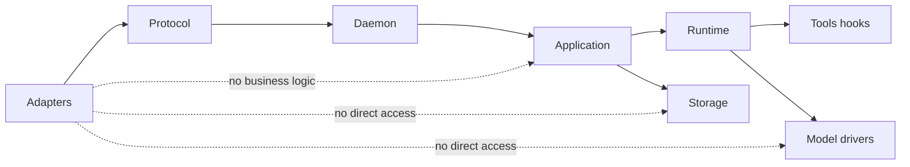

# Principles and Scope

## Status

**Decided architectural policy for v1.** This document defines the non-negotiable rules that all later architecture and implementation work must follow.

## Scope

This document governs the application shape, ownership boundaries, v1 exclusions, and delivery mindset. Detailed contracts belong in [DTO and contract policy](02-dto-and-contract-policy.md); detailed crate ownership belongs in [Workspace and crate map](01-workspace-and-crate-map.md).

## Decided principles

### 1. Workspace, not a monolithic core

Intention Relay is a Rust workspace of small, logically grouped crates. The crate named `intention` is a composition root that creates factories and connects implementations. It is not a catch-all core crate.

### 2. DTO-first at every boundary

Every crate boundary, process boundary, persistence boundary, provider boundary, tool boundary, hook boundary, and adapter boundary exchanges explicit typed DTOs. Untyped maps, raw JSON, implementation records, SDK objects, and stringly typed identifiers are prohibited as contracts.

### 3. One daemon owns application runtime

A local single-user daemon is the only owner of active session actors, run actors, SQLite connections, model streams, tools, hooks, and event subscriptions. Adapters never own business runtime state.

### 4. Adapters share one contract

Tauri, TUI, and REPL use one typed local protocol through the shared `intention-client` crate. Tauri's Rust side is a minimal native bridge because a WebView cannot directly use the local typed socket protocol.

### 5. One active run per session

A session may have one active run only. Additional user turns are durably queued or explicitly rejected by policy, never silently merged into an active model context. The initial chosen v1 policy is a durable queue.

### 6. Local trusted workspace

A session has an obligatory `WorkspaceRoot`. All filesystem tools resolve paths against it, validate containment, and never fall back to process `pwd`. Process execution receives it as CWD. v1 is trusted local execution, not a sandbox.

### 7. Cross-cutting features use typed hooks

Workspace enforcement, VFR, Headroom/CCR, and plan-mode restrictions attach through an ordered, typed tool hook system. Base tools stay focused on their primitive work and do not hard-code extension behavior.

### 8. Automatic durable state

Sessions, turns, run transitions, artifacts, plans, todos, tool calls, and configuration revisions are automatically persisted. A successful state transition writes its current projection and immutable event in one transaction before publishing a live event.

### 9. Plan and Build are separate policies

Plan and Build share an agent loop but have distinct tool policies. Plan may read the workspace and mutates only its own physical plan artifact directory through filesystem tools. `execute` cannot be fully constrained and therefore has an explicit prompt policy, risk policy, and audit trail.

### 10. Test-driven delivery is architectural

A crate is not considered complete because it compiles or has unit tests. Each delivery slice begins with failing contract and outcome tests. Architecture rules must be encoded as executable checks where possible. See [Test-driven delivery and verification](10-test-driven-delivery-and-verification.md).

### 11. Reproducible quality gates are architectural

Before production functionality is accepted, the workspace must have a pinned toolchain, strict pragmatic linting, immediate tiered coverage requirements, feature-profile checks, documentation checks, architecture checks, and supply-chain verification. The root Makefile orchestrates these non-mutating gates, and `make ci` is the sole CI verification gate after explicit runner setup. See [Quality gates and Makefile](12-quality-gates-and-makefile.md).

## Scope boundaries

## Required v1 outcomes

The implementation must demonstrably provide:

1. Tauri and TUI/REPL can operate the same daemon-owned session without duplicating application logic.
2. A daemon restart marks an unfinished run as interrupted and exposes that result through the same contract.
3. A filesystem tool cannot escape its session `WorkspaceRoot` through relative paths, absolute paths, or process CWD fallback.
4. A Plan-mode agent can create and refine a physical plan, while normal write/edit tools cannot mutate the project outside that plan's directory.
5. VFR and Headroom can be enabled independently through hooks, preserve typed observability, and expose their supporting tools.
6. State visible to an adapter was committed before its corresponding live event was published.
7. Provider secrets cannot appear in transport events, persisted domain events, snapshots, diagnostics, or normal UI output.
8. `make verify` proves the applicable formatting, lint, feature, test, documentation, architecture, coverage, and supply-chain gates before an implementation slice is accepted.

## Explicit v1 non-goals

- Web interface, Telegram bot, remote API, HTTP/WebSocket transport, and cross-device access.
- Multiple users, accounts, roles, profiles, or remote authorization.
- Parallel runs in one session.
- Container/sandbox workspace isolation.
- Automatic continuation of interrupted model, tool, or shell processes after daemon restart.
- A general source editor, a proven LSP integration, or a Files panel.
- Direct user administration of MCP servers or direct manual sub-agent spawning.

## Implementation-required decisions

The following are required before their owning implementation slice begins, but are not settled by this document:

| Topic | Decision required |
| --- | --- |
| Queue execution | Exact promotion, deletion, and retry behavior for queued user turns. |
| Risk policy | The precise list of actions that require a confirmation in Build or Plan mode. |
| AppData location | Platform-specific path resolution and migration strategy. |
| Plan revision mechanics | Whether an edit produces a full file revision, a patch record, or both. |
| Event retention | Retention, compaction, and replay thresholds for event logs and stream deltas. |
| CCR backend | Initial memory/SQLite retention strategy, limits, and expiry behavior. |
| Provider retries | Ownership and policy for provider retryable errors and backoff. |

## Deferred decisions

- Remote adapter security and authentication.
- Multi-daemon or cloud synchronization.
- Plugin API for externally supplied tools.
- Background scheduled jobs.
- Sandboxing, worktrees, or per-run filesystem isolation.

## Verification

Before implementation starts, the team must create the architectural test matrix described in [10-test-driven-delivery-and-verification.md](10-test-driven-delivery-and-verification.md) and the reproducible quality foundation described in [12-quality-gates-and-makefile.md](12-quality-gates-and-makefile.md). Every v1 principle above requires at least one executable test or a justified documented exception.
