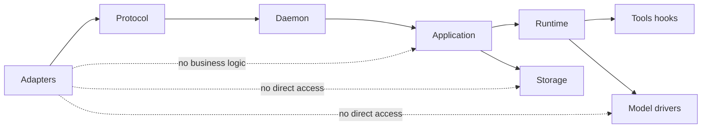

# Principles and Scope

**Current policy.** Principles 1–11 govern v1, delivered through M5. Principles 12–22 govern the post-M4+ extension
packages, each implemented only where its owning milestone has landed.

This document governs the application shape, ownership boundaries, v1 exclusions, and delivery mindset. Detailed
contracts belong to [DTO and contract policy](02-dto-and-contract-policy.md); crate ownership to [Workspace and crate
map](01-workspace-and-crate-map.md).

## Decided principles

### 1. Workspace, not a monolithic core

Intention Relay is a Rust workspace of small, logically grouped crates. `intention` is a composition root that creates
factories and connects implementations, not a catch-all core crate.

### 2. DTO-first at every boundary

Every crate, process, persistence, provider, tool, hook, and adapter boundary exchanges explicit typed DTOs. Untyped
maps, raw JSON, implementation records, SDK objects, and stringly typed identifiers are prohibited as contracts.

### 3. One daemon owns application runtime

A local single-user daemon is the only owner of active session actors, run actors, SQLite connections, model streams,
tools, hooks, and subscriptions. Adapters never own business runtime state.

### 4. Adapters share one contract

Tauri, TUI, and REPL use one typed local protocol through the shared `intention-client` crate. Tauri's Rust side is a
minimal native bridge because a WebView cannot directly use the local typed socket protocol.

### 5. One active run per session

A session may have one active run only. A user turn accepted while that run is active is recorded as a durable pending
turn and joins the run's live context in order at the next model boundary; it never starts a second run and never
silently merges into an in-flight request.

### 6. Local trusted workspace

A session has an obligatory `WorkspaceRoot`. All filesystem tools resolve paths against it, reject absolute and parent
(`..`) paths at the typed input, and never fall back to process `pwd`. Process execution receives it as CWD. The root is
an addressing anchor, not a containment boundary: a path may leave it through a symbolic link, and v1 is trusted local
execution, not a sandbox ([architecture 05](05-tools-workspace-and-hooks.md)).

### 7. Cross-cutting features use typed hooks

Workspace enforcement, VFR, Headroom/CCR, and plan-mode restrictions attach through an ordered, typed tool hook system.
Base tools stay focused on their primitive work and do not hard-code extension behavior.

### 8. Automatic durable state

Sessions, turns, run transitions, artifacts, plans, todos, tool calls, and configuration revisions are automatically
persisted. A successful state transition commits its change in one SQLite transaction before any live frame is
published.

### 9. Plan and Build are separate policies

Plan and Build share an agent loop but have distinct tool policies. Plan may read the workspace and mutates only its own
physical plan artifact directory through filesystem tools. `execute` cannot be fully constrained and therefore has an
explicit prompt policy, risk policy, and audit trail.

### 10. Test-driven delivery is architectural

A crate is not considered complete because it compiles or has unit tests. Each delivery slice begins with failing
contract and outcome tests. Architecture rules must be encoded as executable checks where possible. See [Test-driven
delivery and verification](10-test-driven-delivery-and-verification.md).

### 11. Reproducible quality gates are architectural

Before production functionality is accepted, the workspace must have a pinned toolchain, strict pragmatic linting, the
per-crate line-coverage tiers, feature-profile checks,
documentation checks, architecture checks, and supply-chain verification. The root Makefile orchestrates these
non-mutating gates. GitHub Actions runs the per-job aliases (`ci-lint-arch`, `ci-test`, `ci-coverage-default`,
`ci-coverage-no-default`, `ci-coverage-all`, `ci-deps`) as parallel matrix jobs in `.github/workflows/quality.yml`, and
`make ci` is the local single-pass alias for the same full gate. See [Quality gates and
Makefile](12-quality-gates-and-makefile.md).

## Scope boundaries

```mermaid
flowchart LR
  AD[Adapters] --> PR[Protocol]
  PR --> DM[Daemon]
  DM --> AP[Application]
  AP --> RT[Runtime]
  RT --> TO[Tools hooks]
  RT --> MO[Model drivers]
  AP --> DB[Storage]

  AD -. no business logic .-> AP
  AD -. no direct access .-> DB
  AD -. no direct access .-> MO
```

## Required v1 outcomes

The implementation must demonstrably provide:

1. Tauri and TUI/REPL can operate the same daemon-owned session without duplicating application logic.
2. A daemon restart marks an unfinished run as interrupted and exposes that result through the same contract.
3.  A filesystem tool cannot escape its session `WorkspaceRoot` through relative paths, absolute paths, or process CWD
fallback.
4.  A Plan-mode agent can create and refine a physical plan, while normal write/edit tools cannot mutate the project
outside that plan's directory.
5.  VFR and Headroom can be enabled independently through hooks, preserve typed observability, and expose their
supporting tools.
6. State visible to an adapter was committed before its corresponding live frame was published.
7.  Provider secrets cannot appear in transport frames, persisted state, diagnostics, or normal UI output.
8.  `make verify` proves the applicable formatting, lint, feature, test, documentation, architecture, coverage, and
supply-chain gates before an implementation slice is accepted.

## Explicit v1 non-goals

Web interface, Telegram bot, remote API, HTTP/WebSocket transport, cross-device access, multiple
users/accounts/roles/profiles/remote authorization, parallel runs in one session, container/sandbox workspace isolation,
automatic continuation of interrupted model, tool, or shell processes after daemon restart, a general source editor or
proven LSP integration or Files panel, and direct user administration of MCP servers or direct manual sub-agent
spawning.

## Implementation-required decisions

The following are required before their owning implementation slice begins. The first table is settled by delivered
work; the second stays owned by the named slice.

### Settled by delivered work

| Topic | Settled decision and source |
| --- | --- |
| Turn input | A user turn accepted during an active run is recorded as a durable pending turn and joins that run's live context in FIFO order at the next model boundary; removal of a not-yet-seen pending turn stays explicit, `run.interrupt` stops the in-flight call with a notice while the run continues, and no automatic retry or resume exists ([architecture 04](04-sessions-runs-events-and-storage.md), "Pending turns"). |
| Risk policy | Build runs without a per-action confirmation barrier for configured active capabilities, while Plan keeps hard-denied project writes and an advisory-guided `execute` ([architecture 07](07-plan-and-build-modes.md)); the exact capability taxonomy and audit policy for `execute`, network, and destructive file actions remains listed as open in [architecture 05](05-tools-workspace-and-hooks.md). |
| AppData location | Production SQLite state lives in the platform AppData/state location with no process-CWD fallback (roadmap M3), and the migration half of the question is closed by the single-live-schema rule. |
| Schema history | The existence of databases is not an argument for keeping DB migrations or old-schema compatibility; every versioned system keeps exactly one live version and evolves in place. |
| Plan revision mechanics | Each edit rewrites the single full-file `plan.md` artifact, preserves controlled metadata, increments the frontmatter revision, and persists a matching typed plan revision ([architecture 07](07-plan-and-build-modes.md)); no patch-record family exists, and Plan mode itself is M7 scope. |
| Provider retries | Runtime owns at most one retry for a delayed or retryable provider failure before any durable fact, with a fixed 250 ms delay and `max_attempts` 1..=2 / `attempt_timeout_seconds` 1..=60 ([architecture 08](08-model-protocol-and-providers.md), [architecture 09](09-configuration-security-and-observability.md)). |

### Still open

| Topic | Decision required |
| --- | --- |
| Transcript retention | Retention and compaction policy for transcript rows and stream deltas. Closing it also needs one owner: [architecture 04](04-sessions-runs-events-and-storage.md) defers the policy, [architecture 09](09-configuration-security-and-observability.md) records it as its own open item, and the roadmap assigns closure to Milestone 9. |
| CCR backend | Initial memory/SQLite retention strategy, limits, and expiry behavior ([architecture 06](06-vfr-and-headroom.md), "Open decisions"). Milestone 8 owns the delivered backend. |

## Deferred decisions

Remote adapter security and authentication; multi-daemon or cloud synchronization; a plugin API for externally supplied
tools; ordinary-v1 background scheduled jobs, including recurring schedule syntax and worker topology; sandboxing,
worktrees, or per-run filesystem isolation.

## Verification

Before implementation starts, the team must create the architectural test matrix described in
[10-test-driven-delivery-and-verification.md](10-test-driven-delivery-and-verification.md) and the reproducible quality
foundation described in [12-quality-gates-and-makefile.md](12-quality-gates-and-makefile.md). Every v1 principle above
requires at least one executable test or a justified documented exception.
