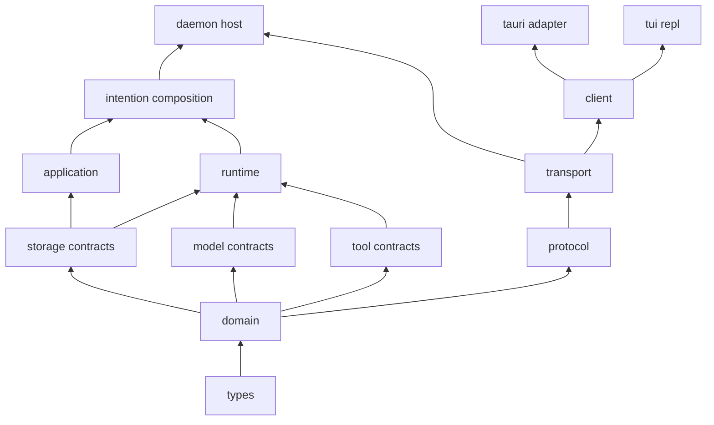

# Workspace and Crate Map

## Scope

This document assigns ownership within the Rust workspace and defines allowed dependency directions. It implements the workspace principle in [00 Principles and Scope](00-principles-and-scope.md) and the DTO-first rule in [02 DTO and Contract Policy](02-dto-and-contract-policy.md).

## Rules

- Each crate owns one cohesive responsibility and exposes DTO-based public contracts.
- Dependency cycles are forbidden.
- An adapter may depend on `intention-client` and presentation-only crates, never on application, runtime, storage implementation, tools, or provider implementations.
- Concrete drivers are selected only by the composition root.
- Feature flags may choose implementations, but may not make the public contract type-unstable.
- M1 establishes the `ConfigRevisionId` and credential-free `ConfigSnapshotDto` contract foundation only. Revision persistence, daemon reload, and attaching a snapshot to a run remain later ownership.
- `quality/architecture.toml` is the machine-readable source for active-crate external dependencies, executable integration test targets, adapter and protocol allowlists, composition-only implementations, and forbidden public-contract type prefixes.

## Planned crates

| Crate | Owns | May depend on |
| --- | --- | --- |
| `intention-types` | ID newtypes, schema versions, common errors, time, pagination, envelopes. | Minimal shared dependencies only. |
| `intention-domain` | Domain DTOs, value validation, domain events, invariants. | `intention-types`. |
| `intention-application` | Commands, queries, use-case workflows, transaction orchestration. | Domain, storage contracts, runtime contracts. |
| `intention-runtime` | Session/run actors, model loop coordination, cancellation, lifecycle. | Domain, model contracts, tool contracts, storage contracts, hook contracts. |
| `intention-storage` | Repository and unit-of-work DTO traits, snapshots, event-log contracts. | Domain, types. |
| `intention-storage-sqlite` | SQLite schema, migrations, repository implementation, projections. | Storage, domain, types. |
| `intention-config` | TOML parsing, validation, migrations, resolved config/snapshot DTOs. | Types, domain as needed. |
| `intention-model` | Provider-neutral model DTOs and driver trait. | Types, domain DTOs where required. |
| `intention-provider-openrouter` | OpenRouter SDK translation. | Model, config, types. |
| `intention-provider-generic-chat` | Generic Chat Completion translation. | Model, config, types. |
| `intention-tools` | Registry, core tool contracts, tool DTOs, execution interfaces. | Domain, types. |
| `intention-workspace` | WorkspaceRoot policy, paths, process CWD preparation. | Tools, hooks, domain, types. |
| `intention-hooks` | Typed hook phases, ordering, contexts, dispatcher. | Tools, domain, types. |
| `intention-vfr` | VFR hook, mapping, expansion/raw-read tools. | Hooks, tools, domain, types. |
| `intention-headroom` | Headroom hook, CCR contracts, retrieve tool. | Hooks, tools, storage contracts, domain, types. |
| `intention-plans` | Plan artifacts, hidden frontmatter, Plan/Build policy hooks. | Hooks, tools, storage contracts, domain, types. |
| `intention-protocol` | Versioned public transport commands, queries, events. | Domain, types. |
| `intention-transport` | Socket/pipe framing, server/client protocol, subscriptions. | Protocol, types. |
| `intention-client` | Bootstrap, connection, dispatch, subscription, reconnect. | Protocol, transport, types. |
| `intention-daemon` | Daemon host binary: process lifecycle and typed connection hosting. | `intention` composition facade, transport, protocol, types. |
| `intention` | Composition root library: factories, dependency wiring, and daemon application facade. | All selected concrete implementations. |
| `intention-tauri` | Tauri bootstrap and native bridge. | Client, protocol, presentation DTO mapping. |
| `intention-tui` | TUI and REPL presentation adapters. | Client, protocol, presentation crates. |

## Dependency direction

<!-- Arrows show permitted lower-level dependencies toward a consumer. Composition is the sole wiring location. -->

## Composition rules

`intention` creates and connects:

- resolved TOML configuration;
- SQLite storage implementation;
- selected provider drivers;
- core tool registry;
- workspace, plan, VFR, and Headroom hook registrations;
- application facade and runtime actor factories;
- a daemon application facade that `intention-daemon` hosts over transport.

`intention-daemon` depends on this composition facade, never the reverse. This preserves an acyclic graph: composition selects concrete implementations, while the thin binary only owns process lifecycle and typed connection hosting.

No other crate chooses a concrete SQLite driver, OpenRouter client, or adapter implementation by global construction.

## Binaries

Planned binaries should be thin:

- `intention-daemon`: starts a configured daemon host.
- `intention-tui`: starts a terminal client and invokes shared bootstrap.
- a future administrative CLI may use `intention-client`, not daemon internals.

`intention-tauri` is a desktop integration crate/binary host. It must not become a second daemon implementation.

## Architectural test requirements

The workspace must have tests that fail when these rules are broken:

1. no cyclic crate dependencies;
2. the required v1 crate set exists, and every crate has a single declared responsibility;
3. adapters do not import forbidden implementation crates or declare forbidden workspace/external dependencies;
4. only `intention` selects concrete storage/provider/tool extension implementations;
5. `intention-protocol` has no dependency on Tauri, SQLite, provider SDKs, or UI crates;
6. public cross-crate methods accept/return DTOs, not implementation resources or provider SDK types;
7. every planned crate has a stated test target before implementation begins;
8. every declared boundary has an isolated expected-failure fixture in the quality self-test.

The exact test strategy and minimum test portfolio are defined in [10 Test-Driven Delivery and Verification](10-test-driven-delivery-and-verification.md). The mandatory pinned tooling, coverage tiers, feature profiles, lint policy, and Makefile/CI contract are defined in [12 Quality Gates and Makefile](12-quality-gates-and-makefile.md).

## Non-goals

This map does not freeze individual module names, file names, Cargo feature syntax, or exact trait method signatures. Those are implementation choices that must preserve these ownership and dependency rules.
