# Workspace and Crate Map

## Scope

This document assigns ownership within the Rust workspace and defines allowed dependency directions. It implements the workspace principle in [00 Principles and Scope](00-principles-and-scope.md) and the DTO-first rule in [02 DTO and Contract Policy](02-dto-and-contract-policy.md).

## Rules

- Each crate owns one cohesive responsibility and exposes DTO-based public contracts.
- Dependency cycles are forbidden.
- An adapter may depend on `intention-client` and presentation-only crates, never on application, runtime, storage implementation, tools, or provider implementations.
- Concrete drivers are selected only by the composition root.
- Feature flags may choose implementations, but may not make the public contract type-unstable.
- M1 establishes the `ConfigRevisionId` and credential-free `ConfigSnapshotDto` contract foundation. M3 makes `ConfigSnapshotDto` the canonical credential-free persisted configuration selection: the composition root supplies one startup snapshot, storage records it by revision, and each accepted or promoted run retains its immutable revision. TOML is applied only at daemon startup; live reload remains deferred.
- M3 activates `intention-application`, `intention-runtime`, `intention-storage`, and `intention-storage-sqlite`. The active graph adds the intentional `storage -> config`, `storage-sqlite -> config`, `application -> config`, and `runtime -> config` edges required to persist and attach canonical snapshots without exposing credentials or filesystem paths.
- M4 activates Tier C `intention-model`, `intention-provider-openrouter`, and `intention-provider-generic-chat`. The model crate remains provider-neutral and depends only on `intention-types`; provider crates depend only on model/config/types plus their private SDK. `intention-types` owns the provider-neutral `UsageDto`, `FinishReasonDto`, `ToolCallDto`, and `ProviderErrorDto` shared by model and durable domain facts; `intention-model` retains compatibility re-exports. Only `intention` may select either concrete provider.
- M4 durable model facts remain domain-owned: domain, storage, and protocol never depend on `intention-model`; SQLite stores typed domain-event envelopes and indexes them by dedicated per-run cursor. `intention-runtime` depends on the provider-neutral `intention-model` contract only for its injected base execution service; it neither selects a concrete provider nor exposes an async runtime resource.
- M4 activates the daemon host as a private composition consumer. `intention-daemon` may depend on the composition facade plus the DTO/application/runtime/model/protocol/transport/type crates needed to host selected execution and streaming, and on private Tokio/future support. It never depends directly on a concrete provider or storage implementation, selects no provider, and exposes no provider SDK, credential, Tokio, or storage resource in its public contract.

## Planned crates

| Crate | Owns | May depend on |
| --- | --- | --- |
| `intention-types` | ID newtypes, schema versions, common errors, time, pagination, envelopes. | Minimal shared dependencies only. |
| `intention-domain` | Domain DTOs, value validation, domain events, invariants. | `intention-types`. |
| `intention-application` | Commands, queries, semantic use-case workflows, and protocol-result mapping over DTO-only storage. | Domain, storage contracts, runtime contracts, config snapshots, protocol, types. |
| `intention-runtime` | Deterministic session/run lifecycle decisions, cancellation, terminal promotion, and recovery-before-ready. | Domain, storage contracts, config snapshots, types. |
| `intention-storage` | DTO-only semantic repository methods, atomic committed-change evidence, snapshots, event-log contracts, and persisted config-snapshot inputs. | Config, domain, types. |
| `intention-storage-sqlite` | Bundled SQLite schema, `rusqlite_migration` migrations, semantic repository implementation, projections, per-state snapshots, and append-only event persistence. | Storage, config, domain, types. |
| `intention-config` | TOML parsing, validation, migrations, resolved config/snapshot DTOs. | Types, domain as needed. |
| `intention-model` | Provider-neutral model DTOs and driver trait. | Types, domain DTOs where required. |
| `intention-provider-openrouter` | OpenRouter SDK translation. | Model, config, types. |
| `intention-provider-generic-chat` | Generic Chat Completion translation. | Model, config, types. |
| `intention-tools` | Registry, core tool contracts, tool DTOs, execution interfaces. | Domain, types. |
| `intention-workspace` | WorkspaceRoot policy, paths, process CWD preparation. | Tools, hooks, domain, types. |
| `intention-hooks` | Typed hook phases, ordering, contexts, dispatcher. | Tools, domain, types. |
| `intention-vfr` | VFR hook, mapping, expansion/raw-read tools. | Hooks, tools, domain, types. |
| `intention-headroom` | Headroom hook, CCR contracts, retrieve tool. | Hooks, tools, storage contracts, domain, types. |
| `intention-plans` | Plan artifacts, hidden frontmatter, Plan/Build policy hooks. | Hooks, tools, storage contracts, domain, types. |
| `intention-protocol` | Versioned public transport commands, queries, events. | Domain, types. |
| `intention-transport` | Socket/pipe framing, server/client protocol, subscriptions. | Protocol, types. |
| `intention-client` | Bootstrap, connection, dispatch, subscription, reconnect. | Protocol, transport, types. |
| `intention-daemon` | Daemon host binary: process lifecycle, private model-task registry, and typed connection/stream hosting. | Composition facade; application/runtime/model/domain/protocol/transport/type DTO contracts; private Tokio/future support. Never concrete provider or storage implementations. |
| `intention` | Composition root library: factories, dependency wiring, and daemon application facade. | All selected concrete implementations. |
| `intention-tauri` | Tauri bootstrap and native bridge. | Client, protocol, presentation DTO mapping. |
| `intention-tui` | TUI and REPL presentation adapters. | Client, protocol, presentation crates. |

## Dependency direction

```mermaid
flowchart BT
  TY[types] --> DO[domain]
  TY --> CF[config]
  DO --> ST[storage contracts]
  CF --> ST
  DO --> MO[model contracts]
  DO --> TL[tool contracts]
  DO --> PR[protocol]
  CF --> AP[application]
  CF --> RT[runtime]
  ST --> AP
  ST --> RT
  MO --> RT
  TL --> RT
  ST --> SQ[SQLite storage]
  CF --> SQ
  DO --> SQ
  AP --> IN[intention composition]
  RT --> IN
  SQ --> IN
  IN --> DH[daemon host]
  AP --> DH
  RT --> DH
  MO --> DH
  DO --> DH
  PR --> TR[transport]
  TR --> DH
  TR --> CL[client]
  CL --> TA[tauri adapter]
  CL --> TU[tui repl]
```

<!-- Arrows show permitted lower-level dependencies toward a consumer. Composition is the sole wiring location. -->

## M3 ownership decisions

- `intention-storage` defines semantic, DTO-only operations such as create session, accept or remove a queued turn, transition a run with mandatory oldest-queued promotion after every terminal state, recovery, snapshot/tail reads, and configuration-snapshot acceptance. It does not expose a transaction closure, SQL connection, filesystem path, or backend resource.
- `intention-storage-sqlite` owns bundled SQLite opening, schema migration through `rusqlite_migration`, transactional projection/event/snapshot writes, and SQLite-only fault injection. It persists one canonical `WorkspaceId -> WorkspaceRootDto` association; workspace containment remains M5 policy ownership.
- `intention-runtime` decides valid state edges and performs the required `Starting -> Cancelling -> Cancelled` cancellation path. The repository, not runtime or callers, atomically chooses the lowest queue ticket after every terminal transition, including recovery. It has no provider, tool, timer, stream, or scheduler dependency in M3.
- `intention-test-support` is a non-production workspace crate. It owns credential-free fixture configuration, native temporary roots under `std::env::temp_dir()`, `TempDir`-backed durable databases, deterministic sessions, and bounded fixture listener orchestration. `intention` exposes only hidden `test-support` facade seams for an injected database/snapshot and durable-event inspection; `intention-daemon` exposes only a hidden one-connection dispatch seam. Release production APIs and the daemon binary expose no fixture mode.

## Composition rules

`intention` creates and connects:

- resolved TOML configuration;
- SQLite storage implementation;
- selected provider drivers;
- core tool registry;
- workspace, plan, VFR, and Headroom hook registrations;
- application facade and runtime actor factories;
- a daemon application facade that `intention-daemon` hosts over transport.

`intention-daemon` depends on this composition facade, never the reverse. Its M4
private host may also consume DTO/application/runtime/model contracts to own the
task registry, cancellation, and streaming transport loop, but it never imports
or selects concrete provider/storage implementations. This preserves an acyclic
graph: composition selects concrete implementations, while the binary owns
process lifecycle and typed connection hosting.

No other crate chooses a concrete SQLite driver, OpenRouter client, or adapter implementation by global construction.

## Binaries

Planned binaries should be thin:

- `intention-daemon`: starts a configured daemon host.
- `intention-tui`: starts a terminal client and invokes shared bootstrap.
- a future administrative CLI may use `intention-client`, not daemon internals.

`intention-tauri` is a desktop integration crate/binary host. It must not become a second daemon implementation.

## Architectural test requirements

The workspace must have tests that fail when these rules are broken:

1. no cyclic crate dependencies;
2. the required v1 crate set exists, and every crate has a single declared responsibility;
3. adapters do not import forbidden implementation crates or declare forbidden workspace/external dependencies;
4. only `intention` selects concrete storage/provider/tool extension implementations;
5. `intention-protocol` has no dependency on Tauri, SQLite, provider SDKs, or UI crates;
6. public cross-crate methods accept/return DTOs, not implementation resources or provider SDK types;
7. every planned crate has a stated test target before implementation begins;
8. every declared boundary has an isolated expected-failure fixture in the quality self-test.

The exact test strategy and minimum test portfolio are defined in [10 Test-Driven Delivery and Verification](10-test-driven-delivery-and-verification.md). The mandatory pinned tooling, coverage tiers, feature profiles, lint policy, and Makefile/CI contract are defined in [12 Quality Gates and Makefile](12-quality-gates-and-makefile.md).

## Non-goals

This map does not freeze individual module names, file names, Cargo feature syntax, or exact trait method signatures. Those are implementation choices that must preserve these ownership and dependency rules.

## Post-M4 prospective ownership boundary

This section records future layer ownership only. It neither creates a crate nor
activates an existing skeleton. `quality/architecture.toml` remains the sole
machine-readable future-crate placeholder registry; coverage and feature policy
remain activation-time projections.

| Concern | Future layer owner | Required boundary |
| --- | --- | --- |
| Mandate IDs, revisions, lifecycle values, trigger/disposition values | Domain/types | Typed, credential-free values and invariants. |
| Admission workflows, user/daemon conflict handling, recovery decisions | Application/runtime | DTO-only storage and capability contracts. |
| Atomic lifecycle/attempt persistence and recovery facts | Storage | No transaction/resource leaks. |
| Public commands, queries, events, and future negotiated replay | Protocol | No runtime, SDK, storage, or adapter resources. |
| Registry and one capability invocation path | Tools/gateway | Composition-only concrete assembly. |
| Scheduler readiness/candidate values | Domain/types | Typed, credential-free operational evidence. |
| Scheduler reevaluation and admission orchestration | Application/runtime | Lifecycle-owned admission only; no second runtime. |
| Scheduler observations and decision evidence | Storage | Atomic persistence without resource leaks. |
| Child edges, delegation, verifier authority, and audit values | Domain/types | Typed, credential-free values and invariants. |
| Child/verifier orchestration and target mutation | Application/runtime | Lifecycle-owned transitions and DTO-only storage. |
| MCP source, capability, selection, and invocation values | Domain/types | Typed, credential-free values and invariants. |
| MCP discovery/invocation orchestration and recovery | Application/runtime | One registry path and DTO-only storage. |
| Kernel IDs, selections, checkpoint metadata, and safe projections | Domain/types | Typed, credential-free values and no Python/Jupyter resources. |
| Kernel epoch/cell/checkpoint lifecycle and recovery | Application/runtime | Bridge/tool-loop consumption only; no lifecycle or registry authority. |
| Private Python/Jupyter sidecar translation | Private daemon adapter | No public resource types, no second listener, and no direct primitive path. |
| Process/task ownership, identity assignment, publication | Daemon | No product-decision authority. |
| Concrete provider/tool/storage selection | Composition | The only concrete assembler. |
| Presentation and typed user input | Adapters | No local business authority or bypass. |

Architectures 17, 18, and 20 own future child/verifier, MCP, and kernel
semantics but activate no crate or dependency edge. Kernel activation must split
typed contracts, lifecycle orchestration, and private Python/Jupyter translation
without exposing implementation resources. Skill, provider-profile, and fork
boundaries remain separate delivery decisions. Any split must preserve this
acyclic direction, DTO-first contracts, a declared test target, a coverage tier,
and isolated architecture fixtures before production activation.

Architecture 16 creates no scheduler crate or dependency edge. Exact crate
allocation remains activation-time work.

See [decision 0004](../decisions/0004-rust-owned-capability-plane-and-fixed-tool-registry.md)
and the [ownership map](../reconciliation/ownership-and-dependency-map.md).
