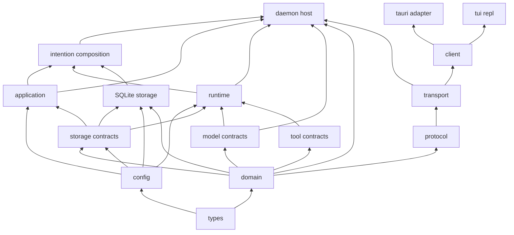
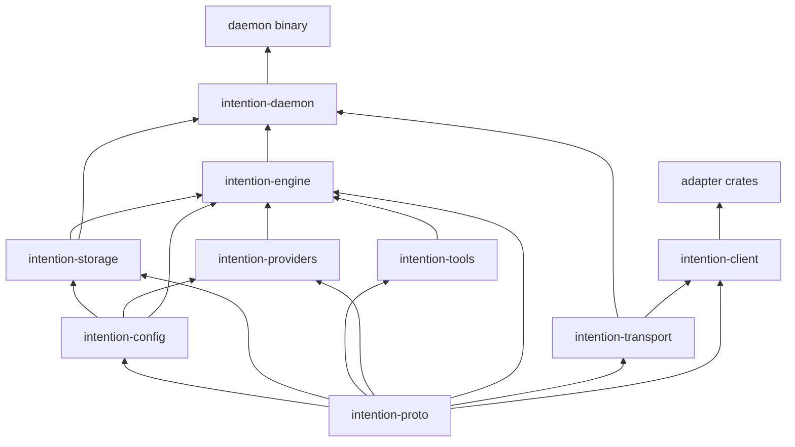

# Workspace and Crate Map

**Current policy.**

This document assigns ownership within the Rust workspace and defines allowed dependency directions. It implements the
workspace principle in [00 Principles and Scope](00-principles-and-scope.md) and the DTO-first rule in [02 DTO and
Contract Policy](02-dto-and-contract-policy.md).

## Rules

- Each crate owns one cohesive responsibility and exposes DTO-based public contracts.
- Dependency cycles are forbidden.
-  An adapter may depend on `intention-client` and presentation-only crates, never on application, runtime, storage
implementation, tools, or provider implementations.
- Concrete drivers are selected only by the composition root.
- Feature flags may choose implementations, but may not make the public contract type-unstable.
-  M1 establishes the `ConfigRevisionId` and credential-free configuration-snapshot contract foundation. M3 makes
`ConfigSnapshotDto` the canonical credential-free persisted configuration selection: the composition root supplies one
startup snapshot, storage records it by `ConfigRevisionId`, and each accepted run retains its immutable revision. TOML
is applied only at daemon startup; live reload remains deferred.
-  M3 activates the engine and storage layers, merged since Slice 1.5 into `intention-engine` and `intention-storage`. The
active graph adds the intentional `storage -> config`, `storage-sqlite -> config`, `application -> config`, and `runtime
-> config` edges required to persist and attach canonical configuration revisions without exposing credentials or
filesystem paths.
-  M4 activates the provider layer, carried since the Slice 1.5 collapse by `intention-providers`. The model
crate remains provider-neutral and depends only on `intention-proto`; provider crates depend only on model/config/types
plus their private SDK. `intention-proto` owns the provider-neutral `UsageDto`, `FinishReasonDto`, `ToolCallDto`, and
`ProviderErrorDto` shared by model and durable domain facts; `intention-providers` re-exports them for its consumers. Only
`intention-daemon` may select either concrete provider.
-  M4 model and provider evidence is domain-owned and current-state: domain, storage, and protocol never depend on
`intention-providers`, and SQLite stores assistant content, reasoning text, tool calls, and tool results on the transcript
and tool-result rows rather than in typed envelopes or per-run cursors. `intention-engine` depends on the
provider-neutral `intention-providers` contract only for its injected base execution service; it neither selects a concrete
provider nor exposes an async runtime resource.
-  M4 activates the daemon host as a private composition consumer. `intention-daemon` may depend on the composition
root plus the DTO/application/runtime/model/protocol/transport/type crates needed to host selected execution and
streaming, and on private Tokio/future support. It never depends directly on a concrete provider or storage
implementation, selects no provider, and exposes no provider SDK, credential, Tokio, or storage resource in its public
contract.
-  M5 activates the typed tool/workspace path. The composition root (`intention-daemon`) owns assembly of the six active
tools (`read`, `write`, `edit`, `execute`, `glob`, and `grep`) and the workspace service; `intention-daemon` hosts
the application path but does not select implementations. No registry or reserved slot exists: the tool set is the
closed six-variant `ToolId`, and any other tool name is rejected as `unknown_tool` before effect.

The M1-M5 activation notes are historical records: the coverage policy is now the per-crate tiers declared in
`quality/coverage.toml` ([12 Quality Gates and Makefile](12-quality-gates-and-makefile.md)).

## Pre-collapse crate map (historical)

This table and the diagram below record the pre-collapse crate plan. They are superseded by the
[Slice 1.5 crate map (activated)](#slice-15-crate-map-activated) further down, which is the live map; several crates
named here (`intention-domain`, `intention-protocol`, `intention-application`, `intention-runtime`,
`intention-model`, the provider crates, `intention-workspace`, and `intention-hooks`) are not workspace members.

| Crate | Owns | May depend on |
| --- | --- | --- |
| `intention-proto` | ID newtypes, schema versions, common errors, and time. | Minimal shared dependencies only. |
| `intention-engine` | Commands, queries, semantic use-case workflows, and protocol-result mapping plus deterministic run execution, interruption handling, context-window accounting, and recovery-before-ready, over DTO-only storage. | Domain, storage, tools, providers, configuration revisions, proto. |
| `intention-storage` | DTO-only semantic repository methods, committed-change evidence, transcript and tool-result reads, and persisted configuration-revision inputs. | Config, domain, types. |
| `intention-config` | TOML parsing, validation, resolved configuration and revision DTOs. | Types, domain as needed. |
| `intention-providers` | Provider-neutral model DTOs and driver trait plus both SDK translation adapters. | Config, proto, and shared value types. |
| `intention-tools` | Tool identity and core tool contracts with JSON Schema argument text, the static six-tool spec match, and the WorkspaceRoot addressing anchor. | Proto. |
| `intention-vfr` (created at M8) | VFR transform, mapping, expansion/raw-read tools. | Tools, domain, types. |
| `intention-headroom` (created at M8) | Headroom compression, CCR contracts, retrieve tool. | Tools, storage contracts, domain, types. |
| `intention-plans` (created at M7) | Plan artifacts, hidden frontmatter, Plan/Build policy. | Tools, storage contracts, domain, types. |
| `intention-transport` | Socket/pipe framing, server/client protocol, subscriptions. | Protocol, types. |
| `intention-client` | Bootstrap, connection, dispatch, subscription, reconnect. | Protocol, transport, types. |
| `intention-daemon` | One durable composition holder (`DaemonApplicationFacade`) that selects and connects the configuration snapshot, SQLite storage, and the provider driver, plus the daemon host and binary. | All selected concrete implementations. |
| `intention-tauri` (created at M6) | Tauri bootstrap and native bridge. | Client, protocol, presentation DTO mapping. |
| `intention-tui` | TUI and REPL presentation adapters. | Client, protocol, presentation crates. |

## Pre-collapse dependency direction (historical)

This diagram records the pre-collapse dependency direction. The live edges are the ones declared in
`quality/architecture.toml` and shown by the activated crate map below.

```mermaid
flowchart BT
  TY[types] --> DO[domain]
  TY --> CF[config]
  DO --> ST[storage contracts]
  CF --> ST
  DO --> MO[model contracts]
  DO --> TL[tool contracts]
  DO --> PR[protocol]
  CF --> AP[application]
  CF --> RT[runtime]
  ST --> AP
  ST --> RT
  MO --> RT
  TL --> RT
  ST --> SQ[SQLite storage]
  CF --> SQ
  DO --> SQ
  AP --> IN[intention composition]
  RT --> IN
  SQ --> IN
  IN --> DH[daemon host]
  AP --> DH
  RT --> DH
  MO --> DH
  DO --> DH
  PR --> TR[transport]
  TR --> DH
  TR --> CL[client]
  CL --> TA[tauri adapter]
  CL --> TU[tui repl]
```

<!-- Arrows show permitted lower-level dependencies toward a consumer. Composition is the sole wiring location. -->

## Slice 1.5 crate map (activated)

Slice 1.5 collapsed the workspace to nine production crates, shown below together with what each absorbed. The table
below is the live crate map, and the exact permitted edges and coverage tiers are declared
by `quality/architecture.toml` under phase `slice15`.

| Target crate | Absorbs | Owns |
| --- | --- | --- |
| `intention-proto` | `intention-proto`, `intention-protocol`, `intention-domain` | Identity newtypes, shared value types, schema versions, run lifecycle and projection values, the typed public protocol DTOs, and their typed serde payloads. |
| `intention-config` | `intention-config` | TOML parsing, validation, resolved configuration, and credential-free snapshots. |
| `intention-engine` | `intention-application`, `intention-runtime` | Commands, queries, semantic use-case workflows, deterministic lifecycle decisions, interruption handling, and recovery. |
| `intention-tools` | `intention-tools`, `intention-workspace`, `intention-hooks` | Tool identity and contracts, WorkspaceRoot policy, and the cancellation-aware dispatch surface. |
| `intention-providers` | `intention-model`, `intention-provider-openrouter`, `intention-provider-generic-chat` | The provider-neutral model contract and both concrete SDK translation adapters. |
| `intention-storage` | `intention-storage`, `intention-storage-sqlite` | Repository contracts and the bundled SQLite single-schema implementation. |
| `intention-transport` | `intention-transport` | Socket/pipe framing, the typed server/client wire, and subscriptions. |
| `intention-client` | `intention-client` | Bootstrap, connection, dispatch, subscriptions, and reconnect, fully asynchronous and covering every protocol command and query. |
| `intention-daemon` | `intention` (the composition facade library) | One composition holder that selects and connects configuration, SQLite storage, and the provider driver, plus the daemon host and binary. |

Retained outside the nine production crates: the `intention-tui` proof adapter and the non-production
`intention-test-support` fixture crate. The future crates are created at their milestones: `intention-tauri` (M6),
`intention-plans` (M7), and `intention-vfr` and `intention-headroom` (M8).

Rules the target map fixes:

- One composition location. The composition facade library is gone; `intention-daemon` is the only crate that selects
  concrete implementations and the only place that wires them, and the daemon host calls the engine directly.
- Boundaries own serialization. Only types crossing the three physical boundaries carry wire attributes: the IPC wire
  (`intention-proto` payloads served by `intention-transport`), SQLite rows (`intention-storage`), and provider SDK
  calls (`intention-providers`). Every other cross-crate call passes domain types.
- Tools exchange JSON only with the model. Tool inputs and outputs are schema-validated JSON; nothing else in the system
  carries an untyped JSON payload.
- Acyclic direction. Protocol and domain types are the lowest layer; configuration, storage, tools, and providers
  build on them; the engine builds on all of those; the daemon composes them; and no lower crate depends on
  `intention-engine`, `intention-daemon`, or `intention-client`.

```mermaid
flowchart BT
  PR[intention-proto] --> CF[intention-config]
  PR --> ST[intention-storage]
  CF --> ST
  PR --> TL[intention-tools]
  PR --> PV[intention-providers]
  CF --> PV
  PR --> EN[intention-engine]
  CF --> EN
  ST --> EN
  TL --> EN
  PV --> EN
  EN --> DH[intention-daemon]
  ST --> DH
  TR --> DH
  PR --> TR[intention-transport]
  TR --> CL[intention-client]
  PR --> CL
  CL --> AD[adapter crates]
  DH --> BIN[daemon binary]
```

## M3 ownership decisions

-  `intention-storage` defines semantic, DTO-only operations such as create session, accept a user turn as started or
pending, remove a not-yet-seen pending turn, append pending turns to a run context, transition a run, recover
unfinished runs, read the transcript and tool results, and accept configuration revisions. It does not expose a
transaction closure, SQL connection, filesystem path, or backend resource.
-  `intention-storage` owns bundled SQLite opening and direct creation of the single current storage schema,
single-transaction state writes, and SQLite-only fault injection. It persists one canonical `WorkspaceId
-> WorkspaceRootDto` association; the workspace addressing policy — the root as an anchor, not a containment boundary
([architecture 05](05-tools-and-workspace.md)) — remains M5 policy ownership.
-  `intention-engine` decides valid run state edges and owns interruption handling: a stopped provider stream or tool
call records a notice, resets its signal, and the run continues with its next model step. The repository owns run
creation, pending-turn context joins, and recovery. It has no provider, tool, timer, or stream dependency in
M3.
-  `intention-test-support` is a non-production workspace crate. It owns credential-free fixture configuration, native
temporary roots under `std::env::temp_dir()`, `TempDir`-backed durable databases, deterministic sessions, and bounded
fixture listener orchestration. `intention-daemon` exposes only hidden `test-support` seams for an injected
database and current-state inspection; `intention-daemon` exposes only a hidden one-connection dispatch seam.
Release production APIs and the daemon binary expose no fixture mode.

## Composition rules

`intention-daemon` is one crate with one composition holder plus the host. It creates and connects:

- resolved TOML configuration;
- SQLite storage, opened and recovered before ready;
- the one selected provider driver;
- command admission serialization;
- the host-owned per-run registry, single cancellation handle, and injected tool-execution port through which the
engine runs its typed tool sequence over the six core tool contracts.

The composition holder (`composition.rs`) selects and connects every concrete implementation, and the host (`lib.rs`)
owns the listener, typed connection hosting, and the streaming run loop; no per-purpose `*_for_daemon` bridge surface
exists, and the host reaches the composition holder through crate-private accessors. Composition selects concrete
implementations; the binary owns process lifecycle.

For M5, this is the ownership boundary for the six active tools, `WorkspaceRoot`, and the direct tool sequence.
Base tools remain primitive implementations; the engine owns lifecycle/result persistence and publication, and the
future plan, VFR, and Headroom owners attach as ordinary calls when activated, not as extension points.

No other crate chooses a concrete SQLite driver, OpenRouter client, or adapter implementation by global construction.

## Binaries

Planned binaries are thin:

- `intention-daemon`: starts a configured daemon host.
- `intention-tui`: starts a terminal client and invokes shared bootstrap.
- a future administrative CLI may use `intention-client`, not daemon internals.

The future `intention-tauri` crate (created at M6) is a desktop integration crate/binary host, not a second daemon
implementation.

## Architectural test requirements

The workspace must have tests that fail when these rules are broken:

1. no cyclic crate dependencies;
2. the required v1 crate set exists, and every crate has a single declared responsibility;
3. adapters do not import forbidden implementation crates or declare forbidden workspace/external dependencies;
4. only `intention-daemon` selects concrete storage/provider/tool extension implementations;
5. `intention-proto` has no dependency on Tauri, SQLite, provider SDKs, or UI crates;
6. public cross-crate methods accept/return DTOs, not implementation resources or provider SDK types;
7. every planned crate has a stated test target before implementation begins;
8. every declared boundary is enforced by the architecture checker against the machine-readable policy.

The exact test strategy and minimum test portfolio are defined in [10 Test-Driven Delivery and
Verification](10-test-driven-delivery-and-verification.md); the pinned tooling, coverage policy (per-crate tiers),
lint policy, and Makefile/CI contract in [12 Quality Gates and Makefile](12-quality-gates-and-makefile.md).

## Non-goals

This map does not freeze individual module names, file names, Cargo feature syntax, or exact trait method signatures;
those are implementation choices that must preserve these ownership and dependency rules.
