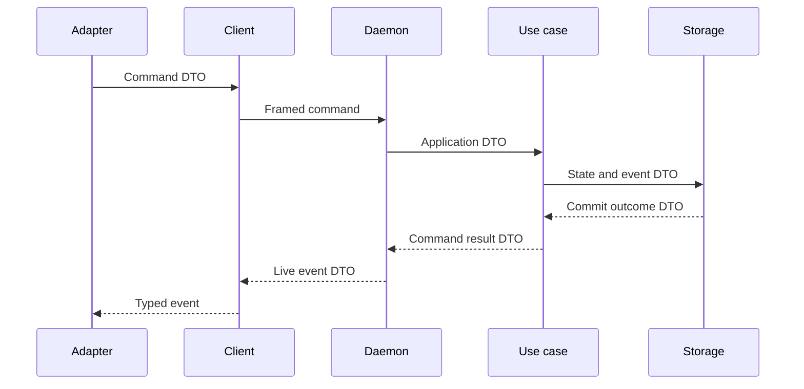

# DTO and Contract Policy

## Scope

This document makes the DTO-first principle executable. It applies to all crate, process, persistence, provider, tool, hook, and presentation boundaries.

## Non-negotiable rule

A boundary communicates through an explicit, strictly typed DTO. Passing an implementation type across a boundary is a defect, even when both crates currently compile in the same workspace.

A DTO is a stable contract, not merely any serializable struct.

## DTO categories

| Category | Purpose | Examples |
| --- | --- | --- |
| Command DTO | Requested state-changing work. | `SendUserTurnCommandDto`, `StopRunCommandDto`. |
| Query DTO | Requested read model or snapshot. | `GetSessionSnapshotQueryDto`. |
| Event DTO | Immutable fact that occurred. | `RunStartedEventDto`, `PlanUpdatedEventDto`. |
| Persistence DTO | Storage-safe representation of a record/snapshot/event. | `PersistedRunDto`, `RunSnapshotDto`. |
| Provider DTO | Provider-neutral model request/stream/error contract. | `ModelRequestDto`, `ModelEventDto`. |
| Tool DTO | Typed tool invocation, result, metadata, policy decision. | `ToolInvocationDto`, `ToolResultDto`. |
| Hook DTO | Controlled state passed between tool hook phases. | `ToolHookContextDto`. |
| Config DTO | Parsed, validated, resolved, and snapshotted TOML configuration. | `ResolvedConfigDto`, `ConfigSnapshotDto`. |
| Presentation DTO | Explicit adapter projection, if transport DTO is not appropriate for display. | `SessionViewDto`. |

## Type rules

### IDs

All IDs are domain newtypes. No public cross-boundary API accepts an identifier as a bare `String`, integer, or UUID primitive.

```rust
SessionId
RunId
TurnId
AssistantTurnId
ProjectId
WorkspaceId
PlanId
PlanRevisionId
ToolCallId
EventId
```

IDs must have a defined generation owner, parse/validation behavior, serialization representation, and error DTO.

### Envelopes

Transport and persisted events require an envelope with ordering and schema information.

```rust
EventEnvelopeDto {
    schema_version: SchemaVersionDto,
    event_id: EventId,
    session_id: SessionId,
    run_id: Option<RunId>,
    turn_id: Option<TurnId>,
    sequence: SessionEventSequenceDto,
    occurred_at: TimestampDto,
    payload: DomainEventDto,
}
```

A DTO field may be optional only when its absence has an explicit domain meaning. Optional must not conceal an unimplemented relationship.

### Errors

Errors crossing a crate/process boundary are structured DTOs:

```text
ErrorDto
  code: stable machine-readable code
  category: validation | policy | not_found | conflict | unavailable | internal
  message: safe human-readable message
  retry: never | immediate | delayed | manual
  correlation_id: optional diagnostic reference
```

Provider secrets, filesystem content not intended for display, raw stack traces, and SDK objects never appear in `ErrorDto`.

## Prohibited contract leaks

The following must not cross a boundary as public inputs or outputs:

- `serde_json::Value` or loosely typed maps as a replacement for a typed schema;
- raw SQL rows, connection pools, transactions, file handles, `PathBuf` with unvalidated semantic meaning, Tokio tasks, channels, mutex guards, or closures;
- provider SDK request/response/stream types;
- Tauri commands, window handles, Svelte stores, terminal widgets, or presentation state;
- bare strings for domain IDs, modes, risks, statuses, tool names, or event variants;
- implementation error types that reveal secrets or topology.

`serde_json::Value` may exist inside a tightly bounded provider or protocol codec implementation, but it must be decoded into a DTO before leaving that implementation boundary.

## Validation ownership

Validation occurs at the earliest boundary that has the necessary context:

1. transport validates schema version, framing, and basic DTO shape;
2. application validates command intent and authorization assumptions;
3. domain validates invariants and value objects;
4. runtime validates lifecycle preconditions;
5. tools validate tool-specific input and policy;
6. persistence validates storage constraints and maps failures to `ErrorDto`.

Validation cannot be delegated only to UI. Tauri and TUI may provide ergonomic pre-validation, but daemon validation is authoritative.

## Command-to-event lifecycle



A live event is emitted only after the storage commit succeeds. The command result and event must include enough typed identity for an adapter to reconcile state.

## Versioning and compatibility

- Every transport and persisted event schema has an explicit version.
- Changes are additive by default. Removal or semantic change requires a migration plan.
- Daemon/client protocol negotiation rejects incompatible major versions with a typed error.
- SQLite migrations and persisted DTO decoders must preserve enough information to read prior supported records.
- Provider DTOs are versioned independently from provider SDK models.

## Contract tests required before implementation

- serialization round-trip tests for every public DTO family;
- invalid-shape and invalid-ID tests at every input boundary;
- schema compatibility fixtures for transport and persisted events;
- compile-time tests proving forbidden implementation types do not appear in public signatures where tooling permits;
- consumer-driven contract tests for `intention-client` against daemon transport;
- redaction tests for all error/event DTOs carrying configuration or provider context.

## Quality-gate integration

DTO compatibility, validation, redaction, and public-API boundary tests are blocking inputs to `make verify`. Every DTO-owning crate declares its coverage tier before production code is accepted, and contract fixtures run across the required feature profiles. See [12 Quality Gates and Makefile](12-quality-gates-and-makefile.md).

## Outcome criteria

A feature is not ready unless a Tauri bridge and TUI/REPL can invoke its same public command/query DTOs and interpret the same resulting event/snapshot DTOs without adapter-specific business rules.

See [03 Daemon, Transport, and Adapters](03-daemon-transport-and-adapters.md) for the process boundary, [10 Test-Driven Delivery and Verification](10-test-driven-delivery-and-verification.md) for mandatory test layers, and [12 Quality Gates and Makefile](12-quality-gates-and-makefile.md) for the blocking orchestration contract.
