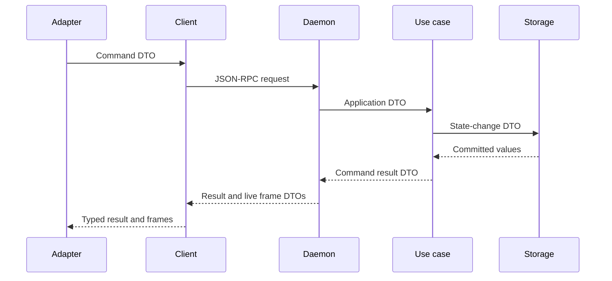

# DTO and Contract Policy

This document makes the DTO-first principle executable. It applies to all crate, process, persistence, provider, tool,
hook, and presentation boundaries.

## Non-negotiable rule

A boundary communicates through an explicit, strictly typed DTO. Passing an implementation type across a boundary is a
defect, even when both crates currently compile in the same workspace.

A DTO is a stable contract, not merely any serializable struct.

## DTO categories

| Category | Purpose | Examples |
| --- | --- | --- |
| Command DTO | Requested state-changing work. | `SendUserTurnCommandDto`, `InterruptRunCommandDto`. |
| Query DTO | Requested read model or snapshot. | `GetSessionSnapshotQueryDto`. |
| Persistence DTO | Storage-safe representation of a record or projection. | `PersistedRunDto`. |
| Provider DTO | Provider-neutral model request/stream/error contract, including advertised tool definitions and the transient same-run reasoning attachment. | `ModelRequestDto`, `ModelToolDefinitionDto`, `AssistantReasoningDto`, `ModelEventDto`. |
| Runtime execution DTO | Immutable selected execution input, safe terminal outcome, and provider-neutral time port over injected provider/storage contracts. | `ModelRunExecutionInputDto`, `ModelRunExecutionOutcomeDto`, `ModelTimePort`. |
| Tool DTO | Typed tool invocation, bounded result, metadata, policy decision, and durable result projection. | `ToolInvocationDto`, `ToolResultDto`, `ToolResultProjection`, `ToolResultEvidenceDto`. |
| Hook DTO | Controlled state passed between tool hook phases. | `ToolHookContextDto`. |
| Config DTO | Parsed, validated, resolved, and revisioned TOML configuration. | `ResolvedConfigDto`, `ConfigRevisionDto`. |
| Presentation DTO | Explicit adapter projection, if transport DTO is not appropriate for display. | `SessionViewDto`. |

## Type rules

### UUID roles and non-conversion

UUID is an encoding/value representation, not authority. Every public UUID value uses a domain newtype whose owner
defines generation, scope, validation, serialization, and idempotency behavior. UUID equality never establishes semantic
identity across Session, Run, activity, lineage, graph, operation, or diagnostic domains.

Deterministic UUIDv5 is permitted only where the owner freezes its namespace and name derivation. Daemon-assigned/random
UUIDs and deterministic UUIDv5 values are not interchangeable. Historical UUID bytes and meanings remain unchanged and
cannot be normalized into future records. UUIDs, operation identities, and diagnostic correlation IDs are distinct
classes and must not be converted or used as authority substitutes. There is no durable ordering authority beyond
SQLite row insertion order — `messages.id` for the transcript — and no record family may introduce an ordering
sequence.

### IDs

All IDs are domain newtypes. No public cross-boundary API accepts an identifier as a bare `String`, integer, or UUID
primitive.

```rust
SessionId
RunId
TurnId
ProjectId
WorkspaceId
ToolCallId
ConfigRevisionId
IdempotencyKey
```

IDs must have a defined generation owner, parse/validation behavior, serialization representation, and error DTO. The
tool loop addresses model steps and tool groups by plain indices within their containing records rather than by
newtypes; provider-native tool-call identifiers remain private implementation state.

### Envelopes

Transport envelopes are JSON-RPC messages (architecture 03). Persisted state is stored as plain typed rows; there is no
durable event envelope, event identity, or event sequence.

A DTO field may be optional only when its absence has an explicit domain meaning. Optional must not conceal an
unimplemented relationship.

### Errors

Errors crossing a crate/process boundary are structured DTOs:

```text
ErrorDto
  code: stable machine-readable code
  category: validation | policy | not_found | conflict | unavailable | internal
  message: safe human-readable message
  retry: never | immediate | delayed | manual
  correlation_id: optional `CorrelationIdDto` UUID diagnostic reference
  detail: optional closed `ErrorDetailDto`
```

`CorrelationIdDto` accepts only a canonical UUID string and is an opaque reference, not diagnostic content. Dynamic
user-visible context belongs only in a reviewed `ErrorDetailDto` variant. M1 defines `MissingWorkspacePath { path:
WorkspaceRelativePathDto }`: the path is normalized, slash-separated, logical, and relative to an already-authorized
workspace. It never includes an absolute root, canonical target, symlink target, OS error, command line, stack trace, or
file content.

Messages are code-owned safe guidance. Runtime data must never be interpolated into `message` or placed in a
map/`serde_json::Value`; it must be added through a reviewed typed detail variant. `Display` remains exactly `code:
message` and never renders correlation or detail data.

Provider secrets, filesystem content not intended for display, raw stack traces, and SDK objects never appear in
`ErrorDto`.

## Prohibited contract leaks

The following must not cross a boundary as public inputs or outputs:

- `serde_json::Value` or loosely typed maps as a replacement for a typed schema;
-  raw SQL rows, connection pools, transactions, file handles, `PathBuf` with unvalidated semantic meaning, Tokio tasks,
channels, mutex guards, or closures;
- provider SDK request/response/stream types;
- Tauri commands, window handles, Svelte stores, terminal widgets, or presentation state;
- bare strings for domain IDs, modes, risks, statuses, tool names, or tool kinds;
- implementation error types that reveal secrets or topology.

Provider SDK request/response/stream types and raw `serde_json::Value` cannot cross a provider boundary. M4
model/provider contracts use validated text context, requested/declared capability DTOs, ordered stream facts, usage,
finish reasons, safe provider errors, and typed JSON-object tool-call text. A request advertises tool definitions as a
validated JSON Schema descriptor (`ModelToolDefinitionDto`), never as raw `serde_json::Value`; the advertised set is
transient request state with no durable representation ([architecture 08](08-model-protocol-and-providers.md)). A
request may additionally carry the current round's
accepted provider reasoning as transient same-run attachment state with no durable representation: the runtime may
attach it to the assistant tool-call message of the same-run continuation ([architecture
08](08-model-protocol-and-providers.md)), and it is never durable history,
message text, or cross-turn transfer. `intention-proto` owns the shared safe usage, finish-reason, tool-call, and
provider-error values; `intention-model` re-exports them for source compatibility. Native SDK decoding and JSON values
may exist only inside the owning provider implementation before being normalized to those DTOs.

Run-scoped delivery is a current-state stream: `SubscribeRunCommandDto` receives a correlated snapshot of the current
run state, and subsequent uncorrelated `RunStreamFrameDto` values carry `kind` `content` or `status` with no positions
or cursors. A re-subscribing client re-reads current state and continues live; there is no event tail, resync, or
catch-up position.

## Validation ownership

Contracts are typed serde JSON DTOs. Public DTO deserialization is the structural validation boundary: required fields,
field types, and closed enum variants are established on decode and cannot be bypassed by a decoder. Semantic invariants
are enforced at the boundary that owns them and again at admission before any effect, because an admitting authority
cannot assume the producer decoded through the same boundary.

There is no binary canonical form: the wire and domain contracts are the serde JSON DTOs themselves, and no tag
registry, canonical digest, or identity layer exists. Canonicalization is introduced only when a first real
consumer needs canonical bytes, and then only as RFC 8785 JSON Canonicalization (`serde_json_canonicalizer`); no
canonicalization dependency is added before that consumer exists. The public DTOs that declare invariants beyond their
field types are validated at admission; extending decode-time enforcement to them remains a recorded follow-up card.
Until a real canonicalization consumer exists, no component hashes JSON for identity, addressing, or comparison:
equality is typed structural equality, and record identity is a typed revision identity rather than a digest.

Validation occurs at the boundary that has the necessary context.

The error category follows the boundary that detected a version mismatch: the JSON-RPC 2.0 handshake fails an
incompatible protocol version as the typed `-32001` error with `ErrorDto { category: unavailable }` (architecture 03,
"Protocol lifecycle"), while an `incompatible_protocol_version` decode rejection at a public DTO boundary is a
`validation` failure. The difference is intentional.

Validation cannot be delegated only to UI. Tauri and TUI may provide ergonomic pre-validation, but daemon validation is
authoritative.

## Command lifecycle


```mermaid
sequenceDiagram
  participant A as Adapter
  participant C as Client
  participant D as Daemon
  participant U as Use case
  participant S as Storage

  A->>C: Command DTO
  C->>D: JSON-RPC request
  D->>U: Application DTO
  U->>S: State-change DTO
  S-->>U: Committed values
  U-->>D: Command result DTO
  D-->>C: Result and live frame DTOs
  C-->>A: Typed result and frames
```

A live frame is published only after the storage commit succeeds. The command result and frames must include enough
typed identity for an adapter to reconcile state.

## Versioning and compatibility

- Every transport schema and persisted row schema has an explicit version.
- Changes are additive by default. Current payloads may omit additive fields
such as `ErrorDto.detail` and `ErrorDto.correlation_id`; omitted fields decode as `None`.
- Public DTOs tolerate unknown additive JSON fields unless a closed
configuration schema explicitly documents `deny_unknown_fields`. Required fields, invalid types, invalid IDs, unknown
closed variants, and any schema/protocol version other than the current one always fail safely.
- The daemon/client JSON-RPC 2.0 handshake accepts only the exact current
protocol version (1.0) and rejects any other version with the typed `-32001` version error before closing the connection
([architecture 03](03-daemon-transport-and-adapters.md)); the public DTO schema compares by exact equality (no
same-major tolerance).
- SQLite storage is the single live schema (logical version 1) created
directly on open; there is no migration chain, no version gate, and no opening of older schemas, and persisted rows keep
their recorded meaning.
- Provider DTOs are versioned independently from provider SDK models.

## Contract tests required before implementation

-  versioned JSON fixtures for every public DTO family, including valid current fixtures and malformed/compatibility
cases;
- invalid-shape and invalid-ID tests at every input boundary;
- explicit wire-validation tests for non-blank, path, timestamp, and schema invariants;
- schema compatibility fixtures for transport and persisted records;
- compile-time tests proving forbidden implementation types do not appear in public signatures where tooling permits;
- consumer-driven contract tests for `intention-client` against daemon transport;
- redaction tests for all error and stream DTOs carrying configuration or provider context.

## Quality-gate integration

DTO compatibility, validation, redaction, and public-API boundary tests are blocking `make verify` inputs. Every
DTO-owning crate is subject to its declared coverage tier, and contract fixtures run across the required feature
profiles.
See [12 Quality Gates and Makefile](12-quality-gates-and-makefile.md).

## Outcome criteria

A feature is not ready unless a Tauri bridge and TUI/REPL can invoke its same public command/query DTOs and interpret
the same resulting snapshot and frame DTOs without adapter-specific business rules.

See [03 Daemon, Transport, and Adapters](03-daemon-transport-and-adapters.md) for the process boundary, [10 Test-Driven
Delivery and Verification](10-test-driven-delivery-and-verification.md) for mandatory test layers, and [12 Quality Gates
and Makefile](12-quality-gates-and-makefile.md) for the blocking orchestration contract.

## Slice 1.5 boundary model (not activated)

Slice 1.5 collapses the DTO surface to the three places where a process, a file, or a foreign SDK forces a serialized
shape. This section freezes that model; the rules above stay current policy until the slice activates.

- Three physical boundaries. DTOs exist at the IPC wire (protocol commands, queries, notifications, and their typed
  payloads), at SQLite persistence (rows and projections), and at provider SDK calls (requests, stream facts, and errors
  normalized into the provider-neutral contract). Every DTO category above belongs to exactly one of the three.
- Domain types inside the process. Crates call each other with domain types. A DTO is not introduced between internal
  crates, and a type acquires wire attributes only when it crosses one of the three boundaries.
- JSON only for tool payloads. Tool inputs and outputs are JSON objects validated at runtime against the tool's
  declared JSON Schema, and they are the only schemaless JSON values in the system. `serde_json::Value` stays
  prohibited everywhere else, including error details, hooks, configuration, and storage.
- Eight identifiers. `SessionId`, `RunId`, `TurnId`, `WorkspaceId`, `ProjectId`, `ToolCallId`, `ConfigRevisionId`, and
  `IdempotencyKey` are the complete identity newtype set. `EventId`, `AssistantTurnId`, `PlanId`, `PlanRevisionId`,
  `ModelStepId`, and `ToolGroupId` are removed: model steps and tool groups are addressed by plain indices within their
  containing records, and mutating operations carry an `IdempotencyKey` instead of an operational ID.
- Publication follows the commit. A live frame is emitted once the durable commit succeeds, carrying the values the
  commit recorded; the scoped durable reread proof is removed.
