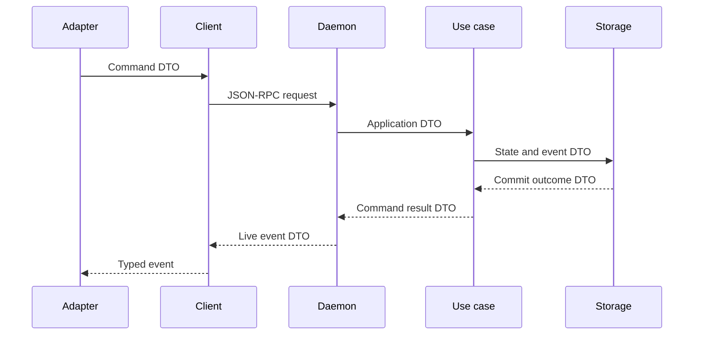

# DTO and Contract Policy

**Current policy.**

This document makes the DTO-first principle executable. It applies to all crate, process, persistence, provider, tool,
hook, and presentation boundaries.

## Non-negotiable rule

A boundary communicates through an explicit, strictly typed DTO. Passing an implementation type across a boundary is a
defect, even when both crates currently compile in the same workspace.

A DTO is a stable contract, not merely any serializable struct.

## DTO categories

| Category | Purpose | Examples |
| --- | --- | --- |
| Command DTO | Requested state-changing work. | `SendUserTurnCommandDto`, `InterruptRunCommandDto`. |
| Query DTO | Requested read model or snapshot. | `GetSessionSnapshotQueryDto`. |
| Event DTO | Immutable fact that occurred. | `RunStartedEventDto`, `PlanUpdatedEventDto`. |
| Persistence DTO | Storage-safe representation of a record/snapshot/event. | `PersistedRunDto`, `RunSnapshotDto`. |
| Provider DTO | Provider-neutral model request/stream/error contract, including advertised tool definitions and the transient same-run reasoning attachment. | `ModelRequestDto`, `ModelToolDefinitionDto`, `AssistantReasoningDto`, `ModelEventDto`. |
| Durable model fact DTO | Typed append-only provider/model evidence, safe run projection, and scoped replay. | `ModelRunFactDto`, `RunSnapshotDto`. |
| Runtime execution DTO | Immutable selected execution input, safe terminal outcome, and provider-neutral time port over injected provider/storage contracts. | `ModelRunExecutionInputDto`, `ModelRunExecutionOutcomeDto`, `ModelTimePort`. |
| Tool DTO | Typed tool invocation, bounded result, metadata, policy decision, and durable result projection. | `ToolInvocationDto`, `ToolResultDto`, `ToolResultProjection`, `ToolResultEvidenceDto`. |
| Hook DTO | Controlled state passed between tool hook phases. | `ToolHookContextDto`. |
| Config DTO | Parsed, validated, resolved, and snapshotted TOML configuration. | `ResolvedConfigDto`, `ConfigSnapshotDto`. |
| Presentation DTO | Explicit adapter projection, if transport DTO is not appropriate for display. | `SessionViewDto`. |

## Type rules

### UUID roles and non-conversion

UUID is an encoding/value representation, not authority. Every public UUID value uses a domain newtype whose owner
defines generation, scope, validation, serialization, and idempotency behavior. UUID equality never establishes semantic
identity across Session, Run, activity, lineage, graph, operation, or diagnostic domains.

Deterministic UUIDv5 is permitted only where the owner freezes its namespace and name derivation. Daemon-assigned/random
UUIDs and deterministic UUIDv5 values are not interchangeable. Historical UUID bytes and meanings remain unchanged and
cannot be normalized into future records. UUIDs, operation identities, sequences, and diagnostic correlation IDs are
distinct classes and must not be converted or used as authority substitutes. Durable ordering has exactly two
authorities — the session event sequence (`SessionEventSequenceDto`) for every record committed in one session, and the
container journal sequence (storage mechanism `container_journals`) for records that belong to one container and are
not a record of one session — plus one observation position, the reserved observation cursor, which is a reader's
resume position and never an authority; the set is closed, and no record family may introduce a further ordering
sequence.

### IDs

All IDs are domain newtypes. No public cross-boundary API accepts an identifier as a bare `String`, integer, or UUID
primitive.

```rust
SessionId
RunId
TurnId
AssistantTurnId
ProjectId
WorkspaceId
PlanId
PlanRevisionId
ToolCallId
EventId
ConfigRevisionId
```

IDs must have a defined generation owner, parse/validation behavior, serialization representation, and error DTO. Future
tool-loop IDs include daemon-assigned `ModelStepId` and `ToolGroupId`; provider-native tool-call identifiers remain
private implementation state.

### Envelopes

Persisted events carry `EventEnvelopeDto` with ordering and schema information; transport envelopes are JSON-RPC
messages (architecture 03).

```rust
EventEnvelopeDto {
    schema_version: SchemaVersionDto,
    event_id: EventId,
    session_id: SessionId,
    run_id: Option<RunId>,
    turn_id: Option<TurnId>,
    sequence: SessionEventSequenceDto,
    occurred_at: TimestampDto,
    payload: DomainEventDto,
}
```

A DTO field may be optional only when its absence has an explicit domain meaning. Optional must not conceal an
unimplemented relationship.

### Errors

Errors crossing a crate/process boundary are structured DTOs:

```text
ErrorDto
  code: stable machine-readable code
  category: validation | policy | not_found | conflict | unavailable | internal
  message: safe human-readable message
  retry: never | immediate | delayed | manual
  correlation_id: optional `CorrelationIdDto` UUID diagnostic reference
  detail: optional closed `ErrorDetailDto`
```

`CorrelationIdDto` accepts only a canonical UUID string and is an opaque reference, not diagnostic content. Dynamic
user-visible context belongs only in a reviewed `ErrorDetailDto` variant. M1 defines `MissingWorkspacePath { path:
WorkspaceRelativePathDto }`: the path is normalized, slash-separated, logical, and relative to an already-authorized
workspace. It never includes an absolute root, canonical target, symlink target, OS error, command line, stack trace, or
file content.

Messages are code-owned safe guidance. Runtime data must never be interpolated into `message` or placed in a
map/`serde_json::Value`; it must be added through a reviewed typed detail variant. `Display` remains exactly `code:
message` and never renders correlation or detail data.

Provider secrets, filesystem content not intended for display, raw stack traces, and SDK objects never appear in
`ErrorDto`.

## Prohibited contract leaks

The following must not cross a boundary as public inputs or outputs:

- `serde_json::Value` or loosely typed maps as a replacement for a typed schema;
-  raw SQL rows, connection pools, transactions, file handles, `PathBuf` with unvalidated semantic meaning, Tokio tasks,
channels, mutex guards, or closures;
- provider SDK request/response/stream types;
- Tauri commands, window handles, Svelte stores, terminal widgets, or presentation state;
- bare strings for domain IDs, modes, risks, statuses, tool names, or event variants;
- implementation error types that reveal secrets or topology.

Provider SDK request/response/stream types and raw `serde_json::Value` cannot cross a provider boundary. M4
model/provider contracts use validated text context, requested/declared capability DTOs, ordered stream facts, usage,
finish reasons, safe provider errors, and typed JSON-object tool-call text. A request advertises tool definitions as
validated JSON-object parameter text (`ModelToolDefinitionDto`), never as raw `serde_json::Value`; the advertised set is
transient request state with no durable representation (ADR 0039). A request may additionally carry the current round's
accepted provider reasoning as transient same-run attachment state with no durable representation: the runtime may
attach it to the assistant tool-call message of the same-run continuation (ADR 0041), and it is never durable history,
message text, or cross-turn transfer. `intention-types` owns the shared safe usage, finish-reason, tool-call, and
provider-error values; `intention-model` re-exports them for source compatibility. Native SDK decoding and JSON values
may exist only inside the owning provider implementation before being normalized to those DTOs.

M4 durable model facts are domain-owned typed envelopes, never raw JSON. A run-scoped snapshot carries its compatible M3
`RunProjectionDto`, its position in the run container journal (`RunEventCursorDto`), bounded assistant-turn content,
optional normalized usage/finish/failure state, and never accumulated reasoning. `RunEventTailPageDto` carries only
contiguous typed facts strictly after a position in the run container journal. M4's dedicated wire family keeps this
scope separate from M3 session replay:
`SubscribeRunCommandDto` receives a correlated `RunSubscriptionResponseDto` containing `RunSnapshotDto`, `RunResyncDto`,
or a safe `ErrorDto`; subsequent `RunLiveBatchDto`, `RunSnapshotFrameDto`, and `RunResyncDto` are uncorrelated
`RunStreamFrameDto` values. Live batches are non-empty, run-scoped, positive-cursor contiguous ranges, while snapshot
frames are daemon-authoritative status checkpoints. `RunResyncReasonDto` is closed and rejects unknown variants;
`run_replay_not_found` remains a safe error rather than a resync.

## Validation ownership

Contracts are typed serde JSON DTOs. Public DTO deserialization is the structural validation boundary: required fields,
field types, and closed enum variants are established on decode and cannot be bypassed by a decoder. Semantic invariants
are enforced at the boundary that owns them and again at admission before any effect, because an admitting authority
cannot assume the producer decoded through the same boundary.

There is no binary canonical form: the wire and domain contracts are the serde JSON DTOs themselves, and no tag
registry, canonical digest, or identity layer exists (ADR 0046). Canonicalization is introduced only when a first real
consumer needs canonical bytes, and then only as RFC 8785 JSON Canonicalization (`serde_json_canonicalizer`); no
canonicalization dependency is added before that consumer exists. The public DTOs that declare invariants beyond their
field types are validated at admission; extending decode-time enforcement to them remains a recorded follow-up card.

Validation occurs at the boundary that has the necessary context.

The error category follows the boundary that detected a version mismatch: the JSON-RPC 2.0 handshake fails an
incompatible protocol version as the typed `-32001` error with `ErrorDto { category: unavailable }` (architecture 03,
"Protocol lifecycle"; ADR 0045), while an `incompatible_protocol_version` decode rejection at a public DTO boundary is a
`validation` failure. The difference is intentional.

Validation cannot be delegated only to UI. Tauri and TUI may provide ergonomic pre-validation, but daemon validation is
authoritative.

## Command-to-event lifecycle


```mermaid
sequenceDiagram
  participant A as Adapter
  participant C as Client
  participant D as Daemon
  participant U as Use case
  participant S as Storage

  A->>C: Command DTO
  C->>D: JSON-RPC request
  D->>U: Application DTO
  U->>S: State and event DTO
  S-->>U: Commit outcome DTO
  U-->>D: Command result DTO
  D-->>C: Live event DTO
  C-->>A: Typed event
```

A live event is emitted only after the storage commit succeeds. The command result and event must include enough typed
identity for an adapter to reconcile state.

## Versioning and compatibility

- Every transport and persisted event schema has an explicit version.
- Changes are additive by default. Current payloads may omit additive fields
such as `ErrorDto.detail` and `ErrorDto.correlation_id`; omitted fields decode as `None`.
- Public DTOs tolerate unknown additive JSON fields unless a closed
configuration schema explicitly documents `deny_unknown_fields`. Required fields, invalid types, invalid IDs, unknown
closed variants, and any schema/protocol version other than the current one always fail safely.
- The daemon/client JSON-RPC 2.0 handshake accepts only the exact current
protocol version (2.0) and rejects any other version with the typed `-32001` version error before closing the connection
(ADR 0045); the public DTO schema compares by exact equality (no same-major tolerance).
- SQLite storage is the single live schema (logical version 1) created
directly on open; there is no migration chain, no version gate, and no opening of older schemas, and persisted rows keep
their recorded bytes and meaning.
- Provider DTOs are versioned independently from provider SDK models.

## Contract tests required before implementation

-  versioned JSON fixtures for every public DTO family, including valid current fixtures, supported legacy fixtures, and
malformed/compatibility cases;
- invalid-shape and invalid-ID tests at every input boundary;
- explicit wire-validation tests for non-blank, path, timestamp, and schema invariants;
- schema compatibility fixtures for transport and persisted events;
- compile-time tests proving forbidden implementation types do not appear in public signatures where tooling permits;
- consumer-driven contract tests for `intention-client` against daemon transport;
- redaction tests for all error/event DTOs carrying configuration or provider context.

## Quality-gate integration

DTO compatibility, validation, redaction, and public-API boundary tests are blocking `make verify` inputs. Every
DTO-owning crate is subject to its declared coverage tier ([ADR
0051](../decisions/0051-per-crate-coverage-tiers.md)), and contract fixtures run across the required feature profiles.
See [12 Quality Gates and Makefile](12-quality-gates-and-makefile.md).

## Outcome criteria

A feature is not ready unless a Tauri bridge and TUI/REPL can invoke its same public command/query DTOs and interpret
the same resulting event/snapshot DTOs without adapter-specific business rules.

See [03 Daemon, Transport, and Adapters](03-daemon-transport-and-adapters.md) for the process boundary, [10 Test-Driven
Delivery and Verification](10-test-driven-delivery-and-verification.md) for mandatory test layers, and [12 Quality Gates
and Makefile](12-quality-gates-and-makefile.md) for the blocking orchestration contract.

## Post-M4 execution and compatibility boundary

Future M4+ packages use closed, typed serde JSON families rather than widening historical records by implication. If a
future record kind is needed, it is a typed serde JSON contract declared by its own activating specification;
kind/version/payload mismatch blocks dependent external work, and live availability never silently mutates a persisted
meaning. The superseded execution-meaning envelope, canonical tag registry, and digest/identity codec — including
`RunExecutionMeaningEnvelopeDto` — are deleted (ADR 0046): no canonical encoding or decoder retention schedule remains.

### Future DTO families

The Plan/Build Autopilot transition adds versioned typed families for plan approval, same-Session Build continuation,
and optional implementation handoff. Approval binds an exact plan revision; same-Session continuation preserves
`SessionId` but creates a fresh `RunId`; handoff creates an independent Session from a bounded safe snapshot. These DTOs
must not carry credentials, raw transcripts, provider continuation state, live handles, processes, grants, or unfinished
effects.

The future tool-loop families include `ToolRegistryEntryDto`, `ToolDescriptorRevisionId`, `ToolRegistryRevisionId`,
`ModelStepId`, `ToolGroupId`, model-step/group facts, safe workspace-path observations, output fragments, terminal
results, and `ModelToolExchangeDto`. They cannot widen
historical M4 tool facts, expose provider-native IDs, raw paths, secrets, or SDK resources, or recreate stored selection
from a current registry. [Tool registry and model-tool loop](15-tool-registry-and-model-tool-loop.md) owns
their semantics.

The future instruction-source families include `InstructionSourceV1`, `InstructionProfileRevisionV1`, and
`InstructionProjectionV1` ([architecture 30](30-instruction-sources-and-system-context.md), [ADR
0043](../decisions/0043-instruction-sources-and-system-context.md)). They carry bounded credential-free instruction text
with its declared kind, scope, order, and audience; they carry no tool, policy, admission, provider, or other authority,
and no untrusted material may enter them. Architecture 30 owns their semantics, and the Slice 5 activating specification
assigns their typed serde JSON contract versions.

### Historical compatibility classes

- **Execution compatibility:** a supported record may execute only under its
recorded kind, version, immutable selection, and explicitly supported driver contract.
- **Replay compatibility:** readable history may remain replayable even when it
is not executable.
- **Audit compatibility:** an unknown/corrupt future audit record may isolate
that audit result without inventing replacement state.

Historical M3/M4 and ordinary records must not receive synthetic Skill, MCP, activity, policy, or profile fields. The
single live storage schema may evolve in place to add tables, bridges, or projections but may not rewrite old payload
bytes, IDs, cursors, snapshots, or event envelopes. Unknown or corrupt future meaning blocks dependent work before an
effect and must not fall back to current TOML, registry, model name, provider, or live resource state. [Run execution
meaning and historical compatibility](14-run-execution-meaning-and-historical-compatibility.md) owns the remaining
historical compatibility rules.

Future MCP families include typed capability source, discovery, server observation, normalized capability revision,
accumulated run-local selection, model-step selection binding, invocation selection, safe capability/result projection,
and attempt/recovery values. They are closed, credential-free, and cannot expose raw endpoint, command, header, token,
frame, server error, SDK, socket, or process resource. Architecture 18 owns their semantics.

## Post-M4 kernel DTO boundary

Future kernel DTOs include typed kernel selection, epoch, execution binding, safe output chunk, checkpoint metadata,
restoration outcome, and host-request references. They are closed, credential-free families: Python/Jupyter objects, raw
frames, checkpoint payloads, grants, credentials, endpoints, handles, process resources, raw tracebacks, and
caller-selected application identities never cross a public boundary. Architecture 20 owns their semantics.

## Post-M4 provider evolution DTO boundary

Future provider DTOs are closed, credential-free kind/descriptor/profile/catalog/ selection/capability/driver-contract
and normalized-reasoning families. They cannot expose raw TOML, credentials, arbitrary maps, provider-native IDs or
payloads, SDK/client resources, remote continuation state, or private endpoint input. Architecture 22 owns their
semantics.

## Post-M4 session branching DTO boundary

Future fork DTOs are closed, versioned, credential-free command/query/result, lineage, boundary, snapshot, preview, and
safe branch-summary families. They never carry a client-selected child ID, raw snapshot/event, credential, path,
resource, provider payload, or authority. Architecture 23 owns their semantics.

## Post-M4 activity and adapter DTO boundary

Future activity, notification, acknowledgement, snapshot, page, completion, live, and resync DTO families are closed,
versioned, credential-free safe projections. They expose no raw prompt, provider/tool/MCP data, path, credential, grant,
resource, or implementation value. Architecture 24 owns their semantics.
