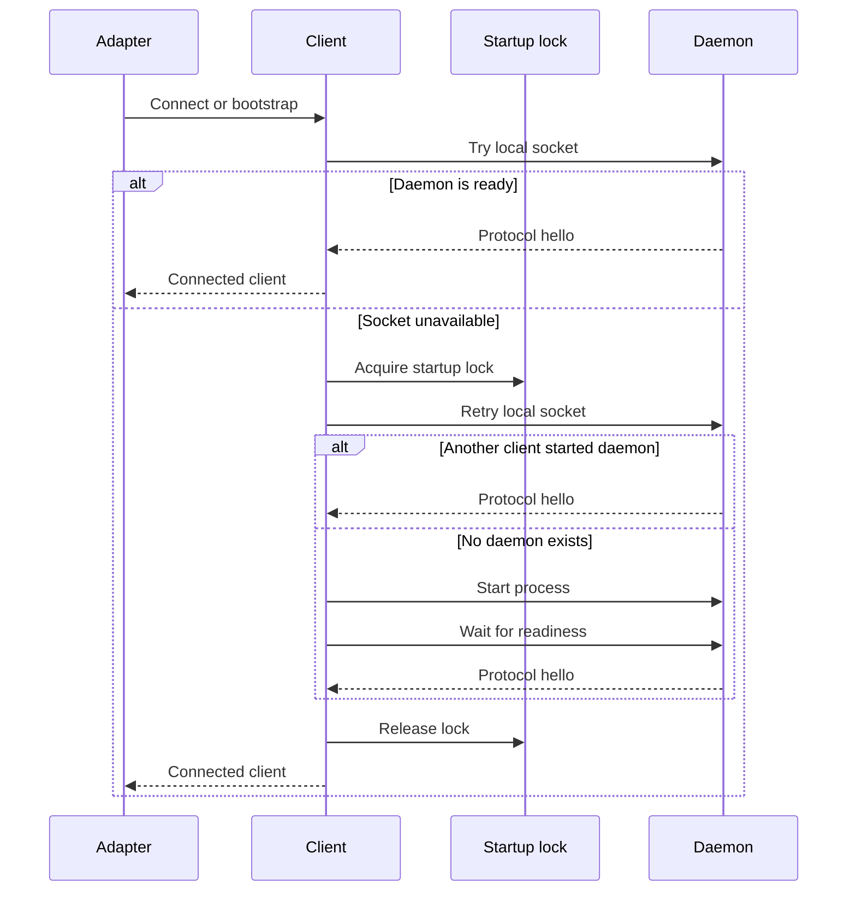
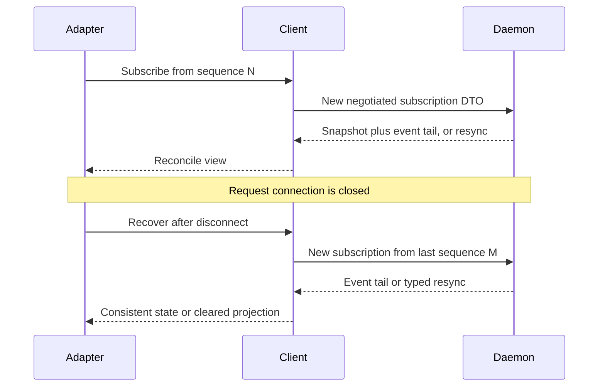

# Daemon, Transport, and Adapters

## Scope

This document defines the local single-user daemon, the typed local process protocol, bootstrap/reconnect behavior, and the responsibilities of Tauri, TUI, and REPL adapters.

It does not define Web, Telegram, HTTP, WebSocket, remote authentication, or multi-user operation. Those are explicit v1 exclusions.

## Ownership

The daemon is the sole owner of:

- application use cases and runtime actors;
- SQLite connections and persistence transactions;
- active sessions and runs;
- provider drivers and model streams;
- tool registry, workspace policy, hooks, VFR, Headroom, and plan policies;
- event publication and subscription source.

Tauri, TUI, and REPL own only presentation, user input adaptation, local display state, and reconnect UX.

## Local transport

v1 uses:

- Unix domain sockets on supported Unix platforms and named pipes on Windows;
- logical safe endpoint identifiers resolved under the current user's platform
  runtime or application-configuration location, never exposed in public DTOs
  or safe errors;
- Unix endpoint-parent mode `0700` and listener-socket mode `0600`; Windows
  relies on named-pipe local-user access semantics and is verified by the
  required Windows CI named-pipe fixture;
- a private, bounded length-prefixed UTF-8 JSON codec with a maximum 1 MiB
  frame payload;
- a framed, versioned protocol carrying only `intention-protocol` DTOs;
- OS-user filesystem permissions as the local access boundary.

No TCP listener is opened in v1. This avoids treating localhost as an authentication boundary and keeps remote API design out of the initial product.

### M2 serving and backpressure

M2 accepts each local connection in the daemon host, completes protocol hello,
reads one request, writes its correlated response, and closes the connection.
The request is served synchronously by its dedicated connection thread. A slow
client therefore blocks only that thread during its blocking I/O operation; the
1 MiB frame bound prevents unbounded message allocation. M2 does not yet define
subscription buffering, read/write deadlines beyond the bounded connect wait,
or eviction of slow peers. Those are later transport-hardening decisions.

## Shared client

`intention-client` is the only supported client-side integration path for local adapters. It owns:

- daemon discovery and bootstrap coordination;
- protocol version negotiation;
- typed command dispatch and query execution;
- typed subscriptions;
- reconnect behavior;
- snapshot-plus-event-tail recovery;
- local transport error classification.

It must not contain Svelte, terminal, or domain workflow behavior.

## Bootstrap sequence



### Bootstrap requirements

1. The adapter first attempts a connection without spawning anything.
2. A cross-platform `fs4` advisory startup lock prevents duplicate daemon launches.
3. The lock holder rechecks availability before creating a daemon.
4. It launches the daemon process only when the recheck still finds no daemon.
5. Readiness requires successful protocol hello negotiation, all required M2 peer capabilities, a correlated health query with the negotiated version, and `DaemonReadinessDto::Ready`, not merely process existence.
6. Startup errors are typed and safe to render.
7. Closing one adapter never terminates a healthy shared daemon.
8. Idle shutdown, explicit stop, and connected-adapter upgrade coordination are deferred. The M2 default is daemon persistence until process termination or OS shutdown.

## Protocol lifecycle

At connection time, client and daemon exchange:

- protocol major/minor version;
- supported feature/capability DTOs;
- client identity limited to local adapter metadata, not an application account;
- versioned, correlated request/response envelopes after hello;
- daemon health/readiness through `GetDaemonHealth` during bootstrap; and
- last observed session event sequence plus optional run scope for subscriptions,
  when available.

An incompatible major protocol version fails closed with `ErrorDto { category: unavailable }`. The adapter should offer a safe reconnect/restart action, never silently reinterpret mismatched payloads.

M2 subscriptions return either a consistent session snapshot with a contiguous
event tail or a typed resync instruction. The client reducer accepts ordered
events, ignores duplicate or stale delivery, and requires snapshot recovery for
a forward sequence gap. Because M2 closes every request connection, its stateful
recovery handle opens a new negotiated request, reuses the last accepted event
sequence, and applies only a snapshot/tail or typed resync response. It does
not claim a persistent live-event stream. The M2 composition fixture supplies
this protocol shape in memory only; durable snapshot/tail storage and replay
retention are M3 work.

## Subscription and reconnect

A subscription is associated with a session and optional run scope. The client records the latest applied event sequence.



### Reconciliation rules

- Adapters render in sequence order per session.
- A gap requires recovery through a snapshot and event tail, not guessed UI state.
- Duplicate delivery is tolerated through `event_id` and sequence-aware reducers.
- A stale live event may not mutate a projection if its sequence is already applied.
- The daemon has authoritative ordering; adapters do not synthesize a server sequence.

## M2 fixture boundary

M2's daemon composition is an in-memory, non-durable health/session fixture.
It proves local transport, bootstrap, negotiation, correlation, and
snapshot-tail/resync wiring without claiming persistence or workflow execution.
M3 owns SQLite-backed sessions, append-only events, durable snapshots and tails,
queues, and restart recovery. M4 owns model/provider runtime behavior and live
run execution. Consequently, M2 does not implement idle shutdown, an explicit
daemon-stop command, or upgrade coordination.

## Tauri bridge

Tauri is a bootstrap/native bridge, not a domain host.

```text
Svelte UI → Tauri invoke/event bridge → intention-client → local daemon
```

The Rust bridge may:

- initialize `intention-client`;
- dispatch protocol command/query DTOs;
- forward typed event DTOs;
- map explicit presentation DTOs when necessary for JavaScript ergonomics;
- manage window, native dialog, notification, and app lifecycle details.

The bridge must not:

- import application use-case services directly;
- create a competing SQLite connection or run actor;
- invoke provider SDKs or tools;
- reimplement persistence, permission, plan, workspace, VFR, or Headroom policy;
- introduce a parallel Tauri-only command contract.

## TUI and REPL

TUI and REPL connect directly through `intention-client`. They are equal presentation adapters, not special daemon modes.

They must use the same command, query, snapshot, and event DTOs as the Tauri bridge. This is an intentional architectural proof that presentation logic is isolated.

## Daemon restart semantics

On daemon startup:

1. load current projections and durable records;
2. locate runs with an unfinished persisted status;
3. transition each to `interrupted` with a durable event;
4. do not automatically retry model calls, tool calls, or shell processes;
5. publish resulting state when an adapter subscribes.

This policy is honest about unknown external side effects. A user may initiate a new retry or a manually reconciled follow-up run.

## Required tests and observable outcomes

| Requirement | Test evidence | Observable result |
| --- | --- | --- |
| Shared daemon | Multi-client bootstrap test and TUI client test connect to one fixture daemon with an explicit test-only session ID. | Both observe equal typed health, snapshot, and event-tail DTOs for the same session. |
| Startup race | Multi-client bootstrap integration test. | Exactly one daemon host is created. |
| Permission boundary | Socket/pipe permission integration test. | A different OS user cannot connect. |
| Protocol mismatch | Client/server compatibility test. | Connection fails with typed incompatibility error. |
| Reconnect | Stateful recovery-handle disconnect/reconnect sequence test. | A fresh one-shot request reuses the last sequence and applies a consistent snapshot/tail or explicit resync. |
| Restart | Persisted active-run recovery test. | Run becomes `interrupted`; no provider/tool call resumes. |
| Adapter isolation | Dependency/contract test. | Tauri and TUI have no direct runtime/storage implementation dependency. |

## Quality-gate integration

The daemon, transport, client, and adapter tests in this document are blocking `make verify` inputs. Their crates use the coverage tier, feature-profile matrix, strict lint policy, and architecture boundaries defined in [12 Quality Gates and Makefile](12-quality-gates-and-makefile.md). Tauri and TUI are accepted through mapping contracts and fixture-daemon outcome scenarios, not a misleading aggregate UI line-coverage target.

## Open implementation decisions

- maximum subscription buffer, streaming shape, read/write deadline, and
  slow-client eviction policy;
- durable endpoint cleanup and stale-listener recovery policy beyond listener
  ownership safeguards;
- daemon upgrades with connected adapters;
- explicit daemon stop command and future idle shutdown policy.
