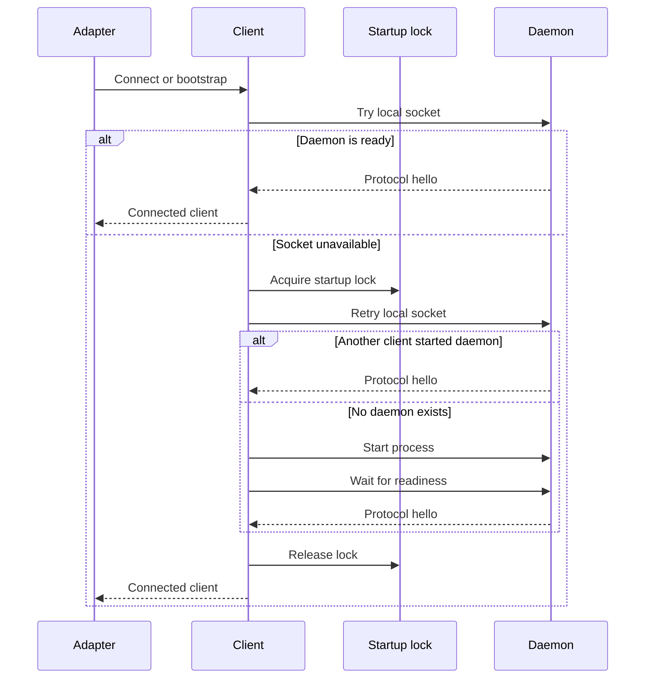
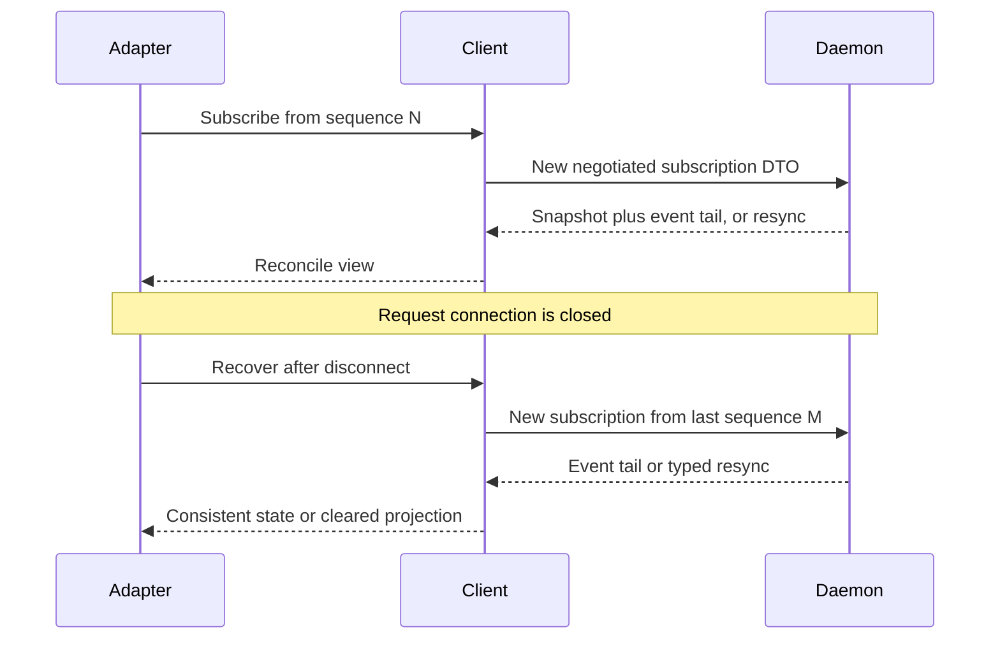

# Daemon, Transport, and Adapters

## Scope

This document defines the local single-user daemon, the typed local process protocol, bootstrap/reconnect behavior, and the responsibilities of Tauri, TUI, and REPL adapters.

It does not define Web, Telegram, HTTP, WebSocket, remote authentication, or multi-user operation. Those are explicit v1 exclusions.

## Ownership

The daemon is the sole owner of:

- application use cases and runtime actors;
- SQLite connections and persistence transactions;
- active sessions and runs;
- provider drivers and model streams;
- tool registry, workspace policy, hooks, VFR, Headroom, and plan policies;
- event publication and subscription source.

Tauri, TUI, and REPL own only presentation, user input adaptation, local display state, and reconnect UX.

## Local transport

v1 uses:

- Unix domain sockets on supported Unix platforms and named pipes on Windows;
- logical safe endpoint identifiers resolved under the current user's platform
  runtime or application-configuration location, never exposed in public DTOs
  or safe errors;
- Unix endpoint-parent mode `0700` and listener-socket mode `0600`; Windows
  relies on named-pipe local-user access semantics and is verified by the
  required Windows CI named-pipe fixture;
- a private, bounded length-prefixed UTF-8 JSON codec with a maximum 1 MiB
  frame payload;
- a framed, versioned protocol carrying only `intention-protocol` DTOs;
- OS-user filesystem permissions as the local access boundary.

No TCP listener is opened in v1. This avoids treating localhost as an authentication boundary and keeps remote API design out of the initial product.

### M2 serving and backpressure

M2 accepts each local connection in the daemon host, completes protocol hello,
reads one request, writes its correlated response, and closes the connection.
The request is served synchronously by its dedicated connection thread. A slow
client therefore blocks only that thread during its blocking I/O operation; the
1 MiB frame bound prevents unbounded message allocation. M2 does not yet define
subscription buffering, read/write deadlines beyond the bounded connect wait,
or eviction of slow peers. Those are later transport-hardening decisions.

### M4 asynchronous transport foundation

M4 adds an **additive transport foundation only** alongside the retained M3
synchronous host contract. `AsyncLocalListener` binds the same private
`LocalEndpoint` mapping and endpoint ownership policy, while
`AsyncLocalClientConnection` connects with the existing 500 ms bounded wait.
After the existing typed `ProtocolHelloDto` negotiation succeeds, each
connection is consumed into direction-specific opaque roles:
`AsyncRequestSender` / `AsyncResponseReceiver` on the client and
`AsyncRequestReceiver` / `AsyncResponseSender` on the daemon. Those roles
exchange only the existing correlated request/response DTOs; Tokio,
interprocess, socket, endpoint-path, and I/O-half resources remain private to
`intention-transport`.

The foundation preserves the 4-byte big-endian JSON frame format and its 1 MiB
payload cap. Oversize frames are rejected before payload allocation or write as
`local_protocol_frame_too_large`; malformed JSON is
`invalid_local_protocol_frame`; incomplete headers, incomplete payloads, and
closed peers are `local_daemon_connection_unavailable`. It introduces no
read/write deadline, runtime owner, daemon/client host loop, protocol live-batch
DTO, persistent subscription semantics, fan-out, queue capacity, slow-peer
policy, or resync behavior. M3 consumers continue to use their synchronous
one-request connection behavior unchanged.

The asynchronous implementation uses the locked `interprocess` Tokio feature
with its private local Unix-socket / Windows-named-pipe mapping. It preserves
Unix parent mode `0700`, socket mode `0600`, listener-owned cleanup, and refusal
to reclaim active endpoint names. Its required transport test target exercises
real endpoint hello negotiation, ordered correlated multi-frame exchanges,
concurrent split reader/writer roles, all framing safety outcomes, retained M3
synchronous behavior, and Windows named-pipe multi-frame fixtures under
`cfg(windows)`.

## Shared client

`intention-client` is the only supported client-side integration path for local adapters. It owns:

- daemon discovery and bootstrap coordination;
- protocol version negotiation;
- typed command dispatch and query execution;
- typed subscriptions;
- reconnect behavior;
- snapshot-plus-event-tail recovery;
- local transport error classification.

It must not contain Svelte, terminal, or domain workflow behavior.

## Bootstrap sequence



### Bootstrap requirements

1. The adapter first attempts a connection without spawning anything.
2. A cross-platform `fs4` advisory startup lock prevents duplicate daemon launches.
3. The lock holder rechecks availability before creating a daemon.
4. It launches the daemon process only when the recheck still finds no daemon.
5. Readiness requires successful protocol hello negotiation, all required M2 peer capabilities, a correlated health query with the negotiated version, and `DaemonReadinessDto::Ready`, not merely process existence.
6. Startup errors are typed and safe to render.
7. Closing one adapter never terminates a healthy shared daemon.
8. Idle shutdown, explicit stop, and connected-adapter upgrade coordination are deferred. The M2 default is daemon persistence until process termination or OS shutdown.

## Protocol lifecycle

At connection time, client and daemon exchange:

- protocol major/minor version;
- supported feature/capability DTOs;
- client identity limited to local adapter metadata, not an application account;
- versioned, correlated request/response envelopes after hello;
- daemon health/readiness through `GetDaemonHealth` during bootstrap; and
- last observed session event sequence plus optional run scope for subscriptions,
  when available.

An incompatible major protocol version fails closed with `ErrorDto { category: unavailable }`. The adapter should offer a safe reconnect/restart action, never silently reinterpret mismatched payloads.

M2 subscriptions return either a consistent session snapshot with a contiguous
event tail or a typed resync instruction. The client reducer accepts ordered
events, ignores duplicate or stale delivery, and requires snapshot recovery for
a forward sequence gap. Because M2 closes every request connection, its stateful
recovery handle opens a new negotiated request, reuses the last accepted event
sequence, and applies only a snapshot/tail or typed resync response. It does
not claim a persistent live-event stream. The M2 composition fixture supplies
this protocol shape in memory only.

### M3 durable replay-only subscriptions

M3 replaces the in-memory session fixture with durable SQLite projections and
append-only event envelopes. A subscription is still a one-shot, negotiated
request. For an unscoped request it returns the **current durable projection
snapshot** and an empty contiguous tail at that snapshot's included sequence,
or a typed resync when the session cannot be supplied. It is **replay-only**,
not a retained connection and not a live event feed. Historical projection
reconstruction is not represented in M3. The post-commit publication seam is
intentionally a no-op in M3.

`@todo(m4-streaming)` marks exactly the deferred work to introduce persistent
live event streaming, post-commit fan-out/buffering, slow-peer lifecycle policy,
and a representation capable of safely replaying a run-filtered view. It does
not mean that M3 durability, unscoped snapshot/tail replay, ordering, or resync
is deferred.

M3 snapshot/tail DTOs represent session-contiguous sequence and cannot safely
express filtered run state. Therefore every subscription with `run_id: Some`
returns typed `HistoryUnavailable` resync **before any session or cursor
validation**, whether the run matches, does not exist, belongs to another
session, or has an invalid cursor. It must never fall back to an unfiltered
session snapshot or tail. Correctly scoped replay remains deferred with the M4
persistent-streaming/representation hardening; this safe resync is not a live
stream.

## Subscription and reconnect

A subscription is associated with a session and optional run scope. The client records the latest applied event sequence.



### Reconciliation rules

- Adapters render in sequence order per session.
- A gap requires recovery through a snapshot and event tail, not guessed UI state.
- Duplicate delivery is tolerated through `event_id` and sequence-aware reducers.
- A stale live event may not mutate a projection if its sequence is already applied.
- The daemon has authoritative ordering; adapters do not synthesize a server sequence.

## M2 fixture boundary and M3 durable authority

M2's daemon composition was an in-memory, non-durable health/session fixture.
M3 makes the composition facade daemon-owned durable state: it opens the
platform state database, records a safe configuration snapshot, completes
recovery before reporting ready, and serves the existing typed command/query
contract from SQLite. The facade uses the platform application-state location
(`XDG_STATE_HOME` or `~/.local/state` on Linux, Application Support on macOS,
and `LOCALAPPDATA` on Windows); it returns a typed unavailable error when no
absolute platform location is available and never falls back to process CWD.

`intention-test-support` owns durable fixture construction and bounded listener
orchestration. It constructs credential-free snapshots, platform-native temporary
workspace roots, `TempDir`-backed databases, and known sessions, then calls only
the hidden facade injection seam and the daemon's hidden one-connection dispatch
seam. TUI and daemon binary tests do not own a parallel fixture protocol or a
fixture startup CLI mode.

M3 does not implement idle shutdown, an explicit daemon-stop command, model or
provider execution, or persistent live streaming. M4 owns model/provider
runtime behavior and live run execution; its streaming work also owns the
persistent subscription semantics marked by `@todo(m4-streaming)`.

## Tauri bridge

Tauri is a bootstrap/native bridge, not a domain host.

```text
Svelte UI → Tauri invoke/event bridge → intention-client → local daemon
```

The Rust bridge may:

- initialize `intention-client`;
- dispatch protocol command/query DTOs;
- forward typed event DTOs;
- map explicit presentation DTOs when necessary for JavaScript ergonomics;
- manage window, native dialog, notification, and app lifecycle details.

The bridge must not:

- import application use-case services directly;
- create a competing SQLite connection or run actor;
- invoke provider SDKs or tools;
- reimplement persistence, permission, plan, workspace, VFR, or Headroom policy;
- introduce a parallel Tauri-only command contract.

## TUI and REPL

TUI and REPL connect directly through `intention-client`. They are equal presentation adapters, not special daemon modes.

They must use the same command, query, snapshot, and event DTOs as the Tauri bridge. This is an intentional architectural proof that presentation logic is isolated.

## Daemon restart semantics

On daemon startup, before it reports `DaemonReadinessDto::Ready`:

1. resolve and open the platform state database, applying supported SQLite migrations;
2. record the credential-free startup `ConfigSnapshotDto` revision;
3. snapshot the pre-existing unfinished runs and transition each one to `interrupted` through the repository's mandatory terminal-promotion transaction, with durable state-change event and snapshots;
4. do not automatically retry or resume model calls, tool calls, shell processes, or other external work. A newly promoted `starting` run represents already durable queued input only and is not reconsidered by that recovery pass; and
5. make the recovered state available through later one-shot snapshot/tail replay.

This policy is honest about unknown external side effects. A user may initiate a
new retry or manually reconciled follow-up run.

## Required tests and observable outcomes

| Requirement | Test evidence | Observable result |
| --- | --- | --- |
| Shared daemon | `intention-test-support` fixture-host integration and TUI client test connect to one fixture daemon with an explicit test-only session ID. | Both observe equal typed health, snapshot, and event-tail DTOs for the same session. |
| Startup race | Multi-client bootstrap integration test. | Exactly one daemon host is created. |
| Permission boundary | Socket/pipe permission integration test. | A different OS user cannot connect. |
| Protocol mismatch | Client/server compatibility test. | Connection fails with typed incompatibility error. |
| Reconnect | Durable replay-only subscription integration test, including run-scoped requests. | An unscoped new one-shot request receives a current durable snapshot plus an empty contiguous tail, or typed resync; every `run_id: Some` request receives `HistoryUnavailable` before cursor/session validation without unfiltered session state, and no request claims live delivery. |
| Restart | Persisted active-run recovery test. | Recovery completes before ready; every pre-existing unfinished run becomes `interrupted`, promotes the oldest queued turn in the same transaction when present, and no provider/tool call resumes. |
| State location | Platform-state path fixture. | The database resolves under AppData/platform state and fails safely without an absolute platform directory, never using CWD. |
| Adapter isolation | Dependency/contract test. | Tauri and TUI have no direct runtime/storage implementation dependency. |

## Quality-gate integration

The daemon, transport, client, and adapter tests in this document are blocking `make verify` inputs. Their crates use the coverage tier, feature-profile matrix, strict lint policy, and architecture boundaries defined in [12 Quality Gates and Makefile](12-quality-gates-and-makefile.md). Tauri and TUI are accepted through mapping contracts and fixture-daemon outcome scenarios, not a misleading aggregate UI line-coverage target.

## Open implementation decisions

- maximum subscription buffer, streaming shape, read/write deadline, and
  slow-client eviction policy;
- durable endpoint cleanup and stale-listener recovery policy beyond listener
  ownership safeguards;
- daemon upgrades with connected adapters;
- explicit daemon stop command and future idle shutdown policy.
