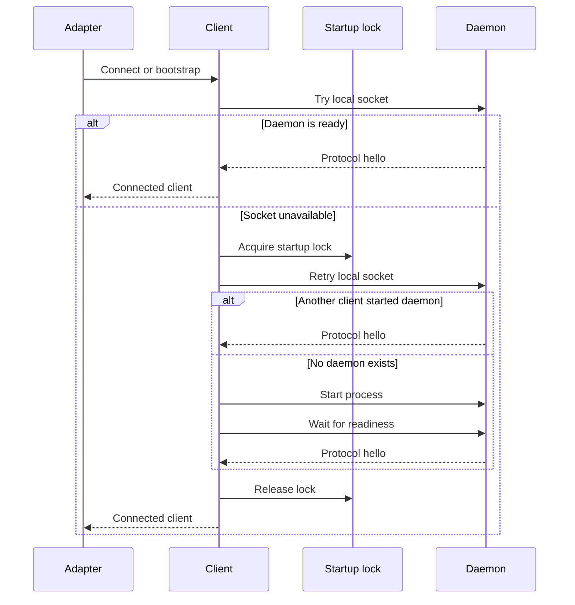
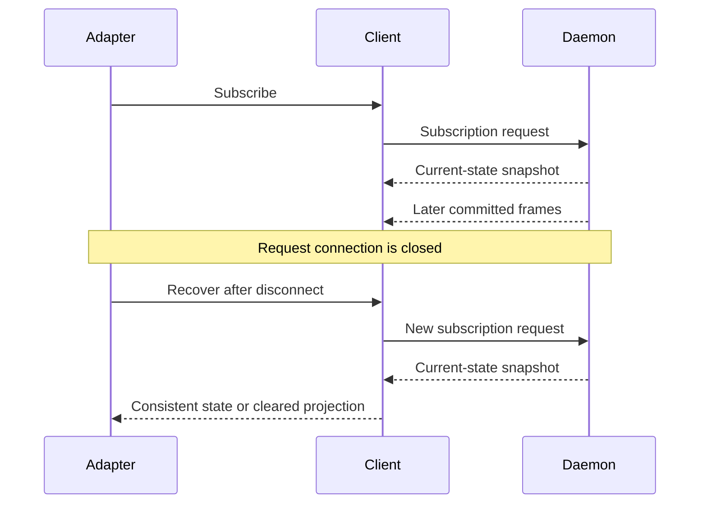

# Daemon, Transport, and Adapters

**Current policy.**

This document defines the local single-user daemon, the typed local process protocol, bootstrap and reconnect behavior,
and the responsibilities of Tauri, TUI, and REPL adapters. Web, Telegram, HTTP, WebSocket, remote authentication, and
multi-user operation are explicit v1 exclusions ([00 Principles and Scope](00-principles-and-scope.md)).

## Ownership

The daemon is the sole owner of application use cases and runtime actors; SQLite connections and persistence
transactions; active sessions and runs; provider drivers and model streams; the tool registry, workspace policy, hooks,
VFR, Headroom, and plan policies; frame publication and subscription source; and protocol frames and subscription
current-state reads via `intention-transport`.

Tauri, TUI, and REPL own only presentation, user input adaptation, local display state, and reconnect UX.

## Local transport

v1 uses:

- Unix domain sockets on supported Unix platforms and named pipes on Windows;
-  logical safe endpoint identifiers resolved under the current user's platform runtime or application-configuration
  location, never exposed in public DTOs or safe errors;
-  Unix endpoint-parent mode `0700` and listener-socket mode `0600`; Windows relies on named-pipe local-user access
  semantics and is verified by the required Windows CI named-pipe fixture;
-  JSON-RPC 2.0 over NDJSON framing: one typed message per `\n`-terminated UTF-8 JSON line, with a 1 MiB transport
  message cap (`MAX_MESSAGE_BYTES`);
- a versioned JSON-RPC protocol carrying only `intention-proto` protocol DTOs;
- OS-user filesystem permissions as the local access boundary.

No TCP listener is opened in v1. This avoids treating localhost as an authentication boundary and keeps remote API
design out of the initial product.

### JSON-RPC 2.0 protocol

The wire is JSON-RPC 2.0: every message is one UTF-8
JSON line terminated by a newline. A request carries `"jsonrpc":"2.0"`, a numeric `id`, a `method`, and typed `params`;
a response echoes the `id` and carries exactly one of `result` or `error`; a notification carries `"jsonrpc":"2.0"`, a
`method`, and `params` with no `id`. The envelopes are `JsonRpcRequest<T>`, `JsonRpcResponse<T>`, `JsonRpcError`, and
`JsonRpcNotification<T>`; `params` and `result` are the existing typed `intention-proto` DTOs, and no untyped
`serde_json::Value` crosses the boundary.

| Method | Params DTO | Result |
| --- | --- | --- |
| `session.create` | `CreateSessionCommandDto` | command result DTO |
| `turn.send` | `SendUserTurnCommandDto` | command result DTO |
| `turn.remove` | `RemoveTurnCommandDto` | command result DTO |
| `run.interrupt` | `InterruptRunCommandDto` | command result DTO |
| `session.subscribe` | `SubscribeSessionCommandDto` | current session snapshot |
| `run.subscribe` | `SubscribeRunCommandDto` | current run state snapshot |
| `daemon.health` | none | daemon health/readiness projection |
| `session.snapshot` | `GetSessionSnapshotQueryDto` | durable session snapshot |

The method table is one-to-one with the `ProtocolCommandDto` and `ProtocolQueryDto` variants, plus the dedicated
`run.subscribe` request that replaced the former run-stream connection role. `run.frame`, carrying `RunStreamFrameDto`,
is the only notification; `session.subscribe` and `session.snapshot` return current-state snapshot results, and there is
no session push channel.

Errors follow JSON-RPC 2.0: `-32700` parse error, `-32600` invalid request, `-32601` method not found, `-32602` invalid
params, and the application-defined `-32001` incompatible protocol version. The structured `ErrorDto` travels in
`error.data`, so the stable `data.code`, category, retry guidance, and safe message remain available to clients without
changing the JSON-RPC error shape.

The daemon sends notifications only and never server-initiated requests. Batch arrays are not part of this transport.

### Serving and liveness bounds

The daemon host accepts each local connection, completes the JSON-RPC 2.0 `hello` handshake, and serves typed requests.
A one-shot connection reads one request, writes the correlated response, and closes; a long-lived connection may send
further requests and receive subscription notifications. Each connection carries bounded liveness safeguards, not contract bureaucracy ([architecture 09](09-configuration-security-and-observability.md)):

- `MAX_MESSAGE_BYTES` (1 MiB) rejects an over-size message before unbounded allocation; it is a transport liveness cap, not a contract limit on message content;
- `CONNECT_TIMEOUT` (500 ms) bounds the connect wait;
-  `SYNC_IO_TIMEOUT` (ten seconds) bounds read and write deadlines, applied to client connect and listener accept on
  Unix-domain sockets;
- a stale-socket probe reclaims an abandoned Unix endpoint only after proving no live listener owns it.

Windows named pipes keep their documented blocking behavior, a recorded limitation rather than a second bound (the
locked `interprocess` transport exposes no per-call named-pipe timeout, so only the bounded connect wait applies there),
anchored at `apply_sync_io_timeout` in `crates/intention-transport/src/lib.rs`. A peer that accepts a connection and
never answers therefore fails with a typed unavailable error instead of blocking its thread indefinitely.

### Asynchronous transport

The asynchronous implementation binds the same private `LocalEndpoint` mapping and endpoint ownership policy and uses
the locked `interprocess` Tokio feature with its private local Unix-socket / Windows-named-pipe mapping. After the typed
`hello` handshake succeeds, the connection exchanges typed JSON-RPC requests, responses, and notifications; Tokio,
interprocess, socket, endpoint-path, and I/O-half resources remain private to `intention-transport`. There are no
direction-specific connection roles and no feature negotiation: one connection speaks JSON-RPC 2.0 for commands,
queries, subscriptions, and notifications alike.

Oversize messages are rejected before payload allocation or write; malformed JSON produces the JSON-RPC parse error
`-32700`; an incomplete or closed message stream is `local_daemon_connection_unavailable`. The transport preserves the
Unix modes and endpoint-reclaim rules above; an identity-verified probe at bind is the only stale-endpoint-removal path,
and a dropped listener never unlinks its endpoint. Its required transport test target exercises real endpoint hello
handshake, ordered correlated request/response exchanges, concurrent reader/writer use, notification delivery, framing
safety outcomes, retained M3 synchronous behavior, and Windows named-pipe multi-message fixtures under `cfg(windows)`.

### Persistent subscriptions and the run stream

A subscription is an ordinary JSON-RPC method call. `run.subscribe` returns the current run state as its correlated
response result, and later committed state arrives as `run.frame` notifications carrying `RunStreamFrameDto` with
`kind` `content` or `status` and no positions. A re-subscribing client re-reads current state and continues live; there
is no cursor, event tail, or resynchronization. Unknown or cross-session runs are safe errors. A run stream never uses a
filtered `SessionSnapshotDto`.

`intention-daemon` owns one private Tokio runtime and serves the JSON-RPC surface from one `AsyncLocalListener`. Each
subscriber has a private bounded outgoing queue (`SUBSCRIBER_QUEUE_CAPACITY`, 64), its own writer path, and a bounded
write deadline (`SUBSCRIBER_WRITE_DEADLINE`, 10 seconds); these are implementation safeguards owned by the host, not
product ceilings. An overflowing, closed, or timed-out subscriber is removed without awaiting it from execution,
persistence, or healthy subscriber delivery. Queue-capacity isolation and the paused-clock deadline are daemon-host unit
evidence; the persistent-host outcome fixture proves a real healthy local peer's subscribe/live/reconnect-read lifecycle
rather than OS-buffer timing. The transport message bound and local Unix-socket/Windows-pipe permissions are unchanged.

Test-only restart fixtures explicitly abort and join all first-host connection and execution tasks before dropping every
first-host facade clone and reopening the database; this is deterministic fixture lifecycle ownership, not a production
signal-handling claim. Admission and interruption semantics are owned by [architecture
04](04-sessions-runs-events-and-storage.md).

## Shared client

`intention-client` is the only supported client-side integration path for local adapters. It owns:

- daemon discovery and bootstrap coordination;
- protocol version handshake (exact 1.0 equality);
- typed command dispatch and query execution;
- typed subscriptions;
- reconnect behavior;
- snapshot recovery;
- local transport error classification.

It must not contain Svelte, terminal, or domain workflow behavior.

## Bootstrap sequence


```mermaid
sequenceDiagram
  participant AD as Adapter
  participant CL as Client
  participant LK as Startup lock
  participant DM as Daemon

  AD->>CL: Connect or bootstrap
  CL->>DM: Try local socket
  alt Daemon is ready
    DM-->>CL: Protocol hello
    CL-->>AD: Connected client
  else Socket unavailable
    CL->>LK: Acquire startup lock
    CL->>DM: Retry local socket
    alt Another client started daemon
      DM-->>CL: Protocol hello
    else No daemon exists
      CL->>DM: Start process
      CL->>DM: Wait for readiness
      DM-->>CL: Protocol hello
    end
    CL->>LK: Release lock
    CL-->>AD: Connected client
  end
```

### Bootstrap requirements

1. The adapter first attempts a connection without spawning anything.
2. A cross-platform `fs4` advisory startup lock prevents duplicate daemon launches.
3. The lock holder rechecks availability before creating a daemon.
4. It launches the daemon process only when the recheck still finds no daemon.
5.  Readiness requires a successful JSON-RPC `hello` handshake with the exact current protocol version (1.0), a
   correlated `daemon.health` request, and `DaemonReadinessDto::Ready`, not merely process existence.
6. Startup errors are typed and safe to render.
7. Closing one adapter never terminates a healthy shared daemon.
8.  Idle shutdown, explicit stop, and connected-adapter upgrade coordination are deferred; the M2 default is daemon
   persistence until process termination or OS shutdown.

## Protocol lifecycle

At connection time the client sends `hello` carrying exactly the protocol version and the local adapter name, never an
application account. The daemon accepts only the exact current protocol version, 1.0, and answers `hello` before serving
any other method; there are no capability DTOs, feature flags, family gates, or connection modes.

An incompatible protocol version fails closed with the typed JSON-RPC error `-32001`, carrying `ErrorDto { category:
unavailable }` in `error.data`, before the daemon closes the connection. The adapter should offer a safe
reconnect/restart action, never silently reinterpret mismatched payloads. This is the transport-handshake category only;
a decode-time schema-version rejection at a public DTO boundary is a `validation` failure (architecture 02, "Validation
ownership").

After the handshake, the client sends typed commands and queries as JSON-RPC requests, and `run.frame` notifications
arrive on the same connection after a `run.subscribe`. A subscription request carries its session and optional run
scope. The client applies live frames after the snapshot it received and re-reads current state after a reconnect.

### Current-state session subscriptions

A session subscription is a one-shot JSON-RPC request: it returns the **current durable projection snapshot** for the
session. It is not a retained connection and not a live event feed. Committed values are published only through the
daemon host's commit-observation path. Persistent delivery exists only for the separate run-scoped DTOs, never for
filtered session state.

A session projection cannot express filtered run state. A request that asks for a specific run uses the run-scoped
subscription contract instead; a session request never falls back to mixing run and session state.

## Subscription and reconnect

A subscription is associated with a session and optional run scope. The client holds at most one active subscription
per scope.


```mermaid
sequenceDiagram
  participant AD as Adapter
  participant CL as Client
  participant DM as Daemon

  AD->>CL: Subscribe
  CL->>DM: Subscription request
  DM-->>CL: Current-state snapshot
  DM-->>CL: Later committed frames
  Note over AD,DM: Request connection is closed
  AD->>CL: Recover after disconnect
  CL->>DM: New subscription request
  DM-->>CL: Current-state snapshot
  CL-->>AD: Consistent state or cleared projection
```

### Reconciliation rules

- Adapters render committed state; a reconnect re-reads current state instead of replaying a tail.
- Duplicate or stale frames do not mutate a projection that already reflects newer committed state.
- Adapters never synthesize server state or ordering.

## M3 durable authority

The M3 composition facade is daemon-owned durable state: it opens the platform state database, records a safe
configuration revision, completes recovery before reporting ready, and serves the typed command/query contract from
SQLite. The facade uses the platform application-state location (`XDG_STATE_HOME` or `~/.local/state` on Linux,
Application Support on macOS, and `LOCALAPPDATA` on Windows); it returns a typed unavailable error when no absolute
platform location is available and never falls back to process CWD.

`intention-test-support` owns durable fixture construction and bounded listener orchestration. It constructs
credential-free configuration revisions, platform-native temporary workspace roots, `TempDir`-backed databases, and
known sessions, then calls only the hidden facade injection seam and the daemon's hidden one-connection dispatch seam.
TUI and daemon binary tests do not own a parallel fixture protocol or a fixture startup CLI mode. M3 does not implement
idle shutdown, an explicit daemon-stop command, or model or provider execution; M4 persistent delivery is provided
through the separate run-scoped subscription contract.

## Tauri bridge

Tauri is a bootstrap/native bridge, not a domain host.

```text
Svelte UI → Tauri invoke/event bridge → intention-client → local daemon
```

The Rust bridge may initialize `intention-client`; dispatch protocol command/query DTOs; forward typed frame DTOs; map
explicit presentation DTOs when necessary for JavaScript ergonomics; and manage window, native dialog, notification, and
app lifecycle details.

The bridge must not import application use-case services directly; create a competing SQLite connection or run actor;
invoke provider SDKs or tools; reimplement persistence, permission, plan, workspace, VFR, or Headroom policy; or
introduce a parallel Tauri-only command contract.

## TUI and REPL

TUI and REPL connect directly through `intention-client`. They are equal presentation adapters, not special daemon
modes, and must use the same command, query, snapshot, and frame DTOs as the Tauri bridge. This is an intentional
architectural proof that presentation logic is isolated.

## Daemon restart semantics

On daemon startup, before it reports `DaemonReadinessDto::Ready`:

1. resolve and open the platform state database, creating the complete current storage schema directly on open;
2. record the credential-free startup `ConfigSnapshotDto` revision;
3.  transition each pre-existing unfinished run to `interrupted` through the repository's mandatory
   terminal-transition transaction;
4.  do not automatically retry or resume model calls, tool calls, shell processes, or other external work; pending
   turns stay durable input and start no work during recovery; and
5. make the recovered state available through later one-shot current-state reads.

This policy is honest about unknown external side effects. A user may initiate a new retry or manually reconciled
follow-up run.

## Required tests and observable outcomes

| Requirement | Test evidence | Observable result |
| --- | --- | --- |
| Shared daemon | `intention-test-support` fixture-host integration and TUI client test connect to one fixture daemon with an explicit test-only session ID. | Both observe equal typed health and snapshot DTOs for the same session. |
| Startup race | Multi-client bootstrap integration test. | Exactly one daemon host is created. |
| Permission boundary | Socket/pipe permission integration test. | A different OS user cannot connect. |
| Protocol mismatch | Client/server compatibility test. | Connection fails with the typed `-32001` incompatibility error before close. |
| Protocol conformance | JSON-RPC conformance and rewritten transport integration tests. | The four standard error codes, `hello` exact-version equality, notification framing, and the one-to-one method table behave as specified. |
| Reconnect | Subscription integration test, including run-scoped requests. | A new request receives the current durable snapshot, a reconnect re-reads current state, and no request claims replayed history. |
| Restart | Persisted active-run recovery test. | Recovery completes before ready; every pre-existing unfinished run becomes `interrupted`, pending turns stay durable input, and no provider/tool call resumes. |
| State location | Platform-state path fixture. | The database resolves under AppData/platform state and fails safely without an absolute platform directory, never using CWD. |
| Adapter isolation | Dependency/contract test. | Tauri and TUI have no direct runtime/storage implementation dependency. |

## Quality-gate integration

The daemon, transport, client, and adapter tests in this document are blocking `make verify` inputs under the coverage
policy of [12 Quality Gates and Makefile](12-quality-gates-and-makefile.md) (per-crate tiers). Tauri and TUI carry the
`edge` tier floor in addition to
their mapping contracts and fixture-daemon outcome scenarios; the floor never replaces that evidence.

## Open implementation decisions

- durable endpoint cleanup and stale-listener recovery policy beyond listener ownership safeguards;
- daemon upgrades with connected adapters;
- explicit daemon stop command and future idle shutdown policy.

## Slice 1.5 daemon, transport, and client model (activated)

Slice 1.5 merged the composition facade into the daemon crate and lifted the client to the protocol command surface.
This section records the landed model; the text above is the live policy.

- One host, no facade library. The composition root and the daemon host are one binary crate, `intention-daemon`.
  The daemon host calls the engine directly, the hop daemon host → facade → application disappears, and with it the
  facade's duplicate DTO surface. Composition still happens in exactly one place, and the hidden test seams move with
  the merged crates and stay non-production.
- Publication without a reread. The durable commit returns the values it recorded, and the daemon host publishes live
  frames from that result. The scoped durable reread proof is removed; the live-after-commit ordering rule is unchanged.
- No cursors and no resync. `SubscribeSessionCommandDto` and `SubscribeRunCommandDto` lose their cursor fields,
  session and run subscriptions return current-state snapshots, and a re-subscribing client re-reads current state. The
  `RunResyncDto`, `RunSnapshotFrameDto`, `RunEventTailPageDto`, and cursor DTOs are removed; the wire keeps its eight
  methods.
- Protocol version 1.0. The single live protocol version is 1.0; the wire, the method table, and exact-equality
  negotiation are unchanged by the renumbering.
- Fully asynchronous client. `intention-client` exposes one asynchronous API covering every protocol command and query
  plus the `run.frame` notification stream, and its blocking API is removed. Daemon end-to-end tests drive the real
  client instead of the low-level transport, and the TUI proof adapter migrates mechanically without rework.
