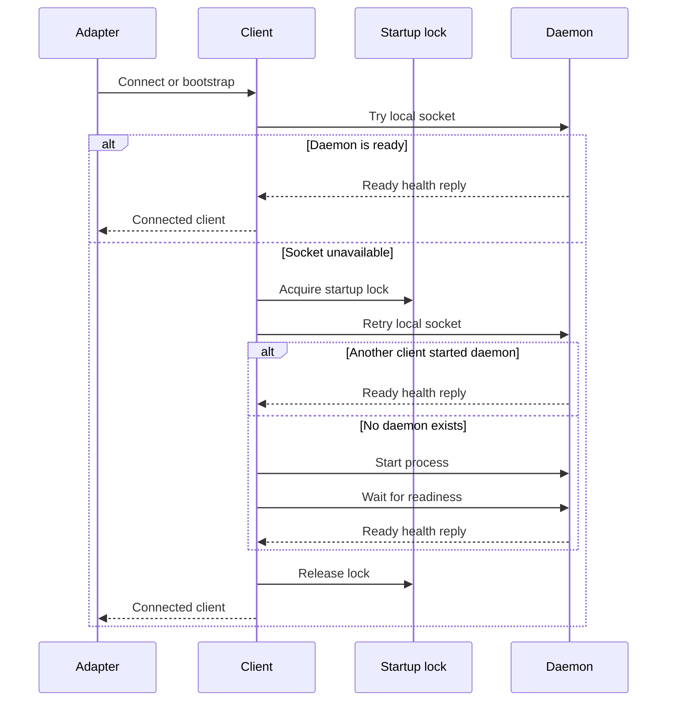
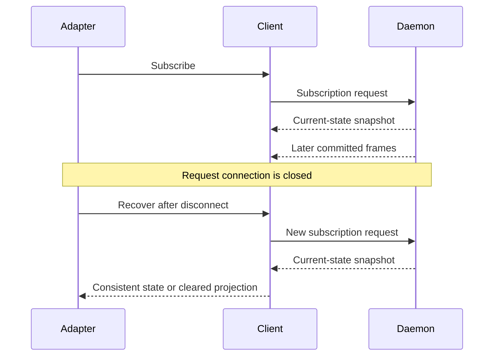

# Daemon, Transport, and Adapters

**Current policy.**

This document defines the local single-user daemon, the typed local process protocol, bootstrap and reconnect behavior,
and the responsibilities of Tauri, TUI, and REPL adapters. Web, Telegram, HTTP, WebSocket, remote authentication, and
multi-user operation are explicit v1 exclusions ([00 Principles and Scope](00-principles-and-scope.md)).

## Ownership

The daemon is the sole owner of application use cases and runtime actors; SQLite connections and persistence
transactions; active sessions and runs; provider drivers and model streams; the tool surface and workspace policy, plus
VFR, Headroom, and plan policies when activated; frame publication and subscription source; and protocol frames and
subscription current-state reads via `intention-transport`.

Tauri, TUI, and REPL own only presentation, user input adaptation, local display state, and reconnect UX.

## Local transport

v1 uses:

- Unix domain sockets on supported Unix platforms and named pipes on Windows;
-  logical safe endpoint identifiers resolved under the current user's platform runtime or application-configuration
  location, never exposed in public DTOs or safe errors;
-  Unix endpoint-parent mode `0700` and listener-socket mode `0600`; Windows relies on named-pipe local-user access
  semantics and is verified by the required Windows CI named-pipe fixture;
-  NDJSON framing: one typed message per `\n`-terminated UTF-8 JSON line, with one 1 MiB transport message cap
  (`MAX_MESSAGE_BYTES`) and no other framing rule;
- a typed local wire carrying only `intention-proto` wire DTOs, with no method table, no second error channel, and no
  handshake; the single live wire version is a byte in the platform-default endpoint name (`WIRE_VERSION`);
- OS-user filesystem permissions as the local access boundary.

No TCP listener is opened in v1. This avoids treating localhost as an authentication boundary and keeps remote API
design out of the initial product.

### Typed wire

Every message is one UTF-8 JSON line terminated by a newline. A client request is
`ProtocolRequestDto { id: u64, request: ClientRequestDto }`; a daemon reply is `ProtocolDaemonMessageDto::Reply`
carrying `ProtocolReplyDto { id: u64, result: ProtocolResultDto }`; a rejection is `ProtocolDaemonMessageDto::Rejection`
carrying `ProtocolRejectionDto { id: Option<u64>, error: ErrorDto }`; and a committed frame is
`ProtocolDaemonMessageDto::Frame(RunStreamFrameDto)`. `ClientRequestDto` and `ProtocolResultDto` are the whole operation
table: a request variant is the operation, and the reply variant is its typed result. No method-name string, no
`serde_json::Value`, and no untyped map crosses the boundary.

| Request variant | Request DTO | Result variant |
| --- | --- | --- |
| `CreateSession` | `CreateSessionCommandDto` | `SessionCreated` |
| `SendUserTurn` | `SendUserTurnCommandDto` | `TurnAccepted` |
| `RemoveTurn` | `RemoveTurnCommandDto` | `TurnRemoved` |
| `InterruptRun` | `InterruptRunCommandDto` | `RunInterrupted` |
| `GetSessionSnapshot` | `GetSessionSnapshotQueryDto` | `SessionSnapshot` |
| `GetDaemonHealth` | none | `DaemonHealth` |
| `ListSessions` | none | `SessionsListed` |
| `GetTuiSettings` | none | `TuiSettings` |
| `SetTuiTheme` | `SetTuiThemeCommandDto` | `TuiThemeSet` |
| `SubscribeRun` | `SubscribeRunCommandDto` | `RunSubscribed` |

The terminal theme is a presentation-only wire value: `ThemeDto` is the durable `light`/`dark` spelling,
`TuiSettingsDto` is the daemon's effective theme a client renders with, and `TuiThemeAcceptedDto` is the stored
selection's acceptance evidence. A theme selection enters no run's immutable configuration selection and records no
configuration revision.

Errors travel on exactly one channel: a rejection carrying the structured `ErrorDto` with its stable code, category,
retry guidance, and safe message. A request line that cannot be decoded is answered with a typed identity-less
rejection, and the connection keeps serving. The daemon never sends server-initiated requests, and batch arrays are not
part of this transport.

### Serving and liveness bounds

The daemon host accepts each local connection and serves typed requests. A one-shot connection reads one request,
writes the correlated reply or rejection, and closes; a long-lived connection may send further requests and receive
subscription frames. Each connection carries bounded liveness safeguards, not contract bureaucracy ([architecture 09](09-configuration-security-and-observability.md)):

- `MAX_MESSAGE_BYTES` (1 MiB) is the single owner of the envelope bound: it rejects an over-size message before unbounded allocation, the snapshot read stays byte-bounded below it (`MAX_TRANSCRIPT_SNAPSHOT_BYTES`), and an over-size correlated response is answered with a typed error instead of a silent close;
- `CONNECT_TIMEOUT` (500 ms) bounds the connect wait;
- a stale-socket probe reclaims an abandoned Unix endpoint only after proving no live listener owns it.

The transport is asynchronous end to end and applies no per-call read or write deadline, on Unix-domain sockets and
Windows named pipes alike: a peer that accepts a connection and then stops answering leaves the awaiting task pending,
and each caller owns its own bound (the client bounds every correlated and stream reply, and the daemon host bounds each
subscriber write).

### Asynchronous transport

This is the only transport implementation: the crate keeps the shared private `LocalEndpoint` mapping, the
`AsyncLocalListener`, `AsyncLocalClientConnection`, and `AsyncLocalDaemonConnection` types, and one `AsyncMessageSender`
plus one `AsyncMessageReceiver` link pair, and carries no synchronous twin. It uses the locked `interprocess` Tokio
feature with its private local Unix-socket / Windows-named-pipe mapping. After the connection splits, the link exchanges
typed wire messages; Tokio, interprocess, socket, endpoint-path, and I/O-half resources remain private to
`intention-transport`. There are no direction-specific connection roles and no feature negotiation: one connection
carries requests, replies, rejections, and frames alike.

Oversize messages are rejected before payload allocation or write; an incomplete or closed message stream is
`local_daemon_connection_unavailable`; a peer that does not speak the current wire is the typed `stale_daemon_protocol`
failure. The connect wait is bounded exactly once, by the transport's own `CONNECT_TIMEOUT`. The transport preserves the
Unix modes and endpoint-reclaim rules above; an identity-verified probe at bind is the only stale-endpoint-removal path,
and a dropped listener never unlinks its endpoint. Its required transport test target exercises real endpoint
connections, ordered correlated request/reply exchanges, concurrent reader/writer use, frame delivery, framing safety
outcomes, and Windows named-pipe multi-message fixtures under `cfg(windows)`.

### Persistent subscriptions and the run stream

A subscription is an ordinary typed request. `SubscribeRun` returns the current run state as its correlated result, and
later committed state arrives as `RunStreamFrameDto` frames with `kind` `content` (one committed transcript row) or
`status` (the committed `RunProjectionDto`, never a delta) and no positions. A re-subscribing client re-reads current
state and continues live; there is no cursor, event tail, or resynchronization. Unknown or cross-session runs are typed
rejections. A run stream never uses a filtered `SessionSnapshotDto`.

`intention-daemon` owns one private Tokio runtime and serves the typed wire from one `AsyncLocalListener`. Each
subscriber has a private bounded outgoing queue (`SUBSCRIBER_QUEUE_CAPACITY`, 64), its own writer path, and a bounded
write deadline (`SUBSCRIBER_WRITE_DEADLINE`, 10 seconds); these are implementation safeguards owned by the host, not
product ceilings. An overflowing, closed, or timed-out subscriber is removed without awaiting it from execution,
persistence, or healthy subscriber delivery. Queue-capacity isolation and the paused-clock deadline are daemon-host unit
evidence; the persistent-host outcome fixture proves a real healthy local peer's subscribe/live/reconnect-read lifecycle
rather than OS-buffer timing. The transport message bound and local Unix-socket/Windows-pipe permissions are unchanged.

Test-only restart fixtures explicitly abort and join all first-host connection and execution tasks before dropping every
first-host facade clone and reopening the database; this is deterministic fixture lifecycle ownership, not a production
signal-handling claim. Admission and interruption semantics are owned by [architecture
04](04-sessions-runs-events-and-storage.md).

## Shared client

`intention-client` is the only supported client-side integration path for local adapters. It owns:

- daemon discovery and bootstrap coordination;
- typed operations over domain identifiers, never wire DTOs in adapter signatures;
- typed run-stream subscriptions;
- reconnect behavior;
- snapshot recovery;
- local transport error classification.

It must not contain Svelte, terminal, or domain workflow behavior.

## Bootstrap sequence


```mermaid
sequenceDiagram
  participant AD as Adapter
  participant CL as Client
  participant LK as Startup lock
  participant DM as Daemon

  AD->>CL: Connect or bootstrap
  CL->>DM: Try local socket
  alt Daemon is ready
    DM-->>CL: Ready health reply
    CL-->>AD: Connected client
  else Socket unavailable
    CL->>LK: Acquire startup lock
    CL->>DM: Retry local socket
    alt Another client started daemon
      DM-->>CL: Ready health reply
    else No daemon exists
      CL->>DM: Start process
      CL->>DM: Wait for readiness
      DM-->>CL: Ready health reply
    end
    CL->>LK: Release lock
    CL-->>AD: Connected client
  end
```

### Bootstrap requirements

1. The adapter first attempts a connection without spawning anything.
2. A cross-platform `fs4` advisory startup lock prevents duplicate daemon launches.
3. The lock holder rechecks availability before creating a daemon.
4. It launches the daemon process only when the recheck still finds no daemon.
5.  Readiness requires one correlated health request answered with `DaemonHealthDto`, so the answer itself is the
   ready state; process existence is not readiness.
6. Startup errors are typed and safe to render.
7. Closing one adapter never terminates a healthy shared daemon.
8.  Idle shutdown, explicit stop, and connected-adapter upgrade coordination are deferred; the M2 default is daemon
   persistence until process termination or OS shutdown.

## Protocol lifecycle

There is no handshake, no version negotiation, and no capability DTO, feature flag, family gate, or connection mode:
the typed request enum is the whole protocol, and both peers are built from this source tree.

A stale daemon from an earlier build is detected by the endpoint name: the single live wire version is a byte in the
platform-default instance identifier (`WIRE_VERSION`), so an earlier daemon owns a different endpoint and is never
reached. A peer that answers on the current endpoint with foreign bytes fails closed with the typed
`stale_daemon_protocol` error (`category: unavailable`); the adapter should offer a safe restart/reconnect action and
never silently reinterpret mismatched payloads.

The client sends typed requests, and committed frames arrive on the same connection after a run subscription. The client
applies live frames after the result it received and re-reads current state after a reconnect.

### Current-state session read

There is exactly one session read: `GetSessionSnapshot` returns the **current durable projection snapshot** for the
session. It is not a retained connection and not a live event feed. Committed values are published only through the
daemon host's commit-observation path. Persistent delivery exists only for the separate run-scoped DTOs, never for
filtered session state.

A session projection cannot express filtered run state. A request that asks for a specific run uses the run-scoped
subscription contract instead; a session request never falls back to mixing run and session state.

## Subscription and reconnect

A subscription is associated with a session and optional run scope. The client holds at most one active subscription
per scope.


```mermaid
sequenceDiagram
  participant AD as Adapter
  participant CL as Client
  participant DM as Daemon

  AD->>CL: Subscribe
  CL->>DM: Subscription request
  DM-->>CL: Current-state snapshot
  DM-->>CL: Later committed frames
  Note over AD,DM: Request connection is closed
  AD->>CL: Recover after disconnect
  CL->>DM: New subscription request
  DM-->>CL: Current-state snapshot
  CL-->>AD: Consistent state or cleared projection
```

### Reconciliation rules

- Adapters render committed state; a reconnect re-reads current state instead of replaying a tail.
- Duplicate or stale frames do not mutate a projection that already reflects newer committed state.
- Adapters never synthesize server state or ordering.

## M3 durable authority

The M3 composition facade is daemon-owned durable state: it opens the platform state database, records a safe
configuration revision, completes recovery before reporting ready, and serves the typed request/result contract from
SQLite. The facade uses the platform application-state location (`XDG_STATE_HOME` or `~/.local/state` on Linux,
Application Support on macOS, and `LOCALAPPDATA` on Windows); it returns a typed unavailable error when no absolute
platform location is available and never falls back to process CWD.

`intention-test-support` owns durable fixture construction and bounded listener orchestration. It constructs
credential-free configuration revisions, platform-native temporary workspace roots, `TempDir`-backed databases, and
known sessions, then calls only the hidden facade injection seam and the daemon's hidden one-connection dispatch seam.
TUI and daemon binary tests do not own a parallel fixture protocol or a fixture startup CLI mode. M3 does not implement
idle shutdown, an explicit daemon-stop command, or model or provider execution; M4 persistent delivery is provided
through the separate run-scoped subscription contract.

## Tauri bridge

Tauri is a bootstrap/native bridge, not a domain host.

```text
Svelte UI → Tauri invoke/event bridge → intention-client → local daemon
```

The Rust bridge may initialize `intention-client`; call its typed session, turn, and run operations; forward typed frame DTOs; map
explicit presentation DTOs when necessary for JavaScript ergonomics; and manage window, native dialog, notification, and
app lifecycle details.

The bridge must not import application use-case services directly; create a competing SQLite connection or run actor;
invoke provider SDKs or tools; reimplement persistence, permission, plan, workspace, VFR, or Headroom policy; or
introduce a parallel Tauri-only command contract.

## TUI and REPL

TUI and REPL connect directly through `intention-client`. They are equal presentation adapters, not special daemon
modes, and must use the same typed client operations, snapshots, and frame DTOs as the Tauri bridge. This is an intentional
architectural proof that presentation logic is isolated.

## Daemon restart semantics

On daemon startup, before it reports `DaemonReadinessDto::Ready`:

1. resolve and open the platform state database, creating the complete current storage schema directly on open;
2. record the credential-free startup `ConfigSnapshotDto` revision;
3.  transition each pre-existing unfinished run to `interrupted` through the repository's mandatory
   terminal-transition transaction;
4.  do not automatically retry or resume model calls, tool calls, shell processes, or other external work; pending
   turns stay durable input and start no work during recovery; and
5. make the recovered state available through later one-shot current-state reads.

This policy is honest about unknown external side effects. A user may initiate a new retry or manually reconciled
follow-up run.

## Required tests and observable outcomes

| Requirement | Test evidence | Observable result |
| --- | --- | --- |
| Shared daemon | `intention-test-support` fixture-host integration and TUI client test connect to one fixture daemon with an explicit test-only session ID. | Both observe equal typed health and snapshot DTOs for the same session. |
| Startup race | Multi-client bootstrap integration test. | Exactly one daemon host is created. |
| Permission boundary | Socket/pipe permission integration test. | A different OS user cannot connect. |
| Stale peer | Client/server compatibility test. | An earlier-build daemon owns a different endpoint name, and a foreign peer on the current endpoint fails with the typed `stale_daemon_protocol` error. |
| Wire conformance | Typed-wire contract and rewritten transport integration tests. | Every request kind round-trips with its named result kind, malformed lines are answered with typed rejections, and frames carry committed values without positions. |
| Reconnect | Subscription integration test, including run-scoped requests. | A new request receives the current durable snapshot, a reconnect re-reads current state, and no request claims replayed history. |
| Restart | Persisted active-run recovery test. | Recovery completes before ready; every pre-existing unfinished run becomes `interrupted`, pending turns stay durable input, and no provider/tool call resumes. |
| State location | Platform-state path fixture. | The database resolves under AppData/platform state and fails safely without an absolute platform directory, never using CWD. |
| Adapter isolation | Dependency/contract test. | Tauri and TUI have no direct runtime/storage implementation dependency. |

## Quality-gate integration

The daemon, transport, client, and adapter tests in this document are blocking `make verify` inputs under the coverage
policy of [12 Quality Gates and Makefile](12-quality-gates-and-makefile.md) (per-crate tiers). Tauri and TUI carry the
`edge` tier floor in addition to
their mapping contracts and fixture-daemon outcome scenarios; the floor never replaces that evidence.

## Open implementation decisions

- durable endpoint cleanup and stale-listener recovery policy beyond listener ownership safeguards;
- daemon upgrades with connected adapters beyond the endpoint wire-version byte;
- explicit daemon stop command and future idle shutdown policy.

## Slice 1.5 daemon, transport, and client model (activated)

Slice 1.5 merged the composition facade into the daemon crate and lifted the client to the protocol command surface.
This section records the landed model; the text above is the live policy.

- One host, no facade library. The composition root and the daemon host are one binary crate, `intention-daemon`.
  The daemon host calls the engine directly, the hop daemon host → facade → application disappears, and with it the
  facade's duplicate DTO surface. Composition still happens in exactly one place, and the hidden test seams move with
  the merged crates and stay non-production.
- Publication from committed values. A committed transcript row is published as the row the commit returned, and a
  committed status is published as the committed run projection the status transition just wrote (the commit carries the
  status value alone). The scoped durable reread proof is removed; the live-after-commit ordering rule is unchanged.
- No cursors and no resync. `SubscribeRunCommandDto` carries only its session and run scope, the subscription result is
  the current run state, and a re-subscribing client re-reads current state. The `RunResyncDto`, `RunSnapshotFrameDto`,
  `RunEventTailPageDto`, and cursor DTOs are removed.
- One typed wire. The JSON-RPC dialect, the method table, the hello handshake, protocol version negotiation, and the
  per-payload `schema_version` fields are removed; `ClientRequestDto` and `ProtocolResultDto` are the operation table,
  `ErrorDto` is the only error channel, and the live wire version is the endpoint-name byte.
- Fully asynchronous client. `intention-client` exposes one asynchronous API covering every typed operation plus the
  committed `run.frame` stream, and its blocking API is removed. Daemon end-to-end tests drive the real client instead of
  the low-level transport, and the TUI proof adapter migrates mechanically without rework.

## Slice 2 terminal model (activated)

Slice 2 turned the terminal adapter into the delivered terminal application. This section records the landed model; the
text above is the live policy.

- One binary, three modes. `intention-tui` carries one command grammar and selects exactly one front end: the bare
  command or `tui` starts the fullscreen UI (TTY-only, revue-based, the only renderer — no `--renderer` flag and no
  Cargo feature), `repl` starts the interactive line loop, and `run <PROMPT>` invokes one headless prompt. Every mode
  takes `--workspace PATH`, `--session ID`, `--continue`, and `--mode plan|build`; `--timeout SECS` and
  `--format text|json` belong to `run` alone, and `--session` with `--continue` is a usage rejection. The three modes
  are contract-equivalent over one `intention-client` surface, and no presentation logic enters the daemon: the daemon
  exposes no terminal mode, no output format, and no renderer state.
- Closed typed process status. Every mode ends with one of the closed statuses — 0 completed, 1 usage, 2 daemon or
  transport, 3 typed rejection or failed run, 4 timeout after an interrupt, 5 interrupted run — and the binary writes
  its output through explicit writers, never through printing macros.
- Launch rule and the welcome surface. A launch opens no session at all — not even the most recent one; a session
  appears only for an explicit `--session ID`, for `--continue` (the newest session the daemon lists), for `/new`, for a
  browser row, or for the first prompt, which creates the session it needs and sends the prompt as that session's first
  turn. While no session is open and no committed row exists, the chat region shows the welcome surface instead of the
  transcript: the product lockup — `INTENTION` in the deep accent ink with a tracked muted `RELAY` after a fixed
  two-column gap — above a one-row overview whose chips are the binary's own version (`env!("CARGO_PKG_VERSION")`) and
  deliberate `@todo(core)` plates for `AGENTS.md`, `MCPs`, and `Skills`. The input block and the detail line keep the
  rows they always have, so the chat geometry never moves between the welcome and the transcript.
- One window. The fullscreen front end draws one frame: the chat panel on the canvas and, while the core's screen
  carries the browser, the sessions panel docked as a layout row to the window's bottom rows. The panel is no overlay —
  the chat container reflows into the rows the panel leaves, its own bottom canvas margin row is the one blank gap row
  above the panel, the panel's bottom edge is the window's last row, and the hotkey legend sits on the panel's own last
  inner row, so a tall window never separates the panel from its legend. The panel spans the window's width and is
  content-sized up to half the window, so the transcript keeps the majority of it; the core's `screen` names which
  surface owns the keyboard, never which window is drawn. Sessions are reachable only through the `/sessions` command:
  the chat has no sidebar, and no command opens a second window.
- The transcript block model. A committed `user` row is a labelled, framed markdown card whose frame opens with `❯ you`;
  a committed `assistant` row is its committed reasoning block — collapsed beyond fifteen display rows and closed by an
  accent rule — plus the markdown answer. A committed `tool_call`/`tool_result` pair, paired by `tool_call_id`, is one
  framed block dispatched by its `tool_id`: `read`, `glob`, and `grep` are parsed in full, as the arguments' field
  summary plus a bounded twelve-display-row preview closed by its `… N more rows` marker, on the block's own tool
  surface, border, badge ink, and muted result ink; `write`, `edit`, and `execute` show the badge plus the visible
  `@todo(core)` plate, and none of the three prints its result row's text, with an `execute` result refused before the
  per-type dispatch and never rendered in any form. An object, a raw string, malformed JSON, a missing result row, an
  orphan result, and an unknown `tool_id` all degrade to a block or a plate, never a panic. A committed `notice` row
  renders as its own block through a dedicated path: its marker rides the notice's first line with the answer's hanging
  indent, on the notice surface and ink, and never through the markdown pipeline. Exactly one blank row separates two
  consecutive blocks, and the display-row window counts those gap rows like any other row.
- Markers. The assistant answer and the text before a tool call carry the monochrome `∷` (U+2237) riding the answer's own
  first line with a hanging indent and no title; the user card carries `❯`, the reasoning header `∴`, the notice `※`, and
  the expand affordance and tool badge `▸`. Every marker separates its glyph from the text it opens by one shared
  application-wide glyph-to-text gap constant (`MARKER_GAP`, one blank column); no coloured emoji is used anywhere, and
  no glyph needs a text-presentation selector.
- Reasoning expansion. A collapsed reasoning block (beyond fifteen display rows) expands in 100-row chunks — by clicking
  its marker or pressing `Ctrl+E` — until every row is shown. The state is keyed by the committed transcript row it
  belongs to, so it survives appends and clears when the transcript is replaced (a snapshot, a front trim, or a session
  switch), and the window is anchored so the screen does not move when rows are revealed.
- Markdown. An answer and a user card both go through revue's own `Markdown` parser (the `markdown` feature) with the
  palette inks for headings, code, and links, `syntax_highlight` off, and FIGlet headings off on purpose: big art would
  multiply a heading's display rows and make the transcript's row budget lie, so a heading keeps the parser's `#`
  marker and the heading ink. A table keeps the parser's own atomic box-drawing grid — a grid line is clipped, never
  wrapped, because wrapping it would shred the alignment the table exists to show.
- One colour system, two themes. `src/tui/palette.rs` is the single source of colours: `palette::of(theme)` resolves
  one `Palette` value once per frame from the state's effective theme, and every pane reads the roles of the reference
  it was handed, so no pane constructs a colour of its own. The light theme is the warm off-white surface the terminal
  has always drawn; the dark theme is the same warm family read on a warm charcoal canvas, keeping every role's hue and
  lifting its value far enough to read. The module's own role table pairs each role's light and dark value. Within one
  theme no two roles share a value — the one documented alias is `error`, which spells `scarlet` exactly — every role
  is fully opaque, and every role differs between the two themes, so a frame is wholly one theme and never a
  half-switched surface. Colours degrade, words do not: a terminal without truecolor maps each role of the active theme
  to its nearest ANSI colour, so the tool and notice washes fall back towards the canvas while each block's frame,
  badge, and plate still carry the meaning, and no state is carried by colour alone. Every use pairs its colour with a
  glyph, a border, or a modifier — the cursor row carries `> ` and bold, the active tab carries `⦿` and bold, a failure
  carries its status word. The transcript's layout cache is keyed by the theme like the pane width, so a theme change
  replays the whole transcript exactly as a resize does.
- Input block and status vocabulary. The input block is one focused frame around a badge header carrying the session's
  durable mode (the `mode @todo(core)` placeholder until a snapshot names it) beside the `model @todo(core)`
  placeholder, one display row per buffer line with the `█` block cursor and a window that keeps the cursor's line and
  cell visible, and the run status row under it. A `\` immediately before `Enter` inserts a line break and never reaches
  the buffer, so a prompt is typed over several lines; the block takes one more row per buffer line while the transcript
  gives up exactly those rows, no line count is capped, and a buffer taller than the block shows the window of lines
  that keeps the cursor's line visible. The status row reads in words — `Ready · session … · build · Working… 6.2s ·
  ctx @todo(core)` — and names the live phase of the run: `Waiting…` from the moment the turn request leaves for the
  network, `Thinking…` when the reasoning stream starts, `Answering…` when the answer stream starts, and `Working…`
  while a tool call has been in flight for more than half a second — a shorter call leaves the phase the one it found —
  with `Answered in 13.4s` once the run reaches its terminal status. The removed debug vocabulary (`connected`,
  `run none`, `stream idle`, `stream closed`) is gone: the stream is this front end's own plumbing, and a run is
  described by what it is doing. Every elapsed value reads in tenths of a second, live and final. The elapsed value is
  the front end's own measurement, reported to the core as `Action::ElapsedReported` so the view stays a pure function
  of state, and the same value is what the half-second tool threshold measures against: the core stays clock-free.
- Terminal settings. `config.toml` supplies the default through its optional `[tui] theme` key (`light` or `dark`; an
  absent section and an absent key both mean light, and an unknown spelling is the typed `invalid_tui_theme` validation
  error, so nothing silently falls back). The daemon owns the runtime value as a single-row `tui_settings` override in
  the state database and answers the effective theme — the stored override, else the configuration default, else light
  — through `GetTuiSettings`; `SetTuiTheme` commits the override in one transaction and answers the accepted theme. A
  theme is presentation-only: a change records no configuration revision, never enters a run's immutable captured
  selection, and the daemon never rewrites the credential-bearing configuration file. The committed theme is the
  daemon's value, never the terminal's guess: a selection previews locally while the round trip is in flight, and only
  the accepted reply moves the committed value.
- Theme picker. `/theme` with no argument opens the picker as `Screen::Theme`, a small panel in the chat panel's own
  band region — the region above the input block the command band uses — so the input block and the detail line keep
  their rows rather than the panel docking at the window's bottom. Its rounded frame carries the `Theme` title, one row
  per theme with the theme's name and one-line description, the effective theme's row marked with the sessions
  browser's `> ` cursor and selected wash, and its own last inner row carries the `enter apply | esc revert` legend.
  `Up` and `Down` preview the row they land on: the whole window, transcript included, repaints through the candidate
  and nothing is persisted. `Enter` commits the highlighted theme through the daemon and closes the picker; `Esc`
  drops the preview, restores the committed theme, and closes. The picker's `Esc` is its own keymap layer, so the
  chat's cancel, clear, and exit arms are unreachable while it is open; the Esc layering is the open band, then the
  picker, then a live run's cancel, then the input-clear arm, then the exit.
- Interaction. A command is a submitted line beginning with `/` as its first character, never a bare letter: `/new`
  creates a session, `/sessions` opens the browser panel, and `/theme` selects the theme its optional `theme` argument
  names (`light` or `dark`; a declared value matches however it is spelled) or opens the picker when the argument is
  omitted. An unknown
  command answers with the known set, an unknown value answers `unknown theme "purple" - expected light or dark`, and a
  word past the last declared argument answers `unexpected argument "now"`. One registry is the single source for every
  command's name, description, category, action, and declared arguments — their values, value descriptions, order, and
  whether they are required — so the submission path, the band, and every notice are built from the one declaration and
  nothing outside it spells a command name or value. While the input's first character is `/` and the caret sits in or
  immediately after a word, the band opens directly above the input block. It ranks the registered commands while the
  caret is in the command word, and the declared values of the argument word the caret is in — `[Value] [Description]
  [Argument]` in the same three columns — with the same rule: a prefix beats an ordered subsequence, then registry or
  declaration order, at most five rows with an overflow report for the rest, and an empty filter lists every row. `Up`
  and `Down` move the band's highlight while it is open and walk the input history only once it is closed. `Tab`
  completes the highlighted row — the name or the value plus one trailing space — while `Enter` completes it too,
  except on the empty argument word an omitted optional argument opens: that band has nothing to complete, so `Enter`
  runs the command itself (`/theme` opens the picker) while `Tab` still completes the highlighted value. A space after
  a complete command name closes the band only for a command that declares no arguments, while a command with a
  declared argument reopens the band on its argument word; a space after a complete value closes it; and the band
  closes when the slash is removed, on `Esc`, or when nothing matches. The keymap is one mapping per
  screen: `Enter` submits the line, selects the browser row, or commits the picker's highlighted theme, `Up` and `Down`
  preview the picker's rows, `Tab` and `Shift+Tab` switch the browser tab, `Ctrl+R`, `Ctrl+X`, and `Ctrl+F` show the
  rename, archive, and tree notices whose core support does not exist yet, `Esc` closes the browser, reverts the
  picker's preview, or layers the chat's band, cancel, clear, and exit meanings, and `Ctrl+Q` always exits immediately.
  `Esc` on the chat closes the command hint band first while it is
  open and touches nothing else; with the band closed it is the cancel, clear, and exit key: a live run is
  cancelled by a single press with no arming, a non-empty line arms the clear on the first press and needs a second
  consecutive press to abandon the line into the recallable history, exactly as one `Ctrl+C` press does, and an empty
  line exits. `Ctrl+C` is layered: with an active run, the first press arms the
  interrupt and shows its notice while a second consecutive press interrupts the run; with no run and a non-empty
  input, the press pushes the line into the recallable history and clears it; with no run and an empty input, the first
  press arms the exit and a second consecutive press quits; any other user action disarms, while a live run's own
  reports — committed rows, transient deltas, and elapsed ticks — leave an armed interrupt standing, so an armed
  interrupt whose run ended by itself re-arms as the exit instead of quitting. The two arming states are separate: one
  key's press disarms the other arm but never counts as its second press. `Home` and `End` move inside the line the
  cursor is on, while `Left` and `Right` cross line breaks like any other character. The mouse wheel is the scrolling
  and navigation input, and mouse capture is on so a notch reaches the front end: in the chat it moves the transcript
  window three display rows, and in the browser it moves the cursor one row with the virtualized window following it.
  No key moves the transcript. In the chat the left button is a selection pointer: a press anchors a selection at the
  display row it hits, a drag extends it, and a release keeps it painted on the selection role; a press and release
  without a drag is a hit-test only, except that a click on a collapsed reasoning block's marker expands that block. A
  drag past the transcript's top or bottom edge scrolls the window one fast step — five wheel notches — while extending
  the selection to the row the pointer reaches, and a wheel notch while the button is held adds the same fast step. The
  transcript reserves a one-column gutter for revue's vendored scroll view, which renders a native scrollbar, so content
  above the window stays visible natively. The application performs no clipboard work of any kind: copying is the
  terminal emulator's business, and the crate carries no copy path. The trade-off is the terminal's own drag-selection:
  while capture is on, selecting text with the mouse needs Shift held.
- Session listing. `ListSessions` returns `SessionsListed` with the recency-ordered summary window
  (`SESSION_LIST_ROWS`) and an `omitted` count, so the list is never silently truncated; storage owns the ordering and
  the count, and the daemon passes the result through unchanged. Tree and branching views remain Slice 6 work.
- Session creation and the workspace root. `/new` and the first prompt create a session on the front end's workspace
  root. A root resolves to its durable project/workspace binding when one exists, so session creation joins that binding
  instead of proposing a new identity, one root carries an unbounded number of sessions, and storage still rejects a
  different identity for an already-bound root (`workspace_root_conflict`).
- Transient delta semantics. The run stream also carries `RunStreamFrameDto::TextDelta` frames, whose
  `TextDeltaFrameDto` names its session, run, model step, channel, and one coalesced chunk of that step's uncommitted
  text. The channel closes over the two things a step says before it is committed — the reasoning it thinks with and
  the answer it produces — so a provider's reasoning stream reaches the front end without a second frame shape, and
  each channel keeps its own coalesced window and drop flag. A
  delta is never persisted and never replayed: a re-subscribing client receives committed state only. A step's pending
  deltas flush before that step's committed
  `content` frames, reasoning ahead of answer, a committed assistant row replaces both channels in the client, and a
  run without subscribers drops its deltas — the committed transcript row stays the only authority.

### The `@todo(core)` boundary

Every fact the core does not carry is a stub the terminal shows as a stub, and a placeholder is never replaced by a
fabricated value. The table below names each one, taken from the markers in the terminal source.

| The terminal shows | The core fact this stub lacks |
| --- | --- |
| the `Exec` tab's empty state | an execute-call fact on the session summary |
| the title column, the filter, and the `Ctrl+R` notice | a durable session title and its rename command |
| the `Favorites` tab's empty state | a durable favorite flag |
| the `Archived` tab's empty state and the `Ctrl+X` notice | a durable archive flag and its command |
| the row counter's `+N omitted (core: paged list @todo)` | a session list that can be paged past its bounded window |
| the `ctx @todo(core)` status run | token usage on the run projection |
| the `model @todo(core)` badge | the provider model on the session projection |
| the welcome overview's `AGENTS.md` chip | the instruction sources and their effective projection (Slice 3) |
| the welcome overview's `MCPs` chip | MCP capability support |
| the welcome overview's `Skills` chip | skills support |
| the `Ctrl+F` tree notice | session forks (Slice 6) |
| the `write`, `edit`, and `execute` plates | a typed projection of each result |
| the read preview, which can only repeat the tool's own `[truncated]` line | typed result metadata (for example a read truncation flag) |
| an unknown `tool_id`'s plate | a closed set of wire tool ids |
| a `notice` block's text-only body | a notice code or severity |

A second marker class names work the terminal still performs that belongs to the core rather than a fact it
lacks. Each site carries the same `@todo(core):` prefix and names what the core should own:

| The terminal still | The core should own |
| --- | --- |
| matches a wire `tool_id` against the six tool names (`tui/panes/tools.rs`) | the closed set of tool ids and their typed kind |
| decodes a tool call's arguments document and reads `path`, `offset`, `limit`, `pattern`, `scope`, `program`, and `args` (`tui/panes/tools.rs`) | typed tool-argument structs |
| splits a tool result's text into a path list, a located hit, or a preview (`tui/panes/tools.rs`) | a typed tool result and its metadata |
| parses `--mode` against hand-spelled `plan`/`build` (`cli.rs`) | the durable run-mode vocabulary |

### Frame cost

The committed transcript is laid out once into neutral rows and cached per (pane width, theme, transcript epoch,
reasoning-expansion epoch, paired tool-result count), with an
append-only fast path that lays out only the appended tail; a width change, a theme change, a replacement, a front
trim, a session switch, a reasoning expansion, or a newly committed tool result that pairs an earlier call lays the
whole transcript out again. Only the visible window is materialised into widgets, the layout works on
text slices carrying style ids instead of a style per character, and the live tail a step is streaming — its reasoning
segment and its answer segment — is laid out per frame through the same block functions the committed rows use, never
cached and never styled apart from the rows it becomes. The binary takes `mimalloc` as its process-wide global
allocator, because a frame allocates many short-lived small strings.
