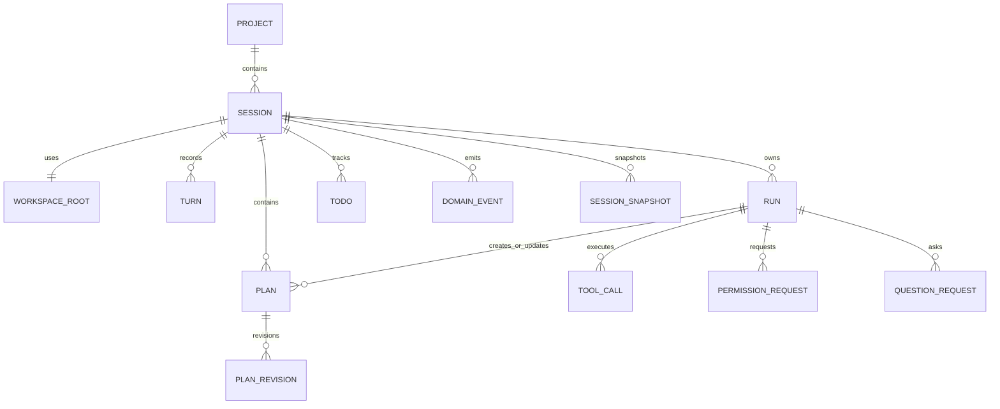
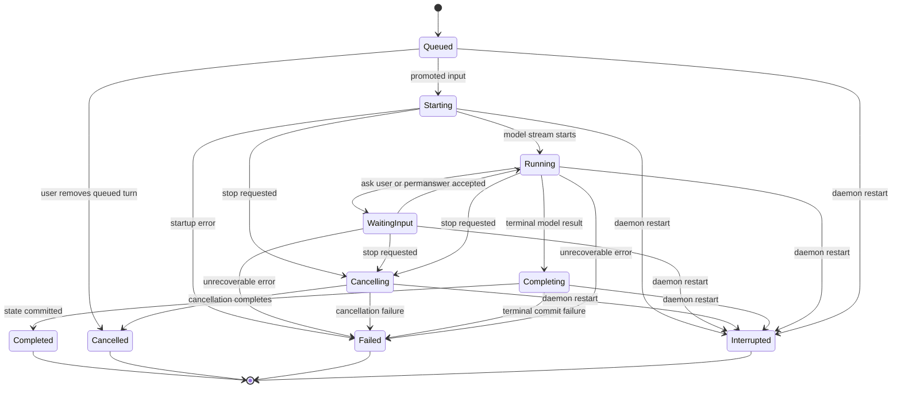
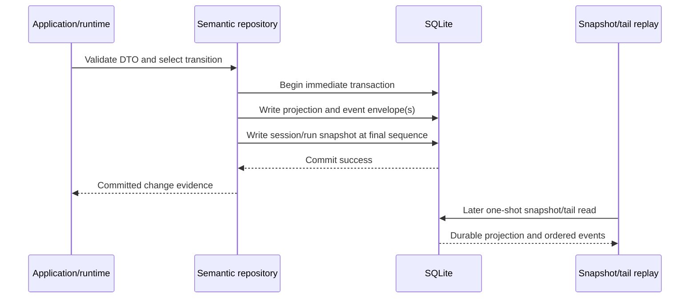

# Sessions, Runs, Events, and Storage

## Scope

This document defines the durable session/run model, automatic persistence, current-state projections, immutable events, snapshots, and recovery semantics.

It depends on [DTO and Contract Policy](02-dto-and-contract-policy.md) and [Daemon, Transport, and Adapters](03-daemon-transport-and-adapters.md).

## Aggregate relationships

## Core invariants

1. Each session has one mandatory stable `WorkspaceId` and declared `WorkspaceRootDto`; M3 persists the identity/root association, while M5 owns filesystem containment enforcement.
2. A session has at most one run in an active state.
3. Every turn, run, plan, tool call, todo, permission, question, and event carries stable typed identity.
4. Every semantic state-changing repository method commits the current-state projection, append-only event envelope(s), and updated session/run snapshot in one SQLite transaction, or changes nothing.
5. M3 writes a fresh durable session snapshot after every committed state change; **every affected run, including terminal and recovered runs**, receives a run snapshot at that same durable sequence.
6. Live events publish only after commit; M3 has no live publisher, so durable replay is the only delivered subscription behavior.
7. A queued user turn never becomes model input until it is explicitly promoted to a new run.
8. An interrupted run is terminal. It cannot silently resume after daemon recovery.

## Run state machine

Cancellation is deliberately two-step. A stop request commits `Starting` (or
another cancellable active state) to `Cancelling`; only a subsequent terminal
commit may transition it to `Cancelled`. Thus `Starting -> Cancelling ->
Cancelled` is required, never collapsed. **Every terminal repository
transition** atomically attempts to remove and promote the oldest queued turn.
When one exists, the repository creates that turn's already-selected `RunId`
with its immutable snapshot, appends `RunStatusChanged` before `RunStarted`, and
snapshots the final projection; callers cannot opt out of this behavior.

The exact policy for a question or permission after restart is M4 work. M3 marks
the unfinished run interrupted and does not resume it.

## Durable input queue

When a session has an active run, `SendUserTurnCommandDto` creates a durable queued turn rather than creating a parallel run.

### Required semantics

- queued turns receive a durable, zero-based, monotonic, never-reused queue ticket; removal does not renumber remaining tickets;
- a user can inspect and remove an unstarted queued turn;
- after the active run reaches a terminal state, the repository atomically selects and promotes the oldest eligible queued turn, if any, as part of that terminal transition;
- promotion preserves the queued turn's original durable proposed `RunId`, selected
  immutable config snapshot, and `ConfigRevisionId`; a daemon configuration
  change before the predecessor reaches its terminal transition cannot replace
  that selection; and
- a failed, cancelled, or interrupted prior run does not silently inject partial assistant content into the next run's context; and
- queue promotion is deterministic and testable without UI timing.

## Persistence model

SQLite is the M3 `intention-storage` implementation. It uses bundled SQLite
with `rusqlite_migration` to apply supported schema migrations and rejects a
newer on-disk schema. Storage combines:

- normalized current-state tables for project, workspace-root, session, run, and queue queries;
- append-only domain-event envelopes for auditability and event-tail recovery;
- per-state-change session snapshots and snapshots for every affected run, including terminal and recovered runs; and
- credential-free canonical `ConfigSnapshotDto` revisions keyed by `ConfigRevisionId`; the same revision ID with an equal snapshot is idempotent, while the same ID with a different snapshot fails with a typed conflict.

The M3 schema contains `projects`, `workspace_roots`, `sessions`, `turns`,
`runs`, `queued_turns`, `configuration_revisions`, `domain_events`,
`session_snapshots`, and `run_snapshots`. Tool, message, plan, todo, permission,
and question persistence belongs to later owning milestones.

## Transaction and publication order

If a write fails before commit, no new projection, event envelope, or snapshot
exists. M3's publisher seam is invoked only after commit but intentionally has
no live fan-out; a later one-shot replay reads the committed durable state.

## Event taxonomy, snapshots, and event sequences

M3 event payloads are closed, explicit facts: `SessionCreated`,
`UserTurnAccepted`, `UserTurnQueued`, `QueuedTurnRemoved`, `RunStarted`, and
`RunStatusChanged`. `ConfigurationRevisionAccepted` and `PlanStatusChanged` are
reserved typed taxonomy for their later workflows; M3 does not claim they are
emitted by an accepted configuration edit or plan action.

- Domain events are ordered per session with `SessionEventSequenceDto`.
- Event IDs provide deduplication; sequence provides ordering.
- Every state-changing commit persists a snapshot whose `at_sequence` includes its final event.
- A replay-only subscriber without a run scope receives the current durable projection snapshot and an empty contiguous tail at that snapshot's sequence, or a typed resync response. A known-session tail position beyond the durable final sequence, including one outside SQLite's integer range, fails typed `invalid_event_tail_position` before a history query; an unknown session remains typed not-found.
- Every request with `run_id: Some` receives typed `HistoryUnavailable` resync for M3, including matching, nonexistent, cross-session, unknown-session, and future-cursor run IDs; it never receives unfiltered session state because the session-contiguous snapshot/tail DTOs cannot safely represent a filtered run view.
- Correct run-scoped replay is deferred to the persistent streaming and representation hardening marked `@todo(m4-streaming)`; M3 does not claim that resync is a full stream.
- Events are immutable. Corrections are new events and projection/snapshot updates, not history rewrites.
- M3 retains complete stored history for its delivered replay behavior; compaction/retention policy remains future work.

## Recovery

Daemon startup completes recovery before it can report ready. It snapshots the
pre-existing unfinished runs, transitions each one to `interrupted` through the
same mandatory terminal-transition transaction used during normal operation,
and writes the resulting snapshots. A newly promoted `starting` run represents
already durable queued input only: recovery does not include it in that initial
set or resume model, tool, shell, or other external work automatically.

Recovery must not assert whether an interrupted `execute` or external tool had
already caused a side effect. The stored tool/run audit is evidence of intent
and observed state, not proof of external atomicity.

## Required tests and outcomes

| Requirement | Test evidence | Observable outcome |
| --- | --- | --- |
| One active run and stable tickets | SQLite contract test for concurrent logical acceptance, idempotency, queue removal, ticket non-reuse, and oldest-ticket promotion. | A second turn is durably queued with a never-reused ticket; no second active run exists, and only the oldest queued turn can promote. |
| Atomic state, events, and snapshots | SQLite fault-injection outcome test after event, projection, and snapshot stages. | Each injected failure rolls back: no new projection, event envelope, or snapshot persists. |
| Canonical config revision IDs | SQLite config-revision contract test. | An equal credential-free snapshot for the same `ConfigRevisionId` is idempotent; a different snapshot for that ID fails with a typed conflict. |
| Explicit event taxonomy | Domain/protocol event fixture tests. | M3 facts serialize as the closed documented event variants with stable identity and sequence. |
| Required cancellation path | Runtime state-machine test. | A starting run must commit `Starting -> Cancelling -> Cancelled`; direct terminal cancellation is rejected. |
| Atomic terminal promotion | Runtime and SQLite contract tests. | A terminal transition and next queued run start are one durable commit with ordered facts; the promotion retains the queued turn's proposed `RunId`, config snapshot, and revision despite later daemon config changes. |
| Recovery before ready | Composition restart fixture with an unfinished run. | Every unfinished run becomes `interrupted` before readiness; no external work resumes. |
| Replay-only consistency | Durable facade snapshot/tail/resync contract test. | One-shot subscription returns a current projection plus stored contiguous tail or typed resync, never a live stream. |
| SQLite migration and config persistence | SQLite migration/future-schema and safe snapshot persistence fixtures. | Supported migrations apply, a future schema fails safely, and only credential-free snapshot data persists. |

## Quality-gate integration

Session, run, queue, event, snapshot, and transaction tests are mandatory `make verify` inputs. Their crates are Tier B coverage targets and must exercise every declared feature profile. Numeric coverage does not excuse missing fault-injection, recovery, ordering, or durable queue outcome tests. See [12 Quality Gates and Makefile](12-quality-gates-and-makefile.md).

## Non-goals

- Event sourcing as the sole query model.
- Concurrent runs and event-merge semantics in one session.
- Automatic continuation after restart.
- Distributed replication or cross-device synchronization.
