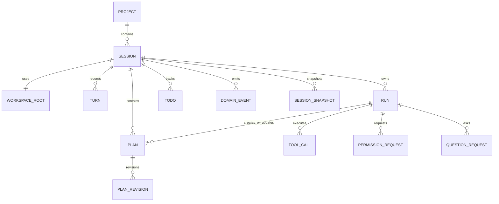
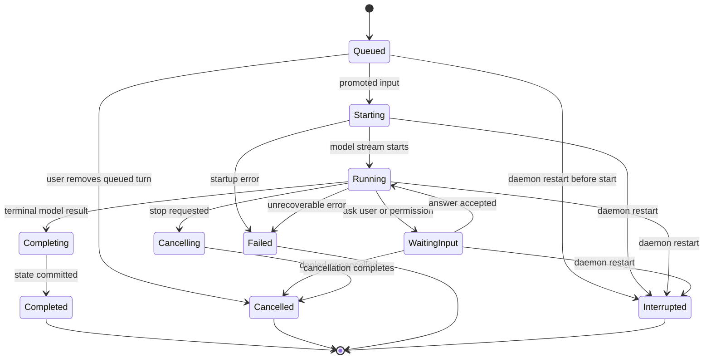
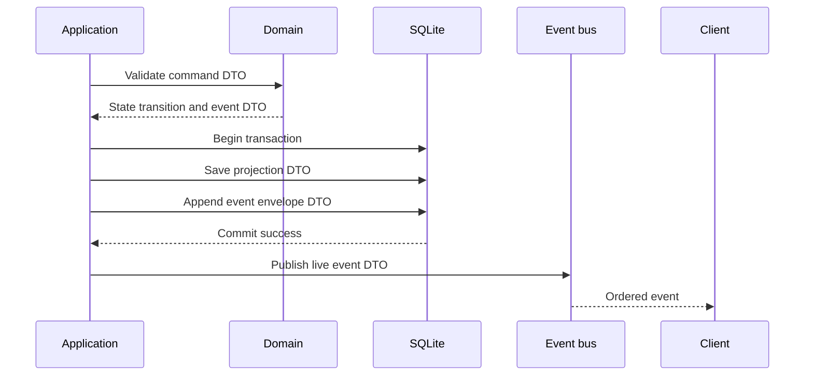

# Sessions, Runs, Events, and Storage

## Scope

This document defines the durable session/run model, automatic persistence, current-state projections, immutable events, snapshots, and recovery semantics.

It depends on [DTO and Contract Policy](02-dto-and-contract-policy.md) and [Daemon, Transport, and Adapters](03-daemon-transport-and-adapters.md).

## Aggregate relationships



## Core invariants

1. Each session has one mandatory `WorkspaceRootDto`.
2. A session has at most one run in an active state.
3. Every turn, run, plan, tool call, todo, permission, question, and event carries stable typed identity.
4. Every state-changing command either commits a current-state projection and its immutable event together, or changes nothing.
5. Live events publish only after commit.
6. A queued user turn never becomes model input until it is explicitly promoted to a new run.
7. An interrupted run is terminal. It cannot silently resume after daemon recovery.

## Run state machine



The exact policy for a question or permission after restart must be decided before its implementation. The default safety direction is to mark the run interrupted and invalidate outstanding interactive requests.

## Durable input queue

When a session has an active run, `SendUserTurnCommandDto` creates a durable queued turn rather than creating a parallel run.

### Required semantics

- queued turns have a stable queue position and creation event;
- a user can inspect and remove an unstarted queued turn;
- after the active run reaches a terminal state, the next eligible queued turn may be promoted according to explicit policy;
- promotion creates a new `RunId`, a config snapshot, and a run-start event;
- a failed or interrupted prior run does not silently inject partial assistant content into the next run's context;
- queue promotion must be testable deterministically without UI timing.

## Persistence model

SQLite is the first `intention-storage` implementation. Storage combines:

- normalized tables for current queries and UI snapshots;
- append-only domain events for auditability and event-tail recovery;
- run/session snapshots for efficient restoration.

Planned table families:

```text
projects
workspace_roots
sessions
turns
messages
runs
queued_turns
tool_calls
tool_results
todos
plans
plan_revisions
permission_requests
question_requests
configuration_revisions
domain_events
session_snapshots
run_snapshots
```

Exact SQL layout is intentionally deferred until repository DTOs and query patterns are designed.

## Transaction and publication order



If persistence fails, no live event is published. If publication fails after commit, reconnect recovery must retrieve the committed event from storage.

## Snapshots and event sequences

- Domain events are ordered per session with `SessionEventSequenceDto`.
- Event IDs provide deduplication; sequence provides ordering.
- Snapshot DTOs include the latest included session sequence.
- A subscriber receives a snapshot followed only by events after that sequence.
- Events are immutable. Corrections are new events and projection updates, not history rewrites.
- Compaction may later create a new snapshot, but must preserve a documented audit/retention policy.

## Recovery

Daemon startup restores durable projections. Any run with an unfinished status transitions to `interrupted` before it is presented as active to an adapter.

Recovery must not assert whether an interrupted `execute` or external tool had already caused a side effect. The stored tool/run audit is evidence of intent and observed state, not proof of external atomicity.

## Required tests and outcomes

| Requirement | Test evidence | Observable outcome |
| --- | --- | --- |
| One active run | Concurrent `SendUserTurn` application test. | Second turn is queued; no second active run exists. |
| Atomic state/event | Fault-injection storage test. | Projection and event commit together or neither exists. |
| Publish after commit | Event bus integration test. | Subscriber never receives an event absent from storage. |
| Queue promotion | Deterministic runtime test. | Next queued turn starts only after terminal prior run state. |
| Restart handling | SQLite fixture with running run. | Daemon emits/persists `RunInterrupted`. |
| Reconnect consistency | Snapshot plus tail test. | Rebuilt state equals current projection. |
| Event ordering | Property/integration test with reconnect and duplicates. | Reducer reaches one stable state. |

## Quality-gate integration

Session, run, queue, event, snapshot, and transaction tests are mandatory `make verify` inputs. Their crates are Tier B coverage targets and must exercise every declared feature profile. Numeric coverage does not excuse missing fault-injection, recovery, ordering, or durable queue outcome tests. See [12 Quality Gates and Makefile](12-quality-gates-and-makefile.md).

## Non-goals

- Event sourcing as the sole query model.
- Concurrent runs and event-merge semantics in one session.
- Automatic continuation after restart.
- Distributed replication or cross-device synchronization.
