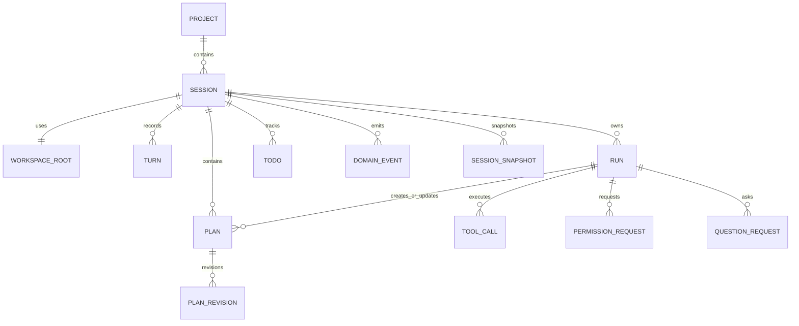
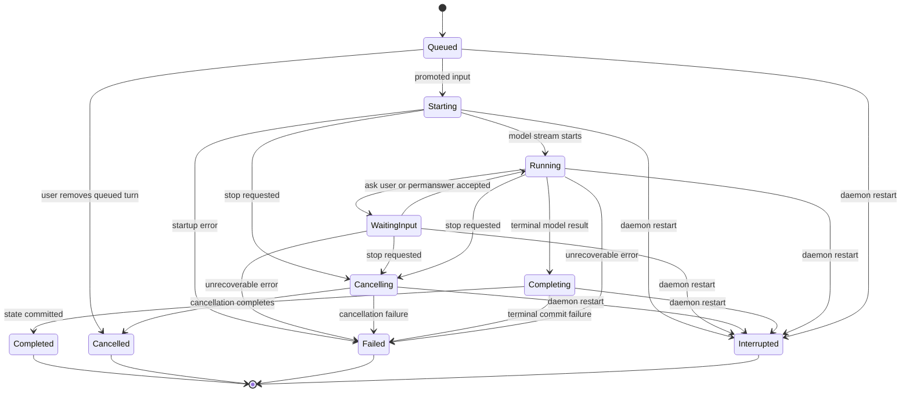
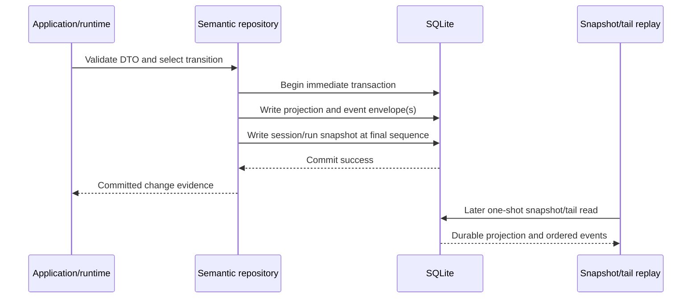

# Sessions, Runs, Events, and Storage

## Scope

This document defines the durable session/run model, automatic persistence, current-state projections, immutable events, snapshots, and recovery semantics.

It depends on [DTO and Contract Policy](02-dto-and-contract-policy.md) and [Daemon, Transport, and Adapters](03-daemon-transport-and-adapters.md).

## Aggregate relationships

## Core invariants

1. Each session has one mandatory stable `WorkspaceId` and declared `WorkspaceRootDto`; M3 persists the identity/root association, while M5 owns filesystem containment enforcement.
2. A session has at most one run in an active state.
3. Every turn, run, plan, tool call, todo, permission, question, and event carries stable typed identity.
4. Every semantic state-changing repository method commits the current-state projection, append-only event envelope(s), and updated session/run snapshot in one SQLite transaction, or changes nothing.
5. M3 writes a fresh durable session snapshot after every committed state change; **every affected run, including terminal and recovered runs**, receives a run snapshot at that same durable sequence.
6. Live run updates publish only after commit and an independent scoped durable reread; M3 session subscriptions remain durable replay-only.
7. A queued user turn never becomes model input until it is explicitly promoted to a new run.
8. An interrupted run is terminal. It cannot silently resume after daemon recovery.

## Run state machine

Cancellation is deliberately two-step. A stop request commits `Starting` (or
another cancellable active state) to `Cancelling`; only a subsequent terminal
commit may transition it to `Cancelled`. Thus `Starting -> Cancelling ->
Cancelled` is required, never collapsed. **Every terminal repository
transition** atomically attempts to remove and promote the oldest queued turn.
When one exists, the repository creates that turn's already-selected `RunId`
with its immutable snapshot, appends `RunStatusChanged` before `RunStarted`, and
snapshots the final projection; callers cannot opt out of this behavior.

The exact policy for a question or permission after restart remains future tool
and interaction work. M4 preserves the M3 rule: the unfinished run is marked
interrupted and does not resume.

## Durable input queue

When a session has an active run, `SendUserTurnCommandDto` creates a durable queued turn rather than creating a parallel run.

### Required semantics

- queued turns receive a durable, zero-based, monotonic, never-reused queue ticket; removal does not renumber remaining tickets;
- a user can inspect and remove an unstarted queued turn;
- after the active run reaches a terminal state, the repository atomically selects and promotes the oldest eligible queued turn, if any, as part of that terminal transition;
- promotion preserves the queued turn's original durable proposed `RunId`, selected
  immutable config snapshot, and `ConfigRevisionId`; a daemon configuration
  change before the predecessor reaches its terminal transition cannot replace
  that selection; and
- a failed, cancelled, or interrupted prior run does not silently inject partial assistant content into the next run's context; and
- queue promotion is deterministic and testable without UI timing.

## Persistence model

SQLite is the M3 `intention-storage` implementation. It uses bundled SQLite
and creates the complete current storage schema directly on open; there is no
migration chain and no version gate (ADR 0038). Storage combines:

- normalized current-state tables for project, workspace-root, session, run, and queue queries;
- append-only domain-event envelopes for auditability and event-tail recovery;
- per-state-change session snapshots and snapshots for every affected run, including terminal and recovered runs; and
- credential-free canonical `ConfigSnapshotDto` revisions keyed by `ConfigRevisionId`; the same revision ID with an equal snapshot is idempotent, while the same ID with a different snapshot fails with a typed conflict.

The current storage schema contains the `projects`, `workspace_roots`,
`sessions`, `turns`, `runs`, `queued_turns`, `configuration_revisions`,
`domain_events`, `session_snapshots`, and `run_snapshots` base tables, the M4
`run_cursors`, `model_run_facts`, and `model_run_snapshots` tables, and the
`tool_results` table, all created directly on open. The fact index
references the canonical typed `domain_events` envelope; it stores no duplicate
payload. Run cursors are seeded at zero per run by the write path
(`ensure_run_cursors`), never by open-time hydration.

## Transaction and publication order

If a write fails before commit, no new projection, event envelope, or snapshot
exists. The M4 daemon host observes successful execution commits, independently
rereads the exact `(SessionId, RunId)` durable scope, and only then fan-outs a
contiguous live batch or status snapshot. A publisher failure never rolls back
the already committed durable state. M3's session publisher remains a no-op; a
later one-shot session replay reads committed durable state.

### Common durable-fact rules

The following cross-direction rules govern future fact families and their
sequences (adopted by [ADR 0019](../decisions/0019-production-model-tool-loop.md)):

- a new fact type does not create a new sequence merely for convenience; a
  separate sequence is permitted only for an independent aggregate with
  dedicated bounded queries and without replacing or filtering the ordinary
  session event sequence;
- a filesystem-dependent validation or hook must finish before the transition
  transaction, and any stale result becomes a typed known pre-effect outcome
  rather than an unrecorded second external check inside the transaction; and
- catalog and lineage audit records are read through their own bounded queries
  and do not enter the run publication gate merely because they are related to
  the same user operation.

Daemon-host outcome fixtures make the `Starting`/`Cancelling` first-append race
deterministic and prove task-owned cancellation leaves cursor zero with neither
provider execution nor model facts. They also prove a terminal promotion is
scheduled from the exact persisted successor once. A blocked in-flight durable
host reopened through a fresh host interrupts the original run before replay,
does not resume it or a recovery-promoted `Starting` successor, and retains
only credential-free replay, event, snapshot, and error representations.

## Event taxonomy, snapshots, and event sequences

M5 adds tool lifecycle/result evidence to the durable taxonomy. Tool
admission, start, and exactly one terminal outcome are correlated by
`SessionId`, `RunId`, and `ToolCallId`; the terminal record may carry the
bounded, redacted typed `ToolResultEvidenceDto`. Result evidence is distinct
from model facts and is persisted before publication.

M3 event payloads are closed, explicit facts: `SessionCreated`,
`UserTurnAccepted`, `UserTurnQueued`, `QueuedTurnRemoved`, `RunStarted`, and
`RunStatusChanged`. M4 adds typed durable model facts: `ProviderAttemptStarted`,
`ProviderAttemptFailed`, `RetryScheduled`, `AssistantContentAppended`,
`ReasoningDeltaRecorded`, `UsageRecorded`, `ToolCallRecorded`, `Finished`, and
`Failed`. Every M4 fact is a typed `DomainEventDto` payload with its dedicated
per-run cursor; no raw JSON payload is an event boundary.
`ConfigurationRevisionAccepted`, `PlanStatusChanged`, `PlanApproved`,
`BuildContinuationRequested`, and `BuildRunStartedFromPlan` are reserved typed
taxonomy for the Plan/Build workflow. Their activation must preserve M3/M4
historical event bytes and use additive versioned records.

- Domain events are ordered per session with `SessionEventSequenceDto`.
- Event IDs provide deduplication; sequence provides ordering.
- Every state-changing commit persists a snapshot whose `at_sequence` includes its final event.
- A replay-only subscriber without a run scope receives the current durable projection snapshot and an empty contiguous tail at that snapshot's sequence, or a typed resync response. A known-session tail position beyond the durable final sequence, including one outside SQLite's integer range, fails typed `invalid_event_tail_position` before a history query; an unknown session remains typed not-found.
- Correct run-scoped replay uses a dedicated `RunSnapshotDto` and
  `RunEventTailPageDto`; it never filters a session snapshot. A current replay
  returns the snapshot at cursor C and an empty tail after C. Tail reads are
  strict `> after_cursor`, contiguous, at most 256 facts and 512 KiB canonical
  fact data, and return `next_after_cursor` plus `has_more`. Unknown or
  cross-session runs return `run_replay_not_found`; bad cursors return
  `invalid_run_event_cursor`; unavailable history returns
  `run_history_unavailable`. An append above the 512 KiB individual fact limit
  returns `run_fact_too_large`; a stale expected cursor returns
  `run_event_cursor_conflict` with immediate retry guidance.
- The daemon task and cancellation registries are keyed by exact
  `(SessionId, RunId)`. Admission and `StopRun` serialize through that registry:
  a host inserts a provider-neutral cancellation signal before spawning a newly
  admitted durable `Starting` run and deduplicates repeated admission. `StopRun`
  first commits `Cancelling`, publishes the durable status, then signals that
  exact task. If stop wins before registration, it installs an exact
  task-owned cancellation terminalizer, so later admission cannot leave durable
  `Cancelling` state stranded. The executor owns the terminal cancellation
  transition and suppression of late facts. If `StopRun` wins between the
  executor's initial `Starting` replay and its first
  `Starting -> Running` append, the task rereads its exact durable scope after
  rejection and terminalizes `Cancelling -> Cancelled`; unrelated append
  failures remain errors. A terminal commit may
  promote a queued `Starting` run, which the host schedules once from persisted
  context. Recovery never admits old or recovery-promoted work to a provider.
- A runtime configuration lookup for a matching `(SessionId, RunId)` returns
  only its immutable credential-free `ConfigSnapshotDto`, selected by the
  run's persisted `ConfigRevisionId`. Unknown sessions, unknown runs, and
  cross-session runs all return `run_configuration_not_found`; unavailable or
  malformed persisted selection returns `run_configuration_unavailable`. Raw
  TOML, configuration paths, credentials, and SQLite resources never cross
  this DTO-only read boundary.
- M4 wire run subscriptions are separate from M3 session subscriptions. Their
  correlated first reply is an authoritative `RunReplayDto`, a typed
  `RunResyncDto`, or a safe `ErrorDto`; later historical/live batches use the
  dedicated run cursor and status-only commits use authoritative
  `RunSnapshotFrameDto` values. A client ignores snapshot-subsumed text, usage,
  finish, and failure facts during historical catch-up, accepts tail-only
  reasoning once, and requires resync without guessing after a cursor gap.
  Unavailable contiguous history fails closed as `HistoryUnavailable` with no
  accepted snapshot or frames.
- M3 public subscription behavior remains unchanged: every request with
  `run_id: Some` receives typed `HistoryUnavailable` resync and never receives
  unfiltered session state.
- The M4 runtime executor loads the exact current run replay before it
  starts, then compares the caller-supplied safe provider kind, model, endpoint,
  attempt timeout, and max-attempt selection exactly against the persisted
  credential-free snapshot. A mismatch makes no provider call and appends the
  safe terminal `provider_configuration_unavailable` failure. The executor
  appends every model fact with the returned cursor only and delegates each
  fact/status batch to the repository's atomic append contract. It records
  `Starting -> Running` attempt facts, batches one assistant turn into non-blank
  UTF-8-safe 4 KiB content facts, retains reasoning only in the tail, records
  usage once through stream lifecycle validation, records typed tool-call
  facts durably and executes admitted calls through the daemon-owned registry
  with correlated `ToolResultRecorded` facts, and
  commits `Running -> Completing` before the separate `Completing -> Completed`
  transition. A provider-neutral runtime time port supplies durable timestamps,
  attempt deadlines, and the cancellation-aware fixed 250 ms retry wait.
  Retryable provider/deadline failures can make only one retry, only before any
  durable text, reasoning, usage, or tool fact; `ProviderAttemptFailed` then
  `RetryScheduled` precede the next attempt. Cancellation suppresses later
  stream activity and never resumes after recovery.
- Events are immutable. Corrections are new events and projection/snapshot updates, not history rewrites.
- M3 retains complete stored history for its delivered replay behavior; compaction/retention policy remains future work.

## Recovery

Daemon startup completes recovery before it can report ready. It snapshots the
pre-existing unfinished runs, transitions each one to `interrupted` through the
same mandatory terminal-transition transaction used during normal operation,
and writes the resulting snapshots. A newly promoted `starting` run represents
already durable queued input only: recovery does not include it in that initial
set or resume model, tool, shell, or other external work automatically.

Recovery must not assert whether an interrupted `execute` or external tool had
already caused a side effect. The stored tool/run audit is evidence of intent
and observed state, not proof of external atomicity.

## Required tests and outcomes

| Requirement | Test evidence | Observable outcome |
| --- | --- | --- |
| One active run and stable tickets | SQLite contract test for concurrent logical acceptance, idempotency, queue removal, ticket non-reuse, and oldest-ticket promotion. | A second turn is durably queued with a never-reused ticket; no second active run exists, and only the oldest queued turn can promote. |
| Atomic state, events, and snapshots | SQLite fault-injection outcome test after event, projection, and snapshot stages. | Each injected failure rolls back: no new projection, event envelope, or snapshot persists. |
| Canonical config revision IDs | SQLite config-revision contract test. | An equal credential-free snapshot for the same `ConfigRevisionId` is idempotent; a different snapshot for that ID fails with a typed conflict. |
| Explicit event taxonomy | Domain/protocol event fixture tests. | M3 facts serialize as the closed documented event variants with stable identity and sequence. |
| Required cancellation path | Runtime state-machine test. | A starting run must commit `Starting -> Cancelling -> Cancelled`; direct terminal cancellation is rejected. |
| Atomic terminal promotion | Runtime and SQLite contract tests. | A terminal transition and next queued run start are one durable commit with ordered facts; the promotion retains the queued turn's proposed `RunId`, config snapshot, and revision despite later daemon config changes. |
| Recovery before ready | Composition restart fixture with an unfinished run. | Every unfinished run becomes `interrupted` before readiness; no external work resumes. |
| Replay-only consistency | Durable facade snapshot/tail/resync contract test. | One-shot subscription returns a current projection plus stored contiguous tail or typed resync, never a live stream. |
| SQLite current-schema creation and config persistence | SQLite current-schema and safe snapshot persistence fixtures. | The complete current schema is created directly on open, and only credential-free snapshot data persists. |
| M4 durable model facts and replay | Domain/storage/SQLite contract fixtures and fault injection after fact envelope/index, projection, and snapshot stages. | Typed fact batches use exact cursors, bounded scoped replay never leaks a run, and every injected stage rolls back fact/index/cursor/projection/session/M4 snapshot state. |

## Quality-gate integration

Session, run, queue, event, snapshot, and transaction tests are mandatory `make verify` inputs. Their crates are Tier B coverage targets and must exercise every declared feature profile. Numeric coverage does not excuse missing fault-injection, recovery, ordering, or durable queue outcome tests. See [12 Quality Gates and Makefile](12-quality-gates-and-makefile.md).

## Non-goals

- Event sourcing as the sole query model.
- Concurrent runs and event-merge semantics in one session.
- Automatic continuation after restart.
- Distributed replication or cross-device synchronization.

Physical deletion and garbage collection of historical work are an accepted
post-M5 future direction under
[ADR 0034](../decisions/0034-accepted-m5plus-retained-deferral-directions.md),
to be executed in Milestone 5+ as an explicit user-authorized
retention/deletion/garbage-collection policy that never rewrites or corrupts
history, never destroys descendants or audit dependencies, and is never a
silent automatic cleanup; archive-only retention remains the first-scope
default. It is not activated here.

## Post-M4 Mandate foundation boundary

This section preserves the current Session/Run model and records only the
future aggregate boundary. It does not add a table, event, state variant, or
scheduler implementation.

A future Mandate is a distinct durable work aggregate. It may associate with a
future service-session concept while preserving the existing one-active-run
invariant for that service session. Mandate triggers are durable causal reasons
for future fresh admission; they are not M3 `queued_turns` and do not reinterpret
legacy queue tickets.

For future Mandate work:

- admission freezes the selected Mandate revision, trigger, execution meaning,
  and applicable safe context before dependent external work;
- a revision while a Mandate run is non-terminal affects only a later fresh run;
- user lifecycle/revision commands win optimistic conflicts with daemon
  operational facts or later verifier mutations;
- no external provider, tool, process, kernel, child, MCP, network, or
  scheduler action occurs inside the transition transaction;
- recovery preserves durable facts/triggers but never resumes old work;
- an unknown external terminal effect causes the owning Mandate to await an
  explicit future reconciliation, not an automatic retry or next model step.

The detailed Mandate lifecycle, trigger ordering, fresh admission, uncertainty,
and recovery contract is owned by [Mandate domain and durable lifecycle](13-mandate-domain-and-durable-lifecycle.md).
Scheduler semantics are owned by architecture 16; concrete timer/process
topology, event variants, protocol delivery, and schema design remain later
packages. Child graph and verifier authority semantics are owned by architecture
17; their SQL, migrations, event variants, and protocol delivery remain
deferred. Existing run states and M3/M4 recovery behavior remain unchanged.

See [decision 0001](../decisions/0001-mandate-authority-and-fresh-run-lifecycle.md)
and [decision 0002](../decisions/0002-external-attempt-evidence-and-unknown-effect-reconciliation.md).

## Post-M4 tool-loop storage consequence

Future model-tool-loop work atomically records a completed tool-calling model
step, its ordered tool group, normalized calls, cursor/projection/event/snapshot
updates before any local effect. Future admissions, starts, fragments, and
terminal results remain run-cursor ordered, commit before publication, and
publish only after an independent scoped reread. A started effect without
terminal proof follows the Mandate uncertainty transition; recovery never retries
or resumes a tool action. This adds no current table, event, state, migration,
or reinterpretation of M4 `ToolCallRecorded` denial. Exact semantics are owned
by [Tool registry and direct Mandate tool loop](15-tool-registry-and-mandate-tool-loop.md).

## Post-M4 execution-meaning storage consequence

Future Mandate admission binds immutable canonical execution meaning in the same
transaction as the new RunId and Mandate transition. The detailed envelope,
canonical bytes, decoder outcomes and historical bridge law are owned by [Run
execution meaning and historical compatibility](14-run-execution-meaning-and-historical-compatibility.md).
This does not add a table, event, migration or synthetic M3/M4 field.

## Post-M4 scheduler storage consequence

Future scheduler observations and candidate outcomes remain Mandate-local
evidence, distinct from M3 queue tickets, Session event sequence, and Run event
cursor. An unavailable candidate retains its reason and creates no Run. Fresh
admission revalidates lifecycle, sequence, revision, reason, meaning, and
readiness atomically; no scheduler action occurs in that transaction. Scheduler
admission begins only after recovery, and pre-crash live readiness is never
trusted. This adds no current table, event, migration, or ordinary queue change.
See [Mandate scheduler and readiness-driven admission](16-mandate-scheduler-and-readiness-driven-admission.md).

## Post-M4 child/verifier storage consequence

Future child creation atomically binds the child Mandate, immutable direct edge,
delegation snapshot, parent tool result, and their affected projections/events/
snapshots before publication. Future verifier mutation atomically validates its
authority and frozen target baseline with its applied or rejected result. These
facts remain separate from Session sequence, Run cursor, M3 queue tickets, and
M4 replay. Recovery rebuilds only supported graph projections and never resumes
child/verifier external work. This adds no current table, event, migration, or
historical reinterpretation. Detailed semantics are owned by [Mandate child
graph and delegated verifier authority](17-mandate-child-graph-and-delegated-verifier-authority.md).

## Post-M4 MCP storage consequence

Future MCP discovery atomically commits safe discovery evidence, immutable
capability revisions, accumulated selection, and its tool result before
publication. Future invocation atomically binds its exact selection/capability/
input before effect and persists only safe terminal projection or exact
uncertainty evidence. These records remain separate from Session sequence, Run
cursor, ordinary queues, and M4 replay. Recovery never reconnects, reattaches,
rediscoveries, retries, or resumes MCP work. This adds no current table, event,
migration, or historical reinterpretation. Detailed semantics are owned by
[Mandate MCP capability lifecycle](18-mandate-mcp-capability-lifecycle.md).

## Post-M4 provider-evolution storage consequence

Future provider catalog/profile/revision/audit records and provider-selection
bindings are additive, credential-free records. They do not rewrite or
retrospectively classify M4 snapshots, UUID `ConfigRevisionId` values, events,
queues, run cursors, facts, or replay bytes. Catalog audit uses its own sequence;
recovery never resumes a prior provider request. Detailed semantics are owned by
[Provider evolution, profiles, and reasoning](22-provider-evolution-profiles-and-reasoning.md).

## Post-M4 session branching storage consequence

Architecture 23 owns future ordinary Session lineage. Additive fork records and
a separate lineage sequence may create independent child Sessions, but cannot
rewrite source events, M3/M4 bytes, queues, cursors, snapshots, or replay. One
active run remains a per-Session invariant; concurrent branches are separate
Sessions, not parallel runs in one Session.
