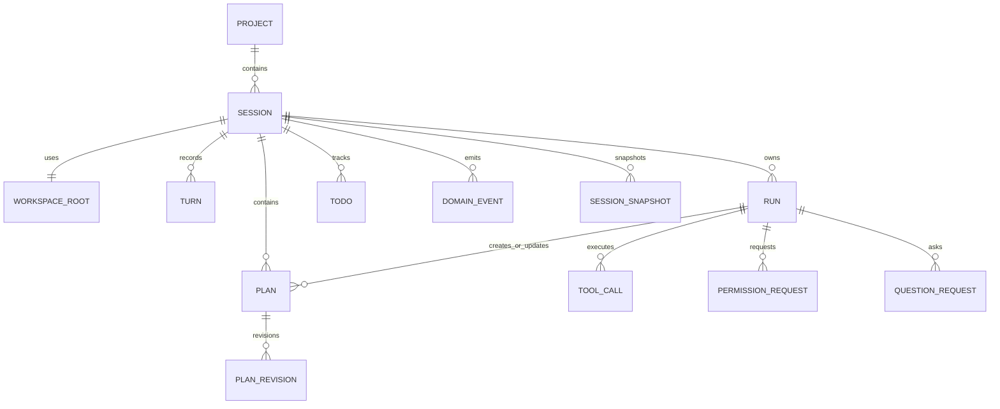
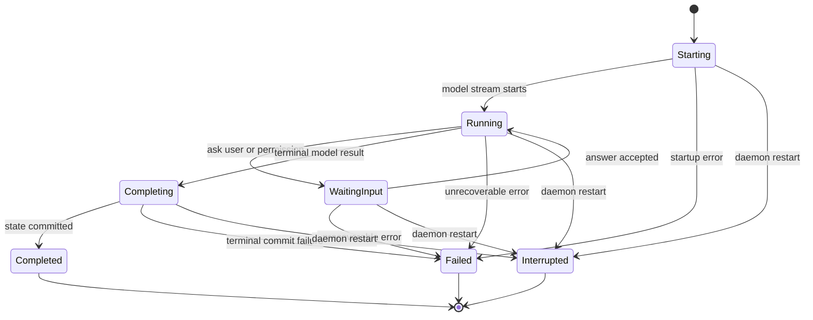
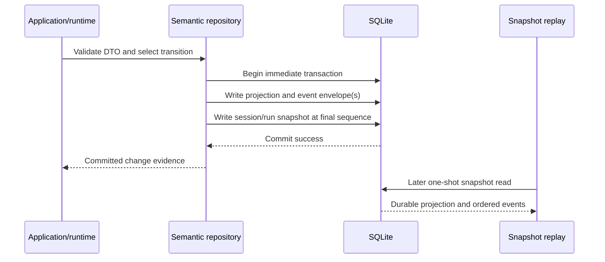

# Sessions, Runs, Events, and Storage

**Current policy.**

This document defines the durable session/run model, automatic persistence, current-state projections, immutable events,
snapshots, and recovery semantics. It depends on [DTO and Contract Policy](02-dto-and-contract-policy.md) and [Daemon,
Transport, and Adapters](03-daemon-transport-and-adapters.md).

## Aggregate relationships

```mermaid
erDiagram
  PROJECT ||--o{ SESSION : contains
  SESSION ||--|| WORKSPACE_ROOT : uses
  SESSION ||--o{ TURN : records
  SESSION ||--o{ RUN : owns
  SESSION ||--o{ PLAN : contains
  SESSION ||--o{ TODO : tracks
  SESSION ||--o{ DOMAIN_EVENT : emits
  SESSION ||--o{ SESSION_SNAPSHOT : snapshots
  RUN ||--o{ TOOL_CALL : executes
  RUN ||--o{ PLAN : creates_or_updates
  RUN ||--o{ PERMISSION_REQUEST : requests
  RUN ||--o{ QUESTION_REQUEST : asks
  PLAN ||--o{ PLAN_REVISION : revisions
```

## Core invariants

1.  Each session has one mandatory stable `WorkspaceId` and declared `WorkspaceRootDto`; M3 persists the identity/root
association, while M5 owns the workspace addressing policy — the root as an anchor, not a containment boundary (ADR
0013).
2. A session has at most one run in an active state.
3. Every turn, run, plan, tool call, todo, permission, question, and event carries stable typed identity.
4.  Every semantic state-changing repository method commits the current-state projection, append-only event envelope(s),
and updated session/run snapshot in one SQLite transaction, or changes nothing.
5.  M3 writes a fresh durable session snapshot after every committed state change; **every affected run, including
terminal and recovered runs**, receives a run snapshot at that same session event sequence.
6.  Live run updates publish only after commit and an independent scoped durable reread; M3 session subscriptions remain
durable replay-only.
7. A user turn accepted while a run is active is recorded pending and joins that run's live context in durable order
at the next model boundary; it never starts a second run.
8. `Interrupted` is a recovery-only terminal status: an unfinished run becomes `Interrupted` on restart and never
silently resumes, while `run.interrupt` leaves the live run `Running` and continues its work.

## Run state machine

```mermaid
stateDiagram
  [*] --> Starting
  Starting --> Running: model stream starts
  Starting --> Failed: startup error
  Starting --> Interrupted: daemon restart
  Running --> WaitingInput: ask user or permission
  WaitingInput --> Running: answer accepted
  WaitingInput --> Failed: unrecoverable error
  WaitingInput --> Interrupted: daemon restart
  Running --> Completing: terminal model result
  Running --> Failed: unrecoverable error
  Running --> Interrupted: daemon restart
  Completing --> Completed: state committed
  Completing --> Failed: terminal commit failure
  Completing --> Interrupted: daemon restart
  Completed --> [*]
  Failed --> [*]
  Interrupted --> [*]
```

Interruption is not a run state. `run.interrupt` is accepted only for an exact active run, commits no durable status
change, records a durable `InterruptNoticeRecorded` notice for the stopped provider stream or tool call, resets the
run's cancellation signal, and the run continues with its next model step; `Cancelling` and `Cancelled` no longer
exist, and `Interrupted` remains recovery-only. The closed status vocabulary also declares `Queued` with `Starting` and
`Interrupted` as its only successors; the live path creates every run in `Starting` and produces no `Queued` run. A
terminal repository transition commits its projection, event, and snapshot atomically, and it has no queued successor
to promote.

The exact policy for a question or permission after restart remains future tool and interaction work. M4 preserves the
M3 rule: the unfinished run is marked interrupted and does not resume.

## Pending turns

When a session has an active run, `SendUserTurnCommandDto` records a durable pending turn rather than creating a
parallel run; when the session has no active run, acceptance starts a run — the oldest pending turn when one exists,
otherwise the accepted turn itself — and the acceptance reports `SendUserTurnOutcomeDto::Started` with that run and its
frozen configuration revision.

### Required semantics

-  a pending turn keeps its own proposed `RunId`, selected immutable config snapshot, and `ConfigRevisionId`, used if
it starts the successor run;
-  the runtime appends pending turns to the live run context at the next boundary — after the provider response that
ended a model step, or after a tool batch — in durable insertion order as `UserMessageAppended` facts, and the storage
transaction marks them `appended` so a turn joins exactly one run context;
- a user can inspect pending turns through `SessionProjectionDto.pending_turns` and remove a not-yet-seen one with
`turn.remove`; removal commits `TurnRemoved` and renumbers nothing;
-  pending turns are durable input: a restart preserves them, and a pending turn whose run ended before the join starts
the successor run through ordinary acceptance once the session has no active run;
-  a failed or interrupted prior run does not silently inject partial assistant content into the successor run's
context; and
- a boundary join is deterministic and testable without UI timing.

## Persistence model

SQLite is the M3 `intention-storage` implementation. It uses bundled SQLite and creates the complete current storage
schema directly on open; there is no migration chain and no version gate (ADR 0005). Storage combines:

- normalized current-state tables for project, workspace-root, session, run, and turn queries;
- append-only domain-event envelopes for auditability and event-tail recovery;
- per-state-change session snapshots and snapshots for every affected run, including terminal and recovered runs; and
-  credential-free canonical `ConfigSnapshotDto` revisions keyed by `ConfigRevisionId`; the same revision ID with an
equal snapshot is idempotent, while the same ID with a different snapshot fails with a typed conflict.

The current storage schema contains the `projects`, `workspace_roots`, `sessions`, `turns`, `runs`,
`configuration_revisions`, `domain_events`, `session_snapshots`, and `run_snapshots` base tables, the M4
`model_run_facts` and `model_run_snapshots` tables, the `container_journals` table, and the `tool_results` table, all
created directly on open. The `turns` table carries one accepted turn with its proposed run and configuration revision
and a closed `outcome` in `started`, `pending`, or `appended`. `container_journals` is the container journal mechanism: one dense journal per container
under a closed kind set whose only member today is `run`. The fact index references the canonical typed `domain_events`
envelope; it stores no duplicate payload. Opening the database seeds a container journal at zero for every stored run, and the write path seeds the journal of
each newly created run (`ensure_run_journals`); no read path hydrates a missing journal.

## Transaction and publication order

```mermaid
sequenceDiagram
  participant A as Application/runtime
  participant R as Semantic repository
  participant S as SQLite
  participant P as Snapshot replay

  A->>R: Validate DTO and select transition
  R->>S: Begin immediate transaction
  R->>S: Write projection and event envelope(s)
  R->>S: Write session/run snapshot at final sequence
  S-->>R: Commit success
  R-->>A: Committed change evidence
  P->>S: Later one-shot snapshot read
  S-->>P: Durable projection and ordered events
```

If a write fails before commit, no new projection, event envelope, or snapshot exists. The M4 daemon host observes
successful execution commits, independently rereads the exact `(SessionId, RunId)` durable scope, and only then fan-outs
a contiguous live batch or status snapshot. A publisher failure never rolls back the already committed durable state.
M3's session publisher remains a no-op; a later one-shot session replay reads committed durable state.

### Common durable-fact rules

The following cross-direction rules govern future fact families and their sequences (adopted by [ADR
0003](../decisions/0003-production-model-tool-loop.md)):

-  a new fact type does not create a new sequence merely for convenience; it either orders by the session event
sequence, belongs to exactly one container and orders by that container's journal, or has no durable order, and it
never replaces or filters the ordinary session event sequence;
-  a filesystem-dependent validation or hook must finish before the transition transaction, and any stale result becomes
a typed known pre-effect outcome rather than an unrecorded second external check inside the transaction.

Daemon-host outcome fixtures make the admission/interruption race deterministic and prove that an interrupt either
reaches the registered execution signal or arrives before admission and finds no in-flight operation to stop, and that
a stopped call leaves later facts non-authoritative. A blocked in-flight durable host reopened through a fresh host
interrupts the original run before replay, does not resume it, and retains only credential-free replay, event,
snapshot, and error representations; pending turns stay durable input.

## Event taxonomy, snapshots, and event sequences

M5 adds tool lifecycle/result evidence to the durable taxonomy. Tool admission, start, and exactly one terminal outcome
are correlated by `SessionId`, `RunId`, and `ToolCallId`; the terminal record may carry the bounded, redacted typed
`ToolResultEvidenceDto`. Result evidence is distinct from model facts and is persisted before publication.

M3 event payloads are closed, explicit facts: `SessionCreated`, `UserTurnAccepted`, `UserTurnPending`, `TurnRemoved`,
`RunStarted`, and `RunStatusChanged`. M4 adds typed durable model facts: `ProviderAttemptStarted`,
`ProviderAttemptFailed`, `RetryScheduled`, `AssistantContentAppended`, `ReasoningDeltaRecorded`, `UsageRecorded`,
`ToolCallRecorded`, `Finished`, and `Failed`; the pending-turn and interrupt work adds `UserMessageAppended` and
`InterruptNoticeRecorded` to that closed fact vocabulary. Every M4 fact is a typed `DomainEventDto` payload at a dedicated position
in the run's container journal; no raw JSON payload is an event boundary. `ConfigurationRevisionAccepted`,
`PlanStatusChanged`, `PlanApproved`, `BuildContinuationRequested`, and `BuildRunStartedFromPlan` are reserved typed
taxonomy for the Plan/Build workflow. Their activation must preserve M3/M4 historical event bytes and use additive
versioned records.

- Domain events are ordered per session by the session event sequence (`SessionEventSequenceDto`), which is dense per
session (`domain_events.sequence`, with the current position in `sessions.last_sequence`).
- Event IDs provide deduplication; the session event sequence provides ordering.
- Every state-changing commit persists a snapshot whose `at_sequence` includes its final event.
-  A replay-only subscriber without a run scope receives the current durable projection snapshot, or a typed resync
response. A known-session tail position beyond the durable final
sequence, including one outside SQLite's integer range, fails typed `invalid_event_tail_position` before a history
query; an unknown session remains typed not-found.
-  Correct run-scoped replay uses a dedicated `RunSnapshotDto` and `RunEventTailPageDto`; it never filters a session
snapshot. A current replay returns the snapshot at container-journal position C; the daemon pages any later facts itself. Tail reads
are strict `> after_cursor`, contiguous, at most 256 facts and 512 KiB canonical fact data, and return
`next_after_cursor` plus `has_more`. Unknown or cross-session runs return `run_replay_not_found`; bad cursors return
`invalid_run_event_cursor`; unavailable history returns `run_history_unavailable`. An append above the 512 KiB
individual fact limit returns `run_fact_too_large`; a stale expected cursor returns `run_event_cursor_conflict` with
immediate retry guidance.
-  The daemon task and interruption registries are keyed by exact `(SessionId, RunId)`. Admission and interruption
serialize through that registry: a host inserts a provider-neutral cancellation signal before spawning a newly admitted
durable `Starting` run and deduplicates repeated admission. `run.interrupt` validates the exact active run, then signals
that exact task; an interrupt that arrives before admission finds no in-flight operation to stop, changes no durable
state, and the run's next boundary continues normally. The executor owns interruption handling and suppression of late
facts from the stopped call. Recovery never admits old work to a provider.
-  A runtime configuration lookup for a matching `(SessionId, RunId)` returns only its immutable credential-free
`ConfigSnapshotDto`, selected by the run's persisted `ConfigRevisionId`. Unknown sessions, unknown runs, and
cross-session runs all return `run_configuration_not_found`; an absent persisted safe selection row returns
`run_configuration_unavailable`, a present but undecodable selection returns `storage_decode_failed`, and a backend read
failure is transient `storage_unavailable`, never a permanent not-found. Raw TOML, configuration paths, credentials, and
SQLite resources never cross this DTO-only read boundary.
-  M4 wire run subscriptions are separate from M3 session subscriptions. Their correlated first reply is an
authoritative `RunSnapshotDto`, a typed `RunResyncDto`, or a safe `ErrorDto`; later historical/live batches use
positions in the run's container journal and status-only commits use authoritative `RunSnapshotFrameDto` values. A
client ignores snapshot-subsumed text, usage, finish, and failure facts during historical catch-up, accepts
snapshot-subsumed reasoning once, and requires resync without guessing after a cursor gap. Unavailable contiguous
history fails closed as `HistoryUnavailable` with no accepted snapshot or frames.
-  M3 public subscription behavior remains unchanged: every request with `run_id: Some` receives typed
`HistoryUnavailable` resync and never receives unfiltered session state.
-  The M4 runtime executor loads the exact current run replay before it starts, then compares the caller-supplied safe
provider kind, model, endpoint, attempt timeout, and max-attempt selection exactly against the persisted credential-free
snapshot. A mismatch makes no provider call and appends the safe terminal `provider_configuration_unavailable` failure.
The executor appends every model fact with the returned container-journal position only and delegates each
fact/status batch to the repository's atomic append contract. It records `Starting -> Running` attempt facts,
batches one assistant turn into non-blank UTF-8-safe 4 KiB content facts, retains reasoning only in run facts, never in the snapshot, records
usage once through stream lifecycle validation, records typed tool-call facts durably and executes admitted calls
through the daemon-owned registry with correlated `ToolResultRecorded` facts, and commits `Running -> Completing`
before the separate `Completing -> Completed` transition. A provider-neutral runtime time port supplies durable
timestamps, attempt deadlines, and the interruption-aware fixed 250 ms retry wait. Retryable provider/deadline
failures can make only one retry, only before any durable text, reasoning, usage, or tool fact;
`ProviderAttemptFailed` then `RetryScheduled` precede the next attempt. An interruption ends the stopped stream, records
its notice, and no interrupted call resumes after recovery.
- Events are immutable. Corrections are new events and projection/snapshot updates, not history rewrites.
- M3 retains complete stored history for its delivered replay behavior; compaction/retention policy remains future work.

## Recovery

Daemon startup completes recovery before it can report ready. It snapshots the pre-existing unfinished runs, transitions
each one to `interrupted` through the same mandatory terminal-transition transaction used during normal operation, and
writes the resulting snapshots. Pending turns stay durable input across that pass; recovery starts no successor run and
resumes no model, tool, shell, or other external work automatically.

Recovery must not assert whether an interrupted `execute` or external tool had already caused a side effect. The stored
tool/run audit is evidence of intent and observed state, not proof of external atomicity.

## Required tests and outcomes

| Requirement | Test evidence | Observable outcome |
| --- | --- | --- |
| One active run and pending input | SQLite contract test for concurrent logical acceptance, idempotency, pending insertion order, and removal. | A second turn is recorded pending with no second active run; pending turns join the live context in insertion order, and a removed pending turn never joins. |
| Atomic state, events, and snapshots | SQLite fault-injection outcome test after event, projection, and snapshot stages. | Each injected failure rolls back: no new projection, event envelope, or snapshot persists. |
| Canonical config revision IDs | SQLite config-revision contract test. | An equal credential-free snapshot for the same `ConfigRevisionId` is idempotent; a different snapshot for that ID fails with a typed conflict. |
| Explicit event taxonomy | Domain/protocol event fixture tests. | M3 facts serialize as the closed documented event variants with stable identity and sequence. |
| Interruption stays non-terminal | Runtime test. | An interrupt of an in-flight provider stream or tool call records the notice, resets the signal, leaves the run `Running`, and the next model step proceeds; `Cancelling` and `Cancelled` have no transition. |
| Pending boundary join | Runtime and SQLite contract tests. | Pending turns are appended as ordered `UserMessageAppended` facts and marked `appended` in one durable commit; the run continues without promotion or a second run. |
| Recovery before ready | Composition restart fixture with an unfinished run. | Every unfinished run becomes `interrupted` before readiness; no external work resumes. |
| Replay-only consistency | Durable facade snapshot/resync contract test. | One-shot subscription returns a current projection snapshot or typed resync, never a live stream. |
| SQLite current-schema creation and config persistence | SQLite current-schema and safe snapshot persistence fixtures. | The complete current schema is created directly on open, and only credential-free snapshot data persists. |
| M4 durable model facts and replay | Domain/storage/SQLite contract fixtures and fault injection after fact envelope/index, projection, and snapshot stages. | Typed fact batches use exact container-journal positions, bounded scoped replay never leaks a run, and every injected stage rolls back fact/index/journal/projection/session/M4 snapshot state. |

## Quality-gate integration

Session, run, turn, event, snapshot, and transaction tests are mandatory `make verify` inputs under the coverage policy
of [12 Quality Gates and Makefile](12-quality-gates-and-makefile.md) (per-crate tiers, [ADR
0016](../decisions/0016-per-crate-coverage-tiers.md)), and must exercise every declared feature profile. Numeric coverage
does not excuse missing fault-injection, recovery, ordering, or durable turn outcome tests.

## Non-goals

Event sourcing as the sole query model; concurrent runs and event-merge semantics in one session; automatic continuation
after restart; distributed replication or cross-device synchronization.

Physical deletion and garbage collection of historical work are an accepted post-M5 future direction, to be executed in
Milestone 5+ as an explicit user-authorized retention/deletion/garbage-collection policy that never rewrites or
corrupts history, never destroys descendants or audit dependencies, and is never a silent automatic cleanup;
archive-only retention remains the
first-scope default.

## Slice 1.5 event and publication model (not activated)

Slice 1.5 replaces the family-specific event types with one payload and drops the reread from the publication path. This
section freezes the target; the invariants above stay current policy until the slice activates.

- One payload type. `EventPayload` is the single payload carried by `EventEnvelopeDto`. The closed fact vocabulary above
  becomes variants or typed fields of that payload instead of separate top-level event types, and the envelope keeps
  the event identity, the ordering sequence, the schema version, and the session/run/turn scope.
- Durable schema in place. The single storage schema carries the payload change directly, with no migration, no second
  event shape, and no compatibility column; stored envelopes keep the commit-bytes-meaning relationship.
- Publication from the commit. The durable commit returns the values it recorded, and invariant 6 is satisfied by that
  result instead of an independent scoped reread, which is removed together with its fixture. The commit-before-publish
  ordering and the rule that a publisher failure never rolls back committed state are unchanged.

## Post-M4 tool-loop storage consequence

Future model-tool-loop work atomically records a completed tool-calling model step, its ordered tool group, normalized
calls, and the matching container-journal position, projection, event, and snapshot updates before any local effect.
Future admissions, starts, fragments, and terminal results order by the run's container journal, commit before
publication, and publish only after an independent scoped reread. A started effect without terminal proof commits a
bounded partial result; recovery never retries or resumes a tool action. This adds no current table, event,
state, migration, or reinterpretation of M4 `ToolCallRecorded` denial;
[Tool registry and model-tool loop](15-tool-registry-and-model-tool-loop.md) owns the exact semantics.

## Post-M4 MCP storage consequence

Future MCP discovery atomically commits safe discovery evidence, immutable capability revisions, accumulated selection,
and its tool result before publication. Future invocation atomically binds its exact selection/capability/input before
effect and persists only safe terminal projection or bounded partial evidence. These records remain separate from the
session event sequence, the run's container journal, pending turns, and M4 replay. Recovery never reconnects,
reattaches, rediscovers, retries, or resumes MCP work. This adds no current table, event, migration, or historical
reinterpretation; [MCP capability lifecycle](18-mcp-capability-lifecycle.md) owns the detailed semantics.

## Post-M4 provider-evolution storage consequence

Future provider catalog/profile/revision records and provider-selection bindings are additive, credential-free records.
They do not rewrite or retrospectively classify M4 snapshots, UUID `ConfigRevisionId` values, events, pending turns,
the run's container journal, facts, or replay bytes. These records introduce no ordering sequence and have no durable
order; they are correlated by typed identity and immutable revision. Recovery never resumes a prior provider request.
[Provider
evolution, profiles, and reasoning](22-provider-evolution-profiles-and-reasoning.md) owns the detailed semantics.

## Post-M4 session branching storage consequence

Architecture 23 owns future ordinary Session lineage. Additive fork records belong to their conversation tree and order
by that tree's container journal; they may create independent child Sessions, but cannot rewrite source events, M3/M4
bytes, session event sequences, pending turns, other container journals, snapshots, or replay. One active run remains a
per-Session invariant; concurrent branches are separate Sessions, not parallel runs in one Session.

## Post-M5 instruction-source storage consequence

[Architecture 30](30-instruction-sources-and-system-context.md) owns the effective instruction projection ([ADR
0010](../decisions/0010-instruction-sources-and-system-context.md)). A run records the profile revision identity as safe
usage provenance; a fork, plan, or handoff record materializes the projection itself inside its frozen snapshot. The
mechanism adds no ordering sequence, rewrites no M3/M4 bytes, and never reconstructs a missing projection from current
configuration, current project files, or current session state.
