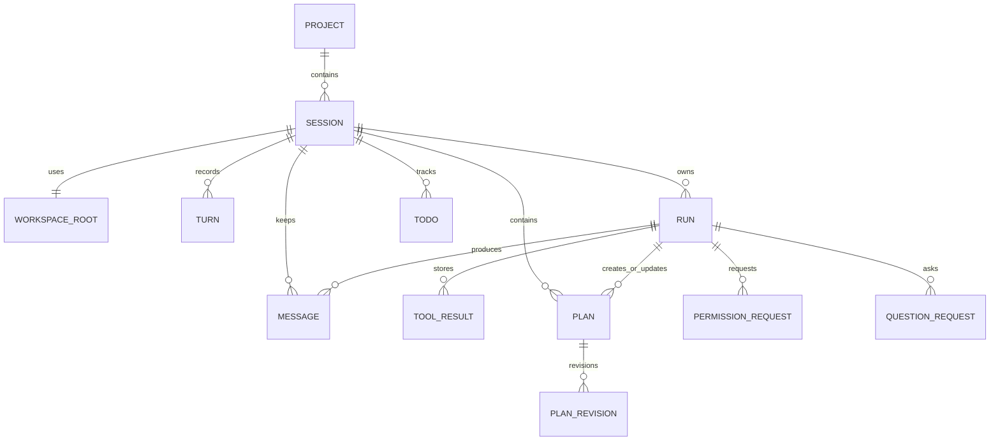
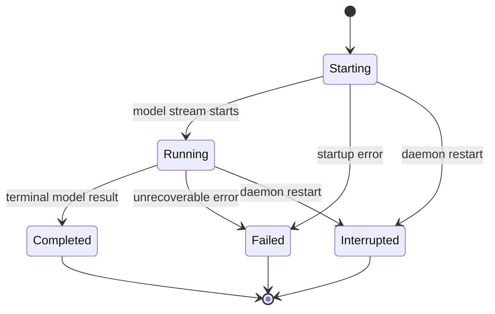
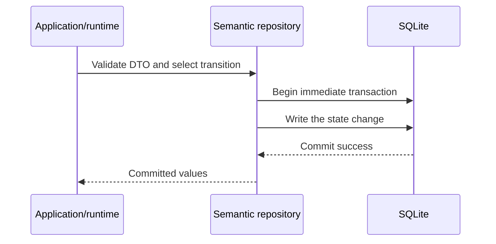

# Sessions, Runs, and Storage

This document defines the durable session/run model, automatic persistence, the transcript, and recovery semantics. It
depends on [DTO and Contract Policy](02-dto-and-contract-policy.md) and [Daemon, Transport, and
Adapters](03-daemon-transport-and-adapters.md).

## Aggregate relationships

```mermaid
erDiagram
  PROJECT ||--o{ SESSION : contains
  SESSION ||--|| WORKSPACE_ROOT : uses
  SESSION ||--o{ TURN : records
  SESSION ||--o{ RUN : owns
  SESSION ||--o{ MESSAGE : keeps
  RUN ||--o{ MESSAGE : produces
  RUN ||--o{ TOOL_RESULT : stores
  SESSION ||--o{ PLAN : contains
  SESSION ||--o{ TODO : tracks
  RUN ||--o{ PLAN : creates_or_updates
  RUN ||--o{ PERMISSION_REQUEST : requests
  RUN ||--o{ QUESTION_REQUEST : asks
  PLAN ||--o{ PLAN_REVISION : revisions
```

## Core invariants

1.  Each session has one mandatory stable `WorkspaceId` and declared `WorkspaceRootDto`; M3 persists the identity/root
association, while M5 owns the workspace addressing policy — the root as an anchor, not a containment boundary
([architecture 05](05-tools-workspace-and-hooks.md)).
2. A session has at most one run in an active state.
3. Every turn, run, plan, tool call, todo, permission, question, and message carries stable typed identity.
4.  Every state-changing repository method commits its change in one SQLite transaction, or changes nothing. No
filesystem-dependent validation, hook, provider call, or other external action runs inside that transaction.
5.  Live updates publish only after commit, from the values the commit recorded; a publisher failure never rolls back
committed state.
6. A user turn accepted while a run is active is recorded pending and joins that run's live context at the next model
boundary; it never starts a second run.
7. `Interrupted` is a recovery-only terminal status: an unfinished run becomes `Interrupted` on restart and never
silently resumes, while `run.interrupt` leaves the live run `Running` and continues its work.
8. The transcript is the durable record of user, assistant, and notice content; every completed tool call has exactly
one structured `tool_results` row.

## Run state machine

```mermaid
stateDiagram
  [*] --> Starting
  Starting --> Running: model stream starts
  Starting --> Failed: startup error
  Starting --> Interrupted: daemon restart
  Running --> Completed: terminal model result
  Running --> Failed: unrecoverable error
  Running --> Interrupted: daemon restart
  Completed --> [*]
  Failed --> [*]
  Interrupted --> [*]
```

Interruption is not a run state. `run.interrupt` is accepted only for an exact active run, commits no durable status
change, records a durable notice message for the stopped provider stream or tool call, resets the run's cancellation
signal, and the run continues with its next model step; `Cancelling` and `Cancelled` no longer exist, and `Interrupted`
remains recovery-only. The closed status vocabulary is `Starting`, `Running`, `Completed`, `Failed`, and
`Interrupted`; the live path creates every run in `Starting`, and a terminal repository transition commits its state
change in one transaction.

The exact policy for a question or permission after restart remains future tool and interaction work and adds no run
status. M4 preserves the M3 rule: the unfinished run is marked interrupted and does not resume.

## Pending turns

When a session has an active run, `SendUserTurnCommandDto` records a durable pending turn rather than creating a
parallel run; when the session has no active run, acceptance starts a run — the oldest pending turn when one exists,
otherwise the accepted turn itself — and the acceptance reports `SendUserTurnOutcomeDto::Started` with that run and its
frozen configuration revision. An acceptance that cannot start a run reports
`SendUserTurnOutcomeDto::Pending` with a committed pending turn.

### Required semantics

- repeating an accepted turn with the same `IdempotencyKey` and unchanged content returns the recorded outcome instead
of writing a second turn, while the same key with different content fails with `turn_idempotency_conflict`;
-  a pending turn keeps its own proposed `RunId`, selected immutable configuration revision, and `ConfigRevisionId`,
used if it starts the successor run;
-  the runtime appends pending turns to the live run context at the next boundary — after the provider response that
ended a model step, or after a tool batch — in insertion order as user messages, and the storage transaction marks them
`appended` so a turn joins exactly one run context;
- a user can inspect pending turns through `SessionProjectionDto.pending_turns` and remove a not-yet-seen one with
`turn.remove`; removal commits the removal and renumbers nothing;
-  pending turns are durable input: a restart preserves them, and a pending turn whose run ended before the join starts
the successor run through ordinary acceptance once the session has no active run;
-  a failed or interrupted prior run does not silently inject partial assistant content into the successor run's
context; and
- a boundary join is deterministic and testable without UI timing.

## Persistence model

SQLite is the `intention-storage` implementation. It uses bundled SQLite and creates the complete current storage
schema directly on open; there is no migration chain and no version gate
([architecture 00](00-principles-and-scope.md)). Storage combines:

- normalized current-state tables for projects, workspace roots, sessions, runs, and turns;
- the `messages` transcript for user content, assistant content, reasoning text, tool-call and tool-result messages, and
notices;
- one `tool_results` row per completed tool call, holding the typed outcome, bounded redacted content, and process exit
evidence; and
-  credential-free canonical configuration revisions keyed by `ConfigRevisionId`; the same revision ID with an equal
revision is idempotent, while the same ID with a different revision fails with a typed conflict.

The storage schema contains the `projects`, `workspace_roots`, `sessions`, `runs`, `turns`, `messages`, `tool_results`,
and `configuration_revisions` tables, all created directly on open. The `turns` table carries one accepted turn with
its proposed run and configuration revision and a closed `state` in `started`, `pending`, `appended`, or `removed`.
Ordering is SQLite row insertion order — `messages.id` for the transcript — and there is no separate event log,
snapshot, or ordering authority.

## Transaction and publication order

```mermaid
sequenceDiagram
  participant A as Application/runtime
  participant R as Semantic repository
  participant S as SQLite

  A->>R: Validate DTO and select transition
  R->>S: Begin immediate transaction
  R->>S: Write the state change
  S-->>R: Commit success
  R-->>A: Committed values
```

If a write fails before commit, nothing changes. The daemon host publishes run frames from the committed values
returned by the repository; a publisher failure never rolls back committed state. A later read observes only committed
state.

Catalog and lineage audit records are read through their own bounded queries; they never enter run publication merely
because they relate to the same user operation.

## Transcript, tool results, and model context

`messages.kind` is a closed set: `user`, `assistant`, `tool_call`, `tool_result`, and `notice`. Assistant rows carry the
whole reasoning text of the step, not deltas or fragments. `tool_results` is the structured view of tool calls;
`tool_call_id` is unique, and the read path is production code, not a write-only table. Model context is rebuilt from
`messages` plus `tool_results`; `turns` stays the acceptance and queue state machine.

The daemon writes no mid-stream content: text and reasoning accumulate in memory and commit once per completed model
step as one `messages` row, while usage, finish reason, and error commit on the `runs` row. A crash mid-step loses the
in-flight step text and the run is marked `Interrupted` on restart; this lost text is an accepted consequence of the
one-transaction rule.

A runtime configuration lookup for a matching `(SessionId, RunId)` returns only its immutable credential-free
configuration revision, selected by the run's persisted `ConfigRevisionId`. Unknown sessions, unknown runs, and
cross-session runs all return `run_configuration_not_found`; an absent persisted selection returns
`run_configuration_unavailable`, a present but undecodable selection returns `storage_decode_failed`, and a backend read
failure is transient `storage_unavailable`, never a permanent not-found. Raw TOML, configuration paths, credentials, and
SQLite resources never cross this DTO-only read boundary.

The daemon task and interruption registries are keyed by exact `(SessionId, RunId)`. Admission and interruption
serialize through that registry: a host inserts a provider-neutral cancellation signal before spawning a newly admitted
durable `Starting` run and deduplicates repeated admission. `run.interrupt` validates the exact active run, then signals
that exact task; an interrupt that arrives before admission finds no in-flight operation to stop, changes no durable
state, and the run's next boundary continues normally. A tool call interrupted before it starts is answered with the
stopped-tool-call notice as a `Partial` result, so no effect starts and the assistant tool-call message stays answered.
The fixed notice for a stopped provider stream or another call without its own result is
`[The call was stopped before a final result.]`; the tool-call notices are owned by [architecture
15](15-tool-registry-and-model-tool-loop.md). `run.interrupt` is accepted only for an exact active run
(`active_run_not_found` otherwise), reports the session position, and is never dispatched through the synchronous
command path, which rejects it with `invalid_interrupt_dispatch`.
An interrupt that arrives during a retry wait records the notice and starts the next attempt immediately. The executor
owns suppression of late results from the stopped call. Recovery never admits old work to a provider.

A filesystem-dependent validation or hook must finish before the transition transaction, and any stale result becomes a
typed known pre-effect outcome rather than an unrecorded second external check inside the transaction.

## Recovery

Daemon startup completes recovery before it can report ready. Recovery transitions each pre-existing unfinished run to
`Interrupted` through the same mandatory terminal-transition transaction used during normal operation. Pending turns
stay durable input across that pass; recovery starts no successor run and resumes no model, tool, shell, or other
external work automatically.

Recovery must not assert whether an interrupted `execute` or external tool had already caused a side effect. The stored
tool and run evidence is evidence of intent and observed state, not proof of external atomicity.

## Required tests and outcomes

| Requirement | Test evidence | Observable outcome |
| --- | --- | --- |
| One active run and pending input | SQLite contract test for concurrent logical acceptance, idempotency, pending insertion order, and removal. | A second turn is recorded pending with no second active run; pending turns join the live context in insertion order, and a removed pending turn never joins. |
| Single-transaction state changes | SQLite fault-injection outcome tests after each write stage. | Each injected failure rolls back: no partial row, run status, or transcript record persists. |
| Canonical config revision IDs | SQLite config-revision contract test. | An equal credential-free revision for the same `ConfigRevisionId` is idempotent; a different revision for that ID fails with a typed conflict. |
| Transcript round trip | Storage and runtime tests over user, assistant, tool, and notice messages. | Assistant rows carry whole reasoning text, tool results correlate by unique `tool_call_id`, and model context rebuilds from committed rows only. |
| Interruption stays non-terminal | Runtime test. | An interrupt of an in-flight provider stream or tool call records the notice, resets the signal, leaves the run `Running`, and the next model step proceeds; `Cancelling` and `Cancelled` have no transition. |
| Pending boundary join | Runtime and SQLite contract tests. | Pending turns are appended as ordered user messages and marked `appended` in one durable commit; the run continues without promotion or a second run. |
| Recovery before ready | Composition restart fixture with an unfinished run. | Every unfinished run becomes `Interrupted` before readiness; no external work resumes. |
| Current-schema creation and config persistence | SQLite current-schema and configuration-revision persistence fixtures. | The complete current schema is created directly on open, and only credential-free revision data persists. |

## Quality-gate integration

Session, run, turn, transcript, and transaction tests are mandatory `make verify` inputs under the coverage policy of
[12 Quality Gates and Makefile](12-quality-gates-and-makefile.md) (per-crate tiers), and must exercise every declared
feature profile. Numeric
coverage does not excuse missing fault-injection, recovery, ordering, or durable turn outcome tests.

## Non-goals

Cross-session and cross-project query models beyond the normalized current-state tables; concurrent runs in one
session; automatic continuation after restart; distributed replication or cross-device synchronization.

Physical deletion and garbage collection of historical work are an accepted post-M5 future direction, to be executed in
Milestone 5+ as an explicit user-authorized retention/deletion/garbage-collection policy that never corrupts remaining
state, never destroys audit dependencies, and is never a silent automatic cleanup; archive-only retention remains the
first-scope default.
