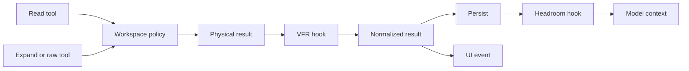

# VFR and Headroom

## Scope

Virtual File Representation (VFR) and Headroom/CCR are required v1 capabilities. They are separate extension crates attached through the typed tool hook system, not hard-coded dependencies of base tools.

This document depends on [Tools, Workspace, and Hooks](05-tools-workspace-and-hooks.md).

## Design principle

Base tools perform their primitive work. Extensions transform the result at controlled phases.

VFR changes a suitable source-file read into a structured virtual representation. Headroom changes suitable retained model context into a compressed representation with retrievable originals. They solve different problems and must not be conflated.

## `intention-vfr`

### Responsibilities

`intention-vfr` owns:

- eligibility evaluation for file read results;
- typed virtual representation DTOs;
- source map/hidden segment metadata;
- expansion and raw-read tool contracts;
- VFR-specific prompt contribution;
- tests proving loss-aware, deterministic transformations.

### Required behavior

- VFR receives a read result after `WorkspaceRoot` path validation.
- It transforms only eligible source files according to resolved configuration.
- It creates a virtual representation that preserves enough stable reference data for later expansion.
- It does not mutate the physical file or base `read` tool semantics.
- The model receives explicit instructions describing placeholders and the `expand`/raw path.
- A user-visible tool result remains traceable to the physical normalized file path and VFR transform decision.

### Supporting tools

- `expand`: obtains requested represented sections through a typed VFR reference.
- raw-read path: reads the full allowed source without applying the presentation transform, subject to WorkspaceRoot and normal policy.

The final user-facing tool names and DTO fields may differ, but they must retain these semantics.

## `intention-headroom`

### Responsibilities

`intention-headroom` owns:

- typed compression eligibility and transform decisions;
- CCR storage contract and implementation selection;
- references, retention, expiry, and retrieval metadata;
- the `retrieve` tool contract;
- safe compression observability.

### Required behavior

- Headroom runs after a normalized tool result is available.
- Original or normalized source content is retained according to CCR policy before a compressed model-context representation relies on it.
- The model receives a typed reference when recovery is available.
- `retrieve` resolves one or more references, or returns a typed missing/expired error.
- Headroom does not erase the audit trail of the pre-compression result.
- Expiry, capacity, and storage failures are explicit policy outcomes.

## Deterministic hook ordering

| Order | Stage | Owner | Result |
| ---: | --- | --- | --- |
| 1 | Path/CWD policy | `intention-workspace` | Safe resolved invocation. |
| 2 | Primitive execution | Base tool | Physical result. |
| 3 | Virtual source transform | `intention-vfr` | Normalized VFR or original result. |
| 4 | Persist normalized result | Application/storage | Durable audit/query value. |
| 5 | Compress model context | `intention-headroom` | Model-specific compressed/reference value. |
| 6 | Publish adapter event | Runtime/transport | Agreed human-readable result and metadata. |

The v1 default presentation policy is:

- adapters receive the normalized result, including VFR representation where applicable;
- the model may receive a further Headroom-compressed representation;
- the event metadata exposes that compression occurred without leaking CCR internals or secrets;
- a future product decision may add an explicit UI affordance for original/retrieved content.

## Data boundaries

| Representation | Storage purpose | Adapter visibility | Model visibility |
| --- | --- | --- | --- |
| Physical tool result | Ephemeral primitive output. | Indirect/auditable as policy permits. | No direct guarantee. |
| Normalized result | Durable tool record after VFR. | Yes, by default. | Candidate input. |
| Compressed result | Headroom-specific context. | Metadata only by default. | Yes, when selected. |
| CCR original | Retrieval backing content. | Not automatically. | Only through `retrieve`. |

## Failure behavior

- An invalid VFR mapping must fail back to a normal safe read result or a typed tool failure, according to configured fail policy. It must never emit an invalid placeholder that cannot be resolved.
- Failure to retain required CCR content must prevent an unsafe compressed reference from reaching the model.
- An expired CCR reference returns a typed, observable result. It does not fabricate recovered content.
- A hook failure must record which extension phase failed without exposing source content or secrets in normal diagnostics.

## Required tests and outcomes

| Requirement | Test evidence | Observable outcome |
| --- | --- | --- |
| VFR independence | Read tool test with VFR disabled/enabled. | Base read succeeds without linking VFR behavior into its implementation. |
| VFR round trip | Fixture/property test for representation plus expand. | Expanded sections map to the original allowed source. |
| Raw path | Workspace/VFR integration test. | Raw read obeys workspace policy and returns full permitted content. |
| Headroom retrieval | Compression/CCR test. | `retrieve` returns retained original while unexpired. |
| Expiry | Clock-controlled retention test. | Expired reference returns typed missing/expired outcome. |
| Ordering | Full pipeline integration test. | VFR precedes persistence and Headroom precedes model-context insertion. |
| UI/model distinction | Event and model-request capture test. | Adapter sees normalized content; model receives intended compressed content. |
| Disabled extensions | Feature/config test. | Tool pipeline remains correct with each extension independently disabled. |

## Quality-gate integration

`intention-vfr` and `intention-headroom` are Tier B coverage targets. Their transform, retrieval, expiry, ordering, and adapter/model distinction tests are blocking `make verify` inputs under every relevant feature profile. Architecture checks must prove base tools do not import either extension implementation crate. See [12 Quality Gates and Makefile](12-quality-gates-and-makefile.md).

## Open decisions

- exact VFR language set and size thresholds;
- CCR backend, maximum capacity, retention duration, and compaction behavior;
- which metadata becomes visible in UI;
- whether content is encrypted at rest in a later version;
- exact fallback policy for VFR parser failures.
