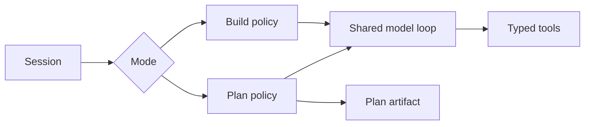
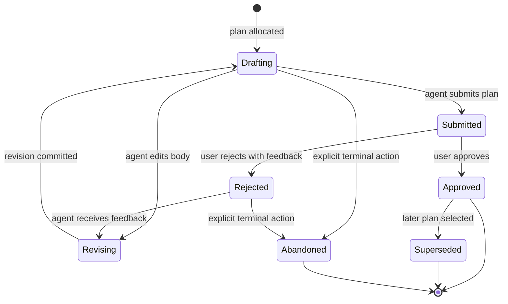

# Plan and Build Modes

## Scope

This document specifies Plan and Build as distinct runtime policies sharing one model loop, and defines physical plan artifacts, hidden YAML frontmatter, and plan lifecycle behavior.

It depends on [Tools, Workspace, and Hooks](05-tools-workspace-and-hooks.md) and [Sessions, Runs, Events, and Storage](04-sessions-runs-events-and-storage.md).

## Mode model

Plan and Build are separate modes, not separate applications or persistence models.



A run snapshots its mode and policy at startup. A policy change applies to a later run unless an explicit, typed transition workflow is introduced.

## Build mode

Build mode:

- exposes the full configured tool registry;
- operates autonomously by default;
- applies WorkspaceRoot to every filesystem/process tool;
- uses the shared risk/confirmation policy for explicitly dangerous actions;
- records tool decisions, tool results, and any confirmation outcome durably.

The exact risk taxonomy is implementation-required before destructive tools are enabled.

## Plan mode

Plan mode is an iterative research and plan-authoring workflow. The agent can inspect the project and repeatedly improve a physical plan artifact.

### Artifact location

Each plan is stored at:

```text
<AppData>/sessions/<session-uuid>/plans/<plan-number>/plan.md
```

`plan-number` begins at `0` for each session and increments monotonically as the session creates plans.

```text
<AppData>/
  sessions/
    1b97-session-uuid/
      plans/
        0/
          plan.md
        1/
          plan.md
```

The plan directory may later contain attachments, rendered versions, or diagnostics. It belongs to the plan artifact, not implicitly to the project workspace.

### Plan allocation

- `CreatePlanCommandDto` creates a `PlanId` and atomically allocates the next plan number for its `SessionId`.
- The number is never reused, including after plan deletion/archival if those features are later introduced.
- Allocation and initial physical artifact creation must be transactionally reconciled. A file-system failure must not leave a falsely usable persisted plan record.
- The precise file/DB atomicity strategy is implementation-required and must have recovery tests.

## YAML frontmatter

Every `plan.md` begins with controlled YAML frontmatter:

```yaml
---
schema_version: 1
session_id: "..."
plan_id: "..."
plan_number: 0
created_at: "..."
updated_at: "..."
created_by_run_id: "..."
status: drafting
revision: 4
---
# Plan
```

The model never receives this frontmatter. `intention-plans` owns it:

- creates and validates the frontmatter;
- updates controlled fields such as `updated_at`, status, and revision;
- hides frontmatter on model-visible reads;
- preserves controlled metadata when the agent edits plan body content;
- rejects edits that would corrupt the frontmatter boundary;
- persists a matching typed plan revision/event.

The model receives only:

```md
# Plan
...
```

## Tool policy matrix

| Capability | Build mode | Plan mode |
| --- | --- | --- |
| Read/search/glob inside WorkspaceRoot | Allowed. | Allowed. |
| Read plan artifact | Allowed by artifact policy. | Allowed; frontmatter hidden from model. |
| Write/edit project files | Allowed by Build policy. | Runtime denied. |
| Write/edit current plan artifact directory | Allowed only if policy exposes it. | Runtime allowed. |
| Write/edit another plan directory | Policy-defined, normally denied. | Runtime denied. |
| Create plan artifact | Explicit plan service/tool workflow. | Allowed through typed plan workflow. |
| `execute` | Allowed under risk policy. | Technically available, prompt-directed not to mutate project state, audited and risk-controlled. |

Plan mode has a real runtime filesystem restriction for regular tools. It does not claim a perfect shell sandbox, because a process invoked through `execute` can alter state beyond tool-level path policy.

## Plan lifecycle



The exact relationship between plan approval and starting a Build-mode run must be made explicit before implementation. The expected direction is that approval is a durable event and an explicit new Build command begins execution.

## Required tests and outcomes

| Requirement | Test evidence | Observable outcome |
| --- | --- | --- |
| Zero-based allocation | Storage/application test over multiple plans. | First plan is `0`; numbers are monotonic and never reused. |
| Location | Filesystem fixture test. | Artifact appears only in its AppData session plan directory. |
| Hidden metadata | Model-request capture test. | Model receives body and never YAML frontmatter. |
| Metadata integrity | Agent-edit test with attempted frontmatter mutation. | Controlled metadata remains valid and revision increments. |
| Plan write restriction | Tool-policy integration test. | Project write/edit is denied with typed policy error. |
| Plan artifact edit | Tool-policy test. | Current plan body is updated and a revision event is stored. |
| Execute limitation | Command fixture/audit test. | Plan-mode execution is marked with Plan policy and auditable; docs/tests do not claim shell containment. |
| Approval flow | State-machine integration test. | Submission, approval/rejection, and feedback transitions are durable and ordered. |

## Quality-gate integration

Plan policy and artifact crates are Tier B coverage targets. Frontmatter hiding, plan-number allocation, mutation denial, revision integrity, and audit scenarios are blocking `make verify` inputs. Coverage cannot replace captured model-context assertions or policy-denial tests. See [12 Quality Gates and Makefile](12-quality-gates-and-makefile.md).

## Non-goals

- Treating a plan as a purely in-memory chat message.
- Allowing model-visible frontmatter.
- Allowing Plan mode to write arbitrary project paths through normal write/edit tools.
- Claiming that prompt instructions turn `execute` into a technical sandbox.

## Post-M4 Mandate compatibility consequence

Ordinary Plan/Build confirmation and risk behavior remains unchanged. A future
Mandate's direct tool admission excludes confirmation and risk authorization but
does not erase mode compatibility: Plan-mode project `write` and `edit` remain
incompatible, and plan mutation remains its typed plan-owner workflow.
`ask_user` is a future ordinary tool rather than confirmation transport. See
[Tool registry and direct Mandate tool loop](15-tool-registry-and-mandate-tool-loop.md).
