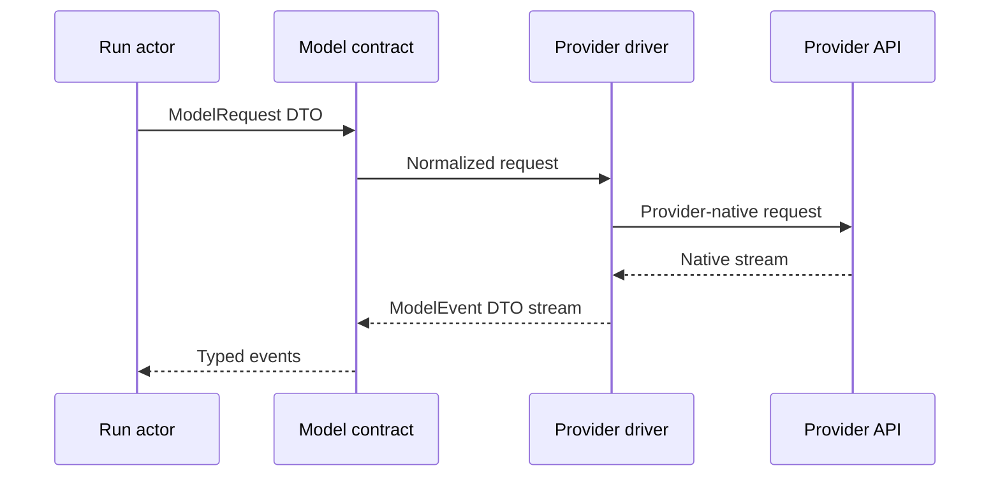

# Model Protocol and Providers

## Scope

This document defines the provider-neutral model contract and the first provider adapters. It preserves meaningful provider capabilities rather than forcing all models into a lowest-common-denominator Chat Completion abstraction.

## Canonical model contract

`intention-model` owns typed requests, stream events, capabilities, usage, finish reasons, and normalized provider errors.

```text
ModelDriver
  start_turn(ModelRequestDto)
  -> ModelStreamDto<ModelEventDto>
```

Core DTO families:

| DTO | Responsibility |
| --- | --- |
| `ModelRequestDto` | System context, messages, tool definitions, limits, mode, reasoning request, and run identity. |
| `ModelCapabilitiesDto` | Supported input, output, reasoning, tool, streaming, and provider-specific capability declarations. |
| `ModelEventDto` | Content, reasoning, tool, usage, lifecycle, and provider-normalized stream facts. |
| `ToolCallDto` | Typed tool identity and typed tool input. |
| `UsageDto` | Provider-normalized usage values with explicit unknown/not-reported states. |
| `FinishReasonDto` | Typed terminal reason. |
| `ProviderErrorDto` | Safe normalized failure, retry category, and correlation data. |

Provider SDK types cannot leave their provider crate.

## Provider normalization



The provider adapter translates native formats into canonical DTOs. It must not erase a capability merely because another current provider lacks it. Instead, `ModelCapabilitiesDto` describes support and application/runtime decides whether a requested feature is valid.

## Initial provider drivers

### OpenRouter

`intention-provider-openrouter` uses the OpenRouter SDK.

It owns:

- OpenRouter configuration translation;
- SDK request/stream lifecycle;
- mapping SDK models/events/errors into model DTOs;
- provider-specific model discovery/capability metadata where available;
- safe diagnostics and correlation identifiers.

### Generic Chat Completion

`intention-provider-generic-chat` supports compatible Chat Completion-style endpoints.

It owns:

- generic endpoint/auth/config translation;
- request/stream mapping;
- documented capability limitations;
- normalized failures.

Provider/model selection is explicit configuration. During M1, the only configuration kind strings are `openrouter` and `generic-chat-completion-api`; the latter preserves any non-blank model ID without model-name classification. `openai` is not an M1 configuration kind and requires a separately declared OpenAI Responses driver crate and contract decision before it is introduced. Execution-time capability behavior belongs to the selected provider driver and runtime policy.

## Provider selection

Resolved TOML configuration selects a provider and model. M1 defines a serializable, credential-free `ConfigSnapshotDto` foundation containing a `ConfigRevisionId`, capture timestamp, and redacted resolved selection. M1 does not persist revisions, apply daemon reload, or attach snapshots to runs; M3/M4 own those workflows. A later run receives the immutable snapshot selected at startup.

Provider/model selection changes do not mutate an already-started run. They apply to a later run, except if a future explicit, tested runtime transition is introduced.

## Streaming and tool calls

The model stream can emit content, reasoning, tool-call, usage, and terminal events. Runtime owns ordering, stable assistant-turn identity, persistence, and conversion of a model tool call into typed tool execution.

Provider drivers do not invoke local tools directly.

## Retry and timeout ownership

- Provider crates classify native failures into `ProviderErrorDto`.
- Runtime/application policy determines whether an error is retryable for the run.
- Config snapshots define timeout/retry limits applied to the run.
- A retry must produce explicit events and preserve causal relation to the originating model turn.
- A daemon restart does not retry an in-flight provider request.

Exact backoff values and retryable status mapping are implementation-required before production use.

## Required tests and outcomes

| Requirement | Test evidence | Observable outcome |
| --- | --- | --- |
| SDK isolation | Compile/dependency test. | OpenRouter SDK types do not escape provider crate public API. |
| Event normalization | Provider fixture stream tests. | Equivalent native sequences map to valid ordered `ModelEventDto` values. |
| Capability check | Application/runtime test. | Unsupported requested feature fails before an invalid provider call. |
| Tool call boundary | Runtime/provider integration test. | Provider emits a tool-call DTO; only runtime invokes the tool registry. |
| Provider selection | Configuration contract test. | A configured provider and model ID are preserved. |
| Retry | Controlled provider failure test. | Retry lifecycle is typed, bounded, and durable. |
| Secret redaction | Provider error fixture. | API key never appears in `ProviderErrorDto`, logs, or events. |

## Quality-gate integration

`intention-model` and provider adapters are Tier C coverage targets. Stream normalization, capability validation, retry, SDK-isolation, and secret-redaction fixtures are blocking `make verify` inputs under every relevant feature profile. Dependency and public-API checks must prevent provider SDK types and secrets from escaping their crate. See [12 Quality Gates and Makefile](12-quality-gates-and-makefile.md).

## Non-goals

- A provider-agnostic interface that discards reasoning, tool, or native capabilities.
- Direct SDK use from application, runtime, transport, or adapters.
- Full provider catalog in v1.
