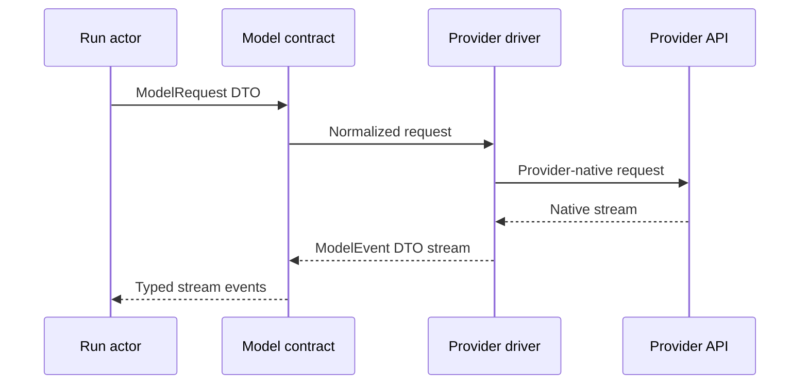

# Model Protocol and Providers

**Current policy.**

This document defines the provider-neutral model contract and the first provider adapters. It preserves meaningful
provider capabilities rather than forcing all models into a lowest-common-denominator Chat Completion abstraction.

## Canonical model contract

`intention-model` owns typed requests, stream events, capabilities, and the provider-driver trait. `intention-proto`
owns provider-neutral `UsageDto`, `FinishReasonDto`, `ToolCallDto`, and `ProviderErrorDto`, which `intention-model`
re-exports for source compatibility. `intention-domain` owns the durable projections and the transcript-row representation.
Domain, storage, and protocol retain no dependency on `intention-model`.

```text
ModelDriver
  capabilities() -> ModelCapabilitiesDto
  preflight(ModelRequestDto) -> DtoResult<()>
```

M4 defines text-only `ModelMessageDto` context, an optional system context, explicit requested capability flags, and
`ModelStreamLifecycleDto`. Providers must emit `Started` first, then zero or more text/reasoning/tool/usage events,
followed by exactly one terminal `Finished` event. A second start, a fact before start or after finish, duplicate usage,
or a second finish fails validation. `ModelRunExecutionService` consumes an injected stream, performs preflight only
after exact persisted/current safe-selection equality, owns cancellation late-event suppression, deadlines, and retries,
and commits only current-state rows (assistant transcript rows, run status, usage, finish, and failure) through the
DTO-only storage contract. Its `ModelTimePort` exposes fresh
provider-neutral delay futures and safe timestamps, never Tokio. The service does not select a provider or own a Tokio
runtime; the daemon-owned composition host supplies those private execution resources.

Core DTO families:

| DTO | Responsibility |
| --- | --- |
| `ModelRequestDto` | System context, text messages, advertised typed `ModelToolDefinitionDto` tool definitions, the transient same-run assistant reasoning attachment, requested reasoning/multimodal/tool/vendor-extension capabilities, and run identity. |
| `ModelCapabilitiesDto` | Supported input, output, reasoning, tool, multimodal, vendor-extension, and streaming capability declarations. |
| `ModelEventDto` | Text, reasoning, tool, usage, lifecycle, and provider-normalized stream events. |
| `ToolCallDto` | Typed tool identity and typed tool input. |
| `UsageDto` | Provider-normalized usage values with explicit unknown/not-reported states. |
| `FinishReasonDto` | Typed terminal reason. |
| `ProviderErrorDto` | Safe normalized failure, retry category, and correlation data. |

The optional system context is the effective instruction projection of [architecture
30](30-instruction-sources-and-system-context.md): the daemon assembles it once per admitted run from
declared instruction sources, it is bounded and credential-free, and the current drivers keep translating it into the
leading system message with no driver-specific framing, rewrite, or provider-side scan; the request marks the end of
that instruction block as an ephemeral prompt-cache breakpoint. Historical M3/M4 requests keep the system context
absent. A driver never synthesizes, substitutes, reorders, or truncates instruction text, and a provider cannot inject
or extend it.

Provider SDK types cannot leave their provider crate. The architecture checker permits `openrouter_rs` namespace use
only in `intention-provider-openrouter` private implementation and `async_openai` only in
`intention-provider-generic-chat`; source-level ownership analysis rejects either SDK plus HTTP/runtime resources
outside those owners.

## Model evidence in the transcript

The model stream remains provider-neutral; durable provider evidence is a transcript concern owned by [DTO and Contract
Policy](02-dto-and-contract-policy.md) and [Sessions, Runs, and Storage](04-sessions-runs-events-and-storage.md).

Text and reasoning accumulate in memory and commit once per completed model step as one `messages` row; usage, finish
reason, and failure commit on the `runs` row; tool calls and results commit as message and `tool_results` rows. Attempts
are positive; a retry's next attempt is exactly the failed attempt plus one; an assistant message is non-blank and
bounded by the transcript bounds; and a terminal run accepts no new content. There is no per-fact position, cursor, or
snapshot.


```mermaid
sequenceDiagram
  participant R as Run actor
  participant M as Model contract
  participant P as Provider driver
  participant X as Provider API

  R->>M: ModelRequest DTO
  M->>P: Normalized request
  P->>X: Provider-native request
  X-->>P: Native stream
  P-->>M: ModelEvent DTO stream
  M-->>R: Typed stream events
```

The provider adapter translates native formats into typed DTOs. It must not erase a capability merely because another
current provider lacks it. Instead, `ModelCapabilitiesDto` describes support and application/runtime decides whether a
requested feature is valid.

## Initial provider drivers

### OpenRouter

`intention-provider-openrouter` uses the pinned `openrouter-rs` 0.18.0 privately. It owns:

- OpenRouter configuration translation;
-  private SDK request construction and fixture normalization for text, reasoning, usage, finish, tool-call, and error
events;
- provider-specific model discovery/capability metadata where available; and
- safe diagnostics and correlation identifiers.

### Generic Chat Completion

`intention-provider-generic-chat` supports compatible Chat Completion-style endpoints using `async-openai` 0.42.0
privately with its configured-base-URL streaming support. It does not implement a custom HTTP or SSE parser: the adapter
enables the pinned SDK's `byot` feature and drives the stream through `create_stream_byot` with crate-private typed
request and chunk structs, so the SDK still owns HTTP, SSE, TLS, and error mapping while the adapter privately owns the
typed wire. It owns:

- generic endpoint/auth/config translation;
-  private SDK request construction and fixture normalization for text, advertised tool definitions, usage, finish,
`tool_calls` tool-call, `reasoning_content` reasoning, same-run assistant tool-call reasoning echo, and error events;
- documented capability limitations; and
- normalized failures.

The completed M4 daemon host starts the selected SDK-backed stream through the private provider composition path.
Provider crates continue to expose only provider-neutral contracts; runtime-owned execution and persistent delivery do
not expose SDK resources.

Provider/model selection is explicit configuration. During M4, the only configuration kind strings remain `openrouter`
and `generic-chat-completion-api`; the latter preserves any non-blank model ID without model-name classification.
`openai` is not an M4 configuration kind and requires a separately declared OpenAI Responses driver crate and contract
decision before it is introduced. The generic provider accepts text context/output, advertised tool definitions, usage,
finish reasons, `tool_calls` tool-call fragments, and textual `reasoning_content` output; multimodal and vendor
extensions fail preflight before any outbound request is prepared. Reasoning output is normalized as
`ModelEventDto::ReasoningDelta` (`Primary`), and when a configured thinking-mode gateway requires it the adapter
serializes the same round's accepted reasoning as `reasoning_content` on the assistant tool-call message of the same-run
continuation, as transient request state with no durable representation; an empty channel is only a presence marker.
The OpenRouter adapter ignores the transient attachment because its pinned SDK request type has no reasoning
field and its wire does not require the echo. OpenRouter declares text, reasoning, tool-call, and streaming capability
while its M4 foundation rejects multimodal context. Execution-time capability behavior belongs to the selected provider
driver and runtime policy.

## Provider selection

Resolved TOML configuration selects a provider and model. M1 defines a serializable, credential-free `ConfigSnapshotDto`
foundation containing a `ConfigRevisionId`, capture timestamp, and redacted resolved selection. M1 does not persist
revisions, apply daemon reload, or attach snapshots to runs; M3/M4 own those workflows. A later run receives the
immutable snapshot selected at startup.

Provider/model selection changes do not mutate an already-started run. They apply to a later run, except if a future
explicit, tested runtime transition is introduced.

## Streaming and tool calls

The model stream can emit content, reasoning, tool-call, usage, and terminal events. Runtime owns ordering,
persistence, and conversion of a model tool call into typed durable rows and execution through the daemon-owned
registry: it commits the assistant tool-call row, the application commits the call's `tool_results` row and its
answering tool-result row in one transaction, and the runtime continues the provider exchange with
assistant-tool-call and tool-role messages until the provider finishes.

Ordinary production requests advertise the active registered tools: the request carries validated typed
`ModelToolDefinitionDto` definitions built by `intention_tools::model_visible_descriptors()` in registry order (`read`,
`write`, `edit`, `execute`, `glob`, `grep`). A non-empty advertisement forces the requested `tool_calls` capability, so
a driver that does not declare tool-call support fails closed at preflight with `unsupported_model_capability`. Both
current adapters translate the definitions into their private SDK request and omit `tool_choice`; an empty advertisement
preserves the previous request shape. A definition validates its input: the name is an ASCII `[A-Za-z0-9_-]` token of
at most 64 characters (`invalid_tool_definition_name`), the description is non-blank
(`invalid_tool_definition_description`), and the schema text is non-empty JSON-object text of at most 64 KiB
(`invalid_tool_definition_parameters`). A model-visible descriptor without a schema fails with
`model_tool_schema_unavailable`. Advertisement is transient request state: it creates no durable record, digest, or
storage row, and it never reconstructs a stored selection from the current registry.

The same-run continuation is the one place provider reasoning returns to a request: the runtime attaches the current
round's accepted reasoning to the assistant tool-call message (`assistant_reasoning`), and no prior-turn reasoning is
transferred. The attachment is transient request state with no durable representation and never becomes message text or
durable history; cross-turn transfer remains future work. The request validates at least one unique tool-call identity
and control-character-safe text bounded at 512 KiB per attachment, and the runtime bounds each round's accumulated echo
at that same 512 KiB per-round bound. A round that exceeds the bound or carries a control character other than `\n`,
`\r`, or `\t` terminalizes as a typed failed run with the dedicated `reasoning_attachment_unrepresentable` code instead
of aborting with a DTO validation error; the echo is never truncated or silently omitted.

Provider drivers do not invoke local tools directly. The application builds the typed invocation from a provider-emitted
tool call, and the daemon-owned registry executes it under `WorkspaceRoot` with typed hooks. Execution requires an
injected `ToolExecutionPort`; there is no no-port fallback and a tool round without an executor cannot start.

## Dynamic context window and prompt caching

Each provider attempt windows its message list before every outbound request. The runtime owns the pass, the
provider-neutral message shape carries the transient marker and the in-place content replacement, and the selected
driver translates the result into its private request. The optional system context is not part of the window: the instruction projection of architecture 30 stays the stable leading block. It is never compressed and never
re-derived.

The `[provider]` configuration keys `context_window_tokens` (default `250000`) and `context_capacity_tokens` (default
`1000000`) resolve into the credential-free `ContextWindowPolicyDto` of every `ConfigSnapshotDto`; resolution requires a
positive capacity and `0 < window < capacity`, and a value outside that range fails closed with a typed validation error
([architecture 09](09-configuration-security-and-observability.md)).

Token accounting estimates one request's input from its character count at four characters per token, rounded up,
calibrated by provider usage: a reported `UsageDto::Reported` input count replaces the estimate for the request that
produced it and every later increment is estimated at four characters per token; `UsageDto::NotReported` leaves the
whole estimate character-based.

While the estimate exceeds `context_window_tokens`, the longest tool-role result whose replacement is shorter is
compressed in place, repeatedly, down to a floor that keeps its first 16 characters and appends a fixed compression
marker. Messages are never removed or reordered, and an assistant tool-call message and its tool replies stay paired.
When nothing printable remains, a compressed result becomes a fixed placeholder, so a compressed tool message is never
blank.
The pass runs after the starting context is built and again after every appended tool result; only the in-memory request
is windowed, and every durable tool-result fact keeps its full recorded content.

An estimate above `context_capacity_tokens` invokes the named `compress_context` pass. That pass is not implemented: it
changes nothing, fails nothing, and records nothing, so an over-capacity estimate remains windowed exactly like a
window-only crossing; compression is a future capability with a named owner.
The window pass introduces no new durable order, event, schema version, or compatibility path.

Prompt-cache breakpoints are part of the request. The window pass clears every earlier marker and then marks at most two
messages with `{"type": "ephemeral"}`: the last leading system-role message when the list begins with one closes the
leading system/instruction block, and the last message in the list closes the stable window prefix that the next round
repeats. Each driver translates a marked message into its private cache marker — the generic Chat driver as a
message-level `cache_control`, the OpenRouter driver through the pinned SDK's cacheable content part — and marks the
daemon-owned system context message the same way when the request carries one. A breakpoint is a transient
request-assembly hint: it changes no message content, role, tool shape, or durable evidence, and a trim never leaves a
stale breakpoint behind.

## Retry and timeout ownership

- Provider crates classify native failures into `ProviderErrorDto`.
-  The Generic Chat Completion adapter derives retryability from the SDK API error's authoritative HTTP status: 429 and
5xx are transient, and every other 4xx is permanent, so a permanent client rejection without an error `type` is never
retried to the attempt maximum. The SDK error's optional `type` string stays only a secondary signal: it decides a
status this taxonomy does not classify by itself, and an unclassified status without a transient type stays permanent.
The classification selects the normalized `generic_chat_provider_unavailable` (retryable) or
`generic_chat_provider_request_rejected` (permanent) failure.
- Runtime/application policy determines whether an error is retryable for the run.
- Config snapshots define timeout/retry limits applied to the run.
- A retry must produce explicit events and preserve causal relation to the originating model turn.
- A daemon restart does not retry an in-flight provider request.

The runtime uses the immutable persisted attempt timeout and at most two total attempts. A deadline is a retryable
`provider_attempt_timed_out` failure. Before any durable text, reasoning, usage, or tool fact, only a delayed/retryable
provider failure may produce one retry; it appends `ProviderAttemptFailed(1)`, then `RetryScheduled(1, 2)`, waits
exactly 250 ms through `ModelTimePort`, and starts attempt two. Interruption races the stream, deadline, and wait: the
stopped stream ends and the run rebuilds its next request with the durable notice, and an interrupt during the retry
wait starts the next attempt immediately.

## Required tests and outcomes

| Requirement | Test evidence | Observable outcome |
| --- | --- | --- |
| SDK isolation | Compile/dependency test. | OpenRouter SDK types do not escape provider crate public API. |
| Event normalization | Provider fixture stream tests. | Equivalent native sequences map to valid ordered `ModelEventDto` values. |
| Capability check | Application/runtime test. | Unsupported requested feature fails before an invalid provider call. |
| Tool advertisement | Model/registry/adapter/runtime/daemon-host tests. | The outgoing request contains the six active tool definitions in registry order, both adapters translate them without `tool_choice`, a driver without tool-call support fails preflight, and the advertisement survives the tool-result continuation request. |
| Reasoning round trip | Model/adapter/runtime tests. | The generic adapter normalizes typed `reasoning_content` deltas as `Primary` reasoning events and serializes the same round's accepted reasoning on the assistant tool-call continuation without adding a durable representation; empty text is presence-only; multimodal and vendor extensions still fail preflight. |
| Tool loop integration | Runtime/provider/application integration test. | Provider emits a tool-call DTO; the application builds the typed invocation, the daemon-owned registry executes it, and the runtime persists the correlated result and continues the exchange. |
| Provider selection | Configuration contract test. | A configured provider and model ID are preserved. |
| Retry | Controlled provider failure test. | Retry lifecycle is typed, bounded, and durable. |
| Secret redaction | Provider error fixture. | API key never appears in `ProviderErrorDto`, logs, or events. |

## Quality-gate integration

`intention-model` and provider adapters are subject to their `standard` tier floor. Stream normalization, capability
validation, retry,
SDK-isolation, and secret-redaction fixtures are blocking `make verify` inputs under every relevant feature profile.
Dependency and public-API checks must prevent provider SDK types and secrets from escaping their crate. See [12 Quality
Gates and Makefile](12-quality-gates-and-makefile.md).

## Non-goals

- A provider-agnostic interface that discards reasoning, tool, or native capabilities.
- Direct SDK use from application, runtime, transport, or adapters.
- Full provider catalog in v1.
