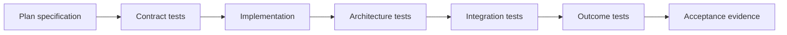

# Test-Driven Delivery and Verification

## Scope

This document makes TTD a delivery requirement for Intention Relay. It defines how architecture rules become executable checks and how implementation is judged by observable product outcomes, not only source structure or unit coverage. The mandatory pinned tooling, strict linting, coverage tiers, feature profiles, Makefile targets, and supply-chain gates are defined in [Quality Gates and Makefile](12-quality-gates-and-makefile.md).

It applies to every crate, vertical slice, and adapter.

## Delivery principle

A feature is delivered only when all three are true:

1. its typed contract is specified and tested;
2. its architecture boundaries are protected by executable checks where feasible;
3. a user-visible or operational outcome is verified through the real command/event/persistence path.

Compilation is necessary but never sufficient acceptance evidence.

## Required test layers

| Layer | Purpose | Examples |
| --- | --- | --- |
| DTO tests | Validate schemas, IDs, serialization, validation, versioning. | Event envelope round trips, invalid command rejects. |
| Domain tests | Prove invariants and state transitions. | One active run, plan number monotonicity. |
| Contract tests | Prove crate-to-crate and client-to-daemon contracts. | `intention-client` command/event fixtures. |
| Architecture tests | Prevent prohibited dependency/import/API shapes. | Adapter cannot depend on SQLite/runtime; SDK types do not escape provider crate. |
| Storage tests | Prove transaction, migration, projection, recovery correctness. | Projection and event atomicity. |
| Runtime tests | Prove actor lifecycle, cancellation, queue, stream ordering. | Queued turn starts after terminal run. |
| Tool/policy tests | Prove workspace, hook order, Plan restrictions, VFR/Headroom behavior. | Path escape rejected, VFR then Headroom ordering. |
| Provider tests | Normalize native streams/errors and protect credentials. | OpenRouter fixture conversion. |
| Adapter integration tests | Prove Tauri bridge and TUI consume the same daemon contract. | Identical session event observed by both clients. |
| Outcome tests | Prove end-to-end behavior against acceptance scenarios. | Restart marks run interrupted and UI receives it. |

## Test-first workflow

For each implementation slice:

1. reference the owning architecture document, crate coverage tier, and acceptance criteria;
2. add or update DTO/contract fixtures before implementation;
3. add failing domain, architecture, and outcome tests appropriate to the slice;
4. implement the smallest code that makes the intended tests pass;
5. run `make quick` while iterating, then run the narrowest relevant suite;
6. run `make verify` before accepting the slice;
7. record any deliberately deferred behavior, lint/coverage/dependency exception, or known risk as an explicit open decision, never by omitted test coverage.

A test should expose the observable intent. Avoid tests that only assert private implementation steps when a stable contract or result can be asserted instead.

## Architecture rules to encode

The following are mandatory candidates for automated architecture tests:

| Rule | Required protection |
| --- | --- |
| Small-crate structure | Dependency graph check, deny cycles, and a manifest assertion for the required v1 crate set. |
| Crate accountability | A manifest-backed test that every required crate has one declared responsibility and a test target. |
| Composition ownership | Only `intention` selects concrete storage/provider/hook/tool extension implementations. |
| Adapter isolation | `intention-tauri` and `intention-tui` cannot depend directly on application runtime/storage implementations. |
| DTO-first | Public cross-crate APIs use DTOs; forbidden implementation resources/SDK types cannot escape. |
| Local protocol | Tauri bridge and TUI use `intention-client`, not direct application services. |
| Daemon authority | SQLite/runtime actor ownership appears only daemon-side. |
| Workspace boundary | File-oriented tool invocations require `WorkspaceRootDto`. |
| Hook boundaries | VFR/Headroom attach through declared hook APIs, not base-tool private coupling. |
| Plan integrity | Model-visible plan reads cannot expose frontmatter; Plan writes cannot target project paths. |
| Secret safety | Secret-bearing config cannot appear in public DTO/log/error/snapshot types. |

The mandatory tooling is fixed by [12 Quality Gates and Makefile](12-quality-gates-and-makefile.md). Architecture tests are executed through `make architecture`; the complete reproducible acceptance gate is `make verify` and CI invokes `make ci` only.

## Minimum test portfolio by crate

Every planned crate must declare a test target before implementation. Minimum expectations:

| Crate area | Minimum evidence |
| --- | --- |
| `types`, `domain`, `protocol` | DTO round trip, validated wire decoding, versioned valid/invalid compatibility fixtures, and explicit additive-field policy proof. |
| `config` | TOML migration/validation, credential-free resolved/snapshot fixture, invalid provider/schema/path/source fixture, and fake-secret absence. |
| `application`, `runtime` | State-machine/use-case tests and deterministic actor integration tests. |
| `storage`, `storage-sqlite` | Repository contract tests, migration tests, transaction fault injection. |
| `model`, providers | Stream/error fixtures, capability and redaction tests. |
| `tools`, workspace, hooks | Invocation policy, path boundary, deterministic hook-order tests. |
| VFR, Headroom, plans | Transform/retrieval/frontmatter/mode-policy outcome tests. |
| transport, client, daemon | Bootstrap, mismatch, reconnect, restart/recovery integration tests. |
| Tauri, TUI | Shared-client contract tests and smoke flows over fixture daemon. |
| composition root | Wiring smoke tests using explicit test configuration only. |

The goal is not an arbitrary number of tests. The required quantity is the smallest portfolio that proves each stated invariant, contract, failure mode, and outcome. Immediate tiered coverage targets are mandatory guardrails and are defined in [12 Quality Gates and Makefile](12-quality-gates-and-makefile.md); they must never replace these semantic requirements.

## M1 serialized-contract evidence

M1 owns versioned JSON fixtures for legacy and current `ErrorDto`, persisted `EventEnvelopeDto<DomainEventDto>`, protocol hello and subscription commands, and credential-free `ConfigSnapshotDto`. The evidence must prove all of the following:

- supported legacy errors decode with absent additive `detail` and `correlation_id` fields;
- typed `MissingWorkspacePath` detail and canonical `CorrelationIdDto` serialize safely, and malformed/absolute/traversing paths or malformed correlations fail at wire decoding;
- required fields, IDs, closed enum variants, incompatible config/protocol schema majors, and invalid scalar types fail safely;
- the documented additive-field policy is tested, rather than inferred from serde defaults;
- public resolved-config and snapshot projections exclude credentials and local `ConfigPathDto` values.

`make architecture` also contains isolated expected-failure fixtures for adapter isolation, protocol isolation, composition-only concrete selection, and provider-SDK public-contract leakage.

## Result-oriented acceptance scenarios

The following scenarios must become executable before the corresponding capability is accepted:

### A. Shared-adapter session

1. Start a fixture daemon.
2. Connect a Tauri bridge fixture and TUI client fixture.
3. Create/open the same session through one adapter.
4. Send a user turn through the other.
5. Verify both receive the same ordered snapshot/events.

### B. Workspace containment

1. Create a session with a temporary workspace root.
2. Change process CWD to a different directory.
3. Invoke a filesystem tool with relative and escaping paths.
4. Verify normal access resolves from the session root and escapes fail with typed policy errors.

### C. Durable run interruption

1. Persist a running run and related state.
2. Restart the daemon fixture.
3. Verify no model or tool call resumes.
4. Verify an interrupted transition is persisted and visible through transport.

### D. Plan artifact integrity

1. Create a Plan-mode session/run.
2. Allocate plan `0`.
3. Edit its body through the plan path.
4. Verify frontmatter remains valid and invisible in captured model context.
5. Attempt a project-file write with normal write/edit.
6. Verify typed denial and durable audit event.

### E. VFR and Headroom pipeline

1. Read an eligible large source fixture.
2. Verify VFR representation and expandable reference.
3. Produce eligible large tool output.
4. Verify normalized persistence, Headroom model-context compression, and `retrieve` behavior.
5. Verify adapter-visible and model-visible representations follow the agreed policy.

### F. Secret redaction

1. Use an intentionally recognizable fake credential in TOML.
2. Trigger provider config and failure paths.
3. Enumerate events, snapshots, errors, structured logs, and adapter DTOs.
4. Verify the credential is absent from all output.

## Verification evidence

Each completed implementation slice must report:

- the architecture document, crate coverage tier, and acceptance criteria it implements;
- tests added before or alongside behavior;
- `make quick`, narrow, integration, and `make verify` checks run;
- outcome scenarios covered;
- lint, coverage, feature, dependency, or architecture exceptions, if any;
- known non-covered risk, if any;
- whether the behavior is proven by automated test, manual smoke test, or intentionally still deferred.

## Non-goals

- Mandating a specific Rust test framework.
- Replacing reviewer judgment with a test count or coverage percentage.
- Treating snapshots as a substitute for semantic assertions.
- Claiming a user flow works because a unit test reached a private method.
