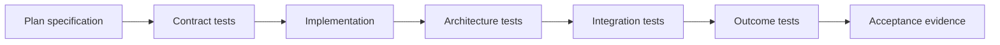

# Test-Driven Delivery and Verification

## Scope

This document makes TTD a delivery requirement for Intention Relay. It defines how architecture rules become executable checks and how implementation is judged by observable product outcomes, not only source structure or unit coverage. The mandatory pinned tooling, strict linting, coverage tiers, feature profiles, Makefile targets, and supply-chain gates are defined in [Quality Gates and Makefile](12-quality-gates-and-makefile.md).

It applies to every crate, vertical slice, and adapter.

## Delivery principle

A feature is delivered only when all three are true:

1. its typed contract is specified and tested;
2. its architecture boundaries are protected by executable checks where feasible;
3. a user-visible or operational outcome is verified through the real command/event/persistence path.

Compilation is necessary but never sufficient acceptance evidence.

## Required test layers

| Layer | Purpose | Examples |
| --- | --- | --- |
| DTO tests | Validate schemas, IDs, serialization, validation, versioning. | Event envelope round trips, invalid command rejects. |
| Domain tests | Prove invariants and state transitions. | One active run, plan number monotonicity. |
| Contract tests | Prove crate-to-crate and client-to-daemon contracts. | `intention-client` command/event fixtures. |
| Architecture tests | Prevent prohibited dependency/import/API shapes. | Adapter cannot depend on SQLite/runtime; SDK types do not escape provider crate. |
| Storage tests | Prove transaction, migration, projection, recovery correctness. | Projection and event atomicity. |
| Runtime tests | Prove actor lifecycle, cancellation, queue, stream ordering. | Queued turn starts after terminal run. |
| Tool/policy tests | Prove workspace, hook order, Plan restrictions, VFR/Headroom behavior. | Path escape rejected, VFR then Headroom ordering. |
| Provider tests | Normalize native streams/errors and protect credentials. | OpenRouter fixture conversion. |
| Adapter integration tests | Prove Tauri bridge and TUI consume the same daemon contract. | Identical session event observed by both clients. |
| Outcome tests | Prove end-to-end behavior against acceptance scenarios. | Restart marks run interrupted and UI receives it. |

## Test-first workflow

For each implementation slice:

1. reference the owning architecture document, crate coverage tier, and acceptance criteria;
2. add or update DTO/contract fixtures before implementation;
3. add failing domain, architecture, and outcome tests appropriate to the slice;
4. implement the smallest code that makes the intended tests pass;
5. run `make quick` while iterating, then run the narrowest relevant suite;
6. run `make verify` before accepting the slice;
7. record any deliberately deferred behavior, lint/coverage/dependency exception, or known risk as an explicit open decision, never by omitted test coverage.

The closed M4 delivery followed the controller-owned
[`M4 execution charter`](../m4.md): each bounded lane established its complete
fixture portfolio before production behavior and passed the standard `make
quick` / `make verify` acceptance rule at its integration barrier. This is
historical evidence, not authorization for further M4 work. The closure
baseline and final Linux/Windows CI results are recorded in [M4 Closure
Evidence](../closeout/m4-closure-evidence.md).

A test should expose the observable intent. Avoid tests that only assert private implementation steps when a stable contract or result can be asserted instead.

## Architecture rules to encode

The following are mandatory candidates for automated architecture tests:

| Rule | Required protection |
| --- | --- |
| Small-crate structure | Dependency graph check, deny cycles, and a manifest assertion for the required v1 crate set. |
| Crate accountability | A manifest-backed test that every required crate has one declared responsibility and a test target. |
| Composition ownership | Only `intention` selects concrete storage/provider/hook/tool extension implementations. |
| Adapter isolation | `intention-tauri` and `intention-tui` cannot depend directly on application runtime/storage implementations. |
| DTO-first | Public cross-crate APIs use DTOs; forbidden implementation resources/SDK types cannot escape. |
| Local protocol | Tauri bridge and TUI use `intention-client`, not direct application services. |
| Daemon authority | SQLite/runtime actor ownership appears only daemon-side. |
| Workspace boundary | File-oriented tool invocations require `WorkspaceRootDto`. |
| Hook boundaries | VFR/Headroom attach through declared hook APIs, not base-tool private coupling. |
| Plan integrity | Model-visible plan reads cannot expose frontmatter; ordinary Plan `write`/`edit` cannot target project paths, while Plan `execute` remains advisory-guided and audited. |
| Autopilot continuity | Plan approval pins a revision, starts a fresh same-Session Build run, and optional handoff transfers only a safe frozen context. |
| Secret safety | Secret-bearing config cannot appear in public DTO/log/error/snapshot types. |

The mandatory tooling is fixed by [12 Quality Gates and Makefile](12-quality-gates-and-makefile.md). Architecture tests are executed through `make architecture`; the complete reproducible acceptance gate is `make verify` and CI invokes `make ci` only.

## Minimum test portfolio by crate

Every planned crate must declare a test target before implementation. Minimum expectations:

| Crate area | Minimum evidence |
| --- | --- |
| `types`, `domain`, `protocol` | DTO round trip, validated wire decoding, versioned valid/invalid compatibility fixtures, and explicit additive-field policy proof. |
| `config` | TOML migration/validation, credential-free resolved/snapshot fixture, invalid provider/schema/path/source fixture, and fake-secret absence. |
| `application`, `runtime` | State-machine/use-case tests and deterministic actor integration tests. |
| `storage`, `storage-sqlite` | Repository contract tests, migration tests, transaction fault injection. |
| `model`, providers | Stream/error fixtures, capability and redaction tests. |
| `tools`, workspace, hooks | Invocation policy, path boundary, deterministic hook-order tests. |
| VFR, Headroom, plans | Transform/retrieval/frontmatter/mode-policy outcome tests. |
| transport, client, daemon | Bootstrap, mismatch, reconnect, restart/recovery integration tests. |
| Tauri, TUI | Shared-client contract tests and smoke flows over fixture daemon. |
| composition root | Wiring smoke tests using explicit test configuration only. |

The goal is not an arbitrary number of tests. The required quantity is the smallest portfolio that proves each stated invariant, contract, failure mode, and outcome. Immediate tiered coverage targets are mandatory guardrails and are defined in [12 Quality Gates and Makefile](12-quality-gates-and-makefile.md); they must never replace these semantic requirements.

## M1 serialized-contract evidence

M1 owns versioned JSON fixtures for legacy and current `ErrorDto`, persisted `EventEnvelopeDto<DomainEventDto>`, protocol hello and subscription commands, and credential-free `ConfigSnapshotDto`. The evidence must prove all of the following:

- supported legacy errors decode with absent additive `detail` and `correlation_id` fields;
- typed `MissingWorkspacePath` detail and canonical `CorrelationIdDto` serialize safely, and malformed/absolute/traversing paths or malformed correlations fail at wire decoding;
- required fields, IDs, closed enum variants, incompatible config/protocol schema majors, and invalid scalar types fail safely;
- the documented additive-field policy is tested, rather than inferred from serde defaults;
- public resolved-config and snapshot projections exclude credentials and local `ConfigPathDto` values.

`make architecture` also contains isolated expected-failure fixtures for adapter isolation, protocol isolation, composition-only concrete selection, provider-SDK public-contract leakage, policy-aligned workspace cycles, and executable Cargo test-target declarations.

## M1+ quality-hardening evidence

M1+ strengthens the executable quality policy without adding M2 product behavior. Its copied-repository fixtures prove all of the following:

- a policy-aligned workspace dependency cycle reports its deterministic closed path before a normal Cargo compile gate;
- every active crate's declared `test_targets` exactly equals Cargo metadata integration targets, while M1 skeletons declare and expose none;
- nightly rustdoc JSON rejects forbidden public type exposure through aliases, tuple wrappers, nested generics, function signatures, and re-exports;
- an enabled coverage exclusion is an owned, exact reported source file and changes only that crate's coverage denominator; unsafe, unowned, unreported, duplicate, and all-source exclusions fail.

The M1+ baseline and criterion-to-fixture evidence are recorded in [M1+ Quality Hardening Evidence](../closeout/m1-plus-quality-hardening-evidence.md).

## M3 required test and evidence matrix

M3 activates Tier B `intention-application`, `intention-runtime`,
`intention-storage`, and `intention-storage-sqlite`; each must meet the 90%
line-coverage threshold defined in [12 Quality Gates and
Makefile](12-quality-gates-and-makefile.md). The threshold is necessary but
never substitutes for the following required semantic evidence.

| M3 concern | Required test/evidence target | Required observable result |
| --- | --- | --- |
| DTO and event evolution | `m3_contracts`, event-fixture, and protocol-fixture suites. | `WorkspaceId`, run/queue projections, explicit event variants, accepted outcomes, and safe snapshots round-trip while documented compatible fixtures remain decodable. |
| SQLite durability and migration | `sqlite_contracts` plus migration fixtures. | Bundled SQLite applies supported `rusqlite_migration` versions, rejects a future on-disk schema, persists only credential-free config snapshots, and rejects a known-session future/overflow tail cursor with `invalid_event_tail_position` before SQLite conversion. |
| Semantic atomicity | SQLite fault-injection outcome fixture at event, projection, and snapshot boundaries. | Each injected write-stage failure rolls back completely: no new projection, event envelope, or session/run snapshot row persists. |
| Canonical config revisions | SQLite config-revision contract fixture. | Reaccepting an equal credential-free snapshot for the same `ConfigRevisionId` is idempotent; a different snapshot for that ID returns a typed conflict without sensitive details. |
| Queue and idempotency | Storage/application contracts. | Repeated identical turn acceptance is stable, conflicting identity reuse fails typed, tickets are never reused after removal, repository-owned promotion selects the oldest ticket, and no parallel active run exists. |
| Lifecycle and cancellation | `m3_runtime` state-machine fixture. | `Starting -> Cancelling -> Cancelled` is required; a direct `Starting -> Cancelled` transition fails. |
| Terminal promotion | Runtime/storage integration fixture. | A terminal state and the next queued turn's `RunStarted` fact commit atomically with the queued turn's original proposed `RunId`, immutable snapshot, and revision, even after a daemon config change. |
| Recovery-before-ready | Durable composition restart fixture. | Every unfinished run is durably interrupted before ready and no external work resumes automatically. |
| Replay-only subscription | Durable facade/client contract fixture, including matching, nonexistent, cross-session, unknown-session, and future-cursor run-scoped requests. | An unscoped one-shot request yields a current durable projection snapshot with an empty contiguous tail or typed resync; every `run_id: Some` request yields `HistoryUnavailable` before cursor/session validation and without unfiltered session state. This is not a persistent stream; safely represented scoped replay remains M4 hardening. |
| Storage location | Platform-state location fixture. | Database state resolves under platform AppData/state, and missing an absolute platform directory fails typed without CWD fallback. |
| Quality evidence | `make quick`, narrow M3 suites, then `make verify`. | All active Tier B crates meet 90%; failure/recovery branches and feature profiles remain covered. |

The M3 closure record must distinguish listed tests from actually executed
commands and results. Until those commands are captured, the baseline SHA,
coverage values, and gate results remain pending; see [M3 Closure
Evidence](../closeout/m3-closure-evidence.md).

## Completed M4 model/provider evidence

M4 activated Tier C `intention-model`, `intention-provider-openrouter`, and `intention-provider-generic-chat`. Their policy-declared Cargo integration targets prove valid and invalid model DTOs, stream lifecycle ordering, tool/usage validation, safe provider errors, execution-policy default/override/range and legacy snapshot decoding, credential redaction, provider mapping of text/usage/finish/error/tool-call facts, and rejection of unsupported generic capabilities before outbound preparation. The Tier B `intention-runtime` target `m4_model_execution` proves preflight/no-execute failure, exact persisted/current safe-selection mismatch failure, exact-cursor durable ordering, UTF-8-safe 4 KiB assistant batching, reasoning/usage persistence, tool denial, two-stage completion, malformed/provider/EOF safe failure, timeout and fixed 250 ms retry ordering with manual time, no retry after durable output or a terminal/cancellation/non-retryable outcome, and cancellation suppression while an event or retry wait is blocked without a production Tokio runtime. Copied-repository architecture fixtures reject M4 phase or test-target drift, out-of-owner SDK namespaces, SDK public API exposure, and non-composition concrete-provider selection. No test requires live credentials or provider network access. Final gate and cross-platform evidence are recorded in [M4 Closure Evidence](../closeout/m4-closure-evidence.md).

## Completed M4 run-stream protocol evidence

M4's dedicated run-stream contract is proven by `m4_run_stream_contracts`, covering validated run subscription/replay/live/snapshot/resync wire DTOs, all closed resync reasons, additive JSON compatibility, and retained M3 session behavior. `run_stream_contract` uses a real scripted asynchronous local peer to prove correlated initial replay followed by uncorrelated daemon frames, duplicate/stale tolerance, gap recovery from the last valid cursor, wrong-scope rejection, fail-closed unavailable history, historical reasoning without snapshot double application, and daemon-authoritative status-only snapshot updates. `transport_integration` proves daemon-frame sender/receiver roles without widening existing M3 correlated response roles.

`m4_streaming_foundation` adds daemon-host outcome evidence using injected
scripted/blocking drivers and a real asynchronous local transport. It proves a
host-accepted `SendUserTurn` invokes the driver once, exposes an initial
authoritative replay followed by durable live state and `Completed` on one
persistent connection, and permits a new connection plus a repeated correlated
replay request to receive the current snapshot. Its blocked-driver scenario
proves host `StopRun` reaches task-owned `Cancelled` without late facts. The
real host's deterministic first-append gate proves the durable `Cancelling`
race after initial `Starting` observation is terminalized exactly once by that
registered task at cursor zero, with no provider call or fact. A real-host
stop-before-registration fixture proves registry/stop linearization installs
and cleans up an exact cancellation terminalizer rather than stranding durable
`Cancelling` state. A real-host
promotion fixture proves the commit observer schedules the original persisted
queued `RunId` once with its durable context and ignores duplicate admission.
A durable blocked-host restart fixture first aborts and joins all first-host
connection/execution tasks and drops all first-facade clones, then serializes actual replay, transport
replay/error frames, events, snapshots, and safe errors from a recognizable
fake-credential configuration; the credential is absent, the old run becomes
`Interrupted` before replay, and neither it nor a recovery-promoted `Starting`
run resumes provider execution. Queue capacity and exact writer-deadline
behavior remain focused daemon-host unit evidence. The fixture uses no network
or real credential.

## M5 trusted-local execute environment decision

M5 `execute` inherits the invoking process environment without name-based or
pattern-based filtering. This is intentional: the agent is trusted-local and
WorkspaceRoot scopes filesystem resolution and child CWD, not environment
visibility or process privileges. Environment values remain excluded from
durable lifecycle evidence, logs, protocol DTOs, and published projections.

## Result-oriented acceptance scenarios

### G. Plan-to-Build Autopilot continuity

1. Create a Plan-mode session and a physical plan revision.
2. Use `execute` for an investigation command and verify Plan policy audit.
3. Approve the exact plan revision.
4. Verify approval and fresh Build-run binding are durable and ordered.
5. Verify the same `SessionId`, a new `RunId`, pinned plan digest, and retained conversation context.
6. Verify Build Autopilot performs configured actions without per-action confirmation.
7. Verify Plan project `write/edit` remains hard-denied.

### H. Optional implementation handoff

1. Approve a plan and request a new implementation Session.
2. Verify the target Session receives the full available safe context, plan revision, and execution prompt as a frozen snapshot.
3. Verify source history is unchanged and no live runtime resource, credential, grant, queue, or unfinished effect transfers.
4. Verify optional auto-start creates a fresh Build run or leaves an idle target on start failure.

The following scenarios must become executable before the corresponding capability is accepted:

### A. Shared-adapter session

1. Start a fixture daemon.
2. Connect a Tauri bridge fixture and TUI client fixture.
3. Create/open the same session through one adapter.
4. Send a user turn through the other.
5. Verify both receive the same ordered snapshot/events.

### B. Workspace containment

1. Create a session with a temporary workspace root.
2. Change process CWD to a different directory.
3. Invoke a filesystem tool with relative and escaping paths.
4. Verify normal access resolves from the session root and escapes fail with typed policy errors.

### C. Durable run interruption

1. Persist a running run and related state.
2. Restart the daemon fixture.
3. Verify no model or tool call resumes.
4. Verify an interrupted transition is persisted and visible through transport.

### D. Plan artifact integrity

1. Create a Plan-mode session/run.
2. Allocate plan `0`.
3. Edit its body through the plan path.
4. Verify frontmatter remains valid and invisible in captured model context.
5. Attempt a project-file write with normal write/edit.
6. Verify typed denial and durable audit event.

### E. VFR and Headroom pipeline

1. Read an eligible large source fixture.
2. Verify VFR representation and expandable reference.
3. Produce eligible large tool output.
4. Verify normalized persistence, Headroom model-context compression, and `retrieve` behavior.
5. Verify adapter-visible and model-visible representations follow the agreed policy.

### F. Secret redaction

1. Use an intentionally recognizable fake credential in TOML.
2. Trigger provider config and failure paths.
3. Enumerate events, snapshots, errors, structured logs, and adapter DTOs.
4. Verify the credential is absent from all output.

## Verification evidence

Each completed implementation slice must report:

- the architecture document, crate coverage tier, and acceptance criteria it implements;
- tests added before or alongside behavior;
- `make quick`, narrow, integration, and `make verify` checks run;
- outcome scenarios covered;
- lint, coverage, feature, dependency, or architecture exceptions, if any;
- known non-covered risk, if any;
- whether the behavior is proven by automated test, manual smoke test, or intentionally still deferred.

## Non-goals

- Mandating a specific Rust test framework.
- Replacing reviewer judgment with a test count or coverage percentage.
- Treating snapshots as a substitute for semantic assertions.
- Claiming a user flow works because a unit test reached a private method.

## Post-M4 Foundation evidence obligations

Before any future Mandate-capable production slice, its specification must name
contract, architecture, fault/recovery, compatibility, redaction, and outcome
evidence for the Foundation rules it consumes. At minimum, later packages must
cover:

- execution-kind/version/payload mismatch rejection before external work;
- M3/M4 byte/meaning preservation and no synthetic future state;
- user-versus-daemon/verifier conflict precedence where relevant;
- atomic admission/transition rollback at every persistence stage;
- no external effect inside a transition transaction and post-commit reread
  publication;
- crash/cancel behavior before start versus after a potentially uncertain start;
- no provider/tool/process/kernel/MCP/child/bridge resumption after restart;
- intrinsic-bound versus capacity-unavailability behavior without hidden
  Mandate product quotas; and
- recognizable fake-secret absence from future records, logs, errors, protocol,
  and diagnostics.

These are obligations for later implementation packages, not claims that the
corresponding runtime behavior exists today. See the
[reconciliation matrix](../reconciliation/source-of-truth-matrix.md).

## Execution-meaning compatibility evidence

Before implementation, canonical execution-meaning work requires golden
bytes/digests, kind/tag/version mismatch fixtures, M3/M4 byte-preservation,
no-current-state-reconstruction, no-external-work-on-incompatibility,
negotiation/resync, no-resume, driver-contract, redaction and cross-platform
outcome evidence. The detailed portfolio is owned by [Run execution meaning and
historical compatibility](14-run-execution-meaning-and-historical-compatibility.md).

## Tool-registry and Mandate-loop evidence

Before implementation, future tool-loop work requires fixed-slot and owner
goldens, Reserved/non-bypass fixtures, canonical registry/descriptor selection,
ordinary-versus-Mandate WorkspaceRoot outcomes, direct-Mandate/no-confirmation
admission, group atomicity/concurrency/order, fragment/result integrity,
before-start/started/known/unknown recovery, negotiated replay, M4 tool-denial
preservation, no-current-state reconstruction, and fake-secret absence. These
are future obligations, not claims that a runtime or test target exists; the
detailed portfolio is owned by [Tool registry and direct Mandate tool
loop](15-tool-registry-and-mandate-tool-loop.md).

## Mandate scheduler and readiness evidence

Before implementation, future scheduler work requires durable-reason versus
observation/candidate/admission fixtures; deterministic ordering; unavailable
reason preservation; duplicate wake/readiness idempotency; lifecycle/readiness
races; transaction fault injection; recovery-before-scheduling; no-resume;
ordinary queue and M4 preservation; no-current-state reconstruction; negotiated
replay; and fake-secret/resource absence. These are future obligations, not
current tests or targets. The detailed portfolio is owned by [Mandate scheduler
and readiness-driven admission](16-mandate-scheduler-and-readiness-driven-admission.md).

## Mandate child graph and verifier evidence

Before implementation, future child/verifier work requires canonical
edge/delegation/authority/baseline/evidence/verdict/mutation goldens;
idempotent child creation and graph-integrity fixtures; direct-edge-only control
and non-scheduling messages; terminalization/cascade and child-local uncertainty
matrices; authority revision/revocation/target-set/stale-baseline/operation
fixtures; user-precedence races; atomic fault injection; recovery/no-resume;
negotiated replay; M3/M4 and retained-RLM preservation; and fake-secret/raw
resource absence. These are future obligations, not current tests or targets.
The detailed portfolio is owned by [Mandate child graph and delegated verifier
authority](17-mandate-child-graph-and-delegated-verifier-authority.md).

## Mandate MCP capability evidence

Before implementation, future MCP work requires canonical source/discovery/
capability/selection/invocation goldens; closed schema-normalization negatives;
fixed-slot/no-bypass and server-non-authority fixtures; idempotency, selection
freeze, schema-drift, and no-current-state reconstruction cases; transaction
fault injection; HTTP/local-stdio cancellation/recovery/no-resume; private
resource redaction; scheduler/child/verifier isolation; negotiated replay; and
M3/M4 plus retained bounded-MCP preservation. These are future obligations, not
current tests or targets. The detailed portfolio is owned by [Mandate MCP
capability lifecycle](18-mandate-mcp-capability-lifecycle.md).

## Mandate Gateway/RLM bridge evidence

Before implementation, future bridge work requires canonical bridge-selection
goldens; grant scope/expiry and no-bypass fixtures; operation idempotency and
fault injection; cancellation/crash/late-result/no-resume matrices; child,
verifier, and MCP isolation; negotiated replay/resync and zero-effect reconnect;
M3/M4 plus retained-RLM preservation; limit classification; and fake-secret/raw
resource absence. These are future obligations, not current tests or targets.
The detailed portfolio is owned by [Mandate Gateway/RLM bridge](19-mandate-gateway-rlm-bridge.md).

## Run-scoped IPython kernel evidence

Before implementation, future kernel work requires canonical selection/checkpoint
goldens; run-scoped lazy epoch/no-sharing fixtures; required/optional restore and
no-current-state reconstruction; cell/host-request/checkpoint fault injection;
cancellation/crash/late-message/no-resume matrices; bridge-only/no-bypass and
stale-grant/task tests; child/verifier/MCP isolation; negotiated replay/resync;
historical M3/M4 and retained IPython/RLM preservation; and fake-secret/raw
Python/Jupyter/resource absence. These are future obligations, not current tests
or targets. The detailed portfolio is owned by [Run-scoped IPython kernel
lifecycle](20-ipython-kernel-lifecycle.md).

## Goals, Skills, context, memory, and compaction evidence

Before implementation, future context work requires canonical Goal scope and
applicability, Skill selection/disclosure, source-manifest/projection, memory,
and compaction golden/negative fixtures; admission/model-step fault injection;
no-current-state reconstruction; audience/redaction and non-authority outcomes;
recovery/no-resume and replay/resync; child/verifier/MCP/bridge/kernel isolation;
M3/M4 preservation; and fake-secret/raw-source/private-reference absence. These
are future obligations, not current tests or targets. The detailed portfolio is
owned by [Goals, Skills, context, memory, and compaction](21-goals-skills-context-memory-and-compaction.md).

## Provider evolution, profiles, and reasoning evidence

Before implementation, future provider work requires IRCR canonical descriptor/
profile/catalog/selection/capability/driver-contract goldens; M3/M4 preservation;
alias normalization and no model-name routing; capability/driver preflight before
outbound work; Responses `store: false`; normalized reasoning and context-owner
selection; catalog activation/recovery fault injection; no-resume/retry matrices;
negotiated replay; redaction; and Linux/Windows outcomes. These are future
obligations, not current tests or targets. The detailed portfolio is owned by
[Provider evolution, profiles, and reasoning](22-provider-evolution-profiles-and-reasoning.md).

## Session branching evidence

Before implementation, architecture 23 requires canonical v1/v2 golden and
negative fixtures; boundary/context/anchor tests; transaction fault injection;
additive migration byte preservation; negotiation and bounded tree-page tests;
authority/no-resume/no-current-state-reconstruction matrices; redaction; and
Linux/Windows fork/regeneration outcomes. These are future obligations only.
## Activity, UI, and adapter evidence

Before implementation, architecture 24 requires activity/message/journal/
notification/acknowledgement canonical and negative fixtures; transaction and
sequence isolation; negotiated replay/resync; redaction; no-resume; Tauri/TUI/REPL
parity; and Linux/Windows outcome evidence. These are future obligations only.
