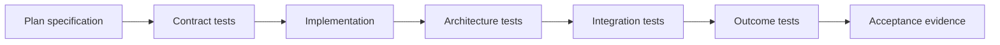

# Test-Driven Delivery and Verification

**Current policy.**

This document makes TTD a delivery requirement for Intention Relay: it defines how architecture rules become executable
checks and how implementation is judged by observable product outcomes, not only source structure or unit coverage. It
applies to every crate, vertical slice, and adapter. The mandatory pinned tooling, strict linting, the coverage policy
(per-crate tiers, [ADR 0016](../decisions/0016-per-crate-coverage-tiers.md)), feature profiles,
Makefile targets, and supply-chain gates are defined in [Quality Gates and Makefile](12-quality-gates-and-makefile.md).

## Delivery principle

A feature is delivered only when all three are true:

1. its typed contract is specified and tested;
2. its architecture boundaries are protected by executable checks where feasible;
3. a user-visible or operational outcome is verified through the real command/event/persistence path.

```mermaid
flowchart LR
  SP[Plan specification] --> CT[Contract tests]
  CT --> IM[Implementation]
  IM --> AT[Architecture tests]
  AT --> IT[Integration tests]
  IT --> OT[Outcome tests]
  OT --> AC[Acceptance evidence]
```

Compilation is necessary but never sufficient acceptance evidence.

## Required test layers

| Layer | Purpose | Examples |
| --- | --- | --- |
| DTO tests | Validate schemas, IDs, serialization, validation, versioning. | Typed DTO round trips, invalid command rejects. |
| Domain tests | Prove invariants and state transitions. | One active run, plan number monotonicity. |
| Contract tests | Prove crate-to-crate and client-to-daemon contracts. | `intention-client` command/frame fixtures. |
| Architecture tests | Prevent prohibited dependency/import/API shapes. | Adapter cannot depend on SQLite/runtime; SDK types do not escape provider crate. |
| Storage tests | Prove current-schema creation, transaction, projection, and recovery correctness. | Single-transaction state changes. |
| Runtime tests | Prove actor lifecycle, interruption, pending input, stream ordering. | Pending turn joins the live run context at the next boundary. |
| Tool/policy tests | Prove workspace addressing, hook order, Plan restrictions, VFR/Headroom behavior. | Relative addressing from the root, VFR then Headroom ordering. |
| Provider tests | Normalize native streams/errors and protect credentials. | OpenRouter fixture conversion. |
| Adapter integration tests | Prove Tauri bridge and TUI consume the same daemon contract. | Identical session snapshot and frames observed by both clients. |
| Outcome tests | Prove end-to-end behavior against acceptance scenarios. | Restart marks run interrupted and UI receives it. |

## Test-first workflow

For each implementation slice:

1. reference the owning architecture document, the applicable coverage
declarations under [ADR 0016](../decisions/0016-per-crate-coverage-tiers.md), and acceptance criteria;
2. add or update DTO/contract fixtures before implementation;
3. add failing domain, architecture, and outcome tests appropriate to the slice;
4. implement the smallest code that makes the intended tests pass;
5. run `make quick` while iterating, then run the narrowest relevant suite;
6. run `make verify` before accepting the slice;
7.  record any deliberately deferred behavior, lint/coverage/dependency exception, or known risk as an explicit open
   decision, never by omitted test coverage.

A test should expose the observable intent. Avoid tests that only assert private implementation steps when a stable
contract or result can be asserted instead.

## Architecture rules to encode

The following are mandatory candidates for automated architecture tests:

| Rule | Required protection |
| --- | --- |
| Small-crate structure | Dependency graph check, deny cycles, and a manifest assertion for the required v1 crate set. |
| Crate accountability | A manifest-backed test that every required crate has one declared responsibility and a test target. |
| Composition ownership | Only `intention` selects concrete storage/provider/hook/tool extension implementations. |
| Adapter isolation | `intention-tauri` and `intention-tui` cannot depend directly on application runtime/storage implementations. |
| DTO-first | Public cross-crate APIs use DTOs; forbidden implementation resources/SDK types cannot escape. |
| Local protocol | Tauri bridge and TUI use `intention-client`, not direct application services. |
| Daemon authority | SQLite/runtime actor ownership appears only daemon-side. |
| Workspace boundary | File-oriented tool invocations require `WorkspaceRootDto`. |
| Hook boundaries | VFR/Headroom attach through declared hook APIs, not base-tool private coupling. |
| Plan integrity | Model-visible plan reads cannot expose frontmatter; ordinary Plan `write`/`edit` cannot target project paths, while Plan `execute` remains advisory-guided and audited. |
| Autopilot continuity | Plan approval pins a revision, starts a fresh same-Session Build run, and optional handoff transfers only a safe frozen context. |
| Secret safety | Secret-bearing config cannot appear in public DTO/log/error/snapshot types. |

The mandatory tooling is fixed by [12 Quality Gates and Makefile](12-quality-gates-and-makefile.md). Architecture tests
are executed through `make architecture`; the complete reproducible acceptance gate is `make verify` and CI invokes
`make ci` only. `make architecture` also contains isolated expected-failure fixtures for adapter isolation, protocol
isolation, composition-only concrete selection, provider-SDK public-contract leakage, policy-aligned workspace cycles,
and executable Cargo test-target declarations.

## Minimum test portfolio by crate

Every planned crate must declare a test target before implementation. Minimum expectations:

| Crate area | Minimum evidence |
| --- | --- |
| `types`, `domain`, `protocol` | DTO round trip, validated wire decoding, current-version fixtures with non-current-version rejection, and explicit additive-field policy proof. |
| `config` | TOML current-shape parsing/validation (unversioned documents fail closed), credential-free resolved/snapshot fixture, invalid provider/schema/path/source fixture, and fake-secret absence. |
| `application`, `runtime` | State-machine/use-case tests and deterministic actor integration tests. |
| `storage`, `storage-sqlite` | Repository contract tests, current-schema creation tests, transaction fault injection. |
| `model`, providers | Stream/error fixtures, capability and redaction tests. |
| `tools`, workspace, hooks | Invocation policy, path boundary, deterministic hook-order tests. |
| VFR, Headroom, plans | Transform/retrieval/frontmatter/mode-policy outcome tests. |
| transport, client, daemon | Bootstrap, mismatch, reconnect, restart/recovery integration tests. |
| Tauri, TUI | Shared-client contract tests and smoke flows over fixture daemon. |
| composition root | Wiring smoke tests using explicit test configuration only. |

The goal is not an arbitrary number of tests. The required quantity is the smallest portfolio that proves each stated
invariant, contract, failure mode, and outcome. The per-crate tier floors are mandatory guardrails defined in [12
Quality Gates and Makefile](12-quality-gates-and-makefile.md); they must never replace these semantic requirements.

## Closed-milestone evidence

The closed-milestone delivery records are:

- M0/M1 quality foundation and contracts, including versioned JSON fixtures for `ErrorDto`,
  `EventEnvelopeDto<DomainEventDto>`, protocol hello and subscription commands, and `ConfigSnapshotDto`:
  [M0/M1 Closure Evidence](../closeout/m0-m1-closure-evidence.md);
- M1+ quality hardening: [M1+ Quality Hardening Evidence](../closeout/m1-plus-quality-hardening-evidence.md);
- M3 storage/runtime activation: [M3 Closure Evidence](../closeout/m3-closure-evidence.md);
-  M4 model/provider and run-stream activation, including the controller-owned `M4 execution charter` and the final
  Linux/Windows CI results: [M4 Closure Evidence](../closeout/m4-closure-evidence.md);
- M5 trusted-local execute and model-tool-loop activation: [M5 Closure Evidence](../closeout/m5-closure-evidence.md).

M5's trusted-local `execute` environment, the six active tools (`read`, `write`, `edit`, `execute`, `glob`, `grep`), and
`WorkspaceRoot` addressing semantics are owned by [Tools, Workspace, and Hooks](05-tools-workspace-and-hooks.md).

## Result-oriented acceptance scenarios

### G. Plan-to-Build Autopilot continuity

1. Create a Plan-mode session and a physical plan revision.
2. Use `execute` for an investigation command and verify Plan policy audit.
3. Approve the exact plan revision.
4. Verify approval and fresh Build-run binding are durable and ordered.
5. Verify the same `SessionId`, a new `RunId`, pinned plan revision, and retained conversation context.
6. Verify Build Autopilot performs configured actions without per-action confirmation.
7. Verify Plan project `write/edit` remains hard-denied.

### H. Optional implementation handoff

1. Approve a plan and request a new implementation Session.
2.  Verify the target Session receives the full available safe context, plan revision, and execution prompt as a frozen
   snapshot.
3.  Verify source history is unchanged and no live runtime resource, credential, grant, or unfinished effect
   transfers.
4. Verify optional auto-start creates a fresh Build run or leaves an idle target on start failure.

The following scenarios must become executable before the corresponding capability is accepted:

### A. Shared-adapter session

1. Start a fixture daemon.
2. Connect a Tauri bridge fixture and TUI client fixture.
3. Create/open the same session through one adapter.
4. Send a user turn through the other.
5. Verify both receive the same ordered snapshot/events.

### B. Workspace addressing

1. Create a session with a temporary workspace root.
2. Change process CWD to a different directory.
3. Invoke a filesystem tool with relative paths, and a `glob`/`grep` without an explicit path.
4.  Verify relative access resolves from the session root, `execute` observes it as CWD, and the pathless search starts
   at the root; absolute and parent paths are addressed as given, not contained (ADR 0013).

### C. Durable run interruption

1. Persist a running run and related state.
2. Restart the daemon fixture.
3. Verify no model or tool call resumes.
4. Verify an interrupted transition is persisted and visible through transport.

### D. Plan artifact integrity

1. Create a Plan-mode session/run.
2. Allocate plan `0`.
3. Edit its body through the plan path.
4. Verify frontmatter remains valid and invisible in captured model context.
5. Attempt a project-file write with normal write/edit.
6. Verify typed denial and durable audit event.

### E. VFR and Headroom pipeline

1. Read an eligible large source fixture.
2. Verify VFR representation and expandable reference.
3. Produce eligible large tool output.
4. Verify normalized persistence, Headroom model-context compression, and `retrieve` behavior.
5. Verify adapter-visible and model-visible representations follow the agreed policy.

### F. Secret redaction

1. Use an intentionally recognizable fake credential in TOML.
2. Trigger provider config and failure paths.
3. Enumerate events, snapshots, errors, structured logs, and adapter DTOs.
4. Verify the credential is absent from all output.

### I. Daemon-host tool loop

1. Start the real daemon binary and connect over the local protocol.
2. Send a user turn against a fake provider that emits a tool call; verify the
outgoing request advertises the six active registered tools (`read`, `write`, `edit`, `execute`, `glob`, `grep`) and
requests the `tool_calls` capability.
3. Verify the daemon executes the call through the real typed registry under `WorkspaceRoot` with typed hooks.
4.  Verify the durable `ToolCallRecorded` and `ToolResultRecorded` facts commit before publication and are streamed to
   the client.
5. Verify the provider exchange continues with assistant-tool-call and tool-role messages and completes.
6. Restart the daemon and replay the run.
7. Verify recorded tool calls and results replay and are never re-executed.

### J. Live provider tool loop (opt-in, manual)

1. Set `INTENTION_REAL_API_KEY` and `INTENTION_REAL_API_MODEL`, then run
`make e2e-real-api` (which exports the `INTENTION_REAL_API_E2E=1` opt-in), or dispatch the manual
`.github/workflows/real-api-e2e.yml` workflow with its provider and model inputs. The provider kind defaults to
`generic-chat-completion-api`; `openrouter` is selectable through the optional `INTENTION_REAL_API_KIND`, and
`INTENTION_REAL_API_ENDPOINT` overrides the endpoint for self-hosted providers.
2. The `#[ignore]`d test `crates/intention-daemon/tests/real_api_e2e.rs` spawns
the real daemon binary, drives it through the real local transport, and executes a real model tool loop against the live
provider API over HTTPS.
3. Verify the provider returns a real tool call; the outgoing request
advertises the six active registered tools and requests the `tool_calls` capability (scenario I), the daemon executes
the call through the real typed registry under `WorkspaceRoot`, the durable `ToolCallRecorded` and `ToolResultRecorded`
facts commit before publication, and the run completes. When the configured model runs in thinking mode, the
continuation request also carries the same round's accepted reasoning as `reasoning_content` on the assistant tool-call
message (ADR 0008); no prior-turn reasoning is transferred.
4. Restart the daemon and replay the run; verify the recorded tool call and
result replay and are never re-executed.
5. Verify the credential is absent from durable facts, snapshots, daemon logs,
and state bytes.
6. Verify an invalid credential produces a typed failure mapping and never an
untyped panic or a credential echo.

This scenario is non-hermetic: it needs network access, a live provider, and a real credential. It runs only under the
explicit opt-in ([ADR 0007](../decisions/0007-opt-in-live-provider-e2e.md)) and never in `make quick`, `make verify`,
CI, or any required status check.

## Verification evidence

Each completed implementation slice must report:

-  the architecture document, the applicable coverage declarations under [ADR
  0016](../decisions/0016-per-crate-coverage-tiers.md), and acceptance criteria it implements;
- tests added before or alongside behavior;
- `make quick`, narrow, integration, and `make verify` checks run;
- outcome scenarios covered;
- lint, coverage, feature, dependency, or architecture exceptions, if any;
- known non-covered risk, if any;
-  a recorded live run, when one is cited, reports the date, commit, provider, model, and workflow run URL and never the
  credential; the opt-in live channel ([ADR 0007](../decisions/0007-opt-in-live-provider-e2e.md)) is additional evidence
  and never a substitute for the mandatory hermetic gates;
- whether the behavior is proven by automated test, manual smoke test, or intentionally still deferred.

## Non-goals

No specific Rust test framework is mandated, and no test count or coverage percentage replaces reviewer judgment.
Snapshots are not a substitute for semantic assertions, and a unit test reaching a private method never proves that a
user flow works.
