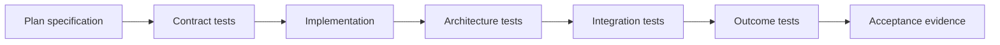

# Test-Driven Delivery and Verification

**Current policy.**

This document makes TTD a delivery requirement for Intention Relay: it defines how architecture rules become executable
checks and how implementation is judged by observable product outcomes, not only source structure or unit coverage. It
applies to every crate, vertical slice, and adapter. The mandatory pinned tooling, strict linting, the coverage policy
(per-crate tiers), Makefile targets, and supply-chain gates are defined in [Quality Gates and
Makefile](12-quality-gates-and-makefile.md).

## Delivery principle

A feature is delivered only when all three are true:

1. its typed contract is specified and tested;
2. its architecture boundaries are protected by executable checks where feasible;
3. a user-visible or operational outcome is verified through the real command/persistence path.

```mermaid
flowchart LR
  SP[Plan specification] --> CT[Contract tests]
  CT --> IM[Implementation]
  IM --> AT[Architecture tests]
  AT --> IT[Integration tests]
  IT --> OT[Outcome tests]
  OT --> AC[Acceptance evidence]
```

Compilation is necessary but never sufficient acceptance evidence.

## Required test layers

| Layer | Purpose | Examples |
| --- | --- | --- |
| DTO tests | Validate schemas, IDs, serialization, validation, versioning. | Typed DTO round trips, invalid command rejects. |
| Domain tests | Prove invariants and state transitions. | One active run, plan number monotonicity. |
| Contract tests | Prove crate-to-crate and client-to-daemon contracts. | `intention-client` command/frame fixtures. |
| Architecture tests | Prevent prohibited dependency/import/API shapes. | Adapter cannot depend on SQLite/runtime; SDK types do not escape provider crate. |
| Storage tests | Prove current-schema creation, transaction, projection, and recovery correctness. | Single-transaction state changes. |
| Runtime tests | Prove actor lifecycle, interruption, pending input, stream ordering. | Pending turn joins the live run context at the next boundary. |
| Tool/policy tests | Prove workspace addressing, execution order, Plan restrictions, and the six tool contracts. | Relative addressing from the root, one durable row per committed result. |
| Provider tests | Normalize native streams/errors and protect credentials. | OpenRouter fixture conversion. |
| Adapter integration tests | Prove Tauri bridge and TUI consume the same daemon contract. | Identical session snapshot and frames observed by both clients. |
| Outcome tests | Prove end-to-end behavior against acceptance scenarios. | Restart marks run interrupted and UI receives it. |

## Architecture rules to encode

The following are mandatory candidates for automated architecture tests:

| Rule | Required protection |
| --- | --- |
| Small-crate structure | Dependency graph check, deny cycles, and a manifest assertion for the required v1 crate set. |
| Crate accountability | A Cargo-metadata-backed check that every workspace crate is classified exactly once and every active production crate keeps an integration test target. |
| Composition ownership | Only `intention-daemon` selects concrete storage/provider/tool implementations. |
| Adapter isolation | Adapter crates (`intention-tui` today; `intention-tauri` is added at M6) cannot depend directly on application runtime/storage implementations. |
| DTO-first | Public cross-crate APIs use DTOs; forbidden implementation resources/SDK types cannot escape. |
| Local protocol | Tauri bridge and TUI use `intention-client`, not direct application services. |
| Daemon authority | SQLite/runtime actor ownership appears only daemon-side. |
| Workspace boundary | File-oriented tool invocations require `WorkspaceRootDto`. |
| Extension boundaries | VFR/Headroom attach as ordinary library calls with a declared contract, not base-tool private coupling. |
| Plan integrity | Model-visible plan reads cannot expose frontmatter; ordinary Plan `write`/`edit` cannot target project paths, while Plan `execute` remains advisory-guided and audited. |
| Autopilot continuity | Plan approval pins a revision, starts a fresh same-Session Build run, and optional handoff transfers only a safe frozen context. |
| Secret safety | Secret-bearing config cannot appear in public DTO/log/error/snapshot types. |

The mandatory tooling is fixed by [12 Quality Gates and Makefile](12-quality-gates-and-makefile.md). Architecture tests
are executed through `make architecture`; the complete reproducible acceptance gate is `make verify`, `make ci` is the
local single-pass alias, while CI invokes the per-job aliases (`ci-lint-arch`, `ci-test`, `ci-coverage-default`,
`ci-deps`) as parallel matrix jobs. `make architecture` also contains isolated expected-failure fixtures for adapter
isolation, protocol isolation, composition-only concrete selection, provider-SDK public-contract leakage,
and policy-aligned workspace cycles.

## Minimum test portfolio by crate

`quality/architecture.toml` classifies every workspace crate and declares each production crate's allowed workspace
dependency edges, and `quality/coverage.toml` declares the per-crate tier floors ([Quality Gates and Makefile](12-quality-gates-and-makefile.md)).
Every production crate's test targets must exist before implementation and prove the contracts, invariants, failure
modes, and outcomes its owner architecture document states. The smallest portfolio that proves every stated invariant, contract, failure mode, and
outcome is required; no aggregate coverage number replaces it, and boundary crates prove behavior over fixture daemons
and current-schema state rather than private implementation steps.

## Result-oriented acceptance scenarios

### G. Plan-to-Build Autopilot continuity

1. Create a Plan-mode session and a physical plan revision.
2. Use `execute` for an investigation command and verify Plan policy audit.
3. Approve the exact plan revision.
4. Verify approval and fresh Build-run binding are durable and ordered.
5. Verify the same `SessionId`, a new `RunId`, pinned plan revision, and retained conversation context.
6. Verify Build Autopilot performs configured actions without per-action confirmation.
7. Verify Plan project `write/edit` remains hard-denied.

### H. Optional implementation handoff

1. Approve a plan and request a new implementation Session.
2.  Verify the target Session receives the full available safe context, plan revision, and execution prompt as a frozen
   snapshot.
3.  Verify source history is unchanged and no live runtime resource, credential, grant, or unfinished effect
   transfers.
4. Verify optional auto-start creates a fresh Build run or leaves an idle target on start failure.

The following scenarios must become executable before the corresponding capability is accepted:

### A. Shared-adapter session

1. Start a fixture daemon.
2. Connect a Tauri bridge fixture and TUI client fixture.
3. Create/open the same session through one adapter.
4. Send a user turn through the other.
5. Verify both receive the same correlated subscription snapshot and live frames.

### B. Workspace addressing

1. Create a session with a temporary workspace root.
2. Change process CWD to a different directory.
3. Invoke a filesystem tool with relative paths, and a `glob`/`grep` without an explicit path.
4.  Verify relative access resolves from the session root, `execute` observes it as CWD, and the pathless search starts
   at the root; absolute and parent paths are addressed as given, not contained
   ([architecture 05](05-tools-workspace-and-hooks.md)).

### C. Durable run interruption

1. Persist a running run and related state.
2. Restart the daemon fixture.
3. Verify no model or tool call resumes.
4. Verify an interrupted transition is persisted and visible through transport.

### D. Plan artifact integrity

1. Create a Plan-mode session/run.
2. Allocate plan `0`.
3. Edit its body through the plan path.
4. Verify frontmatter remains valid and invisible in captured model context.
5. Attempt a project-file write with normal write/edit.
6. Verify the typed denial and the durable audit record it commits.

### E. VFR and Headroom pipeline

1. Read an eligible large source fixture.
2. Verify VFR representation and expandable reference.
3. Produce eligible large tool output.
4. Verify normalized persistence, Headroom model-context compression, and `retrieve` behavior.
5. Verify adapter-visible and model-visible representations follow the agreed policy.

### F. Secret redaction

1. Use an intentionally recognizable fake credential in TOML.
2. Trigger provider config and failure paths.
3. Enumerate frames, snapshots, errors, structured logs, and adapter DTOs.
4. Verify the credential is absent from all output.

### I. Daemon-host tool loop

1. Start the real daemon binary and connect over the local protocol.
2. Send a user turn against a fake provider that emits a tool call; verify the
outgoing request advertises the six active tools (`read`, `write`, `edit`, `execute`, `glob`, `grep`) and
requests the `tool_calls` capability.
3. Verify the daemon executes the call through the real typed tool service under `WorkspaceRoot`.
4.  Verify the committed tool-call row, its answering tool-result row, and the `tool_results` row commit before
   publication, and that the client's `run.frame` notifications carry only those committed values.
5. Verify the provider exchange continues with assistant-tool-call and tool-role messages and completes.
6. Restart the daemon and re-read current state.
7. Verify the recorded tool call and result re-read from current state and are never re-executed.

### J. Live provider tool loop (opt-in, manual)

1. Set `INTENTION_REAL_API_KEY` and `INTENTION_REAL_API_MODEL`, then run
`make e2e-real-api` (which exports the `INTENTION_REAL_API_E2E=1` opt-in), or dispatch the manual
`.github/workflows/real-api-e2e.yml` workflow with its provider and model inputs. The provider kind defaults to
`generic-chat-completion-api`; `openrouter` is selectable through the optional `INTENTION_REAL_API_KIND`, and
`INTENTION_REAL_API_ENDPOINT` overrides the endpoint for self-hosted providers.
2. The `#[ignore]`d test `crates/intention-daemon/tests/real_api_e2e.rs` spawns
the real daemon binary, drives it through the real local transport, and executes a real model tool loop against the live
provider API over HTTPS.
3. Verify the provider returns a real tool call; the outgoing request
advertises the six active tools and requests the `tool_calls` capability (scenario I), the daemon executes
the call through the real typed tool service under `WorkspaceRoot`, the committed tool call and its result commit before
publication, and the run completes. When the configured model runs in thinking mode, the
continuation request also carries the same round's accepted reasoning as `reasoning_content` on the assistant tool-call
message; no prior-turn reasoning is transferred.
4. Restart the daemon and re-read the run; verify the recorded tool call and
result re-read from current state and are never re-executed.
5. Verify the credential is absent from the committed transcript rows, session snapshots, daemon logs,
and state bytes.
6. Verify an invalid credential produces a typed failure mapping and never an
untyped panic or a credential echo.

This scenario is non-hermetic: it needs network access, a live provider, and a real credential. It runs only under the
explicit opt-in ([Quality Gates and Makefile](12-quality-gates-and-makefile.md)) and never in `make quick`,
`make verify`, CI, or any required status check.

## Verification evidence

Each completed slice reports the architecture document, acceptance criteria, and tests it implements; the `make quick`,
narrow, and `make verify` checks it ran; the outcome scenarios it covers; and every lint, coverage, feature,
dependency, or architecture exception with its recorded rationale. Deliberately deferred behavior is recorded as an
explicit open decision, never as omitted coverage. A cited live run reports its date, commit, provider, model, and
workflow run URL and never the credential; the opt-in live channel is additional evidence only and never a substitute
for the mandatory hermetic gates ([Quality Gates and Makefile](12-quality-gates-and-makefile.md)).

### Slice 1.5 evidence

Slice 1.5 replaces the event, snapshot, and replay contract blocks with current-state storage tests: schema tests
create the current-state tables directly on open, and transaction tests prove one SQLite transaction per state change
with publication from the committed values. The daemon end-to-end tests drive the real asynchronous `intention-client`
instead of the low-level transport. Tool-call tests cover one transaction per call, the pre-effect identity rejection,
and the durable terminal row. Protocol contract fixtures cover the reduced
current-state surface with no resync, cursor, or event DTOs. Tests of deleted surfaces are deleted without replacement,
and the per-crate coverage tiers in `quality/coverage.toml` are unchanged.

### Future package evidence

Evidence obligations for systems that are not activated are owned by their documents; this document keeps only the
pointers:

- Slice 1.5 core simplification — [Implementation Roadmap](11-implementation-roadmap.md).
- Tool registry and model-tool loop — [architecture 15](15-tool-registry-and-model-tool-loop.md).
- MCP capability lifecycle — [architecture 18](18-mcp-capability-lifecycle.md).
- Gateway/RLM bridge — [architecture 19](19-gateway-rlm-bridge.md).
- IPython kernel lifecycle — [architecture 20](20-ipython-kernel-lifecycle.md).
- Goals, skills, context, memory, and compaction — [architecture 21](21-goals-skills-context-memory-and-compaction.md).
- Provider evolution, profiles, and reasoning — [architecture 22](22-provider-evolution-profiles-and-reasoning.md).
- Session branching and regeneration — [architecture 23](23-non-destructive-session-branching-and-regeneration.md).
- Daemon, transport, and adapter boundary — [architecture 03](03-daemon-transport-and-adapters.md).
- Configuration and provider control plane — [architecture 25](25-configuration-provider-control-plane.md) (protocol:
  [architecture 29](29-provider-session-and-profiles-protocol.md)).
- Post-M4 evidence obligations — activating specification per [architecture 12](12-quality-gates-and-makefile.md).

## Non-goals

No specific Rust test framework is mandated, and no test count or coverage percentage replaces reviewer judgment.
Snapshots are not a substitute for semantic assertions, and a unit test reaching a private method never proves that a
user flow works.
