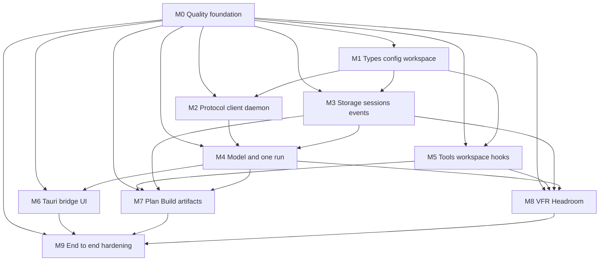

# Implementation Roadmap

## Scope

This is a dependency-aware delivery roadmap, not a time estimate. The first implementation milestone is the reproducible quality foundation. Every later milestone begins with failing tests and is accepted only after its applicable `make verify` evidence passes.

The required quality commands, pinned tools, coverage tiers, lint policy, feature profiles, architecture checks, and supply-chain gates are defined in [Quality Gates and Makefile](12-quality-gates-and-makefile.md). Test-first and outcome-verification rules are defined in [Test-Driven Delivery and Verification](10-test-driven-delivery-and-verification.md).

## Dependency graph

## Quality rule for every milestone

Every milestone after Milestone 0 must:

1. assign every new production crate a coverage tier before code is merged;
2. add or update failing DTO, domain, architecture, and outcome tests before or with implementation;
3. classify new optional Cargo features in the feature-profile policy in the same change;
4. use only pinned dependencies and tools;
5. run `make quick` during development and `make verify` before acceptance;
6. record any policy exception in a reviewed, versioned policy file with rationale and equivalent test evidence.

## Milestone 0: Reproducible quality foundation

### Deliver

- pinned Rust toolchain and required components;
- pinned external-tool manifest for nextest, llvm-cov, deny, audit, udeps, machete, and outdated, including validated invocation syntax for the pinned versions;
- root Makefile following [12 Quality Gates and Makefile](12-quality-gates-and-makefile.md), with explicit mutating versus non-mutating targets;
- strict pragmatic workspace lint configuration with warnings denied and documented local-exception mechanism;
- versioned coverage-tier policy and checker;
- a minimal non-production `quality-harness` workspace member, used only to prove M0 Cargo, lint, test, documentation, and coverage pipelines before M1 creates product crates;
- machine-readable required-v1-crate-set, responsibility, test-target, and feature-profile policies;
- initial architecture-test harness;
- supply-chain policy/allowlist files;
- CI configuration that performs explicit pinned-tool setup and invokes `make ci` as its only verification command.

### Tests first

- fixture that fails formatting verification;
- fixture that produces a compiler/Clippy warning;
- fixture with unreasoned or broad lint suppression;
- fixture with missing/mismatched pinned quality tool;
- fixture with missing required crate/test target;
- fixture with forbidden dependency, import, or DTO implementation leak;
- fixture below its coverage tier and one with an unapproved exclusion;
- fixture missing a required feature profile;
- fixture for banned/license/advisory/source/duplicate dependency failure;
- fixture for unused, stale, or manifest-only dependency;
- recognizable fake-secret fixture that must be absent from events, snapshots, errors, logs, and adapter DTOs.

### Acceptance outcomes

- `make quick`, `make check`, `make verify`, and `make ci` have documented, reproducible, non-mutating behavior.
- `make ci` is the only CI verification command and initially aliases the full `make verify` gate.
- Each intentional quality defect above fails the intended gate.
- The quality pipeline never installs tools, updates lockfiles, or repairs source implicitly.
- No production crate can merge without a declared tier, test target, and architecture ownership entry.

## Milestone 1: Contracts, configuration, and workspace skeleton

### Deliver

- workspace manifests and crate skeletons following [01 Workspace and Crate Map](01-workspace-and-crate-map.md);
- required-v1-crate-set entries, declared responsibilities, test targets, and coverage tiers for new production crates;
- `intention-types`, `intention-domain`, `intention-protocol`, and `intention-config` DTO foundations;
- TOML parse/validate/resolve flow with fake test configuration;
- architecture/dependency tests started from the required crate map.

### Tests first

- ID, envelope, error, schema round-trip tests;
- TOML valid/invalid/migration fixture tests;
- crate dependency and forbidden-import architecture checks;
- required-v1-crate-set, per-crate responsibility, and test-target manifest checks;
- secret-redaction DTO fixtures;
- Tier A coverage fixtures for the new production crates.

### Acceptance outcomes

- public contracts compile without storage, Tauri, provider SDK, or runtime implementation dependencies;
- invalid TOML yields safe typed validation errors;
- architecture checks reject an intentional forbidden adapter/storage or provider-SDK contract dependency;
- Tier A crates meet 95% line coverage without excluding validation, migration, or redaction logic.

### M1 implementation decisions

The M1 implementation makes the following decisions required by the roadmap and
configuration policy:

- all planned v1 crates are workspace members; only `intention-types`,
  `intention-domain`, `intention-protocol`, and `intention-config` are active
  Tier A production crates, while every later crate is an implementation-free
  skeleton until its owning milestone;
- the M0 `quality-harness` remains a non-production workspace member;
- configuration discovers a platform-standard config location, with a validated
  explicit absolute-path override for tests, portable invocation, and future
  daemon composition. It never falls back to process CWD;
- the initial TOML schema is version 1, includes a tested supported v0-to-v1
  migration, rejects future schemas with an `ErrorDto`, and exposes only
  redacted public configuration projections;
- M1 defines a serializable, credential-free `ConfigSnapshotDto` contract
  foundation with `ConfigRevisionId` and capture time. Configuration revision
  persistence, daemon application/reload, and attaching a snapshot to a live
  run remain owned by M3/M4; the intended application behavior is new-run-only
  until a later explicit, tested transition is introduced;
- M1 accepts only `openrouter` and `generic-chat-completion-api` provider kinds.
  `openai` remains unavailable until a separately declared OpenAI Responses
  driver crate, contract, and boundary policy are introduced.

## Milestone 2: Local protocol, client, and daemon bootstrap

### Deliver

- `intention-transport`, `intention-client`, `intention-daemon`, and composition wiring sufficient for a health/session fixture;
- Unix socket/named-pipe abstraction;
- bootstrap locking, readiness, protocol negotiation, typed errors, and typed subscription skeleton;
- minimal TUI proof client, no Tauri UI required yet.

### Tests first

- one-daemon startup-race test;
- protocol mismatch test;
- permission/path integration fixture;
- client reconnect and snapshot/tail contract test;
- Tier C coverage fixtures and feature-profile checks.

### Acceptance outcomes

- two Rust clients connect to one daemon and observe the same typed health/session state;
- a stale/unavailable daemon produces a typed error rather than a hang;
- a reconnect obtains a consistent snapshot/event position;
- Tier C crates meet 85% line coverage and all relevant feature profiles pass.

## Milestone 3: SQLite sessions, events, snapshots, and queue

### Deliver

- repository DTO contracts and SQLite implementation;
- session/project/workspace state;
- append-only event envelopes, current projections, snapshots;
- one-active-run invariant and durable queued input;
- daemon restart marks active work interrupted.

### Tests first

- transaction fault injection;
- run state machine tests;
- durable queue promotion/removal tests;
- restart/recovery fixtures;
- snapshot plus event-tail equivalence tests;
- Tier B coverage fixtures for storage/application/runtime paths.

### Acceptance outcomes

- session state survives daemon restart;
- a second turn is durably queued, never starts a parallel run;
- an adapter never receives a committed-state event that is absent from SQLite;
- applicable Tier B crates meet 90% line coverage, including failure and recovery paths.

## Milestone 4: Model contract, providers, and one streaming run

### Deliver

- model DTOs and runtime model loop skeleton;
- OpenRouter SDK driver;
- Generic Chat Completion driver;
- provider capability validation, usage/events, timeout/retry policy skeleton;
- one streaming user turn ending in a durable run state.

### Tests first

- provider stream/error normalization fixtures;
- OpenRouter SDK isolation test;
- tool-call boundary test;
- fake provider run lifecycle integration test;
- provider credential redaction test;
- Tier C coverage fixtures and provider feature-profile checks.

### Acceptance outcomes

- a fixture model stream produces ordered assistant events and durable run completion;
- the application rejects unsupported provider/model combinations before execution;
- provider selection preserves the configured provider/model pair; provider/runtime coverage and redaction gates pass without leaking SDK or credential details.

## Milestone 5: Typed tools, WorkspaceRoot, and hooks

### Deliver

- typed core tool registry and first read/search/write/edit/execute contracts as appropriate;
- mandatory `WorkspaceRoot` policy;
- typed hook dispatcher and deterministic ordering;
- tool lifecycle persistence/events.

### Tests first

- relative/absolute/traversal/symlink workspace tests;
- execute CWD test;
- hook order/rejection tests;
- tool event consistency tests;
- Tier B coverage fixtures for policy-denial and workspace-path branches.

### Acceptance outcomes

- file tools cannot use process CWD fallback or access outside the allowed root;
- `execute` observes `workspace_root` as CWD;
- hook rejection prevents base tool execution and produces typed durable evidence;
- applicable Tier B crates meet 90% coverage without excluding policy or boundary logic.

## Milestone 6: Tauri bridge and primary desktop UI

### Deliver

- `intention-tauri` bootstrap/native bridge using only `intention-client`;
- minimal Svelte UI to create/open a session, send a turn, render streamed state, and reconnect;
- TUI/REPL remains a contract-equivalent client.

### Tests first

- bridge contract tests using fixture daemon;
- TUI/bridge equivalent command/event tests;
- desktop lifecycle smoke test where the environment supports it;
- adapter mapping coverage and fixture-daemon outcome scenarios.

### Acceptance outcomes

- Tauri and TUI can observe the same daemon-owned session;
- closing Tauri does not stop daemon-owned work;
- no Tauri crate imports application/runtime/storage implementation APIs;
- adapters satisfy mapping-contract and smoke/outcome requirements rather than a misleading aggregate UI line target.

## Milestone 7: Plan/Build policies and physical plans

### Deliver

- Plan/Build run policy;
- plan allocation, AppData structure, zero-based numbers, YAML frontmatter and revisions;
- model-safe body projection;
- plan submission/approval/rejection state flow;
- Plan-mode normal filesystem mutation restrictions.

### Tests first

- plan allocation and revision tests;
- frontmatter hidden/model-capture test;
- Plan write/edit deny/allow tests;
- lifecycle transition and durable approval tests;
- Tier B coverage fixtures for plan policy and artifact integrity.

### Acceptance outcomes

- a Plan-mode agent can iteratively edit its physical plan body;
- it cannot use ordinary write/edit tools to modify a project file;
- model context excludes plan frontmatter;
- plan policy/artifact crates meet Tier B coverage with mandatory captured-context and denial scenarios.

## Milestone 8: VFR and Headroom extensions

### Deliver

- VFR hook, mapping, expansion/raw tools, model instructions;
- Headroom hook, CCR retention contract, retrieve tool;
- deterministic composition with workspace/tool pipeline;
- adapter/model representation policy.

### Tests first

- VFR transform/expand/raw fixtures;
- Headroom retention/retrieval/expiry fixtures;
- full hook-order integration test;
- UI/model representation distinction test;
- Tier B coverage fixtures for transform, expiry, retrieval, and error paths.

### Acceptance outcomes

- VFR and Headroom operate as independently enabled hook extensions;
- `retrieve` returns retained content while valid and typed expiry behavior afterward;
- base tools do not import VFR or Headroom implementation crates;
- extension crates meet Tier B coverage and feature-profile checks.

## Milestone 9: Hardening and acceptance verification

### Deliver

- final architecture checks;
- observability, health, safe structured diagnostics;
- config revision behavior and redaction hardening;
- restart/reconnect/cancellation smoke suite;
- documentation reconciliation against implemented public contracts.

### Tests first

- full result-oriented scenario suite from [10 TTD](10-test-driven-delivery-and-verification.md);
- secret injection regression suite;
- daemon restart and reconnect endurance fixtures;
- architecture dependency/API boundary checks across all crates;
- complete `make verify` reproducibility check from a clean, pinned-tool environment.

### Acceptance outcomes

- all v1 outcome scenarios are automated where practical and recorded where manual environment testing remains necessary;
- no unapproved architectural, lint, coverage, feature, or dependency exception remains implicit;
- every public DTO and crate boundary agrees with the architecture documentation or the documentation is updated in the same change;
- `make ci` passes from a clean environment using only pinned inputs.

## Exit criteria for the roadmap

The v1 implementation phase is ready to claim architectural completion only when:

- every milestone acceptance outcome has evidence;
- Tauri and TUI/REPL use the same typed client/protocol in real integration tests;
- all critical architecture rules have automated protection or documented, approved justification;
- security redaction and workspace boundary tests pass;
- Plan, VFR, and Headroom demonstrate their required physical/runtime outcomes;
- `make verify` passes all strict formatting, lint, feature, test, documentation, architecture, coverage, and supply-chain checks;
- no legacy Antibusy implementation detail is relied upon without an explicit new decision.
