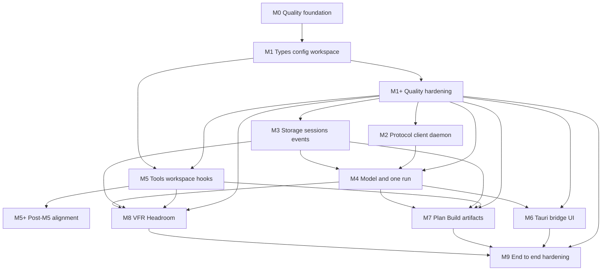
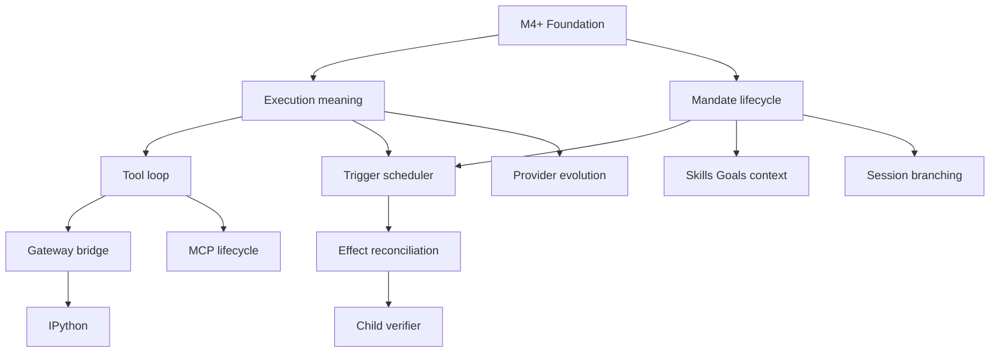

# Implementation Roadmap

## Scope

This is a dependency-aware delivery roadmap, not a time estimate. The first implementation milestone is the reproducible quality foundation. Every later milestone begins with failing tests and is accepted only after its applicable `make verify` evidence passes.

The required quality commands, pinned tools, coverage tiers, lint policy, feature profiles, architecture checks, and supply-chain gates are defined in [Quality Gates and Makefile](12-quality-gates-and-makefile.md). Test-first and outcome-verification rules are defined in [Test-Driven Delivery and Verification](10-test-driven-delivery-and-verification.md). The immutable M0/M1 phase-closure baseline and verification matrix are recorded in [M0/M1 Closure Evidence](../closeout/m0-m1-closure-evidence.md). M2 closeout evidence is tracked separately in [M2 Closure Evidence](../closeout/m2-closure-evidence.md); its full `make verify` result passed on the recorded M2 worktree, while its immutable commit baseline remains pending.

## Dependency graph

## Quality rule for every milestone

Every milestone after Milestone 0 must:

1. assign every new production crate a coverage tier before code is merged;
2. add or update failing DTO, domain, architecture, and outcome tests before or with implementation;
3. classify new optional Cargo features in the feature-profile policy in the same change;
4. use only pinned dependencies and tools;
5. run `make quick` during development and `make verify` before acceptance;
6. record any policy exception in a reviewed, versioned policy file with rationale and equivalent test evidence.

## Milestone 0: Reproducible quality foundation

### Deliver

- pinned Rust toolchain and required components;
- pinned external-tool manifest for nextest, llvm-cov, deny, audit, udeps, machete, and outdated, including validated invocation syntax for the pinned versions;
- root Makefile following [12 Quality Gates and Makefile](12-quality-gates-and-makefile.md), with explicit mutating versus non-mutating targets;
- strict pragmatic workspace lint configuration with warnings denied and documented local-exception mechanism;
- versioned coverage-tier policy and checker;
- a minimal non-production `quality-harness` workspace member, used only to prove M0 Cargo, lint, test, documentation, and coverage pipelines before M1 creates product crates;
- machine-readable required-v1-crate-set, responsibility, test-target, and feature-profile policies;
- initial architecture-test harness;
- supply-chain policy/allowlist files;
- CI configuration that performs explicit pinned-tool setup and invokes `make ci` as its only verification command.

### Tests first

- fixture that fails formatting verification;
- fixture that produces a compiler/Clippy warning;
- fixture with unreasoned or broad lint suppression;
- fixture with missing/mismatched pinned quality tool;
- fixture with missing required crate/test target;
- fixture with forbidden dependency, import, or DTO implementation leak;
- fixture below its coverage tier and one with an unapproved exclusion;
- fixture missing a required feature profile;
- fixture for banned/license/advisory/source/duplicate dependency failure;
- fixture for unused, stale, or manifest-only dependency;
- recognizable fake-secret fixture that must be absent from events, snapshots, errors, logs, and adapter DTOs.

### Acceptance outcomes

- `make quick`, `make check`, `make verify`, and `make ci` have documented, reproducible, non-mutating behavior.
- `make ci` is the only CI verification command and initially aliases the full `make verify` gate.
- Each intentional quality defect above fails the intended gate.
- The quality pipeline never installs tools, updates lockfiles, or repairs source implicitly.
- No production crate can merge without a declared tier, test target, and architecture ownership entry.

## Milestone 1: Contracts, configuration, and workspace skeleton

### Deliver

- workspace manifests and crate skeletons following [01 Workspace and Crate Map](01-workspace-and-crate-map.md);
- required-v1-crate-set entries, declared responsibilities, test targets, and coverage tiers for new production crates;
- `intention-types`, `intention-domain`, `intention-protocol`, and `intention-config` DTO foundations;
- TOML parse/validate/resolve flow with fake test configuration;
- architecture/dependency tests started from the required crate map.

### Tests first

- ID, envelope, error, schema round-trip tests;
- TOML valid/invalid/migration fixture tests;
- crate dependency and forbidden-import architecture checks;
- required-v1-crate-set, per-crate responsibility, and test-target manifest checks;
- secret-redaction DTO fixtures;
- Tier A coverage fixtures for the new production crates.

### Acceptance outcomes

- public contracts compile without storage, Tauri, provider SDK, or runtime implementation dependencies;
- invalid TOML yields safe typed validation errors;
- architecture checks reject an intentional forbidden adapter/storage or provider-SDK contract dependency;
- Tier A crates meet 95% line coverage without excluding validation, migration, or redaction logic.

### M1 implementation decisions

The M1 implementation makes the following decisions required by the roadmap and
configuration policy:

- all planned v1 crates are workspace members; only `intention-types`,
  `intention-domain`, `intention-protocol`, and `intention-config` are active
  Tier A production crates, while every later crate is an implementation-free
  skeleton until its owning milestone;
- the M0 `quality-harness` remains a non-production workspace member;
- configuration discovers a platform-standard config location, with a validated
  explicit absolute-path override for tests, portable invocation, and future
  daemon composition. It never falls back to process CWD;
- the initial TOML schema is version 1, includes a tested supported v0-to-v1
  migration, rejects future schemas with an `ErrorDto`, and exposes only
  redacted public configuration projections;
- M1 defines a serializable, credential-free `ConfigSnapshotDto` contract
  foundation with `ConfigRevisionId` and capture time. Configuration revision
  persistence, daemon application/reload, and attaching a snapshot to a live
  run remain owned by M3/M4; the intended application behavior is new-run-only
  until a later explicit, tested transition is introduced;
- M1 accepts only `openrouter` and `generic-chat-completion-api` provider kinds.
  `openai` remains unavailable until a separately declared OpenAI Responses
  driver crate, contract, and boundary policy are introduced.

## Milestone 1+: Quality policy hardening

M1+ is a completed quality-enforcement milestone between the M1 contract
foundation and M2 functional delivery. It does not activate additional
production crates or claim daemon, transport, storage, runtime, adapter, or
provider-driver behavior. Its implementation baseline and verification matrix
are recorded in [M1+ Quality Hardening Evidence](../closeout/m1-plus-quality-hardening-evidence.md).

### Deliver

- workspace-wide dependency graph construction and deterministic cycle-path
  rejection in `make architecture`;
- machine-readable Cargo integration `test_targets` for every planned crate,
  exact metadata enforcement for active M1 crates, and empty target sets for
  M1 skeletons;
- source-level provider SDK namespace ownership analysis restricting
  `async_openai::` and `openrouter_rs::` to their owner crate's private
  implementation;
- exact-file coverage-exclusion policy with owner, report-path, and denominator
  enforcement;
- isolated expected-failure fixtures for every new quality rule.

### Tests first

- a policy-aligned workspace dependency cycle fixture that reports its closed
  path;
- unknown, duplicate, and skeleton integration-target declaration fixtures;
- provider SDK namespace leak fixtures outside the owner crate's private
  implementation;
- valid denominator-reduction and invalid coverage-exclusion fixtures for
  missing metadata, unsafe paths, wrong owner, absent report path, duplicates,
  and all-source removal.

### Acceptance outcomes

- `make architecture` rejects a policy-aligned cycle before a regular Cargo
  compile gate and reports the involved packages;
- every active M1 crate's declared integration targets exactly equal Cargo
  metadata and are included by the standard all-targets test gate;
- provider SDK namespaces are rejected outside their owner crate private
  implementation by source-level ownership analysis;
- `make coverage` applies only valid exact-file exclusions before per-crate
  coverage arithmetic and rejects exception misuse;
- all new rules are proved by isolated failure fixtures and final `make verify`
  passes in every required feature profile.

## Milestone 2: Local protocol, client, and daemon bootstrap

### Deliver

- `intention-transport`, `intention-client`, `intention-daemon`, composition wiring, and `intention-tui` proof sufficient for an in-memory health/session fixture;
- cross-platform local IPC using Unix domain sockets and Windows named pipes, with logical endpoint identifiers under per-user runtime/app-config locations;
- private length-prefixed UTF-8 JSON framing with a 1 MiB maximum frame payload, one synchronous correlated request per connection, and bounded per-connection serving;
- Unix `0700` endpoint-parent and `0600` listener-socket policy, plus a cross-platform `fs4` advisory startup lock;
- first-connect, lock/recheck, daemon-process launch, capability/version-validated `Ready` health, typed errors, and snapshot-tail/resync subscription wiring with optional run scope;
- explicit M2 deferral of idle shutdown, daemon stop, upgrade coordination, durable sessions/events/snapshots, and model/provider execution.

### Tests first

- one-daemon startup-race test;
- protocol mismatch, hello, correlation, and health-readiness tests;
- endpoint permission/path and 1 MiB frame-bound integration fixtures, including
  a Windows named-pipe bind, hello, framed request/response, and cleanup fixture;
- client stateful recovery plus snapshot/tail/resync and optional-run-scope contract tests over new one-shot IPC connections;
- TUI proof-adapter contract test using production `intention-client` only and a dev-only fixture daemon host;
- Tier C coverage fixtures and feature-profile checks.

### Acceptance outcomes

- two Rust clients connect to one daemon, complete negotiated health checks, and observe the same typed in-memory health/session fixture;
- an unavailable daemon produces a typed error rather than a hang, while bootstrap rechecks under the startup lock before launching one process;
- a reconnect recovery handle obtains a consistent snapshot/event position or an explicit resync instruction through a new one-shot connection; duplicate or stale events do not mutate the reducer;
- local endpoints and frames remain private and bounded; Unix parent/socket modes enforce the documented `0700`/`0600` policy, while required Windows CI exercises the named-pipe fixture;
- the TUI proof reaches daemon state exclusively through the shared client;
- Tier C crates meet 85% line coverage and all relevant feature profiles pass.

### M2 implementation decisions and boundaries

M2 uses Unix domain sockets on Unix and Windows named pipes on Windows. It keeps
the length-prefixed UTF-8 JSON codec private to `intention-transport`, limits
payloads to 1 MiB, and serves one request per connection synchronously. A slow
client can block only its dedicated connection thread; subscription buffering,
streaming, deadlines, and eviction remain later hardening work.

The protocol now provides health/readiness, hello capability negotiation,
correlated envelopes, snapshot-and-tail or resync subscription results, and an
optional run scope. The composition facade is intentionally in-memory and
non-durable: M3 owns durable storage/recovery and M4 owns model/provider runs.
Idle shutdown, explicit stop, and daemon upgrades are deferred. Detailed
transport and adapter constraints are in [Daemon, Transport, and Adapters](03-daemon-transport-and-adapters.md).

## Milestone 3: SQLite sessions, events, snapshots, and queue

### Deliver

- repository DTO contracts and bundled-SQLite implementation using `rusqlite_migration`;
- activated `intention-application`, `intention-runtime`, `intention-storage`, and `intention-storage-sqlite` ownership, including the required storage/application/runtime-to-config snapshot edges;
- session/project/workspace-root state with stable `WorkspaceId` association;
- canonical credential-free `ConfigSnapshotDto` revision persistence: an equal snapshot for the same `ConfigRevisionId` is idempotent, while a different snapshot for that ID fails with a typed conflict; and immutable per-started/promoted-run attachment;
- append-only explicit event taxonomy, current projections, and a session/run snapshot on every committed state change;
- one-active-run invariant, durable queued input with never-reused queue tickets, and atomic terminal promotion;
- required `Starting -> Cancelling -> Cancelled` cancellation lifecycle; and
- recovery-before-ready that marks unfinished work interrupted without automatic external-work resumption.

M3 uses the platform AppData/state location for production SQLite state and
never falls back to process CWD. TOML is applied once per daemon startup;
editing TOML requires restart and does not live-reload a running daemon.
Subscriptions are durable one-shot snapshot/tail replay or typed resync only.
M3 remains one-shot and replay-only. M4 supplies persistent live run
streaming, post-commit fan-out, slow-peer policy, and safely represented
run-scoped replay through separate contracts. A M3 request with `run_id: Some`
always returns typed `HistoryUnavailable` resync rather than unfiltered session
state, because its session-contiguous snapshot/tail DTOs cannot safely express
filtered run state.

### Tests first

- DTO/event and compatible persisted-fixture tests for `WorkspaceId`, projections, queue tickets, and explicit event taxonomy;
- supported/future-schema SQLite migration fixtures; safe canonical config-snapshot persistence; and same-revision equal-snapshot idempotency versus typed different-snapshot conflict;
- transaction fault-injection outcome tests after event, projection, and snapshot writes, proving rollback at each stage;
- run state-machine tests, including mandatory `Starting -> Cancelling -> Cancelled` behavior;
- durable queue acceptance/idempotency/removal and atomic terminal-promotion tests that retain the queued turn's proposed `RunId`, snapshot, and revision after a daemon config change;
- recovery-before-ready fixture proving no automatic external-work resumption;
- durable one-shot snapshot/tail replay-or-resync tests: unscoped requests replay safely, while matching, nonexistent, and cross-session `run_id: Some` requests return `HistoryUnavailable` without unfiltered session state; persistent live streams and safely represented scoped replay remain excluded; and
- Tier B coverage fixtures for storage/application/runtime paths and feature-profile checks.

### Acceptance outcomes

- session state survives daemon restart, and recovery completes before the facade reports ready;
- a second turn is durably queued with a stable never-reused ticket and never starts a parallel run;
- projection, append-only events, and per-state-change snapshots are atomic; fault injection at the event, projection, and snapshot stages rolls each failed transaction back completely;
- a same-ID equal config snapshot is idempotent while a same-ID different snapshot returns typed conflict; cancellation follows `Starting -> Cancelling -> Cancelled`, and terminal promotion atomically starts the oldest eligible queued turn with its original proposed `RunId`, snapshot, and revision;
- an unscoped one-shot adapter subscription receives a durable snapshot plus contiguous tail or typed resync; every matching, nonexistent, or cross-session `run_id: Some` request receives `HistoryUnavailable` resync rather than unfiltered session state, and no request claims a persistent stream;
- the database uses AppData/platform state and fails safely rather than using CWD; and
- applicable Tier B crates meet 90% line coverage, including failure and recovery paths.

### M3 implementation decisions and boundaries

M3 makes `ConfigSnapshotDto` the canonical credential-free configuration
selection. The composition root records one selected snapshot on each daemon
startup; accepted and promoted runs retain their own immutable snapshot/revision.
M3 applies TOML at startup only. A TOML edit becomes effective on restart and
cannot mutate a running daemon or an existing run.

The SQLite backend owns bundled SQLite migrations through `rusqlite_migration`,
semantic transactional repository methods, normalized current projections,
append-only events, and per-state-change session/run snapshots. Its public
storage contract remains DTO-only: it does not expose a SQL connection,
transaction closure, path, or SQLite row.

M3 is intentionally not M4 streaming/model runtime. A post-commit publisher
seam exists but is a no-op; M4 supplies persistent live run streaming,
fan-out/buffering, and slow-peer policy through separate contracts. Durable
one-shot replay, ordering, resync, and restart recovery are M3 behavior, not a
streaming deferral.

## Milestone 4: Model contract, providers, and one streaming run, complete

**Closed at immutable implementation baseline
[`d2a85370a66d63fc759e4987a74d435ecd5d5115`](../closeout/m4-closure-evidence.md).**
The baseline passed local `make verify` and the required Linux and Windows
`make ci` matrix. The [M4 Closure Evidence](../closeout/m4-closure-evidence.md)
records the complete verification matrix, coverage, exceptions, and retained
deferrals; the [M4 execution charter](../m4.md) retains the accepted decisions
and integration history.

M4 delivered the Tier C provider foundation and all runtime, protocol,
scheduling, and daemon-host packages. It establishes validated provider-neutral
DTOs and stream ordering, safe per-run execution policy in snapshots, opaque
startup-only provider material, and private SDK-backed request/mapping
boundaries. It selects `openrouter-rs` 0.14.0 for OpenRouter and
`async-openai` 0.41.3 for configured-base-URL Generic Chat Completions,
without custom HTTP/SSE parsing. The generic subset is text, usage, finish, and
function-style tool calls; reasoning, multimodal, and vendor extensions reject
preflight. A private daemon-owned Tokio runtime executes one streaming run,
persists durable facts, handles bounded retry and cancellation, and provides
persistent run-scoped replay and live delivery.

### Delivered

- provider-neutral model DTOs and runtime model execution;
- OpenRouter SDK driver;
- Generic Chat Completion driver;
- provider capability validation, usage/events, and timeout/retry policy;
- one streaming user turn ending in a durable run state.

### Completed test evidence

- provider stream/error normalization fixtures;
- OpenRouter SDK isolation test;
- tool-call boundary test;
- fake provider run lifecycle integration test;
- provider credential redaction test;
- Tier C coverage fixtures and provider feature-profile checks.

### Accepted outcomes

- a fixture model stream produces ordered assistant events and durable run completion;
- the application rejects unsupported provider/model combinations before execution;
- provider selection preserves the configured provider/model pair; provider/runtime coverage and redaction gates pass without leaking SDK or credential details.

## Milestone 5: Typed tools, WorkspaceRoot, and hooks

**Closed at the immutable merged baseline
[`bf40567`](../closeout/m5-closure-evidence.md) (PR #14).** The baseline
passed the required Linux and Windows `make ci` matrix (run 33265408980, 9/9
jobs green), and the current `main` head `b930c14` remains green (run
33273389437, 9/9 jobs; local `make quick` 527/527 on 2026-08-30). The
[M5 Closure Evidence](../closeout/m5-closure-evidence.md) records the
complete verification matrix, coverage, exceptions, and retained deferrals;
the production model-tool loop decision is recorded in
[ADR 0019](../decisions/0019-production-model-tool-loop.md).

### Deliver

- typed core tool registry and first read/search/write/edit/execute contracts as appropriate;
- mandatory `WorkspaceRoot` policy;
- typed hook dispatcher and deterministic ordering;
- tool lifecycle persistence/events;
- daemon-owned invocation path consumed by the model-tool loop.

### Tests first

- relative/absolute/traversal/symlink workspace tests;
- execute CWD test;
- hook order/rejection tests;
- tool event consistency tests;
- durable tool-call and tool-result continuation fixtures and daemon-host loop wiring tests;
- Tier B coverage fixtures for policy-denial and workspace-path branches.

### Acceptance outcomes

- file tools cannot use process CWD fallback or access outside the allowed root;
- `execute` observes `workspace_root` as CWD;
- hook rejection prevents base tool execution and produces typed durable evidence;
- a provider-emitted tool call is durably recorded, executed through the real registry under `WorkspaceRoot`, and the exchange continues to `Completed`; a real-binary daemon-host E2E scenario exercises this path, and restart replay never re-executes tools;
- applicable Tier B crates meet 90% coverage without excluding policy or boundary logic.

The implemented M5 registry has six active tools (`read`, `write`, `edit`,
`execute`, `glob`, `grep`); other fixed slots remain reserved. Composition
owns registry/workspace/hook assembly, application owns durable lifecycle and
result persistence/publication, and the hook dispatcher owns deterministic
typed ordering and short-circuiting.

## Milestone 5+: Post-M5 retrospective alignment

**Documentation-approved future milestone.** Milestone 5+ is the consolidation
point for all retrospective changes to already-implemented M0-M5 code that the
accepted post-M5 directions require, and the activation home for the
[Configuration and Provider Control Plane](25-configuration-provider-control-plane.md)
cluster adopted by [ADR 0020](../decisions/0020-configuration-provider-control-plane-directions.md).
It does not renumber, replace, or claim delivery of Milestones 6-9; it may run
in parallel with them and does not block their activation. The full
authoritative package review of 2026-08-30 confirmed that the
[`m4plus_concept2.md`](../m4plus_concept2.md) research directions are otherwise
covered by architectures 13-24 and decisions 0001-0019; M5+ closes the
identified configuration/provider control-plane gap and hosts every
retrospective code change.

### Deliver

- controlled configuration live reload: validated TOML applied to a running
  daemon through an explicit contract, transaction, and outcome test,
  affecting fresh runs only;
- credential rotation: private-material replacement without altering frozen
  per-run meaning or selection;
- provider health-check service: non-authorizing typed readiness evidence;
- provider/model discovery: non-authorizing, never model-name routing;
- pricing and budget policy: product policy, never a Mandate admission
  ceiling;
- provider profile UI and configuration control plane over the shared typed
  client;
- consolidation of any retrospective changes to M0-M5 code required by these
  directions, each in its own activating specification.

### Tests first

- reload transaction fault injection: atomic commit or fail-closed, no
  partial snapshot, no mutation of existing runs;
- rotation redaction and no-frozen-meaning-change fixtures;
- health/discovery non-authority fixtures: no RunId/reason/selection created,
  no model-name routing, no fallback;
- pricing non-ceiling classification fixtures;
- control-plane safe-projection fixtures: no raw TOML, credentials, or
  resources cross public or durable boundaries;
- M3/M4 byte/meaning/replay/recovery preservation and fake-secret regression
  across logs, errors, snapshots, events, and adapter DTOs.

### Acceptance outcomes

- M3/M4 startup-only configuration, recorded revisions, and persisted run
  snapshots remain authoritative and unchanged;
- every retrospective change to implemented code is activated by its own
  accepted specification and passes `make quick`, `make verify`, and
  Linux/Windows CI;
- health, discovery, and pricing create no RunId, reason, lifecycle
  transition, scheduler candidate, tool permission, child edge, verifier
  authority, MCP capability, bridge grant, kernel epoch, context projection,
  branch, or reconciliation result;
- applicable crates meet their declared coverage tiers without excluding
  policy or boundary logic.

## Milestone 6: Tauri bridge and primary desktop UI

### Deliver

- `intention-tauri` bootstrap/native bridge using only `intention-client`;
- minimal Svelte UI to create/open a session, send a turn, render streamed state, reconnect, and render safe activity/notification/acknowledgement projections;
- TUI/REPL remains a contract-equivalent client.
- post-M4 activity/UI implementation remains separately activated after architecture 24 declares exact DTO, storage, protocol, and quality boundaries.

### Tests first

- bridge contract tests using fixture daemon;
- TUI/bridge equivalent command/event tests;
- desktop lifecycle smoke test where the environment supports it;
- adapter mapping coverage and fixture-daemon outcome scenarios.

### Acceptance outcomes

- Tauri and TUI can observe the same daemon-owned session;
- closing Tauri does not stop daemon-owned work;
- no Tauri crate imports application/runtime/storage implementation APIs;
- adapters satisfy mapping-contract and smoke/outcome requirements rather than a misleading aggregate UI line target.

## Milestone 7: Plan/Build policies, physical plans, and Build Autopilot

### Deliver

- Plan/Build run policy;
- Build Autopilot as the single user-authorized unrestricted Build policy;
- plan allocation, AppData structure, zero-based numbers, YAML frontmatter and revisions;
- model-safe body projection;
- plan submission/approval/rejection state flow;
- Plan-mode normal filesystem mutation restrictions;
- Plan `execute` availability with advisory focus instruction and trusted-local audit;
- automatic same-Session fresh Build start after approval;
- optional full-context implementation handoff to a new Session.

M7 consumes the daemon-owned model-tool loop for its execution paths; it does
not redefine the loop.

### Tests first

- plan allocation and revision tests;
- frontmatter hidden/model-capture test;
- Plan write/edit deny/allow tests;
- lifecycle transition and durable approval tests;
- Plan `execute` focus/audit tests;
- same-Session approval-to-fresh-Build tests with new `RunId` and pinned plan revision;
- optional handoff snapshot, lineage, redaction, and no-live-state-transfer tests;
- Tier B coverage fixtures for plan policy and artifact integrity.

### Acceptance outcomes

- a Plan-mode agent can iteratively edit its physical plan body;
- it cannot use ordinary write/edit tools to modify a project file;
- Plan `execute` remains available and is not represented as a sandbox;
- approving a plan starts Build Autopilot in the same Session with a new `RunId`;
- optional handoff creates an independent Session from a safe frozen context;
- model context excludes plan frontmatter;
- plan policy/artifact crates meet Tier B coverage with mandatory captured-context and denial scenarios.

## Milestone 8: VFR and Headroom extensions

### Deliver

- VFR hook, mapping, expansion/raw tools, model instructions;
- Headroom hook, CCR retention contract, retrieve tool;
- deterministic composition with workspace/tool pipeline;
- adapter/model representation policy.

### Tests first

- VFR transform/expand/raw fixtures;
- Headroom retention/retrieval/expiry fixtures;
- full hook-order integration test;
- UI/model representation distinction test;
- Tier B coverage fixtures for transform, expiry, retrieval, and error paths.

### Acceptance outcomes

- VFR and Headroom operate as independently enabled hook extensions;
- `retrieve` returns retained content while valid and typed expiry behavior afterward;
- base tools do not import VFR or Headroom implementation crates;
- extension crates meet Tier B coverage and feature-profile checks.

## Milestone 9: Hardening and acceptance verification

### Deliver

- final architecture checks;
- observability, health, safe structured diagnostics;
- config revision behavior and redaction hardening;
- restart/reconnect/cancellation smoke suite;
- documentation reconciliation against implemented public contracts.

### Tests first

- full result-oriented scenario suite from [10 TTD](10-test-driven-delivery-and-verification.md);
- real-binary daemon-host model-tool-loop outcome test; the broader M9 scenario suite remains;
- secret injection regression suite;
- daemon restart and reconnect endurance fixtures;
- architecture dependency/API boundary checks across all crates;
- complete `make verify` reproducibility check from a clean, pinned-tool environment.

### Acceptance outcomes

- all v1 outcome scenarios are automated where practical and recorded where manual environment testing remains necessary;
- no unapproved architectural, lint, coverage, feature, or dependency exception remains implicit;
- every public DTO and crate boundary agrees with the architecture documentation or the documentation is updated in the same change;
- `make ci` passes from a clean environment using only pinned inputs.

## Exit criteria for the roadmap

The v1 implementation phase is ready to claim architectural completion only when:

- every milestone acceptance outcome has evidence;
- Tauri and TUI/REPL use the same typed client/protocol in real integration tests;
- all critical architecture rules have automated protection or documented, approved justification;
- security redaction and workspace boundary tests pass;
- Plan, VFR, and Headroom demonstrate their required physical/runtime outcomes;
- `make verify` passes all strict formatting, lint, feature, test, documentation, architecture, coverage, and supply-chain checks;
- no legacy Antibusy implementation detail is relied upon without an explicit new decision.

## Post-M4 authority reconciliation and foundation boundary

Post-M4 package status uses separate terms: architecture documents are
`Documentation-approved`, implementation remains not authorized, and evidence
is `Planned` unless an exact artifact and observed result is cited. The immutable
`m4plus_concept2.md` is research provenance and is not edited or used as an
implementation acceptance target.

The ordinary M5-M9 delivery track remains the historical delivery sequence.
Its Plan/Build policy wording is superseded by ADR 0017/0018 for the accepted
Autopilot transition. Future Mandate packages
are a separate activation track requiring an approved implementation
specification and atomic updates to crate ownership, DTO/wire/storage versions,
quality policy, feature profiles, migration declarations, and evidence. The
package-to-owner mapping is maintained by the reconciliation source-of-truth
matrix; this roadmap owns sequencing and milestone acceptance only.

**Documentation-only planning package.** This package follows the closed M4
baseline and precedes any separate M4+ implementation authorization. It does
not renumber, replace, or claim delivery of Milestones 5–9. Current M5–M9 remain
the ordinary v1 roadmap until a later approved roadmap reconciliation changes
them explicitly.

The accepted Autopilot direction is recorded by ADR 0017 and ADR 0018. It
supersedes the future Plan/Build policy wording only: Plan is a focus mode with
available advisory-guided `execute`, Build Autopilot is unrestricted by
per-action confirmation, and plan approval starts a fresh Build run in the same
Session by default. This documentation update does not activate production
implementation; the ordinary M5-M9 track remains governed by its own activation
and evidence requirements.

### Deliver

- the [reconciliation package](../reconciliation/README.md), including the
  source-of-truth matrix, compatibility register, contradiction register,
  dependency map, and supersession index;
- accepted Foundation decision records;
- authoritative execution-kind, authority, no-resume, transaction/effect,
  uncertainty, compatibility, limit-taxonomy, and trusted-local boundaries;
- a dependency-safe delivery shape without implementation milestones or crate
  activation.

### Dependency buckets

### Exit criteria

- every selected concept heading has a matrix topic or context-only disposition;
- every Foundation topic has one owner, applicability, compatibility/failure
  rule, delivery dependency, and planned evidence;
- Foundation contains no unresolved conflict; later conflicts are explicit in
  the contradiction register;
- closed M4 and ordinary historical behavior remain explicitly preserved;
- no source, Cargo, Makefile, CI, migration, active crate, coverage, or feature
  policy is implied or activated;
- a later implementation specification is still required before code begins.

See [decision 0005](../decisions/0005-m4plus-authority-reconciliation-and-delivery-boundaries.md).

## Post-M4 Mandate lifecycle and admission architecture package

**Documentation-only package.** It depends on the Post-M4 Foundation and
creates the authoritative [Mandate lifecycle owner](13-mandate-domain-and-durable-lifecycle.md).
It does not activate a crate, migration, protocol, runtime, or implementation
milestone and does not renumber or replace ordinary M5–M9.

### Deliver

- Mandate aggregate, lifecycle, trigger, fresh-admission, conflict, uncertainty,
  recovery, compatibility, and evidence contracts;
- ADR 0006 and reconciliation ownership/contradiction updates;
- explicit dependencies on later execution-meaning, scheduler, tool-loop,
  child/verifier, MCP, context, provider, protocol, and UI packages.

### Exit criteria

- one detailed normative owner exists for every Mandate lifecycle rule;
- legacy queue tickets and ordinary M3/M4 history remain explicitly separate;
- direct descriptor/WorkspaceRoot policy was deferred at this package boundary
  and is now owned by the later tool-registry package;
- a later implementation specification is still required before code starts.

## Post-M4 execution meaning and historical compatibility package

**Documentation-only package.** It depends on Foundation and Mandate lifecycle
and precedes provider evolution, tool-loop/gateway, scheduler, child/verifier,
MCP, bridge/kernel and UI packages. It creates [the authoritative execution
meaning contract](14-run-execution-meaning-and-historical-compatibility.md) but
activates no crate, schema, migration, protocol family, feature profile or
implementation milestone.

### Deliver

- closed envelope/canonical/digest/decoder/compatibility contract;
- immutable admission binding and no-current-state-reconstruction law;
- M3/M4 preservation and explicit future bridge boundary;
- nested provider selection compatibility boundary and future evidence portfolio.

### Exit criteria

- one owner defines all execution-meaning fields, tags, field tables, decoder
  outcomes and compatibility classes;
- M3/M4 bytes and ordinary meaning remain unchanged;
- deferred payload owners, CON-003, and provider evolution remain explicit;
- implementation still needs a separate approved specification.

## Post-M4 unified tool registry and direct Mandate tool-loop package

**Documentation-only package.** It depends on Foundation, Mandate lifecycle,
and execution meaning. It creates [the authoritative tool registry and
Mandate-loop contract](15-tool-registry-and-mandate-tool-loop.md) and decision
0007, but activates no crate, schema, migration, protocol implementation,
feature profile, quality-policy target, or implementation milestone.

### Deliver

- fixed fourteen-slot registry, canonical descriptor/registry revisions, and
  frozen direct tool selection;
- direct Mandate admission and execution-kind-scoped WorkspaceRoot policy,
  resolving CON-001/002 only for future Mandate execution;
- model-step/tool-group loop, effect evidence, no-retry/no-resume recovery, and
  negotiated future replay boundary;
- reconciliation ownership, compatibility, contradiction, and evidence updates.

### Exit criteria

- M3/M4 bytes, M4 tool denial, ordinary containment, and ordinary Plan/Build
  confirmation remain explicitly preserved;
- registry, direct admission, WorkspaceRoot, loop, recovery, and compatibility
  rules have one detailed owner with required future evidence;
- MCP, child/verifier, bridge/kernel, Skills/Goals, scheduler, UI, provider
  evolution, and implementation activation remain explicitly excluded;
- a later implementation specification is still required before code begins.

## Post-M4 durable Mandate scheduler and readiness-driven admission package

**Documentation-only package.** It depends on Mandate lifecycle and execution
meaning, creates [the authoritative scheduler contract](16-mandate-scheduler-and-readiness-driven-admission.md)
and decision 0008, and activates no crate, schema, migration, protocol
implementation, feature profile, quality-policy target, or implementation
milestone.

### Deliver

- durable reread-based candidate coordination over existing Mandate reasons;
- typed readiness/capacity evidence, deterministic selection, retained-reason
  unavailability, and lifecycle-owned atomic fresh-admission handoff;
- recovery-before-scheduling, no-resume, and future negotiated replay boundary;
- reconciliation ownership, compatibility, contradiction, and evidence updates.

### Exit criteria

- Mandate lifecycle/reason validity/admission transaction and immutable meaning
  remain owned by architectures 13 and 14;
- ordinary M3/M4 queue, tool denial, replay, bytes, and recovery remain unchanged;
- calendar/interval/time-zone semantics, worker topology, child/verifier, MCP,
  bridge/kernel, Skills/Goals, provider evolution, UI, and activation remain
  explicitly excluded; and
- a later implementation specification is still required before code begins.

## Post-M4 Mandate child graph and delegated verifier authority package

**Documentation-only package.** It depends on Mandate lifecycle, execution
meaning, the fixed tool-loop boundary, and scheduler admission. It creates [the
authoritative child/verifier contract](17-mandate-child-graph-and-delegated-verifier-authority.md)
and decision 0009, and activates no crate, schema, migration, protocol
implementation, feature profile, quality-policy target, or implementation
milestone.

### Deliver

- durable immutable child edges, delegation snapshots, direct-edge controls and
  messages, graph terminalization, child-local uncertainty, and recovery;
- separately issued verifier authority, immutable target sets/baselines,
  evidence/verdict, atomic target mutation, conflict precedence, and exact
  reconciliation;
- execution-meaning nested-selection ownership and negotiated future replay
  boundary; and
- reconciliation ownership, compatibility, contradiction, and evidence updates.

### Exit criteria

- parenthood grants only direct-child controls and no implicit verifier or
  lifecycle authority;
- verifier mutation requires exact issued authority, target, operation,
  baseline, and evidence while user mutations retain precedence;
- M3/M4 and retained RLM history remain explicitly unchanged;
- executor/worker topology, MCP, bridge/kernel, Skills/Goals, provider
  evolution, activity/UI, schema, and activation remain excluded; and
- a later implementation specification is still required before code begins.

## Post-M4 Mandate MCP capability lifecycle package

**Documentation-only package.** It depends on Mandate lifecycle, execution
meaning, fixed tool registry/tool loop, and scheduler readiness. It creates [the
authoritative MCP contract](18-mandate-mcp-capability-lifecycle.md) and decision
0010, and activates no crate, schema, migration, protocol implementation,
network/process behavior, feature profile, quality-policy target, or
implementation milestone.

### Deliver

- typed source/discovery/capability/selection/invocation semantics under the
  fixed `mcp` ToolId;
- dynamic run-local capability acquisition, schema normalization, private
  resources, idempotency, safe projection, disposal, and no-resume recovery;
- non-authority, execution-meaning, and negotiated replay boundaries; and
- reconciliation ownership, compatibility, contradiction, and evidence updates.

### Exit criteria

- MCP-001..016 have one owner and compatibility/failure rule;
- capabilities cannot become ToolIds, plugins, scheduler/lifecycle authority,
  or child/verifier authority;
- model steps and invocations bind immutable selections without current-state
  repair or schema substitution;
- M3/M4, M4 tool denial, ordinary behavior, retained bounded-MCP history, and
  direct-administration exclusion remain unchanged; and
- a later implementation specification is still required before code begins.

## Post-M4 Mandate Gateway/RLM bridge package

**Documentation-only package.** It depends on Mandate lifecycle, execution
meaning, the fixed tool registry/tool loop, scheduler recovery, child/verifier
authority, and MCP lifecycle. It creates [the authoritative Gateway/RLM bridge
contract](19-mandate-gateway-rlm-bridge.md) and decision 0011, and activates no
crate, Python dependency, listener, protocol implementation, kernel, schema,
migration, feature profile, quality-policy target, or implementation milestone.

### Deliver

- typed bridge attachment and negotiation, an ephemeral daemon-issued grant,
  immutable bridge-contract selection, and durable operation correlation;
- one-path ingress into fixed registry admission/tool-loop facts, safe replay,
  cancellation propagation, uncertainty, recovery, and no-resume boundaries;
- child/verifier/MCP bridge non-authority and retained RLM compatibility rules;
  and
- reconciliation ownership, compatibility, contradiction, dependency, and
  evidence updates.

### Exit criteria

- BRG-001..014 have one owner and compatibility/failure rule;
- grants/channels/operation IDs cannot become lifecycle, scheduler, registry,
  child, verifier, MCP, or reconciliation authority;
- bridge ingress cannot bypass frozen descriptor selection, direct admission,
  `ToolCallId`, start/result evidence, or post-commit reread publication;
- M3/M4, M4 tool denial, retained RLM history, and ordinary protocol behavior
  remain unchanged; and
- kernel lifecycle, RLM executor topology, provider evolution, Skills/Goals,
  session forks, activity/UI, schema, and activation remain excluded.

## Post-M4 run-scoped IPython kernel lifecycle package

**Documentation-only package.** It depends on Mandate lifecycle, execution
meaning, fixed tool loop, scheduler recovery, child/verifier authority, MCP
lifecycle, and Gateway/RLM bridge. It creates [the authoritative kernel
contract](20-ipython-kernel-lifecycle.md) and decision 0012, and activates no
crate, Python/Jupyter dependency, listener, protocol implementation, schema,
migration, feature profile, quality-policy target, or implementation milestone.

### Deliver

- run-scoped private kernel epochs, foreground cells, safe output, verified
  checkpoints, background-task restrictions, cancellation, recovery, and
  no-resume semantics;
- immutable kernel selection and checkpoint restore policy under existing
  execution meaning;
- bridge-only host requests and child/verifier/MCP non-authority boundaries; and
- reconciliation ownership, compatibility, contradiction, dependency, and
  evidence updates.

### Exit criteria

- KER-001..018 have one owner and compatibility/failure rule;
- live namespaces, grants, tasks, checkpoints, and output cannot become Mandate,
  scheduler, registry, child, verifier, MCP, or reconciliation authority;
- every host request uses the existing bridge and frozen tool-loop path;
- M3/M4, M4 tool denial, retained IPython/RLM history, and ordinary protocol
  behavior remain unchanged; and
- process implementation, dependencies, resource values, harness, Skills/Goals,
  provider evolution, forks, activity/UI, schema, and activation remain excluded.

## Post-M4 Goals, Skills, context, memory, and compaction package

**Documentation-only package.** It depends on Mandate lifecycle and execution
meaning, creates [the authoritative context contract](21-goals-skills-context-memory-and-compaction.md)
and decision 0013, and activates no crate, search/index engine, prompt builder,
schema, migration, protocol implementation, feature profile, quality-policy
target, or implementation milestone.

### Deliver

- scoped Goal acceptance/evidence and explicit project-to-session applicability;
- immutable untrusted Skill selection and progressive disclosure;
- admission source manifests, model-step safe projections, typed memory, and
  immutable compaction over exact completed history;
- recovery/no-resume, authority, compatibility, and safe delivery boundaries;
  and
- reconciliation ownership, compatibility, contradiction, dependency, and
  evidence updates.

### Exit criteria

- GOL/SKL/CTX/MEM/CMP topics have one owner and compatibility/failure rule;
- no context family can become lifecycle, scheduler, tool, child, verifier, MCP,
  bridge, kernel, provider, or reconciliation authority;
- M3/M4 and retained context history remain explicitly unchanged; and
- provider evolution, session forks, activity/UI, retrieval/index implementation,
  prompt assembly, schema, and activation remain excluded.

## Post-M4 provider evolution, profiles, and reasoning package

**Documentation-only package.** It depends on execution meaning and creates [the
authoritative provider contract](22-provider-evolution-profiles-and-reasoning.md)
and decision 0014. It activates no SDK, crate, parser, catalog storage, schema,
migration, protocol implementation, feature profile, quality-policy target, or
implementation milestone.

### Deliver

- canonical future `responses`, parse-time alias normalization, immutable typed
  kinds/profiles/catalogs, and private credential/endpoint boundaries;
- immutable provider and model-capability selections, driver compatibility, and
  readiness/non-authority rules;
- normalized textual reasoning, local-history-first Responses semantics, safe
  negotiated delivery, recovery, and no-resume boundaries; and
- reconciliation ownership, compatibility, contradiction, dependency, and
  evidence updates.

### Exit criteria

- PRV-001..020 and RSN-001..015 have one owner and compatibility/failure rule;
- provider state cannot become lifecycle, scheduler, tool, child, verifier, MCP,
  bridge, kernel, context, branch, or reconciliation authority;
- M3/M4 provider bytes and meanings remain explicitly unchanged; and
- SDK/parser activation, session branching, schema, and activation remain
  excluded; profile UI/control plane, live reload, credential rotation,
  discovery, and pricing are accepted post-M5 directions
  ([ADR 0020](../decisions/0020-configuration-provider-control-plane-directions.md),
  [Milestone 5+](#milestone-5-post-m5-retrospective-alignment)) and are
  activated only by a later M5+ specification.

## Post-M4 non-destructive session branching and regeneration package

**Documentation-only package.** It depends on ordinary Session/storage
compatibility, Mandate lifecycle boundaries, execution meaning, context, and
provider evolution. It creates [the authoritative session-branching
contract](23-non-destructive-session-branching-and-regeneration.md) and decision
0015, and activates no crate, schema, migration, protocol implementation,
feature profile, quality-policy target, or implementation milestone.

### Deliver

- independent ordinary child Sessions, deterministic tree lineage, closed fork
  boundaries, immutable base snapshots, and non-destructive regeneration;
- atomic lineage/idempotency/audit, archive presentation, bounded negotiated
  tree projections, no-current-state reconstruction, and no-resume boundaries;
- explicit separation from Mandate child/verifier authority, provider selection,
  context sourcing, and machine-state rollback; and
- reconciliation ownership, compatibility, contradiction, dependency, and
  evidence updates.

### Exit criteria

- FRK-001..018 have one owner and compatibility/failure rule;
- M3/M4 bytes, events, cursors, snapshots, queues, provider behavior, replay,
  recovery, and tool denial remain explicitly unchanged;
- ordinary fork ceilings never become Mandate quotas or child-graph limits; and
- storage, protocol, UI, clone/rebind, destructive retention, and activation
  remain excluded pending a later approved specification.

## Post-M4 activity, UI, and adapters package

**Documentation-only package extending M6 planning.** It depends on transport,
execution meaning, child/verifier, MCP, bridge, kernel, context, provider, and
Session branching contracts. It creates [the authoritative activity/UI
contract](24-activity-ui-and-adapters.md) and decision 0016, but activates no
crate, schema, migration, protocol implementation, feature profile, quality-policy
target, or implementation milestone.

### Deliver

- daemon-owned activity identity, direct-pair messages, safe journals,
  notification summaries, acknowledgement projections, and replay/resync;
- shared-client Tauri/TUI/REPL presentation boundaries and historical
  compatibility-only projections; and
- reconciliation ownership, compatibility, contradiction, dependency, and
  evidence updates.

### Exit criteria

- ACT-001..010 have one owner and compatibility/failure rule;
- activity and notification state cannot become lifecycle, scheduler, tool,
  child, verifier, provider, fork, or reconciliation authority;
- M3/M4 bytes, streams, replay, recovery, and tool denial remain unchanged; and
- production M6 activation still requires exact crate/test/coverage/feature/
  storage/wire declarations and a separate approved implementation specification.

## Post-M5 continual-harness package

**Documentation-only package.** It depends on Mandate lifecycle boundaries,
execution meaning, the fixed tool loop, scheduler readiness, provider
evolution, activity/UI, and the programmatic-caller policy. It creates [the
authoritative continual-harness contract](26-continual-harness.md) and decision
0021, and activates no crate, schema, migration, protocol implementation,
feature profile, quality-policy target, or implementation milestone.

### Deliver

- user-managed durable harness rules at project or ordinary-user-session scope,
  each owning a separate daemon-owned service session with at most one active
  run;
- closed trigger sources, durable pre-admission capture, coalescing, and at most
  one catch-up reason;
- schedule/time rules, two-layer dossiers, verified checkpoints, and safe
  conclusions bounded at 512 KiB;
- read-and-delegate execution classes (`Light`/`Medium`/`Heavy`) with `sub_agent`
  admitted only through a user-confirmed typed corridor under architecture 27;
- code-owned bounds classified as intrinsic/capacity/product, never Mandate
  quotas; and
- cancellation cascade, restart `Interrupted`, no-resume recovery, and
  post-commit reread publication.

### Exit criteria

- CHR-001..008 have one owner and compatibility/failure rule;
- M3/M4 queue tickets, sessions, runs, events, snapshots, replay, and recovery
  remain explicitly unchanged; no harness rule becomes a queue ticket or
  Mandate reason;
- harness bounds never become Mandate admission quotas or child-graph limits;
  and
- activation remains excluded pending a later M5+ specification.

## Post-M5 programmatic-caller policy package

**Documentation-only package.** It depends on Mandate lifecycle boundaries,
execution meaning, the fixed tool registry/loop, child/verifier, MCP, bridge,
provider evolution, activity/UI, and the continual-harness model. It creates
[the authoritative programmatic-caller policy contract](27-programmatic-caller-policy-and-admission.md)
and decision 0022, and activates no crate, schema, migration, protocol
implementation, feature profile, quality-policy target, or implementation
milestone.

### Deliver

- two closed root origins (`InteractiveUser`, `ContinualHarness`) with no third
  root and immutable `ProgrammaticCallerProvenanceDto` audit records;
- durable policy identity/scope/narrowing with most-restrictive-wins
  intersection, child-narrowing-only, and fork shared calendar counters;
- closed admission decisions with the `InteractiveLocalReadBaselineV1` (256/16),
  exact confirmation, and bounded corridors;
- policy lifecycle with live tightening, drafts, and no-reactivation-after-revoke;
- run and calendar limits with atomic reservations and
  `InterruptedBeforeStart`/`ExternalEffectUnknown` recovery; and
- `ProgrammaticCallerPolicySelectionV1` in `run-execution-meaning-v3`/v4 with
  `Disabled` only for historical M4.

### Exit criteria

- PCP-001..008 have one owner and compatibility/failure rule;
- policy state cannot become lifecycle, scheduler, tool, child, verifier, MCP,
  bridge, kernel, context, branch, or reconciliation authority;
- M3/M4 bytes and meanings remain explicitly unchanged; historical M4 keeps
  `Disabled` policy selection; and
- activation remains excluded pending a later M5+ specification.

## Post-M5 Goal domain and verification package

**Documentation-only package.** It depends on Mandate lifecycle boundaries,
execution meaning, the fixed tool loop, child/verifier, MCP, context, provider
evolution, activity/UI, and the programmatic-caller policy. It creates [the
authoritative Goal domain contract](28-goal-domain-and-verification.md) and
decision 0023, and activates no crate, schema, migration, protocol
implementation, feature profile, quality-policy target, or implementation
milestone.

### Deliver

- Goal identity, scope, and tree with obligatory children and DAG integrity;
- Goal lifecycle, readiness, and user decision (`AcceptedWithException`);
- leading-goal run selection (`GoalRunSelectionV1` in
  `run-execution-meaning-v4`);
- delegated Verification Mandates with authority, target sets, and operation
  matrix;
- verification gates (`ReferenceGate`/`ExecutableGate`) and evidence;
- working memory, roles, and templates (`MemoryKindDto`);
- model proposals (`RefinementDraftDto`) and user confirmation;
- the conversation-compaction working form (`ConversationSummaryDto`); and
- Goal-domain bounds and closed safe failures.

### Exit criteria

- GOL-004..012 and VGT-001..006 have one owner and compatibility/failure rule;
- Goal state cannot become lifecycle, scheduler, tool, child, verifier, MCP,
  bridge, kernel, context, branch, or reconciliation authority;
- M3/M4 bytes and meanings remain explicitly unchanged; and
- activation remains excluded pending a later M5+ specification.

## Post-M5 provider session selection and profiles protocol package

**Documentation-only package.** It depends on provider evolution, execution
meaning, session branching, and the configuration/provider control plane. It
creates [the authoritative provider session-selection and profiles protocol
contract](29-provider-session-and-profiles-protocol.md) and decision 0024, and
activates no crate, schema, migration, protocol implementation, feature
profile, quality-policy target, or implementation milestone.

### Deliver

- session default selection and per-turn/fork overrides;
- unavailable-queue promotion (8 per terminal transition) and reconciliation
  (32 per page);
- profile-keyed usage aggregation;
- `provider_profiles_v1` public protocol and readiness projection;
- startup-only application with pending-removal (30-minute lifetime) and
  degraded read-only recovery; and
- held recovery-promoted run admission (`AdmitRecoveredRunCommandDto`).

### Exit criteria

- PSS-001..008 have one owner and compatibility/failure rule;
- provider session state cannot become lifecycle, scheduler, tool, child,
  verifier, MCP, bridge, kernel, context, branch, or reconciliation authority;
- M3/M4 bytes and meanings remain explicitly unchanged; and
- activation remains excluded pending a later M5+ specification.
