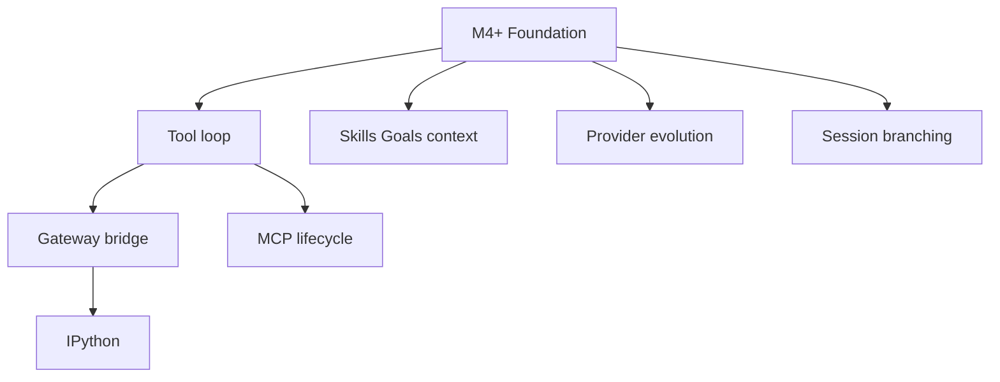

# Implementation Roadmap

## Scope

This is a dependency-aware delivery roadmap, not a time estimate. The first implementation milestone is the reproducible
quality foundation. Every later milestone begins with failing tests and is accepted only after its applicable `make
verify` evidence passes. This roadmap owns milestone order, dependencies, activation, and status only: required quality
commands, pinned tools, the coverage policy ([ADR 0051](../decisions/0051-per-crate-coverage-tiers.md)), lint policy,
feature profiles, architecture checks, and supply-chain gates live in [Quality Gates and
Makefile](12-quality-gates-and-makefile.md); test-first and outcome-verification rules live in [Test-Driven Delivery and
Verification](10-test-driven-delivery-and-verification.md).

The immutable M0/M1 phase-closure baseline and verification matrix are recorded in [M0/M1 Closure
Evidence](../closeout/m0-m1-closure-evidence.md). M2 closeout evidence is tracked separately in [M2 Closure
Evidence](../closeout/m2-closure-evidence.md); its full `make verify` result passed on the recorded M2 worktree, while
its immutable commit baseline remains pending.

## Dependency graph

```mermaid
flowchart TD
  Q[M0 Quality foundation] --> A[M1 Types config workspace]
  A --> P[M1+ Quality hardening]
  P --> B[M2 Protocol client daemon]
  P --> C[M3 Storage sessions events]
  P --> D[M4 Model and one run]
  P --> E[M5 Tools workspace hooks]
  E --> K[M5+ Post-M5 alignment]
  K --> F[M6 Tauri bridge UI]
  K --> G[M7 Plan Build artifacts]
  K --> H[M8 VFR Headroom]
  K --> M[M11 Tool loop and bridge]
  M --> N[M12 Capabilities and context]
  K --> I[M9 End to end hardening]
  P --> F[M6 Tauri bridge UI]
  P --> G[M7 Plan Build artifacts]
  P --> H[M8 VFR Headroom]
  P --> I[M9 End to end hardening]
  B --> D
  C --> D
  A --> E
  D --> F
  E --> G
  C --> G
  D --> G
  E --> H
  C --> H
  D --> H
  F --> I
  G --> I
  H --> I
  N --> I
```

## Quality rule for every milestone

Every milestone after Milestone 0 follows the test-first rules of [Test-Driven Delivery and
Verification](10-test-driven-delivery-and-verification.md) and the quality policy of [Quality Gates and
Makefile](12-quality-gates-and-makefile.md): new production crates meet the tier floor declared for them before merge
([ADR 0051](../decisions/0051-per-crate-coverage-tiers.md)), new optional Cargo features are classified in the
feature-profile policy in the same change, only pinned dependencies and tools are used, `make quick` runs during
development and `make verify` before acceptance, and any policy exception is recorded in a reviewed, versioned policy
file with rationale and equivalent test evidence.

The tier numbers in the closed M0-M5 milestone records below are historical acceptance evidence, not current policy:
[ADR 0049](../decisions/0049-base-coverage-threshold.md) replaced them with a single base threshold, and [ADR
0051](../decisions/0051-per-crate-coverage-tiers.md) replaced that with the per-crate tiers declared in
`quality/coverage.toml`.

## Milestone 0: Reproducible quality foundation

Closed. Delivered the pinned Rust toolchain and external-tool manifest (nextest, llvm-cov, deny, audit, udeps, machete,
outdated), the root Makefile with explicit mutating versus non-mutating targets and `make ci` as the only CI
verification command (initially aliasing the full `make verify` gate), strict workspace lints with a documented
local-exception mechanism, the versioned coverage-tier policy and checker, the non-production `quality-harness`
workspace member, the machine-readable required-v1-crate-set, responsibility, test-target, and feature-profile policies,
the initial architecture-test harness, and supply-chain policy files. The quality pipeline never installs tools, updates
lockfiles, or repairs source implicitly, and no production crate can merge without a declared tier, test target, and
architecture ownership entry. Evidence: [M0/M1 Closure Evidence](../closeout/m0-m1-closure-evidence.md).

## Milestone 1: Contracts, configuration, and workspace skeleton

Closed. Delivered the workspace manifests and crate skeletons following [Workspace and Crate
Map](01-workspace-and-crate-map.md), with `intention-types`, `intention-domain`, `intention-protocol`, and
`intention-config` as the only active Tier A production crates and every later crate an implementation-free skeleton
until its owning milestone. The TOML schema is version 1 (the single current shape; unversioned documents fail closed;
future schemas are rejected with an `ErrorDto`), configuration discovers a platform-standard location with a validated
explicit absolute-path override and never falls back to process CWD, and the credential-free `ConfigSnapshotDto`
foundation fixes `ConfigRevisionId` and capture time. Configuration revision persistence, daemon application/reload, and
attaching a snapshot to a live run remain owned by M3/M4. M1 accepts only the `openrouter` and
`generic-chat-completion-api` provider kinds; `openai` remains unavailable until a separately declared OpenAI Responses
driver crate, contract, and boundary policy exist. Evidence: [M0/M1 Closure
Evidence](../closeout/m0-m1-closure-evidence.md).

## Milestone 1+: Quality policy hardening

Closed quality-enforcement milestone between the M1 contract foundation and M2 functional delivery; it activated no
additional production crate. Added workspace-wide dependency-graph construction with deterministic cycle-path rejection
in `make architecture`, machine-readable Cargo `test_targets` enforcement for every planned crate, source-level provider
SDK namespace ownership for `async_openai::` and `openrouter_rs::`, the exact-file coverage-exclusion policy with
owner/report-path/denominator enforcement, and isolated expected-failure fixtures for every new rule. Evidence: [M1+
Quality Hardening Evidence](../closeout/m1-plus-quality-hardening-evidence.md).

## Milestone 2: Local protocol, client, and daemon bootstrap

Closed. Delivered `intention-transport`, `intention-client`, `intention-daemon`, composition wiring, and the
`intention-tui` proof adapter over cross-platform local IPC (Unix domain sockets and Windows named pipes) with per-user
endpoint locations, the Unix `0700` endpoint-parent and `0600` listener-socket policy, a cross-platform `fs4` advisory
startup lock, version-validated `Ready` health, and snapshot-tail/resync subscription wiring with optional run scope.
The M2 wire was replaced by JSON-RPC 2.0 over NDJSON with exact protocol version 2.0 and the `MAX_MESSAGE_BYTES`
liveness cap ([ADR 0045](../decisions/0045-local-json-rpc-2-0-transport.md)), which is the current protocol; the socket,
permissions, and bounded serving remain. Idle shutdown, explicit daemon stop, upgrade coordination, durable
sessions/events/snapshots, and model/provider execution were deferred (M3 owns durable storage/recovery; M4 owns
model/provider runs); detailed transport and adapter constraints live in [Daemon, Transport, and
Adapters](03-daemon-transport-and-adapters.md). Evidence: [M2 Closure Evidence](../closeout/m2-closure-evidence.md).

## Milestone 3: SQLite sessions, events, snapshots, and queue

Closed. Delivered repository DTO contracts and the bundled-SQLite implementation creating the single current storage
schema directly on open (no migration chain or version gate; [ADR
0038](../decisions/0038-no-backward-compatibility-and-legacy-removal.md)), activated `intention-application`,
`intention-runtime`, `intention-storage`, and `intention-storage-sqlite`, and established session/project/workspace-root
state with stable `WorkspaceId` association. Canonical credential-free `ConfigSnapshotDto` revision persistence is
idempotent for a same-ID equal snapshot and fails with a typed conflict for a same-ID different snapshot; accepted and
promoted runs keep immutable snapshot/revision attachment. Append-only events, current projections, and per-commit
session/run snapshots are atomic; the one-active-run invariant, durable queued input with never-reused queue tickets,
atomic terminal promotion, the `Starting -> Cancelling -> Cancelled` lifecycle, and recovery-before-ready without
automatic external-work resumption are in place. M3 applies TOML once per daemon startup (no live reload) and serves
durable one-shot snapshot replay or typed resync only; a `run_id: Some` request always returns typed
`HistoryUnavailable` resync rather than unfiltered session state. Persistent live run streaming, post-commit fan-out,
slow-peer policy, and safely represented run-scoped replay arrive with M4 through separate contracts. Evidence: [M3
Closure Evidence](../closeout/m3-closure-evidence.md).

## Milestone 4: Model contract, providers, and one streaming run, complete

Closed at immutable implementation baseline `d2a85370a66d63fc759e4987a74d435ecd5d5115`. Delivered provider-neutral model
DTOs and stream ordering, safe per-run execution policy in snapshots, opaque startup-only provider material, private
SDK-backed request/mapping boundaries, the OpenRouter SDK driver (`openrouter-rs` 0.16.0), the Generic Chat Completions
driver (`async-openai` 0.42.0), provider capability validation with usage/events and timeout/retry policy, and one
streaming user turn ending in a durable run state. The generic subset is text, usage, finish, and function-style tool
calls; reasoning, multimodal, and vendor extensions reject preflight, and no custom HTTP/SSE parsing exists. Evidence:
[M4 Closure Evidence](../closeout/m4-closure-evidence.md).

## Milestone 5: Typed tools, WorkspaceRoot, and hooks

Closed at the immutable merged baseline `bf40567` (PR #14). Delivered the typed core tool registry with six active tools
(`read`, `write`, `edit`, `execute`, `glob`, `grep`); `WorkspaceRoot` as an addressing anchor with root-relative joins,
`execute` CWD, and default search scope ([ADR 0047](../decisions/0047-workspace-root-addressing-anchor.md)); the typed
hook dispatcher with deterministic ordering and short-circuiting; tool lifecycle persistence and events; and the
daemon-owned invocation path consumed by the model-tool loop ([ADR
0019](../decisions/0019-production-model-tool-loop.md)). Composition owns registry/workspace/hook assembly, application
owns durable lifecycle and result persistence/publication, restart replay never re-executes tools, and the other fixed
registry slots remain reserved. Evidence: [M5 Closure Evidence](../closeout/m5-closure-evidence.md).

## Milestone 5+: Post-M5 retrospective alignment

**Activation home for the complete post-M5 stack; hard prerequisite for M6-M9.** It does not renumber, replace, or claim
delivery of Milestones 6-9; it is their declared prerequisite in the dependency graph and activates only preparatory
foundation work, never direct M6-M9 boundary implementation. The remaining post-M4 package implementations are not part
of its slices: they are delivered by Milestones 11 and 12, which consume this milestone's foundation.
The activation decision is [ADR 0035](../decisions/0035-m5plus-complete-foundation-activation.md), extended by [ADR
0043](../decisions/0043-instruction-sources-and-system-context.md) for the fifth slice.

### Slices

The five slices are approved together as one package and delivered in this order; no slice ships half-ready, and later
slices consume only contracts activated by earlier slices. Every direction of ADR 0020-0034 stays bound to its slice,
and every retrospective change to M0-M5 code required by those directions activates inside its slice with its own
contract, transaction, and outcome test. Each direction's activating specification is accepted at the start of the
milestone that implements it.

1.  **Contracts and versions — activated.** The typed serde JSON contract and version foundation: the JSON-RPC 2.0 local
protocol with exact protocol version 2.0, its method/notification table, and the removed capability plane ([ADR
0045](../decisions/0045-local-json-rpc-2-0-transport.md)); explicit DTO schema versions with exact-equality comparison;
SQLite as one live storage schema created directly on open ([ADR
0038](../decisions/0038-no-backward-compatibility-and-legacy-removal.md)); and crate ownership, feature-profile, and
coverage declarations under [ADR 0051](../decisions/0051-per-crate-coverage-tiers.md) for every activated family. The
former contract ledger, `run-execution-meaning-v4` field tables, capability families, `typed-tlv-v1`/SHA-256 tags, and
digests were deleted by [ADR 0046](../decisions/0046-typed-serde-json-contracts.md): no ledger, tag registry, canonical
digest, or identity record remains, and every future contract family is typed serde JSON with RFC 8785 canonicalization
only when a first real consumer appears.
2.  **Control plane — reverted.** The ADR 0020 cluster and provider session selection (architectures 25/29/22):
controlled live reload, credential rotation, provider health checks, model discovery, pricing policy, provider profile
UI and raw-TOML/configuration editing, arbitrary authentication headers, session defaults and per-turn/fork overrides,
the provider profiles protocol, pending-removal and degraded recovery, and the provider reasoning/catalog surface. The
Slice 2 activation was reverted and re-introduction requires a new activating specification; its code, DTOs, test
targets, goldens, and control-plane tables are removed. The unconsumed-surface audit (2026-09) removed the unconsumed
typed preservation-control, server-side-parser, Responses reasoning-mode, reasoning-usage, and model-capability-envelope
contracts, the protocol-only reasoning/header/parser duplicates, the eight producer-less control-plane event DTOs, and
the `provider_profile_tombstoned` wire code; that removal is not reverted.
3.  **Goal domain — not activated.** The Goal domain (architecture 28, ADR 0023/0033). The slice also activates the
tool-descriptor, tool-registry, and model-tool-loop contracts ([ADR
0025](../decisions/0025-base-tool-contracts-and-tool-loop-bounds.md) as amended by [ADR
0048](../decisions/0048-limits-by-precedent-and-no-content-scanning.md), architecture 15), the bridge-invocation and
MCP-method-catalog selections ([ADR 0027](../decisions/0027-child-kernel-bridge-mcp-detail-directions.md),
architectures 19/18), and the accepted directions of [ADR
0033](../decisions/0033-accepted-m5plus-execution-directions.md) (work/requeue after client disconnection).
4.  **UI foundation — not activated.** Session branching, activity/notification delivery, reasoning/catalog delivery,
and adapter boundaries (architectures 23/24/22, ADR 0026/0028/0029/0032/0033/0034): `session_fork_v1`; activity journal
and notification projections; normalized reasoning delivery; RLM packaging and export; and the exact typed
client/protocol surface M6 consumes. It also carries export of fork/activity records and cross-workspace
clone/rebind (architecture 23), activity numeric-limit classification (architecture 24), and the physical deletion/GC
retention policy for historical work under architecture 04's retention rules.
5.  **Instruction sources and system context — fifth and last slice; not activated.** The instruction channel of
[architecture 30](30-instruction-sources-and-system-context.md), adopted by [ADR
0043](../decisions/0043-instruction-sources-and-system-context.md): the closed instruction source kinds and scopes, the
deployment instruction profile adapted from the legacy Antibusy static prompt set, user-editable fragments at user,
project, and session scope, workspace `AGENTS.md` project instructions read through the `WorkspaceRoot` anchor, and the
reserved `Mode` and `Vfr` contributions owned by architectures 07 and 06; immutable profile revisions with typed
identity; deterministic assembly and the effective instruction projection, frozen at admission, delivered through the
existing `system_context` channel, materialized into fork, plan, and handoff records, and recorded as safe usage
provenance; closed safe failures, channel closure, and safe observability. Its activating specification declares the
instruction contract families as typed serde JSON contracts and changes no earlier slice.

### Slice evidence

Each slice declares its contracts, versions, fixtures, and outcome evidence per [architecture
12](12-quality-gates-and-makefile.md).

-  Slice 1: JSON-RPC 2.0 conformance fixtures (envelope shape, 1:1 method coverage of the command and query variants,
notifications, and error codes), exact protocol-version equality with a typed `-32001` mismatch error, typed serde JSON
DTO round trips, and current-schema creation fixtures.
-  Slice 2: reverted; its test targets and goldens no longer exist, and a re-introduction must restore its non-authority
fixtures.
-  Slices 3-5: each activating specification declares its fixtures and outcome evidence; slice 5 additionally proves
deterministic assembly, ordering, and separator stability, profile-revision immutability for every edit operation with
typed validation failures, absence/unreadability/non-text/oversize behavior of `AGENTS.md`, projection freeze with reuse
across steps and verbatim fork and handoff inheritance, channel closure against Skill, memory, tool, repository, and
provider material, credential-free surfaces, and preview non-admission.
-  Shared across slices: M3/M4 byte, meaning, replay, and recovery preservation plus fake-secret regression across logs,
errors, snapshots, events, and adapter DTOs.

### Exit criteria

-  M5+ exit proves M6, M7, M8, and M9 can each begin against stable contracts without any retroactive protocol, DTO,
schema, crate-boundary, migration, or quality-policy change.
-  M3/M4 startup-only configuration, recorded revisions, persisted run snapshots, sessions, runs, events,
and bytes remain authoritative and unchanged; SQLite storage is the single live schema created directly on open.
-  The reverted Slice 2 health, discovery, and pricing surfaces were non-authorizing: they create no RunId, tool
permission, MCP capability, bridge grant, kernel epoch, context projection, or branch; a re-introduction must restore
their non-authority fixtures.
-  Applicable crates meet their declared tier floors without excluding policy or boundary logic; every activated slice
passes `make quick`, `make verify`, and Linux/Windows CI.
-  No slice ships half-ready: every activated contract ships with its version, owner, tests, policy mapping,
storage/schema treatment, and evidence together.
-  No M6-M9 boundary behavior is implemented, and no second runtime, registry, persistence authority, or sandbox is
introduced.
-  The fifth slice proves instruction text is advisory-only, typed, and materialized for frozen context, with no
untrusted material entering the instruction channel and no authority created (ADR 0043).
-  Milestones 11 and 12 are this milestone's successors for the remaining post-M4 packages; their activating
specifications, contracts, and evidence stay owned by those milestones. M7 and M8 consume only the declared `Mode` and
`Vfr` contributions while M12 keeps the Skill and context-disclosure boundary.

### Retrospective completions outside the slice sequence

-  The ordinary request-side tool advertisement ([ADR 0039](../decisions/0039-request-side-tool-advertisement.md)) is
complete: request construction advertises the six active registered tools in registry order as validated typed
definitions, forces the `tool_calls` capability, and both current adapters translate them without `tool_choice`;
hermetic evidence is anchored at EVD-062. This retrospective completion does not advance slices 3-5.
-  The ordinary same-run provider reasoning round-trip ([ADR 0041](../decisions/0041-same-run-reasoning-round-trip.md))
is complete: the generic Chat Completions adapter consumes typed `reasoning_content` deltas as normalized `Primary`
reasoning events and serializes the current round's accepted reasoning on the same-run assistant tool-call continuation
as transient request state with no durable representation; the OpenRouter adapter ignores the attachment by design.
Hermetic evidence is anchored at EVD-064, and the recorded live run remains the controller's manual live-evidence
obligation. This retrospective completion does not advance slices 3-5.
-  The opt-in live-provider e2e channel ([ADR 0040](../decisions/0040-opt-in-live-provider-e2e.md)) is additive and
manual-only: the ignored `crates/intention-daemon/tests/real_api_e2e.rs` target and the `make e2e-real-api` entry point
execute a real provider tool loop only under explicit opt-in, never in `make quick`, `make verify`, or CI. A recorded
live run (date, commit, provider kind, model, and its run identifier; never the key) is the manual live-evidence
obligation, and the channel does not alter any protocol, DTO, wire, storage, or blocking gate; the same recorded run
also covers the same-run reasoning round-trip (ADR 0041).

## Reserved declarations carried by M6-M9

The unconsumed-surface audit (2026-09) keeps exactly one audited surface for this block and records the deleted groups
so no M6-M9 slice claims them:

-  **Durable session-event delivery (`SessionProviderProfileChanged`) — claimed by Milestone 6.** The control-plane
event family was activated for Slice 2 only as a boundary-validated session-event publication with no durable copy; the
Slice 2 activation was reverted and re-introduction requires a new activating specification, so no session-default
change exists to produce it. The durable append/delivery layer remains reserved to the first M6-M9 milestone that
consumes session state and reconnect delivery. Anchors: `m4plus_concept.md` (session selection, runs, queues, and
usage), [architecture 29](29-provider-session-and-profiles-protocol.md) (session selection, runs, queues, and usage).
Until Milestone 6 lands the layer, and until a new activating specification re-introduces a session-default change, no
control-plane event is produced or validated.
-  **Deleted groups — no M6-M9 slice claims them.** The protocol reasoning/header/parser duplicates, the eight
producer-less control-plane event DTOs, the six unconsumed model types, and the `provider_profile_tombstoned` wire code
were deleted by the unconsumed-surface audit (2026-09); the Slice 2 revert also removed the `configuration_audit` table
with the rest of the control-plane schema, so no durable catalog audit evidence exists until a new activating
specification re-introduces it.

## Milestone 6: Tauri bridge and primary desktop UI

Goal: the first desktop adapters over the shared typed client, consuming the Milestone 5+ UI-foundation and
instruction-source slices.

### Deliver

- `intention-tauri` bootstrap/native bridge using only `intention-client`;
-  minimal Svelte UI to create/open a session, send a turn, render streamed state, reconnect, and render safe
activity/notification/acknowledgement projections;
- TUI/REPL remains a contract-equivalent client;
-  instruction-fragment editing and effective-projection preview in the primary UI over the fifth Milestone 5+ slice's
control-plane surface ([ADR 0043](../decisions/0043-instruction-sources-and-system-context.md));
-  post-M4 activity/UI contracts are delivered by the Milestone 5+ UI-foundation slice ([ADR
0029](../decisions/0029-activity-and-notification-detail-directions.md)/[ADR
0032](../decisions/0032-accepted-deferred-directions-activity-metadata-content-inspection-per-call-cancellation.md)) and
consumed here, while the durable `SessionProviderProfileChanged` delivery stays reserved to M6.

### Tests first

- bridge contract tests using a fixture daemon;
- TUI/bridge equivalent command/event tests;
- desktop lifecycle smoke test where the environment supports it;
- adapter mapping coverage and fixture-daemon outcome scenarios.

### Exit criteria

- Tauri and TUI can observe the same daemon-owned session; closing Tauri does not stop daemon-owned work;
- no Tauri crate imports application/runtime/storage implementation APIs;
-  the primary UI can list, create, edit, reorder, enable, disable, and re-scope instruction fragments and preview the
effective projection over the typed control-plane surface, with TUI/REPL equivalence;
- adapters satisfy mapping-contract and smoke/outcome requirements rather than a misleading aggregate UI line target.

## Milestone 7: Plan/Build policies, physical plans, and Build Autopilot

Goal: Plan/Build run policy and physical plan artifacts over the daemon-owned model-tool loop, which this milestone
consumes and never redefines.

### Deliver

- Plan/Build run policy; Build Autopilot as the single user-authorized unrestricted Build policy;
-  plan allocation, AppData structure, zero-based numbers, YAML frontmatter and revisions; model-safe body projection;
the plan submission/approval/rejection state flow;
- Plan-mode normal filesystem mutation restrictions;
-  Plan `execute` availability with advisory focus instruction and trusted-local audit; the focus instruction is the
`Mode` contribution of [architecture 30](30-instruction-sources-and-system-context.md) ([ADR
0043](../decisions/0043-instruction-sources-and-system-context.md));
-  automatic same-Session fresh Build start after approval, and the optional full-context implementation handoff to a
new Session.

### Tests first

- plan allocation and revision tests;
- frontmatter hidden/model-capture test;
- Plan write/edit deny/allow tests;
- lifecycle transition and durable approval tests;
- Plan `execute` focus/audit tests;
- same-Session approval-to-fresh-Build tests with a new `RunId` and pinned plan revision;
- optional handoff snapshot, lineage, redaction, and no-live-state-transfer tests;
-  coverage fixtures for plan policy and artifact integrity under the per-crate tier floors ([ADR
0051](../decisions/0051-per-crate-coverage-tiers.md)).

### Exit criteria

-  a Plan-mode agent can iteratively edit its physical plan body, but cannot use ordinary write/edit tools to modify a
project file;
- Plan `execute` remains available and is not represented as a sandbox; model context excludes plan frontmatter;
-  approving a plan starts Build Autopilot in the same Session with a new `RunId`; the optional handoff creates an
independent Session from a safe frozen context;
-  plan policy/artifact crates meet their declared tier floors ([ADR
0051](../decisions/0051-per-crate-coverage-tiers.md)) with mandatory captured-context and denial scenarios.

## Milestone 8: VFR and Headroom extensions

Goal: independently enabled hook extensions over the base tool pipeline.

### Deliver

-  VFR hook, mapping, expansion/raw tools, and model instructions as the `Vfr` contribution of [architecture
30](30-instruction-sources-and-system-context.md) ([ADR
0043](../decisions/0043-instruction-sources-and-system-context.md));
- Headroom hook, CCR retention contract, and retrieve tool;
- deterministic composition with the workspace/tool pipeline;
- adapter/model representation policy.

### Tests first

- VFR transform/expand/raw fixtures;
- Headroom retention/retrieval/expiry fixtures;
- full hook-order integration test;
- UI/model representation distinction test;
-  coverage fixtures for transform, expiry, retrieval, and error paths under the per-crate tier floors ([ADR
0051](../decisions/0051-per-crate-coverage-tiers.md)).

### Exit criteria

-  VFR and Headroom operate as independently enabled hook extensions; `retrieve` returns retained content while valid,
with typed expiry behavior afterward;
- base tools do not import VFR or Headroom implementation crates;
-  extension crates meet their declared tier floors ([ADR 0051](../decisions/0051-per-crate-coverage-tiers.md)) and
feature-profile checks.

## Milestone 9: Hardening and acceptance verification

**Final hardening gate for every milestone in this roadmap, including Milestones 11 and 12.** It closes the v1 outcome
scenarios, the open policy decisions, and the documentation reconciliation for every delivered milestone.

### Deliver

-  final architecture checks; observability, health, and safe structured diagnostics; config revision behavior and
redaction hardening; the restart/reconnect/cancellation smoke suite;
-  documentation reconciliation against implemented public contracts, including ownership of the architecture index and
its owner paragraphs (`architecture/README.md`);
-  closure of the parked contract-enforcement card: decode-time version and validation enforcement for the public DTOs
that declare invariants beyond their field types (architecture 02);
-  closure of the open implementation decisions of architecture 03: idle shutdown, explicit stop, daemon-upgrade
coordination, and stale-listener recovery;
-  closure of the open policy decisions of architecture 09: event/log retention and diagnostic-export policy, TOML
include/import policy, and non-Unix configuration permissions;
- the post-M4 evidence obligations of architecture 10 for the remaining post-M4 packages; and
-  the removal-program evidence anchor of [ADR 0038](../decisions/0038-no-backward-compatibility-and-legacy-removal.md)
for the single-version policy across every versioned system (EVD-066).

### Tests first

-  the full result-oriented scenario suite from [Test-Driven Delivery and
Verification](10-test-driven-delivery-and-verification.md);
- the real-binary daemon-host model-tool-loop outcome test; the broader M9 scenario suite remains;
-  a recorded opt-in live-provider e2e run against a real provider API ([ADR
0040](../decisions/0040-opt-in-live-provider-e2e.md); manual, non-hermetic, never blocking) reporting date, commit,
provider, model, and run URL;
- secret injection regression suite;
- daemon restart and reconnect endurance fixtures;
- architecture dependency/API boundary checks across all crates;
- a complete `make verify` reproducibility check from a clean, pinned-tool environment.

### Exit criteria

-  all v1 outcome scenarios are automated where practical and recorded where manual environment testing remains
necessary;
- no unapproved architectural, lint, coverage, feature, or dependency exception remains implicit;
-  every public DTO and crate boundary agrees with the architecture documentation or the documentation is updated in the
same change;
-  every milestone, M0-M9 and Milestones 11-12, records its acceptance evidence, and the `make ci` run covers them;
- `make ci` passes from a clean environment using only pinned inputs.

## Milestone 11: Tool registry, model-tool loop, and Gateway/RLM bridge

**Depends on Milestone 5+ as foundation.** It delivers the post-M4 tool-registry and Gateway/RLM bridge packages
(architectures 15/19) under decisions 0004, 0007, 0011, and 0025, the bridge detail of [decision
0027](../decisions/0027-child-kernel-bridge-mcp-detail-directions.md), and the worker/process supervision topology
direction of [ADR 0034](../decisions/0034-accepted-m5plus-retained-deferral-directions.md). It starts only when an
activating specification per [architecture 12](12-quality-gates-and-makefile.md) is accepted.

### Deliver

-  the fixed fourteen-slot registry, typed descriptor and registry revisions, frozen tool selection, and
`WorkspaceRoot` semantics (architecture 15, decision 0007);
-  the model-tool loop: sequential steps, one ordered group per tool-calling step, durable `ToolCall`/`ToolResult`
evidence, no-retry and no-resume recovery, and `RunToolHistoryPageDto` replay delivery (architectures 15, [ADR
0025](../decisions/0025-base-tool-contracts-and-tool-loop-bounds.md) as amended by [ADR
0048](../decisions/0048-limits-by-precedent-and-no-content-scanning.md));
-  bridge attachment and typed handshake, the ephemeral daemon-issued grant, immutable bridge-contract selection,
durable operation correlation, the one-path ingress into registry admission and tool-loop facts (including `sub_agent`
ingress), safe replay, cancellation propagation, recovery, and the closed `bridge_*` failures (architecture 19,
decisions 0011/0027);
-  worker/process supervision topology, never a second runtime, registry, persistence authority, or sandbox ([ADR
0034](../decisions/0034-accepted-m5plus-retained-deferral-directions.md), architecture 03);
-  crate ownership, feature-profile, and coverage declarations under [ADR
0051](../decisions/0051-per-crate-coverage-tiers.md), plus quality-policy declarations for every activated family.

### Tests first

- registry slot, descriptor-revision, and registry-revision fixtures;
- loop step/group fixtures plus the ordered-group shape matrix and effect-evidence fault injection;
- bridge grant, operation correlation, replay, cancellation, slow-peer, and no-bypass fixtures;
- supervision-topology fixtures;
- M3/M4 tool denial, ordinary workspace addressing, and retained RLM preservation fixtures.

### Acceptance outcomes

-  every tool call travels the frozen descriptor path and produces durable evidence exactly once, with no retry of an
interrupted call;
-  bridge ingress cannot bypass registry admission, `ToolCallId`, start/result evidence, or post-commit reread
publication;
- no ordinary M3/M4/M5 tool path, denial, or replay changes meaning.

### Exit criteria

-  the activating specification's contracts, tests, coverage, and evidence are recorded and pass `make quick`, `make
verify`, and Linux/Windows CI;
-  no two capability paths or registries exist, and supervision is topology only, never a second runtime or sandbox;
- M3/M4 bytes and retained RLM history remain unchanged;
- the milestone's activation evidence is recorded (EVD-068).

## Milestone 12: Capabilities and context — MCP, kernel, and Skills/context

**Depends on Milestone 11.** It delivers the post-M4 MCP, kernel, and context packages (architectures 18/20/21) under
decisions 0010, 0012, and 0013, the project script library of [decision
0042](../decisions/0042-project-script-library-for-kernel-cells.md), the MCP and kernel detail of decision 0027, the
rich MIME/raw kernel output projection direction of [ADR
0034](../decisions/0034-accepted-m5plus-retained-deferral-directions.md), and the architecture 22 provider work that
remains not activated after the Slice 2 revert: the `responses` driver, `SafeHeader` live wire injection, and the
user-kind parser. It starts only when an activating specification per [architecture
12](12-quality-gates-and-makefile.md) is accepted; that activating change also declares the kernel contract families as
typed serde JSON contracts ([ADR 0046](../decisions/0046-typed-serde-json-contracts.md)).

### Deliver

-  typed MCP source, discovery, capability, selection, and invocation semantics under the fixed `mcp` ToolId, run-local
capability acquisition, schema normalization, private resources, idempotency, safe projection, disposal, and no-resume
recovery (architecture 18, decisions 0010/0027);
-  run-scoped private kernel epochs, foreground cells, safe output, verified checkpoints, background-task restrictions,
cancellation, recovery, and no-resume semantics (architecture 20, decisions 0012/0027);
-  the project script library (`.ir/scripts`): agent-authored modules persisted as ordinary project files through the
frozen tool descriptors, an exact import surface, bounded script-import evidence published as run facts, and no
executable payload in checkpoint payload or metadata (decision 0042);
-  rich MIME/raw kernel output projection, bounded and credential-free, never substituting for the closed text-only safe
projection ([ADR 0034](../decisions/0034-accepted-m5plus-retained-deferral-directions.md));
-  scoped Goal acceptance and evidence, immutable untrusted Skill selection and progressive disclosure, admission-source
context manifests, model-step safe projections, typed memory, and immutable compaction over exact completed history
(architecture 21, decision 0013), with the Goal domain itself owned by architecture 28;
-  the canonical `responses` provider driver, `SafeHeader` live wire injection, and the user-kind parser (architecture
22);
-  crate ownership, feature-profile, and coverage declarations under [ADR
0051](../decisions/0051-per-crate-coverage-tiers.md), plus quality-policy declarations for every activated family.

### Tests first

- MCP discovery, selection, invocation, disposal, and safe-projection fixtures;
- kernel epoch, cell, checkpoint, restore, cancellation, and recovery fixtures;
-  `.ir/scripts` import-surface fixtures (missing library, unaddressable library path, and kernel-side scope cases),
reuse by reading the file in a fresh epoch, and bounded script-import evidence without source text or absolute paths;
- kernel output projection fixtures without raw frames, MIME payloads, binary objects, or credentials;
- Skill selection, context manifest, projection, memory, and compaction fixtures plus no-current-state reconstruction;
- provider driver, header-injection, and parser wire fixtures;
- M3/M4 and retained IPython/RLM/provider/context preservation fixtures.

### Acceptance outcomes

-  no MCP capability, kernel epoch, script module, or context family gains authority beyond its own contract;
-  the kernel imports exactly the referenced library directory, a fresh run reuses a module only by reading the file,
and checkpoint payload and metadata carry no script source;
-  an unrepresentable import-evidence list fails before publication with `kernel_script_library_unavailable` and is
never truncated or stringified;
- no M3/M4 or retained IPython/RLM/provider/context history changes meaning.

### Exit criteria

-  the activating specification's contracts, tests, coverage, and evidence are recorded and pass `make quick`, `make
verify`, and Linux/Windows CI, and the kernel families' typed serde JSON contracts are declared in the same change;
-  no second runtime, registry, persistence authority, or sandbox is introduced, and no module, capability, or context
record gains authority;
- the milestone's activation evidence is recorded (EVD-069).

## Exit criteria for the roadmap

The v1 implementation phase is ready to claim architectural completion only when:

- every milestone acceptance outcome has evidence (M0-M9 and Milestones 11-12);
- Tauri and TUI/REPL use the same typed client/protocol in real integration tests;
- all critical architecture rules have automated protection or documented, approved justification;
- security redaction and workspace boundary tests pass;
- Plan, VFR, and Headroom demonstrate their required physical/runtime outcomes;
-  `make verify` passes all strict formatting, lint, feature, test, documentation, architecture, coverage, and
supply-chain checks;
- no legacy Antibusy implementation detail is relied upon without an explicit new decision.

## Post-M4 package status and activation order

Post-M4 package status uses separate terms: architecture documents are `Documentation-approved`, implementation remains
not authorized, and evidence is `Planned` unless an exact artifact and observed result is cited. The immutable
`m4plus_concept.md` is research provenance and is not used as an implementation acceptance target; apart from the Slice
2 revert annotation, its research content is not edited. The ordinary M5-M9 delivery sequence remains the historical
delivery record, and its Plan/Build policy wording is superseded by [ADR
0017](../decisions/0017-build-autopilot-and-plan-focus-continuity.md)/[ADR
0018](../decisions/0018-plan-build-autopilot-activation-scope.md) for the accepted Autopilot transition: Plan is a focus
mode with available advisory-guided `execute`, Build Autopilot is unrestricted by per-action confirmation, and plan
approval starts a fresh Build run in the same Session by default. The boundary record's exit conditions include one
owner per Foundation rule, no unresolved Foundation conflict, closed M4 and ordinary historical behavior preserved, and
a later implementation specification required before code begins.

The remaining post-M4 packages are delivered by Milestones 11 and 12: Milestone 11 the tool-registry and bridge
packages (architectures 15/19), and Milestone 12 the MCP, kernel, and context packages (architectures 18/20/21) plus
the remaining architecture 22 provider work. Each milestone requires an accepted activating specification and atomic
updates to crate ownership, DTO/wire/storage versions, quality policy, feature profiles, and evidence. This roadmap
owns sequencing and milestone acceptance only.

Current ordering status: the durable ordering authorities were collapsed to two — the session event sequence
(`SessionEventSequenceDto`) for every record committed in one session, and the container journal sequence (storage
mechanism `container_journals`; the only container kind today is `run`, whose position type is `RunEventCursorDto`) —
plus one observation position, the reserved observation cursor, which is a reader's resume position and never an
authority. The collapsed set is closed: no record family introduces a further ordering sequence, and owner-local
operational tuples are operational metadata, not ordering authorities.

| Package | Owner document | Status | Depends on |
| --- | --- | --- | --- |
| Post-M4 authority reconciliation and foundation boundary | [ADR 0005](../decisions/0005-m4plus-authority-reconciliation-and-delivery-boundaries.md) | Boundary record; the reconciliation registers it named are retired; no implementation authorized. | closed M4 baseline |
| Execution meaning and historical compatibility | [architecture 14](14-run-execution-meaning-and-historical-compatibility.md) | Superseded historical record; no implementation authorized. | Foundation |
| Tool registry and model-tool loop | [architecture 15](15-tool-registry-and-model-tool-loop.md) | Documentation-approved; not activated; Milestone 11, with the reserved tool-descriptor/tool-registry/model-tool-loop contracts activated by slice 3. | Foundation |
| MCP capability lifecycle | [architecture 18](18-mcp-capability-lifecycle.md) | Documentation-approved; not activated; Milestone 12. | fixed tool registry/tool loop |
| Gateway/RLM bridge | [architecture 19](19-gateway-rlm-bridge.md) | Documentation-approved; not activated; Milestone 11, with the bridge-invocation contracts activated by slice 3. | fixed tool registry/tool loop; MCP lifecycle |
| Run-scoped IPython kernel lifecycle | [architecture 20](20-ipython-kernel-lifecycle.md) | Documentation-approved; not activated; Milestone 12. | fixed tool loop; MCP lifecycle; Gateway/RLM bridge |
| Goals, Skills, context, memory, and compaction | [architecture 21](21-goals-skills-context-memory-and-compaction.md) | Documentation-approved; not activated; Milestone 12. | Foundation |
| Provider evolution, profiles, and reasoning | [architecture 22](22-provider-evolution-profiles-and-reasoning.md) | Documentation-approved; not activated; the remaining provider work (`responses` driver, `SafeHeader` live wire injection, user-kind parser) is delivered by Milestone 12. | Foundation |
| Non-destructive session branching and regeneration | [architecture 23](23-non-destructive-session-branching-and-regeneration.md) | Documentation-approved; not activated; activating slice 4 (`session_fork_v1`). | ordinary Session/storage compatibility; context; provider evolution |
| Activity, UI, and adapters | [architecture 24](24-activity-ui-and-adapters.md) | Documentation-approved; not activated; activating slice 4; extends M6 planning. | transport; MCP; bridge; kernel; context; provider evolution; session branching |
| Goal domain and verification | [architecture 28](28-goal-domain-and-verification.md) | Documentation-approved; not activated; activating slice 3. | fixed tool loop; MCP; context; provider evolution; activity/UI |
| Provider session selection and profiles protocol | [architecture 29](29-provider-session-and-profiles-protocol.md) | The Slice 2 activation was reverted and re-introduction requires a new activating specification; not activated. | provider evolution; session branching; configuration/provider control plane |
| Base-tool contracts and tool-loop bounds | [architecture 15](15-tool-registry-and-model-tool-loop.md) | Documentation-approved; slice 3 activates the reserved contracts; tool-loop implementation is Milestone 11. | architecture 15; M5+ activation |
| Session-branching detail | [architecture 23](23-non-destructive-session-branching-and-regeneration.md) | Documentation-approved; not activated; activating slice 4. | extends architecture 23 |
| Kernel, bridge, and MCP detail | [architectures 18](18-mcp-capability-lifecycle.md)/[19](19-gateway-rlm-bridge.md)/[20](20-ipython-kernel-lifecycle.md) | Documentation-approved; slice 3 activates the bridge-invocation and MCP-method-catalog contracts; bridge implementation is Milestone 11, MCP and kernel implementation Milestone 12. | extends architectures 18/19/20 |
| Provider reasoning and catalog detail | [architecture 22](22-provider-evolution-profiles-and-reasoning.md) | Documentation-approved; not activated; the typed `ReasoningUsageDto` was removed by the unconsumed-surface audit (2026-09). | extends architecture 22 |
| Activity and notification detail | [architecture 24](24-activity-ui-and-adapters.md) | Documentation-approved; not activated; slice 4 carries activity numeric-limit classification. | extends architecture 24 |
| Accepted deferred directions | [architectures 24](24-activity-ui-and-adapters.md)/[22](22-provider-evolution-profiles-and-reasoning.md)/[19](19-gateway-rlm-bridge.md) | Documentation-approved; not activated; the directions are non-authorizing. | extends architectures 24, 22, and 19 |
| Accepted execution directions | [architectures 25](25-configuration-provider-control-plane.md)/[22](22-provider-evolution-profiles-and-reasoning.md)/[23](23-non-destructive-session-branching-and-regeneration.md)/[28](28-goal-domain-and-verification.md)/[18](18-mcp-capability-lifecycle.md)/[24](24-activity-ui-and-adapters.md)/[29](29-provider-session-and-profiles-protocol.md) | Documentation-approved; the control-plane items were reverted with Slice 2 and require a new activating specification; the work/requeue items activate in slice 3, and export plus cross-workspace clone/rebind and RLM packaging in slice 4. | extends architectures 25, 22, 23, 28, 18, 24, and 29 |
| Accepted retained-deferral directions | [architectures 20](20-ipython-kernel-lifecycle.md)/[04](04-sessions-runs-events-and-storage.md)/[03](03-daemon-transport-and-adapters.md)/[24](24-activity-ui-and-adapters.md) | Documentation-approved; rich MIME/raw kernel output projection is Milestone 12, worker/process supervision topology is Milestone 11, and the physical deletion/GC retention policy plus the activity limit classification are slice 4. | extends architectures 20, 04, 03, and 24 |
| Instruction sources and system context | [architecture 30](30-instruction-sources-and-system-context.md) | Documentation-approved; not activated; fifth and last slice ([ADR 0043](../decisions/0043-instruction-sources-and-system-context.md)). | extends architectures 30, 00, 02, 04, 06, 07, 08, 09, 14, 21, 23, and 25 |

### Activation-order notes

-  The slice order is fixed: 1 contracts and versions, 2 control plane, 3 Goal domain, 4 UI
foundation, 5 instruction sources. Later slices consume only contracts activated by earlier slices, and instruction
sources is the fifth and last slice.
-  Slice 3 additionally activates the tool-descriptor/tool-registry/model-tool-loop contracts reserved by [ADR
0025](../decisions/0025-base-tool-contracts-and-tool-loop-bounds.md) as amended by [ADR
0048](../decisions/0048-limits-by-precedent-and-no-content-scanning.md), and the bridge-invocation and
MCP-method-catalog selections reserved by [ADR 0027](../decisions/0027-child-kernel-bridge-mcp-detail-directions.md).
-  Milestones 11 and 12 consume this foundation and add no slice of its own: Milestone 11 → architectures 15/19;
Milestone 12 → 18/20/21 plus the remaining architecture 22 provider work.
-  M7 consumes the `Mode` contribution, M8 the `Vfr` contribution, and M12 keeps the Skill and context-disclosure
boundary ([ADR 0043](../decisions/0043-instruction-sources-and-system-context.md)).
-  [ADR 0034](../decisions/0034-accepted-m5plus-retained-deferral-directions.md) delivery mapping: rich MIME/raw kernel
output projection → Milestone 12; physical deletion/GC retention policy → slice 4; worker/process supervision topology →
Milestone 11; activity numeric-limit classification → slice 4.

### Post-M4 package dependency order

```mermaid
flowchart TD
  F[M4+ Foundation] --> T[Tool loop]
  F --> K[Skills Goals context]
  F --> V[Provider evolution]
  F --> B[Session branching]
  T --> G[Gateway bridge]
  T --> P[MCP lifecycle]
  G --> I[IPython]
```
