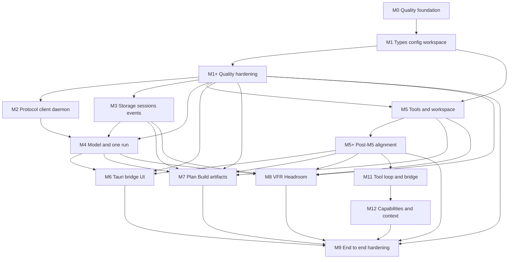

# Implementation Roadmap

## Scope

This is a dependency-aware delivery roadmap, not a time estimate. The first implementation milestone is the reproducible
quality foundation. Every later milestone begins with failing tests and is accepted only after its applicable `make
verify` evidence passes. This roadmap owns milestone order, dependencies, activation, and status only: required quality
commands, pinned tools, the coverage policy, lint policy,
architecture checks, and supply-chain gates live in [Quality Gates and
Makefile](12-quality-gates-and-makefile.md); test-first and outcome-verification rules live in [Test-Driven Delivery and
Verification](10-test-driven-delivery-and-verification.md).

The systems of documents 15 and 18-30 and of Slices 2-5 are not activated, and each activation requires an accepted
activating specification ([Quality Gates and Makefile](12-quality-gates-and-makefile.md)).

## Dependency graph

```mermaid
flowchart TD
  Q[M0 Quality foundation] --> A[M1 Types config workspace]
  A --> P[M1+ Quality hardening]
  P --> B[M2 Protocol client daemon]
  P --> C[M3 Storage sessions events]
  P --> D[M4 Model and one run]
  P --> E[M5 Tools and workspace]
  E --> K[M5+ Post-M5 alignment]
  K --> F[M6 Tauri bridge UI]
  K --> G[M7 Plan Build artifacts]
  K --> H[M8 VFR Headroom]
  K --> M[M11 Tool loop and bridge]
  M --> N[M12 Capabilities and context]
  K --> I[M9 End to end hardening]
  P --> F[M6 Tauri bridge UI]
  P --> G[M7 Plan Build artifacts]
  P --> H[M8 VFR Headroom]
  P --> I[M9 End to end hardening]
  B --> D
  C --> D
  A --> E
  D --> F
  E --> G
  C --> G
  D --> G
  E --> H
  C --> H
  D --> H
  F --> I
  G --> I
  H --> I
  N --> I
```

## Quality rule for every milestone

Every milestone after Milestone 0 follows the test-first rules of [Test-Driven Delivery and
Verification](10-test-driven-delivery-and-verification.md) and the quality policy of [Quality Gates and
Makefile](12-quality-gates-and-makefile.md): new production crates meet the tier floor declared for them before merge,
new optional Cargo features extend the single feature
configuration in the same change, only pinned dependencies and tools are used, `make quick` runs during
development and `make verify` before acceptance, and any policy exception is recorded in a reviewed, versioned policy
file with rationale and equivalent test evidence.

The coverage policy is the per-crate tiers declared in `quality/coverage.toml`
([Quality Gates and Makefile](12-quality-gates-and-makefile.md)).

## Milestone 5+: Post-M5 retrospective alignment

**Activation home for the complete post-M5 stack; hard prerequisite for M6-M9.** It does not renumber, replace, or claim
delivery of Milestones 6-9; it is their declared prerequisite in the dependency graph and activates only preparatory
foundation work, never direct M6-M9 boundary implementation. The remaining post-M4 package implementations are not part
of its slices: they are delivered by Milestones 11 and 12, which consume this milestone's foundation.
The activation decision is the Milestone 5+ package, extended by [architecture
30](30-instruction-sources-and-system-context.md) for the fifth slice.

### Slices

The six slices are approved together as one package and delivered in this order; no slice ships half-ready, and later
slices consume only contracts activated by earlier slices. Every direction stays bound to its slice,
and every retrospective change to M0-M5 code required by those directions activates inside its slice with its own
contract, transaction, and outcome test. Each direction's activating specification is accepted at the start of the
milestone that implements it.

-  **Slice 1 — Contracts and versions — activated.** The typed serde JSON contract and version foundation, whose
JSON-RPC 2.0 local wire, method/notification table, hello handshake, and per-payload version fields were later
collapsed into one typed local wire ([architecture 03](03-daemon-transport-and-adapters.md)); explicit DTO schema
versions with exact-equality comparison; SQLite as one live storage schema created directly on open
([architecture 00](00-principles-and-scope.md)); and crate ownership and coverage declarations
under [Quality Gates and Makefile](12-quality-gates-and-makefile.md) for every activated family. The
former contract ledger, `run-execution-meaning-v4` field tables, capability families, `typed-tlv-v1`/SHA-256 tags, and
digests were deleted ([architecture 02](02-dto-and-contract-policy.md)): no ledger, tag registry, canonical
digest, or identity record remains, and every future contract family is typed serde JSON with RFC 8785 canonicalization
only when a first real consumer appears.
-  **Slice 1.5 — Core simplification — activated.** It adds no product behavior: it collapsed the workspace to ten
production crates and simplifies the internal interfaces every later slice builds on. The crate set is
`intention-proto` (types and protocol), `intention-domain`, `intention-config`, `intention-engine` (application and
runtime), `intention-tools` (tools and workspace), `intention-providers` (provider-neutral model contract and
both drivers), `intention-storage` (storage contracts and SQLite), `intention-transport`, `intention-daemon`
(composition, host, and binary), and `intention-client`; the adapter and skeleton crates stay as declared. The target
keeps DTOs only at the three physical boundaries — the IPC wire, SQLite persistence, and provider SDKs — with internal
crates passing domain types, and makes schema-validated JSON tool inputs and outputs the only JSON payloads in the
system. The current-state core has already landed on this branch: the event log, snapshots, cursors, and resync are
replaced by the eight current-state tables (`projects`, `workspace_roots`, `sessions`, `runs`, `turns`, `messages`,
`tool_results`, `configuration_revisions`); `messages` and `tool_results` are the transcript; identity is the eight
newtypes (`SessionId`, `RunId`, `TurnId`, `WorkspaceId`, `ProjectId`, `ToolCallId`, `ConfigRevisionId`,
`IdempotencyKey`), with model steps and tool groups addressed by plain indices and mutating operations by
`IdempotencyKey`; every state change commits in one SQLite transaction and the daemon publishes `run.frame`
notifications built from the committed values; the single live wire version is a byte in the endpoint name with no
cursors, and a re-subscribing client receives current run state and bounded recent messages, then continues live;
`intention-client` is an asynchronous client with its blocking API removed that covers connect/health, session
snapshots, run subscriptions, and the command surface, and whose `intention-tui` proof adapter is migrated
mechanically; the daemon
end-to-end suite drives that client (`client_e2e`) instead of the low-level transport; the tool cycle is one direct
sequence of identity check, durable call row, workspace binding, dispatch, and durable terminal row; the ten-production-crate consolidation and the removal of the composition facade landed, so
the daemon host calls the engine directly; and the single storage schema is created on open under one integer stamp,
where a stamp bump discards and recreates the database with no migration or compatibility path.
-  **Slice 2 — Control plane — not activated.** The cluster and provider session selection (architectures 25/29/22):
controlled live reload, credential rotation, provider health checks, model discovery, pricing policy, provider profile
UI and raw-TOML/configuration editing, arbitrary authentication headers, session defaults and per-turn/fork overrides,
the provider profiles protocol, pending-removal and degraded recovery, and the provider reasoning/catalog surface. The
unconsumed-surface audit (2026-09) removed the unconsumed
typed preservation-control, server-side-parser, Responses reasoning-mode, reasoning-usage, and model-capability-envelope
contracts, the protocol-only reasoning/header/parser duplicates, the eight producer-less control-plane event DTOs, and
the `provider_profile_tombstoned` wire code.
-  **Slice 3 — Goal domain — not activated.** The Goal domain (architecture 28). The slice also activates the
tool-descriptor, tool-registry, and model-tool-loop contracts as amended under [architecture
15](15-tool-registry-and-model-tool-loop.md), the bridge-invocation and
MCP-method-catalog selections (architectures 19/18), and work/requeue after client disconnection.
-  **Slice 4 — UI foundation — not activated.** Session branching, reasoning/catalog delivery, and adapter boundaries
(architectures 23/22 plus architecture 03's flat activity journal and notification list): `session_fork_v1`;
normalized reasoning delivery; and the exact typed client/protocol surface M6 consumes. It also carries cross-workspace
clone/rebind (architecture 23) and the physical deletion/GC retention policy for historical work under architecture 04's
retention rules.
-  **Slice 5 — Instruction sources and system context — last slice; not activated.** The instruction channel of
[architecture 30](30-instruction-sources-and-system-context.md): the closed instruction source kinds and scopes, the
deployment instruction profile adapted from the legacy Antibusy static prompt set, user-editable fragments at user,
project, and session scope, workspace `AGENTS.md` project instructions read through the `WorkspaceRoot` anchor, and the
reserved `Mode` and `Vfr` contributions owned by architectures 07 and 06; immutable profile revisions with typed
identity; deterministic assembly and the effective instruction projection, frozen at admission, delivered through the
existing `system_context` channel, materialized into fork, plan, and handoff records, and recorded as safe usage
provenance; closed safe failures, channel closure, and safe observability. Its activating specification declares the
instruction contract families as typed serde JSON contracts and changes no earlier slice.

### Exit criteria

-  M5+ exit proves M6, M7, M8, and M9 can each begin against stable contracts without any retroactive protocol, DTO,
schema, crate-boundary, migration, or quality-policy change.
-  M3/M4 startup-only configuration, recorded revisions, sessions, runs, and bytes remain authoritative and unchanged;
SQLite storage is the single live schema created directly on open.
-  Slice 1.5 preserves durable meaning: the single storage schema is created on open under one integer stamp, where a
stamp bump discards and recreates the database with no migration or compatibility layer, and tool and lifecycle
semantics keep their recorded law.
-  The Slice 2 health, discovery, and pricing surfaces are non-authorizing: they create no RunId, tool
permission, MCP capability, bridge grant, kernel epoch, context projection, or branch, and the activating
specification must prove that non-authority.
-  Applicable crates meet their declared tier floors without excluding policy or boundary logic; every activated slice
passes `make quick`, `make verify`, and Linux/Windows CI.
-  No slice ships half-ready: every activated contract ships with its version, owner, tests, policy mapping,
storage/schema treatment, and evidence together.
-  No M6-M9 boundary behavior is implemented, and no second runtime, registry, persistence authority, or sandbox is
introduced.
-  The fifth slice proves instruction text is advisory-only, typed, and materialized for frozen context, with no
untrusted material entering the instruction channel and no authority created
([architecture 30](30-instruction-sources-and-system-context.md)).
-  Milestones 11 and 12 are this milestone's successors for the remaining post-M4 packages; their activating
specifications, contracts, and evidence stay owned by those milestones. M7 and M8 consume only the declared `Mode` and
`Vfr` contributions while M12 keeps the Skill and context-disclosure boundary.

### Failure semantics

- Each slice fails closed before effect when its contract is unsupported or inconsistent; no partial contract or partial
  projection is delivered.
- Recovery never resumes, retries, reattaches, or reruns work under any slice.
- A slice that cannot be completed atomically (contracts, tests, policy, and evidence together) is not accepted; the
  milestone remains on the prior accepted slice.

## Milestone 6: Tauri bridge and primary desktop UI

Goal: the first desktop adapters over the shared typed client, consuming the Milestone 5+ UI-foundation and
instruction-source slices.

### Deliver

- `intention-tauri` bootstrap/native bridge using only `intention-client`;
-  minimal Svelte UI to create/open a session, send a turn, render streamed state, reconnect, and render the safe
activity-journal and notification projections;
- TUI/REPL remains a contract-equivalent client;
-  instruction-fragment editing and effective-projection preview in the primary UI over the fifth Milestone 5+ slice's
control-plane surface ([architecture 30](30-instruction-sources-and-system-context.md));
-  post-M4 activity-journal and notification contracts are delivered by the Milestone 5+ UI-foundation slice and
consumed here, while the durable `SessionProviderProfileChanged` delivery stays reserved to M6.

### Tests first

- bridge contract tests using a fixture daemon;
- TUI/bridge equivalent command, query, and frame tests;
- desktop lifecycle smoke test where the environment supports it;
- adapter mapping coverage and fixture-daemon outcome scenarios.

### Exit criteria

- Tauri and TUI can observe the same daemon-owned session; closing Tauri does not stop daemon-owned work;
- no Tauri crate imports application/runtime/storage implementation APIs;
-  the primary UI can list, create, edit, reorder, enable, disable, and re-scope instruction fragments and preview the
effective projection over the typed control-plane surface, with TUI/REPL equivalence;
- adapters satisfy mapping-contract and smoke/outcome requirements rather than a misleading aggregate UI line target.

## Milestone 7: Plan/Build policies, physical plans, and Build Autopilot

Goal: Plan/Build run policy and physical plan artifacts over the daemon-owned model-tool loop, which this milestone
consumes and never redefines.

### Deliver

- Plan/Build run policy; Build Autopilot as the single user-authorized unrestricted Build policy;
-  plan allocation, AppData structure, zero-based numbers, YAML frontmatter and revisions; model-safe body projection;
the plan submission/approval/rejection state flow;
- Plan-mode normal filesystem mutation restrictions;
-  Plan `execute` availability with advisory focus instruction and trusted-local audit; the focus instruction is the
`Mode` contribution of [architecture 30](30-instruction-sources-and-system-context.md);
-  automatic same-Session fresh Build start after approval, and the optional full-context implementation handoff to a
new Session.

### Tests first

- plan allocation and revision tests;
- frontmatter hidden/model-capture test;
- Plan write/edit deny/allow tests;
- lifecycle transition and durable approval tests;
- Plan `execute` focus/audit tests;
- same-Session approval-to-fresh-Build tests with a new `RunId` and pinned plan revision;
- optional handoff snapshot, lineage, redaction, and no-live-state-transfer tests;
-  coverage fixtures for plan policy and artifact integrity under the per-crate tier floors
([Quality Gates and Makefile](12-quality-gates-and-makefile.md)).

### Exit criteria

-  a Plan-mode agent can iteratively edit its physical plan body, but cannot use ordinary write/edit tools to modify a
project file;
- Plan `execute` remains available and is not represented as a sandbox; model context excludes plan frontmatter;
-  approving a plan starts Build Autopilot in the same Session with a new `RunId`; the optional handoff creates an
independent Session from a safe frozen context;
-  plan policy/artifact crates meet their declared tier floors
([Quality Gates and Makefile](12-quality-gates-and-makefile.md)) with mandatory captured-context and denial scenarios.

## Milestone 8: VFR and Headroom extensions

Goal: independently enabled extensions over the base tool pipeline.

### Deliver

-  The VFR extension, mapping, expansion/raw tools, and model instructions as the `Vfr` contribution of [architecture
30](30-instruction-sources-and-system-context.md);
- The Headroom extension, CCR retention contract, and retrieve tool;
- deterministic composition with the workspace/tool pipeline;
- adapter/model representation policy.

### Tests first

- VFR transform/expand/raw fixtures;
- Headroom retention/retrieval/expiry fixtures;
- full extension-order integration test;
- UI/model representation distinction test;
-  coverage fixtures for transform, expiry, retrieval, and error paths under the per-crate tier floors
([Quality Gates and Makefile](12-quality-gates-and-makefile.md)).

### Exit criteria

-  VFR and Headroom operate as independently enabled extensions; `retrieve` returns retained content while valid,
with typed expiry behavior afterward;
- base tools do not import VFR or Headroom implementation crates;
-  extension crates meet their declared tier floors ([Quality Gates and Makefile](12-quality-gates-and-makefile.md)).

## Milestone 9: Hardening and acceptance verification

**Final hardening gate for every milestone in this roadmap, including Milestones 11 and 12.** It closes the v1 outcome
scenarios, the open policy decisions, and the documentation reconciliation for every delivered milestone.

### Deliver

-  final architecture checks; observability, health, and safe structured diagnostics; config revision behavior and
redaction hardening; the restart/reconnect/cancellation smoke suite;
-  documentation reconciliation against implemented public contracts, including ownership of the architecture index and
its owner paragraphs (`architecture/README.md`);
-  closure of the parked contract-enforcement card: decode-time version and validation enforcement for the public DTOs
that declare invariants beyond their field types (architecture 02);
-  closure of the open implementation decisions of architecture 03: idle shutdown, explicit stop, daemon-upgrade
coordination, and stale-listener recovery;
-  closure of the open policy decisions of architecture 09: event/log retention and diagnostic-export policy, TOML
include/import policy, and non-Unix configuration permissions;
- the post-M4 evidence obligations of architecture 10 for the remaining post-M4 packages; and
-  the removal-program evidence anchor for the single-version policy across every versioned system
([architecture 00](00-principles-and-scope.md)).

### Tests first

-  the full result-oriented scenario suite from [Test-Driven Delivery and
Verification](10-test-driven-delivery-and-verification.md);
- the real-binary daemon-host model-tool-loop outcome test; the broader M9 scenario suite remains;
-  a recorded opt-in live-provider e2e run against a real provider API
([Quality Gates and Makefile](12-quality-gates-and-makefile.md); manual, non-hermetic, never blocking) reporting date,
commit,
provider, model, and run URL;
- secret injection regression suite;
- daemon restart and reconnect endurance fixtures;
- architecture dependency/API boundary checks across all crates;
- a complete `make verify` reproducibility check from a clean, pinned-tool environment.

### Exit criteria

-  all v1 outcome scenarios are automated where practical and recorded where manual environment testing remains
necessary;
- no unapproved architectural, lint, coverage, feature, or dependency exception remains implicit;
-  every public DTO and crate boundary agrees with the architecture documentation or the documentation is updated in the
same change;
-  every milestone, M0-M9 and Milestones 11-12, records its acceptance evidence, and the `make ci` run covers them;
- `make ci` passes from a clean environment using only pinned inputs.

## Milestone 11: Tool registry, model-tool loop, and Gateway/RLM bridge

**Depends on Milestone 5+ as foundation.** It delivers the post-M4 tool-registry and Gateway/RLM bridge packages
(architectures 15/19), and the worker/process supervision topology
direction. It starts only when an
activating specification per [architecture 12](12-quality-gates-and-makefile.md) is accepted.

### Deliver

-  the fixed fourteen-slot registry, typed descriptor and registry revisions, frozen tool selection, and
`WorkspaceRoot` semantics (architecture 15);
-  the model-tool loop: sequential steps, one ordered group per tool-calling step, durable `ToolCall`/`ToolResult`
evidence, no-retry and no-resume recovery, and current-state tool-result delivery (architecture 15);
-  bridge attachment and typed handshake, the ephemeral daemon-issued grant, immutable bridge-contract selection,
durable operation correlation, the one-path ingress into registry admission and tool-loop facts (including `sub_agent`
ingress), re-subscription reading current state, cancellation propagation, recovery, and the closed `bridge_*`
failures (architecture 19);
-  worker/process supervision topology, never a second runtime, registry, persistence authority, or sandbox (architecture 03);
-  crate ownership and coverage declarations under [Quality Gates and
Makefile](12-quality-gates-and-makefile.md), plus quality-policy declarations for every activated family.

### Tests first

- registry slot, descriptor-revision, and registry-revision fixtures;
- loop step/group fixtures plus the ordered-group shape matrix and effect-evidence fault injection;
- bridge grant, operation correlation, re-subscription reading current state, cancellation, slow-peer, and no-bypass
fixtures;
- supervision-topology fixtures;
- M3/M4 tool denial, ordinary workspace addressing, and retained RLM preservation fixtures.

### Acceptance outcomes

-  every tool call travels the frozen descriptor path and produces durable evidence exactly once, with no retry of an
interrupted call;
-  bridge ingress cannot bypass registry admission, `ToolCallId`, start/result evidence, or post-commit reread
publication;
- no ordinary M3/M4/M5 tool path, denial, or re-subscription read changes meaning.

### Exit criteria

-  the activating specification's contracts, tests, coverage, and evidence are recorded and pass `make quick`, `make
verify`, and Linux/Windows CI;
-  no two capability paths or registries exist, and supervision is topology only, never a second runtime or sandbox;
- M3/M4 bytes and retained RLM history remain unchanged;
- the milestone's activation evidence is recorded.

## Milestone 12: Capabilities and context — MCP, kernel, and Skills/context

**Depends on Milestone 11.** It delivers the post-M4 MCP, kernel, and context packages (architectures 18/20/21), the
project script library of [architecture
20](20-ipython-kernel-lifecycle.md), and the architecture 22 provider work that remains
not activated: the `responses` driver, `SafeHeader` live wire injection, and the
user-kind parser. It starts only when an activating specification per [architecture
12](12-quality-gates-and-makefile.md) is accepted; that activating change also declares the kernel contract families as
typed serde JSON contracts ([architecture 02](02-dto-and-contract-policy.md)).

### Deliver

-  typed MCP source, discovery, capability, selection, and invocation semantics under the fixed `mcp` ToolId, run-local
capability acquisition, schema normalization, private resources, idempotency, safe projection, disposal, and no-resume
recovery (architecture 18);
-  run-scoped private kernel epochs, foreground cells, safe output, verified checkpoints, background-task restrictions,
cancellation, recovery, and no-resume semantics (architecture 20);
-  the project script library (`.ir/scripts`): agent-authored modules persisted as ordinary project files through the
frozen tool descriptors, an exact import surface, bounded script-import evidence published as run facts, and no
executable payload in checkpoint payload or metadata ([architecture 20](20-ipython-kernel-lifecycle.md));
-  rich MIME/raw kernel output projection, bounded and credential-free, never substituting for the closed text-only safe
projection;
-  scoped Goal acceptance and evidence, immutable untrusted Skill selection and progressive disclosure, admission-source
context manifests, model-step safe projections, typed memory, and immutable compaction over exact completed history
(architecture 21), with the Goal domain itself owned by architecture 28;
-  the canonical `responses` provider driver, `SafeHeader` live wire injection, and the user-kind parser (architecture
22);
-  crate ownership and coverage declarations under [Quality Gates and
Makefile](12-quality-gates-and-makefile.md), plus quality-policy declarations for every activated family.

### Tests first

- MCP discovery, selection, invocation, disposal, and safe-projection fixtures;
- kernel epoch, cell, checkpoint, restore, cancellation, and recovery fixtures;
-  `.ir/scripts` import-surface fixtures (missing library, unaddressable library path, and kernel-side scope cases),
reuse by reading the file in a fresh epoch, and bounded script-import evidence without source text or absolute paths;
- kernel output projection fixtures without raw frames, MIME payloads, binary objects, or credentials;
- Skill selection, context manifest, projection, memory, and compaction fixtures plus no-current-state reconstruction;
- provider driver, header-injection, and parser wire fixtures;
- M3/M4 and retained IPython/RLM/provider/context preservation fixtures.

### Acceptance outcomes

-  no MCP capability, kernel epoch, script module, or context family gains authority beyond its own contract;
-  the kernel imports exactly the referenced library directory, a fresh run reuses a module only by reading the file,
and checkpoint payload and metadata carry no script source;
-  an unrepresentable import-evidence list fails before publication with `kernel_script_library_unavailable` and is
never truncated or stringified;
- no M3/M4 or retained IPython/RLM/provider/context history changes meaning.

### Exit criteria

-  the activating specification's contracts, tests, coverage, and evidence are recorded and pass `make quick`, `make
verify`, and Linux/Windows CI, and the kernel families' typed serde JSON contracts are declared in the same change;
-  no second runtime, registry, persistence authority, or sandbox is introduced, and no module, capability, or context
record gains authority;
- the milestone's activation evidence is recorded.

## Exit criteria for the roadmap

The v1 implementation phase is ready to claim architectural completion only when:

- every milestone acceptance outcome has evidence (M0-M9 and Milestones 11-12);
- Tauri and TUI/REPL use the same typed client/protocol in real integration tests;
- all critical architecture rules have automated protection or documented, approved justification;
- security redaction and workspace boundary tests pass;
- Plan, VFR, and Headroom demonstrate their required physical/runtime outcomes;
-  `make verify` passes all strict formatting, lint, feature, test, documentation, architecture, coverage, and
supply-chain checks;
- no legacy Antibusy implementation detail is relied upon without an explicit new decision.
