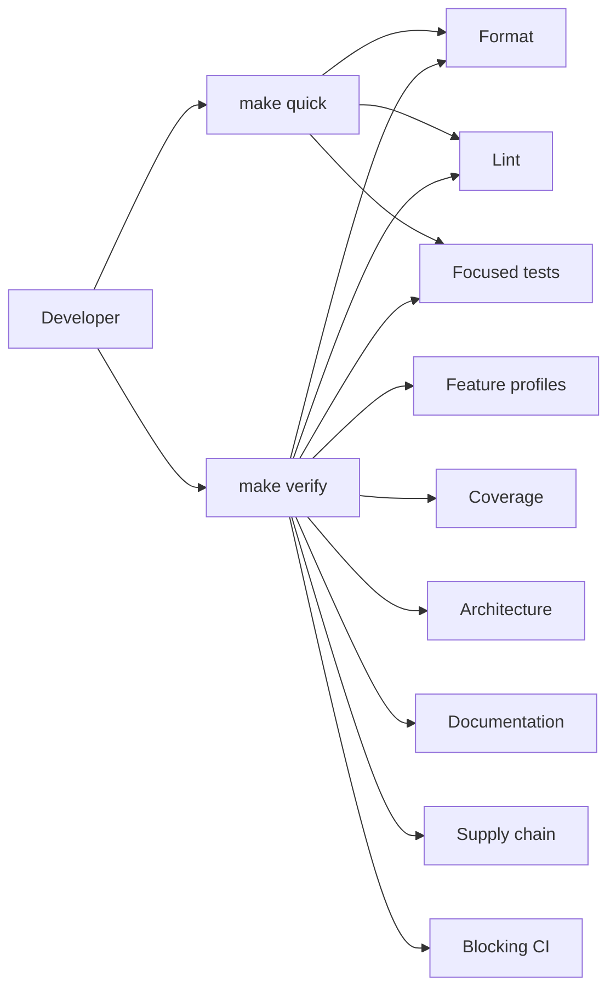

# Quality Gates and Makefile

## Status

**Implemented M0 quality foundation, decided v1 quality policy.** Milestone 0 delivered the reproducible quality gate in commit `f2bb35d040dcec93639d6715fc06429b9070e1e3`, before the first production implementation was accepted. It includes the pinned Rust toolchains and external-tool manifest, root `Makefile`, Cargo configuration and committed lockfile, machine-readable policies, quality checkers and self-tests, and CI workflow.

This document remains the authoritative v1 quality policy. Its M0 controls are implemented and blocking. Future milestones extend the policy only when they add a new crate, feature combination, adapter, quality tool, or an explicitly approved stronger check. The M0/M1 verification baseline and its known deferred hardening work are recorded in [M0/M1 Closure Evidence](../closeout/m0-m1-closure-evidence.md).

## Scope

The implemented policy covers:

- pinned Rust toolchain and external quality tools;
- strict pragmatic linting and formatting;
- immediate tiered coverage requirements;
- required Cargo feature profiles;
- tests, doctests, documentation, and architecture checks;
- dependency, license, advisory, unused-dependency, stale-dependency, and manifest hygiene checks;
- the root Makefile contract and CI entry point;
- explicit, reviewable exception handling.

It complements, and does not replace, [Test-Driven Delivery and Verification](10-test-driven-delivery-and-verification.md). Numeric coverage never replaces contract, architecture, failure-path, or outcome tests.

## Quality model

`make quick` is the fast inner-loop signal. `make verify` is the complete reproducible merge/release signal. `make ci` aliases `make verify` so local and CI verification behavior cannot drift. A clean CI runner performs explicit pinned-tool setup before invoking `make ci` on required Linux and Windows runners; CI installs exact tool releases through checksum-verified `taiki-e/install-action` rather than source-compiling every tool on each cache miss. Windows acceptance exercises the named-pipe transport fixture rather than relying on cross-compilation alone.

## Reproducible tooling

### Toolchain policy

M0 commits and enforces:

- a pinned Rust toolchain definition;
- required Rust components, including `rustfmt`, `clippy`, and `llvm-tools-preview`;
- a pinned external quality-tool manifest;
- the Cargo lockfile;
- Cargo invocation with `--locked` where applicable.

Verification does not implicitly download, install, update, or repair tools. A missing or mismatched tool is a typed quality-gate failure.

### External quality tools

The pinned manifest records exact versions and invocation policy for:

| Tool | Required purpose |
| --- | --- |
| `cargo-nextest` | Reproducible, parallel Rust test execution. |
| `cargo-llvm-cov` | Line/branch coverage collection, report generation, and threshold enforcement. |
| `cargo-about` | Deterministic third-party license-notice generation from the locked dependency graph. |
| `cargo-deny` | License, bans, sources, advisory, and duplicate-version policy. |
| `cargo-audit` | Independent RustSec advisory audit. |
| `cargo-udeps` | Unused-dependency detection. It uses the pinned auxiliary nightly toolchain. |
| `cargo-machete` | Cargo manifest hygiene. |
| `cargo-outdated` | Stale direct-dependency detection. |

A subsequent milestone may add a tool only through a documented quality-policy update. It may replace a listed tool only after preserving the stated outcome.

### Tool management targets

- `make bootstrap-tools` is the sole installer for external quality tools. It is explicitly mutating and networked. It retains a matching restored tool binary and reinstalls an absent or version-mismatched one with an exact pinned version, never selecting an unpinned version.
- `make tools-check` validates the pinned Rust version, required components, external tool availability, and exact versions. It is non-mutating.
- `make check`, `make verify`, and `make ci` call `tools-check` but never call `bootstrap-tools`.

## Formatting and lint policy

### Global requirements

- `rustfmt` is mandatory. `make fmt-check` fails on formatting drift and never modifies files.
- All warnings are errors in every non-mutating verification target.
- The strict lint policy runs for every required Cargo feature profile.
- `unsafe` is denied by default.
- Production code denies unreviewed `unwrap`, `expect`, `panic`, `todo!`, `unimplemented!`, `dbg!`, direct stdout/stderr printing, direct process termination, and memory-forget patterns.
- A lint suppression uses a narrow local scope and a mandatory `reason = "..."` that explains why it is safe.
- Test-only exceptions are also local and reasoned. Test convenience must not become a production loophole.

### Strict pragmatic Clippy baseline

The workspace lint configuration requires:

1. Clippy defaults as errors.
2. `clippy::nursery` as errors.
3. The selected `pedantic` lints `clippy::must_use_candidate`, `clippy::missing_errors_doc`, `clippy::missing_panics_doc`, `clippy::return_self_not_must_use`, and `clippy::use_self` as errors.
4. The selected `restriction` lints `clippy::allow_attributes_without_reason`, `clippy::as_underscore`, `clippy::dbg_macro`, `clippy::else_if_without_else`, `clippy::exit`, `clippy::expect_used`, `clippy::mem_forget`, `clippy::panic`, `clippy::print_stdout`, `clippy::print_stderr`, `clippy::todo`, `clippy::unimplemented`, `clippy::unwrap_used`, and `clippy::undocumented_unsafe_blocks` as errors.
5. Rust-level denial of `unsafe_code`.
6. A centrally documented allowlist, reviewed as policy, rather than scattered broad suppressions.

M0 validates the selected lint names, stability, and interactions against the pinned toolchain. If a future toolchain makes an intended lint unavailable or conflicting, the policy update must select an equivalent supported check, never silently weaken the outcome.

The policy deliberately does **not** deny all `pedantic` or all `restriction` lints. Some are subjective or ergonomically harmful and would encourage formal workarounds instead of better code.

### Architectural lint protections

`make architecture` currently detects or prohibits:

- direct process-CWD fallback in checked source;
- listed provider SDK and implementation-resource leakage from active M1 contract crates;
- direct application/runtime/storage implementation access from Tauri/TUI adapters;
- `unsafe` and process-level escape hatches without an approved, local explanation;
- raw debug output or secret-bearing errors reaching checked paths.

`make architecture` detects workspace dependency cycles, validates that active-crate machine-readable integration targets exactly equal Cargo metadata, and prevents direct forbidden source patterns. It also runs `quality/check_public_api.py`, which uses the pinned nightly rustdoc JSON output to reject forbidden implementation resources and provider SDK namespaces in public reachable aliases, fields, wrappers, nested generic arguments, function signatures, trait surfaces, and re-exports. Private-only implementation details are outside this public-contract check.

## Coverage policy

Coverage is a blocking guardrail from the moment a crate contains production code. There is no grace baseline and no gradual ramp.

M0 provides the versioned coverage-policy file and checker over `cargo llvm-cov` output. Branch-aware reports use the pinned dated nightly toolchain; ordinary application checks remain on pinned stable. The checker maps reportable source files to each declared production crate, enforces that crate's individual line tier, requires branch metrics, and emits JSON report artifacts. Enabled exclusions are exact repository-relative source-file paths with rationale, owner, and equivalent test evidence; they must resolve under the active owner's `src` root, appear exactly once in the coverage report, and are subtracted from that crate's numerator and denominator. The M1 reports prove the policy for its four active Tier A crates.

### Tiered line coverage thresholds

| Tier | Crate categories | Minimum line coverage |
| --- | --- | ---: |
| A | `types`, `domain`, `config`, `protocol` | 95% |
| B | `application`, `runtime`, `storage`, `storage-sqlite`, `tools`, `workspace`, `hooks`, `plans`, `vfr`, `headroom` | 90% |
| C | `model`, provider adapters, `transport`, `client`, `daemon` | 85% |
| Adapter exception | Tauri and TUI presentation crates | No aggregate UI line threshold. Require complete command/event mapping contracts, all mandatory fixture-daemon smoke/outcome scenarios, and required platform CI evidence. |

Branch coverage is reported. Critical safety and recovery branches are not excused by a passing line threshold. Those branches remain independently mandatory in the scenario tests defined by [10 Test-Driven Delivery and Verification](10-test-driven-delivery-and-verification.md).

### Coverage constraints

- Every production crate declares its tier before production code is merged.
- Every required feature profile contributes to coverage where the crate supports that profile.
- A coverage decrease fails `make coverage` and `make verify`.
- Generated code and technically unmeasurable code may be excluded only through a versioned policy entry with rationale, owner, and equivalent test evidence.
- Exclusions cannot hide core runtime, policy, provider translation, persistence, redaction, or security logic.
- Coverage reports are stored as CI artifacts.
- Test code and generated code must not inflate the production coverage denominator.

Applying an enabled exclusion is explicit and reviewable. The checker rejects duplicate, absolute, traversing, unowned, out-of-source-root, absent, unreported, and all-source-removing exclusions. M1+ preserves no enabled exclusions in the committed policy.

## Cargo feature-profile policy

All applicable check, lint, test, documentation, and coverage paths exercise:

1. default features;
2. `--no-default-features`;
3. `--all-features`;
4. an explicitly versioned list of enabled critical feature combinations.

This is intentionally not an exhaustive combinatorial matrix. M1 has no enabled critical combination. Every future optional provider, adapter, or feature must either be covered by one of the first three profiles or add a critical combination in the same change.

The feature-profile policy is machine-readable and verified by `make features`.

## Makefile contract

The root `Makefile` is the sole supported orchestration surface for local and CI quality workflows. Recipes use strict shell behavior and label each command as mutating or non-mutating.

| Target | Mutation | Required behavior |
| --- | --- | --- |
| `make help` | No | List supported targets, dependencies, and mutation status. |
| `make bootstrap-tools` | Yes | Install only pinned tool versions with locked installation. |
| `make tools-check` | No | Validate Rust/tool versions and required components. |
| `make fmt` | Yes | Apply formatting deliberately. |
| `make fmt-check` | No | Verify formatting without changing files. |
| `make notices` | Yes | Regenerate `THIRD_PARTY_NOTICES.md` from the locked dependency graph and committed notice policy/template. |
| `make notices-check` | No | Regenerate notices in a temporary file and fail if committed notices are missing or stale. |
| `make features` | No | Check default, no-default, all-features, and critical combinations. |
| `make lint` | No | Run strict lint policy with warnings denied for all feature profiles. |
| `make test` | No | Run nextest suites and doctests for all feature profiles. |
| `make docs-check` | No | Build Rust docs with warnings denied and validate Markdown links, Mermaid diagrams, and documentation navigation. |
| `make architecture` | No | Run crate-set, dependency, import, DTO, WorkspaceRoot, hook, plan, and public-API boundary checks. |
| `make coverage` | No | Collect coverage and apply the tier policy. |
| `make deps` | No | Run locked metadata, third-party-notice freshness, deny, audit, unused-dependency, manifest, stale-direct-dependency, and duplicate-version checks. |
| `make quick` | No | Run tools-check, fmt-check, lint, and focused/default tests for fast iteration. |
| `make check` | No | Run complete source-quality checks: tools, formatting, features, lint, all tests, doctests, docs, and architecture. |
| `make verify` | No | Run `check` plus coverage and dependency/supply-chain checks. |
| `make ci` | No | Alias the blocking CI gate, `verify`. |

`make check`, `make verify`, and `make ci` fail rather than modify source, update a lockfile, install tools, or resolve dependencies differently from committed state.

### Cargo command coverage

The Makefile orchestrates relevant Cargo quality commands rather than relying on developers remembering individual flags. It runs each applicable command for every workspace member, every target kind, and every required feature profile. It includes applicable equivalents of:

- `cargo fmt --check`;
- `cargo check --workspace --all-targets --locked` across the feature policy;
- `cargo clippy --workspace --all-targets --locked` across the feature policy with warnings denied;
- `cargo nextest run --workspace --all-targets --locked` and `cargo test --workspace --doc --locked` across the feature policy;
- `cargo doc --workspace --no-deps --locked` with warnings denied;
- `cargo metadata --locked` and lockfile validation;
- coverage, dependency, license, advisory, unused-dependency, manifest, stale-direct-dependency, and architecture checks described in this policy.

An ordinary `cargo build`, `cargo run`, or destructive `cargo clean` is not an independent required quality gate when the relevant compile/test contracts are already covered. The Makefile avoids redundant commands that increase time without proving a distinct result.

## Supply-chain and dependency hygiene

`make deps` and blocking CI run:

- `cargo metadata --locked` as the authoritative lockfile check;
- `make notices-check`, which regenerates `THIRD_PARTY_NOTICES.md` from `Cargo.lock`, `quality/about.toml`, and `quality/third_party_notices.hbs` through pinned `cargo-about` and fails on drift;
- `cargo deny check` for advisories, licenses, banned crates, allowed sources, and duplicate-version policy, using the supported syntax of the pinned cargo-deny version;
- `cargo audit` as an independent advisory source;
- `cargo udeps` for unused dependencies;
- `cargo machete` for manifest hygiene;
- `cargo outdated` for stale direct dependencies;
- committed-lockfile validation using `--locked`.

`THIRD_PARTY_NOTICES.md` is a checked-in generated disclosure artifact, not a hand-maintained license inventory. It contains license texts and registry dependency attribution for the locked graph; private `publish = false` workspace packages remain project-owned code and are excluded. `cargo-about` selects a valid license branch for multi-licensed crates using `quality/about.toml`, while `cargo deny` independently enforces the complete policy expression and source allowlist. A failed or stale notice generation is a blocking supply-chain failure, not an inferred pass.

Exceptions use reviewed, versioned policy/allowlist files. Every exception has a justification and, where applicable, expiration/review date. The approved `0BSD` entry is required transitively by `interprocess`'s local-IPC support (`doctest-file` and `recvmsg`) and is an OSI-approved permissive license. Ignoring a failing gate, using a broad CI bypass, or silently allowing a tool failure is prohibited.

## Test-first, architectural, and outcome integration

Every implementation slice must:

1. identify the owning architecture document and crate coverage tier;
2. create or update DTO/contract fixtures first;
3. create failing domain, architecture, and outcome tests appropriate to the change;
4. implement the smallest code that makes those tests pass;
5. run `make quick` while iterating;
6. run `make verify` before the slice is accepted;
7. record every policy exception, test exclusion, and known risk explicitly.

A high coverage percentage, passing lint, or successful compilation never replaces a required end-to-end outcome scenario.

## Required quality-gate failure tests

M0 proves that the quality system fails correctly for controlled fixtures:

| Intentional defect | Gate that fails |
| --- | --- |
| Formatting drift | `make fmt-check`. |
| Compiler or Clippy warning | `make lint`. |
| Unreasoned or broad lint suppression | `make lint` or `make architecture`. |
| Missing/mismatched pinned tool | `make tools-check`. |
| Missing, stale, or hand-edited third-party notices | `make notices-check` and `make deps`. |
| Missing required crate/test-target policy metadata | `make architecture`. |
| Forbidden crate dependency or import | `make architecture`. |
| DTO/SDK implementation leak | `make architecture`. |
| Coverage below declared tier | `make coverage`. |
| Unapproved coverage exclusion metadata | `make coverage`. |
| Uncovered required feature profile | `make features`. |
| Dependency advisory/license/source/ban/duplicate violation | `make deps`. |
| Unused, stale, or manifest-only dependency | `make deps`. |
| Recognizable fake secret in output fixture | `make test` and `make verify`. |

The specific fixtures and gates, including M1 additions, are listed in the [closure evidence matrix](../closeout/m0-m1-closure-evidence.md#acceptance-evidence-matrix).

## Acceptance criteria

M0 is accepted because its implementation establishes that:

- formatting, compilation, linting, tests, documentation, architecture checks, coverage, and supply-chain checks are blocking;
- tool versions are pinned and checked before every reproducible quality run;
- Makefile commands orchestrate every non-mutating quality gate and CI invokes `make ci` as its sole verification command after explicit setup;
- coverage thresholds apply immediately by crate tier with no unreviewed escape hatch;
- adapters use mapping/contract/outcome evidence rather than a misleading aggregate UI line target;
- linting is strict but pragmatic, with narrow justified exceptions rather than a blanket unworkable lint set;
- default, no-default, all-features, and enabled critical combinations are verified;
- TDD and semantic acceptance tests remain mandatory regardless of coverage percentage.

## Non-goals

- Requiring an arbitrary global number of tests.
- Replacing human review with coverage percentage or lint compliance.
- Exhaustive verification of every mathematically possible Cargo feature combination.
- Turning the Makefile into a generic build/run/cleanup wrapper unrelated to quality outcomes.
