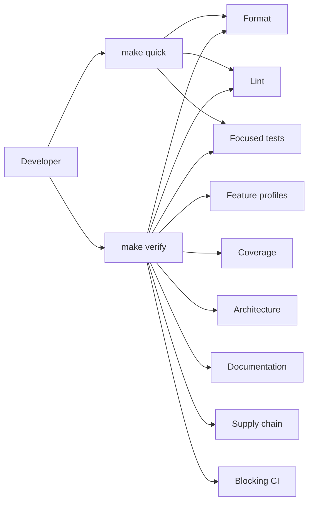

# Quality Gates and Makefile

## Status

**Implemented M0 quality foundation, decided v1 quality policy.** Milestone 0 delivered the reproducible quality gate in commit `f2bb35d040dcec93639d6715fc06429b9070e1e3`, before the first production implementation was accepted. It includes the pinned Rust toolchains and external-tool manifest, root `Makefile`, Cargo configuration and committed lockfile, machine-readable policies, quality checkers and self-tests, and CI workflow.

This document remains the authoritative v1 quality policy. Its M0 controls are implemented and blocking. Future milestones extend the policy only when they add a new crate, feature combination, adapter, quality tool, or an explicitly approved stronger check. The M0/M1 verification baseline and its known deferred hardening work are recorded in [M0/M1 Closure Evidence](../closeout/m0-m1-closure-evidence.md).

## Scope

The implemented policy covers:

- pinned Rust toolchain and external quality tools;
- strict pragmatic linting and formatting;
- immediate tiered coverage requirements;
- required Cargo feature profiles;
- tests, doctests, documentation, and architecture checks;
- dependency, license, advisory, unused-dependency, stale-dependency, and manifest hygiene checks;
- the root Makefile contract and CI entry point;
- explicit, reviewable exception handling.

It complements, and does not replace, [Test-Driven Delivery and Verification](10-test-driven-delivery-and-verification.md). Numeric coverage never replaces contract, architecture, failure-path, or outcome tests.

## Quality model

`make quick` is the fast inner-loop signal and runs the profile-based lint matrix without duplicating the default test suite. `make verify` is the complete reproducible merge/release signal. `make ci` aliases `make verify` so local and CI verification behavior cannot drift. A clean CI runner performs explicit pinned-tool setup before invoking its assigned gate on required Linux and Windows runners; CI installs exact tool releases through checksum-verified `taiki-e/install-action` rather than source-compiling every tool on each cache miss. CI splits the blocking gate into parallel matrix jobs so independent phases no longer wait for the whole check gate: `ci-lint-arch` runs formatting, feature profiles, lint, docs, and architecture checks; `ci-test` runs nextest and doctests; the standalone check compile is not part of the CI test job because nextest and doctests build every declared target under every required profile, and the workspace has no bench or example targets, so `check-cargo` proves no distinct gate in CI. It remains part of the local `make check`, `make verify`, and `ci-source` gate. `ci-coverage-default`/`ci-coverage-no-default`/`ci-coverage-all` run one coverage profile each (the slowest profile becomes the coverage critical path instead of the sum of all three) and clean their generated LLVM artifacts; `ci-selftest` runs the fixture self-check in place; and `ci-deps` runs the online dependency gates. `ci-lint-arch` and `ci-test` run on both Linux and Windows runners; coverage, selftest, and deps run on Linux only, because their results are platform-invariant: coverage measures the same source and toolchain, the selftest fixtures are Python/git subprocess checks, and the dependency gates read the same lockfile and network registries. The Windows coverage trio previously dominated the CI critical path at roughly twenty minutes while running identical work about 1.7x slower than Linux (no mold linker and slower Windows codegen), so Windows CI keeps the two correctness-relevant jobs and Windows behavior remains covered by the `ci-test` named-pipe and platform-native symlink fixtures. Each job writes a job-scoped metrics manifest (`quality-run-<job>.json`), and branch protection requires the nine resulting status checks. Each job installs only the toolchains, components, and tools its phase uses (`CI_TOOLS_SCOPE` feeds `check_tools.py --scope`); the union of the scopes equals the complete pinned toolset, so no pinned tool or version escapes validation. CI restores Cargo registries and build artifacts through `Swatinem/rust-cache` (per-phase keys), installs pinned toolchains through `dtolnay/rust-toolchain`, installs the mold linker only on Linux jobs whose `RUSTFLAGS` actually pass `-fuse-ld=mold` and verifies the install with `mold --version`, disables incremental compilation, and keeps dev-profile dependencies optimized with line tables. A workflow-level concurrency group keyed by workflow and pull-request number or ref cancels superseded in-progress runs for pull requests only; push runs never cancel, and `fail-fast: false` keeps every matrix job independent so the nine required status checks remain exactly the same. Coverage jobs additionally route rustc invocations through the sccache object cache (pinned `mozilla-actions/sccache-action` and sccache version, wired through the cargo `build.rustc_wrapper` config so cargo-llvm-cov's own `RUSTC_WRAPPER` chains into it) and collect sccache statistics as a raw `--show-stats` JSON artifact with a human-text fallback plus a structured diagnostic (`quality/reports/sccache-diagnostic-<phase>.json`, phase-suffixed so per-phase artifacts never overwrite each other) uploaded with the quality reports; raw statistics are kept in the artifact only, the collector always exits successfully and writes nullable fields when statistics are unavailable, so it never changes a gate's verdict. Coverage jobs run sccache at debug log level (`SCCACHE_LOG=sccache=debug`) because sccache v0.17.0 records ghac cache write failures only in the aggregate "Cache write errors" counter of the post action unless the log level is raised; a dedicated diagnostic step then prints the verbose stats, the write-error focused JSON summary (cache writes vs cache write errors and the `not_cached` reason breakdown), and the sccache-related environment, so ghac cache write failures are diagnosable from the step log without downloading the artifact, and the collector's console summary line includes the cache writes vs write errors counts when available. The object cache recovers instrumented build artifacts that coverage jobs intentionally clean before their per-phase cache upload, so repeated coverage runs reuse compiled objects across jobs and runs instead of rebuilding the shared dependency graph from scratch; the diagnostic never changes a gate's verdict. CI records free space before and after the quality gate as an operational diagnostic, and coverage jobs additionally record runner resource metrics (CPU count and load averages, memory when the platform exposes it, and disk usage) as atomically written JSON before and after the gate; all of these reports never change a gate's verdict. A separate `quality-benchmark` workflow is manual-only (`workflow_dispatch`, never a required check, never triggered by push or pull request) and measures clean-target `cargo build --workspace --locked` wall time (each build runs in an isolated temporary `CARGO_TARGET_DIR` created with the platform-native temp directory API, so local runs never touch the workspace target) for the cargo-default baseline and requested `--jobs` values with a warmup build plus repeated runs, reporting p50/p95 and mean/min/max in a structured JSON artifact; it never runs or alters the blocking Quality workflow gate. A separate `cache-cleanup` workflow (never a required check) runs on every push to `main` and weekly, and deletes stale GitHub Actions caches through `quality/cleanup_gha_caches.py`: pull-request and feature-branch caches (`refs/pull/*` and other non-main refs) are deleted in bulk, and kept `main` caches older than the retention window (default 7 days) are deleted individually; it needs `actions: write` and always exits 0 so a transient API failure cannot block anything. This keeps the repository under the GitHub Actions cache limit (10 GB): without it, every PR and every push to `main` writes a fresh sccache/rust-cache set under a new key and stale entries accumulate until new cache writes start failing (observed as sccache "Cache write errors" in the coverage jobs). Human-readable timing records identify Makefile phases, profiles, crates, coverage stages, dependency checks, durations, and outcomes without recording secrets. Windows acceptance exercises the named-pipe transport fixture rather than relying on cross-compilation alone.

## Reproducible tooling

### Toolchain policy

M0 commits and enforces:

- a pinned Rust toolchain definition;
- required Rust components, including `rustfmt`, `clippy`, and `llvm-tools-preview`;
- a pinned external quality-tool manifest;
- the Cargo lockfile;
- Cargo invocation with `--locked` where applicable.

Verification does not implicitly download, install, update, or repair tools. A missing or mismatched tool is a typed quality-gate failure.

### External quality tools

The pinned manifest records exact versions and invocation policy for:

| Tool | Required purpose |
| --- | --- |
| `cargo-nextest` | Reproducible, parallel Rust test execution. |
| `cargo-llvm-cov` | Line/branch coverage collection, report generation, and threshold enforcement. |
| `cargo-about` | Deterministic third-party license-notice generation from the locked dependency graph. |
| `cargo-deny` | License, bans, sources, advisory, and duplicate-version policy. |
| `cargo-audit` | Independent RustSec advisory audit. |
| `cargo-udeps` | Unused-dependency detection. It uses the pinned auxiliary nightly toolchain. |
| `cargo-machete` | Cargo manifest hygiene. |
| `cargo-outdated` | Stale direct-dependency detection. |

A subsequent milestone may add a tool only through a documented quality-policy update. It may replace a listed tool only after preserving the stated outcome.

### Tool management targets

- `make bootstrap-tools` is the sole installer for external quality tools. It is explicitly mutating and networked. It retains a matching restored tool binary and reinstalls an absent or version-mismatched one with an exact pinned version, never selecting an unpinned version.
- `make tools-check` validates the pinned Rust version, required components, external tool availability, and exact versions. It is non-mutating. CI scopes the validation per job with `check_tools.py --scope` through the `CI_TOOLS_SCOPE` environment variable; local runs always validate the complete pinned set.
- `make check`, `make verify`, `make ci`, `ci-lint-arch`, `ci-test`, `ci-coverage-default`, `ci-coverage-no-default`, `ci-coverage-all`, `ci-selftest`, and `ci-deps` call `tools-check` but never call `bootstrap-tools`.

## Formatting and lint policy

### Global requirements

- `rustfmt` is mandatory. `make fmt-check` fails on formatting drift and never modifies files.
- All warnings are errors in every non-mutating verification target.
- The strict lint policy runs for every required Cargo feature profile.
- `unsafe` is denied by default.
- Production code denies unreviewed `unwrap`, `expect`, `panic`, `todo!`, `unimplemented!`, `dbg!`, direct stdout/stderr printing, direct process termination, and memory-forget patterns.
- A lint suppression uses a narrow local scope and a mandatory `reason = "..."` that explains why it is safe.
- Test-only exceptions are also local and reasoned. Test convenience must not become a production loophole.

### Strict pragmatic Clippy baseline

The workspace lint configuration requires:

1. Clippy defaults as errors.
2. `clippy::nursery` as errors.
3. The selected `pedantic` lints `clippy::must_use_candidate`, `clippy::missing_errors_doc`, `clippy::missing_panics_doc`, `clippy::return_self_not_must_use`, and `clippy::use_self` as errors.
4. The selected `restriction` lints `clippy::allow_attributes_without_reason`, `clippy::as_underscore`, `clippy::dbg_macro`, `clippy::else_if_without_else`, `clippy::exit`, `clippy::expect_used`, `clippy::mem_forget`, `clippy::panic`, `clippy::print_stdout`, `clippy::print_stderr`, `clippy::todo`, `clippy::unimplemented`, `clippy::unwrap_used`, and `clippy::undocumented_unsafe_blocks` as errors.
5. Rust-level denial of `unsafe_code`.
6. A centrally documented allowlist, reviewed as policy, rather than scattered broad suppressions.

M0 validates the selected lint names, stability, and interactions against the pinned toolchain. If a future toolchain makes an intended lint unavailable or conflicting, the policy update must select an equivalent supported check, never silently weaken the outcome.

The policy deliberately does **not** deny all `pedantic` or all `restriction` lints. Some are subjective or ergonomically harmful and would encourage formal workarounds instead of better code.

### Architectural lint protections

`make architecture` currently detects or prohibits:

- direct process-CWD fallback in checked source;
- listed provider SDK namespaces and HTTP/runtime resources from active model/config/domain/runtime/application/storage/protocol/transport/client/daemon/adapter source, while allowing `openrouter-rs` only in private `intention-provider-openrouter` implementation and `async-openai` only in private `intention-provider-generic-chat` implementation;
- provider SDK/resource types from source-level ownership analysis of every active crate;
- direct application/runtime/storage implementation access from Tauri/TUI adapters;
- `unsafe` and process-level escape hatches without an approved, local explanation;
- raw debug output or secret-bearing errors reaching checked paths.

`make architecture` detects workspace dependency cycles, validates that active-crate machine-readable integration targets exactly equal Cargo metadata, prevents direct forbidden source patterns, and restricts provider SDK namespaces (`async_openai::`, `openrouter_rs::`, `reqwest::`) to their owner crate's private implementation via source-level analysis. Private-only implementation details are outside this check.

## Coverage policy

Coverage is a blocking guardrail from the moment a crate contains production code. There is no grace baseline and no gradual ramp.

M0 provides the versioned coverage-policy file and checker over `cargo llvm-cov` output. Branch-aware reports use the pinned dated nightly toolchain; ordinary application checks remain on pinned stable. The checker maps reportable source files to each declared production crate, normalizing CI report paths back to workspace-relative sources before per-crate and exclusion arithmetic, enforces that crate's individual line tier, requires branch metrics, and emits JSON report artifacts. Enabled exclusions are exact repository-relative source-file paths with rationale, owner, and equivalent test evidence; they must resolve under the active owner's `src` root, appear exactly once in the coverage report, and are subtracted from that crate's numerator and denominator. The M1 reports prove the policy for its four active Tier A crates.

The coverage runner always uses `--all-targets` for every coverage crate. Explicit target narrowing is intentionally disabled because explicit target sets do not reliably reproduce the `--all-targets` coverage set (Windows integration-target behavior differs, which is why the coverage gate runs on Linux), and per-crate thresholds must remain comparable across every coverage run. Boundary crates whose library test harness is not reliably merged by nextest (`intention-daemon`, `intention-workspace`) use `cargo test` instead of nextest for package coverage so the library harness remains in the report. Platform-gated fixture tests distort per-crate denominators: `cfg(unix)`-only tests inflate the report with self-covering test lines while a `cfg(windows)`-only build would measure only production lines. Security-critical fixtures that exercise the same production paths on both platforms (the workspace crate's symlink-rejection contract) therefore use platform-native symlink APIs (`std::os::unix::fs::symlink` and `std::os::windows::fs::symlink_file`/`symlink_dir`) and run on every supported OS instead of being gated to Unix.

### Tiered line coverage thresholds

| Tier | Crate categories | Minimum line coverage |
| --- | --- | ---: |
| A | `types`, `domain`, `config`, `protocol` | 95% |
| B | `application`, `runtime`, `storage`, `storage-sqlite`, `tools`, `workspace`, `hooks`, `plans`, `vfr`, `headroom` | 90% |
| C | `model`, provider adapters, `transport`, `client`, `daemon` | 85% |
| Adapter exception | Tauri and TUI presentation crates | No aggregate UI line threshold. Require complete command/event mapping contracts, all mandatory fixture-daemon smoke/outcome scenarios, and required platform CI evidence. |

Branch coverage is reported. Critical safety and recovery branches are not excused by a passing line threshold. Those branches remain independently mandatory in the scenario tests defined by [10 Test-Driven Delivery and Verification](10-test-driven-delivery-and-verification.md).

All Tier B crates, including `intention-tools` and `intention-hooks`, require at
least 90% line coverage. M5 has no coverage override. Branch metrics and all
semantic safety, workspace-boundary, ordering, rejection, and short-circuit
tests remain mandatory independently of the line threshold.

### Coverage constraints

- Every production crate declares its tier before production code is merged.
- Every required feature profile contributes to coverage where the crate supports that profile.
- A coverage decrease fails `make coverage` and `make verify`.
- Generated code and technically unmeasurable code may be excluded only through a versioned policy entry with rationale, owner, and equivalent test evidence.
- Exclusions cannot hide core runtime, policy, provider translation, persistence, redaction, or security logic.
- Coverage reports are stored as CI artifacts.
- Test code and generated code must not inflate the production coverage denominator.

Applying an enabled exclusion is explicit and reviewable. The checker rejects duplicate, absolute, traversing, unowned, out-of-source-root, absent, unreported, and all-source-removing exclusions. The sole enabled M2 exclusion is `intention-daemon/src/main.rs`: it is a thin process adapter whose unsafe-argument and concurrent bootstrap behavior are exercised through the real binary in `daemon_bootstrap`; the entry point carries no library logic, and those real-binary tests are accepted as equivalent coverage evidence. All daemon library behavior remains subject to Tier C coverage.

## Cargo feature-profile policy

All applicable check, lint, test, documentation, and coverage paths exercise:

1. default features;
2. `--no-default-features`;
3. `--all-features`;
4. an explicitly versioned list of enabled critical feature combinations.

This is intentionally not an exhaustive combinatorial matrix. M1 has no enabled critical combination. Every future optional provider, adapter, or feature must either be covered by one of the first three profiles or add a critical combination in the same change.

The feature-profile policy is machine-readable and verified by `make features`. M4's selected provider SDK dependencies do not add a workspace feature flag or critical combination; default, no-default, and all-features profiles therefore remain the required coverage for their private SDK integration.

The final product is a single daemon binary, so an isolated per-crate release-build check is not part of the gate: workspace feature unification is exactly what the shipped binary uses, and the complete `check`/`test` matrix already compiles every declared target under every required profile.

## Makefile contract

The root `Makefile` is the sole supported orchestration surface for local and CI quality workflows. Recipes use strict shell behavior and label each command as mutating or non-mutating.

| Target | Mutation | Required behavior |
| --- | --- | --- |
| `make help` | No | List supported targets, dependencies, and mutation status. |
| `make bootstrap-tools` | Yes | Install only pinned tool versions with locked installation. |
| `make tools-check` | No | Validate Rust/tool versions and required components. |
| `make fmt` | Yes | Apply formatting deliberately. |
| `make fmt-check` | No | Verify formatting without changing files. |
| `make notices` | Yes | Regenerate `THIRD_PARTY_NOTICES.md` from the locked dependency graph and committed notice policy/template. |
| `make notices-check` | No | Regenerate notices in a temporary file and fail if committed notices are missing or stale. |
| `make features` | No | Check default, no-default, all-features, and critical combinations. |
| `make lint` | No | Run strict lint policy with warnings denied for all feature profiles. |
| `make test` | No | Run nextest suites and doctests for all feature profiles. |
| `make docs-check` | No | Build Rust docs with warnings denied and validate Markdown links, Mermaid diagrams, and documentation navigation. |
| `make architecture` | No | Run crate-set, dependency, import, DTO, WorkspaceRoot, hook, plan, and provider-SDK ownership boundary checks. |
| `make coverage` | No | Collect coverage and apply the tier policy. |
| `make coverage-default` | No | Collect coverage for the default profile only (`run_coverage.py --profile default`). |
| `make coverage-no-default` | No | Collect coverage for the no-default profile only (`run_coverage.py --profile no_default`). |
| `make coverage-all` | No | Collect coverage for the all-features profile only (`run_coverage.py --profile all`). |
| `make coverage-artifacts-clean` | Yes, generated artifacts only | Remove `target/llvm-cov-target` after coverage's JSON reports are checked; it preserves reports and ordinary Cargo artifacts. |
| `make deps` | No | Run locked metadata, third-party-notice freshness, deny, audit, unused-dependency, manifest, stale-direct-dependency, and duplicate-version checks. |
| `make quick` | No | Run tools-check, fmt-check, and the profile-based lint matrix without duplicating the full test gate. |
| `make check` | No | Run complete source-quality checks: tools, formatting, features, lint, all tests, doctests, docs, and architecture. |
| `make verify` | No | Run `check` plus coverage and dependency/supply-chain checks. |
| `make ci` | No | Alias the blocking local CI gate: initialize metrics, run `verify`, then finalize the metrics manifest. GitHub Actions invokes the per-job aliases below in parallel matrix jobs instead. |
| `make ci-source` | No | Local convenience alias for the complete `check` gate with job-scoped metrics. |
| `make ci-lint-arch` | No | Run the CI lint/architecture job: job-scoped metrics, `fmt-check`, `features`, `lint`, `docs-check`, `architecture`, then job-scoped metrics finalize. |
| `make ci-test` | No | Run the CI test job: job-scoped metrics, `test`, then job-scoped metrics finalize. |
| `make ci-coverage-default` | No | Run the CI coverage job for the default profile: job-scoped metrics, `coverage-default`, generated-artifact cleanup, then job-scoped metrics finalize. |
| `make ci-coverage-no-default` | No | Run the CI coverage job for the no-default profile: job-scoped metrics, `coverage-no-default`, generated-artifact cleanup, then job-scoped metrics finalize. |
| `make ci-coverage-all` | No | Run the CI coverage job for the all-features profile: job-scoped metrics, `coverage-all`, generated-artifact cleanup, then job-scoped metrics finalize. |
| `make ci-selftest` | No | Run the CI fixture self-check job: job-scoped metrics, the in-place `quality-self-test-in-place`, then job-scoped metrics finalize. |
| `make ci-deps` | No | Run the CI dependency job: job-scoped metrics, `deps`, then job-scoped metrics finalize. |

`make verify` runs `check`, `coverage`, and `deps`, then removes only the generated LLVM coverage target before `quality-self-test`; coverage reports remain available for CI upload. `make ci` wraps `verify` with `metrics-start` and `metrics-finish`, which write `quality/reports/quality-run.json` and a JSONL event stream for human-readable phase, profile, crate, stage, duration, and outcome records. The CI job aliases scope the same records per job as `quality-run-<job>.json` while sharing the runner-local event stream; parallel matrix jobs run on separate runners with separate checkouts, so per-job manifests never overwrite each other. Metrics are observational only and never change a gate's verdict; the event stream is cleared at the start of each run so stale records cannot leak into a new manifest. `quality-self-test` copies and mutates an isolated source tree and its copied-repository Cargo commands reuse the controller workspace `target` directory, while the CI job runs the same fixtures in place with `quality-self-test-in-place`: the working tree must be clean before each fixture and `git restore` scopes every mutation, so warm Cargo artifacts for the same source paths are reused instead of rebuilding the copied tree. Quality scripts resolve Cargo-generated artifacts through `CARGO_TARGET_DIR` when it is set. Cargo fingerprints the copied source paths and contents, so intentional fixture defects still recompile affected crates and must produce their required failures without allocating a second complete target tree in the temporary directory. `make check`, `make verify`, and `make ci` fail rather than modify source, update a lockfile, install tools, or resolve dependencies differently from committed state.

### Cargo command coverage

The Makefile orchestrates relevant Cargo quality commands rather than relying on developers remembering individual flags. It runs each applicable command for every workspace member, every target kind, and every required feature profile. It includes applicable equivalents of:

- `cargo fmt --check`;
- `cargo check --workspace --all-targets --locked` across the feature policy;
- `cargo clippy --workspace --all-targets --locked` across the feature policy with warnings denied;
- `cargo nextest run --workspace --all-targets --locked` and `cargo test --workspace --doc --locked` across the feature policy;
- `cargo doc --workspace --no-deps --locked` with warnings denied;
- `cargo metadata --locked` and lockfile validation;
- coverage, dependency, license, advisory, unused-dependency, manifest, stale-direct-dependency, and architecture checks described in this policy.

An ordinary `cargo build`, `cargo run`, or destructive `cargo clean` is not an independent required quality gate when the relevant compile/test contracts are already covered. The Makefile avoids redundant commands that increase time without proving a distinct result.

## Supply-chain and dependency hygiene

`make deps` and blocking CI run:

- `cargo metadata --locked` as the authoritative lockfile check;
- `make notices-check`, which regenerates `THIRD_PARTY_NOTICES.md` from `Cargo.lock`, `quality/about.toml`, and `quality/third_party_notices.hbs` through pinned `cargo-about` and fails on drift;
- `cargo deny check` for advisories, licenses, banned crates, allowed sources, and duplicate-version policy, using the supported syntax of the pinned cargo-deny version;
- `cargo audit` as an independent advisory source;
- `cargo udeps` for unused dependencies;
- `cargo machete` for manifest hygiene;
- `cargo outdated` for stale direct dependencies;
- committed-lockfile validation using `--locked`.

`THIRD_PARTY_NOTICES.md` is a checked-in generated disclosure artifact, not a hand-maintained license inventory. It contains license texts and registry dependency attribution for the locked graph; private `publish = false` workspace packages remain project-owned code and are excluded. `cargo-about` selects a valid license branch for multi-licensed crates using `quality/about.toml`, while `cargo deny` independently enforces the complete policy expression and source allowlist. A failed or stale notice generation is a blocking supply-chain failure, not an inferred pass.

M4 added direct `openrouter-rs 0.14.0` and `async-openai 0.29.3` dependencies. The post-M4 `async-openai` 0.41.3 migration replaced the Generic Chat SDK line with the namespaced `types::chat` contract and dropped the `backoff` chain. Their graphs require existing-policy MIT/Apache terms plus BSD-3-Clause, ISC, and CDLA-Permissive-2.0 for Rustls, `webpki-roots`, and the AWS-LC provider (`aws-lc-rs 1.18.0` / `aws-lc-sys 0.44.0`, both Apache-2.0/ISC); each is explicitly allowed in `deny.toml` and `quality/about.toml`, then disclosed by generated notices. The reviewed duplicate branches from these SDKs are: `getrandom@0.2.17` (ring 0.17 through the openrouter-rs reqwest 0.12 Rustls chain), `getrandom@0.3.4` (`async-openai` -> rand 0.9), target-only `r-efi@5.3.0` (`async-openai` -> rand 0.9 -> getrandom 0.3 on EFI targets), `reqwest@0.12.28` (openrouter-rs) alongside `reqwest@0.13.4` (`async-openai`), target-only `wasm-streams@0.4.2` (reqwest 0.12) alongside `wasm-streams@0.5.0` (reqwest 0.13), `syn@1.0.109` (openrouter-rs -> dotenvy_macro), `thiserror@1.0.69` and `thiserror-impl@1.0.69` (openrouter-rs), and target-only `windows-sys@0.52.0` (ring). Each exception is limited to the documented provider SDK path in `deny.toml` and must be reassessed when either selected SDK or its immediate HTTP/random/TLS path changes. The M4-era advisory acknowledgements `RUSTSEC-2025-0012` (`async-openai -> backoff`) and `RUSTSEC-2024-0384` (`async-openai -> backoff -> instant`) and the reviewed `cargo outdated` hold on `async-openai` were removed with the 0.41.3 migration: the `backoff` chain is gone, `cargo audit` and `cargo outdated` are clean, and `check_deny_policy.py` now rejects new advisory ignores or outdated holds. No source exception is approved by this package.

Exceptions use reviewed, versioned policy/allowlist files. Every exception has a justification and, where applicable, expiration/review date. The approved `0BSD` entry is required transitively by `interprocess`'s local-IPC support (`doctest-file` and `recvmsg`) and is an OSI-approved permissive license. The SQLite graph also introduces `foldhash 0.2.0`, whose Zlib license is explicitly allowed in both `quality/about.toml` and `deny.toml` and disclosed through the generated notices. The current graph has two narrowly version-pinned duplicate exceptions: `hashbrown@0.16.1` is required only by `rsqlite-vfs 0.1.1` through the target-specific WASM chain `rusqlite 0.40.2 -> sqlite-wasm-rs 0.5.5`, while `syn@2.0.119` is required by `async-openai 0.41.3 -> async-openai-macros 0.3.0` (proc-macro) and by `wasm-bindgen-macro-support 0.2.126` through `wasm-bindgen 0.2.126` on WASM targets. Native bundled SQLite instead resolves `rusqlite 0.40.2 -> hashlink 0.12.1 -> hashbrown 0.17.1`; the independently required native proc-macro path retains `syn@3.0.3`. The native daemon continues to use bundled SQLite through `rusqlite` with its `bundled` feature and retains `rusqlite_migration 2.6.0`; these exceptions do not replace either dependency or relax duplicate bans for other crates or versions. Reassess both exceptions whenever `rusqlite`, `sqlite-wasm-rs`, `rsqlite-vfs`, `wasm-bindgen`, or their supported target selection changes; record the locked native and WASM validation trees with the review. Ignoring a failing gate, using a broad CI bypass, or silently allowing a tool failure is prohibited.

## Test-first, architectural, and outcome integration

Every implementation slice must:

1. identify the owning architecture document and crate coverage tier;
2. create or update DTO/contract fixtures first;
3. create failing domain, architecture, and outcome tests appropriate to the change;
4. implement the smallest code that makes those tests pass;
5. run `make quick` while iterating;
6. run `make verify` before the slice is accepted;
7. record every policy exception, test exclusion, and known risk explicitly.

During the completed M4 delivery, the controller-owned
[`M4 execution charter`](../m4.md) additionally required package-level
code-first batching: agents wrote the complete bounded fixture portfolio, then
finished the bounded production change before entering a grouped Makefile
validation/repair phase. This historical process did not replace steps 5–7 or
authorize an unimplemented focused gate.

A high coverage percentage, passing lint, or successful compilation never replaces a required end-to-end outcome scenario.

### M4 controller charter and closure record

[`docs/intention-relay/m4.md`](../m4.md) records the controller-owned M4
execution charter. It is read-only historical context and does not override
this quality policy or authorize worktrees, lane execution, or any Makefile
change. M4 is closed at the immutable baseline documented in [M4 Closure
Evidence](../closeout/m4-closure-evidence.md); changes to that scope require a
new decision and their own acceptance evidence.

The active Makefile contract remains unchanged: every implementation handoff
runs `make quick` while iterating and `make verify` before acceptance. The
charter's proposed package-scoped `make focus PACKAGES=...` target remains
unimplemented and may not weaken the full-gate requirement. No simultaneous
full `make verify` executions may claim independent acceptance on the same
host; coverage, dependency, documentation, and Cargo resource contention would
make their results impractical to interpret.

## Required quality-gate failure tests

M0 proves that the quality system fails correctly for controlled fixtures:

| Intentional defect | Gate that fails |
| --- | --- |
| Formatting drift | `make fmt-check`. |
| Compiler or Clippy warning | `make lint`. |
| Unreasoned or broad lint suppression | `make lint` or `make architecture`. |
| Missing/mismatched pinned tool | `make tools-check`. |
| Missing, stale, or hand-edited third-party notices | `make notices-check` and `make deps`. |
| Missing required crate/test-target policy metadata | `make architecture`. |
| Forbidden crate dependency or import | `make architecture`. |
| DTO/SDK implementation leak | `make architecture`. |
| Coverage below declared tier | `make coverage`. |
| Unapproved coverage exclusion metadata | `make coverage`. |
| Uncovered required feature profile | `make features`. |
| Dependency advisory/license/source/ban/duplicate violation | `make deps`. |
| Unused, stale, or manifest-only dependency | `make deps`. |
| Recognizable fake secret in output fixture | `make test` and `make verify`. |

The specific fixtures and gates, including M1 additions, are listed in the [closure evidence matrix](../closeout/m0-m1-closure-evidence.md#acceptance-evidence-matrix).

## Acceptance criteria

M0 is accepted because its implementation establishes that:

- formatting, compilation, linting, tests, documentation, architecture checks, coverage, and supply-chain checks are blocking;
- tool versions are pinned and checked before every reproducible quality run;
- Makefile commands orchestrate every non-mutating quality gate and CI invokes the `ci-lint-arch`, `ci-test`, `ci-coverage-default`, `ci-coverage-no-default`, `ci-coverage-all`, `ci-selftest`, and `ci-deps` job aliases as its sole verification commands after explicit setup;
- coverage thresholds apply immediately by crate tier with no unreviewed escape hatch;
- adapters use mapping/contract/outcome evidence rather than a misleading aggregate UI line target;
- linting is strict but pragmatic, with narrow justified exceptions rather than a blanket unworkable lint set;
- default, no-default, all-features, and enabled critical combinations are verified;
- TDD and semantic acceptance tests remain mandatory regardless of coverage percentage.

## Non-goals

- Requiring an arbitrary global number of tests.
- Replacing human review with coverage percentage or lint compliance.
- Exhaustive verification of every mathematically possible Cargo feature combination.
- Turning the Makefile into a generic build/run/cleanup wrapper unrelated to quality outcomes.

## Post-M4 documentation-only reconciliation policy

M5's focused tool, workspace, hook, and typed-result tests are not a substitute
for the unrun full gates. Any M5 closeout must identify `make verify`, CI,
coverage, and supply-chain results separately and mark them pending when not
executed against the stated baseline.

ADR 0017 and ADR 0018 define the accepted Plan-focus and Build Autopilot
direction. The implementation activation remains subject to the normal
crate/test/coverage/feature/storage/wire declarations and `make verify` gate.
Plan `execute` is intentionally not a sandbox; Build Autopilot intentionally
does not use per-action confirmation. The required evidence must prove these
claims without weakening DTO, redaction, transaction, recovery, or historical
compatibility checks.

The Post-M4 authority reconciliation package is documentation-only. It does not
weaken, replace, or extend the implemented Makefile gate, and it does not
activate a production crate, coverage tier, feature combination, quality tool,
or policy exception. Existing `make quick` and `make verify` remain mandatory
for the documentation change itself and for every later implementation slice.

When a later M4+ package activates a production boundary, the activating change
must update the existing machine-readable architecture, test-target, coverage,
and feature policies together with its focused expected-failure architecture
fixtures and outcome evidence. Research or a reconciliation row alone is not a
quality-policy declaration.

The post-M4 tool-registry and Mandate tool-loop package is likewise
documentation-only. It activates no crate, test target, coverage tier, feature
combination, protocol implementation, migration, quality tool, or Makefile
target. A later activating change must add its exact owners, test targets,
coverage/features, expected-failure architecture fixtures, and outcome evidence
atomically with production work.

The post-M4 Mandate scheduler and readiness package is documentation-only. It
activates no crate, test target, coverage tier, feature combination, protocol
implementation, migration, quality tool, or Makefile target. A later activating
change must declare scheduler owners, test targets, coverage/features,
expected-failure architecture fixtures, and outcome evidence atomically with
production work.

The post-M4 child graph and delegated verifier authority package is likewise
documentation-only. It activates no crate, test target, coverage tier, feature
combination, protocol implementation, migration, quality tool, or Makefile
target. A later activating change must declare exact graph/verifier owners,
test targets, coverage/features, expected-failure architecture fixtures, and
outcome evidence atomically with production work.

The post-M4 Mandate MCP capability package is likewise documentation-only. It
activates no crate, test target, coverage tier, feature combination, protocol
implementation, migration, quality tool, Makefile target, network connection,
or local process. A later activating change must declare exact MCP owners,
test targets, coverage/features, storage/wire versions, expected-failure
architecture fixtures, redaction evidence, and cross-platform outcomes
atomically with production work.

The post-M4 Gateway/RLM bridge package is likewise documentation-only. It
activates no crate, Python dependency, test target, coverage tier, feature
combination, protocol implementation, listener, kernel, migration, quality tool,
or Makefile target. A later activating change must declare exact bridge owners,
test targets, coverage/features, storage/wire versions, expected-failure
architecture fixtures, redaction evidence, and Linux/Windows outcomes atomically
with production work.

The post-M4 run-scoped IPython kernel package is likewise documentation-only.
It activates no crate, Python/Jupyter dependency, test target, coverage tier,
feature combination, protocol implementation, listener, process, migration,
quality tool, or Makefile target. A later activating change must declare exact
kernel owners, dependencies, test targets, coverage/features, storage/wire
versions, expected-failure architecture fixtures, resource-redaction evidence,
and Linux/Windows outcomes atomically with production work.

The post-M4 Goals, Skills, context, memory, and compaction package is likewise
documentation-only. It activates no crate, retrieval/index/search engine, prompt
builder, test target, coverage tier, feature combination, protocol
implementation, migration, quality tool, or Makefile target. A later activating
change must declare exact context owners, test targets, coverage/features,
storage/wire/retention treatment, expected-failure architecture fixtures,
redaction evidence, and Linux/Windows outcomes atomically with production work.

The post-M4 Provider evolution, profiles, and reasoning package is likewise
documentation-only. It activates no provider crate, SDK, parser, test target,
coverage tier, feature combination, protocol implementation, migration, quality
tool, or Makefile target. A later activating change must declare exact provider
owners, dependencies, test targets, coverage/features, storage/wire policy,
expected-failure architecture fixtures, redaction evidence, and Linux/Windows
outcomes atomically with production work.

The post-M4 Session branching and regeneration package is documentation-only. It
activates no crate, test target, coverage tier, feature profile, storage/wire
schema, protocol, quality tool, or Makefile target. A later activating change
must declare those exact policies and architecture fixtures atomically.

The post-M4 Activity, UI, and adapters package is documentation-only. It
activates no crate, test target, coverage tier, feature profile, storage/wire
schema, protocol, quality tool, or Makefile target. A later M6 activating change
must declare exact adapter and activity policies atomically.
