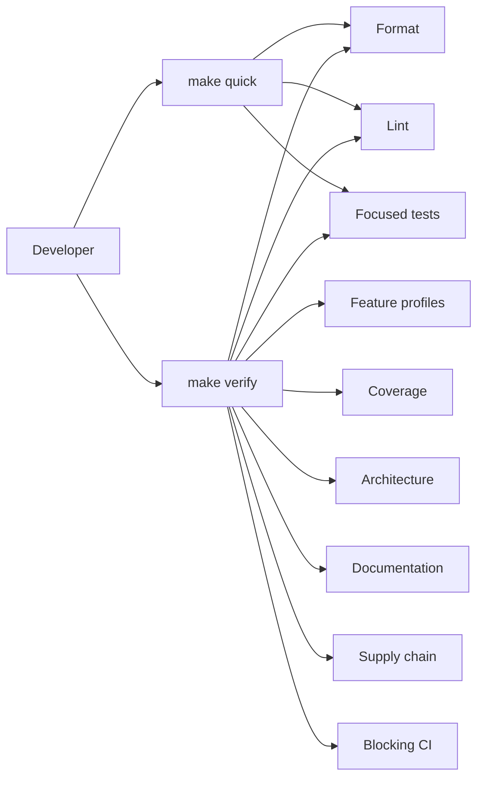

# Quality Gates and Makefile

**Current policy.** The M0 quality foundation — pinned Rust toolchains and external-tool manifest, root `Makefile`,
Cargo configuration and committed lockfile, machine-readable policies, quality checkers, and CI workflow — is
implemented and blocking (commit `f2bb35d040dcec93639d6715fc06429b9070e1e3`), and the policy below is the v1 quality
policy. Future milestones extend it only when they add a new crate, feature combination, adapter, quality tool, or an
explicitly approved stronger check. The M0/M1 verification baseline is recorded in [M0/M1 Closure
Evidence](../closeout/m0-m1-closure-evidence.md).

## Scope

The implemented policy covers:

- pinned Rust toolchain and external quality tools;
- strict pragmatic linting and formatting;
- immediate per-crate coverage tiers;
- required Cargo feature profiles;
- tests, doctests, documentation, and architecture checks;
- dependency, license, advisory, unused-dependency, stale-dependency, and manifest hygiene checks;
- the root Makefile contract and CI entry point;
- explicit, reviewable exception handling.

It complements, and does not replace, [Test-Driven Delivery and
Verification](10-test-driven-delivery-and-verification.md). Numeric coverage never replaces contract, architecture,
failure-path, or outcome tests.

## Quality model

```mermaid
flowchart LR
  DV[Developer] --> Q[make quick]
  DV --> V[make verify]
  Q --> F[Format]
  Q --> L[Lint]
  Q --> T[Focused tests]
  V --> F
  V --> L
  V --> T
  V --> X[Feature profiles]
  V --> C[Coverage]
  V --> A[Architecture]
  V --> D[Documentation]
  V --> S[Supply chain]
  V --> CI[Blocking CI]
```

`make quick` is the fast inner-loop signal: the profile-based lint matrix followed by the default-profile test suite.
`make verify` is the complete reproducible merge/release signal, and `make ci` aliases `make verify` so local and CI
verification behavior cannot drift. A clean CI runner performs explicit pinned-tool setup before invoking its assigned
gate on required Linux and Windows runners; CI installs exact tool releases through checksum-verified
`taiki-e/install-action` rather than source-compiling every tool on each cache miss.

CI splits the blocking gate into parallel matrix jobs so independent phases no longer wait for the whole check gate:
`ci-lint-arch` runs formatting, feature profiles, lint, docs, and architecture checks; `ci-test` runs nextest and
doctests; `ci-coverage-default`/`ci-coverage-no-default`/`ci-coverage-all` run one coverage profile each (the slowest
profile becomes the coverage critical path instead of the sum of all three) and clean their generated LLVM artifacts;
and `ci-deps` runs the online dependency gates. The standalone check compile is not part of the CI test job because
nextest and doctests build every declared target under every required profile, and the workspace has no bench or example
targets, so `cargo check` proves no distinct gate in CI; it remains part of the local `make check`, `make verify`, and
`ci-source` gate. `ci-lint-arch` and `ci-test` run on both Linux and Windows runners; coverage and deps run on Linux
only, because their results are platform-invariant: coverage measures the same source and toolchain, and the dependency
gates read the same lockfile and network registries. The Windows coverage trio previously dominated the CI critical path
at roughly twenty minutes while running identical work about 1.7x slower than Linux (no mold linker and slower Windows
codegen), so Windows CI keeps the two correctness-relevant jobs and Windows behavior remains covered by the `ci-test`
named-pipe and platform-native path fixtures. Each job writes a job-scoped metrics manifest (`quality-run-<job>.json`),
and branch protection requires the eight resulting status checks.

Each job installs only the toolchains, components, and tools its phase uses (`CI_TOOLS_SCOPE` feeds `check_tools.py
--scope`), and the union of the scopes equals the complete pinned toolset, so no pinned tool or version escapes
validation. CI restores Cargo registries and build artifacts through `Swatinem/rust-cache` (per-phase keys), installs
pinned toolchains through `dtolnay/rust-toolchain`, installs the mold linker only on Linux jobs whose `RUSTFLAGS`
actually pass `-fuse-ld=mold` and verifies the install with `mold --version`, disables incremental compilation, and
keeps dev-profile dependencies optimized with line tables. A workflow-level concurrency group keyed by workflow and
pull-request number or ref cancels superseded in-progress runs for pull requests only; push runs never cancel, and
`fail-fast: false` keeps every matrix job independent so the eight required status checks remain exactly the same.

Coverage jobs additionally route rustc invocations through the sccache object cache (pinned
`mozilla-actions/sccache-action` and sccache version, wired through the cargo `build.rustc_wrapper` config so
cargo-llvm-cov's own `RUSTC_WRAPPER` chains into it) and collect sccache statistics as a raw `--show-stats` JSON
artifact with a human-text fallback plus a structured diagnostic (`quality/reports/sccache-diagnostic-<phase>.json`,
phase-suffixed so per-phase artifacts never overwrite each other) uploaded with the quality reports; raw statistics are
kept in the artifact only, the collector always exits successfully and writes nullable fields when statistics are
unavailable, so it never changes a gate's verdict. The object cache recovers instrumented build artifacts that coverage
jobs intentionally clean before their per-phase cache upload, so repeated coverage runs reuse compiled objects across
jobs and runs instead of rebuilding the shared dependency graph from scratch; the diagnostic never changes a gate's
verdict. CI records free space before and after the quality gate and coverage jobs record runner resource metrics (CPU
count and load averages, memory when the platform exposes it, and disk usage) as atomically written JSON; metrics, cache
statistics, and resource reports never change a gate's verdict. Human-readable timing records identify Makefile phases,
profiles, crates, coverage stages, dependency checks, durations, and outcomes without recording secrets. Windows
acceptance exercises the named-pipe transport fixture rather than relying on cross-compilation alone.

A separate `quality-benchmark` workflow is manual-only (`workflow_dispatch`, never a required check, never triggered by
push or pull request) and measures clean-target `cargo build --workspace --locked` wall time (each build runs in an
isolated temporary `CARGO_TARGET_DIR` created with the platform-native temp directory API, so local runs never touch the
workspace target) for the cargo-default baseline and requested `--jobs` values with a warmup build plus repeated runs,
reporting p50/p95 and mean/min/max in a structured JSON artifact; it never runs or alters the blocking Quality workflow
gate. A separate `real-api-e2e` workflow is opt-in and manual-only (`workflow_dispatch`, never a required check, never
triggered by push, pull request, or schedule) and runs the ignored `real_api_e2e` daemon integration test against a real
provider API over HTTPS; it takes its credential only from the repository secret `REAL_API_E2E_PROVIDER_KEY` and never
runs or alters the blocking Quality workflow. A separate `cache-cleanup` workflow (never a required check) runs on every
push to `main` and weekly and deletes stale GitHub Actions caches through `quality/cleanup_gha_caches.py`: pull-request
and feature-branch caches (`refs/pull/*` and other non-main refs) are deleted in bulk, and kept `main` caches older than
the retention window (default 7 days) are deleted individually; it needs `actions: write` and always exits 0 so a
transient API failure cannot block anything. This keeps the repository under the GitHub Actions cache limit (10 GB):
without it, every PR and every push to `main` writes a fresh sccache/rust-cache set under a new key and stale entries
accumulate until new cache writes start failing (observed as sccache "Cache write errors" in the coverage jobs).

## Reproducible tooling

### Toolchain policy

M0 commits and enforces a pinned Rust toolchain definition; required Rust components, including `rustfmt`, `clippy`, and
`llvm-tools-preview`; a pinned external quality-tool manifest; the Cargo lockfile; and Cargo invocation with `--locked`
where applicable.

Verification does not implicitly download, install, update, or repair tools. A missing or mismatched tool is a typed
quality-gate failure.

### External quality tools

The pinned manifest records exact versions and invocation policy for:

| Tool | Required purpose |
| --- | --- |
| `cargo-nextest` | Reproducible, parallel Rust test execution. |
| `cargo-llvm-cov` | Line/branch coverage collection, report generation, and threshold enforcement. |
| `cargo-about` | Deterministic third-party license-notice generation from the locked dependency graph. |
| `cargo-deny` | License, bans, sources, advisory, and duplicate-version policy. |
| `cargo-audit` | Independent RustSec advisory audit. |
| `cargo-udeps` | Unused-dependency detection. It uses the pinned auxiliary nightly toolchain. |
| `cargo-machete` | Cargo manifest hygiene. |
| `cargo-outdated` | Stale direct-dependency detection. |

A subsequent milestone may add a tool only through a documented quality-policy update. It may replace a listed tool only
after preserving the stated outcome.

### Tool management targets

-  `make bootstrap-tools` is the sole installer for external quality tools. It is explicitly mutating and networked. It
  retains a matching restored tool binary and reinstalls an absent or version-mismatched one with an exact pinned
  version, never selecting an unpinned version.
-  `make tools-check` validates the pinned Rust version, required components, external tool availability, and exact
  versions. It is non-mutating. CI scopes the validation per job with `check_tools.py --scope` through the
  `CI_TOOLS_SCOPE` environment variable; local runs always validate the complete pinned set.
-  `make check`, `make verify`, `make ci`, `ci-lint-arch`, `ci-test`, `ci-coverage-default`, `ci-coverage-no-default`,
  `ci-coverage-all`, and `ci-deps` call `tools-check` but never call `bootstrap-tools`.

## Formatting and lint policy

### Global requirements

- `rustfmt` is mandatory. `make fmt-check` fails on formatting drift and never modifies files.
- All warnings are errors in every non-mutating verification target.
- The strict lint policy runs for every required Cargo feature profile.
- `unsafe` is denied by default.
-  Production code denies unreviewed `unwrap`, `expect`, `panic`, `todo!`, `unimplemented!`, `dbg!`, direct
  stdout/stderr printing, direct process termination, and memory-forget patterns.
- A lint suppression uses a narrow local scope and a mandatory `reason = "..."` that explains why it is safe.
- Test-only exceptions are also local and reasoned. Test convenience must not become a production loophole.

### Strict pragmatic Clippy baseline

The workspace lint configuration requires:

1. Clippy defaults as errors.
2. `clippy::nursery` as errors.
3.  The selected `pedantic` lints `clippy::must_use_candidate`, `clippy::missing_errors_doc`,
   `clippy::missing_panics_doc`, `clippy::return_self_not_must_use`, and `clippy::use_self` as errors.
4.  The selected `restriction` lints `clippy::allow_attributes_without_reason`, `clippy::as_underscore`,
   `clippy::dbg_macro`, `clippy::else_if_without_else`, `clippy::exit`, `clippy::expect_used`, `clippy::mem_forget`,
   `clippy::panic`, `clippy::print_stdout`, `clippy::print_stderr`, `clippy::todo`, `clippy::unimplemented`,
   `clippy::unwrap_used`, and `clippy::undocumented_unsafe_blocks` as errors.
5. Rust-level denial of `unsafe_code`.
6. A centrally documented allowlist, reviewed as policy, rather than scattered broad suppressions.

M0 validates the selected lint names, stability, and interactions against the pinned toolchain. If a future toolchain
makes an intended lint unavailable or conflicting, the policy update must select an equivalent supported check, never
silently weaken the outcome.

The policy deliberately does **not** deny all `pedantic` or all `restriction` lints. Some are subjective or
ergonomically harmful and would encourage formal workarounds instead of better code.

### Architectural lint protections

`make architecture` detects or prohibits direct process-CWD fallback in checked source; listed provider SDK namespaces
and HTTP/runtime resources from active
model/config/domain/runtime/application/storage/protocol/transport/client/daemon/adapter source, allowing
`openrouter-rs` only in private `intention-provider-openrouter` implementation and `async-openai` only in private
`intention-provider-generic-chat` implementation; provider SDK/resource types from source-level ownership analysis of
every active crate; direct application/runtime/storage implementation access from Tauri/TUI adapters; `unsafe` and
process-level escape hatches without an approved, local explanation; and raw debug output or secret-bearing errors
reaching checked paths. It also detects workspace dependency cycles, validates that active-crate machine-readable
integration targets exactly equal Cargo metadata, and restricts provider SDK namespaces (`async_openai::`,
`openrouter_rs::`, `reqwest::`) to their owner crate's private implementation via source-level analysis. Private-only
implementation details are outside this check.

## Coverage policy

Coverage is a blocking guardrail from the moment a crate contains production code. There is no grace baseline and no
gradual ramp.

M0 provides the versioned coverage-policy file and checker over `cargo llvm-cov` output. Branch-aware reports use the
pinned dated nightly toolchain; ordinary application checks remain on pinned stable. The checker maps reportable source
files to each declared production crate, normalizing CI report paths back to workspace-relative sources before per-crate
and exclusion arithmetic, resolves the crate's tier floor, requires branch metrics, and emits JSON report artifacts.
The workspace aggregate report is informational: it exercises dependency code in the same instrumented test process, but
each collected crate's own report is the only threshold authority.

The coverage runner collects every crate whose tier is above zero — active production crates and both presentation
adapters — with one isolated Cargo package invocation per profile. Exempt (0%) crates are neither collected nor counted
in any aggregate. A crate that still has no executable test code has no measurable report: the runner prints the skip
and its declared floor applies as soon as the crate gains tests (the `intention-tauri` M6 skeleton is the current case).

The coverage runner always uses `--all-targets` for every coverage crate. Explicit target narrowing is intentionally
disabled because explicit target sets do not reliably reproduce the `--all-targets` coverage set (Windows
integration-target behavior differs, which is why the coverage gate runs on Linux), and per-crate thresholds must remain
comparable across every coverage run. Boundary crates whose library test harness is not reliably merged by nextest
(`intention-daemon`, `intention-workspace`) use `cargo test` instead of nextest for package coverage so the library
harness remains in the report. Platform-gated fixture tests distort per-crate denominators: `cfg(unix)`-only tests
inflate the report with self-covering test lines while a `cfg(windows)`-only build would measure only production lines.
Fixtures that exercise the same production paths on both platforms therefore use platform-native APIs and run on every
supported OS instead of being gated to Unix.

### Per-crate coverage tiers

`quality/coverage.toml` declares the numeric ladder in `[tiers]` and assigns every active production crate and both
presentation adapters to one rung in `[crate_tiers]` ([ADR 0016](../decisions/0016-per-crate-coverage-tiers.md)):

| Tier | Minimum line coverage | Crates |
| --- | ---: | --- |
| `core` | 75% | `intention-storage-sqlite`, `intention-runtime`, `intention-transport`, `intention-storage`, `intention-application`, `intention-domain` |
| `standard` | 60% | `intention-model`, `intention-tools`, `intention-workspace`, `intention-config`, `intention-daemon`, `intention-hooks`, `intention-provider-openrouter`, `intention-provider-generic-chat` |
| `edge` | 20% | `intention-tauri`, `intention-tui`, `intention`, `intention-client` |
| `exempt` | 0% (not collected) | `intention-types`, `intention-protocol` |

Each collected crate's own report must reach its tier floor; there is no aggregate threshold and no per-file bar. An
exempt crate is declared in `[crate_tiers]` with the 0% tier and is excluded from collection and from every aggregate
denominator. Every active production crate and adapter package declares exactly one tier, and the architecture checker
rejects a crate outside that production set, a missing declaration, and a tier name absent from `[tiers]`.

Enabled exclusions are exact repository-relative source-file paths with rationale, owner, and equivalent test evidence;
they must resolve under the collected owner's `src` root, appear exactly once in the coverage report, and are subtracted
from that crate's numerator and denominator.

Branch coverage is reported. Critical safety and recovery branches are not excused by a passing line threshold. Those
branches remain independently mandatory in the scenario tests defined by [10 Test-Driven Delivery and
Verification](10-test-driven-delivery-and-verification.md).

### Coverage constraints

-  Every collected crate, including `intention-tools` and `intention-hooks`, meets its declared tier floor before
  production code is merged, with no coverage override. Branch metrics and all semantic safety, workspace-boundary,
  ordering, rejection, and short-circuit tests remain mandatory independently of the line threshold.
- Every required feature profile contributes to coverage where the crate supports that profile.
- A coverage decrease below a crate's tier floor fails `make coverage` and `make verify`.
-  Generated code and technically unmeasurable code may be excluded only through a versioned policy entry with
  rationale, owner, and equivalent test evidence.
- Exclusions cannot hide core runtime, policy, provider translation, persistence, redaction, or security logic.
-  An exempt crate carries the 0% tier in `[crate_tiers]`; changing or removing an exemption is a reviewed policy
  change in `quality/coverage.toml`, never a checker allowance.
- Coverage reports are stored as CI artifacts.
- Test code and generated code must not inflate the production coverage denominator.

The `intention-daemon` feature-profile normalization in `quality/run_coverage.py` (the `seen_effective` deduplication)
is the one deliberate equivalence in the runner: because the daemon report always appends `--all-features` to the flags
declared in `quality/features.toml`, a profile whose flags are only that selector, `--no-default-features`, or a
`--features` list denotes the same instrumented daemon package set. The runner therefore drops the default-toggle and
`--features` selector tokens for `intention-daemon`, deduplicates the resulting effective flag tuples per crate, and
lets the first profile (the default one) keep its report name while later equivalent profiles are skipped without
producing a second, identical daemon report. This does not weaken the feature-profile policy: the daemon still
contributes one complete all-features coverage report per invocation, and it is the only crate the normalization
touches. Genuinely different tuples are never merged: each other covered crate runs every profile and critical
combination under its own report name, and a daemon tuple that reduces to anything other than the canonical
`--all-features` set still runs and produces its own report.

Applying an enabled exclusion is explicit and reviewable. The checker rejects duplicate, absolute, traversing, unowned,
out-of-source-root, absent, unreported, and all-source-removing exclusions. The sole enabled M2 exclusion is
`intention-daemon/src/main.rs`: it is a thin process adapter whose unsafe-argument and concurrent bootstrap behavior are
exercised through the real binary in `daemon_bootstrap`; the entry point carries no library logic, and those real-binary
tests are accepted as equivalent coverage evidence. All daemon library behavior remains subject to the `standard` tier
floor ([ADR 0016](../decisions/0016-per-crate-coverage-tiers.md)).

## Cargo feature-profile policy

All applicable check, lint, test, documentation, and coverage paths exercise:

1. default features;
2. `--no-default-features`;
3. `--all-features`;
4. an explicitly versioned list of enabled critical feature combinations.

This is intentionally not an exhaustive combinatorial matrix. M1 has no enabled critical combination. Every future
optional provider, adapter, or feature must either be covered by one of the first three profiles or add a critical
combination in the same change.

The feature-profile policy is machine-readable and verified by `make features`. M4's selected provider SDK dependencies
do not add a workspace feature flag or critical combination; default, no-default, and all-features profiles therefore
remain the required coverage for their private SDK integration.

The final product is a single daemon binary, so an isolated per-crate release-build check is not part of the gate:
workspace feature unification is exactly what the shipped binary uses, and the complete `check`/`test` matrix already
compiles every declared target under every required profile.

## Makefile contract

The root `Makefile` is the sole supported orchestration surface for local and CI quality workflows. Recipes use strict
shell behavior and label each command as mutating or non-mutating.

| Target | Mutation | Required behavior |
| --- | --- | --- |
| `make help` | No | List supported targets, dependencies, and mutation status. |
| `make bootstrap-tools` | Yes | Install only pinned tool versions with locked installation. |
| `make tools-check` | No | Validate Rust/tool versions and required components. |
| `make fmt` | Yes | Apply formatting deliberately. |
| `make fmt-check` | No | Verify formatting without changing files. |
| `make notices` | Yes | Regenerate `THIRD_PARTY_NOTICES.md` from the locked dependency graph and committed notice policy/template. |
| `make notices-check` | No | Regenerate notices in a temporary file and fail if committed notices are missing or stale. |
| `make features` | No | Check default, no-default, all-features, and critical combinations. |
| `make check-cargo` | No | Run `cargo check` for all feature profiles; it stays a local `check`/`verify`/`ci-source` gate because CI's nextest and doctest jobs already build every declared target. |
| `make lint` | No | Run strict lint policy with warnings denied for all feature profiles. |
| `make test` | No | Run nextest suites and doctests for all feature profiles. |
| `make docs-check` | No | Build Rust docs with warnings denied and validate Markdown links, Mermaid diagrams, and documentation navigation. |
| `make architecture` | No | Run crate-set, dependency, import, DTO, WorkspaceRoot, hook, plan, and provider-SDK ownership boundary checks. |
| `make coverage` | No | Collect coverage and apply the per-crate tier floors and exclusion policy. |
| `make coverage-default` | No | Collect coverage for the default profile only (`run_coverage.py --profile default`). |
| `make coverage-no-default` | No | Collect coverage for the no-default profile only (`run_coverage.py --profile no_default`). |
| `make coverage-all` | No | Collect coverage for the all-features profile only (`run_coverage.py --profile all`). |
| `make coverage-artifacts-clean` | Yes, generated artifacts only | Remove `target/llvm-cov-target` after coverage's JSON reports are checked; it preserves reports and ordinary Cargo artifacts. |
| `make deps` | No | Run locked metadata, third-party-notice freshness, deny, audit, unused-dependency, manifest, stale-direct-dependency, and duplicate-version checks. |
| `make quick` | No | Run tools-check, fmt-check, the profile-based lint matrix, and the default-profile test suite. |
| `make check` | No | Run complete source-quality checks: tools, formatting, features, lint, all tests, doctests, docs, and architecture. |
| `make verify` | No | Run `check` plus coverage and dependency/supply-chain checks. |
| `make ci` | No | Alias the blocking local CI gate: initialize metrics, run `verify`, then finalize the metrics manifest. GitHub Actions invokes the per-job aliases below in parallel matrix jobs instead. |
| `make ci-source` | No | Local convenience alias for the complete `check` gate with job-scoped metrics. |
| `make ci-lint-arch` | No | Run the CI lint/architecture job: job-scoped metrics, `fmt-check`, `features`, `lint`, `docs-check`, `architecture`, then job-scoped metrics finalize. |
| `make ci-test` | No | Run the CI test job: job-scoped metrics, `test`, then job-scoped metrics finalize. |
| `make ci-coverage` | No | Local convenience alias for the all-profiles coverage gate with job-scoped metrics. |
| `make ci-coverage-default` | No | Run the CI coverage job for the default profile: job-scoped metrics, `coverage-default`, generated-artifact cleanup, then job-scoped metrics finalize. |
| `make ci-coverage-no-default` | No | Run the CI coverage job for the no-default profile: job-scoped metrics, `coverage-no-default`, generated-artifact cleanup, then job-scoped metrics finalize. |
| `make ci-coverage-all` | No | Run the CI coverage job for the all-features profile: job-scoped metrics, `coverage-all`, generated-artifact cleanup, then job-scoped metrics finalize. |
| `make ci-deps` | No | Run the CI dependency job: job-scoped metrics, `deps`, then job-scoped metrics finalize. |
| `make e2e-real-api` | Yes, networked; writes a local run report | MUTATING/NETWORKED/OPT-IN: run the ignored `real_api_e2e` daemon integration test against a real provider API; requires `INTENTION_REAL_API_KEY` and `INTENTION_REAL_API_MODEL` from the environment or from a local gitignored `.env` file (explicit environment values take precedence), exports the `INTENTION_REAL_API_E2E=1` opt-in itself, accepts optional `INTENTION_REAL_API_KIND`/`INTENTION_REAL_API_ENDPOINT` selectors, and writes only the gitignored `quality/reports/real-api-e2e` run report; never a prerequisite of `quick`, `check`, `verify`, `ci`, or a `ci-*` alias ([ADR 0007](../decisions/0007-opt-in-live-provider-e2e.md)). |

**Removed 2026-10-02: the quality self-test suite.** The expected-failure fixture suite `quality/self_test.py`, its
`quality-self-test` and `quality-self-test-in-place` targets, its `ci-selftest` CI job, and its `selftest` tool scope no
longer exist. No gate requires them: the remaining gates are the targets listed above, and decision records or closeout
evidence that name the self-test describe completed historical work.

**Added 2026-10-05: focused coverage-checker self-tests.** `quality/test_check_coverage.py` proves the tier decisions
with synthetic reports: each tier floor passes at its percentage and fails below it, an exempt crate is rejected from
collection, the aggregate stays informational and never counts an exempt crate, and invalid tier tables fail with typed
errors. It runs directly (`python3 quality/test_check_coverage.py`) and as a step of the existing Linux `lint-arch` CI
entry; it adds no Makefile target, CI job, or required status check.

`make verify` runs `check`, `coverage`, and `deps`, then removes only the generated LLVM coverage target; coverage
reports remain available for CI upload. `make ci` wraps `verify` with `metrics-start` and `metrics-finish`, which write
`quality/reports/quality-run.json` and a JSONL event stream for human-readable phase, profile, crate, stage, duration,
and outcome records. The CI job aliases scope the same records per job as `quality-run-<job>.json` while sharing the
runner-local event stream; parallel matrix jobs run on separate runners with separate checkouts, so per-job manifests
never overwrite each other. Metrics are observational only and never change a gate's verdict; the event stream is
cleared at the start of each run so stale records cannot leak into a new manifest. Quality scripts resolve
Cargo-generated artifacts through `CARGO_TARGET_DIR` when it is set. `make check`, `make verify`, and `make ci` fail
rather than modify source, update a lockfile, install tools, or resolve dependencies differently from committed state.

### Cargo command coverage

The Makefile orchestrates relevant Cargo quality commands rather than relying on developers remembering individual
flags. It runs each applicable command for every workspace member, every target kind, and every required feature
profile. It includes applicable equivalents of:

- `cargo fmt --check`;
- `cargo check --workspace --all-targets --locked` across the feature policy;
- `cargo clippy --workspace --all-targets --locked` across the feature policy with warnings denied;
-  `cargo nextest run --workspace --all-targets --locked` and `cargo test --workspace --doc --locked` across the feature
  policy;
- `cargo doc --workspace --no-deps --locked` with warnings denied;
- `cargo metadata --locked` and lockfile validation;
-  coverage, dependency, license, advisory, unused-dependency, manifest, stale-direct-dependency, and architecture
  checks described in this policy.

An ordinary `cargo build`, `cargo run`, or destructive `cargo clean` is not an independent required quality gate when
the relevant compile/test contracts are already covered. The Makefile avoids redundant commands that increase time
without proving a distinct result.

## Supply-chain and dependency hygiene

`make deps` and blocking CI run `cargo metadata --locked` as the authoritative lockfile check; `make notices-check`,
which regenerates `THIRD_PARTY_NOTICES.md` from `Cargo.lock`, `quality/about.toml`, and
`quality/third_party_notices.hbs` through pinned `cargo-about` and fails on drift; `cargo deny check` for advisories,
licenses, banned crates, allowed sources, and duplicate-version policy, using the supported syntax of the pinned
cargo-deny version; `cargo audit` as an independent advisory source; `cargo udeps` for unused dependencies; `cargo
machete` for manifest hygiene; `cargo outdated` for stale direct dependencies; and committed-lockfile validation using
`--locked`.

`THIRD_PARTY_NOTICES.md` is a checked-in generated disclosure artifact, not a hand-maintained license inventory. It
contains license texts and registry dependency attribution for the locked graph; private `publish = false` workspace
packages remain project-owned code and are excluded. `cargo-about` selects a valid license branch for multi-licensed
crates using `quality/about.toml`, while `cargo deny` independently enforces the complete policy expression and source
allowlist. A failed or stale notice generation is a blocking supply-chain failure, not an inferred pass.

M4 added direct `openrouter-rs 0.14.0` and `async-openai 0.29.3` dependencies; the post-M4 `async-openai` 0.41.3
migration replaced the Generic Chat SDK line with the namespaced `types::chat` contract and dropped the `backoff` chain;
the 2026-09-23 refresh moved those pins to `openrouter-rs 0.16.0` and `async-openai 0.42.0` and resolved
`RUSTSEC-2026-0285` by upgrading `rustls` to 0.23.45 rather than acknowledging it. Their graphs require existing-policy
MIT/Apache terms plus BSD-3-Clause, ISC, and CDLA-Permissive-2.0 for Rustls, `webpki-roots`, and the AWS-LC provider
(`aws-lc-rs 1.18.1` / `aws-lc-sys 0.45.0`, both Apache-2.0/ISC); each is explicitly allowed in `deny.toml` and
`quality/about.toml`, then disclosed by generated notices. The reviewed duplicate branches from these SDKs are:
`base64@0.22.1` (`async-openai` and the openrouter-rs reqwest 0.12 chain while reqwest 0.13 resolves base64 0.23),
`getrandom@0.2.17` (ring 0.17 through the openrouter-rs reqwest 0.12 Rustls chain), `getrandom@0.3.4` (`async-openai` ->
rand 0.9), target-only `r-efi@5.3.0` (`async-openai` -> rand 0.9 -> getrandom 0.3 on EFI targets), `reqwest@0.12.28`
(openrouter-rs) alongside `reqwest@0.13.5` (`async-openai`), target-only `wasm-streams@0.4.2` (reqwest 0.12) alongside
`wasm-streams@0.5.0` (reqwest 0.13), `syn@1.0.109` (openrouter-rs -> dotenvy_macro), `thiserror@1.0.69` and
`thiserror-impl@1.0.69` (openrouter-rs), and target-only `windows-sys@0.52.0` (ring). Each exception is limited to the
documented provider SDK path in `deny.toml` and must be reassessed when either selected SDK or its immediate
HTTP/random/TLS path changes. The M4-era advisory acknowledgements `RUSTSEC-2025-0012` (`async-openai -> backoff`) and
`RUSTSEC-2024-0384` (`async-openai -> backoff -> instant`) and the reviewed `cargo outdated` hold on `async-openai` were
removed with the 0.41.3 migration: the `backoff` chain is gone, `cargo audit` and `cargo outdated` are clean, and
`check_deny_policy.py` now rejects new advisory ignores or outdated holds. No source exception is approved by this
package.

Exceptions use reviewed, versioned policy/allowlist files. Every exception has a justification and, where applicable,
expiration/review date. The approved `0BSD` entry is required transitively by `interprocess`'s local-IPC support
(`doctest-file` and `recvmsg`) and is an OSI-approved permissive license. The SQLite graph also introduces `foldhash
0.2.0`, whose Zlib license is explicitly allowed in both `quality/about.toml` and `deny.toml` and disclosed through the
generated notices. The current graph has two narrowly version-pinned duplicate exceptions: `hashbrown@0.16.1` is
required only by `rsqlite-vfs 0.1.1` through the target-specific WASM chain `rusqlite 0.40.2 -> sqlite-wasm-rs 0.5.5`,
while `syn@2.0.119` is required by `async-openai 0.42.0 -> async-openai-macros 0.3.0` (proc-macro), by the
`darling`/`derive_builder` proc-macro path that both selected SDKs share, and by `wasm-bindgen-macro-support 0.2.128`
through `wasm-bindgen 0.2.128` on WASM targets. Native bundled SQLite instead resolves `rusqlite 0.40.2 -> hashlink
0.12.2 -> hashbrown 0.17.1`; the independently required native proc-macro path retains `syn@3.0.6`. The native daemon
continues to use bundled SQLite through `rusqlite` with its `bundled` feature; `rusqlite_migration 2.6.0` is no longer
in the graph because the schema-migration machinery was removed (ADR 0005, Wave 4); these exceptions do not replace
either dependency or relax duplicate bans for other crates or versions. Reassess both exceptions whenever `rusqlite`,
`sqlite-wasm-rs`, `rsqlite-vfs`, `wasm-bindgen`, or their supported target selection changes; record the locked native
and WASM validation trees with the review. Ignoring a failing gate, using a broad CI bypass, or silently allowing a tool
failure is prohibited.

## Test-first, architectural, and outcome integration

Every implementation slice must:

1.  identify the owning architecture document and the applicable coverage declarations under [ADR
   0016](../decisions/0016-per-crate-coverage-tiers.md);
2. create or update DTO/contract fixtures first;
3. create failing domain, architecture, and outcome tests appropriate to the change;
4. implement the smallest code that makes those tests pass;
5. run `make quick` while iterating;
6. run `make verify` before the slice is accepted;
7. record every policy exception, test exclusion, and known risk explicitly.

The delivery workflow remains owned by [Test-Driven Delivery and
Verification](10-test-driven-delivery-and-verification.md). A high coverage percentage, passing lint, or successful
compilation never replaces a required end-to-end outcome scenario.

### M4 controller charter and closure record

`docs/intention-relay/m4.md` records the controller-owned M4 execution charter as read-only historical context; it does
not override this quality policy or authorize worktrees, lane execution, or any Makefile change. M4 is closed at the
immutable baseline documented in [M4 Closure Evidence](../closeout/m4-closure-evidence.md); changes to that scope
require a new decision and their own acceptance evidence. The active Makefile contract remains unchanged: every
implementation handoff runs `make quick` while iterating and `make verify` before acceptance. The charter's proposed
package-scoped `make focus PACKAGES=...` target remains unimplemented and may not weaken the full-gate requirement, and
no simultaneous full `make verify` executions may claim independent acceptance on the same host because coverage,
dependency, documentation, and Cargo resource contention would make their results impractical to interpret.

### M5+ Slice 1.5 evidence requirements (not activated)

The not-activated Slice 1.5 core simplification changes crate boundaries without adding a gate. Its activating
specification declares the ten-crate workspace in `quality/architecture.toml` together with per-crate test targets,
coverage tiers in `quality/coverage.toml`, and feature profiles in `quality/features.toml`, and it proves:

- the three physical DTO boundaries (IPC wire, SQLite, provider SDK) and no DTO between internal crates;
- no JSON outside tool payloads, with tool inputs and outputs validated against their declared JSON Schema;
- the nine identity newtypes and one `EventPayload`;
- publication from the durable commit result without the scoped durable reread;
- the renumbered protocol version 1.0 with the unchanged wire, method table, and exact-equality handshake;
- the asynchronous `intention-client` covering every protocol command and query, with the daemon end-to-end tests
  driving the real client; and
- preserved M3/M4 durable meaning with the single storage schema evolving in place.

Activation adds no CI job, Makefile target, required status check, or coverage exclusion. Locally it is accepted by
`make quick`, and the full acceptance gate remains `make verify` and Linux/Windows CI.

### M5+ Slice 2 test targets and evidence requirements (not activated)

The not-activated M5+ Slice 2 control plane declares its integration test targets and goldens at activation: the
`intention-domain` `m5_control_plane_canonical`, `m5_control_plane_rejections`, and `m5_session_selection_overrides`
targets; `intention-protocol` `control_plane_contracts`; `intention-config` `m5_control_plane_config`;
`intention-application` `m5_catalog_runtime`, `m5_control_plane_runtime`, and `m5_session_selection`;
`intention-client` `control_plane_client` and `session_selection_client`; `intention-model` `m6_reasoning_surface`; and
`intention-storage-sqlite` `m5_control_plane_repos`. None of those targets exists today. Its activating specification
declares them in the machine-readable policy together with the reload transaction fault-injection, rotation
no-frozen-meaning and fail-closed fixtures, health/discovery/pricing non-authority fixtures, catalog
acceptance/recovery fixtures, control-plane safe-projection fixtures, and current-schema creation fixtures. Activation
adds no CI job, Makefile target, crate, dependency, feature profile, or exclusion beyond those declarations, so the
existing check count and the `make quick`, `make verify`, `docs-check`, and `architecture` gates remain the acceptance
gate.

### Opt-in live-provider e2e

[ADR 0007](../decisions/0007-opt-in-live-provider-e2e.md) adds one ignored integration target to the machine-readable
policy: `intention-daemon` `real_api_e2e` (`crates/intention-daemon/tests/real_api_e2e.rs`). Ignored tests are compiled
by every test build but are never executed by `make test`, `make coverage`, `make quick`, or `make verify`; executing
them requires the explicit `make e2e-real-api` opt-in with `INTENTION_REAL_API_KEY` and `INTENTION_REAL_API_MODEL` (the
target exports the `INTENTION_REAL_API_E2E=1` flag itself, and optional
`INTENTION_REAL_API_KIND`/`INTENTION_REAL_API_ENDPOINT` select the provider kind and endpoint; a local gitignored `.env`
file, when present, supplies any of these variables that are not already set in the environment). The manual
`.github/workflows/real-api-e2e.yml` workflow is `workflow_dispatch` only, is never triggered by push, pull request, or
schedule, is never a required status check, takes its credential only from the repository secret
`REAL_API_E2E_PROVIDER_KEY`, and never alters the blocking Quality workflow. The channel adds no blocking CI job, no
required check, no exclusion, and no dependency, so the required status checks and the `ci-*` alias list stay exactly as
documented; the not-activated Slice 2 adds no CI job or Makefile target, so the blocking gate is unchanged.
A recorded live run reports date, commit, provider, model, and its run identifier, the workflow run URL for the manual
dispatch or the gitignored local run report for a local `make e2e-real-api` run, and never the credential.

## Activation evidence

An activating specification declares the exact crates, DTO/wire/storage versions, feature profiles, coverage tier,
fixtures, and outcome evidence, and passes `make quick`, `make verify`, and Linux/Windows CI.

Activation order and package status live in the [Implementation Roadmap](11-implementation-roadmap.md); plan, Build
Autopilot, provider control-plane, and instruction-channel decisions live in their ADRs. When a later package activates
a production boundary, the activating change updates the existing machine-readable architecture, test-target, coverage,
and feature policies together with its focused expected-failure architecture fixtures and outcome evidence; research or
a reconciliation row alone is not a quality-policy declaration. M5's focused tool, workspace, hook, and typed-result
tests are not a substitute for the unrun full gates. A closeout identifies `make verify`, CI, coverage, and supply-chain
results separately and marks unexecuted gates pending against the stated baseline.

## Required quality-gate failure tests

M0 proves that the quality system fails correctly for controlled fixtures:

| Intentional defect | Gate that fails |
| --- | --- |
| Formatting drift | `make fmt-check`. |
| Compiler or Clippy warning | `make lint`. |
| Unreasoned or broad lint suppression | `make lint` or `make architecture`. |
| Missing/mismatched pinned tool | `make tools-check`. |
| Missing, stale, or hand-edited third-party notices | `make notices-check` and `make deps`. |
| Missing required crate/test-target policy metadata | `make architecture`. |
| Forbidden crate dependency or import | `make architecture`. |
| DTO/SDK implementation leak | `make architecture`. |
| Coverage below a crate's tier floor | `make coverage`. |
| Unapproved coverage exclusion metadata | `make coverage`. |
| Uncovered required feature profile | `make features`. |
| Dependency advisory/license/source/ban/duplicate violation | `make deps`. |
| Unused, stale, or manifest-only dependency | `make deps`. |
| Recognizable fake secret in output fixture | `make test` and `make verify`. |

The specific fixtures and gates, including M1 additions, are listed in the [closure evidence
matrix](../closeout/m0-m1-closure-evidence.md#acceptance-evidence-matrix).

## Acceptance criteria

M0 is accepted because its implementation establishes that:

-  formatting, compilation, linting, tests, documentation, architecture checks, coverage, and supply-chain checks are
  blocking;
- tool versions are pinned and checked before every reproducible quality run;
-  Makefile commands orchestrate every non-mutating quality gate and CI invokes the `ci-lint-arch`, `ci-test`,
  `ci-coverage-default`, `ci-coverage-no-default`, `ci-coverage-all`, and `ci-deps` job aliases as its sole verification
  commands after explicit setup;
-  the per-crate tier floors apply immediately to every collected crate with no unreviewed escape hatch, and exempt
  crates stay outside collection and every aggregate;
- adapters carry the `edge` tier floor in addition to their mapping/contract/outcome evidence;
- linting is strict but pragmatic, with narrow justified exceptions rather than a blanket unworkable lint set;
- default, no-default, all-features, and enabled critical combinations are verified;
- TDD and semantic acceptance tests remain mandatory regardless of coverage percentage.

## Non-goals

- Requiring an arbitrary global number of tests.
- Replacing human review with coverage percentage or lint compliance.
- Exhaustive verification of every mathematically possible Cargo feature combination.
- Turning the Makefile into a generic build/run/cleanup wrapper unrelated to quality outcomes.
