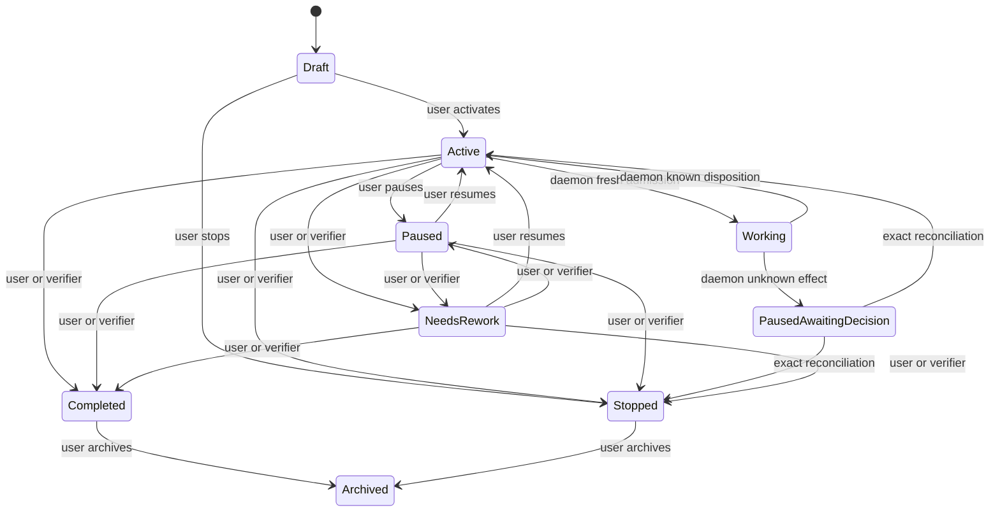

# Mandate Domain and Durable Lifecycle

## Status and scope

## Traceability

- Normative owner: architecture 13.
- Decision record: [`0006`](../decisions/0006-mandate-lifecycle-and-admission-boundary.md).
- Detail decisions: [`0001`](../decisions/0001-mandate-authority-and-fresh-run-lifecycle.md) (Mandate DTO family and limit classification), [`0002`](../decisions/0002-external-attempt-evidence-and-unknown-effect-reconciliation.md) (shared attempt-evidence family), [`0031`](../decisions/0031-autonomous-continuation-direction.md) (autonomous continuation).
- Reconciliation topics: `MAN-001..012`.
- Research provenance: [`m4plus_concept2.md`](../m4plus_concept2.md).
- Status: documentation-approved; implementation-authorized work requires a later activating specification.


**Approved future architecture, documentation-only.** This document is the
normative owner for the future Mandate aggregate, lifecycle, triggers,
fresh-run admission, uncertainty, and recovery boundary. It does not authorize
production code, a crate, a migration, a wire capability, or a scheduler.

It applies only to future `Mandate` and `VerifierMandate` execution. M3/M4
Sessions, Runs, queue tickets, provider selection, replay, tool denial, and
recovery retain their recorded ordinary semantics.

## Ownership and non-authorities

A Mandate is durable user-issued work authority. It is not a Goal, Skill,
prompt, tool permission, provider continuation, daemon, child relation, or
second runtime.

| Operation | User | Daemon | Future verifier | Explicit non-authorities |
| --- | --- | --- | --- | --- |
| Create/revise objective, scope, mode, trigger/continuation settings | Yes | No | Only later exact `ReviseFull` authority | Goal, Skill, prompt, model, provider, parent, MCP, bridge, kernel, adapter |
| Activate, pause/resume, needs-rework, complete, stop, archive | Yes | No | Only exact target/operation authority | Same |
| Capture a trigger reason | May request | Durable operational fact | No implicit right | Source observation is not authority |
| Admit a fresh run | No direct mutation | Yes, only from eligible `Active` reason | No | Same |
| Record known terminal disposition | No | Yes | No | Same |
| Record uncertainty pause | No | Yes, mandatory | No | Same |
| Reconcile exact unknown effect | Yes | No discretion | Only future exact authority | Same |

User lifecycle/revision mutations win optimistic conflicts against daemon and
verifier mutations. A rejected loser performs a scoped reread; it cannot merge
by inference, overwrite, or retry with changed meaning.

## Aggregate and identity

A Mandate owns its identity, current lifecycle, active immutable revision,
pending trigger reasons and their coalesced provenance, current non-terminal run
reference, dispositions, verified checkpoint references, uncertainty references,
and Mandate-local sequence/version.

`MandateId`, revision, trigger reason, disposition, reconciliation, operation,
and aggregate sequence are typed future values. The Mandate-local sequence is
the authoritative optimistic-concurrency and event order for Mandate facts. It
is distinct from `SessionEventSequenceDto`, `RunEventCursorDto`, and M3 queue
tickets. Run/model facts retain their existing run cursor and link to Mandates
only through typed identities.

### Mandate DTO family

The conceptual durable family is adopted as future detail:

```text
MandateDto
  mandate_id
  active_revision
  lifecycle_state
  service_session_id
  work_state_references
  verified_checkpoint_references
  child_work_graph_reference
  activity_identity

MandateRevisionDto
  mandate_id
  revision
  objective
  scope
  mode
  trigger_configuration
  goal_context_references
  continuation_configuration
  stop_conditions
  canonical_revision_digest

MandateTriggerReasonDto
  reason_id
  source_kind
  first_observed_at
  last_observed_at
  coalesced_count
  typed_references
  triggering_revision

MandateRunDispositionDto
  run_id
  terminal_kind
  next_action = Continue | AwaitUserDecision | None
  checkpoint_reference_when_verified
  external_effect_reference_when_unknown
```

All records are credential-free, typed, immutable at their selected revision,
and represented through the repository's later canonical record/version policy.
They contain no raw prompt transcript, provider resource, live kernel
namespace, process handle, MCP connection, bridge grant, credential, or
unfinished external operation. A new revision changes only future fresh-run
admission; it never rewrites historical evidence, alters the meaning of an
admitted run, or attaches a new reason to old work. `stop_conditions` records
the user-selected conditions under which a continuation stops; it is
credential-free and non-authorizing. `MandateRunDispositionDto.next_action`
records the disposition's continuation intent (`Continue`,
`AwaitUserDecision`, or `None`); it never directly schedules a run.

A Mandate revision is immutable. Revision during Mandate `Working` affects only
later fresh admission; it never changes the admitted run, selected trigger,
execution meaning, or prior evidence.

### Normative transition and cancellation boundary

The lifecycle transition set is closed and explicit: `Draft -> Active | Stopped`,
`Active -> Working | Paused | Completed | Stopped`, `Working -> Active |
PausedAwaitingDecision | Paused | Completed | Stopped`, `Paused -> Active |
NeedsRework | Completed | Stopped`, `PausedAwaitingDecision -> Active | Stopped`,
and `NeedsRework -> Active | Completed | Stopped`. `Archived` is inert. A
known run disposition may return a Mandate to `Active` only after required graph
terminalization owned by architecture 17 completes.

Cancellation is a control signal, not effect evidence. It stops new admission and
may request executor cancellation, but each attempt is classified independently:
before-start interruption/cancellation has no external effect; started work without
terminal proof is `ExternalEffectUnknown`. The run is terminalized only after
those facts are durably recorded. Unknown effect pauses only its owning Mandate;
exact reconciliation may yield only fresh `Active` work or `Stopped`, never
rollback, safe-repeat, reattachment, or old-run continuation.


## Lifecycle



- Mandate `Draft` has no admissible run.
- Mandate `Active` may admit one fresh run only when an eligible reason exists.
  Activation itself creates no run.
- Mandate `Working` means exactly one non-terminal Mandate run exists.
- Mandate `Paused` retains history and pending reasons but blocks admission.
- Mandate `PausedAwaitingDecision` is mandatory uncertainty quarantine. It
  blocks retry, reattachment, rediscovery, next model step, and automatic
  continuation.
- Mandate `NeedsRework` is a product decision, not a failure classification.
- Mandate `Completed` asserts full objective acceptance. Mandate `Stopped`
  asserts no completion.
- Mandate `Archived` is inert historical presentation. Restore/reopen is
  excluded pending a separate contract.

Verifier transitions require separately issued, target-scoped authority owned by
architecture 17. Parent/child controls do not provide verifier or general
lifecycle authority; architecture 17 owns their limited direct-parent effects.

### Deterministic eligibility ordering

“FIFO” is not a lifecycle rule. Eligible reasons use the closed total order:
explicit-user priority, `first_observed_at`, canonical `MandateId` order, then
canonical `ReasonId` order. Readiness and wakeups only cause reevaluation; they
never create a reason, `RunId`, lease, reservation, retry counter, or dispatch.


## Trigger reasons and eligibility

`MandateTriggerReason` is durable causal evidence, not an M3 queued turn, a
retry counter, a queue ticket, or a promise of immediate execution.

Each reason records a typed idempotency identity and semantic digest, source
kind, captured `triggering_revision`, first/last observation timestamps,
coalesced count, and complete typed provenance. Equal delivery returns its
existing binding; changed reuse fails before admission. A revision after capture
cannot silently retarget a reason: an inadmissible captured revision yields a
typed stale-reason result while remaining auditable.

A pending reason survives pause, capacity unavailability, crash, and restart.
While Mandate `Working`, observations may coalesce only if they retain every
source reference, earliest/latest time, count, and captured revision. Coalescing
cannot hide an explicit user reason. Missed scheduling downtime creates at most
one catch-up reason, never a fabricated burst.

Eligible selection is total: explicit user start/continuation reasons first,
then ascending `first_observed_at`, `MandateId`, and `ReasonId`. This ordering
is deterministic but does not reserve capacity or guarantee execution.

### Autonomous continuation

**Continue autonomously** creates or activates a **Build-mode Mandate** by
default (adopted as an accepted future direction by
[ADR 0031](../decisions/0031-autonomous-continuation-direction.md)). After a
known terminal run disposition, the daemon records its terminal evidence and,
when continuation remains enabled, returns the Mandate to `Active`; a pending
coalesced continuation reason then admits a completely fresh run. There is no
hidden retry count, automatic escalation threshold, or conversion of a known
failure into an unknown effect. A known non-zero `execute` exit, typed
validation failure, provider failure with durable terminal evidence, or known
MCP result is a known outcome and may lead to the next fresh run. The user
decides when a known failure means pause, stop, completion, revision, or
needs-rework, except where an explicit delegated verifier has the corresponding
operation. Build mode is the default for **Continue autonomously**; Plan mode
remains meaningfully distinct (it denies ordinary project `write`/`edit`, and
plan mutation remains its own typed plan operation). Neither mode is a sandbox
or a claim to constrain programs running with the user's ordinary OS authority.
The direction does not amend the ordinary Build Autopilot direction of ADR
0017/0018.

Architecture 16 owns readiness observations, candidate reevaluation, and
cross-Mandate scheduler coordination. This document retains reason validity,
captured revision, total ordering key, lifecycle eligibility, conflict
precedence, and the atomic admission transition. Scheduler candidates and
readiness observations cannot mutate lifecycle except by invoking that fresh
admission contract.

## Fresh admission and immutable meaning

Admission is legal only when the Mandate is `Active`, has no non-terminal
Mandate run, has an eligible valid reason, has a valid selected revision and
compatible immutable execution meaning, passes intrinsic validation, and has
actual required capacity/readiness.

One transaction atomically commits:

- a new `RunId`;
- selected reason consumption or hold;
- selected Mandate revision and safe frozen context;
- `MandateSelectionV1` and closed execution-kind/version/payload/digest
  envelope;
- Mandate and Run projections, events, snapshots, aggregate sequence/version,
  and idempotency evidence.

No provider, tool, process, network, kernel, child, MCP, bridge, or scheduler
effect occurs inside this transaction. Publication happens only after commit and
an independent Mandate-scoped durable reread.

A Mandate selection includes only credential-free references to the Mandate,
revision, reason, service-session/activity context where later defined, verified
checkpoints, and applicable frozen context. Exact canonical fields, tags,
digests, provider/registry/Skill selections, MCP initial-selection semantics,
and verifier payloads belong to later execution-meaning contracts. Missing,
corrupt, unsupported, or mismatched
meaning blocks dependent work before any effect and never falls back to current
TOML, registry, model name, provider, ancestry, or live resources.

## Transaction classes and conflicts

Every semantic mutation validates expected Mandate sequence/version and, where
relevant, expected revision and lifecycle. Equal operation identity plus equal
semantic digest returns the committed result. Changed reuse fails before a
mutation, another trigger consumption, or another RunId.

| Transaction | Atomic durable result |
| --- | --- |
| Create Mandate | identity, initial revision, Draft projection/event/snapshot, operation binding |
| Create revision | immutable revision/digest, permitted active-revision update, event/snapshot/version |
| User lifecycle transition | expected-state validation, lifecycle projection/event/snapshot, idempotency |
| Trigger capture/coalescing | reason/provenance, idempotency, eligibility projection, sequence |
| Fresh admission | selected reason, new RunId, frozen selection/meaning, Working projection and all evidence |
| Known disposition | exact terminal evidence, disposition, eligible continuation reason if selected, Active transition |
| Unknown effect | exact started-attempt evidence, uncertainty reference, PausedAwaitingDecision transition |
| Exact reconciliation | named uncertainty/baseline/evidence, idempotency, only Active or Stopped outcome |
| Capacity unavailable | observable outcome with reason retained and no admission |

A known terminal disposition may return Mandate `Working` to Mandate `Active`
only after graph-terminalization rules owned by architecture 17 complete. If an immutable
continuation configuration applies, it records a new reason; it never directly
resumes or admits the old run in that terminal transaction.

## Capacity and limits

```text
MandateLimitClassDto
  ProductCeiling
  IntrinsicBound
  CapacityAvailability

MandateCapacityOutcomeDto
  outcome = Available | Unavailable
  resource_kind
  reason
  retry_disposition
  trigger_reason_reference
  observed_at
```

`ProductCeiling` is a product counter, reservation, or quota and is forbidden
for new Mandate admission. `IntrinsicBound` is a correctness boundary of the
canonical representation, identifier, schema, ordering, framing, or atomic
commit; it remains mandatory and rejects without truncation.
`CapacityAvailability` is temporary finite runtime, storage, provider,
registry, process, kernel, or scheduler availability; it never becomes a quota
or a successful result.

An intrinsic bound rejects invalid representation, schema, identifier, ordering,
framing, or atomic-commit input without truncation. Actual finite storage,
provider, registry, process, kernel, or scheduler availability produces a typed
capacity-unavailable outcome. It preserves pending reason and history, creates
no retry counter or reservation, and may later make the same reason eligible
for fresh admission. An `Unavailable` outcome atomically preserves already
committed history, the applicable pending trigger, and its projections without
dropping, truncating, or inventing work. A later durable readiness/capacity
observation or explicit user lifecycle action may make that trigger eligible
for a fresh run only. Historical fixed limits and quota records remain readable
compatibility data and cannot synthesize a Mandate restriction.

No product quota, count, calendar cap, lifetime cap, output cap, concurrency
reservation, or escalation threshold is introduced for Mandate admission here.
Numeric limits owned by protocol, provider, tool, child, or scheduler packages
remain separately classified. This document does not resolve direct descriptor
admission or WorkspaceRoot policy.

## External attempts, recovery, and reconciliation

The closed shared attempt-evidence family is adopted as future detail:

```text
ExternalAttemptPhaseDto
  AdmittedBeforeStart
  Started
  KnownTerminal
  UnknownTerminal

ExternalAttemptEvidenceDto
  attempt_owner_kind
  attempt_reference
  phase
  durable_fact_references
  safe_effect_digest
```

Future external attempt evidence uses the Foundation phases:
`AdmittedBeforeStart`, `Started`, `KnownTerminal`, and `UnknownTerminal`.
`UnknownTerminal` classifies attempt evidence; `ExternalEffectUnknown` is the
resulting Mandate condition. A known validation failure, provider failure,
known non-zero process exit, or known MCP result is not unknown. Only
daemon-owned execution and recovery logic classifies an attempt. Before start,
a result is a known pre-effect outcome, including `InterruptedBeforeStart`;
after start without durable terminal proof, loss, cancellation, or restart
records `ExternalEffectUnknown`. Unknown evidence atomically prevents the next
model step, automatic retry or continuation, rediscovery, reattachment, and
old-work resume; for Mandate work it atomically moves `Working` to
`PausedAwaitingDecision`. Recovery writes missing terminal outcomes and the run
transition to `Interrupted` atomically and never opens another model step,
repeats a tool, or reconstructs a remote continuation. The family is shared by
`execute`, kernel/bridge, MCP discovery and invocation, provider-adjacent
external work, and child work.

Recovery completes before readiness. It preserves revisions, reasons, immutable
selections, verified checkpoints, and durable evidence. It terminalizes old
work without executing it: admitted-but-not-started work becomes a known
pre-effect interruption; started work lacking terminal proof becomes an exact
unknown effect and pauses only its owning Mandate.

Recovery never resumes, retries, reattaches, or reruns a provider request, tool
call, process, bridge operation, kernel cell/task, child run, MCP operation,
scheduler action, or other external effect. A later run has a new `RunId` and
requires fresh admission.

Reconciliation names the exact uncertainty and frozen baseline. It may produce
only Mandate `Active` for later fresh work or Mandate `Stopped`. It never
asserts rollback, absence, idempotence, repeatability, or safe replay of the old
effect.

## Persistence and protocol boundary

Future projections include a credential-free Mandate summary, a Mandate detail
snapshot, trigger eligibility/provenance, immutable run binding/selection, and
safe disposition/uncertainty references. Snapshots accelerate query/recovery;
they are not alternate authority. Events remain immutable and corrections are
new events/projections.

A future separately negotiated Mandate protocol family provides typed commands,
queries, correlated initial replay/resync/error, then Mandate-local event batches
and authoritative snapshot frames. Unnegotiated clients fail closed rather than
receive a partial ordinary Session snapshot. M3 session replay and M4 run
streaming remain unchanged, separately ordered, and linked only by typed IDs.

Exact SQL tables, migrations, event variants, wire tags, pages, retention,
crate activation, and protocol implementation are deliberately deferred.

## Compatibility, dependencies, and non-goals

M3/M4 bytes, IDs, UUIDs, digests, cursors, events, snapshots, queue tickets,
provider selection, tool-call denial, replay, and recovery remain unchanged.
No historical record gains synthetic Mandate, verifier, Skill, MCP, child,
activity, profile, policy, or execution-kind state. Legacy queued turns never
become Mandate reasons.

deferred.
This document resolves the aggregate separation in `CON-004` and applies the
Foundation limit taxonomy to Mandate lifecycle. Architecture 15 resolves
`CON-001` WorkspaceRoot and `CON-002` direct descriptor admission for future
Mandate calls only. Lifecycle retains fresh-admission eligibility and uncertainty
ownership; it does not duplicate tool-loop or scheduler rules.

It does not define tool loops, registry detail, child graph or verifier-authority
semantics, MCP capability lifecycle semantics, Goal/Skill behavior, provider profiles/Responses/reasoning,
Gateway/RLM bridge attachment semantics, IPython, forks, activity/UI, scheduler topology, schema,
migrations, crates, Cargo, or implementation policy activation.

Architecture 19 owns bridge attachment and operation correlation. A bridge
operation creates neither a trigger reason nor a `RunId`; started unproven bridge
work pauses only its owning Mandate under this document's uncertainty law. Later
work requires fresh admission and a new bridge grant/operation identity.

## Required evidence before implementation

A later implementation specification must define fixtures for:

- valid/invalid lifecycle transition matrix and authority/non-authority matrix;
- immutable revision/selection and distinct fresh-RunId continuation;
- trigger idempotency, coalescing, ordering, stale revision, and legacy-queue
  separation;
- deterministic user/daemon/verifier conflict races;
- every transaction fault point and commit/reread/publication ordering;
- before-start/started/known/unknown crash and cancellation matrix;
- exact reconciliation and no-repeat recovery across every external owner;
- capacity preservation versus intrinsic rejection and forbidden product quota;
- negotiated Mandate replay/resync and unnegotiated-peer rejection;
- M3/M4 byte/meaning preservation and no-current-state reconstruction;
- fake-secret absence from future persistence, protocol, error, log, diagnostic,
  and adapter projections; and
- end-to-end outcomes for known continuation, uncertainty pause, exact fresh
  reconciliation, user-precedence race, recovery, and historical database
  startup.

Before code, the activating package must declare exact crate owners, test
targets, coverage tiers, feature profiles, and expected-failure architecture
fixtures, then satisfy `make quick` and `make verify`.

Architecture 20 owns run-scoped kernel lifecycle. Kernel state creates neither a
trigger reason nor a `RunId`; an unproven started kernel effect uses this
document's uncertainty law, and later work requires fresh admission and a new
kernel epoch.

Architecture 21 owns Goal, Skill, context, memory, and compaction selection semantics. Those records are immutable non-authorizing evidence: project Goals require explicit session applicability links and no context record can create a Mandate reason, RunId, lifecycle transition, scheduler eligibility, or reconciliation authority.

Architecture 23 owns ordinary Session forks. A fork begins Mandate-free and
cannot create, copy, revise, admit, reconcile, or transfer a Mandate, reason,
run, or authority.

Architecture 24 owns safe activity, notification, and acknowledgement projections.
They cannot create a Mandate reason, RunId, lifecycle transition, admission, or
reconciliation result.
