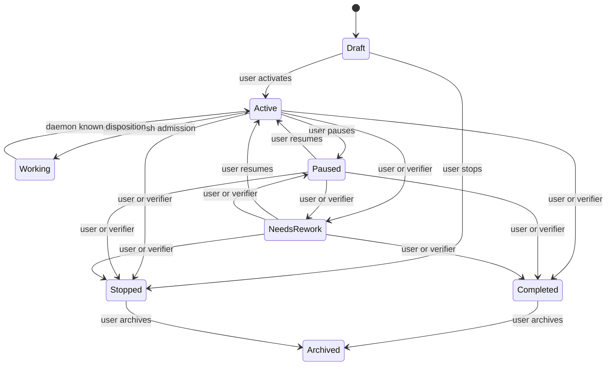

# Mandate Domain and Durable Lifecycle

**Approved future design. Not implemented; activation requires an activating specification.**

Owner: architecture 13. Decisions: ADR 0001, ADR 0006, ADR 0031, ADR 0052. Research: m4plus_concept.md.

This document owns the future Mandate aggregate, lifecycle, triggers, fresh-run admission, and recovery boundary. It
applies only to future `Mandate` and `VerifierMandate` execution. M3/M4 Sessions, Runs, queue tickets, provider
selection, replay, tool denial, and recovery retain their recorded ordinary semantics.

## Ownership and non-authorities

A Mandate is durable user-issued work authority: not a Goal, Skill, prompt, tool permission, provider continuation,
daemon, child relation, or second runtime.

| Operation | User | Daemon | Future verifier | Explicit non-authorities |
| --- | --- | --- | --- | --- |
| Create/revise objective, scope, mode, trigger/continuation settings | Yes | No | Only later exact `ReviseFull` authority | Goal, Skill, prompt, model, provider, parent, MCP, bridge, kernel, adapter |
| Activate, pause/resume, needs-rework, complete, stop, archive | Yes | No | Only exact target/operation authority | Same |
| Capture a trigger reason | May request | Durable operational fact | No implicit right | Source observation is not authority |
| Admit a fresh run | No direct mutation | Yes, only from eligible `Active` reason | No | Same |
| Record known terminal disposition | No | Yes | No | Same |

User lifecycle/revision mutations win optimistic conflicts against daemon and verifier mutations; a rejected loser
performs a scoped reread and cannot merge by inference, overwrite, or retry with changed meaning.

## Aggregate and identity

A Mandate owns its identity, current lifecycle, active immutable revision, pending trigger reasons and their coalesced
provenance, current non-terminal run reference, dispositions, verified checkpoint references, and its Mandate container
journal sequence/version.

`MandateId`, revision, trigger reason, disposition, operation, and container journal sequence are typed future values.
Mandate facts order by a Mandate container journal, the container journal of the container "Mandate
aggregate", when that container is activated. That journal orders exactly the records that belong to the Mandate
aggregate and are not records of one session, is dense within the aggregate, and is its only gap-detection token; it is
the authoritative optimistic-concurrency and event order for Mandate facts, never an identity and never an observation
position. It is not `SessionEventSequenceDto`, which orders every record committed in a session, and it is not the run
container journal, whose position type is `RunEventCursorDto`. M3 queue tickets are a queue-ordering mechanism, never an
ordering authority, and are never merged, reused, or renumbered. The Mandate aggregate is not a session record, and one
session may host more than one Mandate. Run and model facts keep their recorded session and run-container ordering and
link to Mandates only through typed identities, with no arithmetic, offsets, or conversions across authorities.

### Mandate DTO family

The conceptual durable family is adopted as future detail:

```text
MandateDto
  mandate_id
  active_revision
  lifecycle_state
  service_session_id
  work_state_references
  verified_checkpoint_references
  child_work_graph_reference
  activity_identity

MandateRevisionDto
  mandate_id
  revision
  objective
  scope
  mode
  trigger_configuration
  goal_context_references
  continuation_configuration
  stop_conditions

MandateTriggerReasonDto
  reason_id
  source_kind
  first_observed_at
  last_observed_at
  coalesced_count
  typed_references
  triggering_revision

MandateRunDispositionDto
  run_id
  terminal_kind
  next_action = Continue | AwaitUserDecision | None
  checkpoint_reference_when_verified
  partial_effect_reference_when_present
```

All records are credential-free typed serde JSON records, immutable at their selected revision, and represented through
the repository's typed JSON record policy ([ADR 0046](../decisions/0046-typed-serde-json-contracts.md)). They contain no
raw prompt transcript, provider resource, live kernel namespace, process handle, MCP connection, bridge grant,
credential, or unfinished external operation. A new revision changes only future fresh-run admission: it never rewrites
historical evidence, alters the meaning of an admitted run, or attaches a new reason to old work, and revision during
Mandate `Working` never changes the admitted run, selected trigger, execution meaning, or prior evidence.
`stop_conditions` records the user-selected conditions under which a continuation stops; it is credential-free and
non-authorizing. `MandateRunDispositionDto.next_action` records the disposition's continuation intent (`Continue`,
`AwaitUserDecision`, or `None`) and never directly schedules a run.

### Normative transition and cancellation boundary

The transition set is closed and explicit: `Draft -> Active | Stopped`, `Active -> Working | Paused | Completed |
Stopped`, `Working -> Active | Paused | Completed | Stopped`, `Paused -> Active | NeedsRework | Completed | Stopped`,
and `NeedsRework -> Active | Completed | Stopped`.
`Archived` is inert, and a known run disposition may return a Mandate to `Active` only after required graph
terminalization owned by architecture 17 completes.

Cancellation is a control signal, not effect evidence. It stops new admission and may request executor cancellation, but
each attempt is classified independently: before-start interruption/cancellation has no external effect, and started
work without terminal proof commits a bounded `Partial` result. A cancelled run is terminalized only after those facts
are durably recorded. Partial pauses no Mandate and permits the next model step; interrupted work is never rolled back,
safely repeated, reattached, or continued.

## Lifecycle


```mermaid
stateDiagram
  [*] --> Draft
  Draft --> Active: user activates
  Draft --> Stopped: user stops
  Active --> Working: daemon fresh admission
  Active --> Paused: user pauses
  Active --> NeedsRework: user or verifier
  Active --> Completed: user or verifier
  Active --> Stopped: user or verifier
  Working --> Active: daemon known disposition
  Paused --> Active: user resumes
  Paused --> NeedsRework: user or verifier
  Paused --> Completed: user or verifier
  Paused --> Stopped: user or verifier
  NeedsRework --> Active: user resumes
  NeedsRework --> Paused: user or verifier
  NeedsRework --> Completed: user or verifier
  NeedsRework --> Stopped: user or verifier
  Completed --> Archived: user archives
  Stopped --> Archived: user archives
```

- Mandate `Draft` has no admissible run.
- Mandate `Active` may admit one fresh run only when an eligible reason exists. Activation itself creates no run.
- Mandate `Working` means exactly one non-terminal Mandate run exists.
- Mandate `Paused` retains history and pending reasons but blocks admission.
- Mandate `NeedsRework` is a product decision, not a failure classification.
- Mandate `Completed` asserts full objective acceptance. Mandate `Stopped` asserts no completion.
- Mandate `Archived` is inert historical presentation. Restore/reopen is excluded pending a separate contract.

Verifier transitions require separately issued, target-scoped authority owned by architecture 17; parent/child controls
provide neither verifier nor general lifecycle authority, and architecture 17 owns their limited direct-parent effects.

### Deterministic eligibility ordering

“FIFO” is not a lifecycle rule. Eligible reasons use the closed total order: explicit-user priority,
`first_observed_at`, canonical `MandateId` order, then canonical `ReasonId` order. Readiness and wakeups only cause
reevaluation; they never create a reason, `RunId`, lease, retry counter, or dispatch.

## Trigger reasons and eligibility

`MandateTriggerReason` is durable causal evidence, not an M3 queued turn, a retry counter, a queue ticket, or a promise
of immediate execution. Each reason records a typed idempotency identity, source kind, captured `triggering_revision`,
first/last observation timestamps, coalesced count, and complete typed provenance. Equal delivery returns its existing
binding; changed reuse fails before admission. A revision after capture cannot silently retarget a reason: an
inadmissible captured revision yields a typed stale-reason result while remaining auditable.

A pending reason survives pause, capacity unavailability, crash, and restart. While Mandate `Working`, observations may
coalesce only if they retain every source reference, earliest/latest time, count, and captured revision; coalescing
cannot hide an explicit user reason, and missed scheduling downtime creates at most one catch-up reason, never a
fabricated burst. Eligible selection is total: explicit user start/continuation reasons first, then ascending
`first_observed_at`, `MandateId`, and `ReasonId`. The ordering is deterministic but claims no capacity or execution
guarantee.

### Autonomous continuation

**Continue autonomously** creates or activates a **Build-mode Mandate** by default ([ADR
0031](../decisions/0031-autonomous-continuation-direction.md)). After a known terminal run disposition, the daemon
records its terminal evidence and, when continuation remains enabled, returns the Mandate to `Active`; a pending
coalesced continuation reason then admits a completely fresh run. There is no hidden retry count or automatic
escalation threshold: a known non-zero `execute` exit, typed validation failure, provider failure with durable terminal
evidence, or known MCP result is a known outcome and may lead to the next fresh run, and the user decides when a known
failure means pause, stop, completion, revision, or needs-rework, except where an explicit delegated verifier has the
corresponding operation. Plan mode remains distinct: it denies
ordinary project `write`/`edit`, and plan mutation remains its own typed plan operation. Neither mode is a sandbox or a
claim to constrain programs running with the user's ordinary OS authority, and the direction does not amend the ordinary
Build Autopilot direction of ADR 0017/0018.

Architecture 16 owns readiness observations, candidate reevaluation, and cross-Mandate scheduler coordination; scheduler
candidates and readiness observations cannot mutate lifecycle except by invoking this document's fresh admission
contract, which retains reason validity, captured revision, total ordering key, lifecycle eligibility, conflict
precedence, and the atomic admission transition.

## Fresh admission and immutable meaning

Admission is legal only when the Mandate is `Active`, has no non-terminal Mandate run, has an eligible valid reason, has
a valid selected revision and compatible immutable execution meaning, passes intrinsic validation, and has actual
required capacity/readiness. One transaction atomically commits:

- a new `RunId`;
- selected reason consumption or hold;
- selected Mandate revision and safe frozen context;
- `MandateSelectionV1` with its closed execution-kind/version/payload fields, without envelope framing;
- Mandate and Run projections, events, snapshots, container journal sequence/version, and idempotency evidence.

No provider, tool, process, network, kernel, child, MCP, bridge, or scheduler effect occurs inside this transaction;
publication happens only after commit and an independent Mandate-scoped durable reread.

A Mandate selection includes only credential-free references to the Mandate, revision, reason, service-session/activity
context where later defined, verified checkpoints, and applicable frozen context; exact typed JSON fields,
provider/registry/Skill selections, MCP initial-selection semantics, and verifier payloads belong to later
Mandate-domain contracts ([ADR 0046](../decisions/0046-typed-serde-json-contracts.md)). Missing, corrupt, unsupported,
or mismatched meaning blocks dependent work before any effect and never falls back to current TOML, registry, model
name, provider, ancestry, or live resources.

## Transaction classes and conflicts

Every semantic mutation validates the expected Mandate container journal sequence/version and, where relevant, expected
revision and lifecycle. Equal operation identity plus equal typed request content returns the committed result; changed
reuse fails before a mutation, another trigger consumption, or another RunId.

| Transaction | Atomic durable result |
| --- | --- |
| Create Mandate | identity, initial revision, Draft projection/event/snapshot, operation binding |
| Create revision | immutable revision, permitted active-revision update, event/snapshot/version |
| User lifecycle transition | expected-state validation, lifecycle projection/event/snapshot, idempotency |
| Trigger capture/coalescing | reason/provenance, idempotency, eligibility projection, container journal sequence |
| Fresh admission | selected reason, new RunId, frozen selection/meaning, Working projection and all evidence |
| Known disposition | exact terminal evidence, disposition, eligible continuation reason if selected, Active transition |
| Capacity unavailable | observable outcome with reason retained and no admission |

A known terminal disposition may return Mandate `Working` to Mandate `Active` only after graph-terminalization rules
owned by architecture 17 complete. If an immutable continuation configuration applies, it records a new reason and never
directly resumes or admits the old run in that terminal transaction.

## Capacity and limits

```text
MandateLimitClassDto
  ProductCeiling
  IntrinsicBound
  CapacityAvailability

MandateCapacityOutcomeDto
  outcome = Available | Unavailable
  resource_kind
  reason
  retry_disposition
  trigger_reason_reference
  observed_at
```

`ProductCeiling` is a product counter, cap, or quota and is forbidden for new Mandate admission. `IntrinsicBound` is a
correctness boundary of the typed JSON representation, identifier, schema, ordering, framing, or atomic commit; it
remains mandatory and rejects without truncation. `CapacityAvailability` is temporary finite runtime, storage, provider,
registry, process, kernel, or scheduler availability; it never becomes a quota or a successful result.

An intrinsic bound rejects invalid representation, schema, identifier, ordering, framing, or atomic-commit input without
truncation. Actual finite storage, provider, registry, process, kernel, or scheduler availability produces a typed
capacity-unavailable outcome. It preserves pending reason and history, creates no retry counter or quota, and may later
make the same reason eligible for fresh admission. An `Unavailable` outcome atomically preserves already committed
history, the applicable pending trigger, and its projections without dropping, truncating, or inventing work; a later
durable readiness/capacity observation or explicit user lifecycle action may make that trigger eligible for a fresh run
only. [ADR 0048](../decisions/0048-limits-by-precedent-and-no-content-scanning.md) records the precedent-based limit
policy: every numeric value needs a real precedent, no quota or cap machinery is carried forward, and no historical
limit record is read as a Mandate restriction. No product quota, count, calendar cap, lifetime cap, output cap,
concurrency cap, or escalation threshold is introduced for Mandate admission here ([ADR
0048](../decisions/0048-limits-by-precedent-and-no-content-scanning.md)); numeric limits owned by protocol, provider,
tool, child, or scheduler packages remain separately classified, and this document resolves neither direct descriptor
admission nor WorkspaceRoot policy.

## External attempts and recovery

The closed shared attempt-evidence family is adopted as future detail:

```text
ExternalAttemptPhaseDto
  AdmittedBeforeStart
  Started
  KnownTerminal
  UnknownTerminal

ExternalAttemptEvidenceDto
  attempt_owner_kind
  attempt_reference
  phase
  durable_fact_references
  safe_effect_reference
```

Future external attempt evidence uses the Foundation phases: `AdmittedBeforeStart`, `Started`, `KnownTerminal`, and
`UnknownTerminal`. `UnknownTerminal` classifies attempt evidence; a started attempt interrupted or lost before a final
result commits a bounded `Partial` result. A known validation failure, provider failure, known non-zero process exit, or
known MCP result is not unknown; only daemon-owned execution and recovery logic classifies an attempt. Before start, a
result is a known pre-effect outcome, including `InterruptedBeforeStart`; after start without durable terminal proof,
loss, cancellation, or restart commits the output captured before the interruption as `Partial`. Partial evidence
permits the next model step and pauses no Mandate: nothing is retried, rediscovered, reattached, or resumed. Recovery
writes missing terminal outcomes and the run transition to `Interrupted` atomically and never opens another model step,
repeats a tool, or reconstructs a remote continuation. The family is shared by `execute`, kernel/bridge, MCP discovery
and invocation, provider-adjacent external work, and child work.

Recovery completes before readiness. It preserves revisions, reasons, immutable selections, verified checkpoints, and
durable evidence, and terminalizes old work without executing it: admitted-but-not-started work becomes a known
pre-effect interruption, and started work lacking terminal proof pauses nothing. A live interruption commits a bounded
partial result; a restart adds no new durable record and reports the unfinished call through a recovery notice in the
next run's model context. Recovery never resumes, retries, reattaches, or reruns a provider request, tool call, process,
bridge operation, kernel cell/task, child run, MCP operation, scheduler action, or other external effect; a later run
has a new `RunId` and requires fresh admission.

An interrupted effect is never rolled back, repeated, reattached, or resumed, and no later work asserts absence,
idempotence, repeatability, or safe replay of the old effect.

## Persistence and protocol boundary

Future projections include a credential-free Mandate summary, a Mandate detail snapshot, trigger eligibility/provenance,
immutable run binding/selection, and safe disposition references. Snapshots accelerate query/recovery but are not
alternate authority; events remain immutable and corrections are new events/projections.

Future Mandate projections are exposed through typed JSON-RPC 2.0 methods over the local socket ([ADR
0045](../decisions/0045-local-json-rpc-2-0-transport.md)): typed commands and queries, correlated results, then Mandate
container journal event batches and authoritative snapshot frames. There is no protocol capability or family gate; an
unsupported method or version returns a typed JSON-RPC error rather than a partial ordinary Session snapshot. M3 session
replay and M4 run streaming remain unchanged, ordered by the session event sequence and the run container journal
respectively, and linked only by typed IDs. Exact SQL tables, migrations, event variants, wire tags, pages, retention,
crate activation, and protocol implementation are deliberately deferred.

## Compatibility, dependencies, and non-goals

M3/M4 bytes, IDs, UUIDs, cursors, events, snapshots, queue tickets, provider selection, tool-call denial, replay, and
recovery remain unchanged. No historical record gains synthetic Mandate, verifier, Skill, MCP, child, activity, profile,
policy, or execution-kind state; legacy queued turns never become Mandate reasons. This document resolves the aggregate
separation in `CON-004` and applies the Foundation limit taxonomy to Mandate lifecycle; architecture 15 resolves
`CON-001` WorkspaceRoot and `CON-002` direct descriptor admission for future Mandate calls only.

It defines no tool loop, registry detail, child graph or verifier-authority semantics, MCP capability lifecycle
semantics, Goal/Skill behavior, provider evolution, bridge attachment, kernel lifecycle, forks, activity/UI, scheduler
topology, schema, migrations, crates, Cargo, or implementation activation. Architectures 19-24 own bridge attachment,
kernel lifecycle, Goal/Skill/context selection, forks, and activity projections; none can create a trigger reason,
`RunId`, lifecycle transition, or admission. A bridge or kernel operation creates neither a trigger reason nor a
`RunId`, and started unproven bridge or kernel work commits a bounded partial result and later requires fresh admission.

## Required evidence before implementation

Evidence: activating specification per [architecture 12](12-quality-gates-and-makefile.md).
