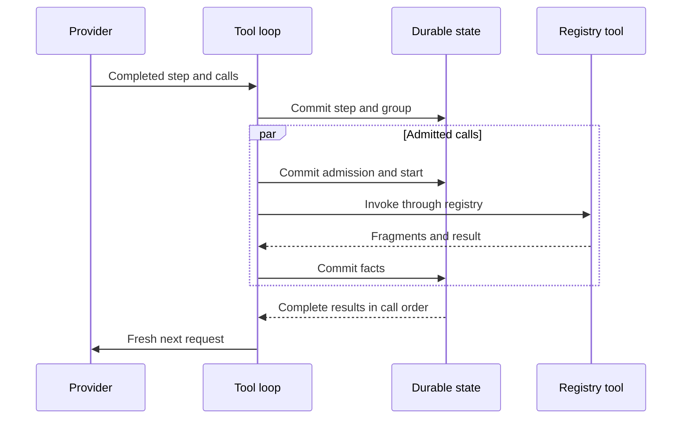

# Tool Registry and Direct Mandate Tool Loop

## Status and scope

**Approved future architecture, documentation-only.** This document is the sole detailed authority for the future unified tool registry, immutable tool selection, direct Mandate tool admission, Mandate-scoped `WorkspaceRoot` semantics, model-to-tool-to-model loop, and tool-effect recovery boundary. It does not authorize a crate, schema migration, wire implementation, runtime, or production tool execution.

It applies only to future `Mandate` execution. `VerifierMandate` does not inherit this admission policy until its later target-scoped authority package defines that relationship. M3/M4 and ordinary execution retain their recorded WorkspaceRoot containment, Plan/Build policy, confirmation behavior, tool-call denial, replay, and recovery semantics.

## Ownership and one capability path

`intention-tools` owns registry form, common typed contracts, the fixed slot list, revision validation, and duplicate rejection. Primitive owners own descriptor semantics. The composition root alone assembles active descriptors. The daemon owns active-run binding, durable orchestration, and post-commit publication. Domain/execution-meaning owns canonical records and compatibility, not concrete implementation selection.

Providers, models, adapters, bridge/kernel code, child work, MCP sources, Skills, and primitive owners cannot create a second registry, private model-function collection, direct primitive path, persistence authority, or publication authority. Every invocation reaches the one daemon-owned, Rust-owned capability path required by [decision 0004](../decisions/0004-rust-owned-capability-plane-and-fixed-tool-registry.md).

## Fixed registry and descriptor revisions

The initial registry contains exactly these fourteen slots in this canonical order:

```text
read
write
edit
execute
glob
grep
fetch_url
ask_user
todo
retrieve
plan_submit
sub_agent
expand
mcp
```

```text
ToolRegistryEntryDto
  Reserved { tool_id, intended_owner }
  Active { tool_id, intended_owner, descriptor_revision }
```

| Owner boundary | Required slots |
| --- | --- |
| `intention-tools` | `read`, `write`, `edit`, `execute`, `glob`, `grep`, `fetch_url`, `ask_user`, `todo` |
| `intention-headroom` | `retrieve` |
| `intention-plans` | `plan_submit` |
| `intention-vfr` | `expand` |
| Future child boundary | `sub_agent` |
| Future MCP boundary | `mcp` |

Each `ToolId` has one immutable intended owner and at most one active canonical descriptor. A duplicate activation, owner reassignment, omitted or reordered slot, descriptor-owner mismatch, or capability-path bypass fails before any external action. A later new `ToolId` needs a separate approved architecture and replanning decision.

A `Reserved` entry has no input/result schema, executor, model-function schema, or model visibility. A direct, stale, or malformed request for it has the known pre-effect terminal outcome `ExecutionUnavailable`. Reservation neither invents undelivered DTOs nor requires every owner to ship together. Only its intended owner may activate it through composition; activation creates new descriptor and registry revisions. Active status alone does not establish model visibility or live readiness.

An active descriptor has credential-free semantic fields for its `ToolId`, intended owner, typed input/result schema references, required model capabilities, `ToolEffectProfile`, workspace binding, mode relation, model-function schema revision, safe-result-projection revision, observation-contract revision, and stream shape. `display_name` is safe presentation metadata, not semantic identity. Public boundaries reject raw JSON/maps, unvalidated paths, provider/Python values, implementation handles, resources, and implementation errors.

`ToolEffectProfile` describes direct declared effects, including workspace read or write, process start, network retrieval, user interaction, session mutation, retained-content read, and future child controls. It is neither authority, confirmation policy, sandbox, nor a complete inventory of indirect effects.

`ToolDescriptorRevisionId`, `ToolRegistryRevisionId`, and nested selection records use the `IRCR` / `typed-tlv-v1` / SHA-256 policy owned by [Run execution meaning and historical compatibility](14-run-execution-meaning-and-historical-compatibility.md). They must not define a competing codec. Semantic changes require a new record version or tag; labels, executor handles, live readiness, and opaque owner resources are excluded from identity.

## Frozen direct tool selection

`MandateRunExecutionMeaningV1.direct_tool_selection` is a closed, credential-free `Disabled | Selected` nested selection. When selected, it contains:

- the exact `ToolRegistryRevisionId`;
- a direct-admission-engine revision limited to common typed mechanics;
- the hook-pipeline revision; and
- an ordered list of only the active descriptors actually supplied to the model, each binding `ToolId`, intended owner, descriptor revision, input/result schema references, required-capability binding, mode relation, model-function-schema revision, safe-result-projection revision, observation-contract revision, and stream shape.

The selection excludes all unexposed slots, credentials, raw schemas/JSON, executor handles, readiness, current registry state, provider-native IDs, confirmation, corridors, quotas, root-origin rules, and mutable policy state. Ordering is digest-significant and duplicate semantic keys are rejected.

An admission, replay, retry, recovery, fork, audit, or later package may not rebuild a missing selection from current registry/descriptors, configuration, model/provider name, driver availability, hook pipeline, workspace, ancestry, MCP discovery, bridge/kernel state, logs, or UI state. Unknown, corrupt, or unsupported nested selections block dependent work before effect while unrelated readable history remains available.

## Mandate direct admission and WorkspaceRoot

For a future Mandate call, direct admission is legal only when the run's frozen selection includes the exact active descriptor; the descriptor, owner, and revisions agree; typed input is valid; the immutable model-capability and mode relations are satisfied; required hooks and workspace context are valid; idempotency and intrinsic bounds pass; and required live implementation/runtime resources are available.

The only Mandate admission outcomes are `Admitted`, typed `Incompatible`, or typed `Unavailable`. `Incompatible` covers invalid input, selection/revision or capability mismatch, reserved/inactive descriptor, mode mismatch, malformed meaning, and intrinsic representation failure. `Unavailable` covers actual registry, implementation, workspace context, runtime, provider, storage, or capacity unavailability. Both are known pre-effect outcomes.

No Mandate call may enter `AwaitingConfirmation`. A compatible selected active descriptor is not gated by confirmation, risk selector, corridor, root-origin, parent, Goal, Skill, provider, MCP, prompt, model, reservation, quota, or product ceiling. Hooks remain mandatory for typed normalization, observation, redaction, mode enforcement, and lifecycle preparation, but cannot recreate a discretionary Mandate authorization layer.

The workspace rule is execution-kind-specific:

| Execution | `WorkspaceRoot` meaning |
| --- | --- |
| Existing ordinary/M3/M4 | Current containment remains authoritative. Outside-root absolute/traversal/symlink escape is rejected; process-CWD fallback is prohibited. |
| Future Mandate | Mandatory default relative base and `execute` initial CWD, not an access boundary. Absolute paths and `..` paths are not denied solely for their location. |

For Mandate path-bearing calls, typed safe observation records path form, base reference, effective path/CWD subject to redaction, inside/outside relationship, available symlink/reparse observation, and observation completeness. It is audit evidence, not authorization, and does not claim complete descendant-process tracking. Non-path tools receive no fictional workspace path. Plan artifacts remain outside `WorkspaceRoot` and require their own typed plan authorization.

Build admits otherwise compatible selected descriptors. In Plan mode, ordinary project `write` and `edit` remain incompatible, while physical-plan mutation remains a plan-owner operation. `execute` is directly admissible when otherwise compatible but is not a sandbox. `ask_user` is a normal `user_interaction` tool, not confirmation transport; after it starts, the Mandate run remains `Running`.

## Model-to-tool-to-model lifecycle

The loop belongs to one daemon-owned active run. The daemon assigns `ModelStepId`, `ToolGroupId`, and canonical `ToolCallId`; providers, adapters, and tools choose none of them. Provider-native call IDs remain private. One run has sequential model steps. A tool-calling completed step owns one non-empty ordered group; a `ToolCallId` is unique and never reused.



`ModelStepStarted`, `ModelStepCompleted`, `ToolGroupRecorded`, `ToolCallAdmissionRecorded`, `ToolCallStarted`, `ToolOutputDeltaRecorded`, and `ToolCallResultRecorded` are future typed facts. A `ToolCalls` finish closes a model step, not the run, and is valid only when the same transaction records the completed step, group, normalized calls and positions, cursor/index, projections, events, and snapshots. No local effect occurs inside that transaction.

Calls undergo independent admission and may execute concurrently. A group is not a workspace transaction and makes no serializability or merge claim. Shared run cursor order reflects durable commit order; each call's positive fragment position is contiguous only within that call. Every call has exactly one terminal result. The next model step waits for all group positions to become terminal and receives a typed `ModelToolExchangeDto` in original model call order, never completion order. Partial fragments are observable but never model context.

All provider continuations are fresh requests reconstructed from complete local typed history. Remote conversation state, opaque continuation identifiers, and provider-owned tool execution are excluded. A driver incapable of translating that local typed exchange cannot claim `model_tool_loop_v1` support.

Representation limits for group validity and output framing are intrinsic bounds or typed capacity outcomes, never Mandate product ceilings. Oversized or malformed groups fail before effects. Output cannot be partially committed; when an applicable capacity bound cannot accept a fragment, that call receives a known terminal outcome without changing other calls' order or meaning.

## Effect evidence, cancellation, and recovery

`ToolCallStarted` is the durable boundary after which an external effect may be possible. Before it, cancellation/restart records `CancelledBeforeStart` or `InterruptedBeforeStart` and no external action occurs. After it, known terminal evidence records the exact known result. A started action without durably proven terminal effect records `ExternalEffectUnknown`.

Known validation failures, denials, and known tool/process failures are not unknown effects. Tools are never automatically retried. Provider retry may not repeat a tool action or occur after durable group, admission, start, output, or result evidence. Cancellation stops further admission, suppresses late facts, and prevents a next model step.

Recovery completes before readiness. It classifies unfinished calls from durable evidence and never attaches, rediscovers, retries, resumes, or reruns a tool, process, filesystem, network, or other external action. For Mandate work, an unknown effect links the exact call/attempt evidence and moves only its owning Mandate to `PausedAwaitingDecision` under architecture 13. Exact reconciliation can permit only later fresh admission or stopping, never replay of the old call.

## Compatibility and protocol boundary

`model_tool_loop_v1` is a future separately negotiated capability. Negotiated clients receive an authoritative replay, bounded ordered tool-history pages and completion, then live frames under one publication gate. Missing/incomplete history yields resync/history-unavailable; an unnegotiated client encountering future loop facts fails closed without partial snapshot, history, or live data.

Future compact snapshots contain only safe step/group/call state, never raw output, provider-native IDs, resources, or credentials. Exact wire tags, pages, and storage schema remain deferred.

M3 session replay and M4 run streaming remain unchanged. In particular, an M4 `ToolCallRecorded` remains evidence followed by `tool_execution_unavailable`. It never starts future local execution. Historical records gain no synthetic registry, descriptor, tool-loop, Mandate, verifier, child, MCP, Skill, policy, or execution-kind state.

## Dependencies and non-goals

This document depends on Mandate lifecycle, immutable execution meaning, external-attempt evidence, and the one-capability-path decisions. Scheduler work may consume only typed live readiness of a frozen selection; it cannot select, bypass, or retry tools. Scheduler semantics are owned by architecture 16. This document does not define MCP lifecycle, child graph, verifier authority, bridge/IPython/kernel, Skills/Goals/context, scheduler topology, provider evolution, UI, schema, migrations, crates, Cargo, Makefile/CI, or production implementation.

## Required evidence before implementation

A later activating specification must define exact crate owners, test targets, coverage tiers, feature profiles, and architecture fixtures, then pass `make quick`, `make verify`, and Linux/Windows CI. It must cover:

- canonical registry/descriptor/selection golden bytes and cross-platform digests, plus missing/reordered/duplicate slot and owner/revision negatives;
- reserved-slot non-visibility/non-execution, composition-only assembly, and no-bypass fixtures;
- frozen selection and no-current-state reconstruction across registry, configuration, providers, hooks, policy, workspace, MCP, bridge, and UI;
- ordinary containment preservation versus Mandate default-base/CWD, explicit path, symlink/reparse, observation, and no-CWD-fallback outcomes;
- direct Mandate admission, impossible confirmation state, Plan-mode incompatibility, `ask_user`, hook non-authority, and typed availability;
- atomic step/group/admission/start/fragment/result fault injection, no effect before commit, post-commit reread publication, and concurrent completion ordering;
- fragment/terminal integrity, partial-result exclusion from model context, and intrinsic/capacity bound behavior;
- before-start/started/known/unknown cancellation, crash and restart outcomes, no retries/reattach/resume, Mandate uncertainty pause, and exact fresh reconciliation;
- negotiated/unnegotiated replay, paging, cursor capture, live-frame gating, resync, and historical M4 denial preservation; and
- fake-secret, unsafe-path, raw-corrupt-byte, SDK-resource, and provider-native identifier absence from identities, persistence, protocol, logs, diagnostics, adapters, and model projections.
