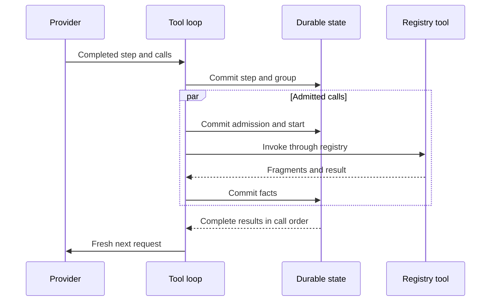

# Tool Registry and Direct Mandate Tool Loop

## Status and scope

## Traceability

- Normative owner: architecture 15.
- Decision record: [`0007`](../decisions/0007-unified-tool-registry-and-direct-mandate-tool-admission.md).
- Detail decision: [`0025`](../decisions/0025-base-tool-contracts-and-tool-loop-bounds.md) (base-tool contracts and tool-loop bounds).
- Reconciliation topics: `TLS-002..011, MTL-001..007`.
- Research provenance: [`m4plus_concept.md`](../m4plus_concept.md).
- Status: documentation-approved; implementation-authorized work requires a later activating specification.


**Approved future architecture, documentation-only.** This document is the sole detailed authority for the future unified tool registry, immutable tool selection, direct Mandate tool admission, Mandate-scoped `WorkspaceRoot` semantics, model-to-tool-to-model loop, and tool-effect recovery boundary. It does not authorize a crate, schema migration, wire implementation, runtime, or production tool execution.

It applies to future `Mandate` execution and the accepted Build Autopilot
execution policy. `VerifierMandate` does not inherit this admission policy until
its later target-scoped authority package defines that relationship. M3/M4
historical behavior remains unchanged. Build Autopilot and Mandate execution
use direct admission without per-action confirmation; Plan still denies
ordinary project `write`/`edit`, while Plan `execute` is advisory-guided and
non-sandboxed.

## Ownership and one capability path

`intention-tools` owns registry form, common typed contracts, the fixed slot list, revision validation, and duplicate rejection. Primitive owners own descriptor semantics. The composition root alone assembles active descriptors. The daemon owns active-run binding, durable orchestration, and post-commit publication. Domain/execution-meaning owns canonical records and compatibility, not concrete implementation selection.

Providers, models, adapters, bridge/kernel code, child work, MCP sources, Skills, and primitive owners cannot create a second registry, private model-function collection, direct primitive path, persistence authority, or publication authority. Every invocation reaches the one daemon-owned, Rust-owned capability path required by [decision 0004](../decisions/0004-rust-owned-capability-plane-and-fixed-tool-registry.md).

## Fixed registry and descriptor revisions

The initial registry contains exactly these fourteen slots in this canonical order:

```text
read
write
edit
execute
glob
grep
fetch_url
ask_user
todo
retrieve
plan_submit
sub_agent
expand
mcp
```

```text
ToolRegistryEntryDto
  Reserved { tool_id, intended_owner }
  Active { tool_id, intended_owner, descriptor_revision }
```

| Owner boundary | Required slots |
| --- | --- |
| `intention-tools` | `read`, `write`, `edit`, `execute`, `glob`, `grep`, `fetch_url`, `ask_user`, `todo` |
| `intention-headroom` | `retrieve` |
| `intention-plans` | `plan_submit` |
| `intention-vfr` | `expand` |
| Future child boundary | `sub_agent` |
| Future MCP boundary | `mcp` |

Each `ToolId` has one immutable intended owner and at most one active canonical descriptor. A duplicate activation, owner reassignment, omitted or reordered slot, descriptor-owner mismatch, or capability-path bypass fails before any external action. A later new `ToolId` needs a separate approved architecture and replanning decision.

A `Reserved` entry has no input/result schema, executor, model-function schema, or model visibility. A direct, stale, or malformed request for it has the known pre-effect terminal outcome `ExecutionUnavailable`. Reservation neither invents undelivered DTOs nor requires every owner to ship together. Only its intended owner may activate it through composition; activation creates new descriptor and registry revisions. Active status alone does not establish model visibility or live readiness.

An active descriptor has credential-free semantic fields for its `ToolId`, intended owner, typed input/result schema references, required model capabilities, `ToolEffectProfile`, workspace binding, mode relation, model-function schema revision, safe-result-projection revision, observation-contract revision, and stream shape. It also declares `model_schema_availability`: whether it can supply a code-owned function schema to a compatible model subset. Active status alone does not establish model visibility or live readiness. `display_name` is safe presentation metadata, not semantic identity. Public boundaries reject raw JSON/maps, unvalidated paths, provider/Python values, implementation handles, resources, and implementation errors.

`ToolEffectProfile` describes direct declared effects, including workspace read or write, process start, network retrieval, user interaction, session mutation, retained-content read, and future child controls. It is neither authority, confirmation policy, sandbox, nor a complete inventory of indirect effects.

The initial required effect-profile flag mapping is:

| `ToolId` | Direct effect flags |
| --- | --- |
| `read`, `glob`, `grep`, `expand` | `workspace_read` |
| `write` | `workspace_write` |
| `edit` | `workspace_read`, `workspace_write` |
| `execute` | `process_start` |
| `fetch_url` | `network_retrieval` |
| `ask_user` | `user_interaction` |
| `todo`, `plan_submit` | `session_state_mutation` |
| `retrieve` | `retained_content_read` |
| `sub_agent` | `child_agent_start`, `child_agent_control` |
| `mcp` | `process_start`, `network_retrieval` |

The profile states only the primitive's direct declared capability;
`process_start` does not claim a shell program cannot read/write/start
descendants/access network, and `network_retrieval` does not claim
side-effect-free remote retrieval. No flag itself requires confirmation.
`WorkspaceRoot` is required for `read`, `write`, `edit`, `execute`, `glob`,
`grep`, and `expand` (default base for relative paths and initial CWD for
`execute`, not an access boundary; absolute paths and `..` are accepted, with no
path-based denial). `fetch_url`, `ask_user`, `todo`, `retrieve`, `plan_submit`,
`sub_agent`, and `mcp` get no fictional workspace path; their owners may instead
require a typed URL, question, todo, retained-content, plan, child-agent, or
MCP-method reference. In Plan mode, ordinary
`write`/`edit` are denied; plan mutation remains plan-policy work.

`ToolDescriptorRevisionId`, `ToolRegistryRevisionId`, and nested selection records use the `IRCR` / `typed-tlv-v1` / SHA-256 policy owned by [Run execution meaning and historical compatibility](14-run-execution-meaning-and-historical-compatibility.md). They must not define a competing codec. Semantic changes require a new record version or tag; labels, executor handles, live readiness, and opaque owner resources are excluded from identity.

## Base-tool initial contracts

The first-scope initial contracts for the base tools are:

- **`execute`** takes one `ShellCommandTextDto` value; a private
  descriptor-selected local shell adapter interprets it, and the executable
  path, platform resource, and parser never cross a public DTO boundary. Shell
  syntax (pipelines, redirects, compound commands) is part of the descriptor's
  versioned semantics. `stdout`, `stderr`, and exit status remain separate typed
  result fields before the bounded durable stream and safe projection; they are
  never reconstructed from a formatted text footer. `execute` runs with the
  user's ordinary OS authority and `WorkspaceRoot` CWD, is not a sandbox, and
  makes no claim to enumerate all effects.
- **`fetch_url`** is network retrieval only. The closed first request form
  permits only `GET` and `HEAD` over `HTTP` or `HTTPS`; no request body,
  request header map, cookie jar, credential source, URL userinfo, or
  non-HTTP(S) scheme. It permits every HTTP(S) address including public,
  private, and literal loopback; it is deliberately not a local-network
  boundary and does not relax the separate provider-endpoint policy. Redirects
  remain retrievals under the same restrictions with a descriptor-fixed
  bounded limit. The typed result distinguishes final URL, status, safe
  content metadata, and bounded body; arbitrary response headers are not
  model-visible by default.
- **`ask_user`** is a normal long-running tool with `user_interaction`, not an
  `AwaitingConfirmation` policy outcome. Once `ToolCallStarted`, the post-M4
  run stays `Running`; other independently admitted calls may complete
  concurrently, and the next model step waits for this question's terminal
  safe result with every other group result. It does not transition the
  post-M4 run to `WaitingInput` and does not rewrite M3/M4 `WaitingInput`
  snapshots, facts, or recovery.

The trusted-local model is explicit: the daemon, agent, IPython kernel, child
agents, and Rust tools run with the same OS permissions as the user who starts
the daemon. There is no agent sandbox, container/VM isolation, privilege
separation, or restricted Python sidecar. `WorkspaceRoot`, Plan/Build mode,
confirmation, hooks, audit, redaction, and the capability plane are logical
product/safety policies, not security boundaries against a malicious or
compromised program running as the user. An IPython kernel can bypass the
facade via `pathlib`, `os`, and `subprocess`; this is an accepted property.
Future work must not describe the facade, tool gateway, prompt policy, or
audit trail as OS-level isolation.

## Frozen direct tool selection

`MandateRunExecutionMeaningV1.direct_tool_selection` is a closed, credential-free `Disabled | Selected` nested selection. When selected, it contains:

- the exact `ToolRegistryRevisionId`;
- a direct-admission-engine revision limited to common typed mechanics;
- the hook-pipeline revision; and
- an ordered list of only the active descriptors actually supplied to the model, each binding `ToolId`, intended owner, descriptor revision, input/result schema references, required-capability binding, mode relation, model-function-schema revision, safe-result-projection revision, observation-contract revision, and stream shape.

The selection excludes all unexposed slots, credentials, raw schemas/JSON, executor handles, readiness, current registry state, provider-native IDs, confirmation, corridors, quotas, root-origin rules, and mutable policy state. Ordering is digest-significant and duplicate semantic keys are rejected.

An admission, replay, retry, recovery, fork, audit, or later package may not rebuild a missing selection from current registry/descriptors, configuration, model/provider name, driver availability, hook pipeline, workspace, ancestry, MCP discovery, bridge/kernel state, logs, or UI state. Unknown, corrupt, or unsupported nested selections block dependent work before effect while unrelated readable history remains available.

## Validation ownership and limit classification

Validation is layered: transport owns wire shape and negotiation; this package
owns fixed slots, descriptor revisions, selection ordering, and direct admission;
architecture 14 owns canonical bytes and semantic digests; runtime/application
owns live readiness and mode preconditions; each primitive owner validates typed
inputs/outputs; storage owns persistence constraints. No layer may bypass or
replace another layer's authority.

Every numeric value is classified before activation as an intrinsic
representation/protocol bound, typed capacity availability, ordinary/historical
product policy, or deferred. A future Mandate product ceiling, retry budget,
reservation, or successful-result truncation is not permitted.

## Mandate direct admission and WorkspaceRoot

For a future Mandate call, direct admission is legal only when the run's frozen selection includes the exact active descriptor; the descriptor, owner, and revisions agree; typed input is valid; the immutable model-capability and mode relations are satisfied; required hooks and workspace context are valid; idempotency and intrinsic bounds pass; and required live implementation/runtime resources are available.

The only Mandate admission outcomes are `Admitted`, typed `Incompatible`, or typed `Unavailable`. `Incompatible` covers invalid input, selection/revision or capability mismatch, reserved/inactive descriptor, mode mismatch, malformed meaning, and intrinsic representation failure. `Unavailable` covers actual registry, implementation, workspace context, runtime, provider, storage, or capacity unavailability. Both are known pre-effect outcomes.

No Mandate call may enter `AwaitingConfirmation`. A compatible selected active descriptor is not gated by confirmation, risk selector, corridor, root-origin, parent, Goal, Skill, provider, MCP, prompt, model, reservation, quota, or product ceiling. Hooks remain mandatory for typed normalization, observation, redaction, mode enforcement, and lifecycle preparation, but cannot recreate a discretionary Mandate authorization layer.

The workspace rule is execution-kind-specific:

| Execution | `WorkspaceRoot` meaning |
| --- | --- |
| Existing ordinary/M3/M4 | Current containment remains authoritative. Outside-root absolute/traversal/symlink escape is rejected; process-CWD fallback is prohibited. |
| Future Mandate | Mandatory default relative base and `execute` initial CWD, not an access boundary. Absolute paths and `..` paths are not denied solely for their location. |

For Mandate path-bearing calls, typed safe observation records path form, base reference, effective path/CWD subject to redaction, inside/outside relationship, available symlink/reparse observation, and observation completeness. It is audit evidence, not authorization, and does not claim complete descendant-process tracking. Non-path tools receive no fictional workspace path. Plan artifacts remain outside `WorkspaceRoot` and require their own typed plan authorization.

Build admits otherwise compatible selected descriptors. In Plan mode, ordinary project `write` and `edit` remain incompatible, while physical-plan mutation remains a plan-owner operation. `execute` is directly admissible when otherwise compatible but is not a sandbox. `ask_user` is a normal `user_interaction` tool, not confirmation transport; after it starts, the Mandate run remains `Running`.

## Model-to-tool-to-model lifecycle

The loop belongs to one daemon-owned active run. The daemon assigns `ModelStepId`, `ToolGroupId`, and canonical `ToolCallId`; providers, adapters, and tools choose none of them. Provider-native call IDs remain private. One run has sequential model steps; this first scope adds no numeric step limit. A tool-calling completed step owns one non-empty ordered group; a `ToolCallId` is unique and never reused. A group contains at most **16 calls**; a provider step that emits more than 16 calls fails closed before any local effect with the typed `provider_tool_group_invalid` outcome. The same closed outcome applies to a step that has calls but lacks the `ToolCalls` closing reason, a `ToolCalls` reason without calls, a duplicate or malformed group, or later provider facts for an already closed step.



`ModelStepStarted`, `ModelStepCompleted`, `ToolGroupRecorded`, `ToolCallAdmissionRecorded`, `ToolCallStarted`, `ToolOutputDeltaRecorded`, and `ToolCallResultRecorded` are future typed facts. A `ToolCalls` finish closes a model step, not the run, and is valid only when the same transaction records the completed step, group, normalized calls and positions, cursor/index, projections, events, and snapshots. No local effect occurs inside that transaction.

Calls undergo independent admission and may execute concurrently. A group is not a workspace transaction and makes no serializability or merge claim. Shared run cursor order reflects durable commit order; each call's positive fragment position is contiguous only within that call. Every call has exactly one terminal result. The next model step waits for all group positions to become terminal and receives a typed `ModelToolExchangeDto` in original model call order, never completion order. Partial fragments are observable but never model context.

All provider continuations are fresh requests reconstructed from complete local typed history. Remote conversation state, opaque continuation identifiers, and provider-owned tool execution are excluded. A driver incapable of translating that local typed exchange cannot claim `model_tool_loop_v1` support.

Representation limits for group validity and output framing are intrinsic bounds or typed capacity outcomes, never Mandate product ceilings. Oversized or malformed groups fail before effects. Output cannot be partially committed; when an applicable capacity bound cannot accept a fragment, that call receives a known terminal outcome without changing other calls' order or meaning.

### Fragment stream, terminal outcomes, and bounds

Each call produces one ordered stream of `ToolOutputDeltaRecorded` facts followed
by exactly one `ToolCallResultRecorded` terminal fact. An output delta contains
the `ToolCallId`, a positive per-call fragment position, and normalized safe
content. Position among all facts is the shared `RunEventCursorDto`; the
fragment position orders fragments within one call only. Duplicate, missing,
non-contiguous, post-terminal, wrong-group, or untyped fragments fail closed as
`tool_result_stream_invalid`.

Every accepted fragment is committed immediately as its own durable fact; the
daemon performs an independent durable reread and then publishes to normal run
subscribers. A fragment is never inserted into the next model request by itself;
only the terminal safe result projection of every call becomes model context
after the whole group completes.

The first-scope bounds are:

- the existing **512 KiB** individual canonical-fact bound applies to every
  fragment;
- all output fragments and successful result content in one group share a
  **4 MiB** combined canonical-content limit, consumed in actual durable commit
  order, with no equal reservation by call and no dependence on later scheduler
  reconstruction;
- content is never truncated or partly committed; if the next fragment cannot
  fit, it is not written and only its call receives the terminal
  `tool_output_limit_exceeded` outcome, while remaining calls continue; and
- a small closed terminal outcome remains representable after budget
  exhaustion.

The closed initial terminal outcome taxonomy is: `Succeeded`,
`DeniedBeforeExecution`, `FailedBeforeExternalEffect`, `CancelledBeforeStart`,
`InterruptedBeforeStart`, `OutputLimitExceeded`, `ExecutionUnavailable`, and
`ExternalEffectUnknown`. It carries only safe model-visible projection and
approved typed metadata; no value silently changes category during replay.
`Succeeded`, known denials, known pre-effect failures, and the output-limit
outcome may enter the next typed exchange; an `ExternalEffectUnknown` result
never permits another model step.

### Tool history replay and negotiation

Run snapshots contain only a compact safe summary of active step/group/call
state; no tool-output text, full terminal content, raw tool results,
model-visible projection text, provider-native correlation data, or
implementation resources. Tool facts retain the shared run cursor and are
available for bounded tail replay.

`model_tool_loop_v1` is a separately negotiated protocol and descriptor/model
capability. After the correlated `RunReplayDto`, a subscribing negotiated client
receives uncorrelated `RunToolHistoryPageDto` frames: one fixed session/run
identity, a captured upper cursor, non-empty ascending tool facts, bounded by
the existing **256 facts and 512 KiB per page**. The final
`RunToolHistoryCompletedDto` repeats the identity and upper cursor. The
publication gate serializes `RunReplayDto`, tool-history pages, completion, then
live frames. When the same subscription also negotiates the normalized
reasoning stream, the combined gate serializes `RunReplayDto`, reasoning pages
and completion, tool-history pages and completion, then live frames; if either
history class is absent, its pages and completion frame are omitted and the
remaining frames retain this order. Sparse shared cursors are valid. Missing or
incomplete history requires typed resynchronization and never causes a live-tool
retry.

An unnegotiated client subscribing to a run containing post-M4 model-tool-loop
facts fails closed with `model_tool_loop_required`, never a partially understood
snapshot or live stream. Historical M4 runs retain old replay behavior and
`tool_execution_unavailable` semantics byte-for-byte. New run-selection
provenance records the negotiated `model_tool_loop_v1` capability and the
descriptor/model support needed to reconstruct local exchanges.

## Model progress deadline

`model_stream_progress_timeout_v1` is the selected future model-step policy for
all post-M4 model-tool-loop steps, including roots and children. It does not
reinterpret or alter M4's existing absolute provider-attempt deadline.

After a future request is sent to a provider, the first non-empty `TextDelta`
or `ReasoningDelta` must arrive within sixty seconds. The same sixty-second
deadline applies between later such deltas. Only non-empty text and reasoning
deltas reset the deadline; `Started`, usage, and other non-content facts do not.
An accepted `ToolCall` or `Finished` before the deadline ends the provider phase
normally. The progress deadline is active only while a provider stream for a
model step is open. It is paused while a tool or foreground kernel cell runs,
confirmation or `ask_user` awaits, `AwaitResult` waits for a child, a retry
delay runs, or the run is completing or cancelling.

For future post-M4 steps, this progress deadline replaces the absolute attempt
deadline: a continuously producing stream has no additional fixed step duration.
Before the first durable content or other irreversible fact, exactly one retry
is permitted after `model_stream_progress_timeout`. After such a fact, no retry
is permitted. A simultaneously committed user cancellation wins the race. A
timeout otherwise produces a safe failed outcome, suppresses late fragments, and
never claims success or resumes work after restart.

The progress deadline is a model-step policy owned by this document. It is
referenced by the continual-harness execution classes under
[architecture 26](26-continual-harness.md) and by the programmatic-caller
policy under [architecture 27](27-programmatic-caller-policy-and-admission.md);
neither may weaken it. A timeout outcome is a known typed failure before an
external effect when no irreversible fact preceded it, and `ExternalEffectUnknown`
when a started effect lacks durable terminal proof.

## Effect evidence, cancellation, and recovery

`ToolCallStarted` is the durable boundary after which an external effect may be possible. Before it, cancellation/restart records `CancelledBeforeStart` or `InterruptedBeforeStart` and no external action occurs. After it, known terminal evidence records the exact known result. A started action without durably proven terminal effect records `ExternalEffectUnknown`.

Known validation failures, denials, and known tool/process failures are not unknown effects. Tools are never automatically retried. Provider retry may not repeat a tool action or occur after durable group, admission, start, output, or result evidence. Cancellation stops further admission, suppresses late facts, and prevents a next model step.

Recovery completes before readiness. It classifies unfinished calls from durable evidence and never attaches, rediscovers, retries, resumes, or reruns a tool, process, filesystem, network, or other external action. For Mandate work, an unknown effect links the exact call/attempt evidence and moves only its owning Mandate to `PausedAwaitingDecision` under architecture 13. Exact reconciliation can permit only later fresh admission or stopping, never replay of the old call.

## Compatibility and protocol boundary

`model_tool_loop_v1` is a future separately negotiated capability. Negotiated clients receive an authoritative replay, bounded ordered tool-history pages and completion, then live frames under one publication gate. Missing/incomplete history yields resync/history-unavailable; an unnegotiated client encountering future loop facts fails closed without partial snapshot, history, or live data.

Future compact snapshots contain only safe step/group/call state, never raw output, provider-native IDs, resources, or credentials. Exact wire tags, pages, and storage schema remain deferred.

M3 session replay and M4 run streaming remain unchanged. In particular, an M4 `ToolCallRecorded` remains evidence followed by `tool_execution_unavailable`. It never starts future local execution. Historical records gain no synthetic registry, descriptor, tool-loop, Mandate, verifier, child, MCP, Skill, policy, or execution-kind state.

## Dependencies and non-goals

This document depends on Mandate lifecycle, immutable execution meaning, external-attempt evidence, and the one-capability-path decisions. Scheduler work may consume only typed live readiness of a frozen selection; it cannot select, bypass, or retry tools. Scheduler semantics are owned by architecture 16. Architecture 17 owns child creation/control/result semantics and verifier authority; this document retains only the `sub_agent` slot, descriptor, admission, and generic tool-effect boundary. Architecture 18 owns the `mcp` descriptor's source/discovery/capability/invocation semantics; this document retains fixed-slot, descriptor, direct-admission, and generic loop ownership. Architecture 19 owns Gateway/RLM attachment, grants, bridge operation correlation, and bridge-visible delivery; its ingress must use this document's frozen descriptor selection, admission, `ToolCallId`, start/result facts, and post-commit reread publication without bypass or duplication. Tool admission never grants target-mutation authority. This document does not define bridge/IPython/kernel, Skills/Goals/context, scheduler topology, provider evolution, UI, schema, migrations, crates, Cargo, Makefile/CI, or production implementation.

## Required evidence before implementation

A later activating specification must define exact crate owners, test targets, coverage tiers, feature profiles, and architecture fixtures, then pass `make quick`, `make verify`, and Linux/Windows CI. It must cover:

- canonical registry/descriptor/selection golden bytes and cross-platform digests, plus missing/reordered/duplicate slot and owner/revision negatives;
- reserved-slot non-visibility/non-execution, composition-only assembly, and no-bypass fixtures;
- frozen selection and no-current-state reconstruction across registry, configuration, providers, hooks, policy, workspace, MCP, bridge, and UI;
- ordinary containment preservation versus Mandate default-base/CWD, explicit path, symlink/reparse, observation, and no-CWD-fallback outcomes;
- direct Mandate admission, impossible confirmation state, Plan-mode incompatibility, `ask_user`, hook non-authority, and typed availability;
- atomic step/group/admission/start/fragment/result fault injection, no effect before commit, post-commit reread publication, and concurrent completion ordering;
- fragment/terminal integrity, partial-result exclusion from model context, and intrinsic/capacity bound behavior;
- before-start/started/known/unknown cancellation, crash and restart outcomes, no retries/reattach/resume, Mandate uncertainty pause, and exact fresh reconciliation;
- negotiated/unnegotiated replay, paging, cursor capture, live-frame gating, resync, and historical M4 denial preservation; and
- fake-secret, unsafe-path, raw-corrupt-byte, SDK-resource, and provider-native identifier absence from identities, persistence, protocol, logs, diagnostics, adapters, and model projections.

Architecture 20 kernel host requests consume this document's frozen descriptor
selection, direct admission, `ToolCallId`, start/result facts, and publication
path. Kernel execution is not a new ToolId, registry, or primitive bypass.

Architecture 21 owns Goal, Skill, context, memory, and compaction semantics. Context projections may inform a model step only through immutable selected safe representations; they cannot add a descriptor, ToolId, direct admission exception, WorkspaceRoot authority, ToolCallId, or retry path.

Architecture 22 owns provider/profile/capability and reasoning semantics. A
provider may normalize a tool call only when the immutable capability selection
declares `model_tool_loop_v1`; it cannot assign local IDs, use provider-built-in
tools, create a registry, or bypass the frozen local exchange.

Architecture 23 may preserve terminal tool provenance only as non-authorizing
frozen fork evidence. It cannot execute, retry, resume, or rebuild a tool
selection from current registry state.

Architecture 24 may project safe tool provenance but cannot create ToolIds,
descriptors, ToolCallIds, admission, effects, retries, or current-registry repair.
