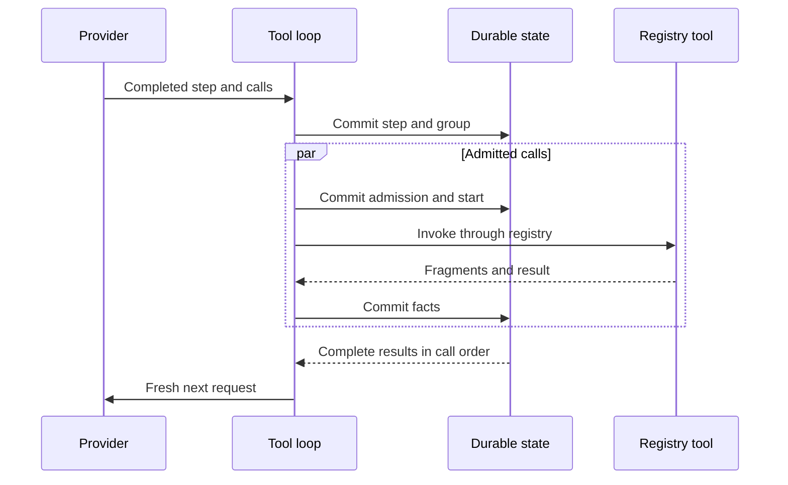

# Tool Registry and Direct Mandate Tool Loop

**Approved future design. Not implemented; activation requires an activating specification.**

Owner: architecture 15. Decisions: ADR 0007, ADR 0025. Research: m4plus_concept.md.

This document owns the unified tool registry, immutable tool selection, direct Mandate tool admission, Mandate
`WorkspaceRoot` semantics, the model-tool-model loop, and the tool-effect recovery boundary. It applies to future
`Mandate` execution and Build Autopilot; `VerifierMandate` does not inherit this policy until its target-scoped
authority package defines that relationship. M3/M4 behavior is unchanged. Build Autopilot and Mandates admit tools
directly without per-action confirmation; Plan denies ordinary `write`/`edit`, while Plan `execute` is advisory-guided
and non-sandboxed.

## Ownership and one capability path

`intention-tools` owns registry form, common typed contracts, the fixed slot list, revision validation, and duplicate
rejection. Primitive owners own descriptor semantics; the composition root alone assembles active descriptors; the
daemon owns active-run binding, durable orchestration, and post-commit publication; domain owns typed JSON record
shapes, not implementation selection.

Providers, models, adapters, bridge/kernel code, child work, MCP sources, Skills, and primitive owners cannot create a
second registry, private model-function collection, direct primitive path, persistence authority, or publication
authority. Every invocation reaches the one daemon-owned, Rust-owned capability path required by [decision
0004](../decisions/0004-rust-owned-capability-plane-and-fixed-tool-registry.md).

## Fixed registry and descriptor revisions

The initial registry contains exactly these fourteen slots in this canonical order:

```text
read
write
edit
execute
glob
grep
fetch_url
ask_user
todo
retrieve
plan_submit
sub_agent
expand
mcp
```

```text
ToolRegistryEntryDto
  Reserved { tool_id, intended_owner }
  Active { tool_id, intended_owner, descriptor_revision }
```

| Owner boundary | Required slots |
| --- | --- |
| `intention-tools` | `read`, `write`, `edit`, `execute`, `glob`, `grep`, `fetch_url`, `ask_user`, `todo` |
| `intention-headroom` | `retrieve` |
| `intention-plans` | `plan_submit` |
| `intention-vfr` | `expand` |
| Future child boundary | `sub_agent` |
| Future MCP boundary | `mcp` |

Each `ToolId` has one immutable intended owner and at most one active canonical descriptor; duplicate activation, owner
reassignment, omitted or reordered slot, descriptor-owner mismatch, or capability-path bypass fails before any external
action. A new `ToolId` needs a separate approved architecture and replanning decision.

A `Reserved` entry has no input/result schema, executor, model-function schema, or model visibility; a direct, stale, or
malformed request gets the known pre-effect outcome `ExecutionUnavailable`. Reservation neither invents undelivered DTOs
nor requires every owner to ship together. Only the intended owner may activate through composition, creating new
descriptor and registry revisions; active status alone establishes neither model visibility nor live readiness.

An active descriptor carries credential-free fields for `ToolId`, intended owner, typed input/result schema references,
required model capabilities, `ToolEffectProfile`, workspace binding, mode relation, model-function schema revision,
safe-result-projection revision, observation-contract revision, stream shape, and `model_schema_availability` (whether a
code-owned function schema can reach a compatible model subset). `display_name` is presentation metadata, not identity.
Public boundaries reject raw JSON/maps, unvalidated paths, provider/Python values, implementation handles, resources,
and implementation errors.

`ToolEffectProfile` describes direct declared effects: workspace read or write, process start, network retrieval, user
interaction, session mutation, retained-content read, and future child controls. It is not authority, confirmation
policy, sandbox, or a complete indirect-effect inventory. The initial mapping is:

| `ToolId` | Direct effect flags |
| --- | --- |
| `read`, `glob`, `grep`, `expand` | `workspace_read` |
| `write` | `workspace_write` |
| `edit` | `workspace_read`, `workspace_write` |
| `execute` | `process_start` |
| `fetch_url` | `network_retrieval` |
| `ask_user` | `user_interaction` |
| `todo`, `plan_submit` | `session_state_mutation` |
| `retrieve` | `retained_content_read` |
| `sub_agent` | `child_agent_start`, `child_agent_control` |
| `mcp` | `process_start`, `network_retrieval` |

The profile states direct declared capability only: `process_start` does not claim a shell program cannot
read/write/start descendants/access network, and `network_retrieval` does not claim side-effect-free remote retrieval.
No flag requires confirmation. `WorkspaceRoot` is required for `read`, `write`, `edit`, `execute`, `glob`, `grep`, and
`expand` (default relative-path base and initial `execute` CWD, not an access boundary; absolute and `..` paths are
accepted with no path-based denial). `fetch_url`, `ask_user`, `todo`, `retrieve`, `plan_submit`, `sub_agent`, and `mcp`
get no fictional workspace path; their owners may require typed URL, question, todo, retained-content, plan,
child-agent, or MCP-method references instead. Plan denies ordinary `write`/`edit`; plan mutation remains plan-policy
work.

`ToolDescriptorRevisionId`, `ToolRegistryRevisionId`, and nested selection records are typed serde JSON values (ADR
0046); the removed `IRCR` / `typed-tlv-v1` / SHA-256 canonical codec is not replaced by a competing codec. Semantic
changes require a new record version; labels, executor handles, live readiness, and opaque owner resources are excluded
from identity.

## Base-tool initial contracts

-  **`execute`** takes one `ShellCommandTextDto`; a private descriptor-selected local shell adapter interprets it, and
  the executable path, platform resource, and parser never cross a public DTO boundary. Shell syntax (pipelines,
  redirects, compound commands) is descriptor-versioned semantics. `stdout`, `stderr`, and exit status stay separate
  typed result fields before the bounded durable stream and safe projection and are never reconstructed from a formatted
  text footer. `execute` runs with the user's ordinary OS authority and `WorkspaceRoot` CWD, is not a sandbox, and
  claims no complete effect enumeration.
-  **`fetch_url`** is network retrieval only. The closed first request form permits only `GET` and `HEAD` over `HTTP` or
  `HTTPS`: no request body, header map, cookie jar, credential source, URL userinfo, or non-HTTP(S) scheme. Every
  HTTP(S) address is permitted, including public, private, and literal loopback; it is deliberately not a local-network
  boundary and does not relax the separate provider-endpoint policy. Redirects remain retrievals under the same
  restrictions with a descriptor-fixed bounded limit. The typed result distinguishes final URL, status, safe content
  metadata, and bounded body; arbitrary response headers are not model-visible by default.
-  **`ask_user`** is a normal long-running `user_interaction` tool, not an `AwaitingConfirmation` policy outcome. After
  `ToolCallStarted` the post-M4 run stays `Running`; other independently admitted calls may complete concurrently, and
  the next model step waits for this question's terminal safe result with every other group result. It never moves the
  post-M4 run to `WaitingInput` and never rewrites M3/M4 `WaitingInput` snapshots, facts, or recovery.

Trusted-local is explicit: daemon, agent, IPython kernel, child agents, and Rust tools run with the same OS permissions
as the user who starts the daemon; there is no agent sandbox, container/VM isolation, privilege separation, or
restricted Python sidecar. `WorkspaceRoot`, Plan/Build mode, confirmation, hooks, audit, redaction, and the capability
plane are logical product policies, not security boundaries against a malicious or compromised program running as the
user; an IPython kernel can bypass the facade via `pathlib`, `os`, and `subprocess`, which is accepted. Future work must
not describe the facade, tool gateway, prompt policy, or audit trail as OS-level isolation.

## Frozen direct tool selection

`MandateRunExecutionMeaningV1.direct_tool_selection` is a closed, credential-free `Disabled | Selected` nested
selection. When selected it contains:

- the exact `ToolRegistryRevisionId`;
- a direct-admission-engine revision limited to common typed mechanics;
- the hook-pipeline revision; and
-  an ordered list of only the active descriptors actually supplied to the model, each binding `ToolId`, intended owner,
  descriptor revision, input/result schema references, required-capability binding, mode relation, model-function-schema
  revision, safe-result-projection revision, observation-contract revision, and stream shape.

It excludes unexposed slots, credentials, raw schemas/JSON, executor handles, readiness, current registry state,
provider-native IDs, confirmation, quotas, root-origin rules, and mutable policy state. Ordering is semantic and
preserved by the typed record; duplicate semantic keys are rejected. Admission, replay, retry, recovery, forks, audit,
or a later package must not rebuild a missing selection from current registry/descriptors, configuration, model/provider
names, driver availability, hooks, workspace, ancestry, MCP discovery, bridge/kernel state, logs, or UI state; unknown,
corrupt, or unsupported selections block dependent work before effect while unrelated readable history remains
available.

## Validation ownership and limit classification

Validation is layered: transport owns wire shape and protocol-version equality; this package owns fixed slots,
descriptor revisions, selection ordering, and direct admission; typed serde JSON owns record shape (ADR 0046);
runtime/application owns live readiness and mode preconditions; primitive owners validate typed inputs/outputs; storage
owns persistence constraints. No layer may bypass or replace another. Every numeric value is classified before
activation as an intrinsic representation/protocol bound, typed capacity availability, or a liveness safeguard with
recorded rationale (ADR 0048); future Mandate product ceilings, retry budgets, and successful-result truncation are not
permitted.

## Mandate direct admission and WorkspaceRoot

Direct admission is legal only when the run's frozen selection includes the exact active descriptor,
descriptor/owner/revisions agree, typed input is valid, immutable model-capability and mode relations are satisfied,
required hooks and workspace context are valid, idempotency and intrinsic bounds pass, and required live
implementation/runtime resources are available.

The only Mandate admission outcomes are `Admitted`, typed `Incompatible`, or typed `Unavailable`. `Incompatible` covers
invalid input, selection/revision or capability mismatch, reserved/inactive descriptor, mode mismatch, malformed
meaning, and intrinsic representation failure; `Unavailable` covers actual registry, implementation, workspace context,
runtime, provider, storage, or capacity unavailability. Both are known pre-effect outcomes. No Mandate call may enter
`AwaitingConfirmation`: a compatible selected active descriptor is not gated by confirmation, risk selector,
root-origin, parent, Goal, Skill, provider, MCP, prompt, model, quota, or product ceiling. Hooks remain mandatory for
typed normalization, observation, redaction, mode enforcement, and lifecycle preparation but cannot recreate a
discretionary Mandate authorization layer.

The workspace rule is the same for every execution kind:

| Item | `WorkspaceRoot` meaning |
| --- | --- |
| Relative paths | Default base: `workspace_root.join(path)`. |
| `execute` | Initial CWD; the child process starts in the root. |
| glob/grep | Default scope root when no path is supplied. |
| Containment | None. The anchor does not contain: no symlink parser, containment check, or path-based denial remains, and a path inside the root may resolve outside it through a symbolic link. The typed input still rejects absolute and parent (`..`) paths — `WorkspaceRelativePathDto` for tool paths and the search-pattern validator for `glob`/`grep` patterns — as an input-shape rule, not a boundary; `WorkspaceRoot` is not a security boundary (ADR 0047). |

For path-bearing Mandate calls, typed safe observation may record path form, base reference, effective path/CWD subject
to redaction, and observation completeness: audit evidence, not authorization, neither tracking descendants nor forming
a boundary. Non-path tools receive no fictional workspace path; plan artifacts stay outside `WorkspaceRoot` under their
own typed plan authorization.

Build admits otherwise compatible selected descriptors; Plan keeps ordinary project `write`/`edit` incompatible while
physical-plan mutation stays a plan-owner operation. `execute` is directly admissible when otherwise compatible but is
not a sandbox; `ask_user` is normal `user_interaction` tooling, not confirmation transport, and the Mandate run remains
`Running` after it starts.

The project script library (`.ir/scripts`, [ADR 0042](../decisions/0042-project-script-library-for-kernel-cells.md))
follows these same Mandate semantics: its logical relative path is a default base for existing frozen descriptors and
never an access boundary, `write`/`edit` create or change a module while `execute` or a kernel foreground cell runs it,
and no new `ToolId`, registry slot, listener, or primitive path is admitted. Per-cell script-import evidence for
imported library modules publishes as run facts through this document's post-commit publication gate under architecture
20's cell rules.

## Model-to-tool-to-model lifecycle

The loop belongs to one daemon-owned active run. The daemon assigns `ModelStepId`, `ToolGroupId`, and canonical
`ToolCallId`; providers, adapters, and tools assign none of them, and provider-native call IDs remain private. Runs have
sequential model steps; this first scope adds no numeric step limit. A tool-calling completed step owns one non-empty
ordered group; a `ToolCallId` is unique and never reused. A group holds at most **16 calls**; a provider step emitting
more than 16 fails closed before any local effect with the typed `provider_tool_group_invalid` outcome. The same closed
outcome applies to a step with calls but no `ToolCalls` closing reason, a `ToolCalls` reason without calls, a duplicate
or malformed group, or later provider facts for an already closed step.


```mermaid
sequenceDiagram
  participant P as Provider
  participant L as Tool loop
  participant D as Durable state
  participant T as Registry tool

  P->>L: Completed step and calls
  L->>D: Commit step and group
  par Admitted calls
    L->>D: Commit admission and start
    L->>T: Invoke through registry
    T-->>L: Fragments and result
    L->>D: Commit facts
  end
  D-->>L: Complete results in call order
  L->>P: Fresh next request
```

`ModelStepStarted`, `ModelStepCompleted`, `ToolGroupRecorded`, `ToolCallAdmissionRecorded`, `ToolCallStarted`,
`ToolOutputDeltaRecorded`, and `ToolCallResultRecorded` are future typed facts. A `ToolCalls` finish closes a model
step, not the run, and is valid only when the same transaction records the completed step, group, normalized calls and
positions, cursor/index, projections, events, and snapshots; no local effect occurs inside it.

Calls admit independently and may execute concurrently; a group is not a workspace transaction and makes no
serializability or merge claim. Run container journal order reflects durable commit order, and each call's positive
fragment position is contiguous only within that call. Every call has exactly one terminal result; the next model step
waits for all group positions to become terminal and receives a typed `ModelToolExchangeDto` in original model call
order, never completion order. Partial fragments are observable but never model context. Provider continuations are
always fresh requests reconstructed from complete local typed history; remote conversation state, opaque continuation
identifiers, and provider-owned tool execution are excluded, and a driver that cannot translate that local typed
exchange cannot claim `model_tool_loop_v1` support.

Representation limits for group validity and output framing are intrinsic bounds or typed capacity outcomes, never
Mandate product ceilings. Oversized or malformed groups fail before effects; output is never partially committed, and a
call whose fragment cannot fit receives a known terminal outcome without changing other calls' order or meaning.

### Fragment stream, terminal outcomes, and bounds

Each call produces one ordered stream of `ToolOutputDeltaRecorded` facts followed by exactly one
`ToolCallResultRecorded` terminal fact. An output delta contains the `ToolCallId`, a positive per-call fragment
position, and normalized safe content. Position among all facts is a position in the run container journal
(`RunEventCursorDto`); the per-call fragment position is a within-call rank, not a sequence authority. Duplicate,
missing, non-contiguous, post-terminal, wrong-group, or untyped fragments fail closed as `tool_result_stream_invalid`.

Each accepted fragment commits immediately as its own durable fact; after an independent durable reread the daemon
publishes to normal run subscribers. A fragment is never inserted into the next model request by itself; only the
terminal safe result projection of every call becomes model context after the whole group completes.

The first-scope bounds are:

- the existing **512 KiB** individual durable-fact bound applies to every fragment;
-  all output fragments and successful result content in one group share a **4 MiB** combined content limit, consumed in
  actual durable commit order, with no equal per-call allocation and no dependence on later scheduler reconstruction;
-  content is never truncated or partly committed; if the next fragment cannot fit, it is not written and only its call
  receives the terminal `tool_output_limit_exceeded` outcome, while remaining calls continue; and
- a small closed terminal outcome remains representable after budget exhaustion.

The closed initial terminal outcome taxonomy is: `Succeeded`, `DeniedBeforeExecution`, `FailedBeforeExternalEffect`,
`CancelledBeforeStart`, `InterruptedBeforeStart`, `OutputLimitExceeded`, `ExecutionUnavailable`, and
`ExternalEffectUnknown`. It carries only safe model-visible projection and approved typed metadata; no value silently
changes category during replay. `Succeeded`, known denials, known pre-effect failures, and the output-limit outcome may
enter the next typed exchange; an `ExternalEffectUnknown` result never permits another model step.

### Tool history replay and subscription

Run snapshots contain only a compact safe summary of active step/group/call state; no tool-output text, full terminal
content, raw tool results, model-visible projection text, provider-native correlation data, or implementation resources.
Tool facts take a position in the run container journal and are available for bounded tail replay.

`model_tool_loop_v1` is a descriptor/model capability, not a wire capability: there is no protocol capability
negotiation or family gate (ADR 0045). After the correlated `RunSnapshotDto` result of a run subscription, the subscriber
receives `RunToolHistoryPageDto` notifications: one fixed session/run identity, a captured upper cursor, non-empty
ascending tool facts, bounded by the existing **256 facts and 512 KiB per page**. The final `RunToolHistoryCompletedDto`
repeats the identity and upper cursor. One publication gate serializes `RunSnapshotDto`, tool-history pages, completion,
then live `run.frame` notifications. When the same subscription also carries the normalized reasoning stream, the
combined gate serializes `RunSnapshotDto`, reasoning pages and completion, tool-history pages and completion, then live
frames; if either history class is absent, its pages and completion frame are omitted and the remaining frames keep this
order. Sparse positions are valid within the tool-history page subset only, never for the run container journal itself,
which stays dense within its container; missing or incomplete history requires typed resynchronization and never causes
a live-tool retry.

A subscriber to a run containing post-M4 model-tool-loop facts receives the complete typed history or a typed error,
never a partially understood snapshot or live stream. Historical M4 runs retain old replay behavior and
`tool_execution_unavailable` semantics byte-for-byte. New run-selection provenance records the descriptor/model
`model_tool_loop_v1` support needed to reconstruct local exchanges.

## Model progress deadline

`model_stream_progress_timeout_v1` is the selected future model-step policy for all post-M4 model-tool-loop steps,
including roots and children. It does not reinterpret or alter M4's existing absolute provider-attempt deadline.

After a future request is sent to a provider, the first non-empty `TextDelta` or `ReasoningDelta` must arrive within
sixty seconds; the same sixty-second deadline applies between later such deltas. Only non-empty text and reasoning
deltas reset the deadline; `Started`, usage, and other non-content facts do not. An accepted `ToolCall` or `Finished`
before the deadline ends the provider phase normally. The progress deadline is active only while a provider stream for a
model step is open; it is paused while a tool or foreground kernel cell runs, confirmation or `ask_user` awaits,
`AwaitResult` waits for a child, a retry delay runs, or the run is completing or cancelling.

For future post-M4 steps, this progress deadline replaces the absolute attempt deadline: a continuously producing stream
has no additional fixed step duration. Before the first durable content or other irreversible fact, exactly one retry is
permitted after `model_stream_progress_timeout`; after such a fact, no retry is permitted. A simultaneously committed
user cancellation wins the race. A timeout otherwise produces a safe failed outcome, suppresses late fragments, and
never claims success or resumes work after restart.

The progress deadline is a model-step policy owned by this document, referenced by the programmatic-caller policy under
[architecture 27](27-programmatic-caller-policy-and-admission.md); it may not weaken it. A timeout outcome is a known
typed failure before an external effect when no irreversible fact preceded it, and `ExternalEffectUnknown` when a
started effect lacks durable terminal proof.

## Effect evidence, cancellation, and recovery

`ToolCallStarted` is the durable boundary after which an external effect may be possible. Before it,
cancellation/restart records `CancelledBeforeStart` or `InterruptedBeforeStart` and no external action occurs; after it,
known terminal evidence records the exact known result, and a started action without durably proven terminal effect
records `ExternalEffectUnknown`. Known validation failures, denials, and known tool/process failures are not unknown
effects. Tools are never automatically retried; provider retry may not repeat a tool action or occur after durable
group, admission, start, output, or result evidence. Cancellation stops further admission, suppresses late facts, and
prevents a next model step.

Recovery completes before readiness, classifies unfinished calls from durable evidence, and never attaches, rediscovers,
retries, resumes, or reruns a tool, process, filesystem, network, or other external action. For Mandate work, an unknown
effect links the exact call/attempt evidence and moves only its owning Mandate to `PausedAwaitingDecision` under
architecture 13; exact reconciliation permits only later fresh admission or stopping, never replay of the old call.

## Compatibility and protocol boundary

`model_tool_loop_v1` is a descriptor/model capability delivered through JSON-RPC 2.0 run subscriptions (ADR 0045):
authoritative replay, bounded ordered tool-history pages and completion, then live notifications under one publication
gate. Missing or incomplete history yields resync/history-unavailable; a client that cannot represent future loop facts
receives a typed error without partial snapshot, history, or live data. Snapshots stay compact and safe; exact wire
tags, pages, and storage schema remain deferred.

M3 session replay and M4 run streaming remain unchanged. An M4 `ToolCallRecorded` remains durable tool-call evidence;
the M4-era no-tool-port `tool_execution_unavailable` denial is superseded by ADR 0038 binding decision 2, so the
model-tool-loop executor requires a tool executor and provider tool calls execute through the durable tool path.
Historical records gain no synthetic registry, descriptor, tool-loop, Mandate, verifier, child, MCP, Skill, policy, or
execution-kind state.

## Dependencies and non-goals

This document depends on Mandate lifecycle, external-attempt evidence, and the one-capability-path decisions. Scheduler
work may consume only typed live readiness of a frozen selection and cannot select, bypass, or retry tools; scheduler
semantics are owned by architecture 16. Architecture 17 owns child creation/control/result semantics and verifier
authority; this document retains only the `sub_agent` slot, descriptor, admission, and generic tool-effect boundary.
Architecture 18 owns the `mcp` descriptor's source/discovery/capability/invocation semantics; this document retains
fixed-slot, descriptor, direct-admission, and generic loop ownership. Architecture 19 owns Gateway/RLM attachment,
grants, bridge operation correlation, and bridge-visible delivery; its ingress must use this document's frozen
descriptor selection, admission, `ToolCallId`, start/result facts, and post-commit reread publication without bypass or
duplication, and tool admission never grants target-mutation authority. Architecture 20 kernel host requests consume the
same frozen descriptor selection, direct admission, `ToolCallId`, facts, and publication path; kernel execution is not a
new ToolId, registry, or primitive bypass.

Architectures 21-24 own Goal/Skill/context, provider, fork, and activity semantics; none may add a descriptor, ToolId,
direct admission exception, `WorkspaceRoot` authority, `ToolCallId`, or retry path, and context projections may inform a
model step only through immutable selected safe representations. A provider may normalize a tool call only when the
immutable capability selection declares `model_tool_loop_v1`, and it cannot assign local IDs, use provider-built-in
tools, create a registry, or bypass the frozen local exchange. Architecture 23 may preserve terminal tool provenance
only as non-authorizing frozen fork evidence and cannot rebuild a tool selection from current registry state;
architecture 24 may project safe tool provenance but cannot create ToolIds, descriptors, ToolCallIds, admission,
effects, retries, or current-registry repair. No bridge/IPython/kernel, Skills/Goals/context, scheduler topology,
provider evolution, UI, schema, migrations, crates, Cargo, Makefile/CI, or production implementation is defined here.

## Required evidence before implementation

Evidence: activating specification per [architecture 12](12-quality-gates-and-makefile.md).
