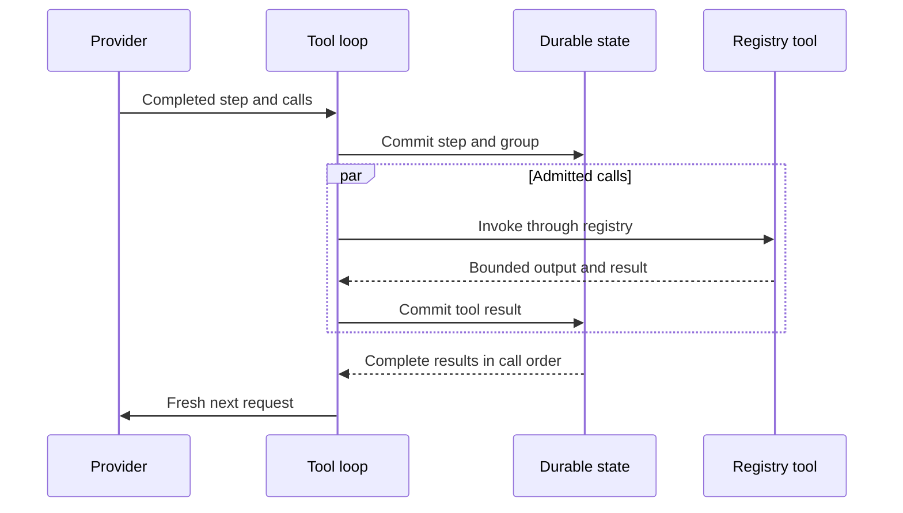

# Tool Registry and Model-Tool Loop

**Approved future design. Not implemented; activation requires an activating specification.**

Owner: architecture 15.

This document owns the unified tool registry, immutable tool selection, tool admission on the ordinary run path,
`WorkspaceRoot` semantics, the model-tool-model loop, and the tool-effect recovery boundary. It applies to future
ordinary runs and Build Autopilot. Slice 1.5 (core simplification) lands before this design activates: model steps and
tool groups are addressed by plain indices rather than newtypes, identity stays within the eight newtypes Slice 1.5
keeps, publication follows the committed values rather than a separate reread, and each descriptor's tool contract is
code-owned input and result JSON Schema text. Ordinary runs and Build Autopilot admit compatible tools without
per-action confirmation; Plan denies ordinary `write`/`edit`, while Plan `execute` is advisory-guided and
non-sandboxed.

## Ownership and one capability path

`intention-tools` owns registry form, common typed contracts, the fixed slot list, revision validation, and duplicate
rejection. Primitive owners own descriptor semantics; the composition root alone assembles active descriptors; the
daemon owns active-run binding, durable orchestration, and post-commit publication; domain owns typed JSON record
shapes, not implementation selection.

Providers, models, adapters, bridge/kernel code, child work, MCP sources, Skills, and primitive owners cannot create a
second registry, private model-function collection, direct primitive path, persistence authority, or publication
authority. Every invocation reaches the one daemon-owned, Rust-owned capability path.

## Fixed registry and descriptor revisions

The initial registry contains exactly these fourteen slots in this canonical order:

```text
read
write
edit
execute
glob
grep
fetch_url
ask_user
todo
retrieve
plan_submit
sub_agent
expand
mcp
```

```text
ToolRegistryEntryDto
  Reserved { tool_id, intended_owner }
  Active { tool_id, intended_owner, descriptor_revision }
```

| Owner boundary | Required slots |
| --- | --- |
| `intention-tools` | `read`, `write`, `edit`, `execute`, `glob`, `grep`, `fetch_url`, `ask_user`, `todo` |
| `intention-headroom` | `retrieve` |
| `intention-plans` | `plan_submit` |
| `intention-vfr` | `expand` |
| Future child boundary | `sub_agent` |
| Future MCP boundary | `mcp` |

Each `ToolId` has one immutable intended owner and at most one active canonical descriptor; duplicate activation, owner
reassignment, omitted or reordered slot, descriptor-owner mismatch, or capability-path bypass fails before any external
action. A new `ToolId` needs a separate approved architecture and replanning decision.

A `Reserved` entry has no input/result schema, executor, model-function schema, or model visibility; a direct, stale, or
malformed request gets the known pre-effect outcome `ExecutionUnavailable`. Reservation neither invents undelivered DTOs
nor requires every owner to ship together. Only the intended owner may activate through composition, creating new
descriptor and registry revisions; active status alone establishes neither model visibility nor live readiness.

An active descriptor carries credential-free fields for `ToolId`, intended owner, code-owned input and result JSON
Schema, required model capabilities, `ToolEffectProfile`, workspace binding, mode relation, model-function schema
revision, safe-result-projection revision, observation-contract revision, stream shape, and
`model_schema_availability` (whether a
code-owned function schema can reach a compatible model subset). `display_name` is presentation metadata, not identity.
Public boundaries reject raw JSON/maps, unvalidated paths, provider/Python values, implementation handles, resources,
and implementation errors.

`ToolEffectProfile` describes direct declared effects: workspace read or write, process start, network retrieval, user
interaction, session mutation, retained-content read, and future child controls. It is not authority, sandbox, or a
complete indirect-effect inventory. The initial mapping is:

| `ToolId` | Direct effect flags |
| --- | --- |
| `read`, `glob`, `grep`, `expand` | `workspace_read` |
| `write` | `workspace_write` |
| `edit` | `workspace_read`, `workspace_write` |
| `execute` | `process_start` |
| `fetch_url` | `network_retrieval` |
| `ask_user` | `user_interaction` |
| `todo`, `plan_submit` | `session_state_mutation` |
| `retrieve` | `retained_content_read` |
| `sub_agent` | `child_agent_start`, `child_agent_control` |
| `mcp` | `process_start`, `network_retrieval` |

The profile states direct declared capability only: `process_start` does not claim a shell program cannot
read/write/start descendants/access network, and `network_retrieval` does not claim side-effect-free remote retrieval.
No flag requires confirmation. `WorkspaceRoot` is required for `read`, `write`, `edit`, `execute`, `glob`, `grep`, and
`expand` (default relative-path base and initial `execute` CWD, not an access boundary; absolute and `..` paths are
accepted with no path-based denial). `fetch_url`, `ask_user`, `todo`, `retrieve`, `plan_submit`, `sub_agent`, and `mcp`
get no fictional workspace path; their owners may require typed URL, question, todo, retained-content, plan,
child-agent, or MCP-method references instead. Plan denies ordinary `write`/`edit`; plan mutation remains plan-policy
work.

`ToolDescriptorRevisionId`, `ToolRegistryRevisionId`, and selection records are typed serde JSON values
([architecture 02](02-dto-and-contract-policy.md)); the removed `IRCR` / `typed-tlv-v1` / SHA-256 canonical codec is not
replaced by a competing codec. Semantic
changes require a new record version; labels, executor handles, live readiness, and opaque owner resources are excluded
from identity.

## Base-tool initial contracts

-  **`execute`** takes one `ShellCommandTextDto`; a private descriptor-selected local shell adapter interprets it, and
  the executable path, platform resource, and parser never cross a public DTO boundary. Shell syntax (pipelines,
  redirects, compound commands) is descriptor-versioned semantics. `stdout`, `stderr`, and exit status stay separate
  typed result fields before the bounded durable stream and safe projection and are never reconstructed from a formatted
  text footer. `execute` runs with the user's ordinary OS authority and `WorkspaceRoot` CWD, is not a sandbox, and
  claims no complete effect enumeration.
-  **`fetch_url`** is network retrieval only. The closed first request form permits only `GET` and `HEAD` over `HTTP` or
  `HTTPS`: no request body, header map, cookie jar, credential source, URL userinfo, or non-HTTP(S) scheme. Every
  HTTP(S) address is permitted, including public, private, and literal loopback; it is deliberately not a local-network
  boundary and does not relax the separate provider-endpoint policy. Redirects remain retrievals under the same
  restrictions with a descriptor-fixed bounded limit. The typed result distinguishes final URL, status, safe content
  metadata, and bounded body; arbitrary response headers are not model-visible by default.
-  **`ask_user`** is a normal long-running `user_interaction` tool. After
  `ToolCallStarted` the post-M4 run stays `Running`; other independently admitted calls may complete concurrently, and
  the next model step waits for this question's terminal safe result with every other group result. It never moves the
  post-M4 run out of `Running` and never rewrites committed `messages` or `tool_results` rows or recovery state.
-  **`sub_agent`** admits one child run and returns its markdown answer. The typed input carries the bounded markdown
  task and the selected `mode`. `Sync` holds the call open until the child run reaches a terminal state and returns the
  child's terminal markdown answer as the call's result. `Async` terminates the call immediately with a `Deferred`
  outcome carrying the child session handle as plain text (a UUIDv4); the child's terminal markdown answer is recorded
  as one durable child-result fact bound to the same `ToolCallId` and delivered once into the parent's next fresh model
  request. There is no message exchange, delegation pair, clarification round trip, or `AwaitResult`. A child run is an
  ordinary run with its own lifecycle, tool loop, cancellation, and no-resume rules; a child result never starts a parent
  step, and a parent that is already terminal when the result arrives keeps it as readable durable evidence without a
  model delivery.

Trusted-local is explicit: daemon, agent, IPython kernel, child agents, and Rust tools run with the same OS permissions
as the user who starts the daemon; there is no agent sandbox, container/VM isolation, privilege separation, or
restricted Python sidecar. `WorkspaceRoot`, Plan/Build mode, hooks, audit, redaction, and the capability
plane are logical product policies, not security boundaries against a malicious or compromised program running as the
user; an IPython kernel can bypass the facade via `pathlib`, `os`, and `subprocess`, which is accepted. Future work must
not describe the facade, tool gateway, prompt policy, or audit trail as OS-level isolation.

## Frozen tool selection

A run's frozen tool selection is a closed, credential-free `Disabled | Selected` typed serde JSON record. When
selected it contains:

- the exact `ToolRegistryRevisionId`;
- a tool-admission-engine revision limited to common typed mechanics;
- the hook-pipeline revision; and
-  an ordered list of only the active descriptors actually supplied to the model, each binding `ToolId`, intended owner,
  descriptor revision, the descriptor's code-owned input and result JSON Schema text (the tool contract the model sees
  and the registry enforces), required-capability binding, mode relation, model-function-schema revision,
  safe-result-projection revision, observation-contract revision, and stream shape.

It excludes unexposed slots, credentials, untyped JSON payloads, provider-native schema forms, executor handles,
readiness, current registry state, provider-native IDs, quotas, and mutable policy state. Ordering is the descriptor
order of that list: semantic, preserved by the typed record, with no positions or cursors, and duplicate semantic keys
are rejected. Admission, retry, recovery, forks, audit, or a later package must not rebuild a missing
selection from current registry/descriptors, configuration, model/provider names, driver availability, hooks, workspace,
ancestry, MCP discovery, bridge/kernel state, logs, or UI state; unknown, corrupt, or unsupported selections block
dependent work before effect while unrelated readable history remains available.

## Validation ownership and limit classification

Validation is layered: transport owns wire shape and protocol-version equality; this package owns fixed slots,
descriptor revisions, selection ordering, and tool admission; typed serde JSON owns record shape
([architecture 02](02-dto-and-contract-policy.md)); runtime/application owns live readiness and mode preconditions;
primitive owners validate typed inputs/outputs; storage
owns persistence constraints. No layer may bypass or replace another. Every numeric value is classified before
activation as an intrinsic representation/protocol bound, typed capacity availability, or a liveness safeguard with
recorded rationale; future product ceilings, retry budgets, and successful-result truncation to fit a
ceiling are not permitted.

## Tool admission and WorkspaceRoot

Tool admission is legal only when the run's frozen selection includes the exact active descriptor,
descriptor/owner/revisions agree, typed input is valid, immutable model-capability and mode relations are satisfied,
required hooks and workspace context are valid, idempotency and intrinsic bounds pass, and required live
implementation/runtime resources are available.

The only admission outcomes are `Admitted`, typed `Incompatible`, or typed `Unavailable`. `Incompatible` covers
invalid input, selection/revision or capability mismatch, reserved/inactive descriptor, mode mismatch, malformed
meaning, and intrinsic representation failure; `Unavailable` covers actual registry, implementation, workspace context,
runtime, provider, storage, or capacity unavailability. Both are known pre-effect outcomes. A compatible selected
active descriptor is not gated by a risk selector, parent, Goal, Skill, provider, MCP, prompt, model, quota, or
product ceiling. Hooks remain mandatory for
typed normalization, observation, redaction, mode enforcement, and lifecycle preparation but cannot recreate a
discretionary authorization layer.

The workspace rule is the same for every run:

| Item | `WorkspaceRoot` meaning |
| --- | --- |
| Relative paths | Default base: `workspace_root.join(path)`. |
| `execute` | Initial CWD; the child process starts in the root. |
| glob/grep | Default scope root when no path is supplied. |
| Containment | None. The anchor does not contain: no symlink parser, containment check, or path-based denial remains, and a path inside the root may resolve outside it through a symbolic link. The typed input still rejects absolute and parent (`..`) paths — `WorkspaceRelativePathDto` for tool paths and the search-pattern validator for `glob`/`grep` patterns — as an input-shape rule, not a boundary; `WorkspaceRoot` is not a security boundary ([architecture 05](05-tools-workspace-and-hooks.md)). |

For path-bearing calls, typed safe observation may record path form, base reference, effective path/CWD subject to
redaction, and observation completeness: audit evidence, not authorization, neither tracking descendants nor forming a
boundary. Non-path tools receive no fictional workspace path; plan artifacts stay outside `WorkspaceRoot` under their
own typed plan authorization.

Build admits otherwise compatible selected descriptors; Plan keeps ordinary project `write`/`edit` incompatible while
physical-plan mutation stays a plan-owner operation. `execute` is admissible when otherwise compatible but is not a
sandbox; `ask_user` is normal `user_interaction` tooling, and the run remains `Running`
after it starts.

The project script library (`.ir/scripts`, [architecture 20](20-ipython-kernel-lifecycle.md))
follows these same tool-admission semantics: its logical relative path is a default base for existing frozen descriptors
and never an access boundary, `write`/`edit` create or change a module while `execute` or a kernel foreground cell runs
it, and no new `ToolId`, registry slot, listener, or primitive path is admitted. Per-cell script-import evidence for
imported library modules publishes as committed tool-result evidence under architecture 20's cell rules.

## Model-to-tool-to-model lifecycle

The loop belongs to one daemon-owned active run. The daemon assigns the canonical `ToolCallId` and the plain model-step
and tool-group indices; providers, adapters, and tools assign none of them, and provider-native call IDs remain
private. Runs have
sequential model steps; this first scope adds no numeric step limit. A tool-calling completed step owns one non-empty
ordered group; a `ToolCallId` is unique and never reused, and group validity is shape-only with no numeric call bound.
A step with calls but no `ToolCalls` closing reason, a `ToolCalls` reason without calls, a duplicate or malformed group,
or later provider facts for an already closed step fails closed before any local effect.



A `ToolCalls` finish closes a model step, not the run, and is valid only when one transaction records the completed
assistant message, the normalized calls, and the tool-call rows; no local effect occurs inside it.

Calls admit independently and may execute concurrently; a group is not a workspace transaction and makes no
serializability or merge claim. Each call commits exactly one terminal result; the next model step waits for all calls
in the group to become terminal and receives a typed `ModelToolExchangeDto` in original model call order, never
completion order. Partial fragments are observable but never model context. Provider continuations are always fresh
requests reconstructed from complete local typed history; remote conversation state, opaque continuation identifiers,
and provider-owned tool execution are excluded, and a driver that cannot translate that local typed exchange cannot
claim `model_tool_loop_v1` support.

Representation limits for group validity and output framing are intrinsic bounds or typed capacity outcomes, never
product ceilings. Malformed or unrepresentable groups fail before effects; output is never partially committed,
and a call whose output reaches its tool's output window commits the explicitly marked result without changing other
calls' order or meaning.

### Tool output, terminal outcomes, and bounds

A call produces one normalized safe output, bounded by the tool's output window, and exactly one terminal result. Output
accumulates in memory and commits once, together with its `tool_results` row. Duplicate, post-terminal, or wrong-group
results fail closed as `tool_result_stream_invalid`.

Only the terminal safe result projection of every call becomes model context, and only after the whole group completes.
The first-scope bounds are:

- the existing **64 KiB** `MAX_TOOL_OUTPUT_BYTES` bound applies to a call's committed output; and
-  a tool renders its output within its own output window and reports a cut through the result's truncation flag and explicit marker before the result commits; there is no output-refusal outcome, and committed output is never truncated or partly committed.

The closed initial terminal outcome taxonomy is: `Succeeded`, `Deferred`, `DeniedBeforeExecution`,
`FailedBeforeExternalEffect`, `CancelledBeforeStart`, `InterruptedBeforeStart`, `ExecutionUnavailable`, and `Partial`.
It carries only safe model-visible projection and approved typed metadata; no value silently changes category later.
`Succeeded`, `Deferred`, known denials, known pre-effect failures, and `Partial` may enter the next typed exchange; a
`Partial` result carries the bounded captured output with its interruption notice, never blocks another model step, and
is never retried. `Deferred` is the asynchronous `sub_agent` acceptance outcome: it carries the child session handle,
permits the next model step, and never changes category when the child's terminal markdown answer arrives later as the committed child-result message.

Failure semantics are closed: invalid tool input, workspace denial, or hook denial produces a typed failed tool result
and the run terminalizes `Failed` without retry, and a tool infrastructure error produces a safe normalized failure
without leaking provider or OS text.

#### Lifecycle vocabulary and interruption notices

The tool lifecycle vocabulary is closed: `ToolLifecycleStatusDto` is `Admitted`, `Rejected`, `Started`, `Completed`,
`Failed`, `Cancelled`, or `Partial`, and `ToolResultStatusDto` is `Completed`, `Failed`, `Cancelled`, or `Partial`,
mapping one to one onto the matching terminal lifecycle member. The transition set is closed: none to `Admitted`;
`Admitted` to `Cancelled`, `Started`, or `Rejected`; `Started` to `Completed`, `Failed`, or `Partial`. A `Partial`
result records one execution that was interrupted before a final result, requires non-blank content exactly like a
successful result, never terminalizes the run, and is never retried. Two interruption codes are recorded:
`tool_cancelled` when the caller stopped the call and `tool_execution_interrupted` when the call lost its process
evidence; the durable tag of a canonical partial document or terminal error is `partial`.

Every interrupted call reaches the model with a bracketed daemon notice that follows the captured output in the
tool-message content answering the call:

| Case | Notice |
| --- | --- |
| stopped with captured output | `[The tool call was stopped before a final result; the output above is partial.]` |
| lost with captured output | `[The tool call did not receive a final result; the output above is partial.]` |
| stopped without captured output | `[The tool call was stopped before a final result.]` |
| lost without captured output | `[The tool call did not receive a final result.]` |

A partial tool message answers its call exactly like a completed one and the loop continues; the notices render as
user-role notice content with the text unchanged. Recovery reports a call whose latest committed state is started
without a terminal result through one notice per call, `[The tool call "<tool_id>" did not receive a final result.]`,
and writes no new record for it: nothing follows a `Partial` fact for that call, no further result is recorded for it,
and recovery never changes the call's recorded lifecycle. Blank partial content fails construction with
`invalid_tool_result_content`.

### Tool result delivery

Run subscriptions return current state: the correlated response carries the compact current run snapshot, and later
committed values arrive as live `run.frame` notifications with `kind` `content` or `status` and no positions. There is
no tool-history page, cursor, snapshot frame, or resynchronization; a re-subscribing client re-reads current state and
continues live.

`model_tool_loop_v1` is a descriptor/model capability, not a wire capability: there is no protocol capability
negotiation or family gate ([architecture 03](03-daemon-transport-and-adapters.md)). A subscriber to a run containing
model-tool-loop content receives the current
typed state or a typed error, never a partially understood snapshot or live stream. New run-selection provenance records
the descriptor/model `model_tool_loop_v1` support needed to reconstruct local exchanges.

## Model progress deadline

`model_stream_progress_timeout_v1` is the selected model-step policy for all post-M4 model-tool-loop steps, including
roots and children. Progress is content, not schedule: only non-empty text and reasoning content counts; usage and other
non-content values do not, and a continuously producing stream has no fixed step duration. The policy is active only
while a provider stream for a model step is open; it is paused while a tool or foreground kernel cell runs, `ask_user`
awaits, a retry delay runs, or the run is completing or cancelling.

A provider stream that stops producing content fails with `model_stream_progress_timeout`. This document selects no
fixed deadline value: the enforcing bound for the current scope is the provider execution's configured attempt timeout,
an implementation safeguard owned by [architecture 08](08-model-protocol-and-providers.md) and [architecture
09](09-configuration-security-and-observability.md), and a later activating specification selects any progress deadline
it adds. Before the first committed content or other irreversible evidence, exactly one retry is permitted after
`model_stream_progress_timeout`; after such a fact, no retry is permitted. A simultaneously committed user cancellation
wins the race. A timeout otherwise produces a safe failed outcome, suppresses late output, and never claims success
or resumes work after restart.

The progress policy is a model-step policy owned by this document. A timeout outcome is a known typed failure before an
external effect when no irreversible evidence preceded it, and a bounded `Partial` result when a started effect lacks
durable terminal proof; the next model step proceeds, and nothing pauses.

## Effect evidence, cancellation, and recovery

An admitted call's start is the boundary after which an external effect may be possible. Before it, cancellation or
restart records `CancelledBeforeStart` or `InterruptedBeforeStart` and no external action occurs; after it, known
terminal evidence records the exact known result, and a started action interrupted or lost without proven terminal
effect commits a bounded `Partial` result with its interruption notice. Known validation failures, denials, and known
tool/process failures are known outcomes, not partial results. Tools are never automatically retried; provider retry may
not repeat a tool action or occur after committed call or result evidence. Cancellation stops further admission,
suppresses late results, and prevents a next model step.

Recovery completes before readiness, classifies unfinished calls from committed evidence, and never attaches,
rediscovers, retries, resumes, or reruns a tool, process, filesystem, network, or other external action. A partial
result records the exact call evidence and pauses nothing: the next model step proceeds with the bounded captured output
and its notice, and the old call is never retried.

## Compatibility and protocol boundary

`model_tool_loop_v1` is a descriptor/model capability delivered through JSON-RPC 2.0 run subscriptions
([architecture 03](03-daemon-transport-and-adapters.md)): the correlated current run snapshot, then live `run.frame`
notifications. A client that cannot represent loop content
receives a typed error without partial state. Snapshots stay compact and safe; exact wire tags and storage schema remain
deferred.

The model-tool-loop executor requires a tool executor, and provider tool calls execute through the one durable tool
path. A row carries no synthetic registry, descriptor, tool-loop, child, MCP, Skill, policy, or execution-kind state
beyond the eight identity newtypes and the plain step and group indices.

## Dependencies and non-goals

This document depends on the one-capability-path rules. It retains the `sub_agent` slot, descriptor, admission, and
generic tool-effect boundary. Architecture 18 owns the `mcp` descriptor's source/discovery/capability/invocation
semantics; this document retains fixed-slot, descriptor, admission, and generic loop ownership. Architecture 19 owns
Gateway/RLM attachment, grants, bridge operation correlation, and bridge-visible delivery; its ingress must use this
document's frozen descriptor selection, admission, `ToolCallId`, start/result state, and publication from the commit
without bypass or duplication, and tool admission never grants target-mutation authority. Architecture 20 kernel host
requests consume the same frozen descriptor selection, admission, `ToolCallId`, and publication path; kernel execution
is not a new ToolId, registry, or primitive bypass.

Architectures 21-24 own Goal/Skill/context, provider, fork, and activity semantics; none may add a descriptor, ToolId,
admission exception, `WorkspaceRoot` authority, `ToolCallId`, or retry path, and context projections may inform a
model step only through immutable selected safe representations. A provider may normalize a tool call only when the
immutable capability selection declares `model_tool_loop_v1`, and it cannot assign local IDs, use provider-built-in
tools, create a registry, or bypass the frozen local exchange. Architecture 23 may preserve terminal tool provenance
only as non-authorizing frozen fork evidence and cannot rebuild a tool selection from current registry state;
architecture 03 may project safe tool provenance but cannot create ToolIds, descriptors, ToolCallIds, admission,
effects, retries, or current-registry repair. No bridge/IPython/kernel, Skills/Goals/context, provider evolution, UI,
schema, migrations, crates, Cargo, Makefile/CI, or production implementation is defined here.
