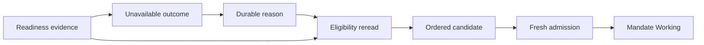
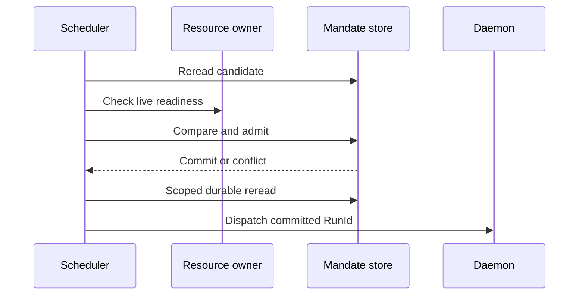

# Mandate Scheduler and Readiness-Driven Admission

## Status and scope

**Approved future architecture, documentation-only.** This document is the sole
detailed owner for durable Mandate scheduler reevaluation, readiness/capacity
evidence, candidate selection, and scheduler handoff to fresh admission. It
does not authorize a crate, timer, worker, schema migration, wire
implementation, or production scheduler.

It applies only to future `Mandate` execution. It preserves M3/M4 ordinary
queues, run recovery, provider behavior, tool-call denial, replay, bytes, and
meaning. Calendar/interval source syntax, time-zone/DST semantics, timer
topology, and worker process topology remain later work.

## Ownership and non-authorities

Architecture 13 owns Mandate lifecycle, reason validity/provenance, total reason
order, conflict precedence, uncertainty, and the atomic fresh-admission
transaction. Architecture 14 owns immutable meaning and decoder compatibility.
Architecture 15 owns frozen tool selection and tool/resource compatibility.
Architecture 18 owns MCP source/capability semantics and MCP-specific readiness.

The scheduler owns only durable reread-based candidate evaluation, consumption
of typed readiness evidence, deterministic selection among eligible Mandates,
and invocation of the lifecycle-owned admission operation. It is not a second
runtime, lifecycle authority, queue aggregate, provider/tool selector, or
external worker. Providers, models, adapters, Goals, Skills, ancestry, MCP,
bridge/kernel, and current mutable configuration cannot grant scheduling
authority.

## Scheduler model



The stages have distinct authority:

1. **Reason capture** is owned by architecture 13. A source observation may
   request capture/coalescing, but an observation is not itself a reason.
2. **Eligibility reread** evaluates durable Mandate state, exact reason,
   immutable compatibility, and readiness. It creates neither `RunId` nor
   `Working` state.
3. **Candidate selection** chooses from current eligible candidates. It creates
   no claim, lease, reservation, retry counter, or scheduler-owned queue item.
4. **Fresh admission** is architecture 13's one atomic transaction. It alone
   binds a new `RunId`, frozen meaning, and selected reason and transitions
   `Active -> Working`.

## Readiness and capacity evidence

Readiness is credential-free, typed live operational evidence from the owner of
a required resource. It is neither Mandate authority, immutable execution
meaning, compatibility, a reservation, nor a guarantee of later execution.

```text
MandateReadinessObservationV1
  observation_id
  source_kind
  source_instance_id
  source_epoch
  source_sequence
  resource_scope
  state = Available | Unavailable
  safe_reason_code
  observed_at
  optional_valid_until
  supersedes
```

`resource_scope` references only a typed selected resource class/revision. It
contains no credential, endpoint, handle, SDK value, raw provider error, path,
or process topology. Absence, stale evidence, or unknown evidence is not ready.
Owner-local `(source_instance_id, source_epoch, source_sequence)` orders
observations; timestamps are diagnostic only. Equal identity/digest is
idempotent, while changed reuse fails before mutation.

The scheduler may aggregate observations but cannot manufacture, override, or
probe an alternate resource path. MCP readiness cannot perform discovery, select
a source/capability, start a local service, mutate a selection, or retry an MCP
call. Compatibility is determined from persisted
meaning; readiness reports only current live availability. A current registry,
provider, configuration, hook, or model cannot repair missing meaning.

`Unavailable` means actual finite resource absence/capacity, not incompatibility,
intrinsic invalidity, confirmation denial, or quota exhaustion. A
`CapacityUnavailable` result retains the exact reason and its provenance, leaves
the Mandate `Active`, creates no `RunId`, consumes no reason, and creates no
reservation, retry counter, escalation threshold, or product ceiling. Repeated
identical observations are coalesced by observation identity rather than causing
unbounded durable outcome facts.

## Candidate eligibility and ordering

A candidate exists only when the Mandate is `Active`, has no non-terminal
Mandate run, has an exact valid pending reason for its captured revision, has
supported compatible immutable meaning, passes intrinsic validation, has
currently proven required readiness/capacity, and recovery has completed.

Architecture 13 owns the total order, which the scheduler must use without
modification:

1. explicit user start/continuation reasons;
2. ascending `first_observed_at`;
3. `MandateId`;
4. `ReasonId`.

This is deterministic selection, not a fairness entitlement, strict execution
guarantee, or capacity reservation. The scheduler cannot add priority aging,
weighted classes, round-robin, quotas, retry budgets, or starvation promises.
An unavailable candidate retains its reason and can be reevaluated after a later
durable observation.

Readiness restoration is a reevaluation cause for an existing reason, not a
new reason or direct launch, unless a later explicit trigger-source contract
defines it as causal work. Graph messages, child summaries, verifier verdicts,
and cascade facts are likewise durable reevaluation inputs only: they cannot
invent a reason, select authority, or directly launch work. Wakeups are
non-authoritative hints: trigger capture,
lifecycle changes, terminal dispositions, readiness changes, recovery completion,
and a future safety scan may prompt a durable reread. Lost or duplicate wakeups
cannot lose or duplicate work.

## Atomic handoff, conflicts, and publication



The scheduler supplies exact expected Mandate sequence, revision, `ReasonId`,
immutable selection, and readiness references. The architecture-13 admission
transaction revalidates durable predicates and commits all admission evidence or
none. No scheduler, provider, tool, process, network, kernel, child, MCP, or
other external effect occurs inside the transaction.

Multiple scheduler tasks may race operationally, but storage linearization
permits only one successful admission. A singleton lock is never the correctness
boundary. A conflict loser performs a scoped reread and cannot merge changed
meaning, consume a different reason, or dispatch an uncommitted `RunId`. User
lifecycle/revision mutations retain their established precedence.

Commit is followed by an independent Mandate-scoped durable reread, then daemon
dispatch and publication. A publisher failure cannot roll back a committed
admission or cause a second admission. If resource availability disappears after
commit but before a durable external start, later recovery records a known
pre-effect outcome; it is not an unknown effect or duplicate dispatch.

## Recovery

Recovery completes before scheduler admission:

1. recover and classify every unfinished Mandate run/attempt;
2. terminalize admitted-before-start work as known pre-effect interruption;
3. convert started work without terminal proof to exact unknown effect and pause
   only its owning Mandate;
4. rebuild/read durable scheduler projections and establish new readiness
   observations without starting work;
5. retain pending reasons; and
6. only then allow fresh candidate evaluation and admission.

No timer callback, provider, tool, process, kernel, child, MCP, bridge,
scheduler task, or old run resumes, reattaches, retries, rediscoveries, or
reruns. A later admission always has a fresh `RunId`.

Bridge attachment/readiness is operational evidence only. The scheduler cannot
attach a peer, issue a bridge grant, select a bridge operation, or start bridge
work; architecture 19 owns those bridge details.

## Compatibility and protocol boundary

No new execution kind or top-level execution-meaning envelope field is needed.
Scheduler task IDs, wakeups, leases, polling cadence, current wall time, current
capacity, process state, and handles are not canonical execution meaning. A
reason retains its captured Mandate revision and provenance; current schedule,
time zone, configuration, registry, provider, or readiness cannot retarget it.

Future scheduler projections belong to the separately negotiated Mandate
protocol family. They use Mandate-local sequence, correlated initial replay or
typed resync/error, and fail closed for unsupported peers. Reconnect/replay is
read-only and cannot replay a wakeup, admission, or external action. Exact wire
tags, pages, retention, and schema remain deferred.

M3 session replay, M4 run streaming, ordinary queue tickets, provider kinds,
tool-call denial, snapshots, interruption, and all historical bytes/meaning
remain unchanged. Legacy queue tickets never become Mandate reasons, and no
historical record gains scheduler facts.

## Dependencies and non-goals

This document depends on architectures 13, 14, 15, 17, and 18 and decisions
0001, 0002, 0006, 0007, 0009, and 0010. It does not define calendar/interval
syntax, time-zone/DST semantics, timer or worker topology, child/verifier
semantics, MCP capability lifecycle, bridge/IPython,
Skills/Goals/context, provider evolution, UI, distributed coordination, leases,
reservations, quotas, schema, migrations, crates, Cargo, Makefile/CI, or
production implementation.

## Required evidence before implementation

A later activating specification must declare exact crate owners, test targets,
coverage tiers, feature profiles, and architecture fixtures, then pass `make
quick`, `make verify`, and Linux/Windows CI. It must cover:

- durable reason versus observation versus candidate versus unavailable outcome
  versus fresh admission;
- explicit-user-first ordering, deterministic ties, duplicate/late observation
  idempotency, source epochs, stale/unknown readiness, and no event storms;
- unavailable reason preservation without `RunId`, reservation, retry counter,
  quota, or lifecycle mutation;
- user/scheduler races, concurrent schedulers, exactly-once admission, and
  scoped reread of conflict losers;
- trigger/readiness/admission fault injection at every projection, event,
  snapshot, sequence, and idempotency boundary;
- no external work inside transactions, post-commit reread, publisher failure,
  and no duplicate dispatch;
- before-start/started/known/unknown crash and cancellation behavior,
  recovery-before-scheduling, and no-resume;
- M3/M4 byte/meaning/replay preservation, ordinary queue separation, and M4
  tool-denial/model-name behavior;
- no-current-state reconstruction from current schedule, configuration, time
  zone, readiness, provider, registry, handles, or UI;
- negotiated/unnegotiated scheduler replay/resync and read-only reconnect;
- intrinsic versus capacity versus forbidden product-ceiling classification;
- fake-secret, SDK/resource, unsafe-path, and corrupt-byte absence from all
  durable/public surfaces; and
- end-to-end readiness restoration causing exactly one fresh admission from a
  retained reason, plus user-precedence and recovery outcomes.
