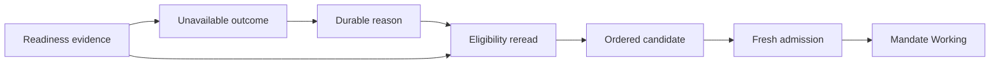
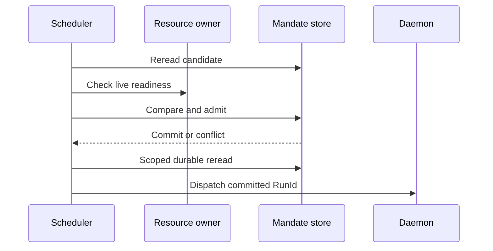

# Mandate Scheduler and Readiness-Driven Admission

**Approved future design. Not implemented; activation requires an activating specification.**

Owner: architecture 16. Decisions: ADR 0008, ADR 0034. Research: m4plus_concept.md.

This document owns durable Mandate scheduler reevaluation, readiness/capacity evidence, candidate selection, and the
scheduler handoff to fresh admission. It applies only to future `Mandate` execution and preserves M3/M4 ordinary queues,
run recovery, provider behavior, tool-call denial, replay, bytes, and meaning. Calendar/interval source syntax,
time-zone/DST semantics, timer topology, and worker process topology remain later work: calendar/interval/time-zone/DST
semantics are an accepted post-M5 future direction under [ADR
0034](../decisions/0034-accepted-m5plus-retained-deferral-directions.md), to be executed in Milestone 5+ as typed
semantics for Mandate scheduler triggers and never a Mandate admission quota, while worker topology remains owned by
architecture 03.

## Ownership and non-authorities

Architecture 13 owns Mandate lifecycle, reason validity/provenance, total reason order, conflict precedence,
uncertainty, and the atomic fresh-admission transaction; architecture 14 is the historical record of the removed
execution-meaning machinery (ADR 0046); architecture 15 owns frozen tool selection and tool/resource compatibility;
architecture 18 owns MCP source/capability semantics and MCP-specific readiness.

The scheduler owns only durable reread-based candidate evaluation, consumption of typed readiness evidence,
deterministic selection among eligible Mandates, and invocation of the lifecycle-owned admission operation. It is not a
second runtime, lifecycle authority, queue aggregate, provider/tool selector, or external worker, and providers, models,
adapters, Goals, Skills, ancestry, MCP, bridge/kernel, and current mutable configuration cannot grant scheduling
authority.

## Scheduler model


```mermaid
flowchart LR
  R[Durable reason] --> E[Eligibility reread]
  O[Readiness evidence] --> E
  E --> C[Ordered candidate]
  C --> A[Fresh admission]
  A --> W[Mandate Working]
  O --> U[Unavailable outcome]
  U --> R
```

The stages have distinct authority:

1.  **Reason capture** is owned by architecture 13. A source observation may request capture/coalescing, but an
   observation is not itself a reason.
2.  **Eligibility reread** evaluates durable Mandate state, exact reason, immutable compatibility, and readiness. It
   creates neither `RunId` nor `Working` state.
3.  **Candidate selection** chooses from current eligible candidates. It creates no claim, lease, retry counter, or
   scheduler-owned queue item.
4.  **Fresh admission** is architecture 13's one atomic transaction. It alone binds a new `RunId`, frozen meaning, and
   selected reason and transitions `Active -> Working`.

### Readiness is operational evidence only

A scheduler evaluates four independent conditions: durable reason eligibility, current Mandate lifecycle permission,
typed technical readiness, and finite capacity availability. A failed or stale observation preserves the exact pending
reason and creates no `RunId`, and restoration only wakes reevaluation. The scheduler never interprets readiness as
semantic meaning, never repairs stale selections, and never owns effect reconciliation, which is coordinated by the
owning Mandate lifecycle transaction: executors report attempt facts, verifiers may provide explicit authority, and the
scheduler only observes the resulting eligibility after reconciliation.

## Readiness and capacity evidence

Readiness is credential-free, typed live operational evidence from the owner of a required resource. It is neither
Mandate authority, immutable execution meaning, compatibility, nor a guarantee of later execution.

```text
MandateReadinessObservationV1
  observation_id
  source_kind
  source_instance_id
  source_epoch
  source_sequence
  resource_scope
  state = Available | Unavailable
  safe_reason_code
  observed_at
  optional_valid_until
  supersedes
```

`resource_scope` references only a typed selected resource class/revision; it contains no credential, endpoint, handle,
SDK value, raw provider error, path, or process topology. Absence, stale evidence, or unknown evidence is not ready.
Owner-local `(source_instance_id, source_epoch, source_sequence)` orders observations, and timestamps are diagnostic
only; equal identity and equal typed observation is idempotent, while changed reuse fails before mutation.

The scheduler may aggregate observations but cannot manufacture, override, or probe an alternate resource path. MCP
readiness cannot perform discovery, select a source/capability, start a local service, mutate a selection, or retry an
MCP call. Compatibility is determined from persisted meaning, and readiness reports only current live availability: a
current registry, provider, configuration, hook, or model cannot repair missing meaning.

`Unavailable` means actual finite resource absence/capacity, not incompatibility, intrinsic invalidity, confirmation
denial, or quota exhaustion. A `CapacityUnavailable` result retains the exact reason and its provenance, leaves the
Mandate `Active`, creates no `RunId`, consumes no reason, and creates no retry counter, escalation threshold, or product
ceiling; repeated identical observations are coalesced by observation identity rather than causing unbounded durable
outcome facts.

### Handoff invariant

Candidate selection is deterministic and scheduler-owned, but fresh admission is lifecycle-owned. The scheduler hands an
eligible candidate to architecture 13, which atomically revalidates reason, revision, meaning, lifecycle, and readiness,
creates the fresh `RunId`, and commits the binding before dispatch. No child message, summary, verdict, wakeup, or
readiness observation directly launches work.

## Candidate eligibility and ordering

A candidate exists only when the Mandate is `Active`, has no non-terminal Mandate run, has an exact valid pending reason
for its captured revision, has supported compatible immutable meaning, passes intrinsic validation, has currently proven
required readiness/capacity, and recovery has completed.

Architecture 13 owns the total order, which the scheduler must use without modification:

1. explicit user start/continuation reasons;
2. ascending `first_observed_at`;
3. `MandateId`;
4. `ReasonId`.

This is deterministic selection, not a fairness entitlement, strict execution guarantee, or capacity claim. The
scheduler cannot add priority aging, weighted classes, round-robin, quotas, retry budgets, or starvation promises, and
an unavailable candidate retains its reason and can be reevaluated after a later durable observation.

Readiness restoration is a reevaluation cause for an existing reason, not a new reason or direct launch, unless a later
explicit trigger-source contract defines it as causal work. Graph messages, child summaries, verifier verdicts, and
cascade facts are likewise durable reevaluation inputs only: they cannot invent a reason, select authority, or directly
launch work. Wakeups are non-authoritative hints — trigger capture, lifecycle changes, terminal dispositions, readiness
changes, recovery completion, and a future safety scan may prompt a durable reread — and lost or duplicate wakeups
cannot lose or duplicate work.

## Atomic handoff, conflicts, and publication


```mermaid
sequenceDiagram
  participant S as Scheduler
  participant R as Resource owner
  participant M as Mandate store
  participant D as Daemon

  S->>M: Reread candidate
  S->>R: Check live readiness
  S->>M: Compare and admit
  M-->>S: Commit or conflict
  S->>M: Scoped durable reread
  S->>D: Dispatch committed RunId
```

The scheduler supplies exact expected Mandate sequence, revision, `ReasonId`, immutable selection, and readiness
references. The architecture-13 admission transaction revalidates durable predicates and commits all admission evidence
or none; no scheduler, provider, tool, process, network, kernel, child, MCP, or other external effect occurs inside the
transaction.

Multiple scheduler tasks may race operationally, but storage linearization permits only one successful admission, and a
singleton lock is never the correctness boundary. A conflict loser performs a scoped reread and cannot merge changed
meaning, consume a different reason, or dispatch an uncommitted `RunId`; user lifecycle/revision mutations retain their
established precedence.

Commit is followed by an independent Mandate-scoped durable reread, then daemon dispatch and publication. A publisher
failure cannot roll back a committed admission or cause a second admission. If resource availability disappears after
commit but before a durable external start, later recovery records a known pre-effect outcome; it is not an unknown
effect or duplicate dispatch.

## Recovery

Recovery completes before scheduler admission:

1. recover and classify every unfinished Mandate run/attempt;
2. terminalize admitted-before-start work as known pre-effect interruption;
3. convert started work without terminal proof to exact unknown effect and pause only its owning Mandate;
4. rebuild/read durable scheduler projections and establish new readiness observations without starting work;
5. retain pending reasons; and
6. only then allow fresh candidate evaluation and admission.

No timer callback, provider, tool, process, kernel, child, MCP, bridge, scheduler task, or old run resumes, reattaches,
retries, rediscovers, or reruns, and a later admission always has a fresh `RunId`. Bridge attachment/readiness is
operational evidence only; the scheduler cannot attach a peer, issue a bridge grant, select a bridge operation, or start
bridge work, because architecture 19 owns those bridge details.

## Compatibility and protocol boundary

Scheduler state is operational state, not execution meaning: the removed execution-meaning envelope no longer exists
(ADR 0046). Scheduler task IDs, wakeups, leases, polling cadence, current wall time, current capacity, process state,
and handles never become execution meaning; a reason retains its captured Mandate revision and provenance, and current
schedule, time zone, configuration, registry, provider, or readiness cannot retarget it.

Future scheduler projections use typed JSON-RPC 2.0 methods (ADR 0045) with Mandate-local sequence, correlated results
or typed resync/error, and never partial snapshots. Reconnect/replay is read-only and cannot replay a wakeup, admission,
or external action; exact method shapes, pages, retention, and schema remain deferred. M3 session replay, M4 run
streaming, ordinary queue tickets, provider kinds, tool-call denial, snapshots, interruption, and all historical
bytes/meaning remain unchanged, legacy queue tickets never become Mandate reasons, and no historical record gains
scheduler facts.

## Dependencies and non-goals

This document depends on architectures 13, 14, 15, 17, and 18 and decisions 0001, 0002, 0006, 0007, 0009, and 0010. It
does not define calendar/interval syntax, time-zone/DST semantics, timer or worker topology, child/verifier semantics,
MCP capability lifecycle, bridge/IPython, Skills/Goals/context, provider evolution, UI, distributed coordination,
leases, quotas, schema, migrations, crates, Cargo, Makefile/CI, or production implementation.
Calendar/interval/time-zone/DST semantics for Mandate scheduler triggers and worker/process supervision topology are
accepted post-M5 future directions under [ADR 0034](../decisions/0034-accepted-m5plus-retained-deferral-directions.md),
owned by architecture 16 (calendar) and architecture 03 (worker topology) and activated only by a later M5+
specification.

Architectures 20-24 own kernel readiness, Goal/Skill/context evidence, provider availability, forks, and
activity/notification observations; all are non-authoritative operational or evidence inputs here. None can create or
restore a kernel, create a scheduler candidate, readiness observation, quota, trigger reason, or admission, retry
budget, `RunId`, or direct admission, and fork creation and regeneration create no Mandate reason, readiness
observation, or admission.

## Required evidence before implementation

Evidence: activating specification per [architecture 12](12-quality-gates-and-makefile.md).
