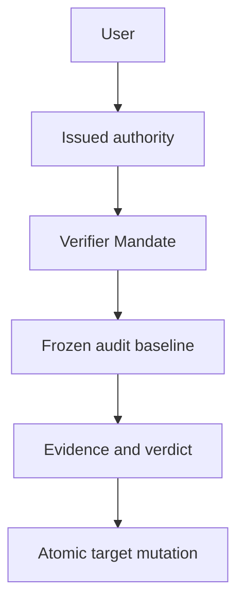

# Mandate Child Graph and Delegated Verifier Authority

## Status and scope

**Approved future architecture, documentation-only.** This document is the sole detailed owner for future Mandate child-graph relations, immutable delegation, direct-parent controls, graph terminalization, and separately issued delegated verifier authority. It does not authorize a crate, schema migration, wire implementation, executor, runtime worker, UI, or production child work.

It applies only to future `Mandate` and `VerifierMandate` execution. M3/M4 Sessions, Runs, queue tickets, provider selection, tool-call denial, replay, recovery, bytes, IDs, UUIDs, digests, cursors, events, and snapshots retain their recorded ordinary semantics. Retained RLM child/activity material remains research and historical provenance, not future Mandate graph authority.

## Ownership and non-authorities

Architecture 13 owns Mandate lifecycle, reason validity/order, fresh admission, uncertainty, and user-conflict precedence. Architecture 14 owns the execution envelope, canonical framing, digest, decoder, and compatibility outcomes. Architecture 15 owns the fixed `sub_agent` registry slot, frozen selection, direct tool admission, and generic tool-loop evidence. Architecture 16 owns durable reevaluation, readiness, candidate selection, and admission handoff.

This document owns child/verifier payload semantics and their durable relations. It is not a second lifecycle, scheduler, registry, provider/tool selector, session-fork model, activity/UI system, or general notification system. Parenthood, ancestry, activity, a prompt, Goal, Skill, tool, model, provider, MCP source, bridge/kernel, evidence, or verdict never grants lifecycle, scheduling, tool, or target-mutation authority.

## Child graph identity and immutable delegation

A `sub_agent` invocation creates a new durable **child Mandate**, not a child run, ordinary queued turn, session branch, process, provider continuation, or retained RLM task. A child has exactly one immutable `ParentMandateId` and one immutable root-graph identity. Its authoritative relation is an append-only direct edge; graph summaries and recursive indexes are rebuildable projections, not authority.

```text
MandateChildEdgeV1
  edge_id
  root_mandate_id
  parent_mandate_id
  parent_revision
  creating_run_id
  creating_tool_call_id
  child_mandate_id
  child_initial_revision
  delegation_snapshot_reference
  canonical_edge_digest

MandateChildDelegationSnapshotV1
  delegation_id
  parent_mandate_id
  parent_revision
  creating_run_id
  child_objective_and_scope
  child_mode
  frozen_context_references
  selected_goal_skill_evidence_references
  continuation_configuration
  capability_selection_rule
  typed_provenance_references
  canonical_delegation_digest
```

The snapshot is immutable, canonical, and credential-free. It may freeze only explicitly selected child objective, scope, mode, safe context, Goal, Skill, evidence, continuation, capability and provenance references. It excludes credentials, endpoints, SDK values, handles, raw transcript/output, mutable parent state, tool permissions, provider/MCP/process/kernel/bridge connections, policy/corridor/quota/confirmation inheritance, and unfinished external effects.

Every child fresh run resolves its own immutable meaning from its child revision and delegation snapshot. Parent revision, ancestry, configuration, registry, provider, Goal, Skill, activity, UI, or live resources cannot repair missing child meaning. Architecture 14 owns the encoding, this document owns the child-link nested selection that binds exact edge and snapshot references and digests.

## Atomic child creation and graph integrity

One idempotent transaction commits all or nothing:

- child Mandate identity and initial immutable revision;
- direct edge, root-graph identity, and delegation snapshot;
- graph projection and later activity reference;
- parent `sub_agent` terminal creation result;
- all affected events, snapshots, sequences, canonical digests, and idempotency evidence.

Equal creation identity and semantic digest return the original child, edge, snapshot, and result. Changed reuse fails before another child, edge, run, activity record, or external action exists. No provider, tool, process, network, kernel, MCP, bridge, child runtime, or scheduler effect occurs inside the transaction. Publication occurs only after commit and a scoped durable reread.

Creation validates authoritative edge ancestry under the same storage linearization as insertion. It rejects self-link, cycle, second parent, reparent, detach, merge, root conversion, cross-root/project/workspace relation, missing or stale parent revision, wrong creating run/tool call, incompatible duplicate creation, and malformed identity before durable mutation. A committed graph is a rooted directed tree, each non-root has one parent, shares one root, and is reachable from that root.

## Direct-edge controls and messages

Parenthood grants only this closed direct-child control family:

```text
MandateChildControlV1
  GetStatus
  AwaitTerminalSummary
  SendInstruction
  ReplyToClarification
  PauseChild
  StopChild
```

A child may send only `Report` and `ClarificationRequest` to its direct parent. Only the immutable direct edge may carry these controls/messages. Siblings, indirect ancestors/descendants, roots, unrelated Mandates, adapters, providers, MCP, bridge/kernel, and models outside the admitted parent loop have no graph-control authority.

Messages are typed, redacted, idempotent, and ordered by one edge-local monotonic sequence shared by both directions. `GetStatus` and `AwaitTerminalSummary` are observation only. Instructions, replies, reports, and clarification requests are durable evidence, not authority: they create no `RunId`, consume no reason, revise no Mandate, mutate no already-sent provider request, and directly schedule no work. A later scheduler reread may evaluate any separately valid reason and architecture 13 alone may admit a fresh run.

Parenthood cannot complete, needs-rework, revise, archive, reconcile uncertainty, issue verifier authority, or control a sibling/root/unrelated Mandate. A user can mutate every child under architecture 13. Parent controls validate the exact edge, frozen delegated control, expected Mandate sequences, expected lifecycle, and idempotent operation identity.

## Terminalization, uncertainty, and recovery

A child terminal summary is safe provenance/evidence, not completion or failure of the parent objective. Parent completion requires durable terminal evidence for every applicable descendant. A parent may initiate pause/stop only against a direct child. A daemon may execute a transitive durable **safety cascade** over immutable descendant edges without granting indirect authority to the parent.

Cascade intent, selected subtree/graph epoch, each descendant transition, and completion are distinct durable idempotent facts. A creation racing an active terminalization intent either commits first and is included in the selected subtree, or is rejected after the closure intent commits. Completion revalidates the same graph epoch and cannot terminalize from a stale descendant set.

`ExternalEffectUnknown` remains owned by the exact child that started the unproven effect. It pauses only that child and may block dependent ancestor closure, but it never fabricates parent uncertainty. Only that child user, or exact separately issued verifier authority naming that child and uncertainty, may reconcile it.

Recovery completes before graph scheduling/readiness. It rebuilds projections only from supported durable edge facts, retains edges, snapshots, messages, summaries, checkpoints, authority references, and immutable meaning, classifies unfinished work independently, and never resumes, retries, reattaches, rediscovers, or reruns child/provider/tool/process/kernel/MCP/bridge/scheduler work. A later admission is fresh and has a new `RunId`.

## Separately issued delegated verifier authority

A verifier is a normal Mandate executing as `VerifierMandate`. It can mutate a target only through a separately user-issued, revisioned, active, target-scoped authority. Neither parenthood, child work, Goal, Skill, activity, prompt, evidence, verdict, tool, provider, or current configuration supplies it.



```text
VerifierAuthorityV1
  authority_id
  authority_revision
  verifier_mandate_id
  immutable_target_set_reference
  allowed_operations
  audit_contract_reference
  issuance_expiry_revocation_consumption
  canonical_digest

VerifierAuditBaselineV1
  authority_reference
  verifier_mandate_revision
  target_mandate_id
  target_revision_and_sequence
  target_lifecycle
  frozen_goal_gate_evidence_references
  optional_unknown_effect_reference
  audit_contract_reference
  canonical_digest
```

Authority revisions, target sets, audit baselines, evidence, verdicts, mutations, and reconciliation records are immutable. A target set is explicit and never expands through parent/child, ancestry, descendants, siblings, Goals, sessions, branches, activity, or shared evidence. A verifier cannot target itself. Its children may gather evidence but cannot inherit, relay, consume, amplify, or exercise target-mutation authority.

Architecture 14 owns the `VerifierMandate` envelope/codec/decode behavior. This document owns verifier nested selection field semantics. A verifier payload with missing, corrupt, stale, or unsupported mandatory selection cannot downgrade to Mandate or Ordinary execution.

## Audit, mutations, conflicts, and reconciliation

A verdict is durable evidence only. It neither schedules work nor reserves or mutates a target. Before dependent verifier work or mutation, validate exact verifier identity/revision, authority revision/digest/lifecycle, target membership, allowed operation, audit contract, frozen target baseline, and operation-specific lifecycle prerequisites. Missing, revoked, expired, consumed, corrupt, mismatched, stale, or unsupported authority/baseline fails closed before mutation. No path substitutes current authority, target revision, Goal, configuration, registry, ancestry, readiness, evidence store, or UI state.

Primary delegated operations are `MarkNeedsRework`, `MarkComplete`, `Stop`, `ReviseFull`, and `ResolveUnknownEffect`. `Pause` and `Resume` are not implicit verifier powers.

- `MarkNeedsRework` requires explicit authority and qualifying fail evidence. It creates neither a trigger nor a resumed run.
- `MarkComplete` requires explicit authority, unconditional pass evidence, no unresolved target uncertainty, and required graph terminalization closure.
- `Stop` never asserts completion and does not bypass exact uncertainty reconciliation.
- `ReviseFull` requires its own authority and creates only an immutable future revision. It never rewrites an admitted run or historical evidence.
- `ResolveUnknownEffect` names the exact target uncertainty and baseline and may yield only `Active` for later fresh work or `Stopped`. It never asserts rollback, absence, idempotence, repeatability, or safe replay.

One target-mutation transaction validates the authority, baseline, evidence, verdict, target revision/sequence/lifecycle, graph closure where required, exact uncertainty where applicable, and idempotency identity/digest. It commits all or nothing: applied/rejected result, target projection/events/snapshots when changed, authority consumption where selected, audit/reconciliation linkage, sequence, safe activity/notification reference, and idempotency evidence.

User lifecycle, revision, reconciliation, revocation, and authority-revision mutations win optimistic conflicts. A losing parent, daemon, or verifier action performs a scoped reread and cannot merge, retarget, select another operation, or retry with changed meaning.

## Verifier uncertainty and protocol boundary

If verifier external work becomes unknown, pause only the verifier Mandate. Do not mutate a target, complete the audit, reuse partial evidence as qualifying verdict, or treat verifier uncertainty as target uncertainty. Recovery preserves all authority/audit/mutation history but never replays verifier evidence work or reapplies a committed mutation.

Future child/verifier projections use a separately negotiated Mandate protocol family with authoritative snapshot/replay or typed resync/error and fail closed for unsupported peers. Replay is read-only. It cannot resend messages, start children, repeat a cascade, consume authority, collect evidence, or reapply a target mutation. Exact wire tags, pages, retention, SQL, migrations, and UI remain deferred.

## Compatibility, dependencies, and non-goals

This document depends on architectures 13–16 and decisions 0001, 0002, 0003, 0004, 0006, 0007, and 0008. Architecture 18 owns MCP capability lifecycle; MCP evidence is non-authorizing and MCP uncertainty remains local to its owning Mandate. This document does not define a sub-agent executor, worker or recursion topology, product depth/count/concurrency/lifetime/message quotas, RLM/IPython, MCP capability lifecycle semantics, Skills/Goals/context semantics, provider evolution, session forks, general activity/notifications/UI, schema, migrations, crates, Cargo, Makefile/CI, or production implementation.

M3/M4 and retained RLM records receive no synthetic Mandate child edge, delegation snapshot, activity, verifier authority, target set, audit, verdict, mutation, reconciliation, or execution-kind state. Historical M4 tool calls remain denial evidence. Ordinary queues never become child Mandates or Mandate reasons. Current ancestry or historical RLM identity cannot reconstruct future child/verifier meaning.

## Required evidence before implementation

A later activating specification must declare exact crate owners, test targets, coverage tiers, feature profiles, architecture fixtures, and storage/wire versions, then pass `make quick`, `make verify`, and Linux/Windows CI. It must cover:

- canonical child-edge/delegation/message/summary and verifier authority/target/baseline/evidence/verdict/mutation/reconciliation goldens and negative vectors;
- atomic idempotent creation, message, cascade, authority, and mutation fault injection at every projection/event/snapshot/sequence/idempotency stage;
- rooted-tree/cycle/reparent/cross-project defenses, graph-epoch races, direct edge isolation, non-scheduling messages, and fresh-RunId recovery;
- terminalization closure, child-local uncertainty, deterministic cascades, and no-resume/retry/reattach across all external owners;
- authority issue/revision/revocation/expiry/consumption, explicit target sets, self-target/no-inheritance failures, stale baseline, full operation/state matrix, and user/verifier/parent/daemon conflict races;
- negotiated replay/resync, DTO-only boundary/no-second-registry fixtures, and no-current-state reconstruction;
- M3/M4 and retained-RLM byte/meaning preservation, M4 tool-denial preservation, historical startup, redaction, and safe failure outcomes; and
- end-to-end idempotent child creation, graph closure, stale audit, verifier uncertainty, exact reconciliation, recovery, and historical database outcomes.
