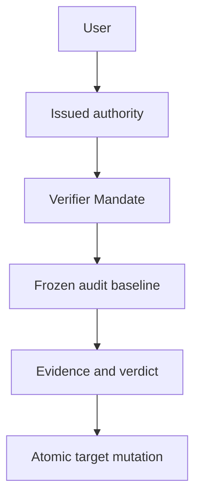

# Mandate Child Graph and Delegated Verifier Authority

## Status and scope

## Traceability

- Normative owner: architecture 17.
- Decision record: [`0009`](../decisions/0009-mandate-child-graph-and-delegated-verifier-authority.md).
- Detail decision: [`0027`](../decisions/0027-child-kernel-bridge-mcp-detail-directions.md) (child detail).
- Reconciliation topics: `CHD-001..019, VER-001..011`.
- Research provenance: [`m4plus_concept2.md`](../m4plus_concept2.md).
- Status: documentation-approved; implementation-authorized work requires a later activating specification.


**Approved future architecture, documentation-only.** This document is the sole detailed owner for future Mandate child-graph relations, immutable delegation, direct-parent controls, graph terminalization, and separately issued delegated verifier authority. It does not authorize a crate, schema migration, wire implementation, executor, runtime worker, UI, or production child work.

It applies only to future `Mandate` and `VerifierMandate` execution. M3/M4 Sessions, Runs, queue tickets, provider selection, tool-call denial, replay, recovery, bytes, IDs, UUIDs, digests, cursors, events, and snapshots retain their recorded ordinary semantics. Retained RLM child/activity material remains research and historical provenance, not future Mandate graph authority.

## Ownership and non-authorities

Architecture 13 owns Mandate lifecycle, reason validity/order, fresh admission, uncertainty, and user-conflict precedence. Architecture 14 owns the execution envelope, canonical framing, digest, decoder, and compatibility outcomes. Architecture 15 owns the fixed `sub_agent` registry slot, frozen selection, direct tool admission, and generic tool-loop evidence. Architecture 16 owns durable reevaluation, readiness, candidate selection, and admission handoff.

This document owns child/verifier payload semantics and their durable relations. It is not a second lifecycle, scheduler, registry, provider/tool selector, session-fork model, activity/UI system, or general notification system. Parenthood, ancestry, activity, a prompt, Goal, Skill, tool, model, provider, MCP source, bridge/kernel, evidence, or verdict never grants lifecycle, scheduling, tool, or target-mutation authority.

## Child graph identity and immutable delegation

A `sub_agent` invocation creates a new durable **child Mandate**, not a child run, ordinary queued turn, session branch, process, provider continuation, or retained RLM task. A child has exactly one immutable `ParentMandateId` and one immutable root-graph identity. Its authoritative relation is an append-only direct edge; graph summaries and recursive indexes are rebuildable projections, not authority.

```text
MandateChildEdgeV1
  edge_id
  root_mandate_id
  parent_mandate_id
  parent_revision
  creating_run_id
  creating_tool_call_id
  child_mandate_id
  child_initial_revision
  delegation_snapshot_reference
  canonical_edge_digest

MandateChildDelegationSnapshotV1
  delegation_id
  parent_mandate_id
  parent_revision
  creating_run_id
  child_objective_and_scope
  child_mode
  frozen_context_references
  selected_goal_skill_evidence_references
  required_evidence_contract_references
  continuation_configuration
  capability_selection_rule
  provider_capability_selection
  activity_graph_id
  typed_provenance_references
  canonical_delegation_digest
```

`required_evidence_contract_references` freezes the explicit evidence contracts
the child must satisfy; `provider_capability_selection` and `activity_graph_id`
freeze the child's provider-capability selection rule and its activity-graph
identity. They are immutable credential-free references, never live provider
material or activity authority.

The snapshot is immutable, canonical, and credential-free. It may freeze only explicitly selected child objective, scope, mode, safe context, Goal, Skill, evidence, continuation, capability and provenance references. It excludes credentials, endpoints, SDK values, handles, raw transcript/output, mutable parent state, tool permissions, provider/MCP/process/kernel/bridge connections, policy/corridor/quota/confirmation inheritance, and unfinished external effects.

Every child fresh run resolves its own immutable meaning from its child revision and delegation snapshot. Parent revision, ancestry, configuration, registry, provider, Goal, Skill, activity, UI, or live resources cannot repair missing child meaning. Architecture 14 owns the encoding, this document owns the child-link nested selection that binds exact edge and snapshot references and digests.

## Atomic child creation and graph integrity

One idempotent transaction commits all or nothing:

- child Mandate identity and initial immutable revision;
- direct edge, root-graph identity, and delegation snapshot;
- graph projection and later activity reference;
- parent `sub_agent` terminal creation result;
- all affected events, snapshots, sequences, canonical digests, and idempotency evidence.

Equal creation identity and semantic digest return the original child, edge, snapshot, and result. Changed reuse fails before another child, edge, run, activity record, or external action exists. No provider, tool, process, network, kernel, MCP, bridge, child runtime, or scheduler effect occurs inside the transaction. Publication occurs only after commit and a scoped durable reread.

Creation validates authoritative edge ancestry under the same storage linearization as insertion. It rejects self-link, cycle, second parent, reparent, detach, merge, root conversion, cross-root/project/workspace relation, missing or stale parent revision, wrong creating run/tool call, incompatible duplicate creation, and malformed identity before durable mutation. A committed graph is a rooted directed tree, each non-root has one parent, shares one root, and is reachable from that root.

## Direct-edge controls and messages

Parenthood grants only this closed direct-child control family:

```text
MandateChildControlV1
  GetStatus
  AwaitTerminalSummary
  SendInstruction
  ReplyToClarification
  PauseChild
  StopChild
```

A child may send only `Report` and `ClarificationRequest` to its direct parent. Only the immutable direct edge may carry these controls/messages. Siblings, indirect ancestors/descendants, roots, unrelated Mandates, adapters, providers, MCP, bridge/kernel, and models outside the admitted parent loop have no graph-control authority.

Messages are typed, redacted, idempotent, and ordered by one edge-local monotonic sequence shared by both directions. `GetStatus` and `AwaitTerminalSummary` are observation only. Instructions, replies, reports, and clarification requests are durable evidence, not authority: they create no `RunId`, consume no reason, revise no Mandate, mutate no already-sent provider request, and directly schedule no work. A later scheduler reread may evaluate any separately valid reason and architecture 13 alone may admit a fresh run. A terminal or interrupted recipient rejects delivery: an undelivered ordinary message to a terminal or interrupted child is rejected with a typed durable delivery outcome, while the original message and its reason remain in the activity journal.

Parenthood cannot complete, needs-rework, revise, archive, reconcile uncertainty, issue verifier authority, or control a sibling/root/unrelated Mandate. A user can mutate every child under architecture 13. Parent controls validate the exact edge, frozen delegated control, expected Mandate sequences, expected lifecycle, and idempotent operation identity.

## Terminalization, uncertainty, and recovery

A child terminal summary is safe provenance/evidence, not completion or failure of the parent objective. Parent completion requires durable terminal evidence for every applicable descendant. A parent may initiate pause/stop only against a direct child. A daemon may execute a transitive durable **safety cascade** over immutable descendant edges without granting indirect authority to the parent.

Cascade intent, selected subtree/graph epoch, each descendant transition, and completion are distinct durable idempotent facts. A creation racing an active terminalization intent either commits first and is included in the selected subtree, or is rejected after the closure intent commits. Completion revalidates the same graph epoch and cannot terminalize from a stale descendant set.

`ExternalEffectUnknown` remains owned by the exact child that started the unproven effect. It pauses only that child and may block dependent ancestor closure, but it never fabricates parent uncertainty. Only that child user, or exact separately issued verifier authority naming that child and uncertainty, may reconcile it.

Recovery completes before graph scheduling/readiness. It rebuilds projections only from supported durable edge facts, retains edges, snapshots, messages, summaries, checkpoints, authority references, and immutable meaning, classifies unfinished work independently, and never resumes, retries, reattaches, rediscovers, or reruns child/provider/tool/process/kernel/MCP/bridge/scheduler work. A later admission is fresh and has a new `RunId`.

## Separately issued delegated verifier authority

A verifier is a normal Mandate executing as `VerifierMandate`. It can mutate a target only through a separately user-issued, revisioned, active, target-scoped authority. Neither parenthood, child work, Goal, Skill, activity, prompt, evidence, verdict, tool, provider, or current configuration supplies it.



```text
VerifierAuthorityV1
  authority_id
  authority_revision
  verifier_mandate_id
  immutable_target_set_reference
  allowed_operations
  audit_contract_reference
  issuance_expiry_revocation_consumption
  canonical_digest

VerifierAuditBaselineV1
  authority_reference
  verifier_mandate_revision
  target_mandate_id
  target_revision_and_sequence
  target_lifecycle
  frozen_goal_gate_evidence_references
  optional_unknown_effect_reference
  audit_contract_reference
  canonical_digest
```

Authority revisions, target sets, audit baselines, evidence, verdicts, mutations, and reconciliation records are immutable. A target set is explicit and never expands through parent/child, ancestry, descendants, siblings, Goals, sessions, branches, activity, or shared evidence. A verifier cannot target itself. Its children may gather evidence but cannot inherit, relay, consume, amplify, or exercise target-mutation authority.

Architecture 14 owns the `VerifierMandate` envelope/codec/decode behavior. This document owns verifier nested selection field semantics. A verifier payload with missing, corrupt, stale, or unsupported mandatory selection cannot downgrade to Mandate or Ordinary execution.

### Stale baseline tuple

A verifier baseline is fresh only when all required values match the committed
state: exact target identity, target revision, aggregate sequence, lifecycle,
authority revision/digest, audit contract, graph epoch where applicable, and
operation idempotency identity/digest. Any mismatch is a typed pre-mutation stale
failure. The system never best-effort merges, retargets, substitutes current state,
or retries with changed meaning.


## Audit, mutations, conflicts, and reconciliation

A verdict is durable evidence only. It neither schedules work nor reserves or mutates a target. Before dependent verifier work or mutation, validate exact verifier identity/revision, authority revision/digest/lifecycle, target membership, allowed operation, audit contract, frozen target baseline, and operation-specific lifecycle prerequisites. Missing, revoked, expired, consumed, corrupt, mismatched, stale, or unsupported authority/baseline fails closed before mutation. No path substitutes current authority, target revision, Goal, configuration, registry, ancestry, readiness, evidence store, or UI state.

Primary delegated operations are `MarkNeedsRework`, `MarkComplete`, `Stop`, `ReviseFull`, and `ResolveUnknownEffect`. `Pause` and `Resume` are not implicit verifier powers.

- `MarkNeedsRework` requires explicit authority and qualifying fail evidence. It creates neither a trigger nor a resumed run.
- `MarkComplete` requires explicit authority, unconditional pass evidence, no unresolved target uncertainty, and required graph terminalization closure.
- `Stop` never asserts completion and does not bypass exact uncertainty reconciliation.
- `ReviseFull` requires its own authority and creates only an immutable future revision. It never rewrites an admitted run or historical evidence.
- `ResolveUnknownEffect` names the exact target uncertainty and baseline and may yield only `Active` for later fresh work or `Stopped`. It never asserts rollback, absence, idempotence, repeatability, or safe replay.

One target-mutation transaction validates the authority, baseline, evidence, verdict, target revision/sequence/lifecycle, graph closure where required, exact uncertainty where applicable, and idempotency identity/digest. It commits all or nothing: applied/rejected result, target projection/events/snapshots when changed, authority consumption where selected, audit/reconciliation linkage, sequence, safe activity/notification reference, and idempotency evidence.

User lifecycle, revision, reconciliation, revocation, and authority-revision mutations win optimistic conflicts. A losing parent, daemon, or verifier action performs a scoped reread and cannot merge, retarget, select another operation, or retry with changed meaning.

## Verifier uncertainty and protocol boundary

If verifier external work becomes unknown, pause only the verifier Mandate. Do not mutate a target, complete the audit, reuse partial evidence as qualifying verdict, or treat verifier uncertainty as target uncertainty. Recovery preserves all authority/audit/mutation history but never replays verifier evidence work or reapplies a committed mutation.

Future child/verifier projections use a separately negotiated Mandate protocol family with authoritative snapshot/replay or typed resync/error and fail closed for unsupported peers. Replay is read-only. It cannot resend messages, start children, repeat a cascade, consume authority, collect evidence, or reapply a target mutation. Exact wire tags, pages, retention, SQL, migrations, and UI remain deferred.

## Delegated child-agent detail (`sub_agent`)

The following first-scope detail applies to future `sub_agent` child work under
the Mandate child graph:

**Identity and commands.** `sub_agent` is the canonical child-agent identifier
in the required fourteen-slot registry; one child-agent boundary exists (no
alias, second `ToolId`, private Python function, or direct primitive path). The
child-agent owner activates `sub_agent` only through the composition root. The
direct effect profile flags are `child_agent_start` and `child_agent_control`
(descriptive only). Each admitted child is a daemon-owned independent
`SessionId` with its own `RunId`, queue, immutable run selection, model steps,
bridge grants, durable facts, and at most one active run. The daemon assigns
`SubAgentId`, child session identity, and child run identity only after
successful admission; `ToolCallId` remains the canonical identity of the parent
`sub_agent` call, and a child never reuses the parent's `RunId`, `ModelStepId`,
grant, or operation identity. Every new root run receives one daemon-assigned
`AgentActivityTreeId`; every admitted child retains it with its direct-parent
link (distinct from `ConversationTreeId` fork lineage). `RlmParentLinkDto` is a
durable immutable runtime relationship containing parent `SessionId`, `RunId`,
`TurnId`, `ModelStepId`, `ToolCallId`, plus child `SubAgentId`, `SessionId`, and
initial `RunId`.

The direct parent closed command family is:

```text
ParentSubAgentCommandDto
  Create
  GetStatus
  AwaitResult
  Cancel
  EnqueueFollowUp

SubAgentHandleDto
  sub_agent_id
  child_session_id
  child_run_id
  selected_class
  status
```

Every command is a normal typed tool invocation with its own `ToolCallId`,
admission evidence, terminal result, durable commit, and post-reread
publication. `Create` returns `SubAgentHandleDto` immediately after atomic
durable admission and never waits for child completion. The child's narrower
daemon-internal RLM operation is:

```text
RlmChildMessageOperation
  Report
  ClarificationRequest
```

bound to the child's immutable `RlmParentLinkDto`, current `ModelStepId`,
daemon-assigned `RlmMessageId`, and canonical payload digest; it is not a
`ToolId`/`ToolCallId`/registry invocation/bridge operation/MCP command/
independent authority. `GetStatus` returns a bounded safe direct-child status
plus a bounded descendant summary. `AwaitResult` returns one child terminal
outcome, safe conclusion, and immutable provenance reference; a pending
clarification returns a distinct `ClarificationPending { clarification_request_id,
deadline }` that ends only that operation, not the child run. `Cancel` cascades
only through that child's descendant subtree. `EnqueueFollowUp` (direct parent
of an active child only) creates an `Instruction` or `ClarificationReply
{ clarification_request_id, content }`.

**Messages and summaries.** DTOs:

```text
MandateChildMessageDto
  message_id
  graph_id
  parent_link_reference
  message_order
  direction = ParentToChild | ChildToParent
  kind = Instruction | Report | ClarificationRequest | ClarificationReply
  sender_run_reference
  recipient_mandate_reference
  recipient_run_reference_when_live
  safe_text
  typed_references
  delivery_state
  canonical_message_digest

MandateChildTerminalSummaryDto
  child_mandate_id
  child_revision
  terminal_run_reference
  terminal_kind
  disposition
  verified_checkpoint_reference_when_present
  external_effect_unknown_reference_when_present
  evidence_references
  safe_conclusion
  canonical_summary_digest
```

Each edge owns one durable monotonic order across both directions. Messages are
redacted typed records (identity, revision/cursor, digest, safe visibility,
provenance references). Equal replay returns the stored message; changed reuse
fails before publication. A terminal child run records one redacted summary; the
parent receives the summary reference once in the next eligible model exchange,
never a raw transcript or output. Summaries aggregate state and provenance;
they never make child success complete a parent, child failure fail a parent,
or child evidence satisfy a parent acceptance contract. Usage aggregation
dedupes original `RunId` values. The first scope does not require a token
ceiling from providers that cannot report usage: when a provider reports no
usage component, the tree aggregates only the components it reports, and no
synthetic ceiling, price, or inferred cost is introduced. A child `Paused`/`NeedsRework`/`Stopped` does
not implicitly change the parent; a child `ExternalEffectUnknown` pauses that
child, emits an urgent graph safety observation, and blocks only automatic
parent continuation that depends on its result.

**Queue limits.** Each parent-to-child and child-to-parent direction holds at
most sixteen undelivered messages and 512 KiB of canonical safe content. One
slot and 64 KiB in each direction are reserved respectively for
`ClarificationReply` and `ClarificationRequest`; ordinary `Instruction`/`Report`
use at most fifteen slots and 448 KiB. A message is never merged, overwritten,
or silently dropped. A message committed before a child's terminal decision is
included only in its next fresh model request; one to a terminal child is
rejected. The parent cannot use a stale handle to revive a terminal child, and
the child cannot autonomously request another parent authority context. The
handle contains no credential, path, grant, kernel value, transcript,
implementation resource, or raw child result.

**Tree bounds and classes.** Code-owned limits per one root user request (root
run at depth zero):

| Limit | Selected value |
| --- | --- |
| Direct children of the root run | 16 |
| Direct children of a depth-one child | 3 |
| Descendants of a depth-two child | 0 |
| Maximum child depth | 2 |
| Total descendants in one RLM tree | 64 |
| Concurrent non-terminal children in one RLM tree | 16 |
| Full lifetime of one child | 360 minutes from durable admission |

The tree is bounded by `16 + (16 x 3) = 64` children. A seventeenth concurrent
child is not queued; it receives a known pre-effect terminal result. Child
lifetime includes delay before work begins and never pauses for tools,
confirmation, `ask_user`, kernel work, or descendants. The durable admission
transaction validates the parent authority context, applicable policy, selected
descriptor, selected class, tree counters, and delegation snapshot before it
assigns child identities; it atomically records the child session and run,
`RlmParentLinkDto`, immutable delegation snapshot, class resolution, idempotent
operation binding, and audit evidence, or records none of them. `SubAgentClassDto` is
closed as `Light`, `Medium`, `Heavy` with fixed maximum model-step counts of 64,
256, and 1,024 respectively; each class resolves to a complete typed profile
(one permitted provider profile, lifetime up to 360 minutes, permitted
registered tool subset, max depth up to 2, kernel rules, context/result limits).
A nominally stronger class is valid only when every effective tool/input
constraint/scope/class/quota/concurrency/lifetime limit remains narrowed. No
class bypasses the one-daemon authority, WorkspaceRoot, Plan/Build mode, hooks,
confirmation, redaction, or a stricter current admission decision. The daemon
resolves and persists one immutable child selection and never accepts a raw
model name, endpoint, or credential, nor falls back to a current default when a
class is unavailable. Every child receives one immutable
`SubAgentDelegationSnapshotDto` (task, bounded safe textual projection, typed
provenance references, parent provenance, selected effective
programmatic-caller-policy snapshot reference, inherited authorization-corridor
reference when one exists, selected `AgentActivitySelectionV1` reference;
excludes raw provider items, reasoning text, tool output, Python objects, live
state, grants, credentials, paths, and implementation resources). One snapshot
is at most 512 KiB; all snapshots in one root RLM tree total at most 4 MiB; the
daemon rejects rather than truncates.

**Child kernel state.** A child session may lazily create its own IPython
kernel under the selected session-kernel lifecycle and the shared limit of
sixteen live kernels; it never shares a process or live namespace with the
parent. At first child-kernel creation, the daemon may form an independent full
copy of the latest verified parent `kernel-state-snapshot-v1` (supported
serializable values only; excludes grants, tasks, handles, provider resources,
credentials; no reverse sync). No parent checkpoint failure, failed transfer,
or unavailability blocks child admission (the child starts empty with a safe
transfer/restoration status). The daemon never reruns a parent cell to produce a
child copy.

**Clarification and progress.** A child may enter `AwaitingClarification` only
after its durable `ClarificationRequest` reaches the direct parent. The request
has a fixed 60-minute deadline from durable acceptance, a sublimit of, and never
pausing or extending, the child's 360-minute full lifetime. The direct parent
may accept exactly one matching `ClarificationReply` before that deadline; the
daemon then records delivery and creates the next fresh model step of that same
active child run with the reply in the separate RLM message exchange. It does
not create a new child, a new `RunId`, a new authority, or a new external
action. A reply after the deadline, parent terminalization, cancellation,
policy-driven cascade, or another reply fails closed. A child never outlives its
parent: parent terminalization is not complete until the child subtree has
durable terminal outcomes. On clarification deadline expiry, the
child records the known terminal `sub_agent_clarification_timeout` outcome and
begins no further model step. Cancellation, parent terminalization, child
lifetime expiry, policy revocation, and daemon restart atomically invalidate
every pending clarification; a late reply is rejected. After restart neither a
reply nor a follow-up can resume the interrupted child; the selected automatic
continuation is permitted only while the same daemon process still owns the
same active child run and the matching reply arrives before its deadline. On child lifetime expiry, progress-timeout failure, child cancellation, kernel failure, executor loss, or
daemon restart, no provider request, tool, process, kernel, bridge operation, or
external action is resumed, reattached, retried, or rerun; an unfinished child
run becomes `Interrupted` on daemon recovery, and a later retry creates a newly
admitted child consuming new tree capacity. `AwaitResult` returns a closed
terminal state, a safe conclusion of at most 512 KiB, and an immutable typed
terminal-child-result reference (rejected rather than truncated above the
bound). `model_stream_progress_timeout_v1` applies to every child step under
[architecture 15](15-tool-registry-and-mandate-tool-loop.md#model-progress-deadline).

**Closed safe failures.** At minimum the child model adds these `ErrorDto`
codes:

```text
sub_agent_depth_limit_exceeded
sub_agent_direct_child_limit_exceeded
sub_agent_tree_descendant_limit_exceeded
sub_agent_concurrency_limit_exceeded
sub_agent_lifetime_exceeded
sub_agent_class_unavailable
sub_agent_delegation_too_large
sub_agent_delegation_unavailable
sub_agent_follow_up_queue_full
sub_agent_not_active
sub_agent_result_too_large
sub_agent_message_operation_conflict
sub_agent_message_direction_forbidden
sub_agent_clarification_not_pending
sub_agent_clarification_reply_conflict
sub_agent_clarification_timeout
model_stream_progress_timeout
```

They disclose no credential, path, delegation content, Python value, grant,
provider resource, process topology, or raw transcript. The bounds above are
RLM-tree policy and never become Mandate admission quotas or child-graph
limits.

## Compatibility, dependencies, and non-goals

This document depends on architectures 13–16 and decisions 0001, 0002, 0003, 0004, 0006, 0007, and 0008. Architecture 18 owns MCP capability lifecycle; MCP evidence is non-authorizing and MCP uncertainty remains local to its owning Mandate. This document does not define a sub-agent executor, worker or recursion topology, product depth/count/concurrency/lifetime/message quotas, RLM/IPython, MCP capability lifecycle semantics, Skills/Goals/context semantics, provider evolution, session forks, general activity/notifications/UI, schema, migrations, crates, Cargo, Makefile/CI, or production implementation.

Architecture 19 may carry safe child-control, summary, or verifier projections,
but cannot create an edge, widen parenthood, relay verifier authority, or turn
bridge-held evidence into target-mutation authority.

M3/M4 and retained RLM records receive no synthetic Mandate child edge, delegation snapshot, activity, verifier authority, target set, audit, verdict, mutation, reconciliation, or execution-kind state. Historical M4 tool calls remain denial evidence. Ordinary queues never become child Mandates or Mandate reasons. Current ancestry or historical RLM identity cannot reconstruct future child/verifier meaning.

## Required evidence before implementation

A later activating specification must declare exact crate owners, test targets, coverage tiers, feature profiles, architecture fixtures, and storage/wire versions, then pass `make quick`, `make verify`, and Linux/Windows CI. It must cover:

- canonical child-edge/delegation/message/summary and verifier authority/target/baseline/evidence/verdict/mutation/reconciliation goldens and negative vectors;
- atomic idempotent creation, message, cascade, authority, and mutation fault injection at every projection/event/snapshot/sequence/idempotency stage;
- rooted-tree/cycle/reparent/cross-project defenses, graph-epoch races, direct edge isolation, non-scheduling messages, and fresh-RunId recovery;
- terminalization closure, child-local uncertainty, deterministic cascades, and no-resume/retry/reattach across all external owners;
- authority issue/revision/revocation/expiry/consumption, explicit target sets, self-target/no-inheritance failures, stale baseline, full operation/state matrix, and user/verifier/parent/daemon conflict races;
- negotiated replay/resync, DTO-only boundary/no-second-registry fixtures, and no-current-state reconstruction;
- M3/M4 and retained-RLM byte/meaning preservation, M4 tool-denial preservation, historical startup, redaction, and safe failure outcomes; and
- end-to-end idempotent child creation, graph closure, stale audit, verifier uncertainty, exact reconciliation, recovery, and historical database outcomes.

Architecture 20 permits only separately selected verified checkpoint copies for
child kernel seeding. No live kernel, namespace, task, grant, or authority is
inherited, and kernel evidence cannot widen verifier authority.

Architecture 21 owns Goal, Skill, context, memory, and compaction semantics. A child receives only separately selected frozen safe references, and a Goal/context record cannot create, widen, or consume child or verifier authority.

Architecture 22 owns provider selections and reasoning normalization. A parent
profile, model, catalog state, or provider output cannot grant child controls or
verifier authority; every child/verifier fresh run binds its own immutable
provider selection.

Architecture 23 owns user-visible ordinary Session lineage. A conversation fork
never derives from or creates a Mandate child edge, verifier authority, target
set, parent control, or graph terminalization fact.

Architecture 24 owns safe activity/UI projections and direct-pair presentation.
They cannot create or widen a child edge, parent control, verifier authority,
target set, terminalization, or target mutation.
