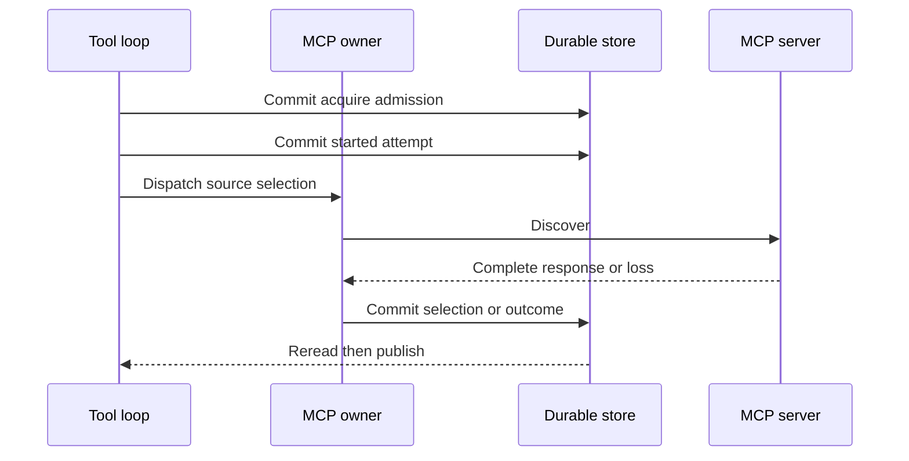

# Mandate MCP Capability Lifecycle

## Status and scope

**Approved future architecture, documentation-only.** This document is the sole detailed owner for future Mandate MCP source proposals, discovery, normalized capabilities, run-local capability selections, invocation, safe projections, disposal, recovery, and compatibility. It does not authorize an MCP client, network connection, local process, crate, schema migration, wire implementation, feature profile, UI, or production MCP work.

It applies only to future Mandate execution through the fixed `mcp` `ToolId`. M3/M4 bytes, IDs, UUIDs, digests, queues, provider behavior, replay, recovery, snapshots, and M4 `ToolCallRecorded -> tool_execution_unavailable` retain their recorded ordinary semantics. Retained bounded user connection/catalog research remains historical provenance and is not future Mandate capability state.

## Ownership and non-authorities

Architecture 13 owns Mandate lifecycle, fresh admission, uncertainty, reconciliation, and user-conflict precedence. Architecture 14 owns execution-meaning envelope, canonical framing/digests, decoder, and compatibility classes. Architecture 15 owns the fixed `mcp` slot, composition-only activation, direct admission, `ToolCallId`, generic tool loop, and effect/publication boundary. Architecture 16 owns readiness-driven fresh admission. Architecture 17 owns child/verifier relations and authority.

This document owns only MCP-specific nested-selection semantics and capability lifecycle. It is not a second registry, scheduler, lifecycle, provider, child/verifier, process supervisor, MCP administration surface, plugin system, or authority source. An MCP source, server, discovery response, capability, result, or error is evidence/data only. It cannot create or mutate a ToolId, registry entry, Mandate, lifecycle, trigger reason, RunId, scheduler candidate, Goal, Skill, confirmation, `ask_user`, child, graph message, verifier authority, target mutation, session, ordinary queue, provider selection, or execution kind.

## One fixed tool and immutable records

Dynamic acquisition means immutable **run-local capabilities beneath the one fixed `mcp` ToolId**. It never creates another ToolId, registry entry, plugin, direct primitive path, daemon, or authority. Future Mandate work supersedes retained requirements for user-created catalogs, complete-at-admission method sets, no discovery, and confirmation/corridor/quota/root-origin gates. It preserves the one gateway, typed boundary, private resources, idempotency, redaction, commit/reread publication, cancellation/disposal, and no-resume law.

Architecture 14 supplies canonical `IRCR` / `typed-tlv-v1` / SHA-256 policy. This document owns the field semantics of these conceptual records:

```text
MandateMcpCapabilitySourceV1
  source_id
  source_revision
  transport = Http | LocalStdio
  safe_endpoint_identity
  private_endpoint_generation_reference
  private_credential_generation_reference
  discovery_protocol_revision
  gateway_contract_revision
  canonical_source_digest

MandateMcpDiscoveryV1
  discovery_id
  acquisition_operation_id
  source_reference
  requesting_run_and_tool_call
  server_identity_digest
  server_revision_digest
  negotiated_protocol_revision
  discovered_set_digest
  attempt_evidence_reference
  canonical_discovery_digest

MandateMcpCapabilityRevisionV1
  capability_id
  capability_revision
  source_and_discovery_references
  remote_method_identifier
  normalized_input_result_schema_references
  remote_schema_digest
  invocation_shape
  idempotency_contract
  effect_classification
  safe_projection_revisions
  canonical_capability_digest

MandateMcpCapabilitySelectionV1
  run_id
  predecessor_selection_reference
  accumulated_selection_revision
  ordered_capability_references
  canonical_selection_digest

MandateMcpInvocationSelectionV1
  accumulated_selection_reference
  capability_reference
  typed_input_digest
  invocation_operation_id
  model_step_and_tool_call_ids
  canonical_invocation_digest
```

Every record is immutable, typed, versioned, canonical, and credential-free. An endpoint or credential-generation reference is usable only through daemon-private resolution. It is never a raw URL, command, header, token, keychain locator, SDK value, socket, process handle, raw frame, raw result, or server error body. A server identity is discovered evidence, not source identity or authority. A changed server revision or schema creates a new discovery/capability/selection revision and never retargets an old one.

Admission freezes an initial MCP acquisition contract, not methods which do not yet exist. Each model step freezes the accumulated selection revision it consumed. Each invocation freezes that exact selection, capability revision, typed input digest, idempotency identity, and daemon-assigned `ToolCallId` before external work. A later discovery cannot change an already-sent model step or invocation.

## Capability acquisition

The active architecture-15 descriptor exposes only this closed family:

```text
McpInvocationDto
  AcquireCapability { source_reference, requested_capability_hint }
  InvokeCapability { capability_reference, normalized_typed_input }
```

The hint is bounded matching input, not a generic string-method invocation. Both forms are ordinary architecture-15 tool-loop calls. MCP adds capability lifecycle evidence but no parallel loop.



Acquisition validates active Mandate run, exact frozen active descriptor, source proposal, mode, gateway/protocol compatibility, private material availability, idempotency, and intrinsic bounds. It atomically records pre-effect binding, records `Started` immediately before discovery dispatch, and performs discovery outside transactions.

The complete discovery response is normalized only into closed typed input/result schema families. Malformed, ambiguous, raw-map-only, recursive beyond intrinsic bounds, unsupported, or unrepresentable schemas fail before capability registration or invocation. On success, one transaction commits safe discovery evidence, every capability revision, one accumulated selection revision, terminal result, projections/events/snapshots/sequences, and idempotency. Partial capability visibility is forbidden. Commit is followed by scoped durable reread and publication only to a later model step.

Equal acquisition identity and semantic digest return the committed discovery/selection without another external action. Changed reuse fails before discovery. Concurrent selection commits compare the expected predecessor revision; a loser rereads and may not infer a merge or overwrite a different selection. An accepted empty discovery is a known result, not uncertainty.

## Invocation, results, and safe projection

Invocation validates exact model-step selection, selected capability, typed input, descriptor/gateway/protocol/schema revisions, private material availability, live exact compatibility, and cancellation state. It atomically binds `MandateMcpInvocationSelectionV1`, idempotency, and `ToolCallId`, then records `Started` immediately before irreversible dispatch. No external work occurs in either transaction.

An invocation cannot substitute current discovery, schema, endpoint, credential generation, registry, configuration, or another same-named method. Remote idempotency support is evidence only: it cannot authorize automatic retry, status lookup, replay, or a claim of safe repetition.

Only descriptor-owned safe projections cross the boundary:

```text
MandateMcpCapabilitySummaryV1
  safe_source_identity
  capability_id_and_revision
  bounded_display_method
  normalized_schema_references
  schema_digest
  effect_classification
  safe_projection_revisions

MandateMcpResultProjectionV1
  capability_reference
  known_terminal_class
  bounded_validated_typed_result
  safe_progress_summaries
  redacted_observation_references
```

Raw JSON/maps, headers, protocol frames, server errors, endpoint/command, credentials, SDK values, sockets, process resources, provider-native IDs, and unsafe resource details never leave the MCP boundary. Progress uses the existing tool-call fragment stream, is observational only, and is never model context until a terminal safe result commits.

A validated result, known protocol failure, known remote failure, known connection refusal, or result-schema failure with durably proven remote terminal effect is known. Result-schema mismatch after dispatch without that proof is not pre-effect incompatibility: it is an unknown started effect.

## Readiness, cancellation, recovery, and reconciliation

MCP readiness is typed operational evidence for resources named by frozen source/acquisition semantics, such as descriptor implementation, exact private material generation, transport/process capacity, or protocol support. It must not perform discovery. The scheduler cannot select sources/capabilities, start a local service, mutate a selection, reserve capacity, repair meaning, or retry acquisition/invocation. Run-local acquisition is tool-loop work after admission.

Before `Started`, cancellation or restart records a known before-start outcome and no MCP effect occurs. After `Started`, only durable terminal proof makes the result known. Otherwise exact acquisition/invocation attempt evidence records `ExternalEffectUnknown` and architecture 13 pauses only the owning Mandate. Cancellation prevents later calls/model steps, suppresses late facts, and disposes private resources without asserting rollback.

Local stdio resources are run-owned and lazy. They are disposed on completion, cancellation, failure, or interruption, never shared with another run, and never reattached after restart. HTTP connections and local process epochs are private operational evidence, not durable execution authority.

Recovery completes before readiness/admission. It validates historical MCP records, classifies unfinished attempts, disposes private resources, establishes fresh readiness epochs without dispatch, and never reconnects, polls, reattaches, respawns, retries, resumes, rediscoveries, or repeats old discovery/invocation work. A fresh run imports no live process, connection, credential handle, or accumulated selection; it acquires again. Earlier discovery remains audit evidence only. Exact reconciliation names the uncertainty and frozen attempt baseline and may yield only Mandate `Active` for later fresh work or `Stopped`.

## Child, verifier, protocol, and compatibility boundaries

A child has its own MCP acquisition lifecycle. Delegation may carry only explicit safe source/provenance references, never a live process, connection, credential handle, accumulated selection, invocation, or unfinished effect. Parent controls cannot invoke, widen, inspect private resources, or reconcile child MCP work. Child MCP uncertainty remains child-local.

Verifier MCP work belongs only to the verifier Mandate. An MCP result is evidence and cannot issue, expand, consume, or exercise verifier authority or mutate a target. Verifier MCP uncertainty pauses only the verifier.

Future MCP projections use a separately negotiated Mandate capability layered with `model_tool_loop_v1`: authoritative initial replay/resync/error, bounded ordered discovery/capability/selection/invocation history, then live frames through one post-commit gate. Replay is read-only and causes no discovery, invocation, process start, retry, or publication. Unnegotiated peers fail closed without a partial ordinary snapshot.

M3/M4 and retained bounded-MCP/RLM records gain no synthetic source, discovery, capability, selection, process, authority, or execution-kind state. M4 `ToolCallRecorded` remains denial evidence. No historical record, current server, endpoint, credential, schema, registry, configuration, ancestry, Goal, Skill, UI, logs, or remote continuation state may reconstruct missing MCP meaning.

## Dependencies and non-goals

This document depends on architectures 13–17 and decisions 0001, 0002, 0003, 0004, 0006, 0007, 0008, and 0009. It does not define direct MCP administration, an MCP listener/inbound daemon attachment, raw string-method transport, arbitrary maps/headers/schemas, plugins/installations, dynamic ToolIds, long-lived workers/supervision, provider evolution, bridge/IPython, Skills/Goals/context semantics, session forks, activity/UI, schema, migrations, crates, Cargo, Makefile/CI, or production implementation.

Architecture 19 may carry safe MCP projections through its shared ingress and
delivery path. It cannot discover, select, invoke, reattach, or recreate MCP
work independently, and bridge replay remains zero-effect.

It introduces no Mandate product depth/count/calendar/lifetime/concurrency ceiling. Intrinsic representation/protocol bounds and actual finite resource capacity remain separately typed, with no truncation, reservation, hidden retry counter, or quota.

## Required evidence before implementation

A later activating specification must declare exact crate owners, targets, coverage tiers, feature profiles, architecture fixtures, and storage/wire versions, then pass `make quick`, `make verify`, and Linux/Windows CI. It must cover:

- canonical source/discovery/server/capability/selection/model-step/invocation goldens and negative vectors with cross-platform equality;
- fixed-slot/composition/no-bypass and server-non-authority fixtures;
- supported and rejected schema normalization, private-resource redaction, safe progress/result validation, and no partial model context;
- acquisition/invocation idempotency, changed reuse, predecessor conflicts, model-step freeze, schema drift, credential-generation mismatch, and no-current-state reconstruction;
- fault injection at every binding, start, discovery, normalization, capability/selection/result/projection, event/snapshot/sequence/idempotency, reread, and publication boundary;
- HTTP/local-stdio before-start/started/known/unknown cancellation/crash matrices, disposal/no sharing/no reattach/no retry/no rediscovery, and fresh-run reacquisition;
- scheduler non-authority, child isolation, verifier evidence non-authority, deterministic user-precedence races, negotiated replay/resync, and zero-effect replay;
- M3/M4 byte/meaning/replay/recovery/provider and M4 denial preservation, retained bounded-MCP/RLM non-migration, historical startup, and readable-not-executable isolation; and
- end-to-end acquisition visible only to a later model step, invocation, known failure, schema drift, unavailable resource, unknown effect/reconciliation, restart, hostile-server redaction, and historical database outcomes.

Kernel-originated MCP work still uses this document's fixed `mcp` lifecycle
through the bridge and tool loop. Checkpoints contain no live MCP state and later
runs reacquire capabilities.

Architecture 21 owns Goal, Skill, context, memory, and compaction semantics. Context is safe non-authorizing projection only and cannot discover/select/invoke MCP, create a capability, or reconstruct an MCP selection.

Architecture 22 owns provider profiles and reasoning semantics. Provider
selection cannot discover, select, invoke, or reconstruct MCP; provider and MCP
private credentials/resources remain separate and non-authorizing.
