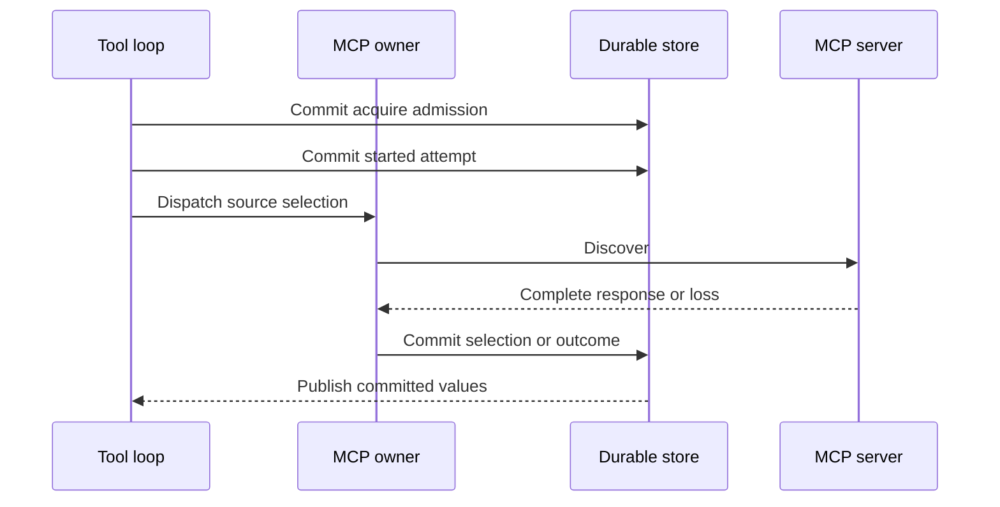

# MCP Capability Lifecycle

**Approved future design. Not implemented; activation requires an activating specification.**

Owner: architecture 18. Research: m4plus_concept.md.

This document owns future MCP source proposals, discovery, normalized capabilities, run-local capability
selections, invocation, safe projections, disposal, recovery, and compatibility. It applies only to future run
execution through the fixed `mcp` `ToolId`. Retained bounded user connection/catalog research remains historical
provenance, not future MCP capability state.

## Ownership and non-authorities

Architecture 14 is the historical record of the removed execution-meaning envelope, canonical framing, decoders, and
compatibility classes (ADR 0012). Architecture 15 owns the fixed `mcp` slot, composition-only activation, direct
admission, `ToolCallId`, generic tool loop, and effect/publication boundary.

This document owns only MCP-specific nested-selection semantics and capability lifecycle. It is not a second registry,
lifecycle, provider, child, process supervisor, MCP administration surface, plugin system, or authority source. An MCP
source, server, discovery response, capability, result, or error is evidence/data only: it cannot create or mutate a
ToolId, registry entry, lifecycle, `RunId`, Goal, Skill, `ask_user`, child, session, ordinary turn input,
or provider selection.

## One fixed tool and immutable records

Dynamic acquisition means immutable **run-local capabilities beneath the one fixed `mcp` ToolId**. It never creates
another ToolId, registry entry, plugin, direct primitive path, daemon, or authority. Future work supersedes
retained requirements for user-created catalogs, complete-at-admission method sets, no discovery, and
quota gates, and it preserves the one gateway, typed boundary, private resources, idempotency,
redaction, publication after commit, cancellation/disposal, and no-resume law.

Typed serde JSON (ADR 0012) supplies the record shape; the removed `IRCR` / `typed-tlv-v1` / SHA-256 canonical policy is
not revived. This document owns the field semantics of these conceptual records. The concept2 names
`McpCapabilitySourceDto`, `McpDiscoveryDto`, and `McpCapabilityRevisionDto` are research-only; the
authoritative names are the `V1` records below, whose fields (private endpoint/credential generation references,
acquisition operation identity, requesting run and tool call, server revision reference, attempt evidence, effect
classification, invocation operation identity) supersede the concept2 reduced field sets:

```text
McpCapabilitySourceV1
  source_id
  source_revision
  transport = Http | LocalStdio
  safe_endpoint_identity
  private_endpoint_generation_reference
  private_credential_generation_reference
  discovery_protocol_revision
  gateway_contract_revision

McpDiscoveryV1
  discovery_id
  acquisition_operation_id
  source_reference
  requesting_run_and_tool_call
  server_identity_reference
  server_revision_reference
  negotiated_protocol_revision
  discovered_set_reference
  attempt_evidence_reference

McpCapabilityRevisionV1
  capability_id
  capability_revision
  source_and_discovery_references
  remote_method_identifier
  normalized_input_result_schema_references
  remote_schema_reference
  invocation_shape
  idempotency_contract
  effect_classification
  safe_projection_revisions

McpCapabilitySelectionV1
  run_id
  predecessor_selection_reference
  accumulated_selection_revision
  ordered_capability_references

McpInvocationSelectionV1
  accumulated_selection_reference
  capability_reference
  typed_input_reference
  invocation_operation_id
  model_step_and_tool_call_ids
```

Every record is immutable, typed, versioned, and credential-free. An endpoint or credential-generation reference is
usable only through daemon-private resolution; it is never a raw URL, command, header, token, keychain locator, SDK
value, socket, process handle, raw frame, raw result, or server error body. A server identity is discovered evidence,
not source identity or authority. A changed server revision or schema creates a new discovery/capability/selection
revision and never retargets an old one.

Admission freezes an initial MCP acquisition contract, not methods which do not yet exist. Each model step freezes the
accumulated selection revision it consumed, and each invocation freezes that exact selection, capability revision, typed
input, and daemon-assigned `ToolCallId` under the turn idempotency key ([architecture
04](04-sessions-runs-events-and-storage.md)) before external work. A later discovery cannot change an
already-sent model step or invocation.

## Capability acquisition

The active architecture-15 descriptor exposes only this closed family:

```text
McpInvocationDto
  AcquireCapability { source_reference, requested_capability_hint }
  InvokeCapability { capability_reference, normalized_typed_input }
```

The hint is bounded matching input, not a generic string-method invocation. Both forms are ordinary architecture-15
tool-loop calls; MCP adds capability lifecycle evidence but no parallel loop.



Acquisition validates an active run, exact frozen active descriptor, source proposal, mode, gateway/protocol
compatibility, private material availability, and intrinsic bounds. It atomically records pre-effect binding, records
`Started` immediately before discovery dispatch, and performs discovery outside transactions.

The complete discovery response is normalized only into closed typed input/result schema families; malformed, ambiguous,
raw-map-only, recursive beyond intrinsic bounds, unsupported, or unrepresentable schemas fail before capability
registration or invocation. On success, one transaction commits safe discovery evidence, every capability revision, one
accumulated selection revision, and the terminal result; no external action occurs inside it, and partial capability
visibility is forbidden. Publication to a later model step follows the commit. Equal acquisition identity and equal
typed request return the committed discovery/selection without another external action, changed reuse fails before
discovery, and concurrent selection commits compare the expected predecessor revision: a loser rereads and may not infer
a merge or overwrite a different selection. An accepted empty discovery is a known result.

## Invocation, results, and safe projection

Invocation validates exact model-step selection, selected capability, typed input, descriptor/gateway/protocol/schema
revisions, private material availability, live exact compatibility, and cancellation state. It commits the binding of
`McpInvocationSelectionV1` and `ToolCallId` in one transaction, then records `Started` immediately before irreversible
dispatch; no external work occurs in either transaction. An invocation cannot substitute current discovery, schema,
endpoint, credential generation, registry, configuration, or another same-named method, and remote idempotency support
is evidence only: it cannot authorize automatic retry, status lookup, replay, or a claim of safe repetition.

Only descriptor-owned safe projections cross the boundary:

```text
McpCapabilitySummaryV1
  safe_source_identity
  capability_id_and_revision
  bounded_display_method
  normalized_schema_references
  schema_reference
  effect_classification
  safe_projection_revisions

McpResultProjectionV1
  capability_reference
  known_terminal_class
  bounded_validated_typed_result
  safe_progress_summaries
  redacted_observation_references
```

Raw JSON/maps, headers, protocol frames, server errors, endpoint/command, credentials, SDK values, sockets, process
resources, provider-native IDs, and unsafe resource details never leave the MCP boundary. Progress uses the existing
tool-call fragment stream, is observational only, and is never model context until a terminal safe result commits. A
validated result, known protocol failure, known remote failure, known connection refusal, or result-schema failure with
durably proven remote terminal effect is known; a result-schema mismatch after dispatch without that proof is not
pre-effect incompatibility but a started effect without terminal proof.

## Readiness, cancellation, and recovery

MCP readiness is typed operational evidence for resources named by frozen source/acquisition semantics, such as
descriptor implementation, exact private material generation, transport/process capacity, or protocol support. It must
not perform discovery and cannot select sources/capabilities, start a local service, mutate a selection, repair meaning,
or retry acquisition/invocation; run-local acquisition is tool-loop work after admission.

Before `Started`, cancellation or restart records a known before-start outcome and no MCP effect occurs; after
`Started`, only durable terminal proof makes the result known, and otherwise the interrupted acquisition/invocation
commits a bounded `Partial` result with its notice. A partial result pauses nothing: the next model step proceeds, and
the interrupted call is never repeated. Cancellation prevents later calls/model steps, suppresses late facts, and
disposes private resources without asserting rollback.

Local stdio resources are run-owned and lazy: they are disposed on completion, cancellation, failure, or interruption,
never shared with another run, and never reattached after restart. HTTP connections and local process epochs are private
operational evidence, not durable execution authority.

MCP recovery validates historical MCP records, classifies unfinished attempts, disposes private resources, establishes
fresh readiness epochs without dispatch, and never reconnects, polls, reattaches, respawns, retries, resumes,
rediscovers, or repeats old discovery/invocation work. A fresh run imports no
live process, connection, credential handle, or accumulated selection; it acquires again, and earlier discovery remains
audit evidence only.

## Child, protocol, and compatibility boundaries

A child has its own MCP acquisition lifecycle. A child run may receive only explicit safe source/provenance references,
never a live process, connection, credential handle, accumulated selection, invocation, or unfinished effect; parent
controls cannot invoke, widen, or inspect private resources, and an interrupted child MCP call's partial result remains
child-local.

Future MCP projections use typed JSON-RPC 2.0 methods (ADR 0011) layered with the `model_tool_loop_v1` descriptor/model
capability: live notifications through one post-commit gate; reconnect re-reads current state, and there is no event
tail, cursor, or resynchronization. No caller receives a partial ordinary snapshot. M3/M4 and retained bounded-MCP/RLM
records gain no synthetic source, discovery, capability, selection, process, or authority state; historical M4 tool
calls remain denial evidence, and no historical record, current server, endpoint, credential, schema, registry,
configuration, ancestry, Goal, Skill, UI, logs, or remote continuation state may reconstruct missing MCP meaning.

## MCP detail: bounded gateway, bounds, and safe failures

The bounded MCP gateway is the canonical `mcp` gateway `ToolId`, owned by a future MCP boundary and assembled only
through the existing Rust-owned registry and gateway; it is not a second registry. Its descriptor selects a bounded
catalog of explicit user-approved `McpMethodDto` records, each naming exactly one connection and method, closed typed
request/result families, schema reference, effect classification, safe result projection, and immutable revision. It is
never a generic string-method call, raw JSON transport, arbitrary header map, or automatic exposure of a discovered
remote method, and a method whose schema does not fit a supported closed family is unavailable.

A connection has `Project` or `Session` scope; the user alone creates, edits, archives, restores, and selects a
connection and methods, and a model may only prepare a draft under the selected proposal rules. Credentials, OAuth
material, SDK objects, sockets, child-process handles, and endpoint resources remain private daemon material and never
enter a DTO, log, diagnostic, card, model context, or safe result. The selected transports are
user-created outgoing `HTTP`/`HTTPS` connections and user-created local standard-input/output services. The daemon
starts a local service only upon the first selected MCP call in one run; that private process serves only that run and
is terminated when the run completes, cancels, fails, or is interrupted, and it is never attached by a later daemon,
shared with another run, treated as a durable worker, or managed as a long-lived process.

Every MCP call passes the same registry selection, daemon-bound authority, typed admission, durable outcome,
cancellation, redaction, and post-commit publication rules as another registered tool. Connection, method,
schema, and gateway revisions are frozen in the call and run selection. A remote schema mismatch fails closed before an
external effect; an already started ambiguous call is never
repeated and commits a bounded `Partial` result with its notice when appropriate. A service may emit bounded safe
progress through the ordinary durable output stream but cannot invoke `ask_user`, and it cannot create a Goal,
proposal, session, run, connection, tool registration, child agent, or another authority context. There is no
MCP listener, remote attachment to the daemon bridge, plug-in system, Skill/MCP
installation, dynamic tool registration, server-driven child control, autonomous continuation, or claim that a local
service is isolated from the user's ordinary OS authority.

The MCP-related closed safe failures through `ErrorDto` are:

```text
mcp_connection_unavailable
mcp_method_unavailable
mcp_schema_mismatch
mcp_local_process_unavailable
mcp_progress_limit_exceeded
mcp_user_interaction_unavailable
```

They disclose no credential, path, raw external response, private process resource, grant, or implementation detail. The
package continues to exclude autonomous continuation, work after client disconnection,
attachments/images/binary/rich-MIME input, dynamic extensions and installation, dynamic tool registration, physical
deletion, and administration of long-lived workers, leases, attach/detach, force-kill, or supervisor recovery.
Work/continuation/requeue after client disconnection is an accepted post-M5 future direction, to be executed in
Milestone 5+ as an explicit durable contract that never silently resumes old external work; it is not activated here.

## Dependencies and non-goals

This document depends on architectures 14 and 15 and decision 0001. It defines no direct MCP
administration, an MCP listener/inbound daemon attachment, raw string-method transport, arbitrary maps/headers/schemas,
plugins/installations, dynamic ToolIds, long-lived workers/supervision, provider evolution, bridge/IPython,
Skills/Goals/context semantics, session forks, activity/UI, schema, migrations, crates, Cargo, Makefile/CI, or
production implementation. It introduces no product depth/count/calendar/lifetime/concurrency ceiling: intrinsic
representation/protocol bounds and actual finite resource capacity remain separately typed, with no truncation, hidden
retry counter, or quota.

Architecture 19 may carry safe MCP projections through its shared ingress and delivery path but cannot discover, select,
invoke, reattach, or recreate MCP work independently. Architecture 20
kernel-originated MCP work still uses this document's fixed `mcp` lifecycle through the bridge and tool loop,
checkpoints contain no live MCP state, and later runs reacquire capabilities. Architectures 21-24 own
Goal/Skill/context, provider, fork, and activity semantics: context is safe non-authorizing projection only, provider
and MCP private credentials/resources remain separate and non-authorizing, no live MCP state crosses a fork, and
activity projections expose only safe MCP provenance without discovering, selecting, invoking, reconnecting, or
recreating MCP work.
