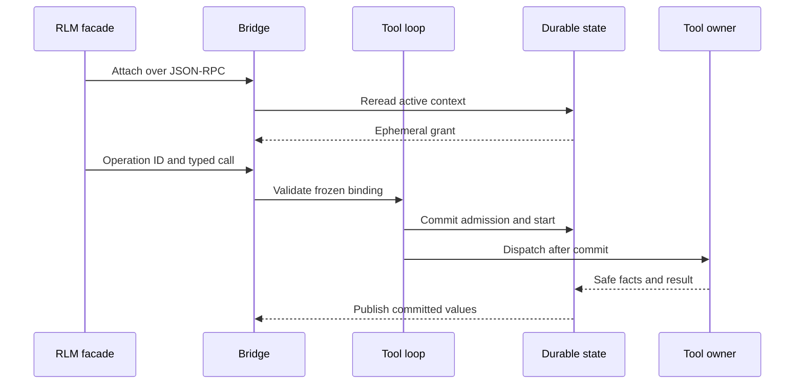

# Gateway/RLM Bridge

**Approved future design. Not implemented; activation requires an activating specification.**

Owner: architecture 19.

This document owns future Gateway/RLM attachment, ephemeral bridge grant, ingress operation correlation, safe
bridge-visible delivery, and bridge recovery. It applies only to future run execution. Retained RLM bridge, child, and
activity material remains research provenance and historical-only where it conflicts with architectures 15--18.

## Ownership and one capability path

The removed execution-meaning envelope and decoders ([architecture
02](02-dto-and-contract-policy.md)) leave no live path; 15 owns the
fixed registry, frozen tool selection, direct admission, model-tool loop, `ToolCallId`, generic effect evidence, and
recovery; 18 owns MCP source, discovery, selection, invocation, and recovery.

This document owns only bridge attachment, grant, operation identity, ingress correlation, safe bridge projection,
cancellation propagation, and bridge-local recovery classification; it is not a second registry, gateway,
daemon, lifecycle, tool implementation, child executor, MCP client, provider selector, persistence authority, sandbox,
or OS privilege boundary.

Python/RLM facade code, direct model ingress, kernels, children, MCP servers, providers, adapters, bridge channels,
grants, operation IDs, current configuration, readiness, evidence, and retained RLM identities cannot create or widen
tool, lifecycle, child, or reconciliation authority; every invocation reaches architecture 15's one daemon-owned,
Rust-owned capability path.

## Immutable bridge selection and ephemeral grant

This document owns the semantic fields of the credential-free nested bridge selection in the future typed run record
(typed serde JSON, [architecture 02](02-dto-and-contract-policy.md)):

```text
BridgeSelectionV1
  gateway_contract_revision
  ingress_family
  safe_projection_revision
  operation_binding_revision
```

It freezes the executable bridge contract, not a live attachment, and excludes a grant, daemon epoch, channel, kernel,
process, connection, endpoint, credential, registry state, descriptor handle, live readiness, child identity, and
external resource.

After a durable reread proves a supported active run, exact frozen bridge and tool selections, active model step, and no
cancellation gate, the daemon alone may issue an opaque ephemeral grant:

```text
BridgeAttachmentGrantV1
  opaque_grant_id
  daemon_epoch
  issued_protocol_revision
  run_id
  model_step_position
```

A grant binds its holder to one daemon-held `SessionId`, `RunId`, originating `TurnId`, and the daemon-assigned
model-step position (never caller-selected). It is non-secret ephemeral transport evidence for one daemon epoch and live
daemon process, not a credential, durable record, semantic selection, lifecycle permission, policy decision, or
caller-selected identity. It expires on model-step closure, run terminalization or interruption, cancellation
reaching the bridge gate, channel detachment, or daemon exit, and never enters the future typed run record, model
messages, model context, logs, diagnostics, or a public projection. A persistent Python namespace may outlive an
expired grant but must obtain a newly issued grant before invoking a tool for a later run.

## Attachment, operation identity, and admission

Bridge attachment is a future additive surface on the repository's JSON-RPC 2.0 local protocol ([architecture
03](03-daemon-transport-and-adapters.md)), reusing the
version-only hello, the existing private per-user Unix-socket/Windows-named-pipe endpoint, the **1 MiB message bound**,
and the OS-user access boundary; it requires `model_tool_loop_v1` descriptor/model support whenever the peer receives
future tool-loop facts. An unsupported request fails with a typed error before a partial bridge result or live
notification is delivered. There is no second local listener, TCP/HTTP endpoint, remote attachment,
credential, sandbox, or daemon.

`BridgeOperationId` is the caller-stable idempotency identity of one bridge ingress request, distinct from the
diagnostic `CorrelationIdDto` and the daemon-assigned `ToolCallId`. A durable operation binding records only typed
references:

```text
BridgeOperationV1
  bridge_operation_id
  run_id
  model_step_position
  tool_id
  descriptor_revision
  typed_input_reference
  tool_call_id
  admission_outcome
  attempt_reference
```

It excludes the grant, raw input, Python/Jupyter value, provider value, path, endpoint, credential, SDK object, handle,
process, socket, and raw output. The facade creates and retains `BridgeOperationId`; an in-daemon direct-model ingress
receives an equivalent stable ID from the gateway before admission. The daemon validates the opaque grant, resolves the
selected active descriptor, and assigns the canonical `ToolCallId`, durably binding the operation to the authority
context, `ToolId`, descriptor revision, and the non-public typed input before any external action; the record contains
no grant value, credential, raw input, Python/Jupyter value, provider value, workspace root, implementation handle, or
source path.

Bridge ingress validates the grant/epoch, exact run/revision/model step, frozen bridge and descriptor selection,
operation identity, typed input, intrinsic bounds, and live availability, then invokes architecture 15's generic
admission contract. The only bridge admission outcomes are `Admitted`, typed `Incompatible`, typed `Unavailable`, an
idempotent existing binding, or an operation conflict; quota, parent, Goal, Skill, provider, or bridge-specific
authorization cannot be introduced.

Reuse with a different authority context, `ToolId`, descriptor revision, or typed input fails pre-effect with
`bridge_operation_conflict`; an equal command returns the saved binding, current admission state, stream attachment, or
terminal safe result and never admits, starts, or executes a second action. `ToolCallId` remains the one canonical
identity for the call's durable records and stream frames. Before the call start boundary, a bound operation may report
`Admitted`; on daemon recovery an admitted operation that never reached start records `InterruptedBeforeStart`; once the
call has started, a repeat is read-only and returns only durable evidence, never re-executing.



## Effects, delivery, cancellation, and recovery

Architecture 15's committed call start is the only generic durable boundary after which a bridge-routed external effect
may be possible; the bridge introduces no second start marker, result stream, or terminal-result frame. Fragments and
terminal results remain architecture-15 records demultiplexed by `ToolCallId`. Each state change is one transaction;
there is no separate event or ordering record. Publication occurs only after commit, from the values the commit
recorded; publisher/channel failure cannot roll back a commit or cause redispatch.

Before the call start boundary, cancellation or recovery records known `CancelledBeforeStart` or
`InterruptedBeforeStart`. After start, a durably proven terminal result remains known; without terminal proof the exact
attempt commits a bounded `Partial` result with its notice, and the next model step proceeds. Known validation, denial,
protocol, tool, or remote failures remain known when terminal effect proof exists.

Channel close and grant expiry do not interrupt a run; run interruption remains owner-controlled and
the bridge only propagates it. The first bridge contract adds no per-`ToolCallId` interruption command: `run.interrupt`
signals the registered execution, ends the in-flight operation with its bounded `Partial` result and notice, and keeps
the run `Running`, and a valid durable interruption/result race is decided by the first committing mutation, with the
loser rereading and unable to overwrite. Late fragments/results after interruption, terminalization, grant
expiry, or restart are non-authoritative and cannot append durable records.

Bridge recovery invalidates old grants, disposes private bridge-side resources, classifies operations only from durable
evidence, and rebuilds safe projections only from supported records. It never reissues an old grant, re-admits an old
operation, reattaches a facade/kernel/task, retries/reruns a tool, recreates a child, polls remote work, or
reconstructs meaning from current registry, configuration, kernel, process, channel, or graph state. Post-restart
lookup is read-only; later work requires a new `RunId`, fresh admission, a new grant, and new operation identity.

## Child, MCP, and protocol boundaries

For `sub_agent`, the bridge performs only generic ingress and architecture-15 admission, returns only safe references
and result projections, and assigns no child identity, control, message, terminalization, or authority. A child never
inherits a live bridge grant, kernel, provider continuation, MCP selection, connection, process, or unfinished effect,
and a child run requires its own fresh admission.

Bridge transport may carry only architecture-18 safe MCP projections and cannot discover, select, invoke, reattach, or
recreate MCP work. Reconnect re-reads current state; there is no event tail, cursor, or resynchronization, and bridge
delivery cannot create a bridge-owned sequence, start a child, rediscover/invoke MCP, or execute external work.

## Bridge detail: DTOs, limits, and safe failures

The first-scope versioned typed bridge DTO families are:

```text
BridgeRunGrantDto
  opaque_grant_identity
  issued_protocol_revision

BridgeAttachmentResponseDto
  bridge_run_grant

BridgeInvocationCommandDto
  bridge_run_grant
  bridge_operation_id
  typed_tool_invocation

BridgeInvocationAcceptedDto
  bridge_operation_id
  tool_call_id
  admission_state
```

One attached peer sends correlated attachment, invocation, operation-read, and run-control commands; the daemon sends
correlated responses and uncorrelated `RunStreamFrameDto` values over the same persistent local connection. The
first-scope bounds are transport and liveness safeguards only:

- **1 MiB** per local frame;
- a bounded slow-peer subscription path enforced by the host's subscriber queue and write deadline ([architecture
03](03-daemon-transport-and-adapters.md)); and
- **512 KiB** per durable record.

Bridge operations are admitted independently: the bridge keeps no unfinished-operation counter, and each invocation
passes architecture 15's admission contract before any external action. There is no broader buffer, alternate deadline,
truncation rule, or unbounded queue. The bounded slow-peer path never delays durable execution or healthy subscribers:
a slow or detached peer is bounded by the host's slow-peer path without blocking execution, persistence, or healthy
peers. Reconnect re-reads current state; there is no event tail, cursor, or resynchronization. The bridge never treats
channel state as authoritative or repeats external work.

The closed bridge safe failures through `ErrorDto` are:

```text
daemon_tool_gateway_required
bridge_authority_unavailable
bridge_authority_expired
bridge_operation_conflict
bridge_operation_not_found
```

They disclose no credential, path, grant value, raw input, Python/Jupyter value, provider resource, process topology, or
implementation detail.

## Compatibility, dependencies, and non-goals

M4 provider kinds remain `openrouter` and `generic-chat-completion-api`; model names do not select a provider or bridge
contract. Historical M4 tool calls remain denial evidence. Historical M3/M4 and retained RLM records gain no bridge
grant, operation, MCP selection, Skill, Goal, activity, or policy state, and no current mutable state may reconstruct
missing bridge meaning. Retained RLM `SubAgentId`, `RlmParentLinkDto`, session/run-rooted
trees, policy inheritance, queues, activity identities, and product limits remain historical only; no later bridge may
reference exact legacy bytes, rewrite, normalize, or synthesize future state
([architecture 00](00-principles-and-scope.md)).

This document depends on architectures 15 and 18. Related
owners: 20 owns kernel process/namespace/checkpoint lifecycle; 21 owns Goal, Skill, context, memory, and compaction
(bridge-delivered context is safe immutable projection only); 22 owns provider profile/capability semantics (bridge
delivery uses only safe existing provider facts); 23 owns ordinary Session forks (no bridge grant or operation crosses
one); 03 owns activity/UI projections (bridge grants, operations, and resources never become activity authority or
public activity payload). It does not define kernel lifecycle, RLM executor or recursion topology, provider evolution,
Skills, Goals, context, session forks, activity/UI, direct MCP administration, SQL, migrations, wire tags, crates,
Cargo, Makefile/CI, or production implementation.
