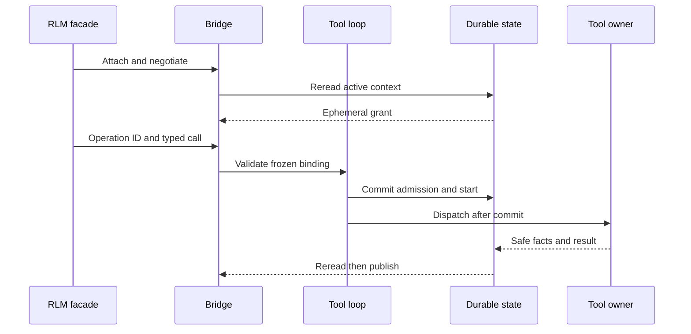

# Mandate Gateway/RLM Bridge

## Status and scope

## Traceability

- Normative owner: architecture 19.
- Decision record: [`0011`](../decisions/0011-mandate-gateway-rlm-bridge.md).
- Detail decisions: [`0027`](../decisions/0027-child-kernel-bridge-mcp-detail-directions.md) (bridge detail), [`0032`](../decisions/0032-accepted-deferred-directions-activity-metadata-content-inspection-per-call-cancellation.md) (per-call cancellation direction).
- Reconciliation topics: `BRG-001..015`.
- Research provenance: [`m4plus_concept2.md`](../m4plus_concept2.md).
- Status: documentation-approved; implementation-authorized work requires a later activating specification.


**Approved future architecture, documentation-only.** This document is the sole
detailed owner for future Mandate Gateway/RLM attachment, ephemeral bridge grant,
ingress operation correlation, safe bridge-visible delivery, and bridge recovery.
It does not authorize a crate, Python dependency, kernel, listener, storage
migration, wire implementation, runtime, or production bridge work.

It applies only to future Mandate execution. M3/M4 bytes, IDs, UUIDs, digests,
cursors, events, snapshots, queue tickets, provider behavior, replay, recovery,
and M4 `ToolCallRecorded -> tool_execution_unavailable` retain their recorded
ordinary semantics. Retained RLM bridge, child, and activity material remains
research provenance and historical-only where it conflicts with architectures
13--18.

## Ownership and one capability path

Architecture 13 owns Mandate lifecycle, fresh admission, uncertainty, and exact
reconciliation. Architecture 14 owns the execution envelope, canonical framing,
digest, decoder, and compatibility classes. Architecture 15 owns the fixed
registry, frozen tool selection, direct admission, model-tool loop, `ToolCallId`,
generic effect evidence, and recovery. Architecture 16 owns scheduler
reevaluation and readiness-driven admission. Architecture 17 owns child Mandates,
graph edges, delegation, controls, terminalization, and verifier authority.
Architecture 18 owns MCP source, discovery, selection, invocation, and recovery.

This document owns only bridge attachment, grant, operation identity, ingress
correlation, safe bridge projection, replay, cancellation propagation, and
bridge-local recovery classification. It is not a second registry, gateway,
daemon, lifecycle, scheduler, tool implementation, child executor, MCP client,
provider selector, verifier authority, persistence authority, sandbox, or OS
privilege boundary.

Python/RLM facade code, direct model ingress, kernels, children, MCP servers,
providers, adapters, bridge channels, grants, operation IDs, current
configuration, readiness, evidence, and retained RLM identities cannot create or
widen tool, lifecycle, scheduling, child, verifier, or reconciliation authority.
Every invocation reaches architecture 15's one daemon-owned, Rust-owned
capability path.

## Immutable bridge selection and ephemeral grant

Architecture 14 owns canonical record framing. This document owns the semantic
fields of the credential-free nested bridge selection in future Mandate meaning:

```text
MandateBridgeSelectionV1
  gateway_contract_revision
  ingress_family
  required_protocol_capabilities
  safe_projection_revision
  operation_binding_revision
  canonical_bridge_selection_digest
```

It freezes the executable bridge contract, not a live attachment. It excludes a
grant, daemon epoch, channel, cursor, kernel, process, connection, endpoint,
credential, registry state, descriptor handle, live readiness, child identity,
and external resource.

After a durable reread proves a supported active Mandate run, exact frozen bridge
and tool selections, active model step, and no cancellation or uncertainty gate,
the daemon alone may issue an opaque ephemeral grant:

```text
BridgeAttachmentGrantV1
  opaque_grant_id
  daemon_epoch
  issued_protocol_revision
  execution_kind
  mandate_id
  mandate_revision
  run_id
  model_step_id
```

The grant is non-secret transport evidence for one daemon epoch and active
context. It is not a credential, durable fact, semantic selection, lifecycle
permission, policy decision, child delegation, verifier authority, or
caller-selected identity. It expires on model-step closure, run terminalization
or interruption, cancellation reaching the bridge gate, channel detachment, or
daemon exit. It never enters canonical meaning, events, snapshots, tool facts,
model context, logs, diagnostics, child delegation, or public replay.

## Attachment, operation identity, and admission

`daemon_tool_gateway_v1` is a future additive capability. Attachment uses the
existing local protocol negotiation and requires `model_tool_loop_v1` whenever
the peer receives future tool-loop facts. Unsupported or incomplete negotiation
fails closed before a partial bridge result, history page, snapshot, or live fact
is delivered. The package creates no second local listener, TCP/HTTP endpoint,
remote attachment, or daemon.

`BridgeOperationId` is the caller-stable idempotency identity of one bridge
ingress request. It is distinct from diagnostic correlation and daemon-assigned
`ToolCallId`. A durable operation binding records only typed references:

```text
BridgeOperationV1
  bridge_operation_id
  run_id
  mandate_id
  mandate_revision
  model_step_id
  tool_id
  descriptor_revision
  typed_input_digest
  tool_call_id
  admission_outcome
  attempt_reference
```

It excludes the grant, raw input, Python/Jupyter value, provider value, path,
endpoint, credential, SDK object, handle, process, socket, and raw output. Equal
operation identity and semantic digest return the committed binding or safe
durable outcome without another `ToolCallId`, child, or effect. Changed reuse
fails before mutation or effect.

Bridge ingress validates the grant/epoch, exact run/revision/model step, frozen
bridge and descriptor selection, operation idempotency, typed input, intrinsic
bounds, and live availability. It then invokes architecture 15's generic
admission contract. For Mandate execution the only bridge admission outcomes are
`Admitted`, typed `Incompatible`, typed `Unavailable`, an idempotent existing
binding, or an operation conflict. `AwaitingConfirmation`, corridor, quota,
reservation, root-origin, parent, Goal, Skill, provider, or bridge-specific
authorization cannot be introduced.



## Effects, delivery, cancellation, and recovery

Architecture 15's `ToolCallStarted` is the only generic durable boundary after
which a bridge-routed external effect may be possible. The bridge introduces no
second start marker, result stream, terminal-result frame, or sequence.
Fragments and terminal results remain architecture-15 facts on the shared run
cursor and use `ToolCallId` for demultiplexing. Publication occurs only after
commit and an independent scoped durable reread. Publisher/channel failure
cannot roll back a commit or cause redispatch.

Before `ToolCallStarted`, cancellation or recovery records known
`CancelledBeforeStart` or `InterruptedBeforeStart`. After start, a durably proven
terminal result remains known. Without terminal proof, the exact attempt becomes
`ExternalEffectUnknown` and architecture 13 pauses only its owning Mandate.
Known validation, denial, protocol, tool, or remote failures remain known when
terminal effect proof exists.

Channel close, slow-peer resync, and grant expiry do not cancel a run. Run
cancellation remains owner-controlled; the bridge only propagates it. The first
bridge contract adds no per-`ToolCallId` cancellation command: run cancellation
uses the existing `StopRunCommandDto` and `Running -> Cancelling -> Cancelled`
lifecycle. A valid
durable cancellation/result race is decided by the first committing mutation;
the loser rereads and cannot overwrite. Cancellation blocks later admissions and
model steps. Late fragments/results after cancellation, terminalization, grant
expiry, or restart are non-authoritative and cannot append durable facts or
repair uncertainty.

Recovery completes before attachment, readiness, scheduling, or fresh admission.
It invalidates old grants, disposes private bridge-side resources, classifies
operations only from durable evidence, and rebuilds safe projections only from
supported records. It never reissues an old grant, re-admits an old operation,
reattaches a facade/kernel/task, retries/reruns a tool, recreates a child, polls
remote work, or reconstructs meaning from current registry, configuration,
kernel, process, channel, or graph state. Post-restart lookup and replay are
read-only. Later work requires a new `RunId`, fresh admission, a new grant, and
new operation identity.

## Child, verifier, MCP, and protocol boundaries

For `sub_agent`, the bridge performs only generic ingress and architecture-15
admission. Architecture 17 validates the parent run and creating `ToolCallId`
and atomically creates the child Mandate, edge, delegation snapshot, graph
projections, and parent terminal result. The bridge returns only safe references
and result projections. It assigns no child identity, edge, control, message,
terminalization, or authority; a child never inherits a live bridge grant,
kernel, provider continuation, MCP selection, connection, process, or unfinished
effect. A child run requires its own architecture-13 fresh admission.

Bridge-held evidence, a grant, parenthood, or a bridge result never grants or
amplifies verifier authority. Target mutation remains architecture 17's exact
authority/baseline/evidence operation. Verifier uncertainty remains verifier
local. Similarly, bridge transport may carry only architecture-18 safe MCP
projections; it cannot discover, select, invoke, reattach, or recreate MCP work.

Bridge replay is a negotiated read-only projection layered on the underlying
sequence owners. It provides correlated initial replay, typed resync/error, and
then live post-commit facts after required history completes. It cannot create a
bridge-owned sequence, resend a graph message, start a child, consume verifier
authority, rediscover/invoke MCP, or execute external work.

## Bridge detail: DTOs, limits, and safe failures

The first-scope versioned typed bridge DTO families are:

```text
BridgeRunGrantDto
  opaque_grant_identity
  issued_protocol_revision

BridgeAttachmentResponseDto
  bridge_run_grant
  negotiated_capabilities
  initial_run_cursor

BridgeInvocationCommandDto
  bridge_run_grant
  bridge_operation_id
  typed_tool_invocation

BridgeInvocationAcceptedDto
  bridge_operation_id
  tool_call_id
  admission_state
```

The first bridge capability is `daemon_tool_gateway_v1`; it requires the existing
local hello/version negotiation and the negotiated `model_tool_loop_v1`
capability whenever the peer receives post-M4 tool-loop facts; a peer lacking
either fails closed. The bridge reuses the existing private per-user
Unix-socket/Windows-named-pipe endpoint, `ProtocolHelloDto` negotiation, the
**1 MiB frame bound**, and the OS-user access boundary; there is no second
listener, TCP/HTTP endpoint, remote attachment, credential, sandbox, or second
daemon.

A grant binds its holder to one daemon-held `SessionId`, `RunId`, originating
`TurnId`, and `ModelStepId` (daemon-assigned, never caller-selected). It is
non-secret capability state for one live daemon process and never enters
`RunExecutionMeaningDto`, a snapshot, model message, tool fact, log, diagnostic,
or safe public history. It expires when the run becomes terminal, the run is
interrupted, the daemon process exits, or the channel detaches. A persistent
Python namespace may outlive an expired grant but must obtain a newly issued
grant before invoking a tool for a later run.

`BridgeOperationId` is the stable typed idempotency identity of one ingress
request, distinct from the diagnostic `CorrelationIdDto` and the daemon-assigned
`ToolCallId`. The facade creates and retains `BridgeOperationId`; an in-daemon
direct-model ingress receives an equivalent stable ID from the gateway before
admission. The daemon validates the opaque grant, resolves the selected active
descriptor, and assigns the canonical `ToolCallId`, durably binding the
operation to the authority context, `ToolId`, descriptor revision, and a
non-public canonical typed-input digest before any external action. The
operation record contains no grant value, credential, raw input, Python/Jupyter
value, provider value, workspace root, implementation handle, or source path.
Repeating an equal command with the same `BridgeOperationId` returns the saved
binding, current admission state, stream attachment, or terminal safe result;
it never admits, starts, or executes a second action. Reuse with a different
authority context, `ToolId`, descriptor revision, or typed input fails pre-effect
with the closed `bridge_operation_conflict`. `ToolCallId` remains the one
canonical identity for `ToolCallRecorded`, `ToolCallStarted`,
`ToolOutputDeltaRecorded`, and `ToolCallResultRecorded` facts. Before
`ToolCallStarted`, a bound operation may report `Admitted` or
`AwaitingConfirmation` (the bridge does not decide the producing policy); on
daemon recovery an admitted operation that never reached start records
`InterruptedBeforeStart`; once `ToolCallStarted`, a repeat is read-only and
returns only durable evidence, never re-executing.

One attached peer sends correlated attachment, invocation, operation-read, and
run-control commands; the daemon sends correlated responses and uncorrelated
`RunStreamFrameDto` values over the same persistent local connection. The
first-scope limits are:

- at most **sixteen** independently admitted bridge operations may be unfinished
  on one attached peer; a seventeenth request receives the known pre-effect
  `bridge_concurrency_limit_exceeded` and starts no external action (a transport
  limit only, not a caller permission to invoke a tool, and not a change to the
  group limit, policy quotas, or tool-effect serialization);
- **1 MiB** per local frame;
- a **64-frame, 10-second** bounded slow-peer subscription path;
- **512 KiB** per canonical fact;
- **4 MiB** of commit-order tool output and successful result content in one
  group; and
- **256 facts or 512 KiB** per initial-history page.

There is no broader buffer, alternate deadline, truncation rule, or unbounded
queue. A detached peer recovers only from durable history: reconnect,
renegotiate, request the run from the last accepted cursor, and receive captured
replay, reasoning pages/completion, tool-history pages/completion, then later
live frames in the selected order. The bridge never treats channel state as
authoritative, persists a last-published cursor, or repeats external work.

The closed bridge safe failures through `ErrorDto` are:

```text
daemon_tool_gateway_required
bridge_authority_unavailable
bridge_authority_expired
bridge_operation_conflict
bridge_operation_not_found
bridge_concurrency_limit_exceeded
```

They disclose no credential, path, grant value, raw input, Python/Jupyter
value, provider resource, process topology, or implementation detail.

## Compatibility, dependencies, and non-goals

M3 session replay and M4 run streaming remain unchanged. M4 provider kinds
remain `openrouter` and `generic-chat-completion-api`; model names do not select
a provider, bridge contract, or execution kind. Historical M4 tool calls remain
denial evidence. Historical M3/M4 and retained RLM records gain no bridge grant,
operation, Mandate, child edge, verifier authority, MCP selection, Skill, Goal,
activity, policy, or execution-kind state. No current mutable state may
reconstruct missing bridge meaning.

Retained RLM `SubAgentId`, `RlmParentLinkDto`, session/run-rooted trees,
policy/corridor inheritance, queues, activity identities, and product limits
remain historical only. An explicit later ordinary bridge may reference exact
legacy bytes under architecture 14, but cannot rewrite, normalize, make old work
Mandate-executable, or synthesize future state.

This document depends on architectures 13--18 and decisions 0001, 0002, 0003,
0004, 0006, 0007, 0008, 0009, and 0010. Architecture 20 owns kernel
process/namespace/checkpoint lifecycle while this document retains grants,
operation correlation, ingress, delivery, and bridge recovery. It does not define
kernel process/namespace/checkpoint lifecycle, RLM executor or recursion topology, provider evolution, Skills,
Goals, context, session forks, activity/UI, direct MCP administration, SQL,
migrations, wire tags, crates, Cargo, Makefile/CI, or production implementation.

## Required evidence before implementation

A later activating specification must declare exact crate owners, test targets,
coverage tiers, feature profiles, storage/wire versions, and architecture
fixtures, then pass `make quick`, `make verify`, and Linux/Windows CI. It must
cover:

- canonical bridge-selection goldens and negative kind/version/revision cases;
- grant scope/expiry for wrong run, revision, step, daemon epoch, detachment,
  terminalization, cancellation, and restart;
- no-bypass/composition-only gateway fixtures and impossible Mandate
  confirmation/corridor/quota/reservation admission states;
- equal operation replay, changed reuse, concurrent duplicate ingress, and
  atomic operation/admission/`ToolCallId` binding;
- fault injection across binding, admission, start, fragment/result, event,
  snapshot, sequence, idempotency, reread, and publication boundaries;
- before-start/started/known/unknown cancellation, crash, restart, late-result,
  and no-resume matrices across bridge, tool, child, MCP, provider, and kernel
  consumers;
- atomic `sub_agent` child creation without retained-RLM identity conversion,
  verifier non-authority, and MCP isolation;
- negotiated/unnegotiated replay, history-before-live, cursor/resync, detached
  peer, and zero-effect reconnect outcomes;
- M3/M4 and retained-RLM byte/meaning/replay/recovery preservation, M4 tool
  denial, historical startup, and no-current-state reconstruction;
- intrinsic-bound versus actual-capacity versus forbidden-product-ceiling
  classification; and
- recognizable fake-secret, grant, raw input, endpoint, path, Python/SDK value,
  handle, resource, and corrupt-byte absence from persistence, protocol, logs,
  diagnostics, adapters, and model projections.

Architecture 21 owns Goal, Skill, context, memory, and compaction semantics. Bridge-delivered context is safe immutable projection only; no Goal, Skill, memory, or summary can issue a grant, create an operation, widen ingress, or reconstruct missing bridge meaning.

Architecture 22 owns provider profile/capability semantics. A bridge grant,
channel, facade, or Python value cannot select a profile, alter provider meaning,
or create a private provider path; bridge delivery uses only safe existing
provider facts.

Architecture 23 owns ordinary Session forks. Retained RLM child/session identity
is not conversation lineage without an explicit user fork, and no bridge grant
or operation crosses it.

Architecture 24 owns activity/UI projections. Bridge grants, operations, and
resources never become activity authority or public activity payload.
