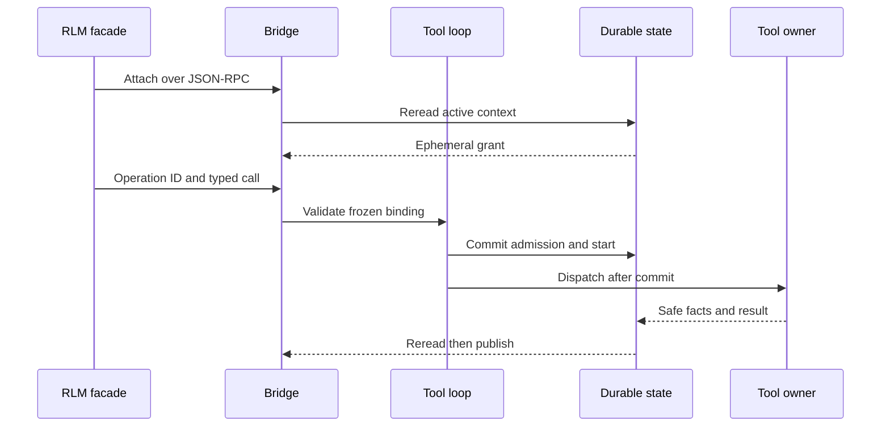

# Mandate Gateway/RLM Bridge

**Approved future design. Not implemented; activation requires an activating specification.**

Owner: architecture 19. Decisions: ADR 0011, ADR 0027, ADR 0032. Research: m4plus_concept.md.

This document owns future Mandate Gateway/RLM attachment, ephemeral bridge grant, ingress operation correlation, safe
bridge-visible delivery, and bridge recovery. It applies only to future Mandate execution; M3/M4 bytes, IDs, UUIDs,
cursors, events, snapshots, queue tickets, provider behavior, replay, recovery, and M4 `ToolCallRecorded ->
tool_execution_unavailable` retain their recorded ordinary semantics. Retained RLM bridge, child, and activity material
remains research provenance and historical-only where it conflicts with architectures 13--18.

## Ownership and one capability path

Architecture 13 owns Mandate lifecycle and fresh admission; 14 is the historical
record of the removed execution-meaning envelope and decoders (ADR 0046); 15 owns the fixed registry, frozen tool
selection, direct admission, model-tool loop, `ToolCallId`, generic effect evidence, and recovery; 16 owns scheduler
reevaluation and readiness-driven admission; 17 owns child Mandates, graph edges, delegation, controls, terminalization,
and verifier authority; 18 owns MCP source, discovery, selection, invocation, and recovery.

This document owns only bridge attachment, grant, operation identity, ingress correlation, safe bridge projection,
replay, cancellation propagation, and bridge-local recovery classification; it is not a second registry, gateway,
daemon, lifecycle, scheduler, tool implementation, child executor, MCP client, provider selector, verifier authority,
persistence authority, sandbox, or OS privilege boundary.

Python/RLM facade code, direct model ingress, kernels, children, MCP servers, providers, adapters, bridge channels,
grants, operation IDs, current configuration, readiness, evidence, and retained RLM identities cannot create or widen
tool, lifecycle, scheduling, child, verifier, or reconciliation authority; every invocation reaches architecture 15's
one daemon-owned, Rust-owned capability path.

## Immutable bridge selection and ephemeral grant

This document owns the semantic fields of the credential-free nested bridge selection in future Mandate meaning (typed
serde JSON, ADR 0046):

```text
MandateBridgeSelectionV1
  gateway_contract_revision
  ingress_family
  safe_projection_revision
  operation_binding_revision
```

It freezes the executable bridge contract, not a live attachment, and excludes a grant, daemon epoch, channel, cursor,
kernel, process, connection, endpoint, credential, registry state, descriptor handle, live readiness, child identity,
and external resource.

After a durable reread proves a supported active Mandate run, exact frozen bridge and tool selections, active model
step, and no cancellation gate, the daemon alone may issue an opaque ephemeral grant:

```text
BridgeAttachmentGrantV1
  opaque_grant_id
  daemon_epoch
  issued_protocol_revision
  execution_kind
  mandate_id
  mandate_revision
  run_id
  model_step_id
```

A grant binds its holder to one daemon-held `SessionId`, `RunId`, originating `TurnId`, and `ModelStepId`
(daemon-assigned, never caller-selected). It is non-secret ephemeral transport evidence for one daemon epoch and live
daemon process, not a credential, durable fact, semantic selection, lifecycle permission, policy decision, child
delegation, verifier authority, or caller-selected identity. It expires on model-step closure, run terminalization or
interruption, cancellation reaching the bridge gate, channel detachment, or daemon exit, and never enters execution
meaning, `RunExecutionMeaningDto`, events, snapshots, model messages, tool facts, model context, logs, diagnostics,
child delegation, or public replay. A persistent Python namespace may outlive an expired grant but must obtain a newly
issued grant before invoking a tool for a later run.

## Attachment, operation identity, and admission

Bridge attachment is a future additive surface on the repository's JSON-RPC 2.0 local protocol (ADR 0045), reusing the
version-only hello, the existing private per-user Unix-socket/Windows-named-pipe endpoint, the **1 MiB message bound**,
and the OS-user access boundary; it requires `model_tool_loop_v1` descriptor/model support whenever the peer receives
future tool-loop facts. An unsupported request fails with a typed error before a partial bridge result, history page,
snapshot, or live notification is delivered. There is no second local listener, TCP/HTTP endpoint, remote attachment,
credential, sandbox, or daemon.

`BridgeOperationId` is the caller-stable idempotency identity of one bridge ingress request, distinct from the
diagnostic `CorrelationIdDto` and the daemon-assigned `ToolCallId`. A durable operation binding records only typed
references:

```text
BridgeOperationV1
  bridge_operation_id
  run_id
  mandate_id
  mandate_revision
  model_step_id
  tool_id
  descriptor_revision
  typed_input_reference
  tool_call_id
  admission_outcome
  attempt_reference
```

It excludes the grant, raw input, Python/Jupyter value, provider value, path, endpoint, credential, SDK object, handle,
process, socket, and raw output. The facade creates and retains `BridgeOperationId`; an in-daemon direct-model ingress
receives an equivalent stable ID from the gateway before admission. The daemon validates the opaque grant, resolves the
selected active descriptor, and assigns the canonical `ToolCallId`, durably binding the operation to the authority
context, `ToolId`, descriptor revision, and the non-public typed input before any external action; the record contains
no grant value, credential, raw input, Python/Jupyter value, provider value, workspace root, implementation handle, or
source path.

Bridge ingress validates the grant/epoch, exact run/revision/model step, frozen bridge and descriptor selection,
operation idempotency, typed input, intrinsic bounds, and live availability, then invokes architecture 15's generic
admission contract. For Mandate execution the only bridge admission outcomes are `Admitted`, typed `Incompatible`, typed
`Unavailable`, an idempotent existing binding, or an operation conflict; `AwaitingConfirmation`, quota, root-origin,
parent, Goal, Skill, provider, or bridge-specific authorization cannot be introduced. Equal operation identity and equal
typed content return the committed binding or safe durable outcome without another `ToolCallId`, child, or effect;
changed reuse fails before mutation or effect.

Reuse with a different authority context, `ToolId`, descriptor revision, or typed input fails pre-effect with the closed
`bridge_operation_conflict`; an equal command returns the saved binding, current admission state, stream attachment, or
terminal safe result and never admits, starts, or executes a second action. `ToolCallId` remains the one canonical
identity for `ToolCallRecorded`, `ToolCallStarted`, `ToolOutputDeltaRecorded`, and `ToolCallResultRecorded` facts.
Before `ToolCallStarted`, a bound operation may report `Admitted` or `AwaitingConfirmation` (the bridge does not decide
the producing policy); on daemon recovery an admitted operation that never reached start records
`InterruptedBeforeStart`; once `ToolCallStarted`, a repeat is read-only and returns only durable evidence, never
re-executing.


```mermaid
sequenceDiagram
  participant F as RLM facade
  participant B as Bridge
  participant L as Tool loop
  participant D as Durable state
  participant T as Tool owner

  F->>B: Attach over JSON-RPC
  B->>D: Reread active context
  D-->>B: Ephemeral grant
  F->>B: Operation ID and typed call
  B->>L: Validate frozen binding
  L->>D: Commit admission and start
  L->>T: Dispatch after commit
  T-->>D: Safe facts and result
  D-->>B: Reread then publish
```

## Effects, delivery, cancellation, and recovery

Architecture 15's `ToolCallStarted` is the only generic durable boundary after which a bridge-routed external effect may
be possible; the bridge introduces no second start marker, result stream, terminal-result frame, or sequence. Fragments
and terminal results remain architecture-15 facts that take a position in the run container journal and use `ToolCallId`
for demultiplexing. This is the general ordering rule, not a bridge-specific concession: no record family may introduce
a further ordering sequence. Publication occurs only after commit and an independent scoped durable reread;
publisher/channel failure cannot roll back a commit or cause redispatch.

Before `ToolCallStarted`, cancellation or recovery records known `CancelledBeforeStart` or `InterruptedBeforeStart`.
After start, a durably proven terminal result remains known; without terminal proof the exact attempt commits a bounded
`Partial` result with its notice and pauses no Mandate, and the next model step proceeds. Known validation, denial,
protocol, tool, or remote failures remain known when terminal effect proof exists.

Channel close, slow-peer resync, and grant expiry do not cancel a run; run cancellation remains owner-controlled and the
bridge only propagates it. The first bridge contract adds no per-`ToolCallId` cancellation command: run cancellation
uses the existing `StopRunCommandDto` and `Running -> Cancelling -> Cancelled` lifecycle, and a valid durable
cancellation/result race is decided by the first committing mutation, with the loser rereading and unable to overwrite.
Cancellation blocks later admissions and model steps; late fragments/results after cancellation, terminalization, grant
expiry, or restart are non-authoritative and cannot append durable facts.

Recovery completes before attachment, readiness, scheduling, or fresh admission: it invalidates old grants, disposes
private bridge-side resources, classifies operations only from durable evidence, and rebuilds safe projections only from
supported records. It never reissues an old grant, re-admits an old operation, reattaches a facade/kernel/task,
retries/reruns a tool, recreates a child, polls remote work, or reconstructs meaning from current registry,
configuration, kernel, process, channel, or graph state. Post-restart lookup and replay are read-only; later work
requires a new `RunId`, fresh admission, a new grant, and new operation identity.

## Child, verifier, MCP, and protocol boundaries

For `sub_agent`, the bridge performs only generic ingress and architecture-15 admission; architecture 17 validates the
parent run and creating `ToolCallId` and atomically creates the child Mandate, edge, delegation snapshot, graph
projections, and parent terminal result. The bridge returns only safe references and result projections and assigns no
child identity, edge, control, message, terminalization, or authority; a child never inherits a live bridge grant,
kernel, provider continuation, MCP selection, connection, process, or unfinished effect, and a child run requires its
own architecture-13 fresh admission.

Bridge-held evidence, a grant, parenthood, or a bridge result never grants or amplifies verifier authority; target
mutation remains architecture 17's exact authority/baseline/evidence operation and an interrupted verifier call's
partial result remains verifier local. Bridge transport may carry only architecture-18 safe MCP projections and cannot
discover, select, invoke, reattach, or recreate MCP work. Bridge replay is a read-only projection layered on the
underlying ordering authorities:
correlated initial replay, typed resync/error, then live post-commit facts after required history completes; it cannot
create a bridge-owned sequence, resend a graph message, start a child, consume verifier authority, rediscover/invoke
MCP, or execute external work.

## Bridge detail: DTOs, limits, and safe failures

The first-scope versioned typed bridge DTO families are:

```text
BridgeRunGrantDto
  opaque_grant_identity
  issued_protocol_revision

BridgeAttachmentResponseDto
  bridge_run_grant
  initial_run_cursor

BridgeInvocationCommandDto
  bridge_run_grant
  bridge_operation_id
  typed_tool_invocation

BridgeInvocationAcceptedDto
  bridge_operation_id
  tool_call_id
  admission_state
```

One attached peer sends correlated attachment, invocation, operation-read, and run-control commands; the daemon sends
correlated responses and uncorrelated `RunStreamFrameDto` values over the same persistent local connection. The
first-scope limits are:

- at most **sixteen** independently admitted bridge operations may be unfinished on one attached peer; a seventeenth
request receives the known pre-effect `bridge_concurrency_limit_exceeded` and starts no external action (a transport
limit only, not a caller permission to invoke a tool, and not a change to the group limit, policy quotas, or tool-effect
serialization);
- **1 MiB** per local frame;
- a **64-frame, 10-second** bounded slow-peer subscription path;
- **512 KiB** per durable fact;
- **4 MiB** of commit-order tool output and successful result content in one group; and
- **256 facts or 512 KiB** per initial-history page.

There is no broader buffer, alternate deadline, truncation rule, or unbounded queue. The bounded slow-peer path never
delays durable execution or healthy subscribers: a slow, resyncing, or detached peer receives typed resynchronization
and is bounded by the 64-frame/10-second path without blocking execution, persistence, or healthy peers. A detached peer
recovers only from durable history: reconnect and request the run from the last accepted cursor, and receive captured
replay, reasoning pages/completion, tool-history pages/completion, then later live frames in the selected order; if
either history class is absent, its pages and completion frame are omitted and the remaining frames retain this order.
The bridge never treats channel state as authoritative, persists a last-published cursor, or repeats external work.

The closed bridge safe failures through `ErrorDto` are:

```text
daemon_tool_gateway_required
bridge_authority_unavailable
bridge_authority_expired
bridge_operation_conflict
bridge_operation_not_found
bridge_concurrency_limit_exceeded
```

They disclose no credential, path, grant value, raw input, Python/Jupyter value, provider resource, process topology, or
implementation detail.

## Compatibility, dependencies, and non-goals

M3 session replay and M4 run streaming remain unchanged. M4 provider kinds remain `openrouter` and
`generic-chat-completion-api`; model names do not select a provider, bridge contract, or execution kind. Historical M4
tool calls remain denial evidence. Historical M3/M4 and retained RLM records gain no bridge grant, operation, Mandate,
child edge, verifier authority, MCP selection, Skill, Goal, activity, policy, or execution-kind state, and no current
mutable state may reconstruct missing bridge meaning. Retained RLM `SubAgentId`, `RlmParentLinkDto`, session/run-rooted
trees, policy inheritance, queues, activity identities, and product limits remain historical only; no later bridge may
reference exact legacy bytes, rewrite, normalize, make old work Mandate-executable, or synthesize future state (ADR
0038).

This document depends on architectures 13--18 and decisions 0001, 0002, 0004, 0006, 0007, 0008, 0009, and 0010. Related
owners: 20 owns kernel process/namespace/checkpoint lifecycle; 21 owns Goal, Skill, context, memory, and compaction
(bridge-delivered context is safe immutable projection only); 22 owns provider profile/capability semantics (bridge
delivery uses only safe existing provider facts); 23 owns ordinary Session forks (no bridge grant or operation crosses
one); 24 owns activity/UI projections (bridge grants, operations, and resources never become activity authority or
public activity payload). It does not define kernel lifecycle, RLM executor or recursion topology, provider evolution,
Skills, Goals, context, session forks, activity/UI, direct MCP administration, SQL, migrations, wire tags, crates,
Cargo, Makefile/CI, or production implementation.

## Required evidence before implementation

Evidence: activating specification per [architecture 12](12-quality-gates-and-makefile.md).
